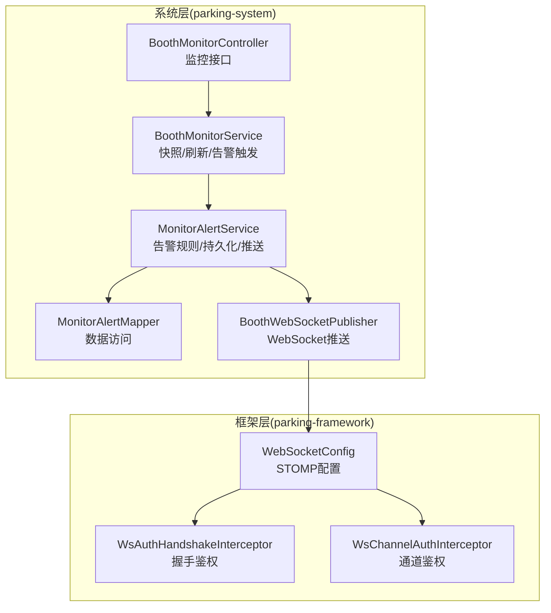
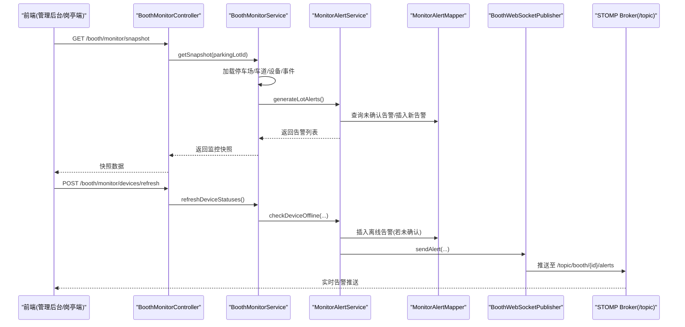
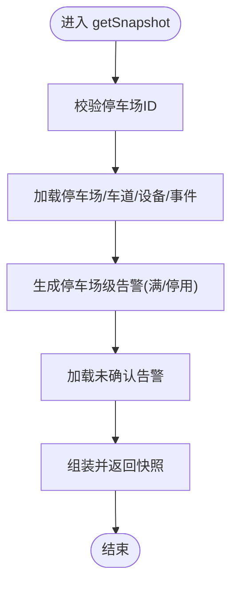
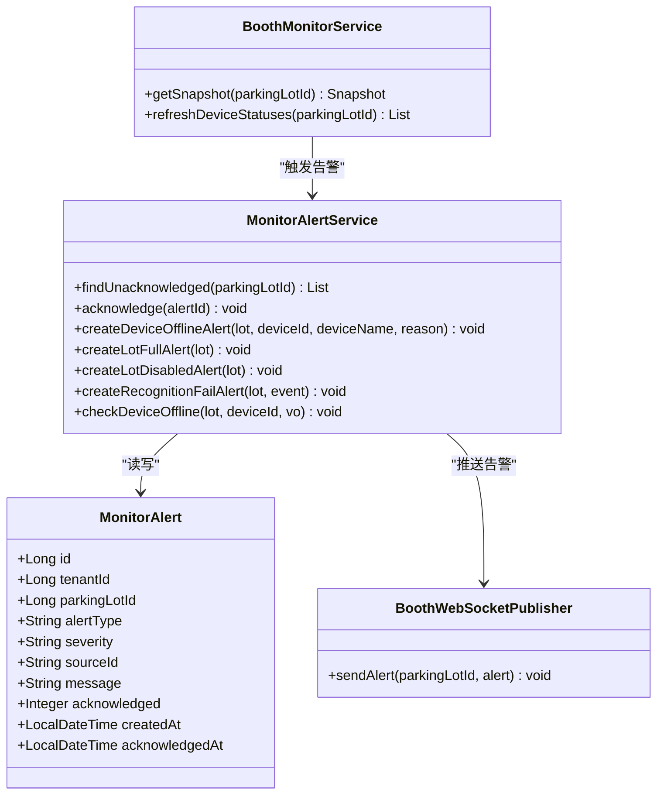
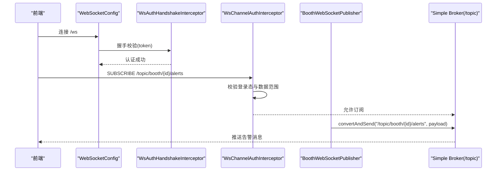
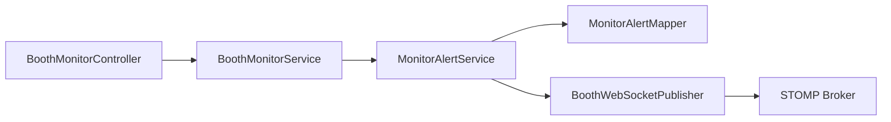

# 监控告警

<cite>
**本文引用的文件**   
- [BoothMonitorController.java](file://parking-system/src/main/java/com/jushan/system/controller/BoothMonitorController.java)
- [BoothMonitorService.java](file://parking-system/src/main/java/com/jushan/system/service/BoothMonitorService.java)
- [MonitorAlertService.java](file://parking-system/src/main/java/com/jushan/system/service/MonitorAlertService.java)
- [MonitorAlert.java](file://parking-system/src/main/java/com/jushan/system/entity/MonitorAlert.java)
- [MonitorAlertMapper.java](file://parking-system/src/main/java/com/jushan/system/mapper/MonitorAlertMapper.java)
- [BoothWebSocketPublisher.java](file://parking-system/src/main/java/com/jushan/system/ws/BoothWebSocketPublisher.java)
- [WebSocketConfig.java](file://parking-framework/src/main/java/com/jushan/framework/ws/WebSocketConfig.java)
- [WsAuthHandshakeInterceptor.java](file://parking-framework/src/main/java/com/jushan/framework/ws/WsAuthHandshakeInterceptor.java)
- [WsChannelAuthInterceptor.java](file://parking-framework/src/main/java/com/jushan/framework/ws/WsChannelAuthInterceptor.java)
- [DeviceAccessClientRobustnessTest.java](file://parking-boot/src/test/java/com/jushan/boot/client/DeviceAccessClientRobustnessTest.java)
</cite>

## 目录
1. [简介](#简介)
2. [项目结构](#项目结构)
3. [核心组件](#核心组件)
4. [架构总览](#架构总览)
5. [详细组件分析](#详细组件分析)
6. [依赖关系分析](#依赖关系分析)
7. [性能与容量规划](#性能与容量规划)
8. [故障排查指南](#故障排查指南)
9. [结论](#结论)
10. [附录：指标、阈值与通知策略建议](#附录指标阈值与通知策略建议)

## 简介
本文件面向“监控告警”能力，覆盖以下目标：
- 关键业务指标的采集方法（API 响应时间、错误率、吞吐等）
- 告警规则配置（阈值、级别、通知渠道）
- 实时监控面板使用（设备状态、业务指标可视化、异常事件追踪）
- WebSocket 实时推送机制的配置与使用场景
- 告警通知策略与故障升级流程

说明：
- 当前仓库已实现“岗亭监控”的快照、刷新、确认、以及基于 STOMP over WebSocket 的实时推送。
- 指标采集在测试中通过 Micrometer 计数器验证了设备访问客户端的错误计数；生产环境可在此基础上扩展更多 KPI。

## 项目结构
围绕监控告警的核心代码分布在 system 与 framework 两个模块：
- parking-system：业务服务层（控制器、服务、实体、WebSocket 推送器）
- parking-framework：WebSocket 基础设施（STOMP 配置、握手鉴权、通道鉴权）

图表来源
- [BoothMonitorController.java:1-76](file://parking-system/src/main/java/com/jushan/system/controller/BoothMonitorController.java#L1-L76)
- [BoothMonitorService.java:1-292](file://parking-system/src/main/java/com/jushan/system/service/BoothMonitorService.java#L1-L292)
- [MonitorAlertService.java:1-232](file://parking-system/src/main/java/com/jushan/system/service/MonitorAlertService.java#L1-L232)
- [MonitorAlertMapper.java:1-15](file://parking-system/src/main/java/com/jushan/system/mapper/MonitorAlertMapper.java#L1-L15)
- [BoothWebSocketPublisher.java:1-177](file://parking-system/src/main/java/com/jushan/system/ws/BoothWebSocketPublisher.java#L1-L177)
- [WebSocketConfig.java:1-92](file://parking-framework/src/main/java/com/jushan/framework/ws/WebSocketConfig.java#L1-L92)
- [WsAuthHandshakeInterceptor.java:1-140](file://parking-framework/src/main/java/com/jushan/framework/ws/WsAuthHandshakeInterceptor.java#L1-L140)
- [WsChannelAuthInterceptor.java:1-216](file://parking-framework/src/main/java/com/jushan/framework/ws/WsChannelAuthInterceptor.java#L1-L216)

章节来源
- [BoothMonitorController.java:1-76](file://parking-system/src/main/java/com/jushan/system/controller/BoothMonitorController.java#L1-L76)
- [BoothMonitorService.java:1-292](file://parking-system/src/main/java/com/jushan/system/service/BoothMonitorService.java#L1-L292)
- [MonitorAlertService.java:1-232](file://parking-system/src/main/java/com/jushan/system/service/MonitorAlertService.java#L1-L232)
- [WebSocketConfig.java:1-92](file://parking-framework/src/main/java/com/jushan/framework/ws/WebSocketConfig.java#L1-L92)

## 核心组件
- 监控接口层
  - 提供初始化快照、设备状态刷新、异常提醒确认等 REST 接口，用于前端面板拉取数据与操作。
- 监控服务层
  - 聚合停车场、车道、设备、识别事件等数据，生成监控快照；在刷新时检查设备离线并触发告警。
- 告警服务层
  - 定义告警类型与级别，去重检测未确认告警，持久化并推送至 WebSocket。
- WebSocket 推送层
  - 按停车场维度广播识别事件、车位变化、设备状态、异常提醒。
- WebSocket 基础设施
  - STOMP 端点、消息代理、握手与通道级鉴权，确保仅授权用户订阅私有主题。

章节来源
- [BoothMonitorController.java:1-76](file://parking-system/src/main/java/com/jushan/system/controller/BoothMonitorController.java#L1-L76)
- [BoothMonitorService.java:1-292](file://parking-system/src/main/java/com/jushan/system/service/BoothMonitorService.java#L1-L292)
- [MonitorAlertService.java:1-232](file://parking-system/src/main/java/com/jushan/system/service/MonitorAlertService.java#L1-L232)
- [BoothWebSocketPublisher.java:1-177](file://parking-system/src/main/java/com/jushan/system/ws/BoothWebSocketPublisher.java#L1-L177)
- [WebSocketConfig.java:1-92](file://parking-framework/src/main/java/com/jushan/framework/ws/WebSocketConfig.java#L1-L92)
- [WsAuthHandshakeInterceptor.java:1-140](file://parking-framework/src/main/java/com/jushan/framework/ws/WsAuthHandshakeInterceptor.java#L1-L140)
- [WsChannelAuthInterceptor.java:1-216](file://parking-framework/src/main/java/com/jushan/framework/ws/WsChannelAuthInterceptor.java#L1-L216)

## 架构总览
下图展示从 REST 到数据库与 WebSocket 的整体链路，包括告警生成与推送。

图表来源
- [BoothMonitorController.java:1-76](file://parking-system/src/main/java/com/jushan/system/controller/BoothMonitorController.java#L1-L76)
- [BoothMonitorService.java:1-292](file://parking-system/src/main/java/com/jushan/system/service/BoothMonitorService.java#L1-L292)
- [MonitorAlertService.java:1-232](file://parking-system/src/main/java/com/jushan/system/service/MonitorAlertService.java#L1-L232)
- [MonitorAlertMapper.java:1-15](file://parking-system/src/main/java/com/jushan/system/mapper/MonitorAlertMapper.java#L1-L15)
- [BoothWebSocketPublisher.java:1-177](file://parking-system/src/main/java/com/jushan/system/ws/BoothWebSocketPublisher.java#L1-L177)
- [WebSocketConfig.java:1-92](file://parking-framework/src/main/java/com/jushan/framework/ws/WebSocketConfig.java#L1-L92)

## 详细组件分析

### 监控接口与快照流程
- 初始化快照
  - 获取停车场信息、车道列表、最近识别事件、设备状态快照，并在快照生成阶段触发停车场级告警（如车位已满、停车场停用）。
- 设备状态刷新
  - 批量查询设备最新状态，对离线或不可达设备触发离线告警。
- 异常确认
  - 将未确认告警标记为已确认，并记录确认时间。

图表来源
- [BoothMonitorService.java:79-100](file://parking-system/src/main/java/com/jushan/system/service/BoothMonitorService.java#L79-L100)
- [BoothMonitorService.java:231-243](file://parking-system/src/main/java/com/jushan/system/service/BoothMonitorService.java#L231-L243)
- [BoothMonitorService.java:253-257](file://parking-system/src/main/java/com/jushan/system/service/BoothMonitorService.java#L253-L257)

章节来源
- [BoothMonitorController.java:44-74](file://parking-system/src/main/java/com/jushan/system/controller/BoothMonitorController.java#L44-L74)
- [BoothMonitorService.java:79-100](file://parking-system/src/main/java/com/jushan/system/service/BoothMonitorService.java#L79-L100)
- [BoothMonitorService.java:110-133](file://parking-system/src/main/java/com/jushan/system/service/BoothMonitorService.java#L110-L133)
- [BoothMonitorService.java:231-243](file://parking-system/src/main/java/com/jushan/system/service/BoothMonitorService.java#L231-L243)
- [BoothMonitorService.java:253-257](file://parking-system/src/main/java/com/jushan/system/service/BoothMonitorService.java#L253-L257)

### 告警规则与级别
- 告警类型
  - 设备离线、车位已满、停车场停用、识别失败。
- 告警级别
  - WARNING（警告）、CRITICAL（严重）。
- 去重策略
  - 同一停车场+同类型+同来源（可选）且未确认的告警不会重复创建。
- 触发时机
  - 快照生成时检查停车场状态；设备刷新时检查设备在线性；识别失败路径由上层调用创建。

图表来源
- [MonitorAlert.java:1-101](file://parking-system/src/main/java/com/jushan/system/entity/MonitorAlert.java#L1-L101)
- [MonitorAlertService.java:1-232](file://parking-system/src/main/java/com/jushan/system/service/MonitorAlertService.java#L1-L232)
- [BoothMonitorService.java:1-292](file://parking-system/src/main/java/com/jushan/system/service/BoothMonitorService.java#L1-L292)
- [BoothWebSocketPublisher.java:1-177](file://parking-system/src/main/java/com/jushan/system/ws/BoothWebSocketPublisher.java#L1-L177)

章节来源
- [MonitorAlert.java:21-37](file://parking-system/src/main/java/com/jushan/system/entity/MonitorAlert.java#L21-L37)
- [MonitorAlertService.java:96-137](file://parking-system/src/main/java/com/jushan/system/service/MonitorAlertService.java#L96-L137)
- [MonitorAlertService.java:163-178](file://parking-system/src/main/java/com/jushan/system/service/MonitorAlertService.java#L163-L178)
- [MonitorAlertService.java:182-205](file://parking-system/src/main/java/com/jushan/system/service/MonitorAlertService.java#L182-L205)

### WebSocket 实时推送机制
- 端点与前缀
  - STOMP 端点：/ws
  - 应用前缀：/app/**（客户端→服务端）
  - 广播前缀：/topic/**（服务端→客户端）
  - 私信前缀：/user/**（服务端→特定用户）
- 安全控制
  - 握手拦截器：校验 token（URL 参数或 Authorization 头），拒绝匿名连接。
  - 通道拦截器：对 SUBSCRIBE/SEND 进行权限校验，支持按 topic 前缀的数据范围检查。
- 推送主题
  - 识别事件：/topic/booth/{parkingLotId}/events
  - 车位变化：/topic/booth/{parkingLotId}/spaces
  - 设备状态：/topic/booth/{parkingLotId}/device-status
  - 异常提醒：/topic/booth/{parkingLotId}/alerts

图表来源
- [WebSocketConfig.java:50-83](file://parking-framework/src/main/java/com/jushan/framework/ws/WebSocketConfig.java#L50-L83)
- [WsAuthHandshakeInterceptor.java:51-108](file://parking-framework/src/main/java/com/jushan/framework/ws/WsAuthHandshakeInterceptor.java#L51-L108)
- [WsChannelAuthInterceptor.java:123-164](file://parking-framework/src/main/java/com/jushan/framework/ws/WsChannelAuthInterceptor.java#L123-L164)
- [BoothWebSocketPublisher.java:142-161](file://parking-system/src/main/java/com/jushan/system/ws/BoothWebSocketPublisher.java#L142-L161)

章节来源
- [WebSocketConfig.java:1-92](file://parking-framework/src/main/java/com/jushan/framework/ws/WebSocketConfig.java#L1-L92)
- [WsAuthHandshakeInterceptor.java:1-140](file://parking-framework/src/main/java/com/jushan/framework/ws/WsAuthHandshakeInterceptor.java#L1-L140)
- [WsChannelAuthInterceptor.java:1-216](file://parking-framework/src/main/java/com/jushan/framework/ws/WsChannelAuthInterceptor.java#L1-L216)
- [BoothWebSocketPublisher.java:1-177](file://parking-system/src/main/java/com/jushan/system/ws/BoothWebSocketPublisher.java#L1-L177)

### 实时监控面板使用方法
- 设备状态监控
  - 调用刷新接口获取最新设备状态；WebSocket 会推送设备状态变更。
- 业务指标可视化
  - 通过快照接口获取停车场摘要、车道、最近识别事件；结合 WebSocket 增量更新。
- 异常事件追踪
  - 快照中包含未确认告警列表；可通过确认接口处理告警；WebSocket 推送新增告警。

章节来源
- [BoothMonitorController.java:44-74](file://parking-system/src/main/java/com/jushan/system/controller/BoothMonitorController.java#L44-L74)
- [BoothMonitorService.java:79-100](file://parking-system/src/main/java/com/jushan/system/service/BoothMonitorService.java#L79-L100)
- [BoothMonitorService.java:110-133](file://parking-system/src/main/java/com/jushan/system/service/BoothMonitorService.java#L110-L133)
- [BoothMonitorService.java:253-257](file://parking-system/src/main/java/com/jushan/system/service/BoothMonitorService.java#L253-L257)

## 依赖关系分析
- 组件耦合
  - Controller 依赖 Service；Service 依赖 Mapper 与 WebSocket 推送器；告警服务负责规则与持久化。
- 外部依赖
  - STOMP Simple Broker（内置）；Sa-Token 会话上下文；MyBatis-Plus 数据访问。
- 潜在风险
  - 推送失败不应阻断主事务（已在推送器中捕获异常）。
  - 握手与通道鉴权必须开启，避免匿名订阅。

图表来源
- [BoothMonitorController.java:1-76](file://parking-system/src/main/java/com/jushan/system/controller/BoothMonitorController.java#L1-L76)
- [BoothMonitorService.java:1-292](file://parking-system/src/main/java/com/jushan/system/service/BoothMonitorService.java#L1-L292)
- [MonitorAlertService.java:1-232](file://parking-system/src/main/java/com/jushan/system/service/MonitorAlertService.java#L1-L232)
- [MonitorAlertMapper.java:1-15](file://parking-system/src/main/java/com/jushan/system/mapper/MonitorAlertMapper.java#L1-L15)
- [BoothWebSocketPublisher.java:1-177](file://parking-system/src/main/java/com/jushan/system/ws/BoothWebSocketPublisher.java#L1-L177)

章节来源
- [BoothMonitorController.java:1-76](file://parking-system/src/main/java/com/jushan/system/controller/BoothMonitorController.java#L1-L76)
- [BoothMonitorService.java:1-292](file://parking-system/src/main/java/com/jushan/system/service/BoothMonitorService.java#L1-L292)
- [MonitorAlertService.java:1-232](file://parking-system/src/main/java/com/jushan/system/service/MonitorAlertService.java#L1-L232)
- [MonitorAlertMapper.java:1-15](file://parking-system/src/main/java/com/jushan/system/mapper/MonitorAlertMapper.java#L1-L15)
- [BoothWebSocketPublisher.java:1-177](file://parking-system/src/main/java/com/jushan/system/ws/BoothWebSocketPublisher.java#L1-L177)

## 性能与容量规划
- 快照与刷新
  - 快照包含多表聚合，建议在高频刷新场景下缓存热点数据或使用增量更新。
  - 设备状态刷新会触发远程设备访问，存在一定开销，应限制刷新频率。
- WebSocket 推送
  - 推送失败不影响主业务，但需关注 Broker 负载与连接数增长。
- 指标采集
  - 设备访问客户端已通过计数器统计成功/失败次数，可作为错误率与吞吐的基础指标来源。

[本节为通用指导，不直接分析具体文件]

## 故障排查指南
- 无法建立 WebSocket 连接
  - 检查握手是否携带有效 token；确认握手拦截器未拒绝连接。
- 无法订阅私有主题
  - 确认通道拦截器已完成认证与数据范围校验；检查租户与用户类型上下文是否正确回填。
- 告警未推送
  - 检查告警是否被去重（是否存在未确认的同类型告警）；确认推送器日志是否有异常。
- 设备状态不准确
  - 刷新接口可能受设备侧超时或错误影响；参考设备访问客户端的错误计数与降级行为。

章节来源
- [WsAuthHandshakeInterceptor.java:51-108](file://parking-framework/src/main/java/com/jushan/framework/ws/WsAuthHandshakeInterceptor.java#L51-L108)
- [WsChannelAuthInterceptor.java:123-164](file://parking-framework/src/main/java/com/jushan/framework/ws/WsChannelAuthInterceptor.java#L123-L164)
- [MonitorAlertService.java:182-205](file://parking-system/src/main/java/com/jushan/system/service/MonitorAlertService.java#L182-L205)
- [DeviceAccessClientRobustnessTest.java:105-198](file://parking-boot/src/test/java/com/jushan/boot/client/DeviceAccessClientRobustnessTest.java#L105-L198)

## 结论
本项目已具备完善的“岗亭监控”与“异常告警”基础能力：
- 通过 REST 接口提供快照与刷新，结合 WebSocket 实现实时推送。
- 告警规则清晰、级别明确，具备去重与确认机制。
- WebSocket 基础设施完善，握手与通道级鉴权保障安全。
- 指标采集已有基础（设备访问错误计数），可在生产环境扩展更多 KPI 并接入统一监控平台。

[本节为总结，不直接分析具体文件]

## 附录：指标、阈值与通知策略建议
- 关键业务指标采集建议
  - API 响应时间：以 P95/P99 作为延迟指标，设置阈值（例如 P95 > 500ms）。
  - 错误率：基于设备访问客户端的计数器统计错误比例，设置阈值（例如错误率 > 1%）。
  - 吞吐量：统计单位时间内请求量与事件量，评估容量瓶颈。
- 告警规则与阈值（示例）
  - 设备离线：持续 N 分钟离线即告警（CRITICAL）。
  - 车位已满：剩余车位 ≤ 0 持续 T 分钟（WARNING）。
  - 停车场停用：状态变为停用立即告警（CRITICAL）。
  - 识别失败：失败率超过阈值（WARNING）。
- 告警级别定义
  - WARNING：需要关注但不紧急。
  - CRITICAL：需要立即处置。
- 通知渠道配置（建议）
  - 内部系统：WebSocket 推送至岗亭端。
  - 外部渠道：邮件、短信、企业 IM（后续可扩展）。
- 故障升级流程（建议）
  - 首次告警 → 自动通知值班人员。
  - 持续未确认/未恢复 → 升级至二线/三线团队。
  - 重大故障 → 启动应急指挥群与电话通知。

[本节为通用建议，不直接分析具体文件]