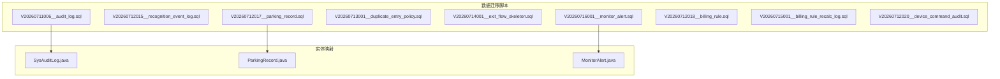
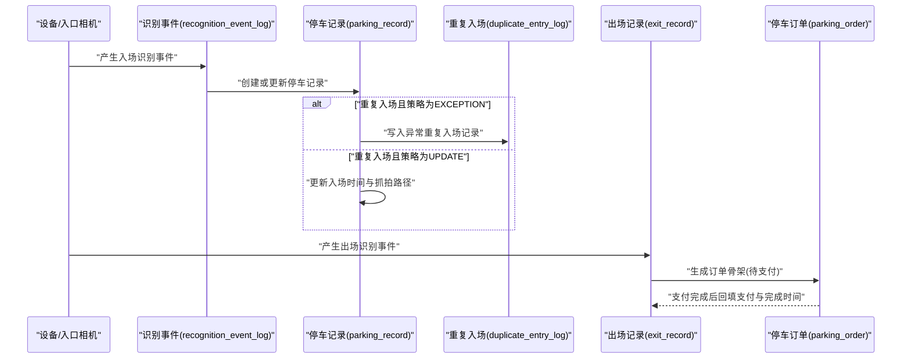
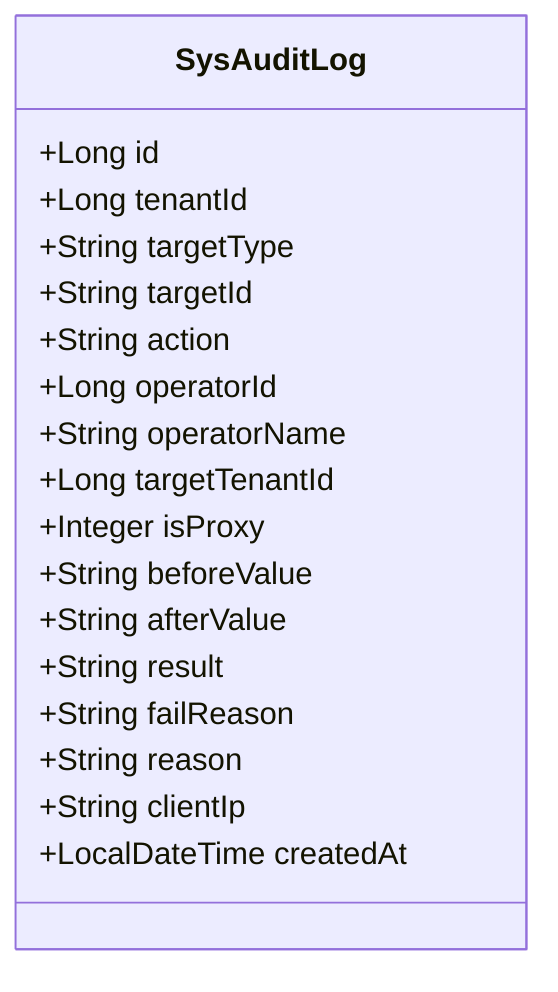
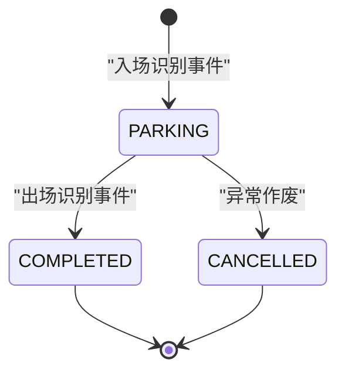
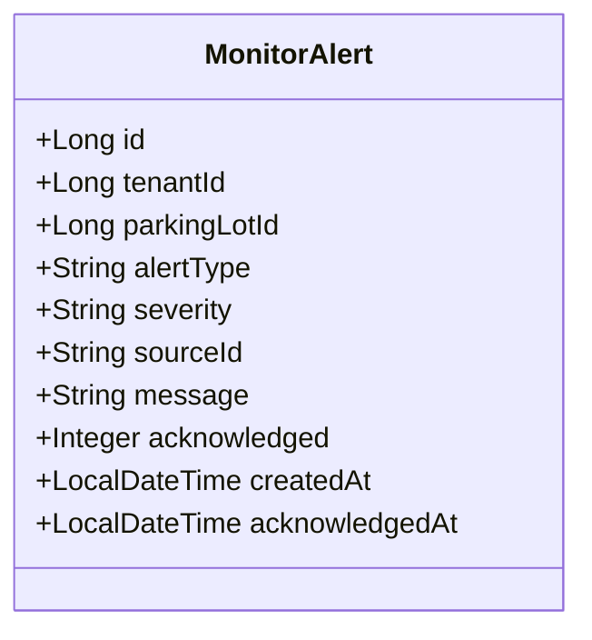
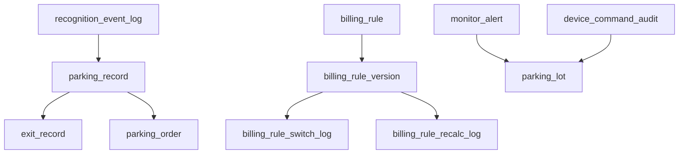

# 业务表结构设计

<cite>
**本文引用的文件**   
- [V20260711006__audit_log.sql](file://parking-boot/src/main/resources/db/migration/V20260711006__audit_log.sql)
- [V20260712015__recognition_event_log.sql](file://parking-boot/src/main/resources/db/migration/V20260712015__recognition_event_log.sql)
- [V20260712017__parking_record.sql](file://parking-boot/src/main/resources/db/migration/V20260712017__parking_record.sql)
- [V20260713001__duplicate_entry_policy.sql](file://parking-boot/src/main/resources/db/migration/V20260713001__duplicate_entry_policy.sql)
- [V20260714001__exit_flow_skeleton.sql](file://parking-boot/src/main/resources/db/migration/V20260714001__exit_flow_skeleton.sql)
- [V20260716001__monitor_alert.sql](file://parking-boot/src/main/resources/db/migration/V20260716001__monitor_alert.sql)
- [V20260712018__billing_rule.sql](file://parking-boot/src/main/resources/db/migration/V20260712018__billing_rule.sql)
- [V20260715001__billing_rule_recalc_log.sql](file://parking-boot/src/main/resources/db/migration/V20260715001__billing_rule_recalc_log.sql)
- [V20260712020__device_command_audit.sql](file://parking-boot/src/main/resources/db/migration/V20260712020__device_command_audit.sql)
- [SysAuditLog.java](file://parking-system/src/main/java/com/jushan/system/entity/SysAuditLog.java)
- [ParkingRecord.java](file://parking-system/src/main/java/com/jushan/system/entity/ParkingRecord.java)
- [MonitorAlert.java](file://parking-system/src/main/java/com/jushan/system/entity/MonitorAlert.java)
</cite>

## 目录
1. [引言](#引言)
2. [项目结构](#项目结构)
3. [核心组件](#核心组件)
4. [架构总览](#架构总览)
5. [详细组件分析](#详细组件分析)
6. [依赖分析](#依赖分析)
7. [性能考虑](#性能考虑)
8. [故障排查指南](#故障排查指南)
9. [结论](#结论)
10. [附录](#附录)

## 引言
本文件聚焦于停车SaaS平台的核心业务表结构设计，覆盖审计日志、停车记录、监控告警等关键领域。文档从数据模型出发，解释业务数据的生命周期管理（创建、更新、归档与删除）、状态机在数据库中的实现方式（状态字段设计、转换约束与规则验证）、查询优化策略（索引设计与查询模式）、备份恢复与一致性保障机制，以及报表支持的数据模型设计。目标是帮助研发、运维与产品人员快速理解并正确扩展系统的数据层能力。

## 项目结构
本项目采用多模块工程组织，数据库变更通过 Flyway 迁移脚本管理，实体类位于 parking-system 模块中，对应 DDL 位于 parking-boot 的 db/migration 目录。本次文档重点涉及的迁移脚本与实体如下：
- 审计与命令审计：sys_audit_log、device_command_audit
- 识别事件与入场链路：recognition_event_log、parking_record、duplicate_entry_log
- 出场与订单骨架：exit_record、parking_order
- 监控告警：monitor_alert
- 收费规则与版本：billing_rule、billing_rule_version、billing_rule_switch_log、billing_rule_recalc_log

图表来源
- [V20260711006__audit_log.sql:1-37](file://parking-boot/src/main/resources/db/migration/V20260711006__audit_log.sql#L1-L37)
- [V20260712015__recognition_event_log.sql:1-36](file://parking-boot/src/main/resources/db/migration/V20260712015__recognition_event_log.sql#L1-L36)
- [V20260712017__parking_record.sql:1-38](file://parking-boot/src/main/resources/db/migration/V20260712017__parking_record.sql#L1-L38)
- [V20260713001__duplicate_entry_policy.sql:1-42](file://parking-boot/src/main/resources/db/migration/V20260713001__duplicate_entry_policy.sql#L1-L42)
- [V20260714001__exit_flow_skeleton.sql:1-65](file://parking-boot/src/main/resources/db/migration/V20260714001__exit_flow_skeleton.sql#L1-L65)
- [V20260716001__monitor_alert.sql:1-15](file://parking-boot/src/main/resources/db/migration/V20260716001__monitor_alert.sql#L1-L15)
- [V20260712018__billing_rule.sql:1-82](file://parking-boot/src/main/resources/db/migration/V20260712018__billing_rule.sql#L1-L82)
- [V20260715001__billing_rule_recalc_log.sql:1-23](file://parking-boot/src/main/resources/db/migration/V20260715001__billing_rule_recalc_log.sql#L1-L23)
- [V20260712020__device_command_audit.sql:1-49](file://parking-boot/src/main/resources/db/migration/V20260712020__device_command_audit.sql#L1-L49)
- [SysAuditLog.java:1-121](file://parking-system/src/main/java/com/jushan/system/entity/SysAuditLog.java#L1-L121)
- [ParkingRecord.java:1-127](file://parking-system/src/main/java/com/jushan/system/entity/ParkingRecord.java#L1-L127)
- [MonitorAlert.java:1-101](file://parking-system/src/main/java/com/jushan/system/entity/MonitorAlert.java#L1-L101)

章节来源
- [V20260711006__audit_log.sql:1-37](file://parking-boot/src/main/resources/db/migration/V20260711006__audit_log.sql#L1-L37)
- [V20260712017__parking_record.sql:1-38](file://parking-boot/src/main/resources/db/migration/V20260712017__parking_record.sql#L1-L38)
- [V20260716001__monitor_alert.sql:1-15](file://parking-boot/src/main/resources/db/migration/V20260716001__monitor_alert.sql#L1-L15)

## 核心组件
本节对三类核心业务表进行结构化说明：审计日志、停车记录、监控告警。每类包含字段要点、索引策略、状态/枚举设计、关联关系与典型查询场景。

- 审计日志（sys_audit_log）
  - 关键字段：目标类型、目标ID、操作类型、真实操作人、是否代操作、前后值（JSON）、结果、失败原因、原因备注、客户端IP、时间戳
  - 索引：按租户、目标类型+目标ID、操作人、是否代操作、时间、操作类型
  - 用途：超级管理员代操作、人工开闸、费用调整等高风险操作的完整审计追踪
  - 典型查询：按租户+时间范围检索；按操作人检索；按目标对象检索

- 停车记录（parking_record）
  - 关键字段：租户、停车场、车道、设备、标准化车牌、入场事件ID、状态（PARKING/COMPLETED/CANCELLED）、入场时间、出场时间、收费规则版本、入场抓拍路径、出场事件ID
  - 唯一性约束：MySQL 8 功能唯一索引 uk_active_parking，保证同车同停车场仅一条有效在场记录
  - 辅助索引：按停车场+状态、车牌、入场事件ID
  - 典型查询：当前在场车辆列表；按车牌查询在场记录；按入场事件追溯

- 监控告警（monitor_alert）
  - 关键字段：租户、停车场、异常类型（设备离线/车位已满/停车场停用/识别失败）、严重程度（警告/严重）、来源ID、描述、是否已确认、创建时间、确认时间
  - 索引：按停车场+是否已确认、创建时间
  - 典型查询：未确认告警列表；按停车场统计告警数量；按严重程度筛选

章节来源
- [V20260711006__audit_log.sql:1-37](file://parking-boot/src/main/resources/db/migration/V20260711006__audit_log.sql#L1-L37)
- [V20260712017__parking_record.sql:1-38](file://parking-boot/src/main/resources/db/migration/V20260712017__parking_record.sql#L1-L38)
- [V20260716001__monitor_alert.sql:1-15](file://parking-boot/src/main/resources/db/migration/V20260716001__monitor_alert.sql#L1-L15)

## 架构总览
下图展示入场到出场的主链路数据流，包括识别事件、停车记录、重复入场处理、出场记录与订单骨架之间的关系。

图表来源
- [V20260712015__recognition_event_log.sql:1-36](file://parking-boot/src/main/resources/db/migration/V20260712015__recognition_event_log.sql#L1-L36)
- [V20260712017__parking_record.sql:1-38](file://parking-boot/src/main/resources/db/migration/V20260712017__parking_record.sql#L1-L38)
- [V20260713001__duplicate_entry_policy.sql:1-42](file://parking-boot/src/main/resources/db/migration/V20260713001__duplicate_entry_policy.sql#L1-L42)
- [V20260714001__exit_flow_skeleton.sql:1-65](file://parking-boot/src/main/resources/db/migration/V20260714001__exit_flow_skeleton.sql#L1-L65)

## 详细组件分析

### 审计日志（sys_audit_log）
- 设计要点
  - 记录高风险操作的“谁、对什么、做了什么、结果如何”，支持代操作场景（operator_id 与 target_tenant_id 分离）
  - before_value/after_value 使用 JSON 存储，便于差异对比与回溯
  - result 字段明确 SUCCESS/FAILED/UNCERTAIN，fail_reason 用于失败归因
- 索引与查询
  - 针对高频维度建立索引：tenant_id、target_type+target_id、operator_id、is_proxy、created_at、action
  - 典型查询：按租户+时间范围检索；按操作人检索；按目标对象检索；按是否代操作筛选
- 生命周期管理
  - 创建：高风险操作发生时同步落库
  - 更新：一般不更新，必要时以追加新记录的方式保留历史
  - 归档与删除：建议按 created_at 分区或按月归档至冷存储；生产环境可设置保留期后批量清理
- 状态机与约束
  - 无复杂状态机，但需确保 action/result/fail_reason 的组合语义一致
- 一致性保障
  - 审计记录应作为事务的最终落盘步骤，避免业务成功而审计缺失

图表来源
- [V20260711006__audit_log.sql:1-37](file://parking-boot/src/main/resources/db/migration/V20260711006__audit_log.sql#L1-L37)
- [SysAuditLog.java:1-121](file://parking-system/src/main/java/com/jushan/system/entity/SysAuditLog.java#L1-L121)

章节来源
- [V20260711006__audit_log.sql:1-37](file://parking-boot/src/main/resources/db/migration/V20260711006__audit_log.sql#L1-L37)
- [SysAuditLog.java:1-121](file://parking-system/src/main/java/com/jushan/system/entity/SysAuditLog.java#L1-L121)

### 停车记录（parking_record）
- 设计要点
  - 主键自增，租户与停车场强关联，标准化车牌号统一格式
  - 状态字段 status：PARKING（在场）、COMPLETED（已完成）、CANCELLED（已作废）
  - 入场事件 entry_event_id 与出场事件 exit_event_id 提供端到端追溯
  - 收费规则版本 fee_rule_version 占位，后续计费引擎接入
- 并发与一致性
  - 使用 MySQL 8 功能唯一索引 uk_active_parking 保证同车同停车场仅一条 PARKING 记录，数据库级防止重复入场
  - 状态变更建议使用条件更新（如 WHERE status='PARKING'），禁止整实体覆盖
- 重复入场策略
  - REJECT：拒绝并记录异常（默认）
  - UPDATE：更新原记录的入场时间与抓拍路径
  - EXCEPTION：创建 duplicate_entry_log 异常记录，不阻止入场
- 索引与查询
  - 辅助索引：idx_parking_record_lot_status、idx_parking_record_plate、idx_parking_record_entry_event
  - 典型查询：当前在场车辆、按车牌查询在场记录、按入场事件追溯
- 生命周期管理
  - 创建：入场识别事件触发
  - 更新：出场时更新 exit_time、status=COMPLETED，并写入 exit_event_id
  - 归档与删除：长期历史可按 parking_lot_id+updated_at 归档；删除前需校验无关联订单与出场记录
- 状态机与约束
  - 状态转换：PARKING → COMPLETED；PARKING → CANCELLED（异常作废）
  - 约束：同一车在同一停车场不允许同时存在多条 PARKING 记录

图表来源
- [V20260712017__parking_record.sql:1-38](file://parking-boot/src/main/resources/db/migration/V20260712017__parking_record.sql#L1-L38)
- [V20260713001__duplicate_entry_policy.sql:1-42](file://parking-boot/src/main/resources/db/migration/V20260713001__duplicate_entry_policy.sql#L1-L42)
- [ParkingRecord.java:1-127](file://parking-system/src/main/java/com/jushan/system/entity/ParkingRecord.java#L1-L127)

章节来源
- [V20260712017__parking_record.sql:1-38](file://parking-boot/src/main/resources/db/migration/V20260712017__parking_record.sql#L1-L38)
- [V20260713001__duplicate_entry_policy.sql:1-42](file://parking-boot/src/main/resources/db/migration/V20260713001__duplicate_entry_policy.sql#L1-L42)
- [ParkingRecord.java:1-127](file://parking-system/src/main/java/com/jushan/system/entity/ParkingRecord.java#L1-L127)

### 监控告警（monitor_alert）
- 设计要点
  - 异常类型：DEVICE_OFFLINE、LOT_FULL、LOT_DISABLED、RECOGNITION_FAIL
  - 严重程度：WARNING、CRITICAL
  - 确认流程：acknowledged 标记是否已确认，acknowledged_at 记录确认时间
- 索引与查询
  - idx_parking_lot_ack：按停车场+是否已确认快速定位未处理告警
  - idx_created_at：按时间范围检索
  - 典型查询：未确认告警列表、按停车场统计告警数量、按严重程度筛选
- 生命周期管理
  - 创建：设备离线检测、车位满阈值、识别失败计数等触发
  - 更新：确认时更新 acknowledged 与 acknowledged_at
  - 归档与删除：按 created_at 归档；确认后的告警可优先清理
- 状态机与约束
  - 简单二元状态：未确认/已确认，无需复杂转换

图表来源
- [V20260716001__monitor_alert.sql:1-15](file://parking-boot/src/main/resources/db/migration/V20260716001__monitor_alert.sql#L1-L15)
- [MonitorAlert.java:1-101](file://parking-system/src/main/java/com/jushan/system/entity/MonitorAlert.java#L1-L101)

章节来源
- [V20260716001__monitor_alert.sql:1-15](file://parking-boot/src/main/resources/db/migration/V20260716001__monitor_alert.sql#L1-L15)
- [MonitorAlert.java:1-101](file://parking-system/src/main/java/com/jushan/system/entity/MonitorAlert.java#L1-L101)

### 入场识别事件（recognition_event_log）
- 设计要点
  - event_id 全局唯一，source 标识来源（MANUAL/MOCK/DEVICE_ACCESS）
  - 方向 direction：ENTRY/EXIT，event_time 精确记录事件发生时间
  - 图像路径 image_path/plate_image_path 占位，便于后续图片归档
- 幂等与去重
  - 业务层通过 event_id 唯一约束实现幂等，避免重复消费
- 索引与查询
  - 多维索引：event_id、tenant_id+parking_lot_id、parking_lot_id、device_id、plate_number、direction、event_time、source
  - 典型查询：按停车场+时间范围检索；按设备检索；按车牌检索

章节来源
- [V20260712015__recognition_event_log.sql:1-36](file://parking-boot/src/main/resources/db/migration/V20260712015__recognition_event_log.sql#L1-L36)

### 重复入场处理（duplicate_entry_log）
- 设计要点
  - 记录重复入场的处置过程：strategy（REJECT/UPDATE/EXCEPTION）、action（REJECTED/UPDATED/EXCEPTION_CREATED）、reason
  - 关联 existing_record_id 与 entry_event_id，便于溯源
- 索引与查询
  - idx_duplicate_entry_lot_plate：按停车场+车牌快速定位重复入场
  - idx_duplicate_entry_record：按已有停车记录查询处置情况
  - idx_duplicate_entry_created：按时间范围检索
- 生命周期管理
  - 创建：重复入场策略触发
  - 更新：运营处置后更新 reason
  - 归档与删除：按 created_at 归档；处置完成的记录可优先清理

章节来源
- [V20260713001__duplicate_entry_policy.sql:1-42](file://parking-boot/src/main/resources/db/migration/V20260713001__duplicate_entry_policy.sql#L1-L42)

### 出场流程骨架（exit_record、parking_order）
- 出场记录（exit_record）
  - 关键字段：parking_record_id、exit_event_id、lane_id、device_id、standardized_plate、exit_time、fee_cents、paid_cents、release_decision（PAID/ZERO_FEE/UNAUTHORIZED/PENDING_PAYMENT/NO_RECORD/EXCEPTION）、order_id、reason
  - 索引：按停车场+车牌、按停车记录、按出场事件、按放行决策
- 停车订单（parking_order）
  - 关键字段：parking_record_id、plate_number、amount_cents、status（PENDING/PAID/COMPLETED/CANCELLED）、pay_time、exit_time
  - 索引：按租户、停车场、停车记录、车牌、状态
- 生命周期管理
  - 创建：出场识别事件触发，生成出场记录与订单骨架
  - 更新：支付完成后更新订单状态与金额；出场记录更新 paid_cents 与 release_decision
  - 归档与删除：订单与出场记录按时间归档；删除前需校验无关联审计与计费记录
- 状态机与约束
  - 订单状态：PENDING → PAID → COMPLETED；PENDING → CANCELLED（取消）
  - 约束：amount_cents 非负；paid_cents ≤ amount_cents

章节来源
- [V20260714001__exit_flow_skeleton.sql:1-65](file://parking-boot/src/main/resources/db/migration/V20260714001__exit_flow_skeleton.sql#L1-L65)

### 收费规则与版本（billing_rule、billing_rule_version、billing_rule_switch_log、billing_rule_recalc_log）
- 收费规则主表（billing_rule）
  - 关键字段：tenant_id、parking_lot_id、name、rule_type（HOURLY/FIXED/NO_FEE）、status（ENABLED/DISABLED）、is_default
  - 唯一约束：同一停车场规则名称唯一
- 收费规则版本（billing_rule_version）
  - 快照存储，version 递增，is_active 标记生效版本
  - config 为 JSON 灵活配置，config_summary 摘要便于展示
  - 明细字段：free_minutes、first_period、first_amount、unit_period、unit_amount、daily_cap、max_amount、effective_from/effective_to
- 规则切换审计（billing_rule_switch_log）
  - 记录切换前后规则 ID、是否影响已在场车辆、操作人与原因
- 重新计算审计（billing_rule_recalc_log）
  - 当 applyToExisting=true 时，对当前在场记录按新规则重新计算费用并记录
- 生命周期管理
  - 创建：新增规则与版本
  - 更新：切换生效版本；必要时对在场记录重新计算
  - 归档与删除：版本与审计记录按时间归档；删除前需校验无关联订单与计费记录
- 状态机与约束
  - 规则状态：ENABLED/DISABLED
  - 版本约束：同一 rule_id 的 version 唯一；is_active 仅允许一个版本为真

章节来源
- [V20260712018__billing_rule.sql:1-82](file://parking-boot/src/main/resources/db/migration/V20260712018__billing_rule.sql#L1-L82)
- [V20260715001__billing_rule_recalc_log.sql:1-23](file://parking-boot/src/main/resources/db/migration/V20260715001__billing_rule_recalc_log.sql#L1-L23)

### 设备命令调用审计（device_command_audit）
- 设计要点
  - command_id 全局唯一（占位阶段可为空），previous_command_id 用于关联重试或补偿
  - status：PENDING/SUCCESS/FAILED/UNCERTAIN/REJECTED/NOT_IMPLEMENTED
  - uncertain 显式标记不确定状态，禁止自动重试
  - request_payload/response_payload 记录请求与响应报文，便于排障
- 索引与查询
  - idx_device_id、idx_device_id_created、idx_command_id、idx_parking_lot_id、idx_status、idx_uncertain、idx_created_at、idx_previous_command_id
- 生命周期管理
  - 创建：发出控制命令时记录
  - 更新：完成或最终状态确认后更新 completed_at、status、error_code/message
  - 归档与删除：按 created_at 归档；UNCERTAIN 记录需人工复核后再清理

章节来源
- [V20260712020__device_command_audit.sql:1-49](file://parking-boot/src/main/resources/db/migration/V20260712020__device_command_audit.sql#L1-L49)

## 依赖分析
- 直接依赖
  - parking_record 依赖 recognition_event_log（entry_event_id/exit_event_id）
  - exit_record 依赖 parking_record（parking_record_id）与 recognition_event_log（exit_event_id）
  - parking_order 依赖 parking_record（parking_record_id）
  - billing_rule_version 依赖 billing_rule（rule_id）
  - billing_rule_switch_log 与 billing_rule_recalc_log 依赖 parking_record 与 billing_rule_version
- 间接依赖
  - monitor_alert 与 parking_lot 相关（停车场容量、启用状态）
  - device_command_audit 与 parking_lot/lane/device 相关（目标上下文）
- 潜在循环依赖
  - 当前设计无循环依赖；所有外键均为单向引用

图表来源
- [V20260712015__recognition_event_log.sql:1-36](file://parking-boot/src/main/resources/db/migration/V20260712015__recognition_event_log.sql#L1-L36)
- [V20260712017__parking_record.sql:1-38](file://parking-boot/src/main/resources/db/migration/V20260712017__parking_record.sql#L1-L38)
- [V20260714001__exit_flow_skeleton.sql:1-65](file://parking-boot/src/main/resources/db/migration/V20260714001__exit_flow_skeleton.sql#L1-L65)
- [V20260712018__billing_rule.sql:1-82](file://parking-boot/src/main/resources/db/migration/V20260712018__billing_rule.sql#L1-L82)
- [V20260715001__billing_rule_recalc_log.sql:1-23](file://parking-boot/src/main/resources/db/migration/V20260715001__billing_rule_recalc_log.sql#L1-L23)
- [V20260716001__monitor_alert.sql:1-15](file://parking-boot/src/main/resources/db/migration/V20260716001__monitor_alert.sql#L1-L15)
- [V20260712020__device_command_audit.sql:1-49](file://parking-boot/src/main/resources/db/migration/V20260712020__device_command_audit.sql#L1-L49)

## 性能考虑
- 索引设计原则
  - 高选择性字段优先建索引：tenant_id、parking_lot_id、standardized_plate、status、created_at
  - 复合索引匹配常见查询模式：parking_lot_id+status、parking_lot_id+acknowledged、device_id+created_at DESC
  - 避免过度索引：仅在热点查询路径上添加，定期评估索引命中率
- 查询模式分析
  - 当前在场车辆：WHERE parking_lot_id=? AND status='PARKING'
  - 未确认告警：WHERE parking_lot_id=? AND acknowledged=0
  - 按车牌查询在场记录：WHERE standardized_plate=? AND status='PARKING'
  - 设备最近审计：WHERE device_id=? ORDER BY created_at DESC LIMIT N
- 分区与归档
  - 大表（如 sys_audit_log、device_command_audit、monitor_alert）建议按 created_at 月分区
  - 历史数据归档至冷存储，线上表仅保留近期活跃数据
- 缓存与预聚合
  - 停车场容量与告警统计可使用 Redis 缓存，定时刷新
  - 报表指标可基于物化视图或离线任务预计算

[本节为通用性能指导，不直接分析具体文件]

## 故障排查指南
- 重复入场问题
  - 检查 duplicate_entry_log 的 strategy 与 action 字段，确认执行策略是否符合预期
  - 核查 parking_record 的 uk_active_parking 唯一约束是否被违反（通常由业务层幂等保护）
- 出场与订单不一致
  - 核对 exit_record 的 release_decision 与 parking_order 的 status 是否一致
  - 检查 parking_order.amount_cents 与 exit_record.fee_cents/paid_cents 的关系
- 告警未确认
  - 使用 idx_parking_lot_ack 快速定位未确认告警，确认后更新 acknowledged 与 acknowledged_at
- 设备命令不确定
  - 关注 device_command_audit 的 uncertain 标志，禁止自动重试，需人工复核后更新状态

章节来源
- [V20260713001__duplicate_entry_policy.sql:1-42](file://parking-boot/src/main/resources/db/migration/V20260713001__duplicate_entry_policy.sql#L1-L42)
- [V20260714001__exit_flow_skeleton.sql:1-65](file://parking-boot/src/main/resources/db/migration/V20260714001__exit_flow_skeleton.sql#L1-L65)
- [V20260716001__monitor_alert.sql:1-15](file://parking-boot/src/main/resources/db/migration/V20260716001__monitor_alert.sql#L1-L15)
- [V20260712020__device_command_audit.sql:1-49](file://parking-boot/src/main/resources/db/migration/V20260712020__device_command_audit.sql#L1-L49)

## 结论
本方案围绕审计日志、停车记录、监控告警三大核心业务域，构建了清晰的数据模型与索引策略，并通过数据库级唯一约束与状态字段设计保障业务一致性。入场到出场的链路以识别事件为锚点，形成可追溯的数据闭环；收费规则版本化与切换审计为计费灵活性提供支撑。结合分区归档、缓存与预聚合策略，可在保证一致性的前提下提升查询性能与可维护性。

[本节为总结性内容，不直接分析具体文件]

## 附录

### 数据生命周期管理策略
- 创建
  - 入场识别事件触发 parking_record 创建；重复入场根据策略写入 duplicate_entry_log 或更新现有记录
  - 出场识别事件触发 exit_record 与 parking_order 创建
- 更新
  - parking_record 出场时更新 exit_time、status=COMPLETED 与 exit_event_id
  - parking_order 支付完成后更新 pay_time、status=PAID/COMPLETED
  - monitor_alert 确认时更新 acknowledged 与 acknowledged_at
- 归档
  - 按 created_at 或 updated_at 将历史数据归档至冷存储；线上表仅保留近期活跃数据
- 删除
  - 删除前需校验无关联审计、订单与计费记录；建议软删除或标记废弃

[本节为通用策略说明，不直接分析具体文件]

### 业务状态机数据库实现
- 状态字段设计
  - parking_record.status：PARKING/COMPLETED/CANCELLED
  - parking_order.status：PENDING/PAID/COMPLETED/CANCELLED
  - monitor_alert.acknowledged：0/1
- 状态转换约束
  - 使用条件更新（WHERE status='PARKING'）防止非法转换
  - 数据库唯一约束（uk_active_parking）保证并发安全
- 业务规则验证
  - 重复入场策略在业务层校验并落库；收费规则版本切换需审计记录

章节来源
- [V20260712017__parking_record.sql:1-38](file://parking-boot/src/main/resources/db/migration/V20260712017__parking_record.sql#L1-L38)
- [V20260714001__exit_flow_skeleton.sql:1-65](file://parking-boot/src/main/resources/db/migration/V20260714001__exit_flow_skeleton.sql#L1-L65)
- [V20260716001__monitor_alert.sql:1-15](file://parking-boot/src/main/resources/db/migration/V20260716001__monitor_alert.sql#L1-L15)

### 业务查询优化方案
- 常用查询与索引
  - 当前在场车辆：idx_parking_record_lot_status
  - 未确认告警：idx_parking_lot_ack
  - 按车牌查询在场记录：idx_parking_record_plate
  - 设备最近审计：idx_device_id_created
- 查询模式分析
  - 时间范围查询优先使用 created_at/updated_at 索引
  - 多条件组合查询尽量命中复合索引，避免回表过多

[本节为通用优化指导，不直接分析具体文件]

### 备份恢复策略与数据一致性保证
- 备份
  - 全量备份：每日一次，保留至少30天
  - 增量备份：每小时一次，保留至少7天
- 恢复
  - 按时间点恢复（PITR）；先恢复测试环境验证，再切换生产
- 一致性
  - 事务边界：业务操作与审计记录在同一事务内提交
  - 幂等：识别事件与设备命令通过 event_id/command_id 保证幂等
  - 补偿：UNCERTAIN 状态记录需人工复核与补偿

[本节为通用运维指导，不直接分析具体文件]

### 业务报表支持的数据模型设计
- 入场与出场统计
  - 基于 recognition_event_log 与 exit_record 统计各停车场入场/出场次数、平均停留时长
- 告警统计
  - 基于 monitor_alert 统计各停车场告警数量、确认率、严重级别分布
- 计费与规则
  - 基于 billing_rule_version 与 billing_rule_recalc_log 统计规则切换影响范围与重新计算费用
- 审计与分析
  - 基于 sys_audit_log 与 device_command_audit 统计高风险操作趋势与设备命令成功率

[本节为通用报表模型指导，不直接分析具体文件]