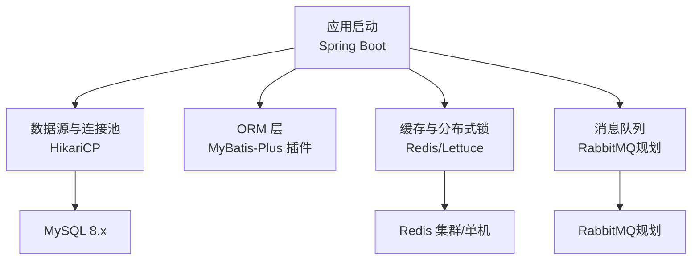
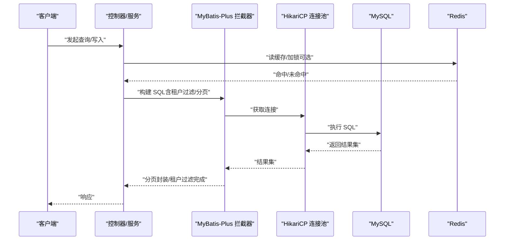
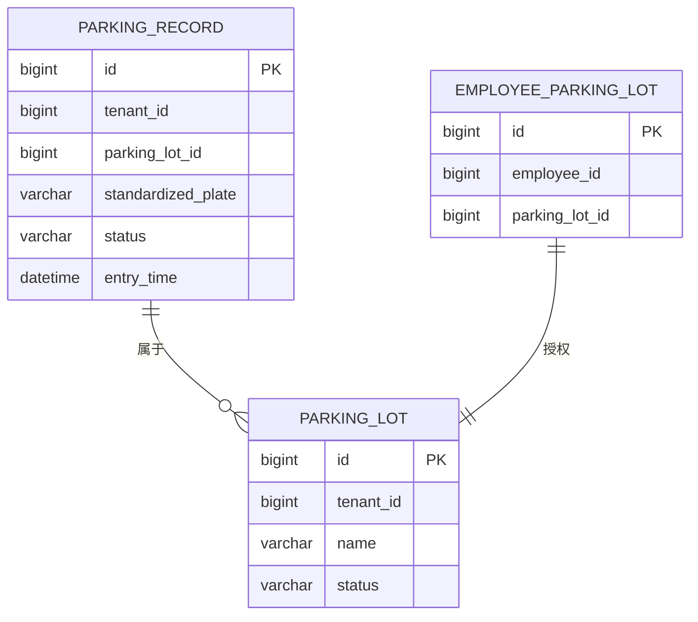
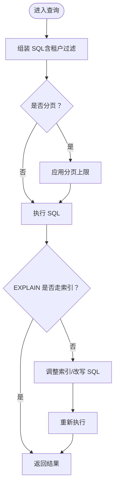
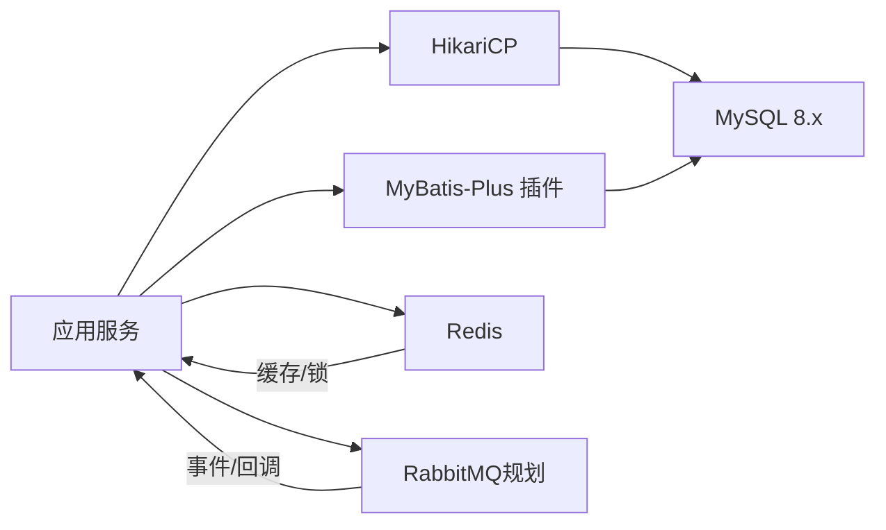

# 性能优化策略

<cite>
**本文引用的文件**   
- [README.md](file://README.md)
- [application-prod.yml](file://parking-boot/src/main/resources/application-prod.yml)
- [MyBatisConfig.java](file://parking-boot/src/main/java/com/jushan/boot/config/MyBatisConfig.java)
- [V20260710001__baseline.sql](file://parking-boot/src/main/resources/db/migration/V20260710001__baseline.sql)
- [V20260711005__employee_and_parking_lot.sql](file://parking-boot/src/main/resources/db/migration/V20260711005__employee_and_parking_lot.sql)
- [V20260711007__parking_lot_full.sql](file://parking-boot/src/main/resources/db/migration/V20260711007__parking_lot_full.sql)
- [V20260712017__parking_record.sql](file://parking-boot/src/main/resources/db/migration/V20260712017__parking_record.sql)
- [V20260712019__wx_user_and_vehicle.sql](file://parking-boot/src/main/resources/db/migration/V20260712019__wx_user_and_vehicle.sql)
- [section_03_ddl.md](file://docs/开发计划/section_03_ddl.md)
- [CLAUDE.md](file://CLAUDE.md)
</cite>

## 目录
1. [引言](#引言)
2. [项目结构](#项目结构)
3. [核心组件](#核心组件)
4. [架构总览](#架构总览)
5. [详细组件分析](#详细组件分析)
6. [依赖分析](#依赖分析)
7. [性能考虑](#性能考虑)
8. [故障排查指南](#故障排查指南)
9. [结论](#结论)
10. [附录](#附录)

## 引言
本指南面向智慧停车 SaaS 平台的数据库与查询性能优化，结合仓库中现有 DDL、配置与框架能力，给出可落地的索引设计、查询调优、分库分表与水平扩展、大数据量表治理、连接池与事务锁优化、监控指标与容量规划等方案。目标是帮助团队在数据量增长与多租户并发场景下，持续保持低延迟、高吞吐与稳定可用。

## 项目结构
本项目采用多模块 Maven 工程，后端以 Spring Boot + MyBatis-Plus 为主，使用 Flyway 管理数据库迁移，生产环境通过环境变量注入敏感配置。当前阶段处于基线与骨架搭建期，业务链路逐步完善。

图表来源
- [application-prod.yml:14-46](file://parking-boot/src/main/resources/application-prod.yml#L14-L46)
- [MyBatisConfig.java:36-87](file://parking-boot/src/main/java/com/jushan/boot/config/MyBatisConfig.java#L36-L87)
- [CLAUDE.md:491-521](file://CLAUDE.md#L491-L521)

章节来源
- [README.md:1-75](file://README.md#L1-L75)
- [application-prod.yml:14-46](file://parking-boot/src/main/resources/application-prod.yml#L14-L46)
- [MyBatisConfig.java:36-87](file://parking-boot/src/main/java/com/jushan/boot/config/MyBatisConfig.java#L36-L87)

## 核心组件
- 数据源与连接池：基于 HikariCP，支持最大池大小、最小空闲、超时等参数，生产环境通过环境变量注入。
- ORM 与分页：MyBatis-Plus 拦截器链包含多租户行级隔离与分页插件，分页上限受控，避免深度分页拖垮数据库。
- 迁移与版本：Flyway 驱动数据库演进，DDL 按版本号组织，便于审计与回滚。
- 缓存与锁：Redis 作为 L2 缓存与分布式锁载体，Key 前缀统一，过期时间分级。
- 消息队列：RabbitMQ 用于事件与回调，消费端需幂等。

章节来源
- [application-prod.yml:14-46](file://parking-boot/src/main/resources/application-prod.yml#L14-L46)
- [MyBatisConfig.java:36-87](file://parking-boot/src/main/java/com/jushan/boot/config/MyBatisConfig.java#L36-L87)
- [CLAUDE.md:491-521](file://CLAUDE.md#L491-L521)

## 架构总览
下图展示从请求到数据库的关键路径，以及关键性能控制点（分页上限、租户隔离、连接池、缓存与锁）。

图表来源
- [MyBatisConfig.java:57-75](file://parking-boot/src/main/java/com/jushan/boot/config/MyBatisConfig.java#L57-L75)
- [application-prod.yml:17-27](file://parking-boot/src/main/resources/application-prod.yml#L17-L27)
- [CLAUDE.md:491-521](file://CLAUDE.md#L491-L521)

## 详细组件分析

### 索引优化策略
- 复合索引设计原则
  - 将高频等值条件字段置于左侧，范围条件字段置右；优先覆盖常见查询谓词顺序。
  - 示例：停车场记录按“停车场+状态”组合查询，应建立 (parking_lot_id, status) 索引。
- 覆盖索引使用
  - 尽量让查询仅访问索引列，减少回表；对只读报表或导出接口尤为有效。
- 唯一约束与功能索引
  - 利用唯一索引保证业务一致性，如“同车同场仅一条在场记录”，可通过函数索引实现选择性唯一约束。
- 索引维护最佳实践
  - 定期评估慢查询与索引使用率，删除冗余索引；大表变更索引时采用在线工具或灰度切换。
  - 字符集与排序规则一致，避免隐式转换导致索引失效；车牌统一大写存储。

章节来源
- [V20260712017__parking_record.sql:27-37](file://parking-boot/src/main/resources/db/migration/V20260712017__parking_record.sql#L27-L37)
- [V20260711005__employee_and_parking_lot.sql:20-36](file://parking-boot/src/main/resources/db/migration/V20260711005__employee_and_parking_lot.sql#L20-L36)
- [V20260711007__parking_lot_full.sql:46-64](file://parking-boot/src/main/resources/db/migration/V20260711007__parking_lot_full.sql#L46-L64)
- [section_03_ddl.md:2014-2028](file://docs/开发计划/section_03_ddl.md#L2014-L2028)

#### 索引关系图（代码映射）

图表来源
- [V20260712017__parking_record.sql:11-37](file://parking-boot/src/main/resources/db/migration/V20260712017__parking_record.sql#L11-L37)
- [V20260711005__employee_and_parking_lot.sql:12-36](file://parking-boot/src/main/resources/db/migration/V20260711005__employee_and_parking_lot.sql#L12-L36)

### 查询性能优化技术
- 慢查询分析
  - 开启并定期导出慢查询日志，结合 EXPLAIN 分析扫描行数、索引选择与临时表/文件排序。
- 执行计划解读
  - 关注 type、key、rows、Extra 中的 Using index、Using filesort、Using temporary 等提示。
- SQL 调优技巧
  - 避免 SELECT *，按需取列；合理使用 LIMIT 与分页上限；避免在索引列上使用函数或表达式；字符串比较注意大小写与编码。
- 分页与深度分页
  - 通过分页插件限制每页上限，防止全表扫描与内存溢出。

章节来源
- [MyBatisConfig.java:70-75](file://parking-boot/src/main/java/com/jushan/boot/config/MyBatisConfig.java#L70-L75)
- [section_03_ddl.md:2014-2028](file://docs/开发计划/section_03_ddl.md#L2014-L2028)

#### 查询流程与分页控制（流程图）

图表来源
- [MyBatisConfig.java:57-75](file://parking-boot/src/main/java/com/jushan/boot/config/MyBatisConfig.java#L57-L75)

### 分库分表与水平扩展
- 分片键选择
  - 优先选择具备高基数且查询热点集中的字段，如 tenant_id、parking_lot_id；避免跨分片聚合。
- 路由算法设计
  - 简单哈希取模、一致性哈希、时间分区路由（按月份/季度）；结合读写分离与冷热分层。
- 扩容与迁移
  - 双写过渡、增量同步、离线校验、灰度切流；确保幂等与可回滚。

章节来源
- [section_03_ddl.md:2014-2028](file://docs/开发计划/section_03_ddl.md#L2014-L2028)

### 大数据量表处理方案
- 分区表设计
  - 按时间范围（月/季）或租户维度分区，提升范围查询与归档效率。
- 历史数据归档
  - 定时任务按月归档超期数据至冷存储，线上表标记只读，保留索引用于快速定位。
- 冷热数据分离
  - 热数据常驻主库，冷数据下沉对象存储或归档库；查询侧通过索引表或视图合并。

章节来源
- [CLAUDE.md:512-515](file://CLAUDE.md#L512-L515)
- [section_03_ddl.md:2014-2028](file://docs/开发计划/section_03_ddl.md#L2014-L2028)

### 连接池配置、事务优化与锁竞争解决方案
- 连接池配置
  - 根据 CPU 核数与 IO 特性设置最大池大小与空闲阈值；合理配置连接超时，避免雪崩。
- 事务优化
  - 缩小事务边界，避免长事务；批量操作分批提交；读写分离下谨慎跨库事务。
- 锁竞争解决
  - 双层锁：Redis 分布式锁串行化同一资源请求，数据库乐观锁 version 防冲突；热点更新先入队异步落库。

章节来源
- [application-prod.yml:17-27](file://parking-boot/src/main/resources/application-prod.yml#L17-L27)
- [CLAUDE.md:497-506](file://CLAUDE.md#L497-L506)

### 监控指标收集、瓶颈识别与容量规划
- 监控指标
  - 数据库：QPS、TPS、慢查询比例、锁等待、缓冲命中率、连接池使用率。
  - 应用：接口 P95/P99 耗时、错误率、线程池饱和、GC 停顿。
  - 中间件：Redis 命中率、命令延迟、连接数；RabbitMQ 堆积与消费速率。
- 瓶颈识别
  - 结合慢查询与 EXPLAIN 定位缺失索引与低效 SQL；观察连接池耗尽与锁争用热点。
- 容量规划
  - 基于峰值 QPS 与平均行大小估算单表容量；按年增长率规划分片与归档节奏；预留 30% 余量。

章节来源
- [CLAUDE.md:491-521](file://CLAUDE.md#L491-L521)

## 依赖分析
- 直接依赖
  - 应用 → HikariCP → MySQL
  - 应用 → MyBatis-Plus 插件（多租户、分页）
  - 应用 → Redis（缓存/锁）
  - 应用 → RabbitMQ（事件/回调，规划）
- 间接依赖
  - Flyway 驱动 DDL 演进；测试容器提供一致的 MySQL 版本与环境。

图表来源
- [application-prod.yml:17-46](file://parking-boot/src/main/resources/application-prod.yml#L17-L46)
- [MyBatisConfig.java:57-75](file://parking-boot/src/main/java/com/jushan/boot/config/MyBatisConfig.java#L57-L75)
- [CLAUDE.md:491-521](file://CLAUDE.md#L491-L521)

章节来源
- [application-prod.yml:17-46](file://parking-boot/src/main/resources/application-prod.yml#L17-L46)
- [MyBatisConfig.java:57-75](file://parking-boot/src/main/java/com/jushan/boot/config/MyBatisConfig.java#L57-L75)

## 性能考虑
- 索引与查询
  - 严格遵循复合索引左前缀原则；避免在索引列上计算；尽量使用覆盖索引。
- 分页与深度分页
  - 强制分页上限，避免全表扫描；对深分页采用游标或延迟关联。
- 连接池与超时
  - 根据压测结果调优最大池大小与超时；监控连接泄漏与等待队列。
- 缓存与锁
  - 热点数据进缓存，更新走 Cache-Aside；并发写使用分布式锁+乐观锁。
- 归档与冷热分离
  - 按时序归档，保留索引用于检索；热路径不触碰冷数据。

[本节为通用指导，无需特定文件引用]

## 故障排查指南
- 慢查询定位
  - 导出慢查询日志，结合 EXPLAIN 检查索引命中、扫描行数与额外操作。
- 分页异常
  - 确认分页插件已启用且生效，检查 total 是否正确返回。
- 连接池耗尽
  - 观察 Hikari 活跃连接与等待线程，排查长事务与未释放连接。
- 锁竞争
  - 查看 Redis 锁持有时间与数据库锁等待，定位热点更新路径。

章节来源
- [MyBatisConfig.java:57-75](file://parking-boot/src/main/java/com/jushan/boot/config/MyBatisConfig.java#L57-L75)
- [application-prod.yml:17-27](file://parking-boot/src/main/resources/application-prod.yml#L17-L27)
- [CLAUDE.md:497-506](file://CLAUDE.md#L497-L506)

## 结论
通过系统化的索引设计与查询优化、合理的分库分表与归档策略、严格的连接池与锁管理，以及完善的监控与容量规划，可在多租户与高并发场景下保障平台的数据性能与稳定性。建议在生产上线前进行压测与回归，持续跟踪慢查询与资源使用，动态调优。

[本节为总结性内容，无需特定文件引用]

## 附录
- 关键 DDL 参考
  - 基础配置表：sys_config
  - 停车场与授权：parking_lot、employee_parking_lot
  - 停车记录与唯一约束：parking_record（含函数唯一索引）
  - 微信用户与绑定：wx_user、vehicle、plate_binding、binding_policy

章节来源
- [V20260710001__baseline.sql:13-22](file://parking-boot/src/main/resources/db/migration/V20260710001__baseline.sql#L13-L22)
- [V20260711005__employee_and_parking_lot.sql:12-36](file://parking-boot/src/main/resources/db/migration/V20260711005__employee_and_parking_lot.sql#L12-L36)
- [V20260712017__parking_record.sql:11-37](file://parking-boot/src/main/resources/db/migration/V20260712017__parking_record.sql#L11-L37)
- [V20260712019__wx_user_and_vehicle.sql:15-108](file://parking-boot/src/main/resources/db/migration/V20260712019__wx_user_and_vehicle.sql#L15-L108)