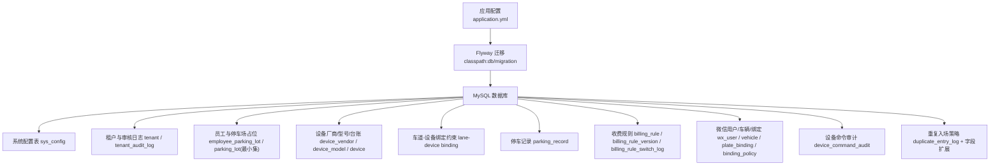
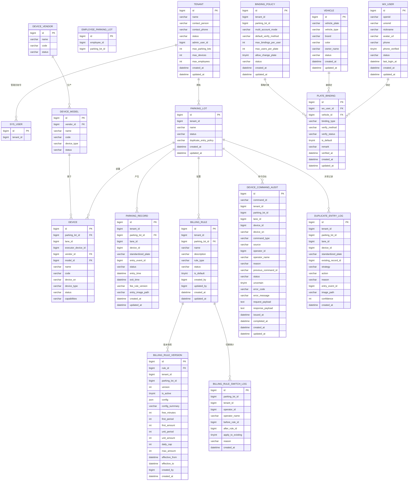
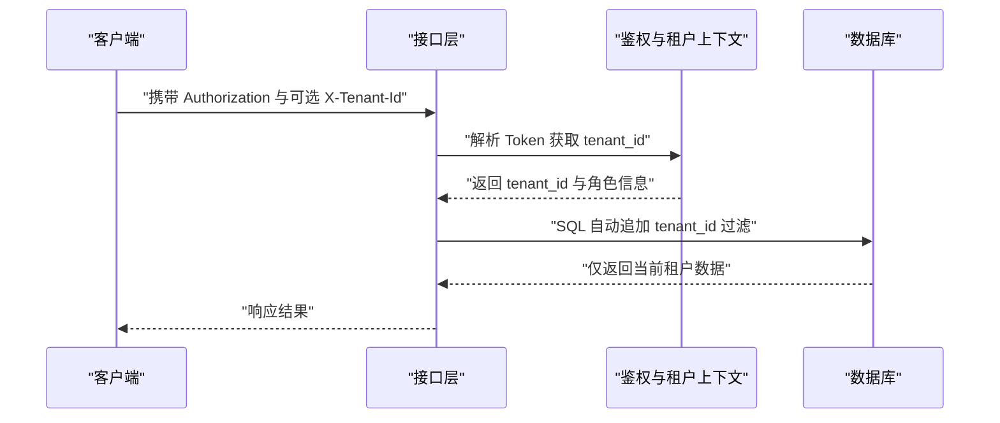
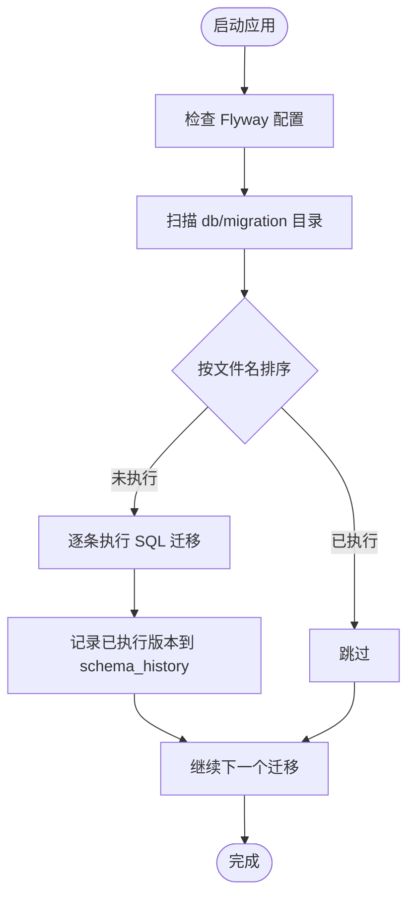
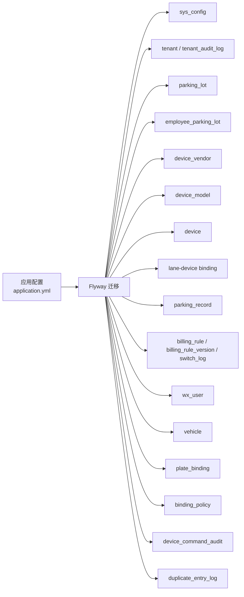

# 数据库设计

<cite>
**本文引用的文件**   
- [application.yml](file://parking-boot/src/main/resources/application.yml)
- [V20260710001__baseline.sql](file://parking-boot/src/main/resources/db/migration/V20260710001__baseline.sql)
- [V20260711004__tenant_and_registration.sql](file://parking-boot/src/main/resources/db/migration/V20260711004__tenant_and_registration.sql)
- [V20260711005__employee_and_parking_lot.sql](file://parking-boot/src/main/resources/db/migration/V20260711005__employee_and_parking_lot.sql)
- [V20260711009__device_vendor_model.sql](file://parking-boot/src/main/resources/db/migration/V20260711009__device_vendor_model.sql)
- [V20260711010__lane_device_binding.sql](file://parking-boot/src/main/resources/db/migration/V20260711010__lane_device_binding.sql)
- [V20260712017__parking_record.sql](file://parking-boot/src/main/resources/db/migration/V20260712017__parking_record.sql)
- [V20260712018__billing_rule.sql](file://parking-boot/src/main/resources/db/migration/V20260712018__billing_rule.sql)
- [V20260712019__wx_user_and_vehicle.sql](file://parking-boot/src/main/resources/db/migration/V20260712019__wx_user_and_vehicle.sql)
- [V20260712020__device_command_audit.sql](file://parking-boot/src/main/resources/db/migration/V20260712020__device_command_audit.sql)
- [V20260713001__duplicate_entry_policy.sql](file://parking-boot/src/main/resources/db/migration/V20260713001__duplicate_entry_policy.sql)
- [DataScope.java](file://parking-framework/src/main/java/com/jushan/framework/auth/DataScope.java)
- [section_03_ddl.md](file://docs/开发计划/section_03_ddl.md)
- [section_04_api.md](file://docs/开发计划/section_04_api.md)
</cite>

## 目录
1. [引言](#引言)
2. [项目结构](#项目结构)
3. [核心组件](#核心组件)
4. [架构总览](#架构总览)
5. [详细组件分析](#详细组件分析)
6. [依赖分析](#依赖分析)
7. [性能考虑](#性能考虑)
8. [故障排查指南](#故障排查指南)
9. [结论](#结论)
10. [附录](#附录)

## 引言
本文件面向停车 SaaS 平台的数据库设计与治理，覆盖多租户隔离、表结构与关系、索引与约束、数据完整性、Flyway 迁移管理、ER 图与关键查询示例、生命周期与备份恢复、安全合规与隐私保护、数据字典等。文档以仓库中 Flyway 迁移脚本与设计规范为依据，确保可追溯与可落地。

## 项目结构
- 数据库迁移位于 parking-boot 模块的 resources/db/migration 目录，采用 Flyway 版本化命名（如 V20260710001__baseline.sql）。
- 应用通过 application.yml 启用 Flyway，并配置 MySQL 数据源与连接池参数。
- 平台级基础元数据与业务域表按任务分阶段创建，逐步完善停车场、设备、计费、用户与车辆等能力。

**图示来源** 
- [application.yml:33-38](file://parking-boot/src/main/resources/application.yml#L33-L38)
- [V20260710001__baseline.sql:1-23](file://parking-boot/src/main/resources/db/migration/V20260710001__baseline.sql#L1-L23)
- [V20260711004__tenant_and_registration.sql:1-55](file://parking-boot/src/main/resources/db/migration/V20260711004__tenant_and_registration.sql#L1-L55)
- [V20260711005__employee_and_parking_lot.sql:1-37](file://parking-boot/src/main/resources/db/migration/V20260711005__employee_and_parking_lot.sql#L1-L37)
- [V20260711009__device_vendor_model.sql:1-89](file://parking-boot/src/main/resources/db/migration/V20260711009__device_vendor_model.sql#L1-L89)
- [V20260711010__lane_device_binding.sql:1-29](file://parking-boot/src/main/resources/db/migration/V20260711010__lane_device_binding.sql#L1-L29)
- [V20260712017__parking_record.sql:1-38](file://parking-boot/src/main/resources/db/migration/V20260712017__parking_record.sql#L1-L38)
- [V20260712018__billing_rule.sql:1-82](file://parking-boot/src/main/resources/db/migration/V20260712018__billing_rule.sql#L1-L82)
- [V20260712019__wx_user_and_vehicle.sql:1-108](file://parking-boot/src/main/resources/db/migration/V20260712019__wx_user_and_vehicle.sql#L1-L108)
- [V20260712020__device_command_audit.sql:1-49](file://parking-boot/src/main/resources/db/migration/V20260712020__device_command_audit.sql#L1-L49)
- [V20260713001__duplicate_entry_policy.sql:1-42](file://parking-boot/src/main/resources/db/migration/V20260713001__duplicate_entry_policy.sql#L1-L42)

**章节来源**
- [application.yml:21-38](file://parking-boot/src/main/resources/application.yml#L21-L38)

## 核心组件
- 系统配置：sys_config 提供平台级 key-value 动态配置。
- 租户与注册：tenant、tenant_audit_log 实现客户注册、审核与启停；sys_user 增加 tenant_id 支持多租户。
- 员工与停车场：parking_lot 最小集占位，后续扩展；employee_parking_lot 实现员工对车场的授权。
- 设备体系：device_vendor、device_model、device 构成厂商-型号-台账三层模型；lane-device 绑定与执行相机关联。
- 通行与计费：parking_record 记录在场状态；billing_rule/billing_rule_version/billing_rule_switch_log 支撑计费规则与切换审计。
- 车主端：wx_user、vehicle、plate_binding、binding_policy 实现微信用户、车辆与车牌绑定及策略控制。
- 设备命令审计：device_command_audit 统一记录所有对外设备控制命令的上下文与结果。
- 重复入场策略：在 parking_lot 新增策略字段，parking_record 新增抓拍路径，duplicate_entry_log 记录异常处置。

**章节来源**
- [V20260710001__baseline.sql:1-23](file://parking-boot/src/main/resources/db/migration/V20260710001__baseline.sql#L1-L23)
- [V20260711004__tenant_and_registration.sql:1-55](file://parking-boot/src/main/resources/db/migration/V20260711004__tenant_and_registration.sql#L1-L55)
- [V20260711005__employee_and_parking_lot.sql:1-37](file://parking-boot/src/main/resources/db/migration/V20260711005__employee_and_parking_lot.sql#L1-L37)
- [V20260711009__device_vendor_model.sql:1-89](file://parking-boot/src/main/resources/db/migration/V20260711009__device_vendor_model.sql#L1-L89)
- [V20260711010__lane_device_binding.sql:1-29](file://parking-boot/src/main/resources/db/migration/V20260711010__lane_device_binding.sql#L1-L29)
- [V20260712017__parking_record.sql:1-38](file://parking-boot/src/main/resources/db/migration/V20260712017__parking_record.sql#L1-L38)
- [V20260712018__billing_rule.sql:1-82](file://parking-boot/src/main/resources/db/migration/V20260712018__billing_rule.sql#L1-L82)
- [V20260712019__wx_user_and_vehicle.sql:1-108](file://parking-boot/src/main/resources/db/migration/V20260712019__wx_user_and_vehicle.sql#L1-L108)
- [V20260712020__device_command_audit.sql:1-49](file://parking-boot/src/main/resources/db/migration/V20260712020__device_command_audit.sql#L1-L49)
- [V20260713001__duplicate_entry_policy.sql:1-42](file://parking-boot/src/main/resources/db/migration/V20260713001__duplicate_entry_policy.sql#L1-L42)

## 架构总览
下图展示核心实体之间的关系，包括租户、员工、停车场、设备、停车记录、计费规则、车主端与审计等。

**图示来源** 
- [V20260711004__tenant_and_registration.sql:1-55](file://parking-boot/src/main/resources/db/migration/V20260711004__tenant_and_registration.sql#L1-L55)
- [V20260711005__employee_and_parking_lot.sql:1-37](file://parking-boot/src/main/resources/db/migration/V20260711005__employee_and_parking_lot.sql#L1-L37)
- [V20260711009__device_vendor_model.sql:1-89](file://parking-boot/src/main/resources/db/migration/V20260711009__device_vendor_model.sql#L1-L89)
- [V20260711010__lane_device_binding.sql:1-29](file://parking-boot/src/main/resources/db/migration/V20260711010__lane_device_binding.sql#L1-L29)
- [V20260712017__parking_record.sql:1-38](file://parking-boot/src/main/resources/db/migration/V20260712017__parking_record.sql#L1-L38)
- [V20260712018__billing_rule.sql:1-82](file://parking-boot/src/main/resources/db/migration/V20260712018__billing_rule.sql#L1-L82)
- [V20260712019__wx_user_and_vehicle.sql:1-108](file://parking-boot/src/main/resources/db/migration/V20260712019__wx_user_and_vehicle.sql#L1-L108)
- [V20260712020__device_command_audit.sql:1-49](file://parking-boot/src/main/resources/db/migration/V20260712020__device_command_audit.sql#L1-L49)
- [V20260713001__duplicate_entry_policy.sql:1-42](file://parking-boot/src/main/resources/db/migration/V20260713001__duplicate_entry_policy.sql#L1-L42)

## 详细组件分析

### 多租户数据隔离方案
- 所有业务表包含 tenant_id 字段，查询必须带 tenant_id 过滤；平台级表允许 NULL 或固定值。
- 应用层通过 Sa-Token/JWT 解析 tenant_id，并在请求头 X-Tenant-Id 支持下由超管显式指定目标租户。
- 框架层 DataScope 强制平台全局用户校验，防止越权访问。
- MyBatis-Plus TenantLineInnerInterceptor 自动注入 tenant_id 条件，禁止信任前端传入。

**图示来源** 
- [section_04_api.md:28-39](file://docs/开发计划/section_04_api.md#L28-L39)
- [DataScope.java:158-179](file://parking-framework/src/main/java/com/jushan/framework/auth/DataScope.java#L158-L179)

**章节来源**
- [section_04_api.md:28-39](file://docs/开发计划/section_04_api.md#L28-L39)
- [DataScope.java:158-179](file://parking-framework/src/main/java/com/jushan/framework/auth/DataScope.java#L158-L179)

### 索引策略与约束条件
- 唯一性约束：
  - 租户名称与联系电话唯一（tenant）
  - 同厂商下型号编码唯一（device_model）
  - 同厂商下设备 SN 唯一（device）
  - 停车场内设备编码唯一（device）
  - 同一车道每种设备类型最多一台（uq_lane_device_type）
  - 同一停车场规则名称唯一（billing_rule）
  - 同一规则版本号唯一（billing_rule_version）
  - 同一用户不能重复绑定同一辆车（plate_binding）
  - 微信 OpenId/UnionId/手机号唯一（wx_user）
  - 车牌号唯一（vehicle）
- 功能性唯一索引：
  - parking_record 使用 MySQL 8 功能索引 uk_active_parking，保证同车同停车场仅一条有效在场记录。
- 常用查询索引：
  - 按租户、停车场、状态、时间范围、设备、命令 ID、不确定状态等多维索引。

**章节来源**
- [V20260711004__tenant_and_registration.sql:1-55](file://parking-boot/src/main/resources/db/migration/V20260711004__tenant_and_registration.sql#L1-L55)
- [V20260711009__device_vendor_model.sql:1-89](file://parking-boot/src/main/resources/db/migration/V20260711009__device_vendor_model.sql#L1-L89)
- [V20260711010__lane_device_binding.sql:1-29](file://parking-boot/src/main/resources/db/migration/V20260711010__lane_device_binding.sql#L1-L29)
- [V20260712017__parking_record.sql:1-38](file://parking-boot/src/main/resources/db/migration/V20260712017__parking_record.sql#L1-L38)
- [V20260712018__billing_rule.sql:1-82](file://parking-boot/src/main/resources/db/migration/V20260712018__billing_rule.sql#L1-L82)
- [V20260712019__wx_user_and_vehicle.sql:1-108](file://parking-boot/src/main/resources/db/migration/V20260712019__wx_user_and_vehicle.sql#L1-L108)
- [V20260712020__device_command_audit.sql:1-49](file://parking-boot/src/main/resources/db/migration/V20260712020__device_command_audit.sql#L1-L49)

### 数据完整性保证
- 逻辑外键：通过注释说明关系，不强制写 FOREIGN KEY，由业务层保证一致性。
- 软删除：业务表含 deleted_at 字段，查询需过滤 IS NULL。
- 并发控制：车位余量、优惠券库存、积分扣减等场景使用 Redis 分布式锁 + 数据库乐观锁（version 字段）。
- 金额精度：统一使用 DECIMAL(18,2) 或 (18,4)，禁止 FLOAT/DOUBLE。
- 车牌存储：统一大写存储，查询忽略大小写。
- 操作日志：AOP 记录 operator_id、operator_ip、operation_time、before_value/after_value JSON。

**章节来源**
- [section_03_ddl.md:1-16](file://docs/开发计划/section_03_ddl.md#L1-L16)
- [section_03_ddl.md:17-344](file://docs/开发计划/section_03_ddl.md#L17-L344)

### 数据库迁移管理（Flyway）与版本控制策略
- 启用方式：application.yml 中 flyway.enabled=true，locations=classpath:db/migration，clean-disabled=true。
- 命名规范：VYYYYMMDDNNN__描述.sql，按日期+序号递增，确保幂等与顺序执行。
- 基线迁移：V20260710001__baseline.sql 作为首个版本，仅包含平台级基础元数据表。
- 增量演进：后续迁移按任务拆分，逐步完善业务表与约束。

**图示来源** 
- [application.yml:33-38](file://parking-boot/src/main/resources/application.yml#L33-L38)
- [V20260710001__baseline.sql:1-23](file://parking-boot/src/main/resources/db/migration/V20260710001__baseline.sql#L1-L23)

**章节来源**
- [application.yml:33-38](file://parking-boot/src/main/resources/application.yml#L33-L38)

### 关键查询示例
- 查询某租户在场车辆列表（按停车场与状态过滤）：
  - 参考：[parking_record 表定义与索引:11-38](file://parking-boot/src/main/resources/db/migration/V20260712017__parking_record.sql#L11-L38)
- 查询某停车场收费规则及其生效版本：
  - 参考：[billing_rule 与 billing_rule_version 表定义:11-63](file://parking-boot/src/main/resources/db/migration/V20260712018__billing_rule.sql#L11-L63)
- 查询某设备的最近命令审计记录：
  - 参考：[device_command_audit 表定义与索引:14-48](file://parking-boot/src/main/resources/db/migration/V20260712020__device_command_audit.sql#L14-L48)
- 查询某用户的默认绑定车牌：
  - 参考：[plate_binding 表定义与索引:59-80](file://parking-boot/src/main/resources/db/migration/V20260712019__wx_user_and_vehicle.sql#L59-L80)

**章节来源**
- [V20260712017__parking_record.sql:11-38](file://parking-boot/src/main/resources/db/migration/V20260712017__parking_record.sql#L11-L38)
- [V20260712018__billing_rule.sql:11-63](file://parking-boot/src/main/resources/db/migration/V20260712018__billing_rule.sql#L11-L63)
- [V20260712020__device_command_audit.sql:14-48](file://parking-boot/src/main/resources/db/migration/V20260712020__device_command_audit.sql#L14-L48)
- [V20260712019__wx_user_and_vehicle.sql:59-80](file://parking-boot/src/main/resources/db/migration/V20260712019__wx_user_and_vehicle.sql#L59-L80)

### 数据生命周期管理
- 入场记录：parking_record 维护在场状态，出场后标记 COMPLETED 或 CANCELLED。
- 重复入场策略：REJECT/UPDATE/EXCEPTION 三种策略，UPDATE 时更新 entry_image_path，EXCEPTION 写入 duplicate_entry_log。
- 审计与归档：device_command_audit、billing_rule_switch_log、tenant_audit_log 等用于运营审计与排障。
- 软删除：deleted_at 字段配合后台归档任务进行物理清理。

**章节来源**
- [V20260712017__parking_record.sql:1-38](file://parking-boot/src/main/resources/db/migration/V20260712017__parking_record.sql#L1-L38)
- [V20260713001__duplicate_entry_policy.sql:1-42](file://parking-boot/src/main/resources/db/migration/V20260713001__duplicate_entry_policy.sql#L1-L42)
- [V20260712020__device_command_audit.sql:1-49](file://parking-boot/src/main/resources/db/migration/V20260712020__device_command_audit.sql#L1-L49)
- [V20260712018__billing_rule.sql:66-82](file://parking-boot/src/main/resources/db/migration/V20260712018__billing_rule.sql#L66-L82)
- [V20260711004__tenant_and_registration.sql:34-47](file://parking-boot/src/main/resources/db/migration/V20260711004__tenant_and_registration.sql#L34-L47)

### 备份恢复策略
- 建议定期全量备份与增量 WAL 备份，保留多份历史副本。
- 针对高价值表（如 parking_record、device_command_audit、billing_rule_version）制定更频繁的快照策略。
- 恢复演练：定期进行恢复演练，验证 RPO/RTO 指标。

[本节为通用指导，无需具体文件引用]

### 数据安全、隐私保护与合规性
- 敏感字段脱敏：昵称、头像、手机号等字段在展示层脱敏。
- 权限控制：平台全局用户需经 DataScope.requirePlatformUser() 校验；普通用户仅能访问其租户数据。
- 审计追踪：所有写操作与外部调用均记录审计日志，便于合规审查。
- 数据最小化：仅采集必要信息，遵循隐私保护原则。

**章节来源**
- [DataScope.java:158-179](file://parking-framework/src/main/java/com/jushan/framework/auth/DataScope.java#L158-L179)
- [V20260712019__wx_user_and_vehicle.sql:15-33](file://parking-boot/src/main/resources/db/migration/V20260712019__wx_user_and_vehicle.sql#L15-L33)
- [V20260712020__device_command_audit.sql:14-48](file://parking-boot/src/main/resources/db/migration/V20260712020__device_command_audit.sql#L14-L48)

### 数据字典与字段说明
- 系统配置表 sys_config：
  - 主键 id，配置键 config_key（唯一），配置值 config_value，描述 description，时间戳 created_at/updated_at。
- 租户表 tenant：
  - 主键 id，企业名称 name（唯一），联系人 contact_person，联系电话 contact_phone（唯一），状态 status，管理员账号 admin_user_id，配额限制（最大停车场/设备/员工数），时间戳。
- 员工-停车场授权 employee_parking_lot：
  - 主键 id，员工 ID employee_id，停车场 ID parking_lot_id（唯一联合索引），时间戳。
- 停车场表 parking_lot（最小集）：
  - 主键 id，租户 ID tenant_id，名称 name，状态 status，重复入场策略 duplicate_entry_policy，时间戳。
- 设备厂商 device_vendor：
  - 主键 id，名称 name，编码 code（唯一），状态 status，描述 description，时间戳。
- 设备型号 device_model：
  - 主键 id，厂商 ID vendor_id，名称 name，编码 code（同厂商唯一），设备类型 device_type，状态 status，描述 description，时间戳。
- 设备台账 device：
  - 主键 id，停车场 ID parking_lot_id，车道 ID lane_id，执行设备 ID executor_device_id，厂商 ID vendor_id，型号 ID model_id，名称 name，业务编码 code（同停车场唯一），序列号 device_sn（同厂商唯一），设备类型 device_type，状态 status，能力 capabilities，描述 description，时间戳。
- 停车记录 parking_record：
  - 主键 id，租户 ID tenant_id，停车场 ID parking_lot_id，车道 ID lane_id，设备 ID device_id，标准化车牌 standardized_plate，入场事件 ID entry_event_id，状态 status，入场时间 entry_time，出场时间 exit_time，计费规则版本 fee_rule_version，入场抓拍路径 entry_image_path，时间戳。
- 收费规则 billing_rule：
  - 主键 id，租户 ID tenant_id，停车场 ID parking_lot_id，名称 name（同停车场唯一），描述 description，规则类型 rule_type，状态 status，是否默认 is_default，创建人 created_by，修改人 updated_by，时间戳。
- 收费规则版本 billing_rule_version：
  - 主键 id，规则 ID rule_id，租户 ID tenant_id，停车场 ID parking_lot_id，版本号 version（唯一联合），是否生效 is_active，配置 JSON config，摘要 config_summary，免费时长 free_minutes，首时段 first_period/first_amount，续费单位 unit_period/unit_amount，日封顶 daily_cap，最大金额 max_amount，生效时间 effective_from/effective_to，创建人 created_by，时间戳。
- 规则切换审计 billing_rule_switch_log：
  - 主键 id，停车场 ID parking_lot_id，租户 ID tenant_id，操作人 operator_id/operator_name，切换前后规则 before_rule_id/after_rule_id，是否影响已在场 apply_to_existing，原因 reason，时间戳。
- 微信用户 wx_user：
  - 主键 id，OpenId openid（唯一），UnionId unionid（唯一），昵称 nickname，头像 avatar_url，手机号 phone（唯一），手机验证 phone_verified，状态 status，最后登录 last_login_at，时间戳。
- 车辆 vehicle：
  - 主键 id，车牌号 vehicle_plate（唯一），车辆类型 vehicle_type，品牌 brand，颜色 color，车主姓名 owner_name，状态 status，时间戳。
- 车牌绑定 plate_binding：
  - 主键 id，微信用户 ID wx_user_id，车辆 ID vehicle_id，绑定类型 binding_type，验证方式 verify_method，验证状态 verify_status，是否默认 is_default，备注 remark，验证通过 verified_at，时间戳。
- 绑定策略 binding_policy：
  - 主键 id，租户 ID tenant_id，停车场 ID parking_lot_id，多账号模式 multi_account_mode，默认验证方式 default_verify_method，单用户最大绑定数 max_bindings_per_user，单车牌最大用户数 max_users_per_plate，是否允许更换 allow_change_plate，状态 status，时间戳。
- 设备命令审计 device_command_audit：
  - 主键 id，命令 ID command_id，租户 ID tenant_id，停车场 ID parking_lot_id，车道 ID lane_id，设备 ID device_id，序列号 device_sn，命令类型 command_type，来源 source，操作人 operator_id/operator_name，原因 reason，前次命令 previous_command_id，状态 status，不确定 uncertain，错误码 error_code，错误消息 error_message，请求报文 request_payload，响应报文 response_payload，发出时间 issued_at，完成时间 completed_at，时间戳。
- 异常重复入场 duplicate_entry_log：
  - 主键 id，租户 ID tenant_id，停车场 ID parking_lot_id，车道 ID lane_id，设备 ID device_id，标准化车牌 standardized_plate，已有记录 ID existing_record_id，策略 strategy，动作 action，原因 reason，入场事件 ID entry_event_id，图片路径 image_path，置信度 confidence，时间戳。

**章节来源**
- [V20260710001__baseline.sql:13-22](file://parking-boot/src/main/resources/db/migration/V20260710001__baseline.sql#L13-L22)
- [V20260711004__tenant_and_registration.sql:12-55](file://parking-boot/src/main/resources/db/migration/V20260711004__tenant_and_registration.sql#L12-L55)
- [V20260711005__employee_and_parking_lot.sql:12-37](file://parking-boot/src/main/resources/db/migration/V20260711005__employee_and_parking_lot.sql#L12-L37)
- [V20260711009__device_vendor_model.sql:13-89](file://parking-boot/src/main/resources/db/migration/V20260711009__device_vendor_model.sql#L13-L89)
- [V20260711010__lane_device_binding.sql:16-29](file://parking-boot/src/main/resources/db/migration/V20260711010__lane_device_binding.sql#L16-L29)
- [V20260712017__parking_record.sql:11-38](file://parking-boot/src/main/resources/db/migration/V20260712017__parking_record.sql#L11-L38)
- [V20260712018__billing_rule.sql:11-82](file://parking-boot/src/main/resources/db/migration/V20260712018__billing_rule.sql#L11-L82)
- [V20260712019__wx_user_and_vehicle.sql:15-108](file://parking-boot/src/main/resources/db/migration/V20260712019__wx_user_and_vehicle.sql#L15-L108)
- [V20260712020__device_command_audit.sql:14-49](file://parking-boot/src/main/resources/db/migration/V20260712020__device_command_audit.sql#L14-L49)
- [V20260713001__duplicate_entry_policy.sql:14-42](file://parking-boot/src/main/resources/db/migration/V20260713001__duplicate_entry_policy.sql#L14-L42)

## 依赖分析
- 应用配置依赖 Flyway 迁移，迁移脚本之间具有顺序依赖关系（按文件名排序）。
- 业务表之间存在逻辑外键关系，由业务层保证一致性。
- 框架层 DataScope 与租户上下文拦截器共同保障多租户隔离与权限控制。

**图示来源** 
- [application.yml:33-38](file://parking-boot/src/main/resources/application.yml#L33-L38)
- [V20260710001__baseline.sql:1-23](file://parking-boot/src/main/resources/db/migration/V20260710001__baseline.sql#L1-L23)
- [V20260711004__tenant_and_registration.sql:1-55](file://parking-boot/src/main/resources/db/migration/V20260711004__tenant_and_registration.sql#L1-L55)
- [V20260711005__employee_and_parking_lot.sql:1-37](file://parking-boot/src/main/resources/db/migration/V20260711005__employee_and_parking_lot.sql#L1-L37)
- [V20260711009__device_vendor_model.sql:1-89](file://parking-boot/src/main/resources/db/migration/V20260711009__device_vendor_model.sql#L1-L89)
- [V20260711010__lane_device_binding.sql:1-29](file://parking-boot/src/main/resources/db/migration/V20260711010__lane_device_binding.sql#L1-L29)
- [V20260712017__parking_record.sql:1-38](file://parking-boot/src/main/resources/db/migration/V20260712017__parking_record.sql#L1-L38)
- [V20260712018__billing_rule.sql:1-82](file://parking-boot/src/main/resources/db/migration/V20260712018__billing_rule.sql#L1-L82)
- [V20260712019__wx_user_and_vehicle.sql:1-108](file://parking-boot/src/main/resources/db/migration/V20260712019__wx_user_and_vehicle.sql#L1-L108)
- [V20260712020__device_command_audit.sql:1-49](file://parking-boot/src/main/resources/db/migration/V20260712020__device_command_audit.sql#L1-L49)
- [V20260713001__duplicate_entry_policy.sql:1-42](file://parking-boot/src/main/resources/db/migration/V20260713001__duplicate_entry_policy.sql#L1-L42)

**章节来源**
- [application.yml:33-38](file://parking-boot/src/main/resources/application.yml#L33-L38)

## 性能考虑
- 索引优化：
  - 高频查询维度建立复合索引（如 parking_lot_id + status、device_id + created_at DESC）。
  - 利用功能索引 uk_active_parking 避免全表扫描。
- 连接池调优：
  - HikariCP 最大连接数、空闲超时、连接超时等参数根据负载调整。
- 读写分离与缓存：
  - 读多写少场景引入缓存（Redis）与只读副本，降低主库压力。
- 分区与归档：
  - 对大表（如 parking_record、device_command_audit）按时间分区，定期归档历史数据。

[本节为通用指导，无需具体文件引用]

## 故障排查指南
- 迁移失败：
  - 检查 Flyway 配置与迁移文件命名是否符合规范；查看 schema_history 记录定位未执行版本。
- 权限问题：
  - 确认 DataScope 平台用户校验是否通过；检查租户上下文是否正确注入。
- 性能问题：
  - 分析慢查询日志，补充缺失索引；评估连接池参数与缓存命中率。
- 数据不一致：
  - 核对逻辑外键约束与业务层事务边界；审计日志定位异常点。

**章节来源**
- [application.yml:33-38](file://parking-boot/src/main/resources/application.yml#L33-L38)
- [DataScope.java:158-179](file://parking-framework/src/main/java/com/jushan/framework/auth/DataScope.java#L158-L179)

## 结论
本数据库设计围绕多租户隔离、数据完整性与可审计性展开，结合 Flyway 版本化迁移与严格的索引与约束策略，构建了可扩展、可运维的停车 SaaS 平台数据底座。后续应持续完善业务表与索引，强化备份恢复演练与安全合规措施。

[本节为总结，无需具体文件引用]

## 附录
- 设计规范要点：
  - 纯 SaaS 多租户：所有业务表含 tenant_id，查询必须带过滤。
  - 软删除：deleted_at 字段，禁止物理删除。
  - 金额精度：DECIMAL(18,2)/(18,4)。
  - 车牌大写：入库转大写，查询忽略大小写。
  - 并发控制：Redisson 分布式锁 + 乐观锁。
  - 预留接口：标注【预留】，字段完整。
  - 时间字段：DATETIME(3)/DATETIME。
  - 幂等：X-Idempotency-Key。
  - 主键：雪花算法或号段。

**章节来源**
- [section_03_ddl.md:1-16](file://docs/开发计划/section_03_ddl.md#L1-L16)
- [CLAUDE.md:523-539](file://CLAUDE.md#L523-L539)