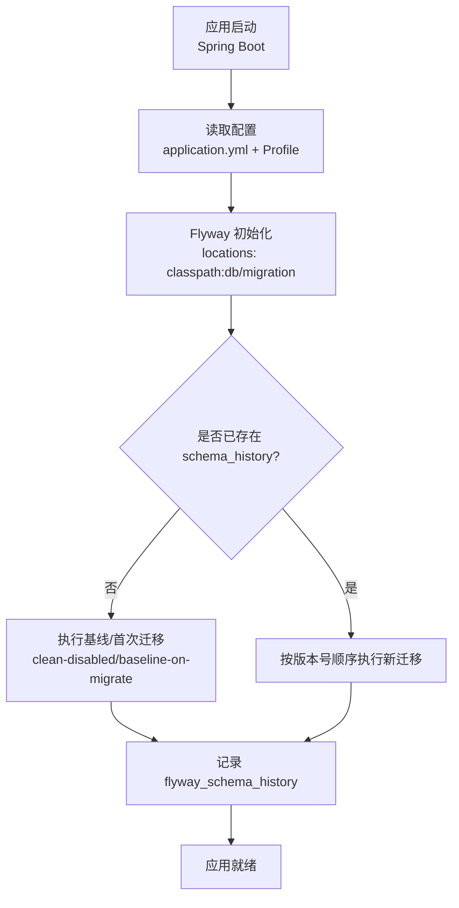
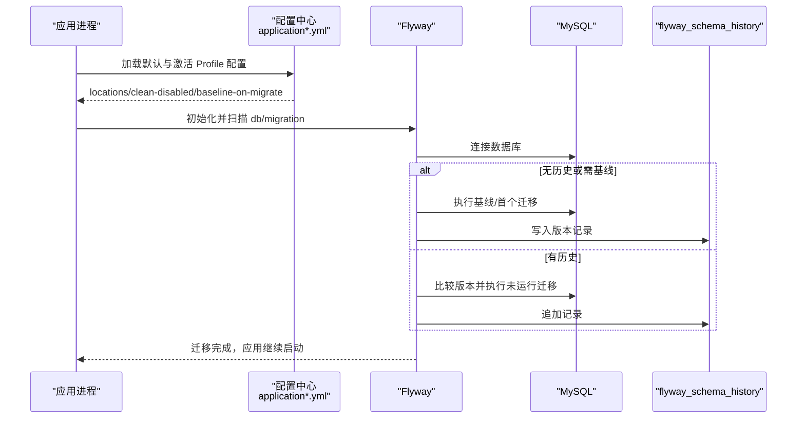
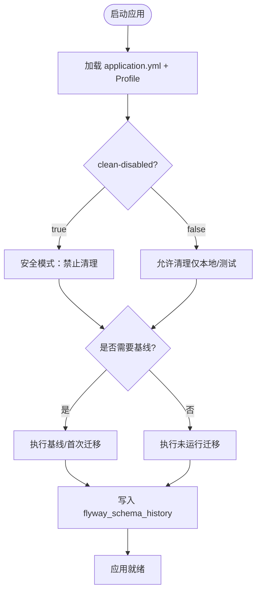
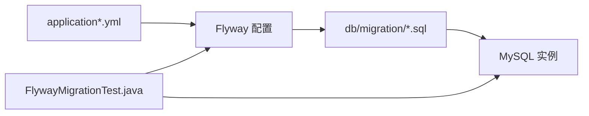

# 数据迁移管理

<cite>
**本文引用的文件列表**
- [application.yml](file://parking-boot/src/main/resources/application.yml)
- [application-local.yml](file://parking-boot/src/main/resources/application-local.yml)
- [application-test.yml](file://parking-boot/src/main/resources/application-test.yml)
- [application-prod.yml](file://parking-boot/src/main/resources/application-prod.yml)
- [application-docker.yml](file://parking-boot/src/main/resources/application-docker.yml)
- [V20260710001__baseline.sql](file://parking-boot/src/main/resources/db/migration/V20260710001__baseline.sql)
- [V20260711002__sys_user_and_login_log.sql](file://parking-boot/src/main/resources/db/migration/V20260711002__sys_user_and_login_log.sql)
- [V20260711003__sys_role_permission.sql](file://parking-boot/src/main/resources/db/migration/V20260711003__sys_role_permission.sql)
- [FlywayMigrationTest.java](file://parking-boot/src/test/java/com/jushan/boot/migration/FlywayMigrationTest.java)
</cite>

## 目录
1. [引言](#引言)
2. [项目结构](#项目结构)
3. [核心组件](#核心组件)
4. [架构总览](#架构总览)
5. [详细组件分析](#详细组件分析)
6. [依赖关系分析](#依赖关系分析)
7. [性能考虑](#性能考虑)
8. [故障排查指南](#故障排查指南)
9. [结论](#结论)
10. [附录](#附录)

## 引言
本文件围绕 Flyway 数据库迁移在仓库中的落地实践，系统化阐述配置与使用、脚本命名规范、版本控制策略、幂等性与回滚策略、错误处理机制、多环境执行流程与差异、冲突解决与数据修复、备份恢复方案以及大数据量迁移的性能优化技巧。文档内容严格基于仓库现有实现与测试用例进行归纳总结，旨在为开发、测试与生产环境的迁移工作提供可操作的指导。

## 项目结构
本项目采用 Spring Boot + Flyway 的数据库迁移方案，迁移脚本统一存放于应用模块的资源目录下，并通过不同 Profile 覆盖基础配置以适配本地、Docker、测试与生产环境。

图示来源
- [application.yml:33-37](file://parking-boot/src/main/resources/application.yml#L33-L37)
- [application-local.yml:24-29](file://parking-boot/src/main/resources/application-local.yml#L24-L29)
- [application-test.yml:17-21](file://parking-boot/src/main/resources/application-test.yml#L17-L21)
- [application-prod.yml:28-32](file://parking-boot/src/main/resources/application-prod.yml#L28-L32)
- [application-docker.yml:27-31](file://parking-boot/src/main/resources/application-docker.yml#L27-L31)

章节来源
- [application.yml:33-37](file://parking-boot/src/main/resources/application.yml#L33-L37)
- [application-local.yml:24-29](file://parking-boot/src/main/resources/application-local.yml#L24-L29)
- [application-test.yml:17-21](file://parking-boot/src/main/resources/application-test.yml#L17-L21)
- [application-prod.yml:28-32](file://parking-boot/src/main/resources/application-prod.yml#L28-L32)
- [application-docker.yml:27-31](file://parking-boot/src/main/resources/application-docker.yml#L27-L31)

## 核心组件
- 迁移脚本目录：classpath:db/migration，所有 SQL 迁移脚本集中管理，便于版本化与审计。
- 迁移历史表：flyway_schema_history，用于记录每次迁移的版本、描述、类型与成功状态。
- 基线与增量：通过 baseline-on-migrate 支持对已有库建立基线；后续仅执行新增版本。
- 安全开关：clean-disabled 禁止清理操作，避免误删线上数据。
- 验证测试：通过单元测试校验迁移结果与幂等性，确保重复启动不产生副作用。

章节来源
- [application.yml:33-37](file://parking-boot/src/main/resources/application.yml#L33-L37)
- [application-local.yml:24-29](file://parking-boot/src/main/resources/application-local.yml#L24-L29)
- [application-test.yml:17-21](file://parking-boot/src/main/resources/application-test.yml#L17-L21)
- [application-prod.yml:28-32](file://parking-boot/src/main/resources/application-prod.yml#L28-L32)
- [application-docker.yml:27-31](file://parking-boot/src/main/resources/application-docker.yml#L27-L31)
- [FlywayMigrationTest.java:41-55](file://parking-boot/src/test/java/com/jushan/boot/migration/FlywayMigrationTest.java#L41-L55)
- [FlywayMigrationTest.java:100-118](file://parking-boot/src/test/java/com/jushan/boot/migration/FlywayMigrationTest.java#L100-L118)

## 架构总览
下图展示了从应用启动到迁移执行的端到端流程，包括配置加载、Flyway 初始化、基线/增量执行与历史记录写入。

图示来源
- [application.yml:33-37](file://parking-boot/src/main/resources/application.yml#L33-L37)
- [application-local.yml:24-29](file://parking-boot/src/main/resources/application-local.yml#L24-L29)
- [application-test.yml:17-21](file://parking-boot/src/main/resources/application-test.yml#L17-L21)
- [application-prod.yml:28-32](file://parking-boot/src/main/resources/application-prod.yml#L28-L32)
- [application-docker.yml:27-31](file://parking-boot/src/main/resources/application-docker.yml#L27-L31)

## 详细组件分析

### 迁移脚本命名规范与版本控制策略
- 命名格式：V{YYYYMMDD}{NNN}__简短描述.sql
  - YYYYMMDD：日期戳，保证时间顺序
  - NNN：三位序号，保证同一天内多个脚本有序
  - 描述：下划线分隔的英文短名，语义清晰
- 版本演进：
  - 首个脚本作为基线（baseline），后续每个变更创建新版本
  - 禁止修改已发布版本的脚本，如需修正应创建新的修复版本
- 示例路径参考：
  - [V20260710001__baseline.sql](file://parking-boot/src/main/resources/db/migration/V20260710001__baseline.sql)
  - [V20260711002__sys_user_and_login_log.sql](file://parking-boot/src/main/resources/db/migration/V20260711002__sys_user_and_login_log.sql)
  - [V20260711003__sys_role_permission.sql](file://parking-boot/src/main/resources/db/migration/V20260711003__sys_role_permission.sql)

章节来源
- [V20260710001__baseline.sql:1-22](file://parking-boot/src/main/resources/db/migration/V20260710001__baseline.sql#L1-L22)
- [V20260711002__sys_user_and_login_log.sql:1-55](file://parking-boot/src/main/resources/db/migration/V20260711002__sys_user_and_login_log.sql#L1-L55)
- [V20260711003__sys_role_permission.sql:1-172](file://parking-boot/src/main/resources/db/migration/V20260711003__sys_role_permission.sql#L1-L172)

### 幂等性设计与最佳实践
- 幂等原则：同一脚本多次执行不会产生副作用（如重复建表、重复插入导致唯一约束冲突）。
- 常用手段：
  - 使用 IF NOT EXISTS / DROP IF EXISTS（谨慎）
  - 使用条件判断（如检查列是否存在再 ALTER）
  - 使用 INSERT IGNORE 或 ON DUPLICATE KEY UPDATE 处理种子数据
- 验证方式：
  - 通过重复启动应用验证迁移幂等性
  - 断言 flyway_schema_history 中成功迁移数稳定
  - 断言目标表结构未被重复 alter

章节来源
- [FlywayMigrationTest.java:100-118](file://parking-boot/src/test/java/com/jushan/boot/migration/FlywayMigrationTest.java#L100-L118)

### 回滚策略与错误处理机制
- 回滚策略：
  - 当前仓库未启用 clean 能力（clean-disabled=true），不建议在生产环境直接回滚历史版本
  - 推荐做法：编写正向修复脚本（新版本号），将数据恢复到期望状态
- 错误处理：
  - Flyway 遇到失败会中止迁移并抛出异常，应用启动失败
  - 建议结合健康检查与重试策略，在 CI/CD 中阻断发布
  - 对于大事务，建议拆分小事务降低锁竞争与回滚成本

章节来源
- [application.yml:33-37](file://parking-boot/src/main/resources/application.yml#L33-L37)
- [application-prod.yml:28-32](file://parking-boot/src/main/resources/application-prod.yml#L28-L32)

### 多环境迁移执行流程与环境差异
- 通用配置（application.yml）：
  - 启用 Flyway，指定迁移目录，禁用 clean
- 本地开发（application-local.yml）：
  - 开启 baseline-on-migrate，便于快速对接已有库
- Docker 开发（application-docker.yml）：
  - 开启 baseline-on-migrate，适配容器化 MySQL
- 测试（application-test.yml）：
  - 禁用 clean，配合 Testcontainers 动态注入真实 MySQL
- 生产（application-prod.yml）：
  - 禁用 clean，强调不可逆的安全策略

图示来源
- [application.yml:33-37](file://parking-boot/src/main/resources/application.yml#L33-L37)
- [application-local.yml:24-29](file://parking-boot/src/main/resources/application-local.yml#L24-L29)
- [application-docker.yml:27-31](file://parking-boot/src/main/resources/application-docker.yml#L27-L31)
- [application-test.yml:17-21](file://parking-boot/src/main/resources/application-test.yml#L17-L21)
- [application-prod.yml:28-32](file://parking-boot/src/main/resources/application-prod.yml#L28-L32)

章节来源
- [application.yml:33-37](file://parking-boot/src/main/resources/application.yml#L33-L37)
- [application-local.yml:24-29](file://parking-boot/src/main/resources/application-local.yml#L24-L29)
- [application-docker.yml:27-31](file://parking-boot/src/main/resources/application-docker.yml#L27-L31)
- [application-test.yml:17-21](file://parking-boot/src/main/resources/application-test.yml#L17-L21)
- [application-prod.yml:28-32](file://parking-boot/src/main/resources/application-prod.yml#L28-L32)

### 迁移冲突解决方法
- 常见冲突：
  - 并发部署导致同一版本被重复执行
  - 分支合并后出现重复或冲突的迁移脚本
- 处理方法：
  - 严格遵循“只增不改”的版本策略，冲突时创建修复版本
  - 使用唯一约束与幂等语句避免重复影响
  - 在 CI 中增加迁移脚本静态检查与排序校验

章节来源
- [FlywayMigrationTest.java:100-118](file://parking-boot/src/test/java/com/jushan/boot/migration/FlywayMigrationTest.java#L100-L118)

### 数据修复策略
- 针对已上线数据的修复：
  - 编写正向修复脚本（新版本号），包含数据清洗、补录、去重等操作
  - 尽量拆分为小事务，减少锁持有时间
  - 修复前评估影响范围，必要时灰度发布

章节来源
- [V20260711003__sys_role_permission.sql:51-172](file://parking-boot/src/main/resources/db/migration/V20260711003__sys_role_permission.sql#L51-L172)

### 迁移过程中的数据备份与恢复方案
- 备份建议：
  - 在迁移前对关键库进行快照或逻辑备份
  - 保留迁移日志与 flyway_schema_history 导出
- 恢复建议：
  - 若迁移失败且无法自动回滚，优先恢复备份
  - 恢复后重新执行迁移，确保 flyway_schema_history 与实际结构一致

[本节为通用指导，不直接分析具体文件]

### 迁移性能优化与大数据量迁移最佳实践
- 批量操作：
  - 大批量 INSERT/UPDATE 分批提交，避免长事务
- 索引与统计信息：
  - 在大规模数据变更后重建统计信息
- 锁与并发：
  - 避开业务高峰时段执行
  - 使用低优先级会话与限流
- 资源隔离：
  - 使用独立迁移账号与最小权限
  - 限制连接池大小与超时参数

[本节为通用指导，不直接分析具体文件]

## 依赖关系分析
- 配置层：application.yml 定义全局 Flyway 行为，各 Profile 覆盖差异化设置
- 迁移脚本：按版本顺序组织，由 Flyway 自动发现与执行
- 测试层：通过 JUnit 与 Testcontainers 验证迁移结果与幂等性

图示来源
- [application.yml:33-37](file://parking-boot/src/main/resources/application.yml#L33-L37)
- [application-local.yml:24-29](file://parking-boot/src/main/resources/application-local.yml#L24-L29)
- [application-test.yml:17-21](file://parking-boot/src/main/resources/application-test.yml#L17-L21)
- [application-prod.yml:28-32](file://parking-boot/src/main/resources/application-prod.yml#L28-L32)
- [application-docker.yml:27-31](file://parking-boot/src/main/resources/application-docker.yml#L27-L31)
- [FlywayMigrationTest.java:41-55](file://parking-boot/src/test/java/com/jushan/boot/migration/FlywayMigrationTest.java#L41-L55)

章节来源
- [application.yml:33-37](file://parking-boot/src/main/resources/application.yml#L33-L37)
- [application-local.yml:24-29](file://parking-boot/src/main/resources/application-local.yml#L24-L29)
- [application-test.yml:17-21](file://parking-boot/src/main/resources/application-test.yml#L17-L21)
- [application-prod.yml:28-32](file://parking-boot/src/main/resources/application-prod.yml#L28-L32)
- [application-docker.yml:27-31](file://parking-boot/src/main/resources/application-docker.yml#L27-L31)
- [FlywayMigrationTest.java:41-55](file://parking-boot/src/test/java/com/jushan/boot/migration/FlywayMigrationTest.java#L41-L55)

## 性能考虑
- 合理设置连接池参数，避免迁移期间连接耗尽
- 分批次执行大事务，降低锁竞争与内存占用
- 在低峰期执行，缩短停机窗口
- 使用只读副本进行预演与回归验证

[本节为通用指导，不直接分析具体文件]

## 故障排查指南
- 常见问题定位：
  - 迁移未执行：检查 locations 配置与脚本命名是否符合规范
  - 重复执行报错：确认幂等性设计，查看 flyway_schema_history 记录
  - 唯一约束冲突：检查种子数据插入逻辑是否幂等
- 验证方法：
  - 查询 flyway_schema_history 确认版本与状态
  - 断言目标表结构与列数量符合预期
  - 重复启动应用验证幂等性

章节来源
- [FlywayMigrationTest.java:41-55](file://parking-boot/src/test/java/com/jushan/boot/migration/FlywayMigrationTest.java#L41-L55)
- [FlywayMigrationTest.java:100-118](file://parking-boot/src/test/java/com/jushan/boot/migration/FlywayMigrationTest.java#L100-L118)

## 结论
本项目通过统一的 Flyway 配置与严格的版本化脚本管理，实现了可追溯、可验证、幂等的数据库迁移体系。在多环境差异化的配置下，既保证了本地与测试的高效迭代，也确保了生产环境的安全与稳定。建议在后续持续完善正向修复脚本、强化 CI 中的迁移校验与演练，进一步提升整体可靠性与交付效率。

[本节为总结性内容，不直接分析具体文件]

## 附录
- 迁移脚本示例路径：
  - [V20260710001__baseline.sql](file://parking-boot/src/main/resources/db/migration/V20260710001__baseline.sql)
  - [V20260711002__sys_user_and_login_log.sql](file://parking-boot/src/main/resources/db/migration/V20260711002__sys_user_and_login_log.sql)
  - [V20260711003__sys_role_permission.sql](file://parking-boot/src/main/resources/db/migration/V20260711003__sys_role_permission.sql)
- 配置参考路径：
  - [application.yml](file://parking-boot/src/main/resources/application.yml)
  - [application-local.yml](file://parking-boot/src/main/resources/application-local.yml)
  - [application-test.yml](file://parking-boot/src/main/resources/application-test.yml)
  - [application-prod.yml](file://parking-boot/src/main/resources/application-prod.yml)
  - [application-docker.yml](file://parking-boot/src/main/resources/application-docker.yml)
- 测试参考路径：
  - [FlywayMigrationTest.java](file://parking-boot/src/test/java/com/jushan/boot/migration/FlywayMigrationTest.java)