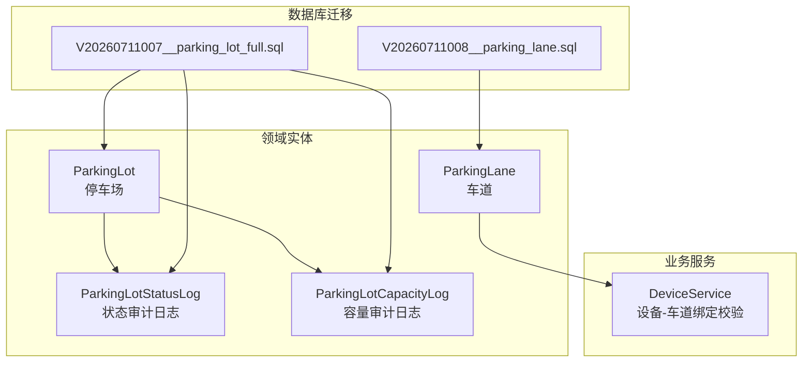
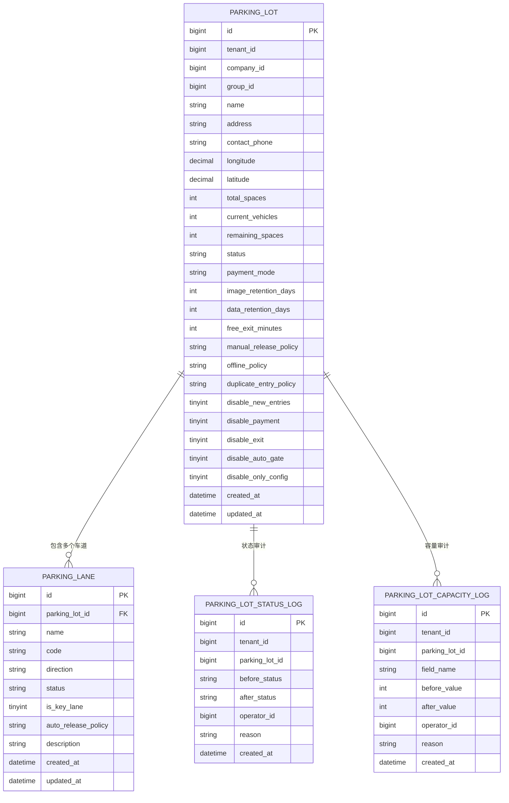
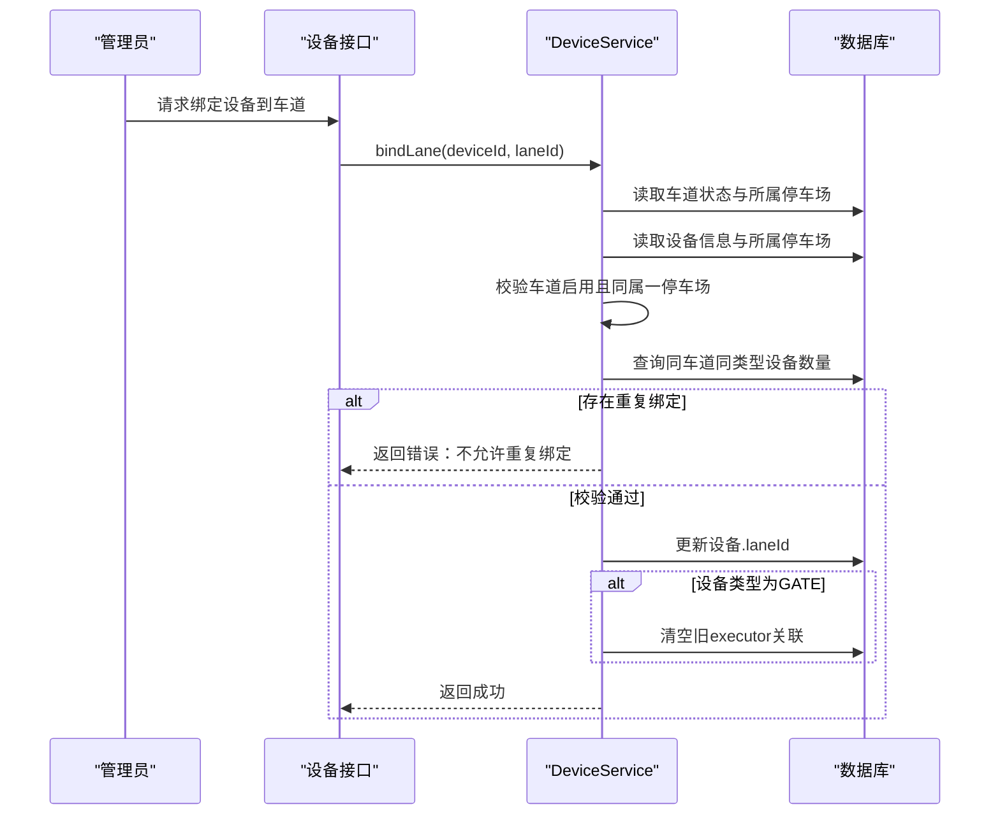
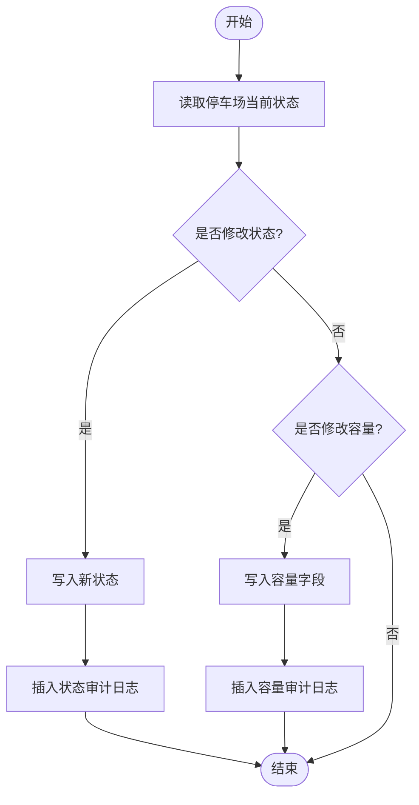
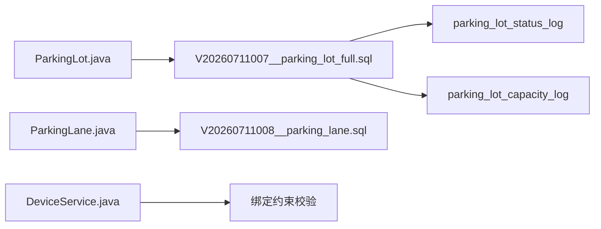

# 停车场管理表设计

<cite>
**本文引用的文件**
- [ParkingLot.java](file://parking-system/src/main/java/com/jushan/system/entity/ParkingLot.java)
- [ParkingLane.java](file://parking-system/src/main/java/com/jushan/system/entity/ParkingLane.java)
- [ParkingLotStatusLog.java](file://parking-system/src/main/java/com/jushan/system/entity/ParkingLotStatusLog.java)
- [ParkingLotCapacityLog.java](file://parking-system/src/main/java/com/jushan/system/entity/ParkingLotCapacityLog.java)
- [V20260711007__parking_lot_full.sql](file://parking-boot/src/main/resources/db/migration/V20260711007__parking_lot_full.sql)
- [V20260711008__parking_lane.sql](file://parking-boot/src/main/resources/db/migration/V20260711008__parking_lane.sql)
- [DeviceService.java](file://parking-system/src/main/java/com/jushan/system/service/DeviceService.java)
- [section_03_ddl.md](file://docs/开发计划/section_03_ddl.md)
</cite>

## 目录
1. [引言](#引言)
2. [项目结构](#项目结构)
3. [核心组件](#核心组件)
4. [架构总览](#架构总览)
5. [详细组件分析](#详细组件分析)
6. [依赖关系分析](#依赖关系分析)
7. [性能与索引优化](#性能与索引优化)
8. [并发控制与一致性](#并发控制与一致性)
9. [故障排查指南](#故障排查指南)
10. [结论](#结论)

## 引言
本文件聚焦于“停车场管理”相关数据模型，围绕以下目标展开：
- 完整阐述停车场实体 ParkingLot 的表结构设计（基础信息、容量配置、状态与策略等）。
- 详细说明车道实体 ParkingLane 的设计（方向、状态、关键性、自动放行策略等）。
- 描述停车场与车道的关联建模（一对多）及与设备的绑定关系。
- 给出停车场状态流转的数据模型与审计机制。
- 提供空间索引优化建议、并发访问控制与数据一致性保障方案。

## 项目结构
与本次文档相关的代码与脚本主要分布在如下位置：
- 实体定义：parking-system 模块中的 entity 包
- 数据库迁移：parking-boot 模块 resources/db/migration 下的 Flyway SQL
- 业务服务：parking-system 模块中的 service 包（设备与车道绑定校验逻辑）
- 规范与建议：docs/开发计划/section_03_ddl.md 中的索引与性能建议

图表来源
- [ParkingLot.java:1-184](file://parking-system/src/main/java/com/jushan/system/entity/ParkingLot.java#L1-L184)
- [ParkingLane.java:1-93](file://parking-system/src/main/java/com/jushan/system/entity/ParkingLane.java#L1-L93)
- [ParkingLotStatusLog.java:1-70](file://parking-system/src/main/java/com/jushan/system/entity/ParkingLotStatusLog.java#L1-L70)
- [ParkingLotCapacityLog.java:1-76](file://parking-system/src/main/java/com/jushan/system/entity/ParkingLotCapacityLog.java#L1-L76)
- [V20260711007__parking_lot_full.sql:1-65](file://parking-boot/src/main/resources/db/migration/V20260711007__parking_lot_full.sql#L1-L65)
- [V20260711008__parking_lane.sql:1-29](file://parking-boot/src/main/resources/db/migration/V20260711008__parking_lane.sql#L1-L29)
- [DeviceService.java:433-493](file://parking-system/src/main/java/com/jushan/system/service/DeviceService.java#L433-L493)

章节来源
- [ParkingLot.java:1-184](file://parking-system/src/main/java/com/jushan/system/entity/ParkingLot.java#L1-L184)
- [ParkingLane.java:1-93](file://parking-system/src/main/java/com/jushan/system/entity/ParkingLane.java#L1-L93)
- [V20260711007__parking_lot_full.sql:1-65](file://parking-boot/src/main/resources/db/migration/V20260711007__parking_lot_full.sql#L1-L65)
- [V20260711008__parking_lane.sql:1-29](file://parking-boot/src/main/resources/db/migration/V20260711008__parking_lane.sql#L1-L29)

## 核心组件
本节对核心实体与审计日志进行概览式说明，后续章节将深入字段设计与约束。

- 停车场 ParkingLot
  - 承载基础信息、容量指标、运行策略与停用策略等。
  - 通过审计日志记录状态与容量变更轨迹。
- 车道 ParkingLane
  - 描述入口/出口/混合车道及其放行策略、是否关键车道等。
  - 与设备存在绑定关系（由服务层保证同类型设备唯一绑定）。
- 审计日志
  - 状态变更：记录 before_status/after_status、操作人、原因。
  - 容量变更：记录 total_spaces/remaining_spaces 的数值变化与原因。

章节来源
- [ParkingLot.java:1-184](file://parking-system/src/main/java/com/jushan/system/entity/ParkingLot.java#L1-L184)
- [ParkingLane.java:1-93](file://parking-system/src/main/java/com/jushan/system/entity/ParkingLane.java#L1-L93)
- [ParkingLotStatusLog.java:1-70](file://parking-system/src/main/java/com/jushan/system/entity/ParkingLotStatusLog.java#L1-L70)
- [ParkingLotCapacityLog.java:1-76](file://parking-system/src/main/java/com/jushan/system/entity/ParkingLotCapacityLog.java#L1-L76)

## 架构总览
从数据模型角度，停车场与车道为典型的一对多关系；设备与车道在应用层做唯一性约束，避免重复绑定。

图表来源
- [V20260711007__parking_lot_full.sql:1-65](file://parking-boot/src/main/resources/db/migration/V20260711007__parking_lot_full.sql#L1-L65)
- [V20260711008__parking_lane.sql:1-29](file://parking-boot/src/main/resources/db/migration/V20260711008__parking_lane.sql#L1-L29)
- [ParkingLotStatusLog.java:1-70](file://parking-system/src/main/java/com/jushan/system/entity/ParkingLotStatusLog.java#L1-L70)
- [ParkingLotCapacityLog.java:1-76](file://parking-system/src/main/java/com/jushan/system/entity/ParkingLotCapacityLog.java#L1-L76)

## 详细组件分析

### 停车场实体 ParkingLot 表设计
- 基础信息
  - 标识与归属：id、tenant_id、company_id、group_id（冗余便于按集团查询）。
  - 名称与联系：name、address、contact_phone。
  - 地理坐标预留：longitude、latitude（DECIMAL(10,7)）。
- 容量与统计
  - total_spaces：总车位数。
  - current_vehicles：当前在场车辆数（只读，由停车记录计算）。
  - remaining_spaces：剩余车位数（默认=total_spaces-current_vehicles，允许人工修正）。
- 运营策略
  - payment_mode：支付模式（平台统一商户/客户独立商户）。
  - image_retention_days / data_retention_days：图片与业务数据保留天数。
  - free_exit_minutes：缴费后免费离场时间（分钟）。
  - manual_release_policy：人工放行策略（仅管理员/岗亭可放行）。
  - offline_policy：离线运行策略（允许出入/只出不进/禁止通行）。
  - duplicate_entry_policy：重复入场策略（拒绝/更新原记录/创建异常记录）。
- 停用策略
  - disable_new_entries/disable_payment/disable_exit/disable_auto_gate/disable_only_config：细粒度控制停用时的能力开关。
- 审计与时间戳
  - created_at、updated_at。
  - 配合 parking_lot_status_log 与 parking_lot_capacity_log 实现状态与容量变更的可追溯。

章节来源
- [ParkingLot.java:1-184](file://parking-system/src/main/java/com/jushan/system/entity/ParkingLot.java#L1-L184)
- [V20260711007__parking_lot_full.sql:1-65](file://parking-boot/src/main/resources/db/migration/V20260711007__parking_lot_full.sql#L1-L65)

### 车道实体 ParkingLane 表设计
- 基础信息
  - 标识与归属：id、parking_lot_id、tenant_id（通过 parking_lot_id 推导）。
  - 名称与编码：name、code（在停车场内唯一）。
- 方向与状态
  - direction：ENTRY/EXIT/MIXED。
  - status：ENABLED/DISABLED。
- 关键性与放行策略
  - is_key_lane：是否为关键车道（影响可用性评估）。
  - auto_release_policy：AUTO/MANUAL/AFTER_PAY。
- 备注与时间戳
  - description、created_at、updated_at。
- 索引设计
  - 唯一索引：uq_parking_lot_code(parking_lot_id, code)。
  - 普通索引：idx_parking_lot_id、idx_status、idx_direction。

章节来源
- [ParkingLane.java:1-93](file://parking-system/src/main/java/com/jushan/system/entity/ParkingLane.java#L1-L93)
- [V20260711008__parking_lane.sql:1-29](file://parking-boot/src/main/resources/db/migration/V20260711008__parking_lane.sql#L1-L29)

### 停车场与车道的关联关系
- 一对多建模
  - parking_lane.parking_lot_id → parking_lot.id。
  - 通过唯一索引 uq_parking_lot_code 确保同一停车场内车道编码唯一。
- 设备绑定关系（应用层约束）
  - 设备与车道绑定需满足：
    - 车道处于启用状态。
    - 设备与车道属于同一停车场。
    - 同一车道、同一设备类型仅允许绑定一台设备（排除自身时仍唯一）。
  - 当 GATE 设备绑定后，会清空旧的 executor 关联，避免执行器冲突。

图表来源
- [DeviceService.java:433-493](file://parking-system/src/main/java/com/jushan/system/service/DeviceService.java#L433-L493)

章节来源
- [V20260711008__parking_lane.sql:1-29](file://parking-boot/src/main/resources/db/migration/V20260711008__parking_lane.sql#L1-29)
- [DeviceService.java:433-493](file://parking-system/src/main/java/com/jushan/system/service/DeviceService.java#L433-L493)

### 停车场状态流转的数据模型
- 状态枚举
  - ENABLED：启用
  - DISABLED：禁用
- 审计日志
  - parking_lot_status_log 记录每次状态变更的前后值、操作人与原因。
- 容量审计
  - parking_lot_capacity_log 记录 total_spaces/remaining_spaces 的变更轨迹。

图表来源
- [V20260711007__parking_lot_full.sql:1-65](file://parking-boot/src/main/resources/db/migration/V20260711007__parking_lot_full.sql#L1-L65)
- [ParkingLotStatusLog.java:1-70](file://parking-system/src/main/java/com/jushan/system/entity/ParkingLotStatusLog.java#L1-L70)
- [ParkingLotCapacityLog.java:1-76](file://parking-system/src/main/java/com/jushan/system/entity/ParkingLotCapacityLog.java#L1-L76)

章节来源
- [V20260711007__parking_lot_full.sql:1-65](file://parking-boot/src/main/resources/db/migration/V20260711007__parking_lot_full.sql#L1-L65)
- [ParkingLotStatusLog.java:1-70](file://parking-system/src/main/java/com/jushan/system/entity/ParkingLotStatusLog.java#L1-L70)
- [ParkingLotCapacityLog.java:1-76](file://parking-system/src/main/java/com/jushan/system/entity/ParkingLotCapacityLog.java#L1-L76)

## 依赖关系分析
- 实体与迁移脚本
  - ParkingLot 与 ParkingLane 的字段定义与迁移脚本保持一致，确保模型与DDL同步。
- 服务与约束
  - DeviceService 在服务层实施设备-车道绑定的业务规则，弥补纯DDL无法表达的复杂约束。
- 审计与可追溯
  - 状态与容量变更均落库至对应审计表，形成闭环审计链。

图表来源
- [ParkingLot.java:1-184](file://parking-system/src/main/java/com/jushan/system/entity/ParkingLot.java#L1-L184)
- [ParkingLane.java:1-93](file://parking-system/src/main/java/com/jushan/system/entity/ParkingLane.java#L1-L93)
- [V20260711007__parking_lot_full.sql:1-65](file://parking-boot/src/main/resources/db/migration/V20260711007__parking_lot_full.sql#L1-L65)
- [V20260711008__parking_lane.sql:1-29](file://parking-boot/src/main/resources/db/migration/V20260711008__parking_lane.sql#L1-L29)
- [DeviceService.java:433-493](file://parking-system/src/main/java/com/jushan/system/service/DeviceService.java#L433-L493)

章节来源
- [ParkingLot.java:1-184](file://parking-system/src/main/java/com/jushan/system/entity/ParkingLot.java#L1-L184)
- [ParkingLane.java:1-93](file://parking-system/src/main/java/com/jushan/system/entity/ParkingLane.java#L1-L93)
- [V20260711007__parking_lot_full.sql:1-65](file://parking-boot/src/main/resources/db/migration/V20260711007__parking_lot_full.sql#L1-L65)
- [V20260711008__parking_lane.sql:1-29](file://parking-boot/src/main/resources/db/migration/V20260711008__parking_lane.sql#L1-L29)
- [DeviceService.java:433-493](file://parking-system/src/main/java/com/jushan/system/service/DeviceService.java#L433-L493)

## 性能与索引优化
- 现有索引
  - parking_lane：
    - 唯一索引 uq_parking_lot_code(parking_lot_id, code)
    - 普通索引 idx_parking_lot_id、idx_status、idx_direction
  - parking_lot_status_log：
    - 普通索引 idx_parking_lot_id、idx_created_at
  - parking_lot_capacity_log：
    - 普通索引 idx_parking_lot_id、idx_created_at
- 通用建议（来自设计规范）
  - 所有业务表必须包含 tenant_id 与 deleted_at 索引。
  - 高频查询字段建立组合索引，例如按 (tenant_id, lot_id, time_range) 等。
  - 车牌字段统一大写存储，模糊搜索使用前缀匹配或搜索引擎。
  - 时间字段频繁查询时考虑分区或时间索引。
  - 大表按 tenant_id 或时间分表/分区规划。
  - 使用乐观锁 version 字段防止并发更新冲突。
  - 敏感字段应用层加密存储。

章节来源
- [V20260711008__parking_lane.sql:1-29](file://parking-boot/src/main/resources/db/migration/V20260711008__parking_lane.sql#L1-29)
- [V20260711007__parking_lot_full.sql:1-65](file://parking-boot/src/main/resources/db/migration/V20260711007__parking_lot_full.sql#L1-L65)
- [section_03_ddl.md:2007-2028](file://docs/开发计划/section_03_ddl.md#L2007-L2028)

## 并发控制与一致性
- 应用层约束
  - 设备-车道绑定：同车道同类型设备唯一（排除自身），并在绑定后清理旧执行器关联，避免并发导致的执行器冲突。
- 事务与幂等
  - 绑定/解绑操作应在事务中完成，确保设备 laneId 与执行器清理的一致性。
  - 结合消息幂等键（如 messageId）与去重表，避免重复处理导致的状态不一致。
- 乐观锁
  - 对热点字段（如 remaining_spaces）更新建议使用 version 字段，减少写冲突。
- 读写分离与缓存
  - 对于 parking_lot.remaining_spaces 这类“近似实时”指标，可在缓存层维护并定期回写，降低热点行竞争。

章节来源
- [DeviceService.java:433-493](file://parking-system/src/main/java/com/jushan/system/service/DeviceService.java#L433-L493)
- [section_03_ddl.md:2007-2028](file://docs/开发计划/section_03_ddl.md#L2007-L2028)

## 故障排查指南
- 设备绑定失败
  - 常见原因：车道已停用、设备与车道不属于同一停车场、同车道同类型设备重复绑定。
  - 定位方法：检查 DeviceService 中的校验分支与返回的错误码。
- 容量不一致
  - 现象：remaining_spaces 与 total_spaces/current_vehicles 不一致。
  - 定位方法：查看 parking_lot_capacity_log 审计记录，确认最近一次人工修正或系统更新的原因与操作人。
- 状态不可用
  - 现象：停车场显示禁用但仍有设备在线。
  - 定位方法：查看 parking_lot_status_log 审计记录，确认状态切换时间与原因。

章节来源
- [DeviceService.java:433-493](file://parking-system/src/main/java/com/jushan/system/service/DeviceService.java#L433-L493)
- [V20260711007__parking_lot_full.sql:1-65](file://parking-boot/src/main/resources/db/migration/V20260711007__parking_lot_full.sql#L1-L65)

## 结论
- 停车场与车道采用清晰的一对多建模，并通过唯一索引与服务层约束共同保障数据正确性。
- 状态与容量变更具备完善的审计追踪，有利于问题回溯与合规审计。
- 在索引与并发控制方面，遵循规范建议并结合乐观锁与事务，可有效提升一致性与性能。
- 建议在后续迭代中持续完善空间索引与热点字段缓存策略，以支撑更大规模与更高并发场景。