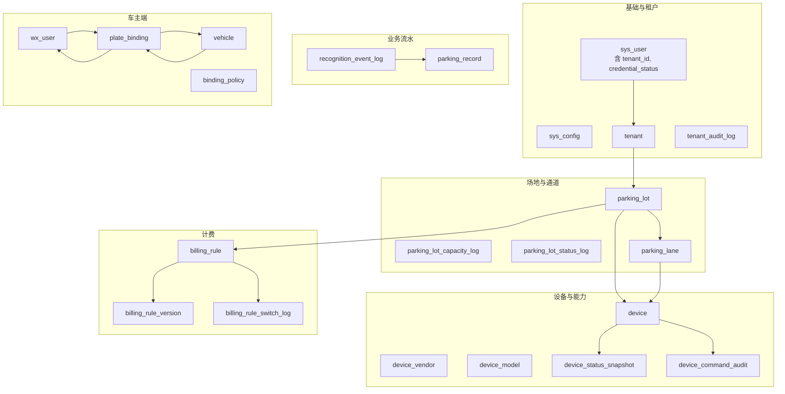
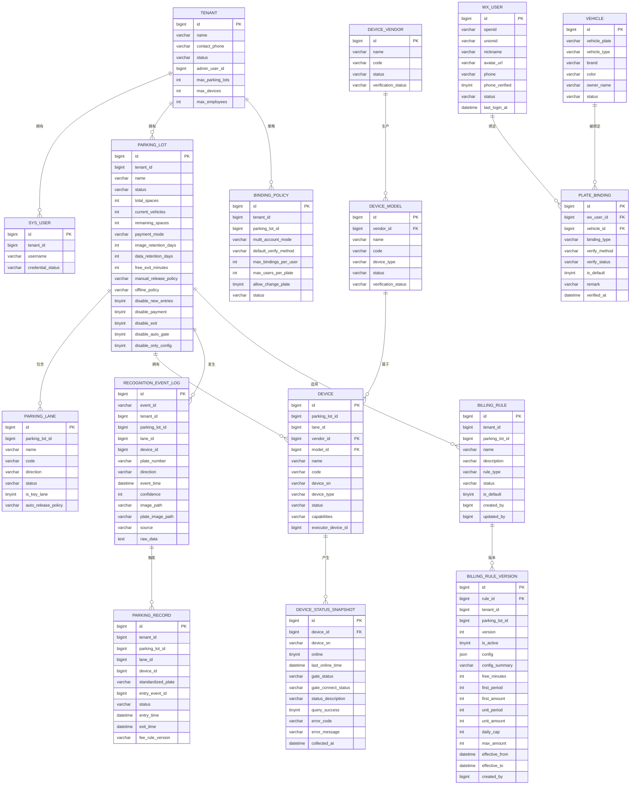
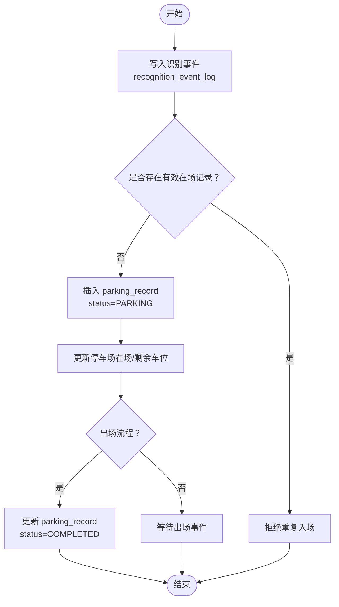
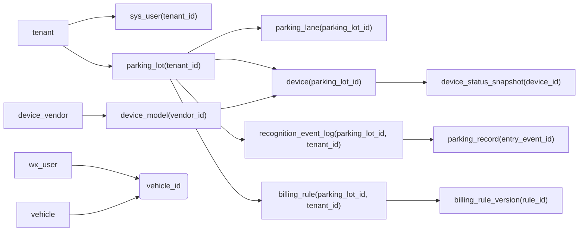

# 核心表结构设计

<cite>
**本文引用的文件**   
- [V20260710001__baseline.sql](file://parking-boot/src/main/resources/db/migration/V20260710001__baseline.sql)
- [V20260711004__tenant_and_registration.sql](file://parking-boot/src/main/resources/db/migration/V20260711004__tenant_and_registration.sql)
- [V20260711005__employee_and_parking_lot.sql](file://parking-boot/src/main/resources/db/migration/V20260711005__employee_and_parking_lot.sql)
- [V20260711007__parking_lot_full.sql](file://parking-boot/src/main/resources/db/migration/V20260711007__parking_lot_full.sql)
- [V20260711008__parking_lane.sql](file://parking-boot/src/main/resources/db/migration/V20260711008__parking_lane.sql)
- [V20260711009__device_vendor_model.sql](file://parking-boot/src/main/resources/db/migration/V20260711009__device_vendor_model.sql)
- [V20260711010__lane_device_binding.sql](file://parking-boot/src/main/resources/db/migration/V20260711010__lane_device_binding.sql)
- [V20260711011__device_status_snapshot.sql](file://parking-boot/src/main/resources/db/migration/V20260711011__device_status_snapshot.sql)
- [V20260711013__credential_status.sql](file://parking-boot/src/main/resources/db/migration/V20260711013__credential_status.sql)
- [V20260711014__device_verification_status.sql](file://parking-boot/src/main/resources/db/migration/V20260711014__device_verification_status.sql)
- [V20260712015__recognition_event_log.sql](file://parking-boot/src/main/resources/db/migration/V20260712015__recognition_event_log.sql)
- [V20260712017__parking_record.sql](file://parking-boot/src/main/resources/db/migration/V20260712017__parking_record.sql)
- [V20260712018__billing_rule.sql](file://parking-boot/src/main/resources/db/migration/V20260712018__billing_rule.sql)
- [V20260712019__wx_user_and_vehicle.sql](file://parking-boot/src/main/resources/db/migration/V20260712019__wx_user_and_vehicle.sql)
- [V20260712020__device_command_audit.sql](file://parking-boot/src/main/resources/db/migration/V20260712020__device_command_audit.sql)
</cite>

## 目录
1. [引言](#引言)
2. [项目结构](#项目结构)
3. [核心组件](#核心组件)
4. [架构总览](#架构总览)
5. [详细组件分析](#详细组件分析)
6. [依赖关系分析](#依赖关系分析)
7. [性能考虑](#性能考虑)
8. [故障排查指南](#故障排查指南)
9. [结论](#结论)
10. [附录](#附录)

## 引言
本文件聚焦停车SaaS平台的核心表结构设计，围绕多租户隔离、停车场/设备/计费规则等关键实体展开。文档从数据模型、字段与约束、索引策略、主外键与完整性保证、字符集与存储引擎选择等方面给出系统化说明，并配套ER图与关系说明，帮助读者快速理解整体设计与落地细节。

## 项目结构
数据库变更通过Flyway迁移脚本管理，按版本顺序创建和演进表结构。本次文档涉及的核心迁移脚本如下：
- 基线与系统配置：V20260710001__baseline.sql
- 租户与注册审核：V20260711004__tenant_and_registration.sql
- 员工与停车场占位：V20260711005__employee_and_parking_lot.sql
- 停车场完整信息：V20260711007__parking_lot_full.sql
- 车道模型：V20260711008__parking_lane.sql
- 设备厂商/型号/台账：V20260711009__device_vendor_model.sql
- 设备-车道绑定与执行设备：V20260711010__lane_device_binding.sql
- 设备状态快照：V20260711011__device_status_snapshot.sql
- 凭据状态（强制改密）：V20260711013__credential_status.sql
- 设备验证状态：V20260711014__device_verification_status.sql
- 识别事件日志：V20260712015__recognition_event_log.sql
- 停车记录：V20260712017__parking_record.sql
- 收费规则与版本：V20260712018__billing_rule.sql
- 微信用户/车辆/绑定与策略：V20260712019__wx_user_and_vehicle.sql
- 设备命令审计：V20260712020__device_command_audit.sql

图表来源
- [V20260710001__baseline.sql:1-23](file://parking-boot/src/main/resources/db/migration/V20260710001__baseline.sql#L1-L23)
- [V20260711004__tenant_and_registration.sql:1-55](file://parking-boot/src/main/resources/db/migration/V20260711004__tenant_and_registration.sql#L1-L55)
- [V20260711005__employee_and_parking_lot.sql:1-37](file://parking-boot/src/main/resources/db/migration/V20260711005__employee_and_parking_lot.sql#L1-L37)
- [V20260711007__parking_lot_full.sql:1-65](file://parking-boot/src/main/resources/db/migration/V20260711007__parking_lot_full.sql#L1-L65)
- [V20260711008__parking_lane.sql:1-29](file://parking-boot/src/main/resources/db/migration/V20260711008__parking_lane.sql#L1-L29)
- [V20260711009__device_vendor_model.sql:1-89](file://parking-boot/src/main/resources/db/migration/V20260711009__device_vendor_model.sql#L1-L89)
- [V20260711010__lane_device_binding.sql:1-29](file://parking-boot/src/main/resources/db/migration/V20260711010__lane_device_binding.sql#L1-L29)
- [V20260711011__device_status_snapshot.sql:1-32](file://parking-boot/src/main/resources/db/migration/V20260711011__device_status_snapshot.sql#L1-L32)
- [V20260711013__credential_status.sql:1-18](file://parking-boot/src/main/resources/db/migration/V20260711013__credential_status.sql#L1-L18)
- [V20260711014__device_verification_status.sql:1-24](file://parking-boot/src/main/resources/db/migration/V20260711014__device_verification_status.sql#L1-L24)
- [V20260712015__recognition_event_log.sql:1-36](file://parking-boot/src/main/resources/db/migration/V20260712015__recognition_event_log.sql#L1-L36)
- [V20260712017__parking_record.sql:1-38](file://parking-boot/src/main/resources/db/migration/V20260712017__parking_record.sql#L1-L38)
- [V20260712018__billing_rule.sql:1-82](file://parking-boot/src/main/resources/db/migration/V20260712018__billing_rule.sql#L1-L82)
- [V20260712019__wx_user_and_vehicle.sql:1-108](file://parking-boot/src/main/resources/db/migration/V20260712019__wx_user_and_vehicle.sql#L1-L108)
- [V20260712020__device_command_audit.sql:1-49](file://parking-boot/src/main/resources/db/migration/V20260712020__device_command_audit.sql#L1-L49)

章节来源
- [V20260710001__baseline.sql:1-23](file://parking-boot/src/main/resources/db/migration/V20260710001__baseline.sql#L1-L23)
- [V20260711004__tenant_and_registration.sql:1-55](file://parking-boot/src/main/resources/db/migration/V20260711004__tenant_and_registration.sql#L1-L55)
- [V20260711005__employee_and_parking_lot.sql:1-37](file://parking-boot/src/main/resources/db/migration/V20260711005__employee_and_parking_lot.sql#L1-L37)
- [V20260711007__parking_lot_full.sql:1-65](file://parking-boot/src/main/resources/db/migration/V20260711007__parking_lot_full.sql#L1-L65)
- [V20260711008__parking_lane.sql:1-29](file://parking-boot/src/main/resources/db/migration/V20260711008__parking_lane.sql#L1-L29)
- [V20260711009__device_vendor_model.sql:1-89](file://parking-boot/src/main/resources/db/migration/V20260711009__device_vendor_model.sql#L1-L89)
- [V20260711010__lane_device_binding.sql:1-29](file://parking-boot/src/main/resources/db/migration/V20260711010__lane_device_binding.sql#L1-L29)
- [V20260711011__device_status_snapshot.sql:1-32](file://parking-boot/src/main/resources/db/migration/V20260711011__device_status_snapshot.sql#L1-L32)
- [V20260711013__credential_status.sql:1-18](file://parking-boot/src/main/resources/db/migration/V20260711013__credential_status.sql#L1-L18)
- [V20260711014__device_verification_status.sql:1-24](file://parking-boot/src/main/resources/db/migration/V20260711014__device_verification_status.sql#L1-L24)
- [V20260712015__recognition_event_log.sql:1-36](file://parking-boot/src/main/resources/db/migration/V20260712015__recognition_event_log.sql#L1-L36)
- [V20260712017__parking_record.sql:1-38](file://parking-boot/src/main/resources/db/migration/V20260712017__parking_record.sql#L1-L38)
- [V20260712018__billing_rule.sql:1-82](file://parking-boot/src/main/resources/db/migration/V20260712018__billing_rule.sql#L1-L82)
- [V20260712019__wx_user_and_vehicle.sql:1-108](file://parking-boot/src/main/resources/db/migration/V20260712019__wx_user_and_vehicle.sql#L1-L108)
- [V20260712020__device_command_audit.sql:1-49](file://parking-boot/src/main/resources/db/migration/V20260712020__device_command_audit.sql#L1-L49)

## 核心组件
本节概述各核心实体的职责与关键字段设计要点（不直接展示代码内容）。

- 系统配置 sys_config
  - 用途：平台级 key-value 动态配置，避免重启应用。
  - 关键点：config_key 唯一；文本值使用大字段；时间戳自动维护。
  - 参考路径：[V20260710001__baseline.sql:1-23](file://parking-boot/src/main/resources/db/migration/V20260710001__baseline.sql#L1-L23)

- 租户 tenant 与审核日志 tenant_audit_log
  - 用途：租户生命周期管理与操作审计。
  - 关键点：企业名称/联系电话唯一；状态枚举；管理员账号关联；索引覆盖常用查询。
  - 参考路径：[V20260711004__tenant_and_registration.sql:1-55](file://parking-boot/src/main/resources/db/migration/V20260711004__tenant_and_registration.sql#L1-L55)

- 用户 sys_user（扩展）
  - 用途：平台与租户用户统一账户体系。
  - 关键点：新增 tenant_id 用于租户归属；新增 credential_status 强制首次改密。
  - 参考路径：[V20260711004__tenant_and_registration.sql:50-55](file://parking-boot/src/main/resources/db/migration/V20260711004__tenant_and_registration.sql#L50-L55)、[V20260711013__credential_status.sql:1-18](file://parking-boot/src/main/resources/db/migration/V20260711013__credential_status.sql#L1-L18)

- 停车场 parking_lot 及审计日志
  - 用途：停车场基础信息与运行策略；容量/状态变更审计。
  - 关键点：地址/经纬度/车位数/支付模式/图片与数据保留天数/离线策略/停用控制开关；容量与状态变更可追溯。
  - 参考路径：[V20260711005__employee_and_parking_lot.sql:1-37](file://parking-boot/src/main/resources/db/migration/V20260711005__employee_and_parking_lot.sql#L1-L37)、[V20260711007__parking_lot_full.sql:1-65](file://parking-boot/src/main/resources/db/migration/V20260711007__parking_lot_full.sql#L1-L65)

- 车道 parking_lane
  - 用途：入口/出口/混合车道模型，编码在停车场内唯一。
  - 关键点：方向、是否关键车道、自动放行策略；索引支持按停车场/状态/方向查询。
  - 参考路径：[V20260711008__parking_lane.sql:1-29](file://parking-boot/src/main/resources/db/migration/V20260711008__parking_lane.sql#L1-L29)

- 设备族 device_vendor / device_model / device
  - 用途：设备厂商、型号与平台设备台账；SN 在同厂商下唯一；设备编码在停车场内唯一。
  - 关键点：设备类型（相机/道闸）、能力描述、状态；逻辑道闸的执行相机引用；同一车道每种设备类型唯一。
  - 参考路径：[V20260711009__device_vendor_model.sql:1-89](file://parking-boot/src/main/resources/db/migration/V20260711009__device_vendor_model.sql#L1-L89)、[V20260711010__lane_device_binding.sql:1-29](file://parking-boot/src/main/resources/db/migration/V20260711010__lane_device_binding.sql#L1-L29)、[V20260711014__device_verification_status.sql:1-24](file://parking-boot/src/main/resources/db/migration/V20260711014__device_verification_status.sql#L1-L24)

- 设备状态快照 device_status_snapshot
  - 用途：持久化对 Device Access 的状态查询结果，支持最新快照与历史排障。
  - 关键点：在线状态、连接状态、采集时间、成功/失败标记与错误信息。
  - 参考路径：[V20260711011__device_status_snapshot.sql:1-32](file://parking-boot/src/main/resources/db/migration/V20260711011__device_status_snapshot.sql#L1-L32)

- 识别事件 recognition_event_log
  - 用途：平台内部标准识别事件（Mock/人工/未来接入），提供追溯与审计。
  - 关键点：事件ID幂等、租户+停车场隔离、车牌号与方向索引。
  - 参考路径：[V20260712015__recognition_event_log.sql:1-36](file://parking-boot/src/main/resources/db/migration/V20260712015__recognition_event_log.sql#L1-L36)

- 停车记录 parking_record
  - 用途：入场通行与在场状态主链路。
  - 关键点：同车同停车场仅一条有效在场记录（功能唯一索引）；辅助索引支持按状态/车牌/事件查询。
  - 参考路径：[V20260712017__parking_record.sql:1-38](file://parking-boot/src/main/resources/db/migration/V20260712017__parking_record.sql#L1-L38)

- 收费规则 billing_rule / billing_rule_version / billing_rule_switch_log
  - 用途：规则主表、不可变版本快照、切换审计。
  - 关键点：规则类型、默认规则、生效范围；JSON 配置与摘要字段；版本唯一性。
  - 参考路径：[V20260712018__billing_rule.sql:1-82](file://parking-boot/src/main/resources/db/migration/V20260712018__billing_rule.sql#L1-L82)

- 微信用户/车辆/绑定 wx_user / vehicle / plate_binding / binding_policy
  - 用途：车主端账户、车辆档案、绑定关系与策略配置。
  - 关键点：OpenId/UnionId/手机号唯一；绑定校验方式与状态；多账号绑定策略。
  - 参考路径：[V20260712019__wx_user_and_vehicle.sql:1-108](file://parking-boot/src/main/resources/db/migration/V20260712019__wx_user_and_vehicle.sql#L1-L108)

- 设备命令审计 device_command_audit
  - 用途：Device Access v1.0 命令调用审计（开闸/抓拍/校时等）。
  - 关键点：命令ID、不确定状态标记、请求/响应报文、前次命令关联。
  - 参考路径：[V20260712020__device_command_audit.sql:1-49](file://parking-boot/src/main/resources/db/migration/V20260712020__device_command_audit.sql#L1-L49)

章节来源
- [V20260710001__baseline.sql:1-23](file://parking-boot/src/main/resources/db/migration/V20260710001__baseline.sql#L1-L23)
- [V20260711004__tenant_and_registration.sql:1-55](file://parking-boot/src/main/resources/db/migration/V20260711004__tenant_and_registration.sql#L1-L55)
- [V20260711005__employee_and_parking_lot.sql:1-37](file://parking-boot/src/main/resources/db/migration/V20260711005__employee_and_parking_lot.sql#L1-L37)
- [V20260711007__parking_lot_full.sql:1-65](file://parking-boot/src/main/resources/db/migration/V20260711007__parking_lot_full.sql#L1-L65)
- [V20260711008__parking_lane.sql:1-29](file://parking-boot/src/main/resources/db/migration/V20260711008__parking_lane.sql#L1-L29)
- [V20260711009__device_vendor_model.sql:1-89](file://parking-boot/src/main/resources/db/migration/V20260711009__device_vendor_model.sql#L1-L89)
- [V20260711010__lane_device_binding.sql:1-29](file://parking-boot/src/main/resources/db/migration/V20260711010__lane_device_binding.sql#L1-L29)
- [V20260711011__device_status_snapshot.sql:1-32](file://parking-boot/src/main/resources/db/migration/V20260711011__device_status_snapshot.sql#L1-L32)
- [V20260711013__credential_status.sql:1-18](file://parking-boot/src/main/resources/db/migration/V20260711013__credential_status.sql#L1-L18)
- [V20260711014__device_verification_status.sql:1-24](file://parking-boot/src/main/resources/db/migration/V20260711014__device_verification_status.sql#L1-L24)
- [V20260712015__recognition_event_log.sql:1-36](file://parking-boot/src/main/resources/db/migration/V20260712015__recognition_event_log.sql#L1-L36)
- [V20260712017__parking_record.sql:1-38](file://parking-boot/src/main/resources/db/migration/V20260712017__parking_record.sql#L1-L38)
- [V20260712018__billing_rule.sql:1-82](file://parking-boot/src/main/resources/db/migration/V20260712018__billing_rule.sql#L1-L82)
- [V20260712019__wx_user_and_vehicle.sql:1-108](file://parking-boot/src/main/resources/db/migration/V20260712019__wx_user_and_vehicle.sql#L1-L108)
- [V20260712020__device_command_audit.sql:1-49](file://parking-boot/src/main/resources/db/migration/V20260712020__device_command_audit.sql#L1-L49)

## 架构总览
下图展示了核心实体间的关系与数据流向，涵盖租户隔离边界、设备-车道-停车场层级、识别事件到停车记录的转化，以及计费规则与版本的关系。

图表来源
- [V20260711004__tenant_and_registration.sql:1-55](file://parking-boot/src/main/resources/db/migration/V20260711004__tenant_and_registration.sql#L1-L55)
- [V20260711005__employee_and_parking_lot.sql:1-37](file://parking-boot/src/main/resources/db/migration/V20260711005__employee_and_parking_lot.sql#L1-L37)
- [V20260711007__parking_lot_full.sql:1-65](file://parking-boot/src/main/resources/db/migration/V20260711007__parking_lot_full.sql#L1-L65)
- [V20260711008__parking_lane.sql:1-29](file://parking-boot/src/main/resources/db/migration/V20260711008__parking_lane.sql#L1-L29)
- [V20260711009__device_vendor_model.sql:1-89](file://parking-boot/src/main/resources/db/migration/V20260711009__device_vendor_model.sql#L1-L89)
- [V20260711010__lane_device_binding.sql:1-29](file://parking-boot/src/main/resources/db/migration/V20260711010__lane_device_binding.sql#L1-L29)
- [V20260711011__device_status_snapshot.sql:1-32](file://parking-boot/src/main/resources/db/migration/V20260711011__device_status_snapshot.sql#L1-L32)
- [V20260712015__recognition_event_log.sql:1-36](file://parking-boot/src/main/resources/db/migration/V20260712015__recognition_event_log.sql#L1-L36)
- [V20260712017__parking_record.sql:1-38](file://parking-boot/src/main/resources/db/migration/V20260712017__parking_record.sql#L1-L38)
- [V20260712018__billing_rule.sql:1-82](file://parking-boot/src/main/resources/db/migration/V20260712018__billing_rule.sql#L1-L82)
- [V20260712019__wx_user_and_vehicle.sql:1-108](file://parking-boot/src/main/resources/db/migration/V20260712019__wx_user_and_vehicle.sql#L1-L108)

## 详细组件分析

### 多租户架构与隔离策略
- 租户边界
  - 所有业务表均携带 tenant_id 或可通过 parking_lot_id → tenant_id 推导，确保数据隔离。
  - 用户表 sys_user 的 tenant_id 区分平台用户（NULL）与租户用户。
- 隔离实现
  - 应用层：基于租户上下文过滤查询条件。
  - 数据库层：通过联合索引（如 tenant_id + 其他维度）提升隔离查询性能。
- 共享与隔离边界
  - 共享：系统配置、厂商/型号元数据（非租户专属）。
  - 隔离：租户、停车场、设备、记录、规则、车主绑定等。

章节来源
- [V20260711004__tenant_and_registration.sql:1-55](file://parking-boot/src/main/resources/db/migration/V20260711004__tenant_and_registration.sql#L1-L55)
- [V20260711009__device_vendor_model.sql:1-89](file://parking-boot/src/main/resources/db/migration/V20260711009__device_vendor_model.sql#L1-L89)
- [V20260712015__recognition_event_log.sql:1-36](file://parking-boot/src/main/resources/db/migration/V20260712015__recognition_event_log.sql#L1-L36)
- [V20260712017__parking_record.sql:1-38](file://parking-boot/src/main/resources/db/migration/V20260712017__parking_record.sql#L1-L38)
- [V20260712018__billing_rule.sql:1-82](file://parking-boot/src/main/resources/db/migration/V20260712018__billing_rule.sql#L1-L82)

### 停车场与车道
- 停车场 parking_lot
  - 字段要点：名称、地址、经纬度、总车位、当前在场、剩余车位、支付模式、图片与数据保留天数、免费离场时长、离线策略、停用控制开关。
  - 审计：容量变更与状态变更分别建表记录，便于合规与排障。
- 车道 parking_lane
  - 字段要点：名称、编码（停车场内唯一）、方向（入口/出口/混合）、是否关键车道、自动放行策略。
  - 索引：按停车场、状态、方向查询优化。

章节来源
- [V20260711005__employee_and_parking_lot.sql:1-37](file://parking-boot/src/main/resources/db/migration/V20260711005__employee_and_parking_lot.sql#L1-L37)
- [V20260711007__parking_lot_full.sql:1-65](file://parking-boot/src/main/resources/db/migration/V20260711007__parking_lot_full.sql#L1-L65)
- [V20260711008__parking_lane.sql:1-29](file://parking-boot/src/main/resources/db/migration/V20260711008__parking_lane.sql#L1-L29)

### 设备与设备-车道绑定
- 设备族
  - device_vendor：厂商编码唯一，状态与验证状态分离。
  - device_model：同厂商下型号编码唯一，设备类型与验证状态。
  - device：平台设备台账，设备编码在停车场内唯一，SN 在同厂商下唯一；设备类型（相机/道闸）、能力描述、状态。
- 设备-车道绑定
  - 同一车道每种设备类型最多一台（UNIQUE(lane_id, device_type)）。
  - 逻辑道闸执行设备：GATE 设备的 executor_device_id 指向实际控制开闸的 CAMERA 设备；CAMERA 为 NULL（自身即执行者）。
- 设备状态快照
  - 持久化 DA 返回状态，支持最新快照读取与历史排障；包含成功/失败标记与错误信息。

章节来源
- [V20260711009__device_vendor_model.sql:1-89](file://parking-boot/src/main/resources/db/migration/V20260711009__device_vendor_model.sql#L1-L89)
- [V20260711010__lane_device_binding.sql:1-29](file://parking-boot/src/main/resources/db/migration/V20260711010__lane_device_binding.sql#L1-L29)
- [V20260711011__device_status_snapshot.sql:1-32](file://parking-boot/src/main/resources/db/migration/V20260711011__device_status_snapshot.sql#L1-L32)
- [V20260711014__device_verification_status.sql:1-24](file://parking-boot/src/main/resources/db/migration/V20260711014__device_verification_status.sql#L1-L24)

### 识别事件与停车记录
- 识别事件 recognition_event_log
  - 事件幂等：event_id 唯一；来源包括手动、Mock、设备接入。
  - 隔离：tenant_id + parking_lot_id 组合索引，便于按租户与停车场检索。
- 停车记录 parking_record
  - 主链路：入场事件驱动生成记录；出场完成更新状态。
  - 一致性：利用功能唯一索引保障“同车同停车场仅一条有效在场记录”。
  - 索引：按停车场+状态、车牌、入场事件ID查询优化。

图表来源
- [V20260712015__recognition_event_log.sql:1-36](file://parking-boot/src/main/resources/db/migration/V20260712015__recognition_event_log.sql#L1-L36)
- [V20260712017__parking_record.sql:1-38](file://parking-boot/src/main/resources/db/migration/V20260712017__parking_record.sql#L1-L38)

章节来源
- [V20260712015__recognition_event_log.sql:1-36](file://parking-boot/src/main/resources/db/migration/V20260712015__recognition_event_log.sql#L1-L36)
- [V20260712017__parking_record.sql:1-38](file://parking-boot/src/main/resources/db/migration/V20260712017__parking_record.sql#L1-L38)

### 收费规则与版本
- 规则主表 billing_rule
  - 规则类型（按时长/固定金额/免费）、默认规则、启用状态。
  - 同一停车场规则名称唯一。
- 版本表 billing_rule_version
  - 不可变快照，JSON 配置与摘要字段并存；版本递增且唯一。
- 切换审计 billing_rule_switch_log
  - 记录切换前后规则、影响范围与原因。

章节来源
- [V20260712018__billing_rule.sql:1-82](file://parking-boot/src/main/resources/db/migration/V20260712018__billing_rule.sql#L1-L82)

### 微信用户、车辆与绑定策略
- 微信用户 wx_user
  - OpenId/UnionId/手机号唯一；状态与最后登录时间。
- 车辆 vehicle
  - 车牌唯一；车辆类型、品牌、颜色、状态。
- 绑定 plate_binding
  - 绑定类型、验证方式与状态；默认车牌；外键级联删除。
- 策略 binding_policy
  - 按租户/停车场配置多账号模式、默认验证方式、最大绑定数量等。

章节来源
- [V20260712019__wx_user_and_vehicle.sql:1-108](file://parking-boot/src/main/resources/db/migration/V20260712019__wx_user_and_vehicle.sql#L1-L108)

### 设备命令审计
- 设备命令审计 device_command_audit
  - 命令ID、目标设备/车道/停车场、来源、操作人、不确定状态标记、错误码/消息、请求/响应报文、发出/完成时间。
  - 索引：按设备、命令ID、停车场、状态、不确定状态、时间范围查询优化。

章节来源
- [V20260712020__device_command_audit.sql:1-49](file://parking-boot/src/main/resources/db/migration/V20260712020__device_command_audit.sql#L1-L49)

## 依赖关系分析
- 直接依赖
  - parking_lot.tenant_id → tenant.id
  - parking_lane.parking_lot_id → parking_lot.id
  - device.parking_lot_id → parking_lot.id
  - device.vendor_id → device_vendor.id
  - device.model_id → device_model.id
  - device.executor_device_id → device.id（自引用，逻辑约束由应用层保证类型为 CAMERA）
  - device_status_snapshot.device_id → device.id
  - recognition_event_log.tenant_id/parking_lot_id/device_id/lane_id → 对应实体
  - parking_record.tenant_id/parking_lot_id/lane_id/device_id/entry_event_id → 对应实体
  - billing_rule.tenant_id/parking_lot_id → 对应实体
  - billing_rule_version.rule_id → billing_rule.id
  - plate_binding.wx_user_id/vehicle_id → 对应实体
- 间接依赖
  - device 通过 parking_lot 推导 tenant_id，形成租户隔离链。
  - parking_record 通过 entry_event_id 回溯识别事件，形成事件→记录的因果链。

图表来源
- [V20260711004__tenant_and_registration.sql:1-55](file://parking-boot/src/main/resources/db/migration/V20260711004__tenant_and_registration.sql#L1-L55)
- [V20260711007__parking_lot_full.sql:1-65](file://parking-boot/src/main/resources/db/migration/V20260711007__parking_lot_full.sql#L1-L65)
- [V20260711008__parking_lane.sql:1-29](file://parking-boot/src/main/resources/db/migration/V20260711008__parking_lane.sql#L1-L29)
- [V20260711009__device_vendor_model.sql:1-89](file://parking-boot/src/main/resources/db/migration/V20260711009__device_vendor_model.sql#L1-L89)
- [V20260711010__lane_device_binding.sql:1-29](file://parking-boot/src/main/resources/db/migration/V20260711010__lane_device_binding.sql#L1-L29)
- [V20260711011__device_status_snapshot.sql:1-32](file://parking-boot/src/main/resources/db/migration/V20260711011__device_status_snapshot.sql#L1-L32)
- [V20260712015__recognition_event_log.sql:1-36](file://parking-boot/src/main/resources/db/migration/V20260712015__recognition_event_log.sql#L1-L36)
- [V20260712017__parking_record.sql:1-38](file://parking-boot/src/main/resources/db/migration/V20260712017__parking_record.sql#L1-L38)
- [V20260712018__billing_rule.sql:1-82](file://parking-boot/src/main/resources/db/migration/V20260712018__billing_rule.sql#L1-L82)
- [V20260712019__wx_user_and_vehicle.sql:1-108](file://parking-boot/src/main/resources/db/migration/V20260712019__wx_user_and_vehicle.sql#L1-L108)

## 性能考虑
- 索引策略
  - 高频查询列建立单列索引：如 parking_lot.status、device.status、device_type、direction、source 等。
  - 复合索引优先：tenant_id + parking_lot_id、parking_lot_id + status、device_id + collected_at 等。
  - 功能唯一索引：parking_record 的“有效在场记录”约束，避免并发重复入场。
- 数据类型选择
  - 金额以“分”为单位使用整型，避免浮点误差。
  - JSON 配置与摘要并存，兼顾灵活性与查询效率。
  - 坐标使用 DECIMAL(10,7)，满足精度需求。
- 存储与字符集
  - 统一使用 InnoDB 引擎与 utf8mb4_unicode_ci，支持多语言与表情符号，排序规则兼顾中文拼音与通用比较。
- 审计与快照
  - 设备状态快照与命令审计表采用时间倒序索引，便于最近记录快速定位。

## 故障排查指南
- 设备状态异常
  - 查看 device_status_snapshot 中 query_success、error_code、error_message 与 collected_at，定位最近一次采集是否成功。
  - 检查 device.executor_device_id 是否正确指向实际开闸相机。
- 重复入场问题
  - 核查 parking_record 的功能唯一索引 uk_active_parking 是否命中冲突；确认入场事件是否重复写入。
- 计费规则切换
  - 通过 billing_rule_switch_log 查看切换前后规则与影响范围；结合 billing_rule_version 的 is_active 与 effective_from/to 判断生效情况。
- 权限与凭据
  - sys_user.credential_status 标记需强制修改密码的用户；tenant_audit_log 记录租户启停与审核动作。

章节来源
- [V20260711011__device_status_snapshot.sql:1-32](file://parking-boot/src/main/resources/db/migration/V20260711011__device_status_snapshot.sql#L1-L32)
- [V20260712017__parking_record.sql:1-38](file://parking-boot/src/main/resources/db/migration/V20260712017__parking_record.sql#L1-L38)
- [V20260712018__billing_rule.sql:1-82](file://parking-boot/src/main/resources/db/migration/V20260712018__billing_rule.sql#L1-L82)
- [V20260711004__tenant_and_registration.sql:1-55](file://parking-boot/src/main/resources/db/migration/V20260711004__tenant_and_registration.sql#L1-L55)
- [V20260711013__credential_status.sql:1-18](file://parking-boot/src/main/resources/db/migration/V20260711013__credential_status.sql#L1-L18)

## 结论
本设计以租户为核心隔离单元，围绕停车场-车道-设备三层组织物理资源，通过识别事件驱动停车记录，并以计费规则版本化与审计机制保障计费准确性与可追溯性。统一的字符集与存储引擎、合理的索引与约束策略，为系统的可扩展性与稳定性提供了坚实基础。

## 附录
- 字符集与排序规则
  - 全库统一 utf8mb4_unicode_ci，兼容多语言与表情符号，排序行为符合 Unicode 规范。
- 存储引擎
  - 全部使用 InnoDB，支持事务、行级锁与外键约束。
- 主外键与完整性
  - 业务强一致场景通过唯一索引与功能唯一索引保障（如 parking_record 有效在场记录）。
  - 部分外键约束显式定义（如 plate_binding 对 wx_user 与 vehicle 的级联删除），其余通过应用层校验与索引约束共同保证。