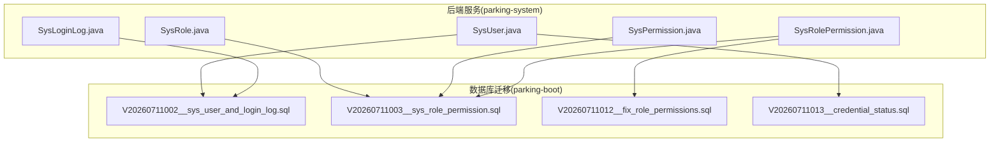
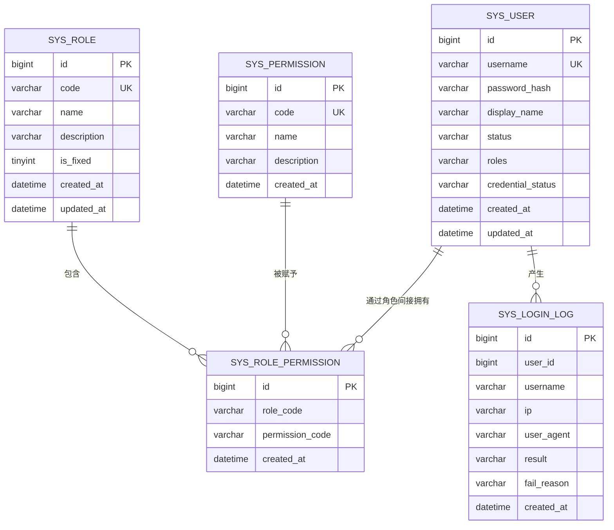
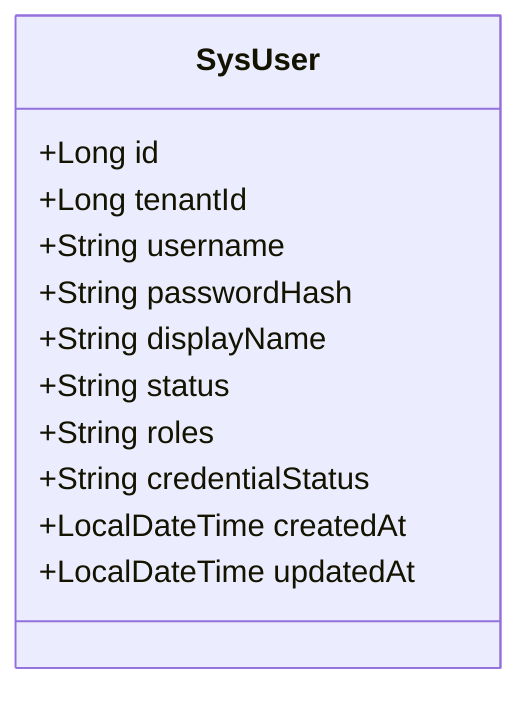
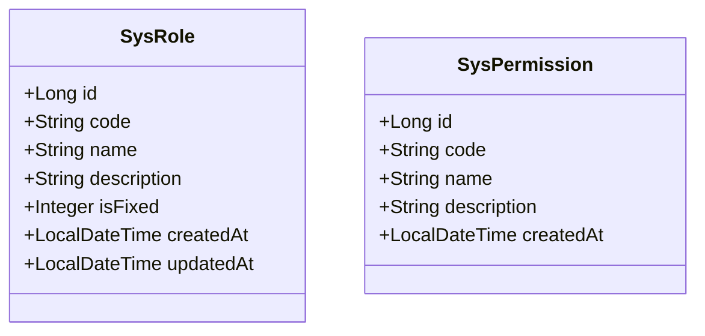
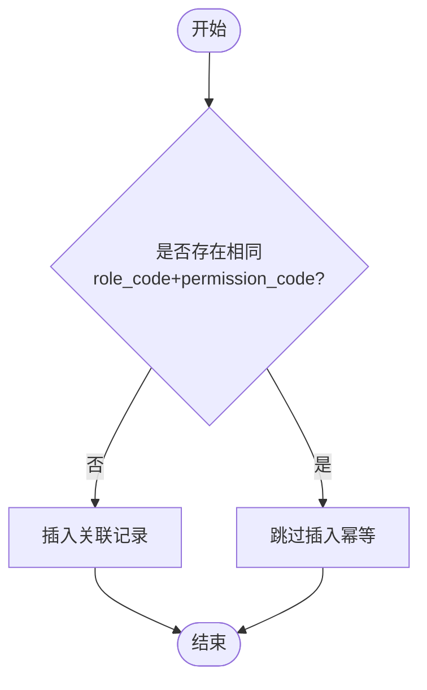
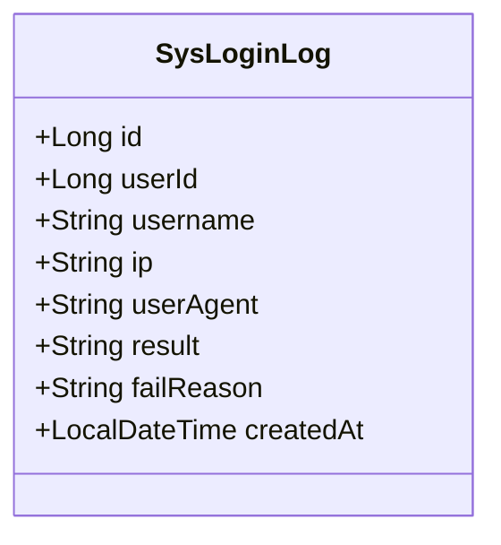
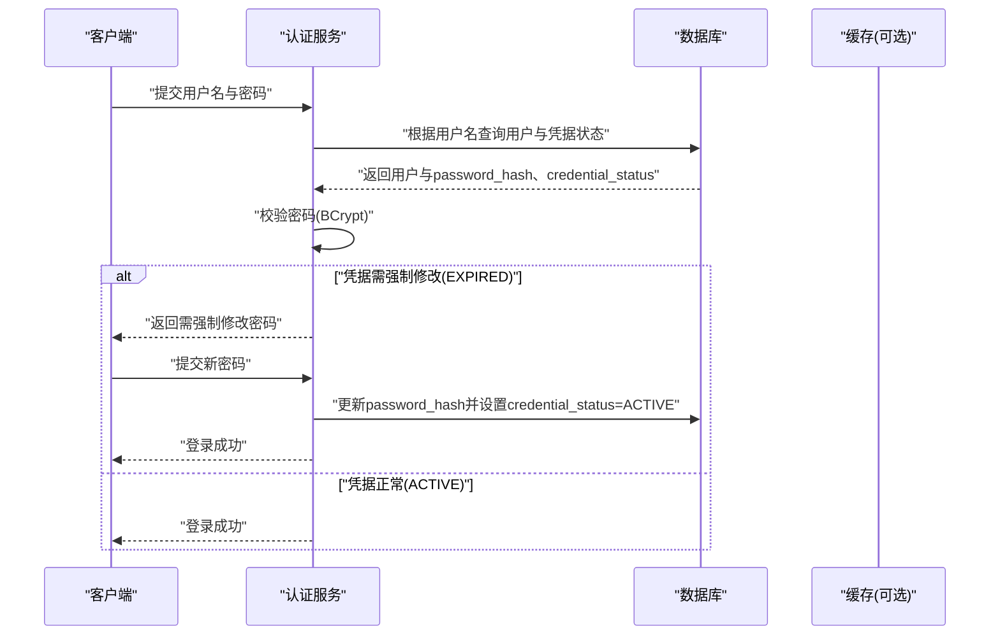
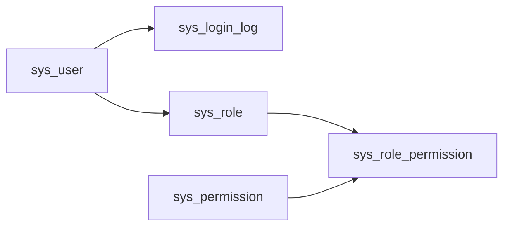

# 用户权限表设计

<cite>
**本文引用的文件**   
- [SysUser.java](file://parking-system/src/main/java/com/jushan/system/entity/SysUser.java)
- [SysRole.java](file://parking-system/src/main/java/com/jushan/system/entity/SysRole.java)
- [SysPermission.java](file://parking-system/src/main/java/com/jushan/system/entity/SysPermission.java)
- [SysLoginLog.java](file://parking-system/src/main/java/com/jushan/system/entity/SysLoginLog.java)
- [SysRolePermission.java](file://parking-system/src/main/java/com/jushan/system/entity/SysRolePermission.java)
- [V20260711002__sys_user_and_login_log.sql](file://parking-boot/src/main/resources/db/migration/V20260711002__sys_user_and_login_log.sql)
- [V20260711003__sys_role_permission.sql](file://parking-boot/src/main/resources/db/migration/V20260711003__sys_role_permission.sql)
- [V20260711012__fix_role_permissions.sql](file://parking-boot/src/main/resources/db/migration/V20260711012__fix_role_permissions.sql)
- [V20260711013__credential_status.sql](file://parking-boot/src/main/resources/db/migration/V20260711013__credential_status.sql)
</cite>

## 目录
1. [简介](#简介)
2. [项目结构](#项目结构)
3. [核心组件](#核心组件)
4. [架构总览](#架构总览)
5. [详细组件分析](#详细组件分析)
6. [依赖关系分析](#依赖关系分析)
7. [性能考虑](#性能考虑)
8. [故障排查指南](#故障排查指南)
9. [结论](#结论)
10. [附录](#附录)

## 简介
本文件聚焦于系统用户与权限相关的数据模型设计与实现，覆盖以下目标：
- 用户表（SysUser）字段设计：基本信息、认证凭据、状态管理、角色承载等。
- 角色表（SysRole）与权限表（SysPermission）设计：固定角色与操作级权限。
- RBAC 多对多关系：通过中间表（SysRolePermission）实现“用户-角色-权限”的关联。
- 登录日志表（SysLoginLog）：安全审计与行为追踪。
- 密码加密存储、会话管理与权限缓存的数据支撑设计说明。

## 项目结构
与用户权限相关的实体类位于 parking-system 模块的 entity 包中；数据库迁移脚本位于 parking-boot 模块的 db/migration 目录，使用 Flyway 进行版本化演进。

图表来源
- [SysUser.java:1-81](file://parking-system/src/main/java/com/jushan/system/entity/SysUser.java#L1-L81)
- [SysRole.java:1-65](file://parking-system/src/main/java/com/jushan/system/entity/SysRole.java#L1-L65)
- [SysPermission.java:1-54](file://parking-system/src/main/java/com/jushan/system/entity/SysPermission.java#L1-L54)
- [SysRolePermission.java:1-46](file://parking-system/src/main/java/com/jushan/system/entity/SysRolePermission.java#L1-L46)
- [SysLoginLog.java:1-70](file://parking-system/src/main/java/com/jushan/system/entity/SysLoginLog.java#L1-L70)
- [V20260711002__sys_user_and_login_log.sql:1-55](file://parking-boot/src/main/resources/db/migration/V20260711002__sys_user_and_login_log.sql#L1-L55)
- [V20260711003__sys_role_permission.sql:1-172](file://parking-boot/src/main/resources/db/migration/V20260711003__sys_role_permission.sql#L1-L172)
- [V20260711012__fix_role_permissions.sql:1-18](file://parking-boot/src/main/resources/db/migration/V20260711012__fix_role_permissions.sql#L1-L18)
- [V20260711013__credential_status.sql:1-18](file://parking-boot/src/main/resources/db/migration/V20260711013__credential_status.sql#L1-L18)

章节来源
- [SysUser.java:1-81](file://parking-system/src/main/java/com/jushan/system/entity/SysUser.java#L1-L81)
- [SysRole.java:1-65](file://parking-system/src/main/java/com/jushan/system/entity/SysRole.java#L1-L65)
- [SysPermission.java:1-54](file://parking-system/src/main/java/com/jushan/system/entity/SysPermission.java#L1-L54)
- [SysRolePermission.java:1-46](file://parking-system/src/main/java/com/jushan/system/entity/SysRolePermission.java#L1-L46)
- [SysLoginLog.java:1-70](file://parking-system/src/main/java/com/jushan/system/entity/SysLoginLog.java#L1-L70)
- [V20260711002__sys_user_and_login_log.sql:1-55](file://parking-boot/src/main/resources/db/migration/V20260711002__sys_user_and_login_log.sql#L1-L55)
- [V20260711003__sys_role_permission.sql:1-172](file://parking-boot/src/main/resources/db/migration/V20260711003__sys_role_permission.sql#L1-L172)
- [V20260711012__fix_role_permissions.sql:1-18](file://parking-boot/src/main/resources/db/migration/V20260711012__fix_role_permissions.sql#L1-L18)
- [V20260711013__credential_status.sql:1-18](file://parking-boot/src/main/resources/db/migration/V20260711013__credential_status.sql#L1-L18)

## 核心组件
本节从数据模型角度梳理用户、角色、权限、关联与审计的核心字段与约束，并给出复杂度与索引建议。

- 用户表（sys_user）
  - 主键：自增 ID
  - 账号：唯一索引，用于登录识别
  - 密码：仅存储 BCrypt 哈希，禁止明文
  - 显示名：展示用
  - 状态：启用/禁用/锁定
  - 角色列表：JSON 数组（兼容快速授权），同时存在标准 RBAC 表
  - 凭据状态：ACTIVE/EXPIRED（首次强制改密）
  - 时间戳：创建/更新
  - 复杂度：单表查询 O(1)，按用户名检索 O(log n)（唯一索引）
  - 索引建议：username 唯一索引已具备；可按 status、created_at 建立辅助索引以支持运营查询

- 角色表（sys_role）
  - 主键：自增 ID
  - 角色编码：唯一标识（如 super_admin）
  - 名称/描述：可读性信息
  - 是否固定：第一阶段全部为固定角色
  - 复杂度：O(1)/O(log n)
  - 索引建议：code 唯一索引已具备

- 权限表（sys_permission）
  - 主键：自增 ID
  - 权限编码：module:action 格式（如 gate:open）
  - 名称/描述：可读性信息
  - 复杂度：O(1)/O(log n)
  - 索引建议：code 唯一索引已具备

- 角色-权限关联表（sys_role_permission）
  - 联合唯一索引：role_code + permission_code
  - 复合索引：按 role_code、permission_code 分别建索引
  - 复杂度：多对多映射，典型查询 O(log n)
  - 索引建议：已具备，满足按角色查权限、按权限查角色的需求

- 登录日志表（sys_login_log）
  - 主键：自增 ID
  - 用户 ID：失败时可为空
  - 账号/IP/User-Agent：审计要素
  - 结果/失败原因：记录成功或失败原因（不含敏感信息）
  - 复杂度：写入为主，查询按 username/result/created_at
  - 索引建议：已提供 username、result、created_at 索引，适合按账号、结果和时间范围查询

章节来源
- [SysUser.java:1-81](file://parking-system/src/main/java/com/jushan/system/entity/SysUser.java#L1-L81)
- [SysRole.java:1-65](file://parking-system/src/main/java/com/jushan/system/entity/SysRole.java#L1-L65)
- [SysPermission.java:1-54](file://parking-system/src/main/java/com/jushan/system/entity/SysPermission.java#L1-L54)
- [SysRolePermission.java:1-46](file://parking-system/src/main/java/com/jushan/system/entity/SysRolePermission.java#L1-L46)
- [SysLoginLog.java:1-70](file://parking-system/src/main/java/com/jushan/system/entity/SysLoginLog.java#L1-L70)
- [V20260711002__sys_user_and_login_log.sql:1-55](file://parking-boot/src/main/resources/db/migration/V20260711002__sys_user_and_login_log.sql#L1-L55)
- [V20260711003__sys_role_permission.sql:1-172](file://parking-boot/src/main/resources/db/migration/V20260711003__sys_role_permission.sql#L1-L172)
- [V20260711012__fix_role_permissions.sql:1-18](file://parking-boot/src/main/resources/db/migration/V20260711012__fix_role_permissions.sql#L1-L18)
- [V20260711013__credential_status.sql:1-18](file://parking-boot/src/main/resources/db/migration/V20260711013__credential_status.sql#L1-L18)

## 架构总览
下图展示了 RBAC 模型在数据层的关系：用户可拥有多个角色，角色包含多个权限，用户最终获得其所有角色的权限并集。

图表来源
- [V20260711002__sys_user_and_login_log.sql:12-41](file://parking-boot/src/main/resources/db/migration/V20260711002__sys_user_and_login_log.sql#L12-L41)
- [V20260711003__sys_role_permission.sql:12-49](file://parking-boot/src/main/resources/db/migration/V20260711003__sys_role_permission.sql#L12-L49)
- [V20260711013__credential_status.sql:9-11](file://parking-boot/src/main/resources/db/migration/V20260711013__credential_status.sql#L9-L11)

## 详细组件分析

### 用户表（SysUser）设计要点
- 基本信息
  - id：自增主键
  - username：登录账号，唯一索引
  - display_name：展示名称
- 认证与安全
  - password_hash：BCrypt 哈希值，禁止明文存储
  - credential_status：ACTIVE/EXPIRED，用于强制首次修改密码策略
- 状态与角色
  - status：ENABLED/DISABLED/LOCKED
  - roles：JSON 数组（兼容快速授权），同时可通过 RBAC 表精确控制
- 时间戳
  - created_at/updated_at：审计与排障

图表来源
- [SysUser.java:1-81](file://parking-system/src/main/java/com/jushan/system/entity/SysUser.java#L1-L81)
- [V20260711002__sys_user_and_login_log.sql:12-23](file://parking-boot/src/main/resources/db/migration/V20260711002__sys_user_and_login_log.sql#L12-L23)
- [V20260711013__credential_status.sql:9-11](file://parking-boot/src/main/resources/db/migration/V20260711013__credential_status.sql#L9-L11)

章节来源
- [SysUser.java:1-81](file://parking-system/src/main/java/com/jushan/system/entity/SysUser.java#L1-L81)
- [V20260711002__sys_user_and_login_log.sql:12-23](file://parking-boot/src/main/resources/db/migration/V20260711002__sys_user_and_login_log.sql#L12-L23)
- [V20260711013__credential_status.sql:9-11](file://parking-boot/src/main/resources/db/migration/V20260711013__credential_status.sql#L9-L11)

### 角色表（SysRole）与权限表（SysPermission）设计要点
- 角色表
  - code：唯一标识（如 super_admin）
  - name/description：可读性信息
  - is_fixed：固定角色标记（第一阶段全部为固定角色）
- 权限表
  - code：module:action 格式（如 gate:open）
  - name/description：可读性信息
- 种子数据
  - 初始化 7 个固定角色与 18 个权限码，便于快速上线

图表来源
- [SysRole.java:1-65](file://parking-system/src/main/java/com/jushan/system/entity/SysRole.java#L1-L65)
- [SysPermission.java:1-54](file://parking-system/src/main/java/com/jushan/system/entity/SysPermission.java#L1-L54)
- [V20260711003__sys_role_permission.sql:12-35](file://parking-boot/src/main/resources/db/migration/V20260711003__sys_role_permission.sql#L12-35)

章节来源
- [SysRole.java:1-65](file://parking-system/src/main/java/com/jushan/system/entity/SysRole.java#L1-L65)
- [SysPermission.java:1-54](file://parking-system/src/main/java/com/jushan/system/entity/SysPermission.java#L1-L54)
- [V20260711003__sys_role_permission.sql:54-84](file://parking-boot/src/main/resources/db/migration/V20260711003__sys_role_permission.sql#L54-L84)

### 角色-权限关联（RBAC 多对多）
- 中间表（sys_role_permission）
  - role_code + permission_code 联合唯一索引，避免重复授权
  - 单独索引：role_code、permission_code，提升双向查询效率
- 初始矩阵
  - 超级管理员拥有全部权限
  - 其他角色按职责分配最小必要权限
- 修正迁移
  - customer_admin 补充 device:manage
  - parking_manager 补充 parking:write

图表来源
- [V20260711003__sys_role_permission.sql:40-49](file://parking-boot/src/main/resources/db/migration/V20260711003__sys_role_permission.sql#L40-L49)
- [V20260711012__fix_role_permissions.sql:11-17](file://parking-boot/src/main/resources/db/migration/V20260711012__fix_role_permissions.sql#L11-L17)

章节来源
- [SysRolePermission.java:1-46](file://parking-system/src/main/java/com/jushan/system/entity/SysRolePermission.java#L1-L46)
- [V20260711003__sys_role_permission.sql:89-171](file://parking-boot/src/main/resources/db/migration/V20260711003__sys_role_permission.sql#L89-L171)
- [V20260711012__fix_role_permissions.sql:11-17](file://parking-boot/src/main/resources/db/migration/V20260711012__fix_role_permissions.sql#L11-L17)

### 登录日志表（SysLoginLog）设计要点
- 审计字段
  - user_id：登录成功时关联用户
  - username/ip/user_agent：来源与环境信息
  - result/fail_reason：结果与失败原因（不含敏感信息）
- 索引
  - username/result/created_at 索引，便于按账号、结果、时间范围查询
- 用途
  - 安全审计、异常检测、合规留痕

图表来源
- [SysLoginLog.java:1-70](file://parking-system/src/main/java/com/jushan/system/entity/SysLoginLog.java#L1-L70)
- [V20260711002__sys_user_and_login_log.sql:28-41](file://parking-boot/src/main/resources/db/migration/V20260711002__sys_user_and_login_log.sql#L28-L41)

章节来源
- [SysLoginLog.java:1-70](file://parking-system/src/main/java/com/jushan/system/entity/SysLoginLog.java#L1-L70)
- [V20260711002__sys_user_and_login_log.sql:28-41](file://parking-boot/src/main/resources/db/migration/V20260711002__sys_user_and_login_log.sql#L28-L41)

### 密码加密存储与凭据生命周期
- 密码存储
  - 仅存储 BCrypt 哈希，禁止明文落库
- 首次强制改密
  - 新增 credential_status 字段，默认 ACTIVE
  - 将默认管理员标记为 EXPIRED，要求首次登录后强制修改
- 流程示意

图表来源
- [V20260711002__sys_user_and_login_log.sql:16-16](file://parking-boot/src/main/resources/db/migration/V20260711002__sys_user_and_login_log.sql#L16-L16)
- [V20260711013__credential_status.sql:9-17](file://parking-boot/src/main/resources/db/migration/V20260711013__credential_status.sql#L9-L17)

章节来源
- [V20260711002__sys_user_and_login_log.sql:16-16](file://parking-boot/src/main/resources/db/migration/V20260711002__sys_user_and_login_log.sql#L16-L16)
- [V20260711013__credential_status.sql:9-17](file://parking-boot/src/main/resources/db/migration/V20260711013__credential_status.sql#L9-L17)

### 会话管理与权限缓存的数据支撑
- 会话管理
  - 当前数据模型未定义显式会话表；可在应用层结合令牌机制与会话存储（例如 Redis）实现无状态或分布式会话
- 权限缓存
  - 建议在应用层维护“用户->角色->权限”的缓存结构，降低频繁查询 sys_role_permission 的压力
  - 变更触发点：角色-权限关联更新、用户角色变更、用户状态变更
  - 失效策略：基于 key 的 TTL 或事件驱动失效
- 注意
  - 本节为通用实践建议，不直接对应仓库中的具体实现文件

[本节为概念性内容，无需列出章节来源]

## 依赖关系分析
- 实体与迁移脚本的对应关系
  - sys_user / sys_login_log 由 V20260711002 创建
  - sys_role / sys_permission / sys_role_permission 由 V20260711003 创建并填充种子数据
  - sys_user.credential_status 由 V20260711013 扩展
  - sys_role_permission 增量修复由 V20260711012 完成
- 关系耦合
  - 用户到角色：通过 JSON roles 与 RBAC 双轨并存，兼顾灵活性与规范性
  - 角色到权限：严格的多对多映射，联合唯一索引保证一致性

图表来源
- [V20260711002__sys_user_and_login_log.sql:12-41](file://parking-boot/src/main/resources/db/migration/V20260711002__sys_user_and_login_log.sql#L12-L41)
- [V20260711003__sys_role_permission.sql:12-49](file://parking-boot/src/main/resources/db/migration/V20260711003__sys_role_permission.sql#L12-L49)
- [V20260711013__credential_status.sql:9-11](file://parking-boot/src/main/resources/db/migration/V20260711013__credential_status.sql#L9-L11)

章节来源
- [V20260711002__sys_user_and_login_log.sql:12-41](file://parking-boot/src/main/resources/db/migration/V20260711002__sys_user_and_login_log.sql#L12-L41)
- [V20260711003__sys_role_permission.sql:12-49](file://parking-boot/src/main/resources/db/migration/V20260711003__sys_role_permission.sql#L12-L49)
- [V20260711012__fix_role_permissions.sql:11-17](file://parking-boot/src/main/resources/db/migration/V20260711012__fix_role_permissions.sql#L11-L17)
- [V20260711013__credential_status.sql:9-11](file://parking-boot/src/main/resources/db/migration/V20260711013__credential_status.sql#L9-L11)

## 性能考虑
- 索引优化
  - sys_user.username 唯一索引已具备，登录查找高效
  - sys_login_log 的 username/result/created_at 索引适合审计查询
  - sys_role_permission 的联合唯一索引与单列索引满足高频双向查询
- 读写分离与归档
  - 登录日志属于高写低读场景，建议定期归档历史数据，保持热表体积可控
- 缓存策略
  - 用户权限集合建议缓存，减少跨表 JOIN 与多次查询
  - 缓存失效应覆盖角色-权限变更、用户角色变更、用户状态变更

[本节为通用指导，无需列出章节来源]

## 故障排查指南
- 登录失败定位
  - 查看 sys_login_log 的 result 与 fail_reason，结合 username 与 created_at 筛选
  - 若 result 为账号禁用或频繁限制，检查 sys_user.status 与业务限流策略
- 密码问题
  - 确认 sys_user.password_hash 是否为 BCrypt 哈希
  - 若 credential_status=EXPIRED，提示用户强制修改密码
- 权限不足
  - 核对用户实际角色与其对应的权限集合（sys_role_permission）
  - 关注最近一次权限矩阵修正迁移是否执行成功

章节来源
- [SysLoginLog.java:1-70](file://parking-system/src/main/java/com/jushan/system/entity/SysLoginLog.java#L1-L70)
- [V20260711002__sys_user_and_login_log.sql:28-41](file://parking-boot/src/main/resources/db/migration/V20260711002__sys_user_and_login_log.sql#L28-L41)
- [V20260711013__credential_status.sql:13-17](file://parking-boot/src/main/resources/db/migration/V20260711013__credential_status.sql#L13-L17)
- [V20260711012__fix_role_permissions.sql:11-17](file://parking-boot/src/main/resources/db/migration/V20260711012__fix_role_permissions.sql#L11-L17)

## 结论
本设计采用经典 RBAC 模型，并通过中间表实现角色与权限的多对多关系；用户表同时保留 JSON roles 字段以兼容快速授权场景。密码采用 BCrypt 哈希存储，配合凭据状态实现首次强制改密策略。登录日志表提供完善的安全审计能力。整体结构清晰、可扩展性强，适合在多租户与多角色场景下稳定运行。

[本节为总结性内容，无需列出章节来源]

## 附录
- 术语
  - RBAC：基于角色的访问控制
  - BCrypt：一种安全的密码哈希算法
  - 固定角色：系统预置且不可删除的角色
- 参考迁移
  - 用户与登录日志：V20260711002
  - 角色、权限与关联：V20260711003
  - 权限矩阵修正：V20260711012
  - 凭据状态扩展：V20260711013

[本节为补充信息，无需列出章节来源]