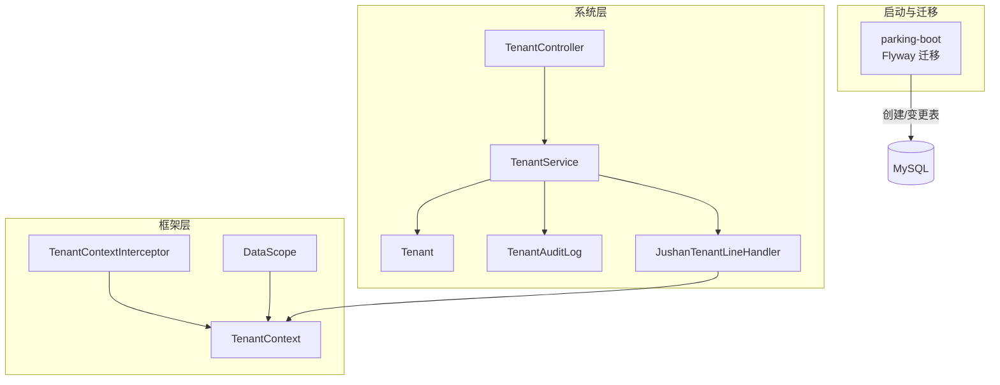
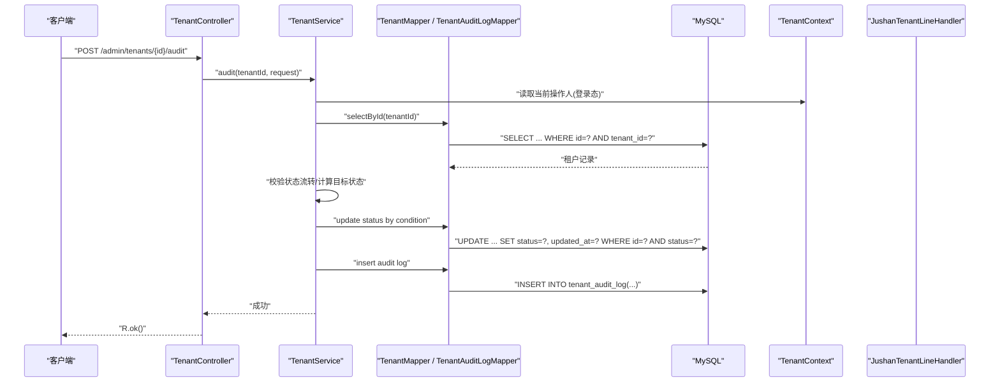
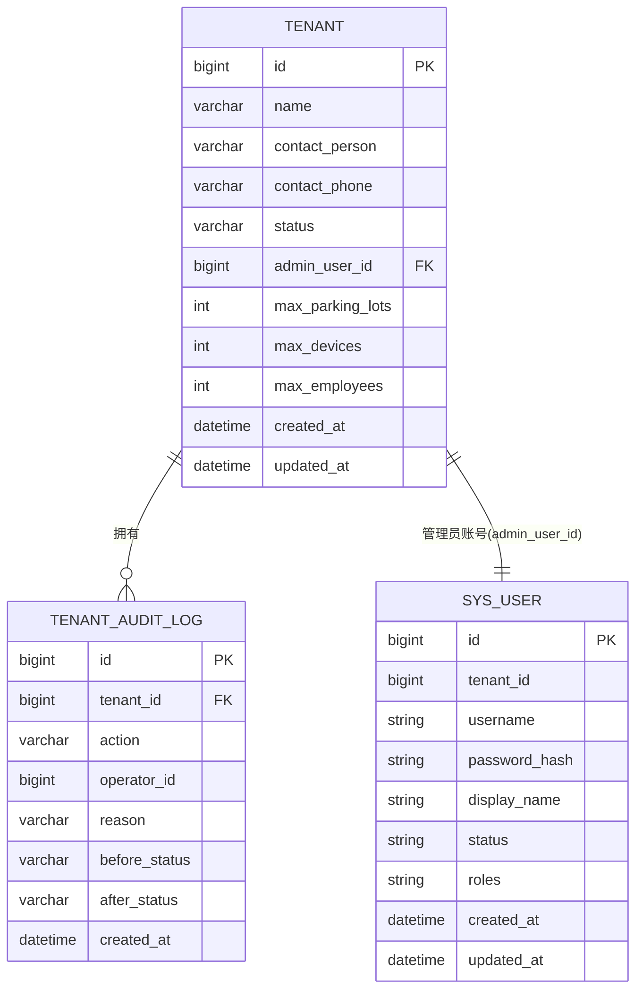
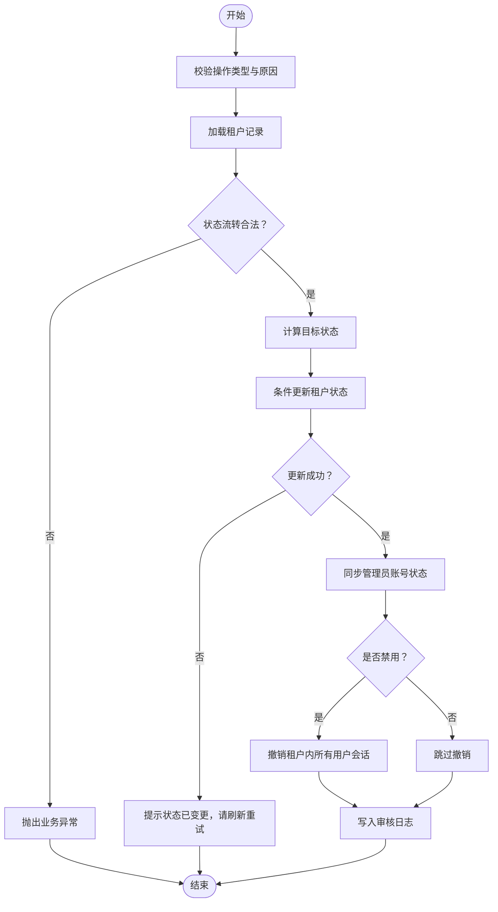
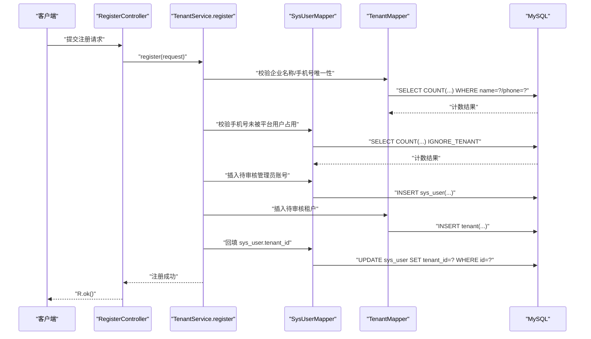
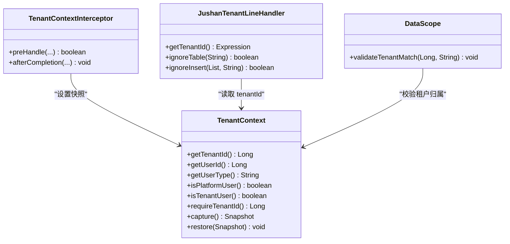
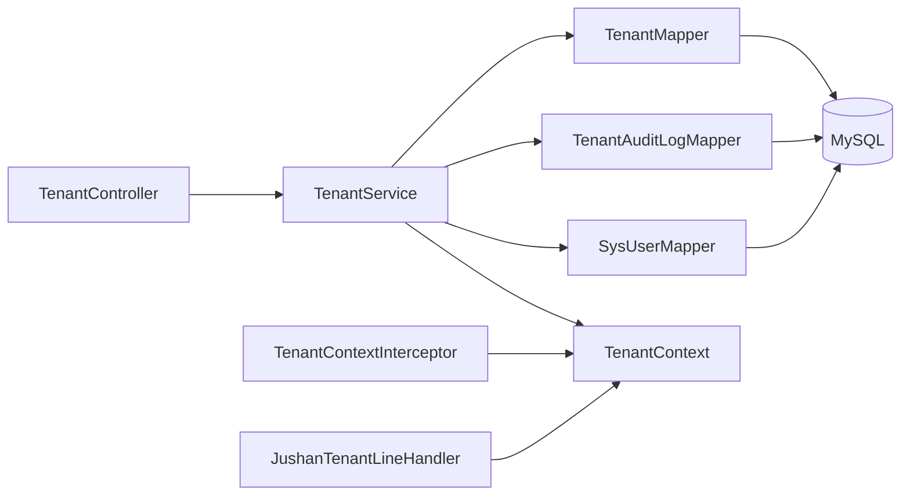
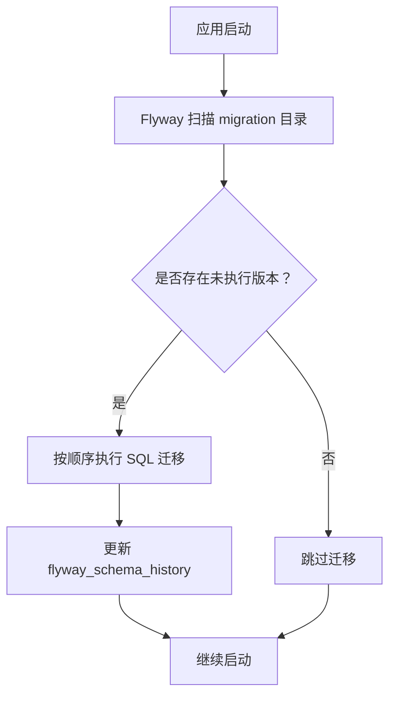

# 租户相关表设计

<cite>
**本文引用的文件列表**
- [V20260711004__tenant_and_registration.sql](file://parking-boot/src/main/resources/db/migration/V20260711004__tenant_and_registration.sql)
- [Tenant.java](file://parking-system/src/main/java/com/jushan/system/entity/Tenant.java)
- [TenantAuditLog.java](file://parking-system/src/main/java/com/jushan/system/entity/TenantAuditLog.java)
- [TenantController.java](file://parking-system/src/main/java/com/jushan/system/controller/TenantController.java)
- [TenantService.java](file://parking-system/src/main/java/com/jushan/system/service/TenantService.java)
- [JushanTenantLineHandler.java](file://parking-system/src/main/java/com/jushan/system/mybatis/JushanTenantLineHandler.java)
- [TenantContext.java](file://parking-framework/src/main/java/com/jushan/framework/auth/TenantContext.java)
- [TenantContextInterceptor.java](file://parking-framework/src/main/java/com/jushan/framework/auth/TenantContextInterceptor.java)
- [DataScope.java](file://parking-framework/src/main/java/com/jushan/framework/auth/DataScope.java)
- [FlywayMigrationTest.java](file://parking-boot/src/test/java/com/jushan/boot/migration/FlywayMigrationTest.java)
</cite>

## 目录
1. [引言](#引言)
2. [项目结构](#项目结构)
3. [核心组件](#核心组件)
4. [架构总览](#架构总览)
5. [详细组件分析](#详细组件分析)
6. [依赖关系分析](#依赖关系分析)
7. [性能与索引优化](#性能与索引优化)
8. [数据迁移与版本管理](#数据迁移与版本管理)
9. [故障排查指南](#故障排查指南)
10. [结论](#结论)

## 引言
本文件聚焦于多租户架构中的“租户”相关表结构设计，围绕以下目标展开：
- 解释 tenant 表的字段定义、状态管理与配置存储能力
- 说明租户注册流程涉及的表结构与审核日志记录
- 阐述租户数据隔离的实现机制（上下文传递、SQL 自动注入、权限校验）
- 提供完整的表关系图与 ER 图
- 给出索引优化策略、数据迁移方案与版本管理建议

## 项目结构
与租户相关的代码分布在如下模块：
- parking-boot：数据库迁移脚本（Flyway），包含 tenant、tenant_audit_log 建表及 sys_user.tenant_id 新增
- parking-system：实体、控制器、服务、MyBatis 租户行级隔离处理器
- parking-framework：认证与租户上下文装配、拦截器、数据范围校验

图表来源
- [V20260711004__tenant_and_registration.sql:1-55](file://parking-boot/src/main/resources/db/migration/V20260711004__tenant_and_registration.sql#L1-L55)
- [TenantController.java:1-81](file://parking-system/src/main/java/com/jushan/system/controller/TenantController.java#L1-L81)
- [TenantService.java:1-433](file://parking-system/src/main/java/com/jushan/system/service/TenantService.java#L1-L433)
- [Tenant.java:1-90](file://parking-system/src/main/java/com/jushan/system/entity/Tenant.java#L1-L90)
- [TenantAuditLog.java:1-72](file://parking-system/src/main/java/com/jushan/system/entity/TenantAuditLog.java#L1-L72)
- [JushanTenantLineHandler.java:1-116](file://parking-system/src/main/java/com/jushan/system/mybatis/JushanTenantLineHandler.java#L1-L116)
- [TenantContext.java:1-257](file://parking-framework/src/main/java/com/jushan/framework/auth/TenantContext.java#L1-L257)
- [TenantContextInterceptor.java:45-238](file://parking-framework/src/main/java/com/jushan/framework/auth/TenantContextInterceptor.java#L45-L238)
- [DataScope.java:31-56](file://parking-framework/src/main/java/com/jushan/framework/auth/DataScope.java#L31-L56)

章节来源
- [V20260711004__tenant_and_registration.sql:1-55](file://parking-boot/src/main/resources/db/migration/V20260711004__tenant_and_registration.sql#L1-L55)
- [TenantController.java:1-81](file://parking-system/src/main/java/com/jushan/system/controller/TenantController.java#L1-L81)
- [TenantService.java:1-433](file://parking-system/src/main/java/com/jushan/system/service/TenantService.java#L1-L433)
- [Tenant.java:1-90](file://parking-system/src/main/java/com/jushan/system/entity/Tenant.java#L1-L90)
- [TenantAuditLog.java:1-72](file://parking-system/src/main/java/com/jushan/system/entity/TenantAuditLog.java#L1-L72)
- [JushanTenantLineHandler.java:1-116](file://parking-system/src/main/java/com/jushan/system/mybatis/JushanTenantLineHandler.java#L1-L116)
- [TenantContext.java:1-257](file://parking-framework/src/main/java/com/jushan/framework/auth/TenantContext.java#L1-L257)
- [TenantContextInterceptor.java:45-238](file://parking-framework/src/main/java/com/jushan/framework/auth/TenantContextInterceptor.java#L45-L238)
- [DataScope.java:31-56](file://parking-framework/src/main/java/com/jushan/framework/auth/DataScope.java#L31-L56)

## 核心组件
- 租户表（tenant）：承载客户/商户主体信息、状态机、配额上限等
- 租户审核日志表（tenant_audit_log）：记录审核、启用、禁用等操作审计轨迹
- 用户表扩展（sys_user.tenant_id）：将平台用户与客户员工区分，支撑租户维度查询
- 租户上下文（TenantContext）：线程级可信上下文，统一来源、不可信前端参数
- 行级隔离处理器（JushanTenantLineHandler）：基于 MP 插件自动注入 tenant_id 过滤条件
- 上下文装配（TenantContextInterceptor）：从 Sa-Token 会话推导并填充上下文快照

章节来源
- [Tenant.java:1-90](file://parking-system/src/main/java/com/jushan/system/entity/Tenant.java#L1-L90)
- [TenantAuditLog.java:1-72](file://parking-system/src/main/java/com/jushan/system/entity/TenantAuditLog.java#L1-L72)
- [JushanTenantLineHandler.java:1-116](file://parking-system/src/main/java/com/jushan/system/mybatis/JushanTenantLineHandler.java#L1-L116)
- [TenantContext.java:1-257](file://parking-framework/src/main/java/com/jushan/framework/auth/TenantContext.java#L1-L257)
- [TenantContextInterceptor.java:45-238](file://parking-framework/src/main/java/com/jushan/framework/auth/TenantContextInterceptor.java#L45-L238)

## 架构总览
下图展示了“租户注册—审核—启停—数据隔离”的关键链路。

图表来源
- [TenantController.java:74-79](file://parking-system/src/main/java/com/jushan/system/controller/TenantController.java#L74-L79)
- [TenantService.java:168-222](file://parking-system/src/main/java/com/jushan/system/service/TenantService.java#L168-L222)
- [JushanTenantLineHandler.java:72-88](file://parking-system/src/main/java/com/jushan/system/mybatis/JushanTenantLineHandler.java#L72-L88)
- [TenantContext.java:104-126](file://parking-framework/src/main/java/com/jushan/framework/auth/TenantContext.java#L104-L126)

## 详细组件分析

### 表结构与字段定义
- 租户表（tenant）
  - 主键：自增 ID
  - 基本信息：企业名称、联系人、联系电话
  - 状态：待审核/已启用/已禁用/已拒绝
  - 管理员账号关联：sys_user.id
  - 配额上限：最大停车场数、最大设备数、最大员工数
  - 时间戳：创建时间、更新时间
  - 唯一性约束：企业名称、联系电话
  - 常用索引：状态、管理员账号
- 租户审核日志表（tenant_audit_log）
  - 主键：自增 ID
  - 租户 ID、操作类型、操作人 ID、原因、前后状态、创建时间
  - 常用索引：租户 ID、操作人 ID、创建时间
- 用户表扩展（sys_user）
  - 新增 tenant_id 列（平台用户为 NULL，客户员工指向所属租户）
  - 增加按租户查询的索引

ER 关系图

图表来源
- [V20260711004__tenant_and_registration.sql:12-29](file://parking-boot/src/main/resources/db/migration/V20260711004__tenant_and_registration.sql#L12-L29)
- [V20260711004__tenant_and_registration.sql:34-47](file://parking-boot/src/main/resources/db/migration/V20260711004__tenant_and_registration.sql#L34-L47)
- [V20260711004__tenant_and_registration.sql:52-54](file://parking-boot/src/main/resources/db/migration/V20260711004__tenant_and_registration.sql#L52-L54)

章节来源
- [V20260711004__tenant_and_registration.sql:12-29](file://parking-boot/src/main/resources/db/migration/V20260711004__tenant_and_registration.sql#L12-L29)
- [V20260711004__tenant_and_registration.sql:34-47](file://parking-boot/src/main/resources/db/migration/V20260711004__tenant_and_registration.sql#L34-L47)
- [V20260711004__tenant_and_registration.sql:52-54](file://parking-boot/src/main/resources/db/migration/V20260711004__tenant_and_registration.sql#L52-L54)
- [Tenant.java:1-90](file://parking-system/src/main/java/com/jushan/system/entity/Tenant.java#L1-L90)
- [TenantAuditLog.java:1-72](file://parking-system/src/main/java/com/jushan/system/entity/TenantAuditLog.java#L1-L72)

### 租户状态管理与审核流程
- 状态集合：PENDING_REVIEW、ENABLED、DISABLED、REJECTED
- 审核动作：APPROVED（通过）、REJECTED（拒绝）、ENABLED（启用）、DISABLED（禁用）
- 状态流转规则：
  - APPROVED/REJECTED 仅对 PENDING_REVIEW 有效
  - ENABLED/DISABLED 在 ENABLED 与 DISABLED 之间切换
- 并发安全：使用条件更新（WHERE id=? AND status=?）防止覆盖
- 审计追踪：每次审核/启停写入 tenant_audit_log，记录操作人、原因、前后状态
- 联动处理：
  - 同步更新管理员账号状态
  - 禁用时批量撤销该租户下所有用户的会话

图表来源
- [TenantService.java:168-222](file://parking-system/src/main/java/com/jushan/system/service/TenantService.java#L168-L222)
- [TenantService.java:263-311](file://parking-system/src/main/java/com/jushan/system/service/TenantService.java#L263-L311)
- [TenantService.java:318-366](file://parking-system/src/main/java/com/jushan/system/service/TenantService.java#L318-L366)
- [TenantService.java:371-390](file://parking-system/src/main/java/com/jushan/system/service/TenantService.java#L371-L390)

章节来源
- [TenantService.java:168-222](file://parking-system/src/main/java/com/jushan/system/service/TenantService.java#L168-L222)
- [TenantService.java:263-311](file://parking-system/src/main/java/com/jushan/system/service/TenantService.java#L263-L311)
- [TenantService.java:318-366](file://parking-system/src/main/java/com/jushan/system/service/TenantService.java#L318-L366)
- [TenantService.java:371-390](file://parking-system/src/main/java/com/jushan/system/service/TenantService.java#L371-L390)

### 租户注册流程与表结构
- 注册入口：REST 接口由控制器暴露，服务层实现注册逻辑
- 注册步骤：
  - 校验企业名称与手机号唯一性
  - 校验手机号未被平台用户占用
  - 创建待审核管理员账号（sys_user，初始状态为待审核）
  - 创建待审核租户（tenant，默认配额上限）
  - 回填 sys_user.tenant_id
- 事务保证：注册过程整体在一个事务中完成，确保一致性

图表来源
- [TenantService.java:97-156](file://parking-system/src/main/java/com/jushan/system/service/TenantService.java#L97-L156)
- [V20260711004__tenant_and_registration.sql:52-54](file://parking-boot/src/main/resources/db/migration/V20260711004__tenant_and_registration.sql#L52-L54)

章节来源
- [TenantService.java:97-156](file://parking-system/src/main/java/com/jushan/system/service/TenantService.java#L97-L156)
- [V20260711004__tenant_and_registration.sql:52-54](file://parking-boot/src/main/resources/db/migration/V20260711004__tenant_and_registration.sql#L52-L54)

### 租户数据隔离实现机制
- 上下文来源：
  - 请求进入后，由拦截器从 Sa-Token 会话中推导 userId、userType、tenantId、代理信息等，构建不可变快照并放入 ThreadLocal
  - 禁止从前端参数直接读取 tenantId，避免越权
- 行级隔离：
  - MyBatis-Plus 租户拦截器根据上下文注入 WHERE tenant_id = ?
  - 全局表白名单（如 tenant、sys_role 等）不注入过滤条件
  - 平台用户（tenantId 为 null）默认无法访问业务表，fail-close；跨租户需显式忽略
- 运行时校验：
  - DataScope 强制要求非平台用户必须匹配实体所属租户，否则拒绝
  - 代理模式下，数据范围严格限定在目标租户，不被视为平台用户

图表来源
- [TenantContext.java:104-178](file://parking-framework/src/main/java/com/jushan/framework/auth/TenantContext.java#L104-L178)
- [TenantContextInterceptor.java:181-198](file://parking-framework/src/main/java/com/jushan/framework/auth/TenantContextInterceptor.java#L181-L198)
- [JushanTenantLineHandler.java:72-114](file://parking-system/src/main/java/com/jushan/system/mybatis/JushanTenantLineHandler.java#L72-L114)
- [DataScope.java:45-56](file://parking-framework/src/main/java/com/jushan/framework/auth/DataScope.java#L45-L56)

章节来源
- [TenantContext.java:104-178](file://parking-framework/src/main/java/com/jushan/framework/auth/TenantContext.java#L104-L178)
- [TenantContextInterceptor.java:181-198](file://parking-framework/src/main/java/com/jushan/framework/auth/TenantContextInterceptor.java#L181-L198)
- [JushanTenantLineHandler.java:72-114](file://parking-system/src/main/java/com/jushan/system/mybatis/JushanTenantLineHandler.java#L72-L114)
- [DataScope.java:45-56](file://parking-framework/src/main/java/com/jushan/framework/auth/DataScope.java#L45-L56)

## 依赖关系分析
- 控制器到服务：TenantController 调用 TenantService 进行分页、详情、审核
- 服务到持久层：TenantService 通过 Mapper 访问 tenant、tenant_audit_log、sys_user
- 服务到上下文：TenantService 在审核过程中读取当前操作人（来自上下文）
- 持久层到隔离：MP 插件通过 JushanTenantLineHandler 注入 tenant_id 过滤
- 上下文装配：TenantContextInterceptor 负责从会话推导并设置上下文快照

图表来源
- [TenantController.java:40-79](file://parking-system/src/main/java/com/jushan/system/controller/TenantController.java#L40-L79)
- [TenantService.java:234-256](file://parking-system/src/main/java/com/jushan/system/service/TenantService.java#L234-L256)
- [JushanTenantLineHandler.java:72-114](file://parking-system/src/main/java/com/jushan/system/mybatis/JushanTenantLineHandler.java#L72-L114)
- [TenantContextInterceptor.java:181-198](file://parking-framework/src/main/java/com/jushan/framework/auth/TenantContextInterceptor.java#L181-L198)

章节来源
- [TenantController.java:40-79](file://parking-system/src/main/java/com/jushan/system/controller/TenantController.java#L40-L79)
- [TenantService.java:234-256](file://parking-system/src/main/java/com/jushan/system/service/TenantService.java#L234-L256)
- [JushanTenantLineHandler.java:72-114](file://parking-system/src/main/java/com/jushan/system/mybatis/JushanTenantLineHandler.java#L72-L114)
- [TenantContextInterceptor.java:181-198](file://parking-framework/src/main/java/com/jushan/framework/auth/TenantContextInterceptor.java#L181-L198)

## 性能与索引优化
- 租户表（tenant）
  - 唯一索引：企业名称、联系电话，保障注册唯一性与快速查重
  - 普通索引：状态、管理员账号，支持后台分页与按管理员检索
- 审核日志表（tenant_audit_log）
  - 索引：租户 ID、操作人 ID、创建时间，支持按租户/操作人/时间范围查询
- 用户表（sys_user）
  - 新增 tenant_id 列与索引，便于按租户筛选用户
- 通用建议
  - 所有业务表应包含 tenant_id 及其索引
  - 高频组合查询建立复合索引（例如按租户+业务主键或时间）
  - 大表考虑分区/分表策略，控制单表规模
  - 敏感字段加密存储，避免明文落库

章节来源
- [V20260711004__tenant_and_registration.sql:25-28](file://parking-boot/src/main/resources/db/migration/V20260711004__tenant_and_registration.sql#L25-L28)
- [V20260711004__tenant_and_registration.sql:44-46](file://parking-boot/src/main/resources/db/migration/V20260711004__tenant_and_registration.sql#L44-L46)
- [V20260711004__tenant_and_registration.sql:53-54](file://parking-boot/src/main/resources/db/migration/V20260711004__tenant_and_registration.sql#L53-L54)

## 数据迁移与版本管理
- 基线与版本化
  - 使用 Flyway 管理数据库迁移，基线迁移用于初始化基础设施表
  - 每个变更以版本号命名 SQL 脚本，确保可追溯与幂等执行
- 租户相关迁移
  - 创建 tenant、tenant_audit_log 表，并为 sys_user 新增 tenant_id 列与索引
- 迁移验证
  - 通过测试用例验证 flyway_schema_history 记录、表结构正确性与重复启动幂等性
- 回滚与演进
  - 生产环境建议采用正向增量迁移，谨慎回滚；必要时编写反向迁移脚本
  - 对历史数据补齐（如为业务表添加 tenant_id 并回填）应在独立迁移中完成

图表来源
- [FlywayMigrationTest.java:42-55](file://parking-boot/src/test/java/com/jushan/boot/migration/FlywayMigrationTest.java#L42-L55)
- [FlywayMigrationTest.java:101-118](file://parking-boot/src/test/java/com/jushan/boot/migration/FlywayMigrationTest.java#L101-L118)
- [V20260711004__tenant_and_registration.sql:1-7](file://parking-boot/src/main/resources/db/migration/V20260711004__tenant_and_registration.sql#L1-L7)

章节来源
- [FlywayMigrationTest.java:42-55](file://parking-boot/src/test/java/com/jushan/boot/migration/FlywayMigrationTest.java#L42-L55)
- [FlywayMigrationTest.java:101-118](file://parking-boot/src/test/java/com/jushan/boot/migration/FlywayMigrationTest.java#L101-L118)
- [V20260711004__tenant_and_registration.sql:1-7](file://parking-boot/src/main/resources/db/migration/V20260711004__tenant_and_registration.sql#L1-L7)

## 故障排查指南
- 审核失败或状态冲突
  - 现象：提示“租户状态已变更，请刷新后重试”
  - 原因：并发导致条件更新失败
  - 处理：刷新页面后重试，检查是否有其他操作同时修改了状态
- 平台用户无法查看租户数据
  - 现象：查询返回空或报错
  - 原因：平台用户 tenantId 为 null，行级隔离自动注入 tenant_id=null 导致 fail-close
  - 处理：使用 @InterceptorIgnore 或专用跨租户查询路径
- 代理模式越权
  - 现象：代理请求被拒绝
  - 原因：代理模式不被视为平台用户，数据范围限制在目标租户
  - 处理：确认代理目标租户状态与权限，避免非法身份类型
- 迁移问题
  - 现象：重复启动后表结构异常或迁移未生效
  - 处理：检查 flyway_schema_history 记录，确认迁移脚本幂等性与版本顺序

章节来源
- [TenantService.java:205-207](file://parking-system/src/main/java/com/jushan/system/service/TenantService.java#L205-L207)
- [JushanTenantLineHandler.java:72-88](file://parking-system/src/main/java/com/jushan/system/mybatis/JushanTenantLineHandler.java#L72-L88)
- [TenantContextInterceptor.java:128-140](file://parking-framework/src/main/java/com/jushan/framework/auth/TenantContextInterceptor.java#L128-L140)
- [FlywayMigrationTest.java:101-118](file://parking-boot/src/test/java/com/jushan/boot/migration/FlywayMigrationTest.java#L101-L118)

## 结论
本设计通过明确的租户表与审核日志表，结合严格的上下文装配与行级隔离机制，实现了可靠的多租户数据隔离与可审计的租户生命周期管理。配合 Flyway 的版本化迁移与完善的索引策略，系统在安全性、可维护性与性能方面具备良好基础。后续可在业务表全面补齐 tenant_id 与复合索引，进一步提升查询效率与隔离强度。