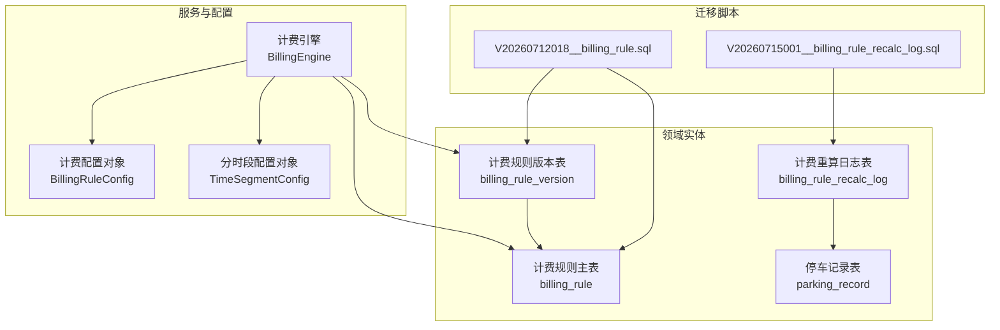
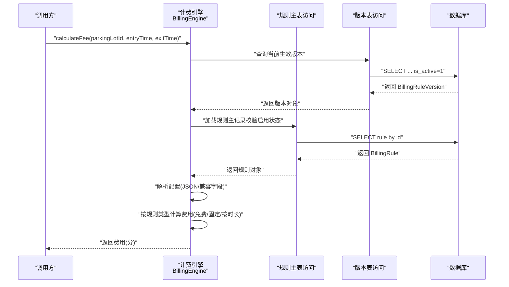
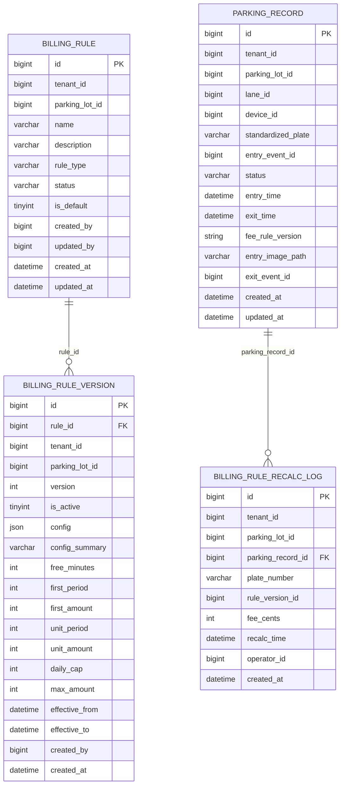
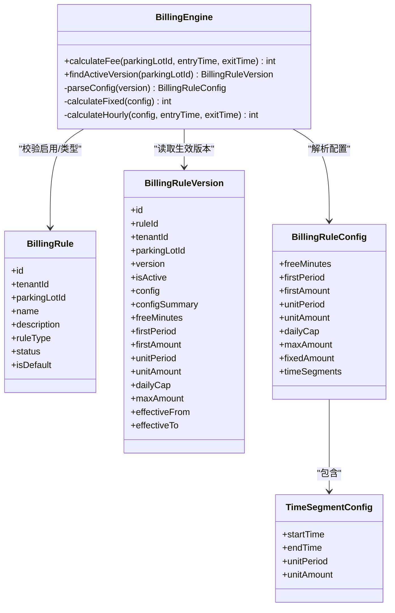

# 计费系统表设计

<cite>
**本文引用的文件**   
- [BillingRule.java](file://parking-system/src/main/java/com/jushan/system/entity/BillingRule.java)
- [BillingRuleVersion.java](file://parking-system/src/main/java/com/jushan/system/entity/BillingRuleVersion.java)
- [BillingRuleRecalcLog.java](file://parking-system/src/main/java/com/jushan/system/entity/BillingRuleRecalcLog.java)
- [ParkingRecord.java](file://parking-system/src/main/java/com/jushan/system/entity/ParkingRecord.java)
- [BillingEngine.java](file://parking-system/src/main/java/com/jushan/system/service/BillingEngine.java)
- [BillingRuleConfig.java](file://parking-system/src/main/java/com/jushan/system/service/BillingRuleConfig.java)
- [TimeSegmentConfig.java](file://parking-system/src/main/java/com/jushan/system/service/TimeSegmentConfig.java)
- [V20260712018__billing_rule.sql](file://parking-boot/src/main/resources/db/migration/V20260712018__billing_rule.sql)
- [V20260715001__billing_rule_recalc_log.sql](file://parking-boot/src/main/resources/db/migration/V20260715001__billing_rule_recalc_log.sql)
</cite>

## 目录
1. [引言](#引言)
2. [项目结构](#项目结构)
3. [核心组件](#核心组件)
4. [架构总览](#架构总览)
5. [详细组件分析](#详细组件分析)
6. [依赖关系分析](#依赖关系分析)
7. [性能与精度设计](#性能与精度设计)
8. [故障排查指南](#故障排查指南)
9. [结论](#结论)
10. [附录：数据模型图](#附录数据模型图)

## 引言
本文件聚焦计费系统的数据库表设计与计费引擎的数据支撑，围绕以下目标展开：
- 解释计费规则表（BillingRule）的灵活配置设计，支持免费、固定金额、按时长等策略。
- 说明计费规则版本管理表（BillingRuleVersion）的版本控制与变更追溯能力。
- 描述计费重算日志表（BillingRuleRecalcLog）在费用计算历史与审计中的作用。
- 给出计费引擎与业务记录（停车记录）的数据关联模型。
- 阐述计费精度控制、时间区间计算和复杂计费逻辑的数据支撑设计。

## 项目结构
计费相关代码位于 parking-system 模块（实体、服务、DTO/VO），DDL 脚本位于 parking-boot 模块的 Flyway 迁移目录。核心涉及：
- 实体层：计费规则主表、版本表、重算日志表、停车记录表
- 服务层：计费引擎与配置对象（JSON 反序列化）
- 迁移脚本：创建并维护上述表结构

图表来源
- [BillingEngine.java:75-128](file://parking-system/src/main/java/com/jushan/system/service/BillingEngine.java#L75-L128)
- [BillingRuleConfig.java:1-118](file://parking-system/src/main/java/com/jushan/system/service/BillingRuleConfig.java#L1-L118)
- [TimeSegmentConfig.java:1-58](file://parking-system/src/main/java/com/jushan/system/service/TimeSegmentConfig.java#L1-L58)
- [V20260712018__billing_rule.sql:11-63](file://parking-boot/src/main/resources/db/migration/V20260712018__billing_rule.sql#L11-L63)
- [V20260715001__billing_rule_recalc_log.sql:7-22](file://parking-boot/src/main/resources/db/migration/V20260715001__billing_rule_recalc_log.sql#L7-L22)

章节来源
- [BillingRule.java:18-66](file://parking-system/src/main/java/com/jushan/system/entity/BillingRule.java#L18-L66)
- [BillingRuleVersion.java:19-78](file://parking-system/src/main/java/com/jushan/system/entity/BillingRuleVersion.java#L19-L78)
- [BillingRuleRecalcLog.java:19-51](file://parking-system/src/main/java/com/jushan/system/entity/BillingRuleRecalcLog.java#L19-L51)
- [ParkingRecord.java:26-78](file://parking-system/src/main/java/com/jushan/system/entity/ParkingRecord.java#L26-L78)
- [BillingEngine.java:75-128](file://parking-system/src/main/java/com/jushan/system/service/BillingEngine.java#L75-L128)
- [V20260712018__billing_rule.sql:11-63](file://parking-boot/src/main/resources/db/migration/V20260712018__billing_rule.sql#L11-L63)
- [V20260715001__billing_rule_recalc_log.sql:7-22](file://parking-boot/src/main/resources/db/migration/V20260715001__billing_rule_recalc_log.sql#L7-L22)

## 核心组件
- 计费规则主表（BillingRule）
  - 职责：定义一套计费策略的基本信息、类型与状态，作为版本化的“模板”。
  - 关键字段：租户ID、停车场ID、名称、描述、规则类型（按时长/固定金额/免费）、启用状态、是否默认、操作人与时间戳。
  - 约束：同一停车场内规则名称唯一；按租户、停车场、状态建立索引以优化查询。
- 计费规则版本表（BillingRuleVersion）
  - 职责：对规则进行不可变快照存储，实现版本递增与生效切换；同时冗余关键计费参数便于快速检索与统计。
  - 关键字段：所属规则ID、租户/停车场冗余、版本号、是否当前生效、计费配置JSON、配置摘要、免费时长、首时段时长/金额、续费单位时长/金额、单日封顶、最大封顶、生效起止时间、创建人/时间。
  - 约束：同一规则下版本号唯一；按规则、租户、停车场、生效状态建索引。
- 计费重算日志表（BillingRuleRecalcLog）
  - 职责：当切换规则且影响已在场车辆时，记录每条停车记录在新规则下的重新计算结果，用于审计与回溯。
  - 关键字段：租户/停车场、停车记录ID、车牌号、新规则版本ID、重新计算费用（分）、重新计算时间、操作人、创建时间。
- 计费引擎（BillingEngine）
  - 职责：根据停车场当前生效版本，解析配置并计算费用；支持免费、固定金额、按时长（含分时段、封顶）。
  - 安全与精度：金额使用整数分；无生效规则或规则禁用则失败关闭；负金额抛异常；跨天按自然日封顶；分时段冲突失败关闭。
- 配置对象（BillingRuleConfig、TimeSegmentConfig）
  - 职责：承载 JSON 配置的强类型映射，统一金额单位为分，支持分时段覆盖基础计费参数。

章节来源
- [BillingRule.java:18-66](file://parking-system/src/main/java/com/jushan/system/entity/BillingRule.java#L18-L66)
- [BillingRuleVersion.java:19-78](file://parking-system/src/main/java/com/jushan/system/entity/BillingRuleVersion.java#L19-L78)
- [BillingRuleRecalcLog.java:19-51](file://parking-system/src/main/java/com/jushan/system/entity/BillingRuleRecalcLog.java#L19-L51)
- [BillingEngine.java:75-128](file://parking-system/src/main/java/com/jushan/system/service/BillingEngine.java#L75-L128)
- [BillingRuleConfig.java:1-118](file://parking-system/src/main/java/com/jushan/system/service/BillingRuleConfig.java#L1-L118)
- [TimeSegmentConfig.java:1-58](file://parking-system/src/main/java/com/jushan/system/service/TimeSegmentConfig.java#L1-L58)
- [V20260712018__billing_rule.sql:11-63](file://parking-boot/src/main/resources/db/migration/V20260712018__billing_rule.sql#L11-L63)
- [V20260715001__billing_rule_recalc_log.sql:7-22](file://parking-boot/src/main/resources/db/migration/V20260715001__billing_rule_recalc_log.sql#L7-L22)

## 架构总览
计费引擎从“规则主表 + 版本表”中定位当前生效版本，解析 JSON 配置后执行具体计费算法；当发生规则切换且需要影响已在场车辆时，基于停车记录与新规则版本进行批量重算，并将结果写入重算日志表，形成可审计闭环。

图表来源
- [BillingEngine.java:75-128](file://parking-system/src/main/java/com/jushan/system/service/BillingEngine.java#L75-L128)
- [BillingEngine.java:136-141](file://parking-system/src/main/java/com/jushan/system/service/BillingEngine.java#L136-L141)
- [BillingEngine.java:160-180](file://parking-system/src/main/java/com/jushan/system/service/BillingEngine.java#L160-L180)
- [BillingEngine.java:193-250](file://parking-system/src/main/java/com/jushan/system/service/BillingEngine.java#L193-L250)
- [V20260712018__billing_rule.sql:34-63](file://parking-boot/src/main/resources/db/migration/V20260712018__billing_rule.sql#L34-L63)

## 详细组件分析

### 计费规则主表（BillingRule）
- 设计要点
  - 多套规则并存：通过租户+停车场维度组织规则集合。
  - 规则类型枚举：按时长（HOURLY）、固定金额（FIXED）、免费（NO_FEE）。
  - 启停控制：ENABLED/DISABLED，计费前需校验启用状态。
  - 默认规则标记：isDefault 便于快速选择默认策略。
  - 唯一性约束：同一停车场内规则名称唯一，避免歧义。
- 典型用途
  - 作为版本化的“元数据”，实际计费参数由版本表承载。
  - 为计费引擎提供规则类型与启用状态校验。

章节来源
- [BillingRule.java:18-66](file://parking-system/src/main/java/com/jushan/system/entity/BillingRule.java#L18-L66)
- [V20260712018__billing_rule.sql:11-29](file://parking-boot/src/main/resources/db/migration/V20260712018__billing_rule.sql#L11-L29)

### 计费规则版本表（BillingRuleVersion）
- 设计要点
  - 版本不可变：每次变更新增版本，保证历史可追溯。
  - 生效切换：is_active 标识当前生效版本，支持预生效时间段（effective_from/effective_to）。
  - 灵活配置：config 字段以 JSON 存储完整计费参数，兼容旧版列字段（freeMinutes、firstPeriod 等）。
  - 快速展示：config_summary 提供人类可读的配置摘要。
  - 常用字段冗余：将高频计费参数落盘，便于查询与统计。
- 与主表关系
  - 通过 rule_id 关联到计费规则主表，获取规则类型与启用状态。
- 复杂度与扩展性
  - JSON 配置允许未来扩展更多计费因子（如节假日、车型差异化等），无需频繁改表。

章节来源
- [BillingRuleVersion.java:19-78](file://parking-system/src/main/java/com/jushan/system/entity/BillingRuleVersion.java#L19-L78)
- [V20260712018__billing_rule.sql:34-63](file://parking-boot/src/main/resources/db/migration/V20260712018__billing_rule.sql#L34-L63)

### 计费重算日志表（BillingRuleRecalcLog）
- 设计要点
  - 触发场景：切换规则且 applyToExisting=true 时，对在场车辆按新规则重新计算费用。
  - 审计要素：记录停车记录ID、车牌号、新规则版本ID、重新计算费用（分）、重新计算时间、操作人。
  - 查询优化：按停车场、停车记录、规则版本建立索引，便于审计与问题定位。
- 与业务记录关联
  - 通过 parking_record_id 关联停车记录，结合入场/出场时间完成费用核对。

章节来源
- [BillingRuleRecalcLog.java:19-51](file://parking-system/src/main/java/com/jushan/system/entity/BillingRuleRecalcLog.java#L19-L51)
- [V20260715001__billing_rule_recalc_log.sql:7-22](file://parking-boot/src/main/resources/db/migration/V20260715001__billing_rule_recalc_log.sql#L7-L22)
- [ParkingRecord.java:61-78](file://parking-system/src/main/java/com/jushan/system/entity/ParkingRecord.java#L61-L78)

### 计费引擎与配置对象
- 计费引擎（BillingEngine）
  - 入口方法：calculateFee(parkingLotId, entryTime, exitTime)，内部查找生效版本并委托具体策略计算。
  - 策略分支：
    - NO_FEE：直接返回 0。
    - FIXED：读取固定金额（优先 fixedAmount，其次 firstAmount）。
    - HOURLY：按免费时长、首时段、后续单位时段累加，支持分时段覆盖与封顶。
  - 安全约束：
    - 金额使用整数分，禁止浮点误差。
    - 无生效规则或规则禁用则失败关闭。
    - 分时段冲突抛出异常，不猜测费用。
    - 最终费用非负，越界抛异常。
- 配置对象（BillingRuleConfig、TimeSegmentConfig）
  - 所有金额字段均为 Integer（分），缺失值按 0 处理。
  - timeSegments 列表支持按 HH:mm 时段覆盖 unitPeriod/unitAmount。
  - 兼容旧版：若 config 为空，则回退到版本表的列字段构造配置。

章节来源
- [BillingEngine.java:75-128](file://parking-system/src/main/java/com/jushan/system/service/BillingEngine.java#L75-L128)
- [BillingEngine.java:160-180](file://parking-system/src/main/java/com/jushan/system/service/BillingEngine.java#L160-L180)
- [BillingEngine.java:193-250](file://parking-system/src/main/java/com/jushan/system/service/BillingEngine.java#L193-L250)
- [BillingEngine.java:252-320](file://parking-system/src/main/java/com/jushan/system/service/BillingEngine.java#L252-L320)
- [BillingRuleConfig.java:1-118](file://parking-system/src/main/java/com/jushan/system/service/BillingRuleConfig.java#L1-L118)
- [TimeSegmentConfig.java:1-58](file://parking-system/src/main/java/com/jushan/system/service/TimeSegmentConfig.java#L1-L58)

### 计费引擎与业务记录的数据关联模型
- 计费输入
  - 停车场ID、入场时间、出场时间来源于停车记录（ParkingRecord）。
- 计费输出
  - 费用（分）可用于生成订单或结算单；若发生规则切换重算，结果写入 billing_rule_recalc_log。
- 关联路径
  - ParkingRecord.parkingLotId → BillingRuleVersion.parking_lot_id（查询生效版本）
  - BillingRuleVersion.rule_id → BillingRule.id（校验启用状态与规则类型）
  - BillingRuleRecalcLog.parking_record_id → ParkingRecord.id（审计溯源）

图表来源
- [V20260712018__billing_rule.sql:11-63](file://parking-boot/src/main/resources/db/migration/V20260712018__billing_rule.sql#L11-L63)
- [V20260715001__billing_rule_recalc_log.sql:7-22](file://parking-boot/src/main/resources/db/migration/V20260715001__billing_rule_recalc_log.sql#L7-L22)
- [ParkingRecord.java:26-78](file://parking-system/src/main/java/com/jushan/system/entity/ParkingRecord.java#L26-L78)

## 依赖关系分析
- 计费引擎依赖
  - 规则主表访问：校验规则启用状态与类型。
  - 版本表访问：定位当前生效版本与计费配置。
  - 配置对象：JSON 反序列化为强类型对象，支持分时段覆盖。
- 表间依赖
  - 版本表通过 rule_id 依赖规则主表。
  - 重算日志通过 parking_record_id 依赖停车记录。
- 外部依赖
  - Jackson ObjectMapper 用于 JSON 解析。
  - MyBatis-Plus 条件构建器用于查询生效版本。

图表来源
- [BillingEngine.java:75-128](file://parking-system/src/main/java/com/jushan/system/service/BillingEngine.java#L75-L128)
- [BillingRule.java:18-66](file://parking-system/src/main/java/com/jushan/system/entity/BillingRule.java#L18-L66)
- [BillingRuleVersion.java:19-78](file://parking-system/src/main/java/com/jushan/system/entity/BillingRuleVersion.java#L19-L78)
- [BillingRuleConfig.java:1-118](file://parking-system/src/main/java/com/jushan/system/service/BillingRuleConfig.java#L1-L118)
- [TimeSegmentConfig.java:1-58](file://parking-system/src/main/java/com/jushan/system/service/TimeSegmentConfig.java#L1-L58)

章节来源
- [BillingEngine.java:75-128](file://parking-system/src/main/java/com/jushan/system/service/BillingEngine.java#L75-L128)
- [BillingRule.java:18-66](file://parking-system/src/main/java/com/jushan/system/entity/BillingRule.java#L18-L66)
- [BillingRuleVersion.java:19-78](file://parking-system/src/main/java/com/jushan/system/entity/BillingRuleVersion.java#L19-L78)
- [BillingRuleConfig.java:1-118](file://parking-system/src/main/java/com/jushan/system/service/BillingRuleConfig.java#L1-L118)
- [TimeSegmentConfig.java:1-58](file://parking-system/src/main/java/com/jushan/system/service/TimeSegmentConfig.java#L1-L58)

## 性能与精度设计
- 精度控制
  - 全链路金额采用整数分，避免浮点误差。
  - 封顶计算按自然日拆分，跨天按比例分配确保总和一致。
- 时间区间计算
  - 免费时长扣除后进入计费区间。
  - 首时段与后续单位时段按分钟粒度推进，支持分时段边界截断。
  - 分时段支持跨午夜（如 20:00-08:00），自动判定边界与下一时段起点。
- 复杂计费逻辑
  - 分时段覆盖：同一时刻仅匹配一个时段，冲突即失败关闭。
  - 封顶策略：单日封顶与全局最大封顶组合，先按日封顶再取最小值。
- 查询与索引
  - 规则主表：按租户、停车场、状态建索引。
  - 版本表：按规则、租户、停车场、生效状态建索引，提升生效版本定位效率。
  - 重算日志：按停车场、停车记录、规则版本建索引，便于审计与回溯。

章节来源
- [BillingEngine.java:193-250](file://parking-system/src/main/java/com/jushan/system/service/BillingEngine.java#L193-L250)
- [BillingEngine.java:252-320](file://parking-system/src/main/java/com/jushan/system/service/BillingEngine.java#L252-L320)
- [BillingEngine.java:322-356](file://parking-system/src/main/java/com/jushan/system/service/BillingEngine.java#L322-L356)
- [V20260712018__billing_rule.sql:25-29](file://parking-boot/src/main/resources/db/migration/V20260712018__billing_rule.sql#L25-L29)
- [V20260712018__billing_rule.sql:58-63](file://parking-boot/src/main/resources/db/migration/V20260712018__billing_rule.sql#L58-L63)
- [V20260715001__billing_rule_recalc_log.sql:19-22](file://parking-boot/src/main/resources/db/migration/V20260715001__billing_rule_recalc_log.sql#L19-L22)

## 故障排查指南
- 常见错误与定位
  - 未配置生效规则：检查 billing_rule_version 是否存在 is_active=1 的记录。
  - 规则已禁用：检查 billing_rule.status 是否为 ENABLED。
  - 计费配置解析失败：检查 billing_rule_version.config 是否为合法 JSON。
  - 分时段计费规则冲突：检查 timeSegments 是否存在重叠时段。
  - 非法分时段时间格式：检查 startTime/endTime 是否符合 HH:mm。
  - 出场时间早于入场时间：校验传入的时间参数合法性。
- 审计与回溯
  - 规则切换重算：通过 billing_rule_recalc_log 查看每条记录的新费用与操作人。
  - 版本对比：通过 billing_rule_version.version 与 config/config_summary 对比差异。

章节来源
- [BillingEngine.java:75-128](file://parking-system/src/main/java/com/jushan/system/service/BillingEngine.java#L75-L128)
- [BillingEngine.java:160-180](file://parking-system/src/main/java/com/jushan/system/service/BillingEngine.java#L160-L180)
- [BillingEngine.java:252-320](file://parking-system/src/main/java/com/jushan/system/service/BillingEngine.java#L252-L320)
- [BillingRuleRecalcLog.java:19-51](file://parking-system/src/main/java/com/jushan/system/entity/BillingRuleRecalcLog.java#L19-L51)

## 结论
本计费系统通过“规则主表 + 版本快照 + 重算日志”的组合，实现了灵活的计费策略管理与严格的变更追溯。计费引擎在精度、时间与复杂逻辑方面提供了稳健的实现，配合合理的索引与约束，既满足高性能查询需求，又保障审计可追溯性与系统安全性。

## 附录：数据模型图
本节汇总核心表结构与关键字段，便于快速查阅。

图表来源
- [V20260712018__billing_rule.sql:11-63](file://parking-boot/src/main/resources/db/migration/V20260712018__billing_rule.sql#L11-L63)
- [V20260715001__billing_rule_recalc_log.sql:7-22](file://parking-boot/src/main/resources/db/migration/V20260715001__billing_rule_recalc_log.sql#L7-L22)
- [ParkingRecord.java:26-78](file://parking-system/src/main/java/com/jushan/system/entity/ParkingRecord.java#L26-L78)