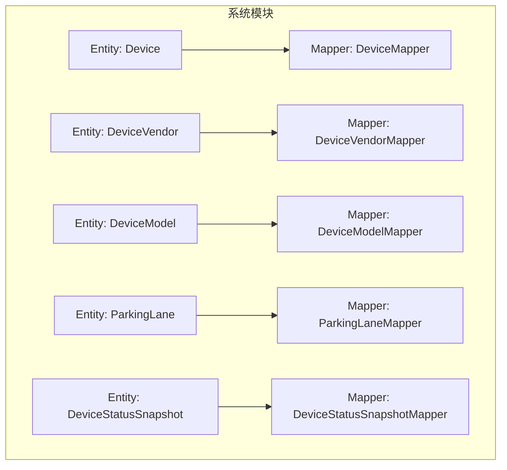
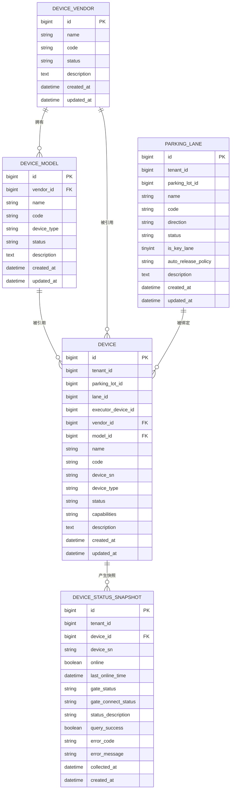
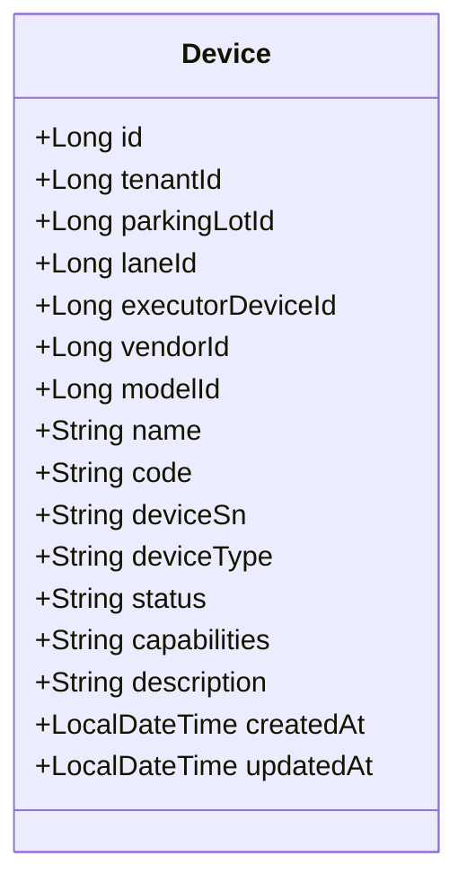
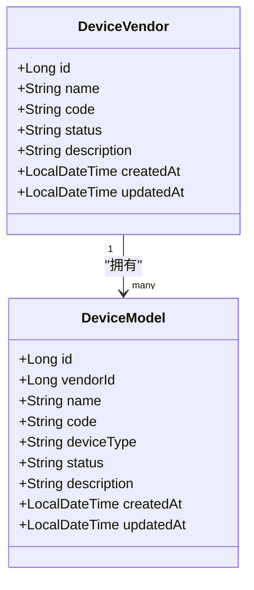
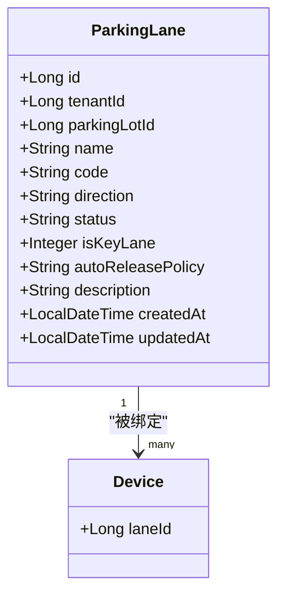
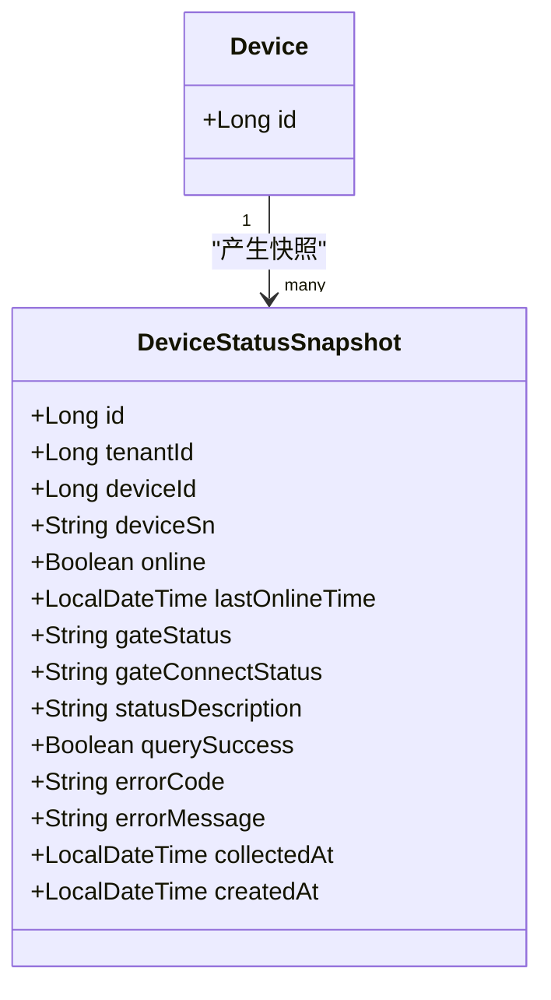
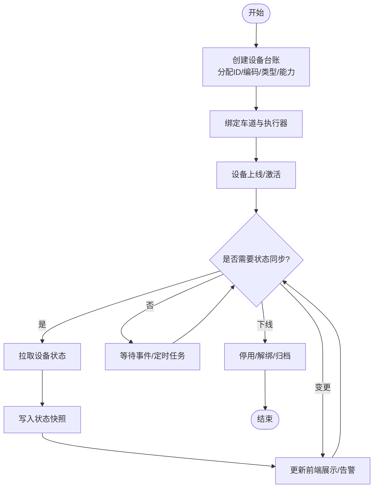
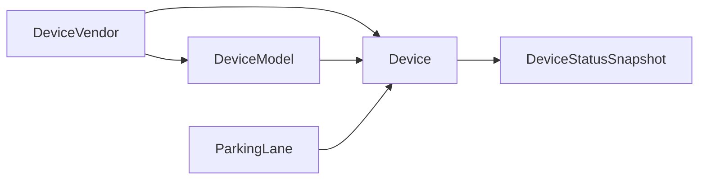

# 设备管理表设计

<cite>
**本文引用的文件**
- [Device.java](file://parking-system/src/main/java/com/jushan/system/entity/Device.java)
- [DeviceVendor.java](file://parking-system/src/main/java/com/jushan/system/entity/DeviceVendor.java)
- [DeviceModel.java](file://parking-system/src/main/java/com/jushan/system/entity/DeviceModel.java)
- [ParkingLane.java](file://parking-system/src/main/java/com/jushan/system/entity/ParkingLane.java)
- [DeviceStatusSnapshot.java](file://parking-system/src/main/java/com/jushan/system/entity/DeviceStatusSnapshot.java)
- [DeviceMapper.java](file://parking-system/src/main/java/com/jushan/system/mapper/DeviceMapper.java)
- [DeviceVendorMapper.java](file://parking-system/src/main/java/com/jushan/system/mapper/DeviceVendorMapper.java)
- [DeviceModelMapper.java](file://parking-system/src/main/java/com/jushan/system/mapper/DeviceModelMapper.java)
- [ParkingLaneMapper.java](file://parking-system/src/main/java/com/jushan/system/mapper/ParkingLaneMapper.java)
- [DeviceStatusSnapshotMapper.java](file://parking-system/src/main/java/com/jushan/system/mapper/DeviceStatusSnapshotMapper.java)
</cite>

## 目录
1. [引言](#引言)
2. [项目结构](#项目结构)
3. [核心组件](#核心组件)
4. [架构总览](#架构总览)
5. [详细组件分析](#详细组件分析)
6. [依赖关系分析](#依赖关系分析)
7. [性能考虑](#性能考虑)
8. [故障排查指南](#故障排查指南)
9. [结论](#结论)
10. [附录](#附录)

## 引言
本文件围绕“设备管理”主题，系统化梳理并解释设备台账、厂商与型号字典、车道绑定、状态快照等核心表结构设计。重点覆盖：
- 设备台账表（Device）的完整字段设计与安全约束
- 设备厂商与设备型号的字典表设计，支持多厂商统一管理
- 车道与设备的绑定关系设计，实现物理位置与逻辑设备的映射
- 设备状态快照表的设计，用于历史状态追踪与分析
- 设备生命周期管理、状态同步机制与性能监控数据的存储策略建议

## 项目结构
设备相关的数据模型与数据访问层位于 parking-system 模块中，采用 MyBatis-Plus 实体 + Mapper 的方式组织：
- 实体类：定义表结构与字段语义
- Mapper 接口：提供基础 CRUD 与少量自定义查询

图表来源
- [Device.java:1-134](file://parking-system/src/main/java/com/jushan/system/entity/Device.java#L1-L134)
- [DeviceVendor.java:1-63](file://parking-system/src/main/java/com/jushan/system/entity/DeviceVendor.java#L1-L63)
- [DeviceModel.java:1-75](file://parking-system/src/main/java/com/jushan/system/entity/DeviceModel.java#L1-L75)
- [ParkingLane.java:1-93](file://parking-system/src/main/java/com/jushan/system/entity/ParkingLane.java#L1-L93)
- [DeviceStatusSnapshot.java:1-113](file://parking-system/src/main/java/com/jushan/system/entity/DeviceStatusSnapshot.java#L1-L113)
- [DeviceMapper.java:1-28](file://parking-system/src/main/java/com/jushan/system/mapper/DeviceMapper.java#L1-L28)
- [DeviceVendorMapper.java:1-16](file://parking-system/src/main/java/com/jushan/system/mapper/DeviceVendorMapper.java#L1-L16)
- [DeviceModelMapper.java:1-16](file://parking-system/src/main/java/com/jushan/system/mapper/DeviceModelMapper.java#L1-L16)
- [ParkingLaneMapper.java:1-28](file://parking-system/src/main/java/com/jushan/system/mapper/ParkingLaneMapper.java#L1-L28)
- [DeviceStatusSnapshotMapper.java:1-16](file://parking-system/src/main/java/com/jushan/system/mapper/DeviceStatusSnapshotMapper.java#L1-L16)

章节来源
- [Device.java:1-134](file://parking-system/src/main/java/com/jushan/system/entity/Device.java#L1-L134)
- [DeviceVendor.java:1-63](file://parking-system/src/main/java/com/jushan/system/entity/DeviceVendor.java#L1-L63)
- [DeviceModel.java:1-75](file://parking-system/src/main/java/com/jushan/system/entity/DeviceModel.java#L1-L75)
- [ParkingLane.java:1-93](file://parking-system/src/main/java/com/jushan/system/entity/ParkingLane.java#L1-L93)
- [DeviceStatusSnapshot.java:1-113](file://parking-system/src/main/java/com/jushan/system/entity/DeviceStatusSnapshot.java#L1-L113)
- [DeviceMapper.java:1-28](file://parking-system/src/main/java/com/jushan/system/mapper/DeviceMapper.java#L1-L28)
- [DeviceVendorMapper.java:1-16](file://parking-system/src/main/java/com/jushan/system/mapper/DeviceVendorMapper.java#L1-L16)
- [DeviceModelMapper.java:1-16](file://parking-system/src/main/java/com/jushan/system/mapper/DeviceModelMapper.java#L1-L16)
- [ParkingLaneMapper.java:1-28](file://parking-system/src/main/java/com/jushan/system/mapper/ParkingLaneMapper.java#L1-L28)
- [DeviceStatusSnapshotMapper.java:1-16](file://parking-system/src/main/java/com/jushan/system/mapper/DeviceStatusSnapshotMapper.java#L1-L16)

## 核心组件
本节聚焦设备台账、厂商与型号字典、车道、状态快照五类核心实体及其职责边界。

- 设备台账（Device）
  - 作用：平台设备业务配置的唯一主数据源；承载设备标识、厂商/型号引用、类型、能力、状态、执行者关联等关键信息
  - 关键字段要点：
    - 租户与停车场归属：tenantId、parkingLotId
    - 物理位置映射：laneId（由绑定表负责维护，当前可为空）
    - 执行器关联：executorDeviceId（仅 GATE 使用，指向实际控制开闸的 CAMERA）
    - 厂商与型号：vendorId、modelId
    - 运营标识：name、code（停车场内唯一）
    - 可信序列号：deviceSn（同厂商内唯一，禁止前端传入）
    - 类型与能力：deviceType、capabilities
    - 运行状态：status（启用/停用）
    - 审计时间：createdAt、updatedAt

- 设备厂商（DeviceVendor）
  - 作用：统一维护设备厂商主数据，包含名称、编码、状态、备注等

- 设备型号（DeviceModel）
  - 作用：按厂商维度维护设备型号主数据，包含名称、编码、设备类型、状态、备注等

- 车道（ParkingLane）
  - 作用：描述停车场的入口/出口/混合车道，具备方向、是否关键车道、自动放行策略等属性

- 设备状态快照（DeviceStatusSnapshot）
  - 作用：持久化对设备接入侧的状态查询结果，作为前端展示与排障依据；记录采集时间与错误信息

章节来源
- [Device.java:1-134](file://parking-system/src/main/java/com/jushan/system/entity/Device.java#L1-L134)
- [DeviceVendor.java:1-63](file://parking-system/src/main/java/com/jushan/system/entity/DeviceVendor.java#L1-L63)
- [DeviceModel.java:1-75](file://parking-system/src/main/java/com/jushan/system/entity/DeviceModel.java#L1-L75)
- [ParkingLane.java:1-93](file://parking-system/src/main/java/com/jushan/system/entity/ParkingLane.java#L1-L93)
- [DeviceStatusSnapshot.java:1-113](file://parking-system/src/main/java/com/jushan/system/entity/DeviceStatusSnapshot.java#L1-L113)

## 架构总览
下图展示了设备主数据与状态快照之间的数据流向与关系：

图表来源
- [Device.java:1-134](file://parking-system/src/main/java/com/jushan/system/entity/Device.java#L1-L134)
- [DeviceVendor.java:1-63](file://parking-system/src/main/java/com/jushan/system/entity/DeviceVendor.java#L1-L63)
- [DeviceModel.java:1-75](file://parking-system/src/main/java/com/jushan/system/entity/DeviceModel.java#L1-L75)
- [ParkingLane.java:1-93](file://parking-system/src/main/java/com/jushan/system/entity/ParkingLane.java#L1-L93)
- [DeviceStatusSnapshot.java:1-113](file://parking-system/src/main/java/com/jushan/system/entity/DeviceStatusSnapshot.java#L1-L113)

## 详细组件分析

### 设备台账表（Device）设计
- 设计目标
  - 作为平台设备主数据源，确保设备标识、厂商/型号、类型、能力、状态等信息的可信与可追溯
  - 通过 parking_lot_id → tenant_id 推导租户范围，结合唯一性约束保障跨租户隔离
  - 以 device_sn 作为调用设备接入侧的可信映射键，且在同厂商内唯一

- 关键字段说明
  - 标识与归属：id、tenant_id、parking_lot_id
  - 物理位置映射：lane_id（由绑定关系维护，可为空）
  - 执行器关联：executor_device_id（GATE 场景下指向实际执行开闸的 CAMERA）
  - 厂商与型号：vendor_id、model_id
  - 运营标识：name、code（在停车场内唯一）
  - 可信序列号：device_sn（同厂商内唯一，禁止前端直接传入）
  - 类型与能力：device_type、capabilities
  - 运行状态：status（启用/停用）
  - 审计时间：created_at、updated_at

- 安全与一致性约束
  - 前端仅能提交平台设备 ID，后端从本表读取 device_sn
  - SN 不得跨租户/停车场复用；同厂商内 SN 唯一
  - 通过租户上下文与拦截器进行数据域隔离

图表来源
- [Device.java:1-134](file://parking-system/src/main/java/com/jushan/system/entity/Device.java#L1-L134)

章节来源
- [Device.java:1-134](file://parking-system/src/main/java/com/jushan/system/entity/Device.java#L1-L134)
- [DeviceMapper.java:1-28](file://parking-system/src/main/java/com/jushan/system/mapper/DeviceMapper.java#L1-L28)

### 设备厂商与设备型号字典表设计
- 设备厂商（DeviceVendor）
  - 字段：id、name、code、status、description、created_at、updated_at
  - 用途：统一维护厂商主数据，供设备与型号引用

- 设备型号（DeviceModel）
  - 字段：id、vendor_id、name、code、device_type、status、description、created_at、updated_at
  - 用途：按厂商维度维护型号主数据，限定设备类型，便于能力与协议适配

图表来源
- [DeviceVendor.java:1-63](file://parking-system/src/main/java/com/jushan/system/entity/DeviceVendor.java#L1-L63)
- [DeviceModel.java:1-75](file://parking-system/src/main/java/com/jushan/system/entity/DeviceModel.java#L1-L75)

章节来源
- [DeviceVendor.java:1-63](file://parking-system/src/main/java/com/jushan/system/entity/DeviceVendor.java#L1-L63)
- [DeviceModel.java:1-75](file://parking-system/src/main/java/com/jushan/system/entity/DeviceModel.java#L1-L75)
- [DeviceVendorMapper.java:1-16](file://parking-system/src/main/java/com/jushan/system/mapper/DeviceVendorMapper.java#L1-L16)
- [DeviceModelMapper.java:1-16](file://parking-system/src/main/java/com/jushan/system/mapper/DeviceModelMapper.java#L1-L16)

### 车道与设备的绑定关系设计
- 车道（ParkingLane）
  - 字段：id、tenant_id、parking_lot_id、name、code、direction、status、is_key_lane、auto_release_policy、description、created_at、updated_at
  - 用途：描述车道的物理与策略属性，如方向、是否关键车道、自动放行策略

- 绑定关系
  - 设备表中的 lane_id 字段用于将设备与车道建立关联，形成“物理位置→逻辑设备”的映射
  - 该字段当前可为空，由绑定流程或独立绑定表维护（具体绑定策略由业务层控制）

图表来源
- [ParkingLane.java:1-93](file://parking-system/src/main/java/com/jushan/system/entity/ParkingLane.java#L1-L93)
- [Device.java:1-134](file://parking-system/src/main/java/com/jushan/system/entity/Device.java#L1-L134)

章节来源
- [ParkingLane.java:1-93](file://parking-system/src/main/java/com/jushan/system/entity/ParkingLane.java#L1-L93)
- [ParkingLaneMapper.java:1-28](file://parking-system/src/main/java/com/jushan/system/mapper/ParkingLaneMapper.java#L1-L28)
- [Device.java:1-134](file://parking-system/src/main/java/com/jushan/system/entity/Device.java#L1-L134)

### 设备状态快照表设计
- 设计目标
  - 每次对设备接入侧执行状态查询后，持久化返回结果，作为前端展示与排障依据
  - 记录采集时间、成功与否、错误码与消息，避免将缓存快照误认为实时状态

- 关键字段说明
  - 关联：tenant_id、device_id、device_sn（冗余便于排障）
  - 在线与连接：online、last_online_time、gate_status、gate_connect_status
  - 状态描述：status_description
  - 查询结果：query_success、error_code、error_message
  - 时间戳：collected_at（采集时间）、created_at（记录创建时间）

图表来源
- [DeviceStatusSnapshot.java:1-113](file://parking-system/src/main/java/com/jushan/system/entity/DeviceStatusSnapshot.java#L1-L113)
- [Device.java:1-134](file://parking-system/src/main/java/com/jushan/system/entity/Device.java#L1-L134)

章节来源
- [DeviceStatusSnapshot.java:1-113](file://parking-system/src/main/java/com/jushan/system/entity/DeviceStatusSnapshot.java#L1-L113)
- [DeviceStatusSnapshotMapper.java:1-16](file://parking-system/src/main/java/com/jushan/system/mapper/DeviceStatusSnapshotMapper.java#L1-L16)

### 设备生命周期管理与状态同步机制
- 生命周期阶段
  - 注册与入库：创建设备台账，分配 platform id、code，绑定 vendor/model，设置初始 status
  - 绑定与上线：将设备与车道绑定，完成设备接入侧注册与鉴权
  - 运行与监控：周期性或事件驱动地拉取设备状态，写入快照表
  - 变更与维护：更新设备能力、型号、状态；必要时解绑或停用
  - 下线与归档：停用设备，保留历史快照与审计记录

- 状态同步机制
  - 主动拉取：定时或触发式调用设备接入侧状态接口，落库为快照
  - 事件上报：设备接入侧推送状态变更事件时，更新最新快照或告警
  - 一致性保障：以 collected_at 标注采集时间，前端展示需附带采集时间提示

[此图为概念流程图，不直接映射到具体源码文件]

## 依赖关系分析
- 实体间依赖
  - Device 引用 DeviceVendor、DeviceModel
  - Device 引用 ParkingLane（通过 lane_id）
  - DeviceStatusSnapshot 引用 Device（通过 device_id）

- 数据访问层
  - 各实体对应 BaseMapper，并提供必要的自定义查询（如忽略租户拦截器的按 ID 查询）

图表来源
- [Device.java:1-134](file://parking-system/src/main/java/com/jushan/system/entity/Device.java#L1-L134)
- [DeviceVendor.java:1-63](file://parking-system/src/main/java/com/jushan/system/entity/DeviceVendor.java#L1-L63)
- [DeviceModel.java:1-75](file://parking-system/src/main/java/com/jushan/system/entity/DeviceModel.java#L1-L75)
- [ParkingLane.java:1-93](file://parking-system/src/main/java/com/jushan/system/entity/ParkingLane.java#L1-L93)
- [DeviceStatusSnapshot.java:1-113](file://parking-system/src/main/java/com/jushan/system/entity/DeviceStatusSnapshot.java#L1-L113)

章节来源
- [DeviceMapper.java:1-28](file://parking-system/src/main/java/com/jushan/system/mapper/DeviceMapper.java#L1-L28)
- [DeviceVendorMapper.java:1-16](file://parking-system/src/main/java/com/jushan/system/mapper/DeviceVendorMapper.java#L1-L16)
- [DeviceModelMapper.java:1-16](file://parking-system/src/main/java/com/jushan/system/mapper/DeviceModelMapper.java#L1-L16)
- [ParkingLaneMapper.java:1-28](file://parking-system/src/main/java/com/jushan/system/mapper/ParkingLaneMapper.java#L1-L28)
- [DeviceStatusSnapshotMapper.java:1-16](file://parking-system/src/main/java/com/jushan/system/mapper/DeviceStatusSnapshotMapper.java#L1-L16)

## 性能考虑
- 索引建议
  - device(vendor_id, device_sn) 联合唯一索引，保证同厂商内 SN 唯一与快速查找
  - device(tenant_id, parking_lot_id, code) 组合索引，加速按租户/停车场检索
  - device(lane_id) 索引，优化按车道反查设备
  - device_status_snapshot(device_id, collected_at) 索引，优化按设备与时间范围查询
  - device_status_snapshot(tenant_id, device_id) 索引，优化按租户+设备聚合

- 读写分离与缓存
  - 设备主数据读多写少，可引入本地/分布式缓存（注意失效策略）
  - 状态快照适合时序存储，可按时间分区或冷热分层

- 批量与分页
  - 批量导入设备与快照时，使用批量插入减少往返
  - 列表查询默认分页，避免全表扫描

- 事务与一致性
  - 设备绑定/解绑涉及多表更新，应置于事务中，保证一致性
  - 状态快照写入与告警生成需幂等，避免重复处理

[本节为通用性能建议，不直接分析具体文件]

## 故障排查指南
- 常见问题定位
  - 设备无法识别：检查 device_sn 是否与接入侧一致，确认 vendor_id 与 model_id 正确
  - 状态显示异常：查看最近快照的 query_success、error_code、error_message 与 collected_at
  - 绑定关系错误：核对 lane_id 与车道方向、是否关键车道配置
  - 权限与租户隔离：确认操作是否在正确的租户上下文中执行

- 排查步骤
  - 根据平台设备 ID 查询设备台账，验证字段完整性
  - 根据 device_id 查询最近快照，判断采集时间与错误信息
  - 若为 GATE 设备，检查 executor_device_id 是否正确指向相机设备
  - 校验车道绑定与自动放行策略是否符合预期

章节来源
- [Device.java:1-134](file://parking-system/src/main/java/com/jushan/system/entity/Device.java#L1-L134)
- [DeviceStatusSnapshot.java:1-113](file://parking-system/src/main/java/com/jushan/system/entity/DeviceStatusSnapshot.java#L1-L113)
- [DeviceMapper.java:1-28](file://parking-system/src/main/java/com/jushan/system/mapper/DeviceMapper.java#L1-L28)
- [DeviceStatusSnapshotMapper.java:1-16](file://parking-system/src/main/java/com/jushan/system/mapper/DeviceStatusSnapshotMapper.java#L1-L16)

## 结论
本设计以设备台账为核心，结合厂商与型号字典、车道绑定与状态快照，构建了完整的设备管理体系。通过严格的安全约束与一致性策略，确保设备主数据的可信性与可追溯性；通过快照机制与时间戳标注，兼顾了前端展示与排障需求。建议在后续迭代中完善绑定关系表与性能优化策略，进一步提升系统的可扩展性与稳定性。

## 附录
- 术语说明
  - 设备接入侧（Device Access）：负责与硬件设备通信的服务
  - 快照：对设备状态的某时刻查询结果的持久化记录
  - 关键车道：离线可能导致停车场不可用的车道

[本节为概念性补充，不直接分析具体文件]