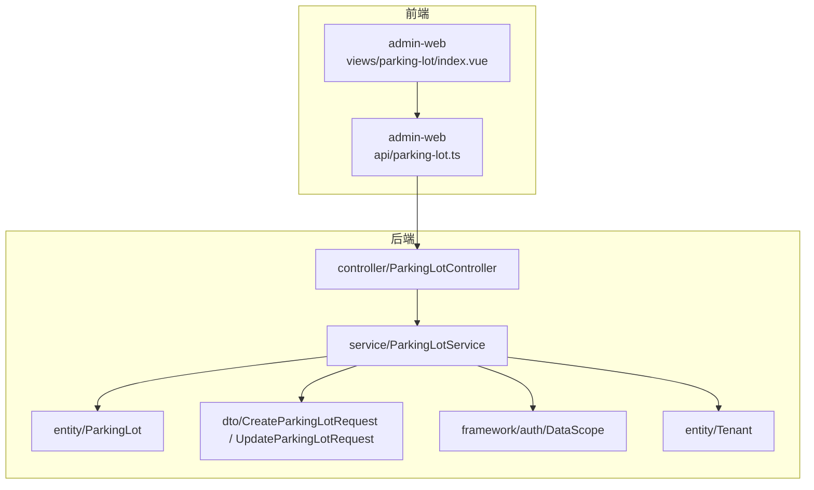
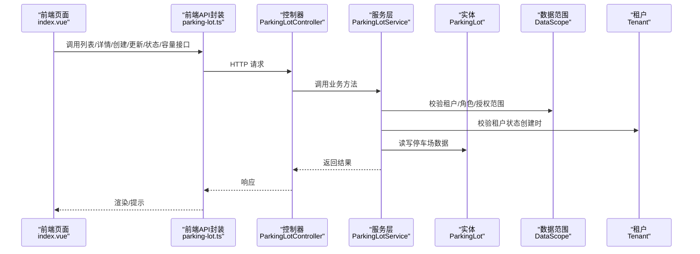
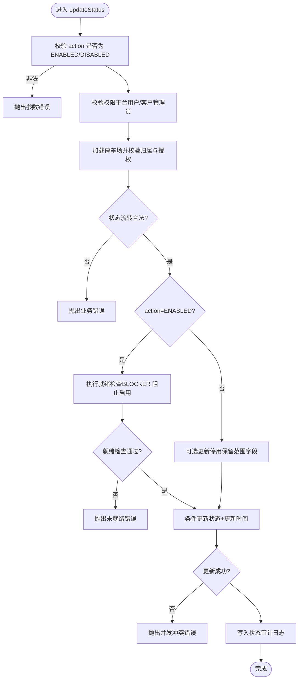
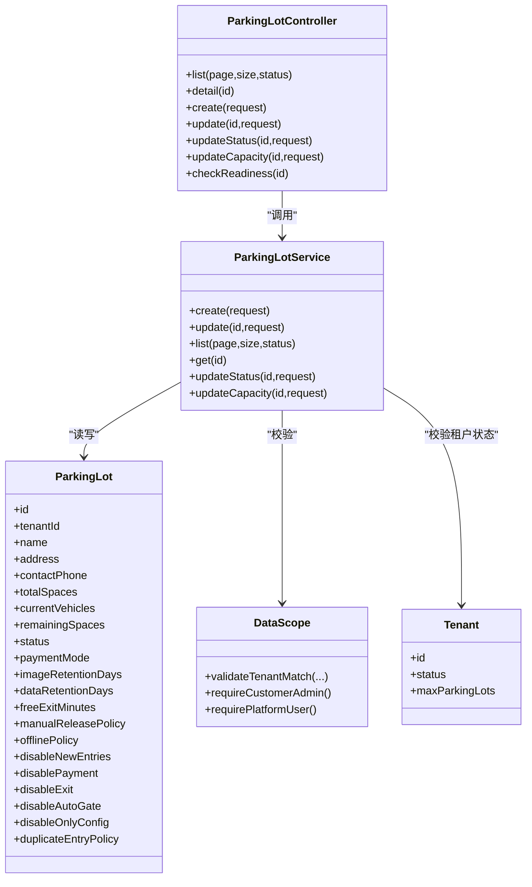

# 停车场管理

<cite>
**本文引用的文件**   
- [ParkingLot.java](file://parking-system/src/main/java/com/jushan/system/entity/ParkingLot.java)
- [CreateParkingLotRequest.java](file://parking-system/src/main/java/com/jushan/system/dto/CreateParkingLotRequest.java)
- [UpdateParkingLotRequest.java](file://parking-system/src/main/java/com/jushan/system/dto/UpdateParkingLotRequest.java)
- [ParkingLotController.java](file://parking-system/src/main/java/com/jushan/system/controller/ParkingLotController.java)
- [ParkingLotService.java](file://parking-system/src/main/java/com/jushan/system/service/ParkingLotService.java)
- [DataScope.java](file://parking-framework/src/main/java/com/jushan/framework/auth/DataScope.java)
- [Tenant.java](file://parking-system/src/main/java/com/jushan/system/entity/Tenant.java)
- [parking-lot.ts](file://admin-web/src/api/parking-lot.ts)
- [index.vue](file://admin-web/src/views/parking-lot/index.vue)
</cite>

## 目录
1. [简介](#简介)
2. [项目结构](#项目结构)
3. [核心组件](#核心组件)
4. [架构总览](#架构总览)
5. [详细组件分析](#详细组件分析)
6. [依赖关系分析](#依赖关系分析)
7. [性能与一致性](#性能与一致性)
8. [故障排查指南](#故障排查指南)
9. [结论](#结论)
10. [附录：API 接口规范](#附录api-接口规范)

## 简介
本技术文档围绕“停车场管理”功能，系统化说明停车场实体的字段定义、业务含义、CRUD 接口流程、状态管理机制（启用/禁用）、容量同步与审计、与租户系统的数据隔离机制，以及关键运营策略（支付模式、离线策略、重复入场策略、人工放行策略）的实现要点。文档同时提供前后端交互的 API 规范与使用示例路径，帮助开发者快速理解并正确集成。

## 项目结构
停车场管理涉及后端实体、控制器、服务层、权限与数据范围控制、前端页面与 API 封装等模块。整体采用分层架构：
- 表现层：Admin Web 页面与 API 封装
- 控制层：REST 控制器
- 服务层：业务编排、校验、事务与审计
- 领域模型：实体与 DTO
- 框架能力：租户上下文、数据范围、权限校验

图表来源
- [index.vue:1-288](file://admin-web/src/views/parking-lot/index.vue#L1-L288)
- [parking-lot.ts:1-54](file://admin-web/src/api/parking-lot.ts#L1-L54)
- [ParkingLotController.java:35-165](file://parking-system/src/main/java/com/jushan/system/controller/ParkingLotController.java#L35-L165)
- [ParkingLotService.java:49-588](file://parking-system/src/main/java/com/jushan/system/service/ParkingLotService.java#L49-L588)
- [ParkingLot.java:17-171](file://parking-system/src/main/java/com/jushan/system/entity/ParkingLot.java#L17-L171)
- [CreateParkingLotRequest.java:1-104](file://parking-system/src/main/java/com/jushan/system/dto/CreateParkingLotRequest.java#L1-L104)
- [UpdateParkingLotRequest.java:1-98](file://parking-system/src/main/java/com/jushan/system/dto/UpdateParkingLotRequest.java#L1-L98)
- [DataScope.java:25-239](file://parking-framework/src/main/java/com/jushan/framework/auth/DataScope.java#L25-L239)
- [Tenant.java:19-89](file://parking-system/src/main/java/com/jushan/system/entity/Tenant.java#L19-L89)

章节来源
- [ParkingLotController.java:35-165](file://parking-system/src/main/java/com/jushan/system/controller/ParkingLotController.java#L35-L165)
- [ParkingLotService.java:49-588](file://parking-system/src/main/java/com/jushan/system/service/ParkingLotService.java#L49-L588)
- [ParkingLot.java:17-171](file://parking-system/src/main/java/com/jushan/system/entity/ParkingLot.java#L17-L171)
- [parking-lot.ts:1-54](file://admin-web/src/api/parking-lot.ts#L1-L54)
- [index.vue:1-288](file://admin-web/src/views/parking-lot/index.vue#L1-L288)

## 核心组件
- 实体 ParkingLot：承载停车场主数据与运营策略配置
- 请求 DTO：CreateParkingLotRequest、UpdateParkingLotRequest
- 控制器 ParkingLotController：对外暴露 REST 接口
- 服务 ParkingLotService：实现创建、查询、更新、状态变更、容量变更及审计
- 权限与数据范围 DataScope：租户与停车场级数据隔离、角色校验
- 租户 Tenant：多租户归属与限制

章节来源
- [ParkingLot.java:17-171](file://parking-system/src/main/java/com/jushan/system/entity/ParkingLot.java#L17-L171)
- [CreateParkingLotRequest.java:1-104](file://parking-system/src/main/java/com/jushan/system/dto/CreateParkingLotRequest.java#L1-L104)
- [UpdateParkingLotRequest.java:1-98](file://parking-system/src/main/java/com/jushan/system/dto/UpdateParkingLotRequest.java#L1-L98)
- [ParkingLotController.java:35-165](file://parking-system/src/main/java/com/jushan/system/controller/ParkingLotController.java#L35-L165)
- [ParkingLotService.java:49-588](file://parking-system/src/main/java/com/jushan/system/service/ParkingLotService.java#L49-L588)
- [DataScope.java:25-239](file://parking-framework/src/main/java/com/jushan/framework/auth/DataScope.java#L25-L239)
- [Tenant.java:19-89](file://parking-system/src/main/java/com/jushan/system/entity/Tenant.java#L19-L89)

## 架构总览
停车场管理在系统中的职责边界如下：
- 前端通过 admin-web 的 parking-lot 页面发起 CRUD 与状态/容量操作
- 后端由 ParkingLotController 接收请求，进行权限校验后委派给 ParkingLotService
- Service 层负责业务规则、并发安全、审计日志写入以及与租户/数据范围框架的集成
- 实体 ParkingLot 持久化到数据库，DTO 用于入参校验与传输

图表来源
- [index.vue:1-288](file://admin-web/src/views/parking-lot/index.vue#L1-L288)
- [parking-lot.ts:1-54](file://admin-web/src/api/parking-lot.ts#L1-L54)
- [ParkingLotController.java:35-165](file://parking-system/src/main/java/com/jushan/system/controller/ParkingLotController.java#L35-L165)
- [ParkingLotService.java:49-588](file://parking-system/src/main/java/com/jushan/system/service/ParkingLotService.java#L49-L588)
- [ParkingLot.java:17-171](file://parking-system/src/main/java/com/jushan/system/entity/ParkingLot.java#L17-L171)
- [DataScope.java:25-239](file://parking-framework/src/main/java/com/jushan/framework/auth/DataScope.java#L25-L239)
- [Tenant.java:19-89](file://parking-system/src/main/java/com/jushan/system/entity/Tenant.java#L19-L89)

## 详细组件分析

### 实体与字段定义（ParkingLot）
- 基本信息
  - id：自增主键
  - tenantId：所属租户 ID
  - name：停车场名称
  - address：地址
  - contactPhone：联系电话
  - longitude/latitude：经纬度（预留）
- 容量管理
  - totalSpaces：总车位数
  - currentVehicles：当前在场车辆数（只读，由停车记录计算）
  - remainingSpaces：剩余车位数（默认 = totalSpaces - currentVehicles，允许人工修正）
- 状态控制
  - status：ENABLED 启用 / DISABLED 禁用
- 运营策略
  - paymentMode：支付模式（PLATFORM/CUSTOMER）
  - imageRetentionDays：抓拍图片保存天数
  - dataRetentionDays：业务数据保存天数
  - freeExitMinutes：缴费后免费离场时间（分钟）
  - manualReleasePolicy：人工放行策略（ADMIN_ONLY/BOOTH_ALLOWED）
  - offlinePolicy：离线运行策略（ALLOW_ENTRY_EXIT/ALLOW_EXIT_ONLY/STRICT）
  - duplicateEntryPolicy：重复入场策略（REJECT/UPDATE/EXCEPTION）
- 停用保留范围（停用时可配置）
  - disableNewEntries：是否允许新车入场
  - disablePayment：是否允许缴费
  - disableExit：是否允许出场
  - disableAutoGate：是否保留自动开闸
  - disableOnlyConfig：是否仅限制后台配置

章节来源
- [ParkingLot.java:17-171](file://parking-system/src/main/java/com/jushan/system/entity/ParkingLot.java#L17-L171)

### 创建与更新（DTO 与校验）
- 创建请求 CreateParkingLotRequest
  - 必填：name、totalSpaces
  - 可选：address、contactPhone、longitude、latitude、paymentMode、imageRetentionDays、dataRetentionDays、freeExitMinutes、manualReleasePolicy、offlinePolicy、duplicateEntryPolicy
- 更新请求 UpdateParkingLotRequest
  - 所有字段可选，仅非 null 字段生效
  - 包含基础信息、策略相关字段（不含容量与状态）

章节来源
- [CreateParkingLotRequest.java:1-104](file://parking-system/src/main/java/com/jushan/system/dto/CreateParkingLotRequest.java#L1-L104)
- [UpdateParkingLotRequest.java:1-98](file://parking-system/src/main/java/com/jushan/system/dto/UpdateParkingLotRequest.java#L1-L98)

### 控制器接口（ParkingLotController）
- GET /admin/parking-lots：分页查询本租户停车场列表（支持按状态筛选）
- GET /admin/parking-lots/{id}：查询停车场详情
- POST /admin/parking-lots：创建停车场
- PUT /admin/parking-lots/{id}：更新停车场基础信息与策略（不含容量和状态）
- POST /admin/parking-lots/{id}/status：启用或停用停车场（停用需原因）
- POST /admin/parking-lots/{id}/capacity：修改总车位或人工修正剩余车位（需原因）
- GET /admin/parking-lots/{id}/readiness：就绪检查（启用前检查车道、设备绑定、执行相机、容量等）

章节来源
- [ParkingLotController.java:35-165](file://parking-system/src/main/java/com/jushan/system/controller/ParkingLotController.java#L35-L165)

### 服务层逻辑（ParkingLotService）
- 创建流程
  - 从会话推导租户，校验租户状态
  - 初始化容量：currentVehicles=0，remainingSpaces=totalSpaces
  - 新停车场初始状态为 DISABLED（需就绪检查通过后才能启用）
  - 设置默认策略值（支付模式、图片/数据保留天数、免费离场分钟、人工放行策略、离线策略、重复入场策略）
  - 写入审计日志（后续统一在状态/容量变更时记录）
- 更新流程
  - 仅更新非 null 字段；不包含容量与状态
- 查询流程
  - 强制租户上下文；结合停车场级授权范围过滤
- 状态管理
  - 启用/停用严格的状态流转校验
  - 启用前必须通过就绪检查（阻塞项将拒绝启用）
  - 停用时可配置保留范围（是否允许新车入场/缴费/出场/自动开闸/仅限制后台配置）
  - 条件更新防止并发覆盖；写入状态审计日志
- 容量管理
  - 仅允许修改 total_spaces 或 remaining_spaces
  - 获取修改前值，无变化则跳过
  - 条件更新（乐观锁）防止并发覆盖；写入容量审计日志

图表来源
- [ParkingLotService.java:312-411](file://parking-system/src/main/java/com/jushan/system/service/ParkingLotService.java#L312-L411)

章节来源
- [ParkingLotService.java:118-165](file://parking-system/src/main/java/com/jushan/system/service/ParkingLotService.java#L118-L165)
- [ParkingLotService.java:178-245](file://parking-system/src/main/java/com/jushan/system/service/ParkingLotService.java#L178-L245)
- [ParkingLotService.java:264-297](file://parking-system/src/main/java/com/jushan/system/service/ParkingLotService.java#L264-L297)
- [ParkingLotService.java:312-411](file://parking-system/src/main/java/com/jushan/system/service/ParkingLotService.java#L312-L411)
- [ParkingLotService.java:424-477](file://parking-system/src/main/java/com/jushan/system/service/ParkingLotService.java#L424-L477)

### 前端交互（Admin Web）
- 列表页 index.vue
  - 支持按状态筛选、分页、新增/编辑弹窗、启用/停用按钮
  - 停用需填写原因弹窗确认
  - 调用 parking-lot.ts 中的 API 函数
- API 封装 parking-lot.ts
  - 提供 getParkingLots、getParkingLot、createParkingLot、updateParkingLot、updateParkingLotStatus、updateParkingLotCapacity 等方法
  - 对应后端 Controller 的 REST 接口

章节来源
- [index.vue:1-288](file://admin-web/src/views/parking-lot/index.vue#L1-L288)
- [parking-lot.ts:1-54](file://admin-web/src/api/parking-lot.ts#L1-L54)

## 依赖关系分析
- 控制器依赖服务层，服务层依赖实体、DTO、数据范围与租户实体
- 数据范围 DataScope 提供租户匹配、角色校验、停车场级授权校验
- 前端通过 TypeScript 类型与 API 函数与后端契约保持一致

图表来源
- [ParkingLotController.java:35-165](file://parking-system/src/main/java/com/jushan/system/controller/ParkingLotController.java#L35-L165)
- [ParkingLotService.java:49-588](file://parking-system/src/main/java/com/jushan/system/service/ParkingLotService.java#L49-L588)
- [ParkingLot.java:17-171](file://parking-system/src/main/java/com/jushan/system/entity/ParkingLot.java#L17-L171)
- [DataScope.java:25-239](file://parking-framework/src/main/java/com/jushan/framework/auth/DataScope.java#L25-L239)
- [Tenant.java:19-89](file://parking-system/src/main/java/com/jushan/system/entity/Tenant.java#L19-L89)

章节来源
- [ParkingLotController.java:35-165](file://parking-system/src/main/java/com/jushan/system/controller/ParkingLotController.java#L35-L165)
- [ParkingLotService.java:49-588](file://parking-system/src/main/java/com/jushan/system/service/ParkingLotService.java#L49-L588)
- [DataScope.java:25-239](file://parking-framework/src/main/java/com/jushan/framework/auth/DataScope.java#L25-L239)

## 性能与一致性
- 并发安全
  - 状态与容量更新均采用条件更新（基于 beforeStatus/beforeValue），避免并发覆盖
- 幂等性
  - 容量更新若前后值相同直接跳过，减少不必要写入
- 审计与可追溯
  - 状态与容量变更均写入审计日志，便于问题定位与合规审计
- 就绪检查前置
  - 启用前进行就绪检查，提前发现配置缺失，降低运行时异常风险

[本节为通用指导，不直接分析具体文件]

## 故障排查指南
- 常见错误
  - 参数错误：无效的操作类型、无效的容量字段、必填字段为空
  - 业务错误：状态已是启用/停用、只能对特定状态进行操作、未就绪无法启用、容量已变更请刷新重试
  - 权限错误：未登录/会话过期、资源不属于本租户、需要特定角色
- 排查建议
  - 查看状态/容量审计日志，确认最近一次变更的操作人与原因
  - 核对租户状态与角色权限，确保具备 parking:disable 或 parking:write 权限
  - 启用失败时检查就绪检查结果中的 BLOCKER 项，逐项修复

章节来源
- [ParkingLotService.java:312-411](file://parking-system/src/main/java/com/jushan/system/service/ParkingLotService.java#L312-L411)
- [ParkingLotService.java:424-477](file://parking-system/src/main/java/com/jushan/system/service/ParkingLotService.java#L424-L477)
- [DataScope.java:25-239](file://parking-framework/src/main/java/com/jushan/framework/auth/DataScope.java#L25-L239)

## 结论
停车场管理模块以清晰的实体定义与严格的权限/数据范围控制为基础，提供了完整的 CRUD 与状态/容量管理能力。通过就绪检查、条件更新与审计日志，保障了启用的安全性与变更的可追溯性。结合多租户与停车场级授权，实现了良好的数据隔离与可扩展性。

[本节为总结，不直接分析具体文件]

## 附录：API 接口规范

- 分页查询停车场列表
  - 方法：GET
  - 路径：/admin/parking-lots
  - 参数：page、size、status（可选）
  - 权限：parking:read
  - 返回：分页结果（records、total）
  - 前端调用：getParkingLots
  - 参考路径
    - [ParkingLotController.java:59-66](file://parking-system/src/main/java/com/jushan/system/controller/ParkingLotController.java#L59-L66)
    - [parking-lot.ts:26-28](file://admin-web/src/api/parking-lot.ts#L26-L28)

- 查询停车场详情
  - 方法：GET
  - 路径：/admin/parking-lots/{id}
  - 权限：parking:read
  - 返回：ParkingLotVO
  - 前端调用：getParkingLot
  - 参考路径
    - [ParkingLotController.java:73-78](file://parking-system/src/main/java/com/jushan/system/controller/ParkingLotController.java#L73-L78)
    - [parking-lot.ts:31-33](file://admin-web/src/api/parking-lot.ts#L31-L33)

- 创建停车场
  - 方法：POST
  - 路径：/admin/parking-lots
  - 请求体：CreateParkingLotRequest
  - 权限：parking:write（仅客户管理员）
  - 返回：ParkingLotVO
  - 前端调用：createParkingLot
  - 参考路径
    - [ParkingLotController.java:85-91](file://parking-system/src/main/java/com/jushan/system/controller/ParkingLotController.java#L85-L91)
    - [parking-lot.ts:36-38](file://admin-web/src/api/parking-lot.ts#L36-L38)

- 更新停车场（基础信息与策略）
  - 方法：PUT
  - 路径：/admin/parking-lots/{id}
  - 请求体：UpdateParkingLotRequest（仅非 null 字段生效）
  - 权限：parking:write
  - 返回：ParkingLotVO
  - 前端调用：updateParkingLot
  - 参考路径
    - [ParkingLotController.java:98-104](file://parking-system/src/main/java/com/jushan/system/controller/ParkingLotController.java#L98-L104)
    - [parking-lot.ts:41-43](file://admin-web/src/api/parking-lot.ts#L41-L43)

- 启用/停用停车场
  - 方法：POST
  - 路径：/admin/parking-lots/{id}/status
  - 请求体：{ action: "ENABLED"|"DISABLED", reason?: string }
  - 权限：parking:disable（仅超级管理员与客户管理员）
  - 行为：启用前执行就绪检查；停用需填写原因；可配置停用保留范围
  - 前端调用：updateParkingLotStatus
  - 参考路径
    - [ParkingLotController.java:116-122](file://parking-system/src/main/java/com/jushan/system/controller/ParkingLotController.java#L116-L122)
    - [parking-lot.ts:46-48](file://admin-web/src/api/parking-lot.ts#L46-L48)

- 修改容量（总车位/剩余车位）
  - 方法：POST
  - 路径：/admin/parking-lots/{id}/capacity
  - 请求体：{ fieldName: "total_spaces"|"remaining_spaces", value: number, reason: string }
  - 权限：parking:write
  - 行为：条件更新防并发；写入容量审计日志
  - 前端调用：updateParkingLotCapacity
  - 参考路径
    - [ParkingLotController.java:134-141](file://parking-system/src/main/java/com/jushan/system/controller/ParkingLotController.java#L134-L141)
    - [parking-lot.ts:51-53](file://admin-web/src/api/parking-lot.ts#L51-L53)

- 就绪检查
  - 方法：GET
  - 路径：/admin/parking-lots/{id}/readiness
  - 权限：parking:read
  - 返回：就绪检查结果（含 BLOCKER/WARNING 级别项）
  - 参考路径
    - [ParkingLotController.java:157-164](file://parking-system/src/main/java/com/jushan/system/controller/ParkingLotController.java#L157-L164)

章节来源
- [ParkingLotController.java:35-165](file://parking-system/src/main/java/com/jushan/system/controller/ParkingLotController.java#L35-L165)
- [parking-lot.ts:1-54](file://admin-web/src/api/parking-lot.ts#L1-L54)