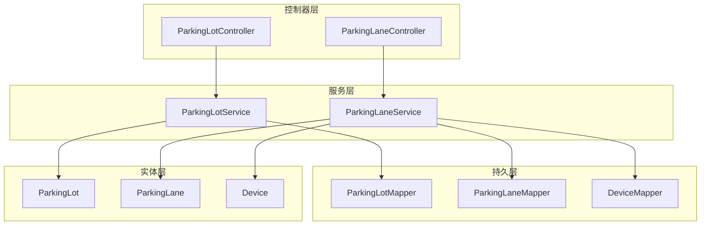
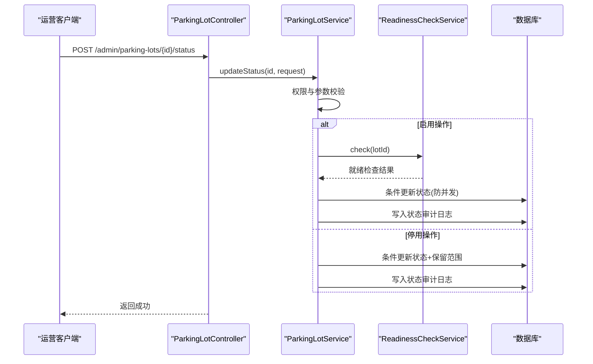
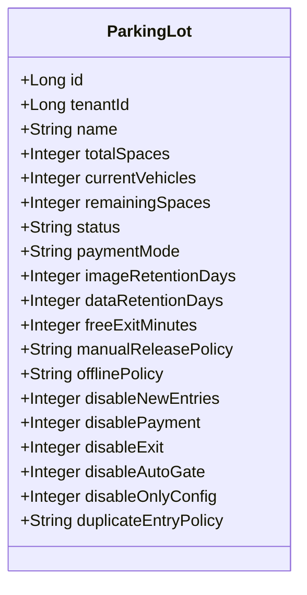
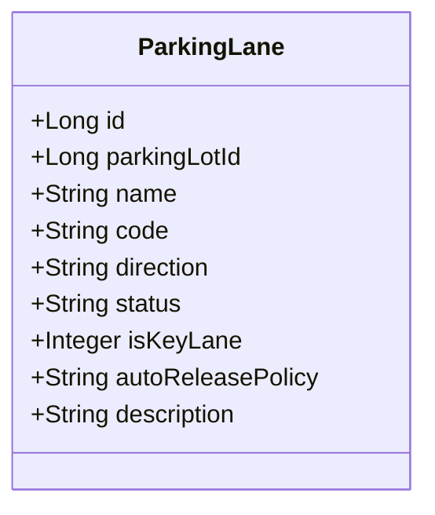
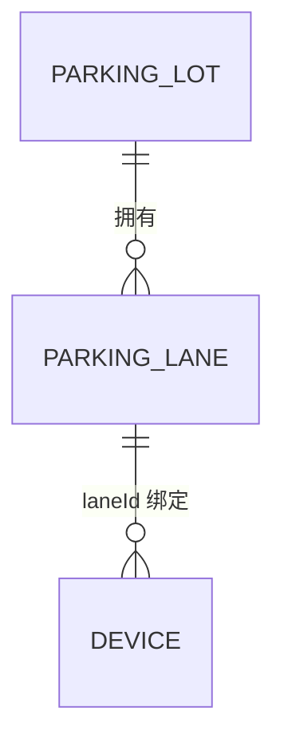
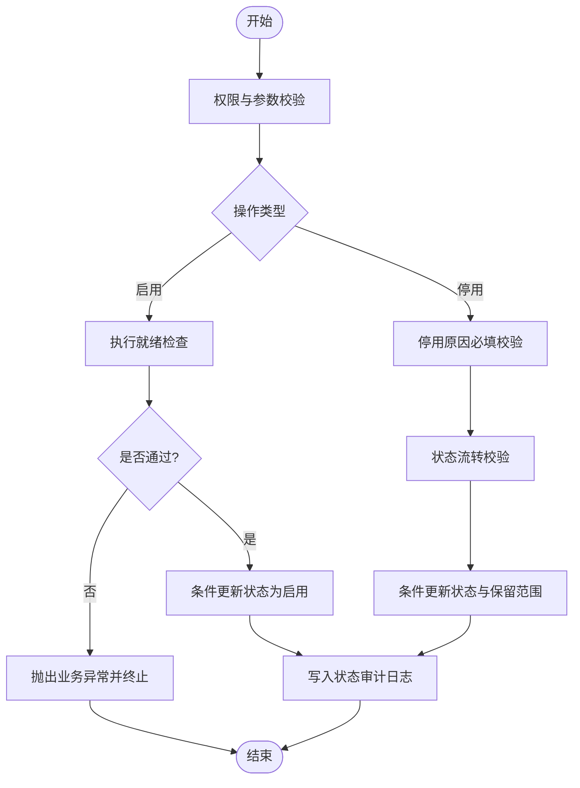
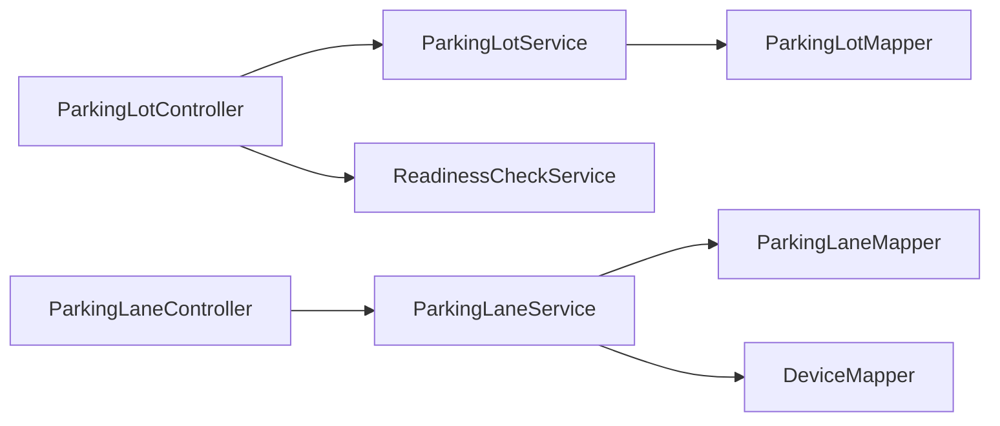

# 停车场管理模块

<cite>
**本文引用的文件**   
- [ParkingLot.java](file://parking-system/src/main/java/com/jushan/system/entity/ParkingLot.java)
- [ParkingLane.java](file://parking-system/src/main/java/com/jushan/system/entity/ParkingLane.java)
- [Device.java](file://parking-system/src/main/java/com/jushan/system/entity/Device.java)
- [ParkingLotController.java](file://parking-system/src/main/java/com/jushan/system/controller/ParkingLotController.java)
- [ParkingLaneController.java](file://parking-system/src/main/java/com/jushan/system/controller/ParkingLaneController.java)
- [ParkingLotService.java](file://parking-system/src/main/java/com/jushan/system/service/ParkingLotService.java)
- [ParkingLaneService.java](file://parking-system/src/main/java/com/jushan/system/service/ParkingLaneService.java)
- [CreateParkingLotRequest.java](file://parking-system/src/main/java/com/jushan/system/dto/CreateParkingLotRequest.java)
- [CreateLaneRequest.java](file://parking-system/src/main/java/com/jushan/system/dto/CreateLaneRequest.java)
- [UpdateLaneRequest.java](file://parking-system/src/main/java/com/jushan/system/dto/UpdateLaneRequest.java)
</cite>

## 目录
1. [简介](#简介)
2. [项目结构](#项目结构)
3. [核心组件](#核心组件)
4. [架构总览](#架构总览)
5. [详细组件分析](#详细组件分析)
6. [依赖关系分析](#依赖关系分析)
7. [性能与一致性](#性能与一致性)
8. [故障排查指南](#故障排查指南)
9. [结论](#结论)
10. [附录：API 接口说明](#附录api-接口说明)

## 简介
本技术文档聚焦“停车场管理模块”，围绕停车场实体设计、车道管理逻辑、设备绑定关系，以及停车场的 CRUD、状态管理与容量控制机制展开。文档同时解释车道类型定义、设备绑定策略与实时状态同步思路，并给出业务规则实现要点（启用/禁用流程、车道分配策略、设备冲突检测）、完整 API 接口说明与使用示例，以及与设备管理、计费引擎等模块的集成方式。最后涵盖数据一致性保证、事务处理与错误恢复机制。

## 项目结构
停车场管理相关代码位于 parking-system 模块中，采用典型的 Controller-Service-Mapper 分层：
- 控制器层：ParkingLotController、ParkingLaneController
- 服务层：ParkingLotService、ParkingLaneService
- 实体层：ParkingLot、ParkingLane、Device
- DTO/VO：创建/更新请求对象及视图对象

图表来源
- [ParkingLotController.java:1-166](file://parking-system/src/main/java/com/jushan/system/controller/ParkingLotController.java#L1-L166)
- [ParkingLaneController.java:1-122](file://parking-system/src/main/java/com/jushan/system/controller/ParkingLaneController.java#L1-L122)
- [ParkingLotService.java:1-589](file://parking-system/src/main/java/com/jushan/system/service/ParkingLotService.java#L1-L589)
- [ParkingLaneService.java:1-443](file://parking-system/src/main/java/com/jushan/system/service/ParkingLaneService.java#L1-L443)
- [ParkingLot.java:1-172](file://parking-system/src/main/java/com/jushan/system/entity/ParkingLot.java#L1-L172)
- [ParkingLane.java:1-93](file://parking-system/src/main/java/com/jushan/system/entity/ParkingLane.java#L1-L93)
- [Device.java](file://parking-system/src/main/java/com/jushan/system/entity/Device.java)

章节来源
- [ParkingLotController.java:1-166](file://parking-system/src/main/java/com/jushan/system/controller/ParkingLotController.java#L1-L166)
- [ParkingLaneController.java:1-122](file://parking-system/src/main/java/com/jushan/system/controller/ParkingLaneController.java#L1-L122)
- [ParkingLotService.java:1-589](file://parking-system/src/main/java/com/jushan/system/service/ParkingLotService.java#L1-L589)
- [ParkingLaneService.java:1-443](file://parking-system/src/main/java/com/jushan/system/service/ParkingLaneService.java#L1-L443)

## 核心组件
- 停车场实体 ParkingLot：承载租户、名称、地址、联系方式、经纬度、总车位、在场车辆数、剩余车位、状态、支付模式、图片/数据保留天数、免费离场分钟、人工放行策略、离线策略、重复入场策略、停用时的能力开关等。
- 车道实体 ParkingLane：承载所属停车场、名称、编码、方向（入口/出口/混合）、状态、是否关键车道、自动放行策略、描述等。
- 设备实体 Device：用于表示物理设备及其与车道的绑定关系（通过 laneId 字段）。

章节来源
- [ParkingLot.java:1-172](file://parking-system/src/main/java/com/jushan/system/entity/ParkingLot.java#L1-L172)
- [ParkingLane.java:1-93](file://parking-system/src/main/java/com/jushan/system/entity/ParkingLane.java#L1-L93)
- [Device.java](file://parking-system/src/main/java/com/jushan/system/entity/Device.java)

## 架构总览
停车场管理模块在系统内承担“资源编排与运行态配置”的职责：
- 对外暴露运营端 REST API，负责停车场与车道的增删改查、状态切换、容量调整。
- 对内提供就绪检查、权限校验、数据隔离、并发安全与审计日志写入。
- 与设备管理模块协作，完成车道与设备的绑定查询与展示；为后续的设备命令下发、状态上报预留扩展点。
- 与计费引擎、事件总线等模块解耦，通过明确的数据模型与接口契约进行集成。

图表来源
- [ParkingLotController.java:116-122](file://parking-system/src/main/java/com/jushan/system/controller/ParkingLotController.java#L116-L122)
- [ParkingLotService.java:312-411](file://parking-system/src/main/java/com/jushan/system/service/ParkingLotService.java#L312-L411)

## 详细组件分析

### 停车场实体与业务规则
- 状态管理：支持 ENABLED/DISABLED 两种状态，新创建默认 DISABLED，需通过就绪检查后方可启用。
- 容量控制：totalSpaces 与 remainingSpaces 可独立维护；remainingSpaces 可由业务计算或人工修正，变更需记录审计日志。
- 运行策略：包含支付模式、人工放行策略、离线策略、重复入场策略，以及停用时的细粒度能力开关（入场/缴费/出场/自动开闸/仅限制后台配置）。
- 数据隔离：基于租户与停车场级授权双重校验，确保多租户与角色维度下的数据安全。

图表来源
- [ParkingLot.java:1-172](file://parking-system/src/main/java/com/jushan/system/entity/ParkingLot.java#L1-L172)

章节来源
- [ParkingLot.java:1-172](file://parking-system/src/main/java/com/jushan/system/entity/ParkingLot.java#L1-L172)
- [ParkingLotService.java:107-165](file://parking-system/src/main/java/com/jushan/system/service/ParkingLotService.java#L107-L165)
- [ParkingLotService.java:312-411](file://parking-system/src/main/java/com/jushan/system/service/ParkingLotService.java#L312-L411)
- [ParkingLotService.java:424-477](file://parking-system/src/main/java/com/jushan/system/service/ParkingLotService.java#L424-L477)

### 车道实体与类型定义
- 方向枚举：ENTRY（入口）、EXIT（出口）、MIXED（混合，语义待确认）。
- 自动放行策略：AUTO（自动放行）、MANUAL（人工确认）、AFTER_PAY（缴费后自动放行）。
- 关键车道标记：isKeyLane 用于标识对停车场可用性影响较大的车道。
- 唯一性约束：同一停车场内 code 必须唯一。

图表来源
- [ParkingLane.java:1-93](file://parking-system/src/main/java/com/jushan/system/entity/ParkingLane.java#L1-L93)

章节来源
- [ParkingLane.java:1-93](file://parking-system/src/main/java/com/jushan/system/entity/ParkingLane.java#L1-L93)
- [ParkingLaneService.java:98-155](file://parking-system/src/main/java/com/jushan/system/service/ParkingLaneService.java#L98-L155)
- [ParkingLaneService.java:166-231](file://parking-system/src/main/java/com/jushan/system/service/ParkingLaneService.java#L166-L231)

### 设备绑定关系与冲突检测
- 绑定关系：设备通过 laneId 与车道建立关联，列表与详情接口会批量加载绑定设备信息。
- 冲突检测建议：
  - 同一设备不可绑定到多个车道（需在设备创建/更新时校验）。
  - 同一车道不允许重复绑定相同设备。
  - 若设备具备互斥能力（如道闸），应在设备能力维度做冲突校验。
- 当前实现：服务层提供按车道查询绑定设备的能力，便于前端展示与运维排障。

图表来源
- [ParkingLaneService.java:396-414](file://parking-system/src/main/java/com/jushan/system/service/ParkingLaneService.java#L396-L414)
- [ParkingLane.java:1-93](file://parking-system/src/main/java/com/jushan/system/entity/ParkingLane.java#L1-L93)
- [Device.java](file://parking-system/src/main/java/com/jushan/system/entity/Device.java)

章节来源
- [ParkingLaneService.java:396-414](file://parking-system/src/main/java/com/jushan/system/service/ParkingLaneService.java#L396-L414)

### 停车场状态管理与容量控制流程
- 启用流程：权限校验 → 状态流转校验 → 就绪检查（阻塞项阻止启用）→ 条件更新状态 → 写入状态审计日志。
- 停用流程：权限校验 → 必填原因校验 → 状态流转校验 → 条件更新状态与保留范围 → 写入状态审计日志。
- 容量变更：校验字段合法性 → 读取旧值 → 条件更新（乐观锁）→ 写入容量审计日志。

图表来源
- [ParkingLotService.java:312-411](file://parking-system/src/main/java/com/jushan/system/service/ParkingLotService.java#L312-L411)
- [ParkingLotService.java:424-477](file://parking-system/src/main/java/com/jushan/system/service/ParkingLotService.java#L424-L477)

章节来源
- [ParkingLotService.java:312-411](file://parking-system/src/main/java/com/jushan/system/service/ParkingLotService.java#L312-L411)
- [ParkingLotService.java:424-477](file://parking-system/src/main/java/com/jushan/system/service/ParkingLotService.java#L424-L477)

### 车道状态管理与分配策略
- 状态管理：支持 ENABLED/DISABLED，使用条件更新防止并发覆盖。
- 分配策略：
  - 基础策略：根据车道方向（入口/出口/混合）与自动放行策略（自动/人工/缴费后自动）决定通行行为。
  - 关键车道：isKeyLane 为 1 的车道可能影响停车场整体可用性，建议在就绪检查中纳入评估。
  - 冲突检测：结合设备绑定与设备能力，避免同一设备被重复绑定或能力冲突。

章节来源
- [ParkingLaneService.java:291-331](file://parking-system/src/main/java/com/jushan/system/service/ParkingLaneService.java#L291-L331)
- [ParkingLaneService.java:98-155](file://parking-system/src/main/java/com/jushan/system/service/ParkingLaneService.java#L98-L155)

## 依赖关系分析
- 控制器依赖服务：ParkingLotController 依赖 ParkingLotService 与 ReadinessCheckService；ParkingLaneController 依赖 ParkingLaneService。
- 服务依赖 Mapper 与上下文：服务层通过 Mapper 访问数据库，并通过 DataScope/TenantContext 进行权限与租户隔离。
- 设备绑定查询：ParkingLaneService 通过 DeviceMapper 获取绑定设备，并聚合 VO 返回。

图表来源
- [ParkingLotController.java:1-166](file://parking-system/src/main/java/com/jushan/system/controller/ParkingLotController.java#L1-L166)
- [ParkingLaneController.java:1-122](file://parking-system/src/main/java/com/jushan/system/controller/ParkingLaneController.java#L1-L122)
- [ParkingLotService.java:1-589](file://parking-system/src/main/java/com/jushan/system/service/ParkingLotService.java#L1-L589)
- [ParkingLaneService.java:1-443](file://parking-system/src/main/java/com/jushan/system/service/ParkingLaneService.java#L1-L443)

章节来源
- [ParkingLotController.java:1-166](file://parking-system/src/main/java/com/jushan/system/controller/ParkingLotController.java#L1-L166)
- [ParkingLaneController.java:1-122](file://parking-system/src/main/java/com/jushan/system/controller/ParkingLaneController.java#L1-L122)
- [ParkingLotService.java:1-589](file://parking-system/src/main/java/com/jushan/system/service/ParkingLotService.java#L1-L589)
- [ParkingLaneService.java:1-443](file://parking-system/src/main/java/com/jushan/system/service/ParkingLaneService.java#L1-L443)

## 性能与一致性
- 并发安全：状态与容量更新均采用条件更新（基于 beforeStatus/beforeValue），有效防止并发覆盖。
- 事务边界：关键写操作标注事务注解，确保状态/容量变更与审计日志写入原子性。
- 查询优化：车道列表批量加载绑定设备，减少 N+1 查询。
- 数据一致性：通过租户与停车场级授权双重校验，保障跨租户与多角色场景下的数据隔离。
- 可扩展性：就绪检查服务将“未实现模块”以 implemented=false 显式标记，便于逐步完善。

[本节为通用指导，不直接分析具体文件]

## 故障排查指南
- 常见错误码与提示：
  - 无效的操作类型：状态更新时 action 非 ENABLED/DISABLED。
  - 业务错误：状态已是目标状态、只能从特定状态流转、容量已变更请刷新重试。
  - 参数错误：停用原因必填、容量字段非法、车道方向/自动放行策略非法、车道编码重复。
- 定位步骤：
  - 查看控制器日志输出（创建/更新/状态变更均记录关键信息）。
  - 核对权限与租户上下文是否正确注入。
  - 检查就绪检查返回的 BLOCKER/WARNING 项，逐项修复后再启用。
  - 对于容量变更失败，优先确认是否存在并发修改。

章节来源
- [ParkingLotController.java:85-141](file://parking-system/src/main/java/com/jushan/system/controller/ParkingLotController.java#L85-L141)
- [ParkingLaneController.java:83-120](file://parking-system/src/main/java/com/jushan/system/controller/ParkingLaneController.java#L83-L120)
- [ParkingLotService.java:312-411](file://parking-system/src/main/java/com/jushan/system/service/ParkingLotService.java#L312-L411)
- [ParkingLotService.java:424-477](file://parking-system/src/main/java/com/jushan/system/service/ParkingLotService.java#L424-L477)
- [ParkingLaneService.java:166-231](file://parking-system/src/main/java/com/jushan/system/service/ParkingLaneService.java#L166-L231)

## 结论
停车场管理模块以清晰的实体设计与严谨的服务层实现，提供了完整的 CRUD、状态管理与容量控制能力。通过就绪检查、权限与数据隔离、并发安全与审计日志，保障了生产环境的安全与可追溯性。设备绑定查询为后续设备命令下发与状态同步奠定基础。建议持续完善设备冲突检测与就绪检查项，提升上线前质量门禁。

[本节为总结性内容，不直接分析具体文件]

## 附录：API 接口说明

### 停车场管理（/admin/parking-lots）
- 分页查询
  - 方法：GET
  - 路径：/admin/parking-lots
  - 权限：parking:read
  - 参数：page、size、status（可选）
  - 返回：IPage<ParkingLotVO>
- 详情查询
  - 方法：GET
  - 路径：/admin/parking-lots/{id}
  - 权限：parking:read
  - 返回：ParkingLotVO
- 创建停车场
  - 方法：POST
  - 路径：/admin/parking-lots
  - 权限：parking:write
  - 请求体：CreateParkingLotRequest
  - 返回：ParkingLotVO
- 更新基础信息
  - 方法：PUT
  - 路径：/admin/parking-lots/{id}
  - 权限：parking:write
  - 请求体：UpdateParkingLotRequest
  - 返回：ParkingLotVO
- 启用/停用
  - 方法：POST
  - 路径：/admin/parking-lots/{id}/status
  - 权限：parking:disable
  - 请求体：ParkingLotStatusRequest（action: ENABLED/DISABLED，停用必填 reason）
  - 返回：Void
- 容量变更
  - 方法：POST
  - 路径：/admin/parking-lots/{id}/capacity
  - 权限：parking:write
  - 请求体：ParkingLotCapacityRequest（fieldName: total_spaces/remaining_spaces，value，reason）
  - 返回：Void
- 就绪检查
  - 方法：GET
  - 路径：/admin/parking-lots/{id}/readiness
  - 权限：parking:read
  - 返回：ParkingLotReadinessVO

章节来源
- [ParkingLotController.java:59-164](file://parking-system/src/main/java/com/jushan/system/controller/ParkingLotController.java#L59-L164)
- [ParkingLotService.java:107-165](file://parking-system/src/main/java/com/jushan/system/service/ParkingLotService.java#L107-L165)
- [ParkingLotService.java:312-411](file://parking-system/src/main/java/com/jushan/system/service/ParkingLotService.java#L312-L411)
- [ParkingLotService.java:424-477](file://parking-system/src/main/java/com/jushan/system/service/ParkingLotService.java#L424-L477)

### 车道管理（/admin/lanes）
- 分页查询
  - 方法：GET
  - 路径：/admin/lanes
  - 权限：parking:read
  - 参数：page、size、parkingLotId（必填）、status（可选）、direction（可选）
  - 返回：IPage<ParkingLaneVO>（含绑定设备列表）
- 详情查询
  - 方法：GET
  - 路径：/admin/lanes/{id}
  - 权限：parking:read
  - 返回：ParkingLaneVO（含绑定设备列表）
- 创建车道
  - 方法：POST
  - 路径：/admin/lanes
  - 权限：parking:write
  - 请求体：CreateLaneRequest
  - 返回：ParkingLaneVO
- 更新基础信息
  - 方法：PUT
  - 路径：/admin/lanes/{id}
  - 权限：parking:write
  - 请求体：UpdateLaneRequest
  - 返回：ParkingLaneVO
- 启用/停用车道
  - 方法：POST
  - 路径：/admin/lanes/{id}/status
  - 权限：parking:write
  - 请求体：Map<String,String>（action: ENABLED/DISABLED）
  - 返回：Void

章节来源
- [ParkingLaneController.java:55-120](file://parking-system/src/main/java/com/jushan/system/controller/ParkingLaneController.java#L55-L120)
- [ParkingLaneService.java:248-289](file://parking-system/src/main/java/com/jushan/system/service/ParkingLaneService.java#L248-L289)
- [ParkingLaneService.java:98-155](file://parking-system/src/main/java/com/jushan/system/service/ParkingLaneService.java#L98-L155)
- [ParkingLaneService.java:166-231](file://parking-system/src/main/java/com/jushan/system/service/ParkingLaneService.java#L166-L231)
- [ParkingLaneService.java:291-331](file://parking-system/src/main/java/com/jushan/system/service/ParkingLaneService.java#L291-L331)

### 使用示例（简要）
- 启用停车场
  - 调用：POST /admin/parking-lots/{id}/status
  - 请求体：{"action":"ENABLED","reason":"已完成设备绑定与就绪检查"}
  - 预期：返回成功；若存在阻塞项，将返回业务异常并列出阻塞项。
- 创建车道
  - 调用：POST /admin/lanes
  - 请求体：{"parkingLotId":1,"name":"入口1号","code":"IN-01","direction":"ENTRY","autoReleasePolicy":"MANUAL"}
  - 预期：返回新建车道 VO；若编码重复或方向非法，返回参数错误。

章节来源
- [ParkingLotController.java:116-122](file://parking-system/src/main/java/com/jushan/system/controller/ParkingLotController.java#L116-L122)
- [ParkingLaneController.java:83-90](file://parking-system/src/main/java/com/jushan/system/controller/ParkingLaneController.java#L83-L90)