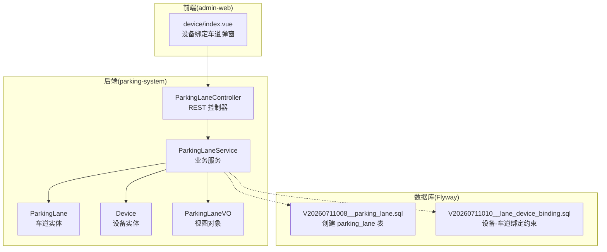
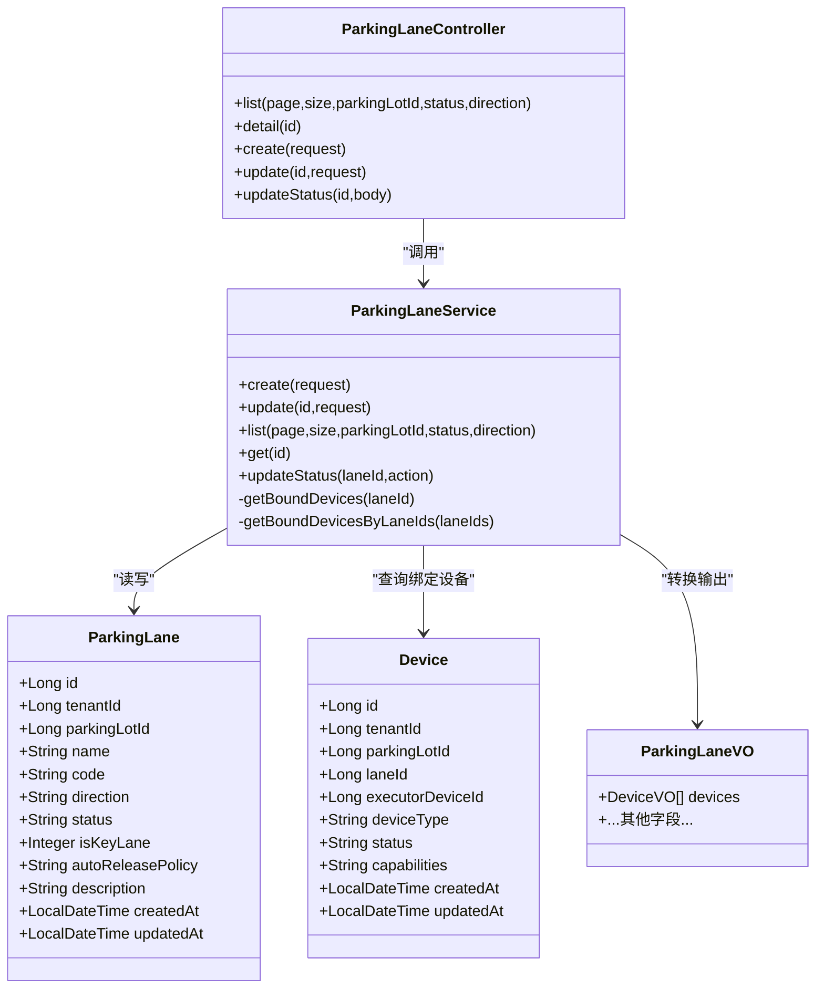
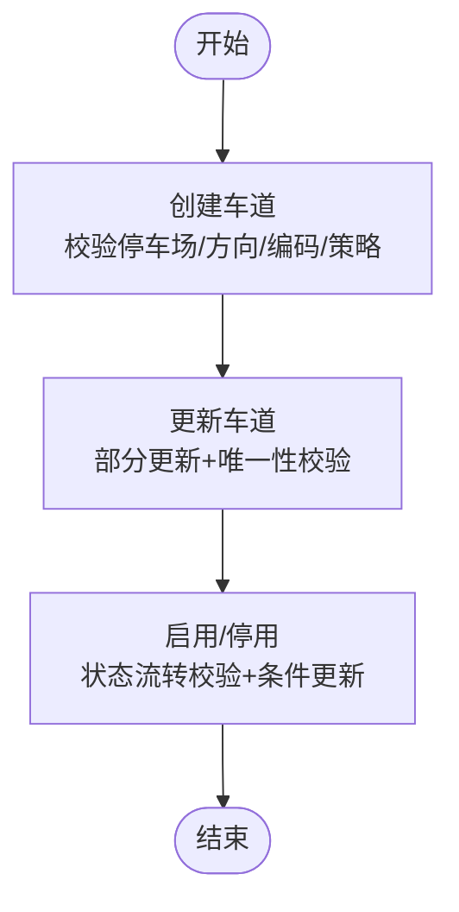
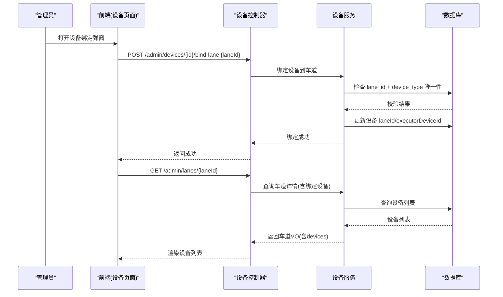
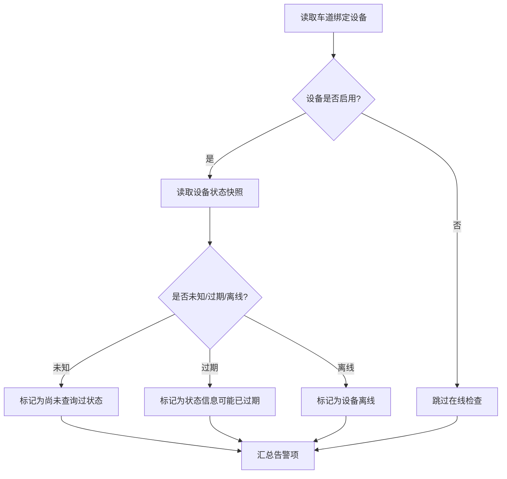
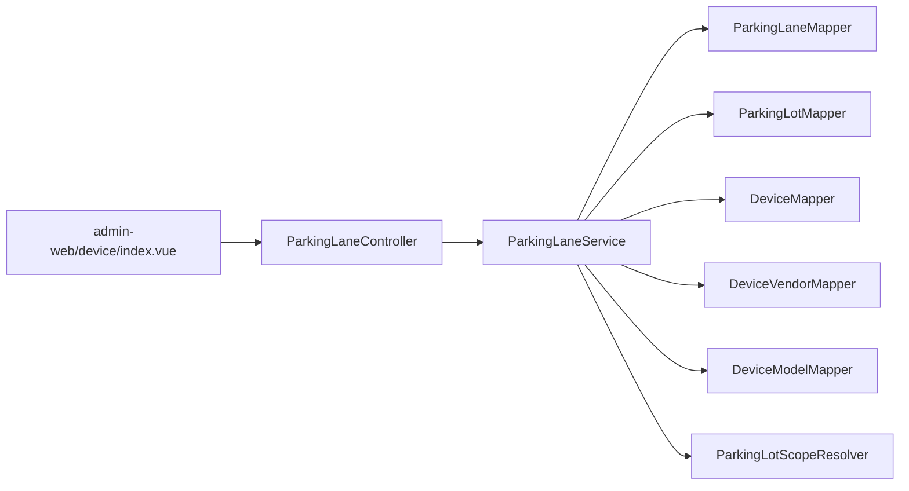

# 车道管理

<cite>
**本文引用的文件**
- [ParkingLane.java](file://parking-system/src/main/java/com/jushan/system/entity/ParkingLane.java)
- [Device.java](file://parking-system/src/main/java/com/jushan/system/entity/Device.java)
- [ParkingLaneController.java](file://parking-system/src/main/java/com/jushan/system/controller/ParkingLaneController.java)
- [ParkingLaneService.java](file://parking-system/src/main/java/com/jushan/system/service/ParkingLaneService.java)
- [ParkingLaneVO.java](file://parking-system/src/main/java/com/jushan/system/vo/ParkingLaneVO.java)
- [V20260711008__parking_lane.sql](file://parking-boot/src/main/resources/db/migration/V20260711008__parking_lane.sql)
- [V20260711010__lane_device_binding.sql](file://parking-boot/src/main/resources/db/migration/V20260711010__lane_device_binding.sql)
- [LaneDeviceBindingIntegrationTest.java](file://parking-boot/src/test/java/com/jushan/boot/controller/LaneDeviceBindingIntegrationTest.java)
- [ReadinessCheckService.java](file://parking-system/src/main/java/com/jushan/system/service/ReadinessCheckService.java)
- [DeviceController.java](file://parking-system/src/main/java/com/jushan/system/controller/DeviceController.java)
- [index.vue](file://admin-web/src/views/device/index.vue)
</cite>

## 目录
1. [简介](#简介)
2. [项目结构](#项目结构)
3. [核心组件](#核心组件)
4. [架构总览](#架构总览)
5. [详细组件分析](#详细组件分析)
6. [依赖关系分析](#依赖关系分析)
7. [性能考虑](#性能考虑)
8. [故障排查指南](#故障排查指南)
9. [结论](#结论)
10. [附录：API 规范与集成示例](#附录api-规范与集成示例)

## 简介
本技术文档围绕“车道管理”能力，系统化阐述车道实体模型、生命周期管理、设备绑定机制、状态监控与恢复流程、与停车场管理的关联关系，以及关键业务规则的实现方式。同时提供完整的 API 接口规范与前端集成要点，帮助读者快速理解并正确集成车道管理能力。

## 项目结构
车道管理相关代码主要分布在 parking-system 模块（控制器、服务、实体、视图对象）与 parking-boot 模块的数据库迁移脚本中；前端在 admin-web 提供设备绑定车道的交互入口。

图表来源
- [ParkingLaneController.java:1-122](file://parking-system/src/main/java/com/jushan/system/controller/ParkingLaneController.java#L1-L122)
- [ParkingLaneService.java:1-443](file://parking-system/src/main/java/com/jushan/system/service/ParkingLaneService.java#L1-L443)
- [ParkingLane.java:1-93](file://parking-system/src/main/java/com/jushan/system/entity/ParkingLane.java#L1-L93)
- [Device.java:1-134](file://parking-system/src/main/java/com/jushan/system/entity/Device.java#L1-L134)
- [ParkingLaneVO.java:1-66](file://parking-system/src/main/java/com/jushan/system/vo/ParkingLaneVO.java#L1-L66)
- [V20260711008__parking_lane.sql:1-29](file://parking-boot/src/main/resources/db/migration/V20260711008__parking_lane.sql#L1-L29)
- [V20260711010__lane_device_binding.sql:1-29](file://parking-boot/src/main/resources/db/migration/V20260711010__lane_device_binding.sql#L1-L29)
- [index.vue:110-125](file://admin-web/src/views/device/index.vue#L110-L125)

章节来源
- [ParkingLaneController.java:1-122](file://parking-system/src/main/java/com/jushan/system/controller/ParkingLaneController.java#L1-L122)
- [ParkingLaneService.java:1-443](file://parking-system/src/main/java/com/jushan/system/service/ParkingLaneService.java#L1-L443)
- [ParkingLane.java:1-93](file://parking-system/src/main/java/com/jushan/system/entity/ParkingLane.java#L1-L93)
- [Device.java:1-134](file://parking-system/src/main/java/com/jushan/system/entity/Device.java#L1-L134)
- [ParkingLaneVO.java:1-66](file://parking-system/src/main/java/com/jushan/system/vo/ParkingLaneVO.java#L1-L66)
- [V20260711008__parking_lane.sql:1-29](file://parking-boot/src/main/resources/db/migration/V20260711008__parking_lane.sql#L1-L29)
- [V20260711010__lane_device_binding.sql:1-29](file://parking-boot/src/main/resources/db/migration/V20260711010__lane_device_binding.sql#L1-L29)
- [index.vue:110-125](file://admin-web/src/views/device/index.vue#L110-L125)

## 核心组件
- 车道实体 ParkingLane：定义车道编号、方向、状态、是否关键车道、自动放行策略等字段，并通过唯一索引保证同一停车场内编码唯一。
- 设备实体 Device：通过 laneId 与车道建立绑定关系；支持 executorDeviceId 用于逻辑道闸指向实际执行相机。
- 控制器 ParkingLaneController：暴露车道 CRUD、分页查询、详情、启用/停用等 REST 接口，并进行权限校验。
- 服务层 ParkingLaneService：实现车道创建、更新、查询、状态变更、设备绑定查询等核心业务逻辑，包含数据隔离与一致性校验。
- 视图对象 ParkingLaneVO：对外返回的车道信息，包含绑定的设备列表。

章节来源
- [ParkingLane.java:1-93](file://parking-system/src/main/java/com/jushan/system/entity/ParkingLane.java#L1-L93)
- [Device.java:1-134](file://parking-system/src/main/java/com/jushan/system/entity/Device.java#L1-L134)
- [ParkingLaneController.java:1-122](file://parking-system/src/main/java/com/jushan/system/controller/ParkingLaneController.java#L1-L122)
- [ParkingLaneService.java:1-443](file://parking-system/src/main/java/com/jushan/system/service/ParkingLaneService.java#L1-L443)
- [ParkingLaneVO.java:1-66](file://parking-system/src/main/java/com/jushan/system/vo/ParkingLaneVO.java#L1-L66)

## 架构总览
车道管理采用典型的分层架构：控制器负责请求接入与权限校验，服务层承载业务规则与事务控制，持久化层通过 MyBatis Plus 访问数据库。设备绑定通过设备实体的 laneId 字段实现，并在数据库层施加唯一约束防止同车道重复绑定同类型设备。

图表来源
- [ParkingLane.java:1-93](file://parking-system/src/main/java/com/jushan/system/entity/ParkingLane.java#L1-L93)
- [Device.java:1-134](file://parking-system/src/main/java/com/jushan/system/entity/Device.java#L1-L134)
- [ParkingLaneController.java:1-122](file://parking-system/src/main/java/com/jushan/system/controller/ParkingLaneController.java#L1-L122)
- [ParkingLaneService.java:1-443](file://parking-system/src/main/java/com/jushan/system/service/ParkingLaneService.java#L1-L443)
- [ParkingLaneVO.java:1-66](file://parking-system/src/main/java/com/jushan/system/vo/ParkingLaneVO.java#L1-L66)

## 详细组件分析

### 实体与数据模型
- 车道实体字段说明
  - 编号与归属：id、tenantId、parkingLotId
  - 标识与描述：name、code（停车场内唯一）、description
  - 方向与状态：direction（ENTRY/EXIT/MIXED）、status（ENABLED/DISABLED）
  - 关键性与策略：isKeyLane（是否关键车道）、autoReleasePolicy（AUTO/MANUAL/AFTER_PAY）
  - 时间戳：createdAt、updatedAt
- 设备实体字段说明
  - 绑定关系：laneId（设备所属车道）
  - 执行设备：executorDeviceId（GATE 指向实际控制开闸的 CAMERA）
  - 基础信息：vendorId、modelId、name、code、deviceSn、deviceType、capabilities、status
- 数据库约束
  - parking_lane.parking_lot_id + code 唯一索引，确保同一停车场内车道编码唯一
  - device.lane_id + device_type 唯一索引，确保同一车道每种设备类型最多一台
  - device.executor_device_id 索引，便于按执行设备反向查询

章节来源
- [ParkingLane.java:1-93](file://parking-system/src/main/java/com/jushan/system/entity/ParkingLane.java#L1-L93)
- [Device.java:1-134](file://parking-system/src/main/java/com/jushan/system/entity/Device.java#L1-L134)
- [V20260711008__parking_lane.sql:1-29](file://parking-boot/src/main/resources/db/migration/V20260711008__parking_lane.sql#L1-L29)
- [V20260711010__lane_device_binding.sql:1-29](file://parking-boot/src/main/resources/db/migration/V20260711010__lane_device_binding.sql#L1-L29)

### 生命周期管理（创建、配置、启用/禁用、删除）
- 创建车道
  - 校验停车场归属与租户隔离
  - 校验方向合法性（ENTRY/EXIT/MIXED）
  - 校验车道编码在停车场内唯一
  - 校验自动放行策略（AUTO/MANUAL/AFTER_PAY）
  - 写入默认状态 ENABLED 与默认策略 MANUAL
- 更新车道
  - 支持部分更新：名称、编码（含唯一性校验）、方向、是否关键车道、自动放行策略、备注
  - 使用条件更新避免并发覆盖
- 启用/停用车道
  - 仅允许在 ENABLED 与 DISABLED 之间切换
  - 使用乐观锁式条件更新，若状态已变更则拒绝操作
- 删除车道
  - 当前未提供显式删除接口；如需删除需结合业务扩展或软删除策略

图表来源
- [ParkingLaneService.java:98-231](file://parking-system/src/main/java/com/jushan/system/service/ParkingLaneService.java#L98-L231)
- [ParkingLaneService.java:291-331](file://parking-system/src/main/java/com/jushan/system/service/ParkingLaneService.java#L291-L331)

章节来源
- [ParkingLaneService.java:98-231](file://parking-system/src/main/java/com/jushan/system/service/ParkingLaneService.java#L98-L231)
- [ParkingLaneService.java:291-331](file://parking-system/src/main/java/com/jushan/system/service/ParkingLaneService.java#L291-L331)

### 设备绑定机制（分配策略、冲突检测、状态同步）
- 绑定关系
  - 设备通过 laneId 与车道建立绑定
  - 同一车道每种设备类型最多一台（数据库唯一约束）
  - GATE 设备可通过 executorDeviceId 指向实际执行开闸的 CAMERA
- 冲突检测
  - 应用层与服务层共同保障：创建/更新时进行唯一性校验；数据库层通过唯一索引兜底
  - 跨停车场绑定被拒绝（测试用例验证）
- 状态同步
  - 设备在线状态基于最新快照判断，离线/未知状态会触发告警项
  - 设备校时可由运维触发，记录审计日志

图表来源
- [LaneDeviceBindingIntegrationTest.java:99-248](file://parking-boot/src/test/java/com/jushan/boot/controller/LaneDeviceBindingIntegrationTest.java#L99-L248)
- [V20260711010__lane_device_binding.sql:1-29](file://parking-boot/src/main/resources/db/migration/V20260711010__lane_device_binding.sql#L1-L29)
- [ParkingLaneService.java:391-441](file://parking-system/src/main/java/com/jushan/system/service/ParkingLaneService.java#L391-L441)
- [DeviceController.java:213-236](file://parking-system/src/main/java/com/jushan/system/controller/DeviceController.java#L213-L236)

章节来源
- [LaneDeviceBindingIntegrationTest.java:99-248](file://parking-boot/src/test/java/com/jushan/boot/controller/LaneDeviceBindingIntegrationTest.java#L99-L248)
- [V20260711010__lane_device_binding.sql:1-29](file://parking-boot/src/main/resources/db/migration/V20260711010__lane_device_binding.sql#L1-L29)
- [ParkingLaneService.java:391-441](file://parking-system/src/main/java/com/jushan/system/service/ParkingLaneService.java#L391-L441)
- [DeviceController.java:213-236](file://parking-system/src/main/java/com/jushan/system/controller/DeviceController.java#L213-L236)

### 状态管理机制（在线/离线监控、故障处理与恢复）
- 在线状态检查
  - 基于设备最新状态快照判断：从未查询过→警告“尚未查询过状态”；快照过期→警告“状态信息可能已过期”；明确离线→警告“设备离线”
  - 仅对启用中的设备进行在线检查
- 故障处理与恢复
  - 对于离线设备，可触发设备校时等操作以尝试恢复通信
  - 所有校时操作均记录审计日志，便于追溯

图表来源
- [ReadinessCheckService.java:278-306](file://parking-system/src/main/java/com/jushan/system/service/ReadinessCheckService.java#L278-L306)
- [DeviceController.java:213-236](file://parking-system/src/main/java/com/jushan/system/controller/DeviceController.java#L213-L236)

章节来源
- [ReadinessCheckService.java:278-306](file://parking-system/src/main/java/com/jushan/system/service/ReadinessCheckService.java#L278-L306)
- [DeviceController.java:213-236](file://parking-system/src/main/java/com/jushan/system/controller/DeviceController.java#L213-L236)

### 与停车场管理的关联关系（数据一致性与级联操作）
- 数据一致性
  - 车道创建/更新前校验停车场存在且属于当前租户
  - 通过 DataScope 与范围解析器进行停车场级授权校验，确保数据隔离
- 级联操作
  - 当前未实现停车场删除对车道的级联删除；如需级联，应在服务层增加级联清理或软删除策略

章节来源
- [ParkingLaneService.java:333-363](file://parking-system/src/main/java/com/jushan/system/service/ParkingLaneService.java#L333-L363)

### 业务规则实现（容量控制、冲突解决、状态变更通知）
- 容量控制
  - 当前车道实体未定义容量字段；容量控制通常由停车场维度管理，不在车道层实现
- 冲突解决
  - 同车道同类型设备重复绑定被拒绝（应用层+数据库唯一约束双重保障）
  - 跨停车场绑定被拒绝（应用层校验）
- 状态变更通知
  - 当前未实现主动推送通知；可在服务层扩展事件发布机制（如 MQ 事件）以驱动前端或下游系统刷新

章节来源
- [LaneDeviceBindingIntegrationTest.java:211-248](file://parking-boot/src/test/java/com/jushan/boot/controller/LaneDeviceBindingIntegrationTest.java#L211-L248)
- [ParkingLaneService.java:108-155](file://parking-system/src/main/java/com/jushan/system/service/ParkingLaneService.java#L108-L155)

## 依赖关系分析
- 控制器依赖服务层，服务层依赖多个 Mapper（车道、停车场、设备、厂商、型号），并通过范围解析器完成授权校验
- 设备绑定涉及设备表与车道表的关联，通过唯一索引保证约束
- 前端通过 REST 接口与后端交互，设备绑定弹窗提供用户选择目标车道

图表来源
- [ParkingLaneController.java:1-122](file://parking-system/src/main/java/com/jushan/system/controller/ParkingLaneController.java#L1-L122)
- [ParkingLaneService.java:1-96](file://parking-system/src/main/java/com/jushan/system/service/ParkingLaneService.java#L1-L96)
- [index.vue:110-125](file://admin-web/src/views/device/index.vue#L110-L125)

章节来源
- [ParkingLaneController.java:1-122](file://parking-system/src/main/java/com/jushan/system/controller/ParkingLaneController.java#L1-L122)
- [ParkingLaneService.java:1-96](file://parking-system/src/main/java/com/jushan/system/service/ParkingLaneService.java#L1-L96)
- [index.vue:110-125](file://admin-web/src/views/device/index.vue#L110-L125)

## 性能考虑
- 批量查询优化：车道列表查询后批量加载绑定设备并按 laneId 分组，减少 N+1 查询
- 索引设计：
  - parking_lane.parking_lot_id + code 唯一索引提升编码唯一性校验效率
  - device.lane_id + device_type 唯一索引保障绑定冲突检测性能
  - device.executor_device_id 索引加速执行设备反向查询
- 条件更新：启用/停用使用条件更新避免并发覆盖，降低重试与冲突概率

章节来源
- [ParkingLaneService.java:248-276](file://parking-system/src/main/java/com/jushan/system/service/ParkingLaneService.java#L248-L276)
- [V20260711008__parking_lane.sql:1-29](file://parking-boot/src/main/resources/db/migration/V20260711008__parking_lane.sql#L1-L29)
- [V20260711010__lane_device_binding.sql:1-29](file://parking-boot/src/main/resources/db/migration/V20260711010__lane_device_binding.sql#L1-L29)

## 故障排查指南
- 常见错误
  - 无效的操作类型：启用/停用 action 必须为 ENABLED 或 DISABLED
  - 车道已是某状态：不允许重复启用/停用
  - 车道编码重复：同一停车场内编码必须唯一
  - 同车道同类型设备重复绑定：数据库唯一约束与应用层校验共同拒绝
  - 跨停车场绑定：应用层拒绝
- 定位方法
  - 查看控制器日志与服务层日志，确认参数与上下文
  - 检查数据库唯一索引冲突
  - 使用设备在线状态检查接口获取告警项，定位离线或未知状态设备

章节来源
- [ParkingLaneService.java:301-331](file://parking-system/src/main/java/com/jushan/system/service/ParkingLaneService.java#L301-L331)
- [LaneDeviceBindingIntegrationTest.java:211-248](file://parking-boot/src/test/java/com/jushan/boot/controller/LaneDeviceBindingIntegrationTest.java#L211-L248)

## 结论
车道管理模块通过清晰的实体模型、严格的约束与校验、完善的权限与数据隔离机制，提供了稳定可靠的车道生命周期管理与设备绑定能力。结合设备在线状态检查与审计日志，可实现良好的可观测性与可维护性。后续可在状态变更通知、容量控制等方面进一步扩展。

## 附录：API 规范与集成示例

### 车道管理接口
- 分页查询车道列表
  - 方法：GET
  - 路径：/admin/lanes
  - 参数：page、size、parkingLotId（必填）、status（可选）、direction（可选）
  - 权限：parking:read
- 查询车道详情
  - 方法：GET
  - 路径：/admin/lanes/{id}
  - 权限：parking:read
- 创建车道
  - 方法：POST
  - 路径：/admin/lanes
  - 请求体：CreateLaneRequest（包含 parkingLotId、name、code、direction、autoReleasePolicy、isKeyLane、description）
  - 权限：parking:write
- 更新车道
  - 方法：PUT
  - 路径：/admin/lanes/{id}
  - 请求体：UpdateLaneRequest（仅非空字段参与更新）
  - 权限：parking:write
- 启用/停用车道
  - 方法：POST
  - 路径：/admin/lanes/{id}/status
  - 请求体：{ "action": "ENABLED" | "DISABLED" }
  - 权限：parking:write

章节来源
- [ParkingLaneController.java:44-121](file://parking-system/src/main/java/com/jushan/system/controller/ParkingLaneController.java#L44-L121)

### 设备绑定接口（与车道联动）
- 设备绑定车道
  - 方法：POST
  - 路径：/admin/devices/{deviceId}/bind-lane
  - 请求体：{ "laneId": 目标车道ID }
  - 行为：校验同车道同类型唯一、跨停车场禁止；成功后设备 laneId 更新
- 解绑设备（前端提供按钮，具体接口见设备管理模块）
- 查询车道详情（含绑定设备）
  - 方法：GET
  - 路径：/admin/lanes/{id}
  - 响应：ParkingLaneVO，包含 devices 列表

章节来源
- [LaneDeviceBindingIntegrationTest.java:99-248](file://parking-boot/src/test/java/com/jushan/boot/controller/LaneDeviceBindingIntegrationTest.java#L99-L248)
- [ParkingLaneService.java:278-289](file://parking-system/src/main/java/com/jushan/system/service/ParkingLaneService.java#L278-L289)

### 前端集成要点
- 设备绑定弹窗
  - 展示目标车道列表，显示方向（入口/出口/混合）
  - 支持显示当前绑定状态并提供解绑操作
- 数据回显
  - 绑定成功后，刷新车道详情以显示新绑定的设备列表

章节来源
- [index.vue:110-125](file://admin-web/src/views/device/index.vue#L110-L125)