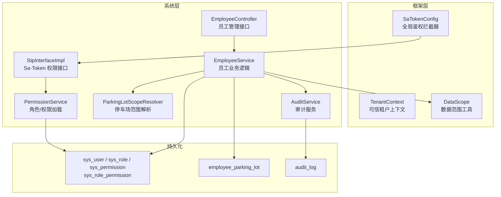
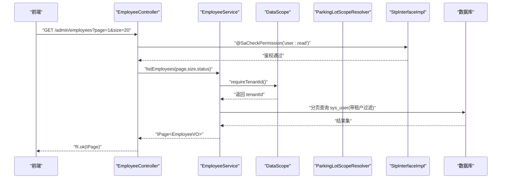
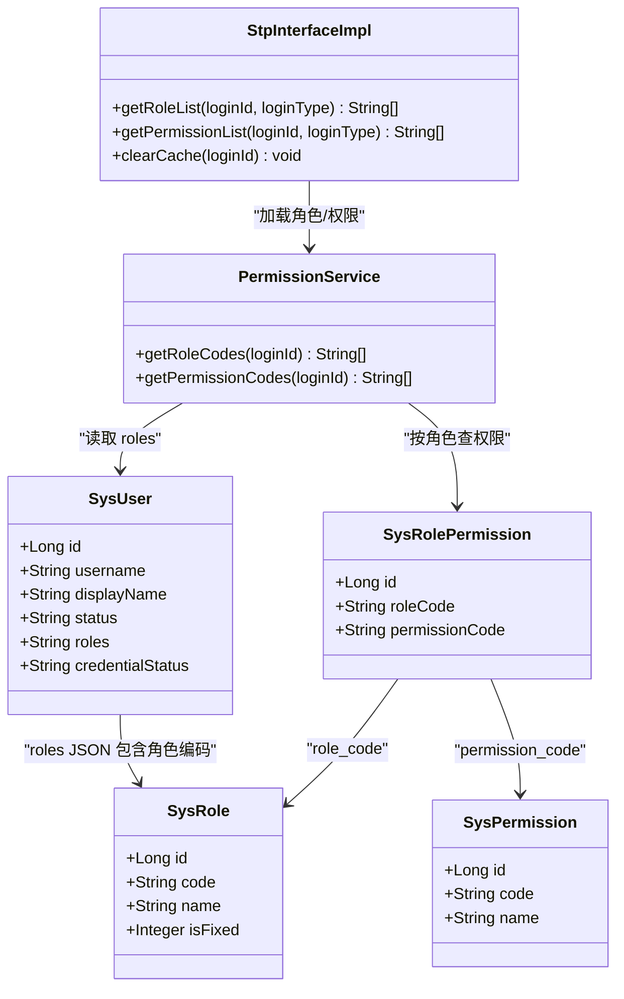
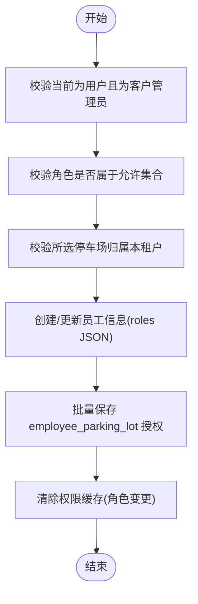
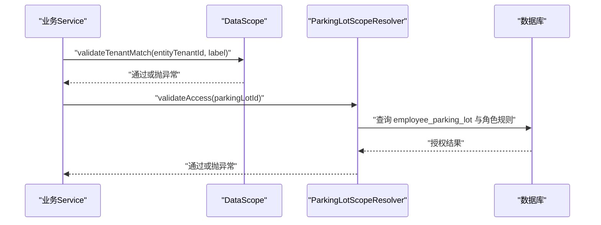
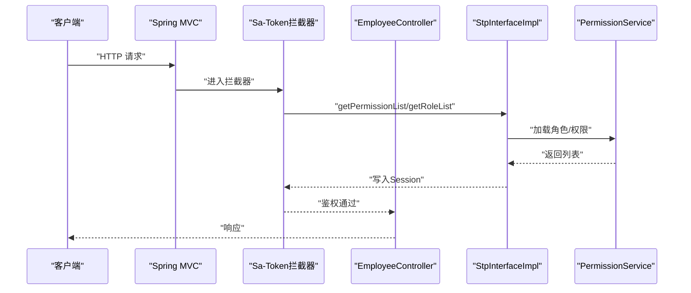
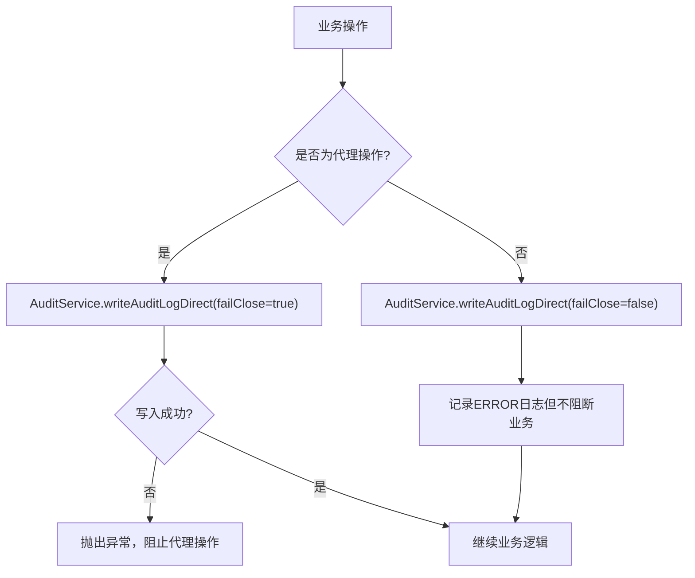
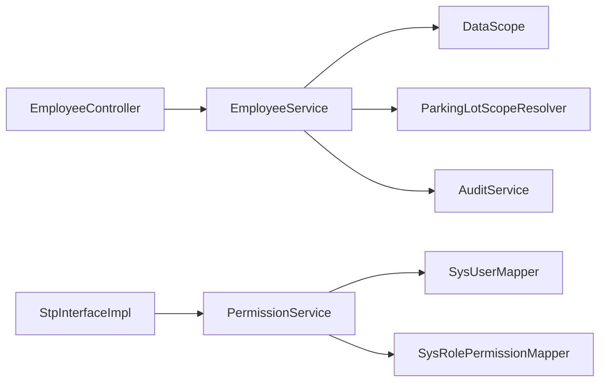

# 员工权限模块

<cite>
**本文引用的文件**   
- [SysUser.java](file://parking-system/src/main/java/com/jushan/system/entity/SysUser.java)
- [SysRole.java](file://parking-system/src/main/java/com/jushan/system/entity/SysRole.java)
- [SysPermission.java](file://parking-system/src/main/java/com/jushan/system/entity/SysPermission.java)
- [SysRolePermission.java](file://parking-system/src/main/java/com/jushan/system/entity/SysRolePermission.java)
- [SysRolePermissionMapper.java](file://parking-system/src/main/java/com/jushan/system/mapper/SysRolePermissionMapper.java)
- [V20260711003__sys_role_permission.sql](file://parking-boot/src/main/resources/db/migration/V20260711003__sys_role_permission.sql)
- [PermissionService.java](file://parking-system/src/main/java/com/jushan/system/service/PermissionService.java)
- [StpInterfaceImpl.java](file://parking-system/src/main/java/com/jushan/system/service/StpInterfaceImpl.java)
- [SaTokenConfig.java](file://parking-framework/src/main/java/com/jushan/framework/auth/SaTokenConfig.java)
- [TenantContext.java](file://parking-framework/src/main/java/com/jushan/framework/auth/TenantContext.java)
- [DataScope.java](file://parking-framework/src/main/java/com/jushan/framework/auth/DataScope.java)
- [EmployeeController.java](file://parking-system/src/main/java/com/jushan/system/controller/EmployeeController.java)
- [EmployeeService.java](file://parking-system/src/main/java/com/jushan/system/service/EmployeeService.java)
- [EmployeeParkingLot.java](file://parking-system/src/main/java/com/jushan/system/entity/EmployeeParkingLot.java)
- [ParkingLotScopeResolver.java](file://parking-system/src/main/java/com/jushan/system/service/ParkingLotScopeResolver.java)
- [ReadinessCheckService.java](file://parking-system/src/main/java/com/jushan/system/service/ReadinessCheckService.java)
- [PermissionTestController.java](file://parking-system/src/main/java/com/jushan/system/controller/PermissionTestController.java)
- [AuditService.java](file://parking-system/src/main/java/com/jushan/system/service/AuditService.java)
- [V20260711006__audit_log.sql](file://parking-boot/src/main/resources/db/migration/V20260711006__audit_log.sql)
</cite>

## 目录
1. [引言](#引言)
2. [项目结构](#项目结构)
3. [核心组件](#核心组件)
4. [架构总览](#架构总览)
5. [详细组件分析](#详细组件分析)
6. [依赖关系分析](#依赖关系分析)
7. [性能与缓存策略](#性能与缓存策略)
8. [故障排查指南](#故障排查指南)
9. [结论](#结论)
10. [附录](#附录)

## 引言
本技术文档聚焦“员工权限模块”，围绕以下目标展开：
- 员工信息管理：创建、更新、查询、状态控制、密码重置等。
- RBAC 权限模型：用户-角色-权限的多对多关系设计与实现，注解式鉴权与拦截器集成。
- 数据范围控制：租户隔离与停车场级授权，按停车场/区域的数据隔离策略。
- 岗位分配与动态调整：固定角色集、权限继承与即时生效机制。
- 审计与合规：权限变更审计、操作日志记录与安全要求。
- 性能优化：缓存策略与大用户量场景处理方案。

## 项目结构
该模块由框架层（认证与上下文）、系统层（RBAC、员工管理、数据范围解析）与数据库迁移脚本组成，前后端通过 REST API 交互，前端使用路由与菜单权限配合后端注解式鉴权。

图表来源
- [SaTokenConfig.java:1-36](file://parking-framework/src/main/java/com/jushan/framework/auth/SaTokenConfig.java#L1-L36)
- [TenantContext.java:1-257](file://parking-framework/src/main/java/com/jushan/framework/auth/TenantContext.java#L1-L257)
- [DataScope.java:1-240](file://parking-framework/src/main/java/com/jushan/framework/auth/DataScope.java#L1-L240)
- [EmployeeController.java:1-122](file://parking-system/src/main/java/com/jushan/system/controller/EmployeeController.java#L1-L122)
- [EmployeeService.java:1-445](file://parking-system/src/main/java/com/jushan/system/service/EmployeeService.java#L1-L445)
- [PermissionService.java:1-105](file://parking-system/src/main/java/com/jushan/system/service/PermissionService.java#L1-L105)
- [StpInterfaceImpl.java:1-107](file://parking-system/src/main/java/com/jushan/system/service/StpInterfaceImpl.java#L1-L107)
- [ParkingLotScopeResolver.java:15-47](file://parking-system/src/main/java/com/jushan/system/service/ParkingLotScopeResolver.java#L15-L47)
- [AuditService.java:249-266](file://parking-system/src/main/java/com/jushan/system/service/AuditService.java#L249-L266)

章节来源
- [SaTokenConfig.java:1-36](file://parking-framework/src/main/java/com/jushan/framework/auth/SaTokenConfig.java#L1-L36)
- [TenantContext.java:1-257](file://parking-framework/src/main/java/com/jushan/framework/auth/TenantContext.java#L1-L257)
- [DataScope.java:1-240](file://parking-framework/src/main/java/com/jushan/framework/auth/DataScope.java#L1-L240)
- [EmployeeController.java:1-122](file://parking-system/src/main/java/com/jushan/system/controller/EmployeeController.java#L1-L122)
- [EmployeeService.java:1-445](file://parking-system/src/main/java/com/jushan/system/service/EmployeeService.java#L1-L445)
- [PermissionService.java:1-105](file://parking-system/src/main/java/com/jushan/system/service/PermissionService.java#L1-L105)
- [StpInterfaceImpl.java:1-107](file://parking-system/src/main/java/com/jushan/system/service/StpInterfaceImpl.java#L1-L107)
- [ParkingLotScopeResolver.java:15-47](file://parking-system/src/main/java/com/jushan/system/service/ParkingLotScopeResolver.java#L15-L47)
- [AuditService.java:249-266](file://parking-system/src/main/java/com/jushan/system/service/AuditService.java#L249-L266)

## 核心组件
- 用户实体 SysUser：存储登录账号、显示名、状态、角色 JSON、凭据状态等。
- 角色实体 SysRole：固定角色为主，包含编码、名称、说明。
- 权限实体 SysPermission：以 module:action 形式定义细粒度权限。
- 角色-权限关联 SysRolePermission：维护角色到权限的映射。
- 权限服务 PermissionService：根据用户 ID 加载角色与权限列表。
- Sa-Token 集成 StpInterfaceImpl：将角色/权限写入 Session，供注解式鉴权使用。
- 全局鉴权 SaTokenConfig：注册 Sa-Token 拦截器，统一拦截未登录请求。
- 可信租户上下文 TenantContext：线程级保存租户、用户、角色等信息。
- 数据范围 DataScope：提供租户校验、角色校验、停车场归属校验等 fail-close 断言。
- 员工管理 EmployeeController/EmployeeService：员工 CRUD、状态控制、密码重置、停车场授权。
- 停车场范围解析 ParkingLotScopeResolver：集中式解析用户可访问的停车场集合。
- 审计服务 AuditService：高风险操作审计日志写入。

章节来源
- [SysUser.java:1-81](file://parking-system/src/main/java/com/jushan/system/entity/SysUser.java#L1-L81)
- [SysRole.java:1-65](file://parking-system/src/main/java/com/jushan/system/entity/SysRole.java#L1-L65)
- [SysPermission.java:1-54](file://parking-system/src/main/java/com/jushan/system/entity/SysPermission.java#L1-L54)
- [SysRolePermission.java:1-45](file://parking-system/src/main/java/com/jushan/system/entity/SysRolePermission.java#L1-L45)
- [PermissionService.java:1-105](file://parking-system/src/main/java/com/jushan/system/service/PermissionService.java#L1-L105)
- [StpInterfaceImpl.java:1-107](file://parking-system/src/main/java/com/jushan/system/service/StpInterfaceImpl.java#L1-L107)
- [SaTokenConfig.java:1-36](file://parking-framework/src/main/java/com/jushan/framework/auth/SaTokenConfig.java#L1-L36)
- [TenantContext.java:1-257](file://parking-framework/src/main/java/com/jushan/framework/auth/TenantContext.java#L1-L257)
- [DataScope.java:1-240](file://parking-framework/src/main/java/com/jushan/framework/auth/DataScope.java#L1-L240)
- [EmployeeController.java:1-122](file://parking-system/src/main/java/com/jushan/system/controller/EmployeeController.java#L1-L122)
- [EmployeeService.java:1-445](file://parking-system/src/main/java/com/jushan/system/service/EmployeeService.java#L1-L445)
- [ParkingLotScopeResolver.java:15-47](file://parking-system/src/main/java/com/jushan/system/service/ParkingLotScopeResolver.java#L15-L47)
- [AuditService.java:249-266](file://parking-system/src/main/java/com/jushan/system/service/AuditService.java#L249-L266)

## 架构总览
RBAC 与数据范围控制的端到端流程如下：
- 登录阶段：AuthService 完成认证后，将租户、用户类型、角色写入 Sa-Token Session。
- 鉴权阶段：Sa-Token 拦截器触发 StpInterfaceImpl，从 Session 或数据库加载角色与权限。
- 业务阶段：Controller 使用 @SaCheckPermission 进行注解式鉴权；Service 使用 DataScope 进行租户与停车场范围校验；ParkingLotScopeResolver 作为唯一权威来源解析停车场范围。
- 审计阶段：关键操作通过 AuditService 写入审计日志表。

图表来源
- [EmployeeController.java:46-53](file://parking-system/src/main/java/com/jushan/system/controller/EmployeeController.java#L46-L53)
- [EmployeeService.java:231-243](file://parking-system/src/main/java/com/jushan/system/service/EmployeeService.java#L231-L243)
- [DataScope.java:138-151](file://parking-framework/src/main/java/com/jushan/framework/auth/DataScope.java#L138-L151)
- [StpInterfaceImpl.java:43-66](file://parking-system/src/main/java/com/jushan/system/service/StpInterfaceImpl.java#L43-L66)

## 详细组件分析

### RBAC 权限模型与多对多设计
- 实体关系
  - 用户 SysUser 通过 roles JSON 字段持有角色编码数组。
  - 角色 SysRole 与权限 SysPermission 通过角色-权限关联表 sys_role_permission 建立多对多关系。
- 权限加载路径
  - PermissionService.getRoleCodes：从用户 roles JSON 解析角色列表。
  - PermissionService.getPermissionCodes：基于角色列表查询 sys_role_permission 得到权限编码集合。
  - StpInterfaceImpl：首次加载时写入 Sa-Token Session，后续从 Session 读取，避免重复查库。
- 注解式鉴权
  - Controller 方法使用 @SaCheckPermission("user:read"/"user:write") 进行权限校验。
  - 测试控制器暴露 /test/permission/* 用于验证不同权限等级。

图表来源
- [SysUser.java:1-81](file://parking-system/src/main/java/com/jushan/system/entity/SysUser.java#L1-L81)
- [SysRole.java:1-65](file://parking-system/src/main/java/com/jushan/system/entity/SysRole.java#L1-L65)
- [SysPermission.java:1-54](file://parking-system/src/main/java/com/jushan/system/entity/SysPermission.java#L1-L54)
- [SysRolePermission.java:1-45](file://parking-system/src/main/java/com/jushan/system/entity/SysRolePermission.java#L1-L45)
- [PermissionService.java:1-105](file://parking-system/src/main/java/com/jushan/system/service/PermissionService.java#L1-L105)
- [StpInterfaceImpl.java:1-107](file://parking-system/src/main/java/com/jushan/system/service/StpInterfaceImpl.java#L1-L107)
- [V20260711003__sys_role_permission.sql:24-49](file://parking-boot/src/main/resources/db/migration/V20260711003__sys_role_permission.sql#L24-L49)

章节来源
- [SysUser.java:1-81](file://parking-system/src/main/java/com/jushan/system/entity/SysUser.java#L1-L81)
- [SysRole.java:1-65](file://parking-system/src/main/java/com/jushan/system/entity/SysRole.java#L1-L65)
- [SysPermission.java:1-54](file://parking-system/src/main/java/com/jushan/system/entity/SysPermission.java#L1-L54)
- [SysRolePermission.java:1-45](file://parking-system/src/main/java/com/jushan/system/entity/SysRolePermission.java#L1-L45)
- [SysRolePermissionMapper.java:1-34](file://parking-system/src/main/java/com/jushan/system/mapper/SysRolePermissionMapper.java#L1-L34)
- [PermissionService.java:1-105](file://parking-system/src/main/java/com/jushan/system/service/PermissionService.java#L1-L105)
- [StpInterfaceImpl.java:1-107](file://parking-system/src/main/java/com/jushan/system/service/StpInterfaceImpl.java#L1-L107)
- [V20260711003__sys_role_permission.sql:24-49](file://parking-boot/src/main/resources/db/migration/V20260711003__sys_role_permission.sql#L24-L49)

### 员工信息管理（岗位分配与权限继承）
- 岗位分配
  - 仅允许固定角色集合：parking_manager、finance、device_maintenance、booth_operator。
  - 创建/更新员工时，将角色编码写入用户 roles JSON，并批量保存 employee_parking_lot 授权记录。
- 权限继承
  - 角色变更后，调用 StpInterfaceImpl.clearCache 清除 Session 中的角色/权限缓存，使新权限立即生效。
- 密码重置与会话撤销
  - 重置密码后主动调用 StpUtil.logout 撤销旧会话，防止旧密码继续使用。
- 状态控制
  - 启用/禁用采用条件更新防止并发覆盖；禁用后主动撤销会话与权限缓存。

图表来源
- [EmployeeService.java:90-157](file://parking-system/src/main/java/com/jushan/system/service/EmployeeService.java#L90-L157)
- [EmployeeService.java:166-224](file://parking-system/src/main/java/com/jushan/system/service/EmployeeService.java#L166-L224)
- [EmployeeService.java:261-282](file://parking-system/src/main/java/com/jushan/system/service/EmployeeService.java#L261-L282)
- [EmployeeService.java:291-346](file://parking-system/src/main/java/com/jushan/system/service/EmployeeService.java#L291-L346)
- [EmployeeParkingLot.java:1-52](file://parking-system/src/main/java/com/jushan/system/entity/EmployeeParkingLot.java#L1-L52)

章节来源
- [EmployeeController.java:1-122](file://parking-system/src/main/java/com/jushan/system/controller/EmployeeController.java#L1-L122)
- [EmployeeService.java:1-445](file://parking-system/src/main/java/com/jushan/system/service/EmployeeService.java#L1-L445)
- [EmployeeParkingLot.java:1-52](file://parking-system/src/main/java/com/jushan/system/entity/EmployeeParkingLot.java#L1-L52)

### 数据范围控制（租户隔离与停车场授权）
- 租户隔离
  - TenantContext 在请求开始时填充租户、用户、角色等信息；DataScope.validateTenantMatch/validateTenantAccess 确保资源属于当前租户。
- 停车场级数据范围
  - ParkingLotScopeResolver 作为唯一权威来源，根据用户角色与 employee_parking_lot 授权解析可访问停车场集合。
  - 业务 Service 在访问具体停车场前调用 scopeResolver.validateAccess(lotId) 进行 P0 安全校验。
- 失败关闭原则
  - 所有范围校验遵循 fail-close：非法范围直接抛出异常，不返回空集合或静默通过。

图表来源
- [DataScope.java:45-80](file://parking-framework/src/main/java/com/jushan/framework/auth/DataScope.java#L45-L80)
- [ParkingLotScopeResolver.java:15-47](file://parking-system/src/main/java/com/jushan/system/service/ParkingLotScopeResolver.java#L15-L47)
- [ReadinessCheckService.java:363-378](file://parking-system/src/main/java/com/jushan/system/service/ReadinessCheckService.java#L363-L378)

章节来源
- [TenantContext.java:1-257](file://parking-framework/src/main/java/com/jushan/framework/auth/TenantContext.java#L1-L257)
- [DataScope.java:1-240](file://parking-framework/src/main/java/com/jushan/framework/auth/DataScope.java#L1-L240)
- [ParkingLotScopeResolver.java:15-47](file://parking-system/src/main/java/com/jushan/system/service/ParkingLotScopeResolver.java#L15-L47)
- [ReadinessCheckService.java:363-378](file://parking-system/src/main/java/com/jushan/system/service/ReadinessCheckService.java#L363-L378)

### 权限验证拦截器与注解式控制
- 全局拦截器
  - SaTokenConfig 注册 Sa-Token 拦截器，除公开路径外所有请求要求登录。
- 注解式鉴权
  - 员工管理接口使用 @SaCheckPermission("user:read"/"user:write") 进行权限控制。
  - 测试控制器暴露多种权限级别端点，便于集成测试。
- 权限加载
  - StpInterfaceImpl 优先从 Session 读取角色/权限，未命中则从数据库加载并回写 Session。

图表来源
- [SaTokenConfig.java:1-36](file://parking-framework/src/main/java/com/jushan/framework/auth/SaTokenConfig.java#L1-L36)
- [EmployeeController.java:46-53](file://parking-system/src/main/java/com/jushan/system/controller/EmployeeController.java#L46-L53)
- [PermissionTestController.java:1-128](file://parking-system/src/main/java/com/jushan/system/controller/PermissionTestController.java#L1-L128)
- [StpInterfaceImpl.java:43-91](file://parking-system/src/main/java/com/jushan/system/service/StpInterfaceImpl.java#L43-L91)
- [PermissionService.java:44-70](file://parking-system/src/main/java/com/jushan/system/service/PermissionService.java#L44-L70)

章节来源
- [SaTokenConfig.java:1-36](file://parking-framework/src/main/java/com/jushan/framework/auth/SaTokenConfig.java#L1-L36)
- [EmployeeController.java:1-122](file://parking-system/src/main/java/com/jushan/system/controller/EmployeeController.java#L1-L122)
- [PermissionTestController.java:1-128](file://parking-system/src/main/java/com/jushan/system/controller/PermissionTestController.java#L1-L128)
- [StpInterfaceImpl.java:1-107](file://parking-system/src/main/java/com/jushan/system/service/StpInterfaceImpl.java#L1-L107)
- [PermissionService.java:1-105](file://parking-system/src/main/java/com/jushan/system/service/PermissionService.java#L1-L105)

### 前端菜单权限控制集成方式
- 后端提供权限列表接口（如 /test/permission/my-permissions），前端登录后获取 roles 与 permissions。
- 前端路由与菜单根据 permissions 动态渲染，隐藏无权限的路由与按钮。
- 建议在前端增加二次校验：在点击敏感操作前再次检查权限，结合后端注解式鉴权形成双重保障。

[本节为概念性内容，无需代码来源]

### 权限变更审计与操作日志记录
- 审计服务
  - AuditService.writeAuditLogDirect 支持代理操作的 fail-close 策略：若审计写入失败，代理操作不允许继续执行。
- 审计日志表
  - audit_log 表记录操作人、目标对象、操作类型、前后值、结果、原因、客户端 IP 等，并提供多维度索引。
- 合规性
  - 需求文档要求配置变更记录需记录操作人、时间、IP、变更前后值，并保留至少一年。

图表来源
- [AuditService.java:249-266](file://parking-system/src/main/java/com/jushan/system/service/AuditService.java#L249-L266)
- [V20260711006__audit_log.sql:24-36](file://parking-boot/src/main/resources/db/migration/V20260711006__audit_log.sql#L24-L36)

章节来源
- [AuditService.java:249-266](file://parking-system/src/main/java/com/jushan/system/service/AuditService.java#L249-L266)
- [V20260711006__audit_log.sql:24-36](file://parking-boot/src/main/resources/db/migration/V20260711006__audit_log.sql#L24-L36)

## 依赖关系分析
- 组件耦合
  - EmployeeController 依赖 EmployeeService；EmployeeService 依赖 DataScope、ParkingLotScopeResolver、AuditService 与各 Mapper。
  - StpInterfaceImpl 依赖 PermissionService；PermissionService 依赖 SysUserMapper 与 SysRolePermissionMapper。
- 外部依赖
  - Sa-Token 提供会话与注解式鉴权能力；Redis 用于会话存储（生产环境应保证可用）。
- 潜在循环依赖
  - 当前未发现循环依赖；各层职责清晰，框架层与系统层解耦良好。

图表来源
- [EmployeeController.java:1-122](file://parking-system/src/main/java/com/jushan/system/controller/EmployeeController.java#L1-L122)
- [EmployeeService.java:1-445](file://parking-system/src/main/java/com/jushan/system/service/EmployeeService.java#L1-L445)
- [StpInterfaceImpl.java:1-107](file://parking-system/src/main/java/com/jushan/system/service/StpInterfaceImpl.java#L1-L107)
- [PermissionService.java:1-105](file://parking-system/src/main/java/com/jushan/system/service/PermissionService.java#L1-L105)

章节来源
- [EmployeeController.java:1-122](file://parking-system/src/main/java/com/jushan/system/controller/EmployeeController.java#L1-L122)
- [EmployeeService.java:1-445](file://parking-system/src/main/java/com/jushan/system/service/EmployeeService.java#L1-L445)
- [StpInterfaceImpl.java:1-107](file://parking-system/src/main/java/com/jushan/system/service/StpInterfaceImpl.java#L1-L107)
- [PermissionService.java:1-105](file://parking-system/src/main/java/com/jushan/system/service/PermissionService.java#L1-L105)

## 性能与缓存策略
- 角色/权限缓存
  - StpInterfaceImpl 首次加载后将角色与权限写入 Sa-Token Session，后续鉴权直接从 Session 读取，显著降低数据库压力。
- 权限变更即时生效
  - 角色变更后调用 clearCache 删除 Session 中对应键，下次鉴权重新加载最新权限。
- 大用户量场景
  - 建议：
    - 确保 Redis 高可用与连接池合理配置，避免会话丢失。
    - 热点用户权限缓存命中率提升，减少跨节点同步开销。
    - 针对高频查询（如员工列表）使用分页与必要字段投影，避免全表扫描。
    - 对 parking_lot 授权查询建立合适索引，提高范围解析效率。
- 审计日志写入
  - 代理操作采用 fail-close，其他操作失败仅记录 ERROR，避免影响主业务流程。

[本节为通用指导，无需代码来源]

## 故障排查指南
- 鉴权失败
  - 检查 Sa-Token 拦截器是否注册、Session 是否有效、权限是否已正确加载。
  - 确认 @SaCheckPermission 注解与权限编码一致。
- 租户越权
  - 检查 DataScope.validateTenantMatch/validateTenantAccess 调用位置与参数。
  - 确认 TenantContext 是否正确初始化（登录成功后写入）。
- 停车场越权
  - 检查 ParkingLotScopeResolver.validateAccess 是否被调用，以及 employee_parking_lot 授权记录是否正确。
- 权限未生效
  - 确认角色变更后是否调用 clearCache；必要时强制用户重新登录。
- 审计缺失
  - 检查 AuditService 调用路径与 failClose 策略；查看错误日志与 audit_log 表。

章节来源
- [SaTokenConfig.java:1-36](file://parking-framework/src/main/java/com/jushan/framework/auth/SaTokenConfig.java#L1-L36)
- [DataScope.java:45-80](file://parking-framework/src/main/java/com/jushan/framework/auth/DataScope.java#L45-L80)
- [ParkingLotScopeResolver.java:15-47](file://parking-system/src/main/java/com/jushan/system/service/ParkingLotScopeResolver.java#L15-L47)
- [StpInterfaceImpl.java:99-105](file://parking-system/src/main/java/com/jushan/system/service/StpInterfaceImpl.java#L99-L105)
- [AuditService.java:249-266](file://parking-system/src/main/java/com/jushan/system/service/AuditService.java#L249-L266)

## 结论
本模块通过 RBAC 模型与 Sa-Token 集成实现了细粒度权限控制，结合 TenantContext 与 DataScope 提供了严格的租户与停车场级数据隔离。员工管理流程涵盖岗位分配、权限继承与动态调整，并通过审计服务满足合规要求。在生产环境中，应重视缓存策略与高可用配置，确保在大用户量场景下的性能与稳定性。

[本节为总结性内容，无需代码来源]

## 附录
- 数据库迁移参考
  - 角色-权限表结构与索引：[V20260711003__sys_role_permission.sql:24-49](file://parking-boot/src/main/resources/db/migration/V20260711003__sys_role_permission.sql#L24-L49)
  - 审计日志表结构与索引：[V20260711006__audit_log.sql:24-36](file://parking-boot/src/main/resources/db/migration/V20260711006__audit_log.sql#L24-L36)

章节来源
- [V20260711003__sys_role_permission.sql:24-49](file://parking-boot/src/main/resources/db/migration/V20260711003__sys_role_permission.sql#L24-L49)
- [V20260711006__audit_log.sql:24-36](file://parking-boot/src/main/resources/db/migration/V20260711006__audit_log.sql#L24-L36)