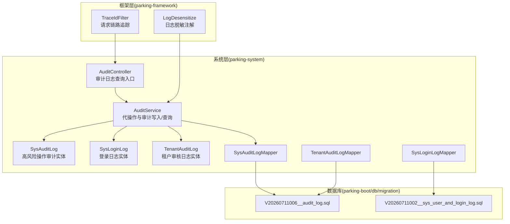
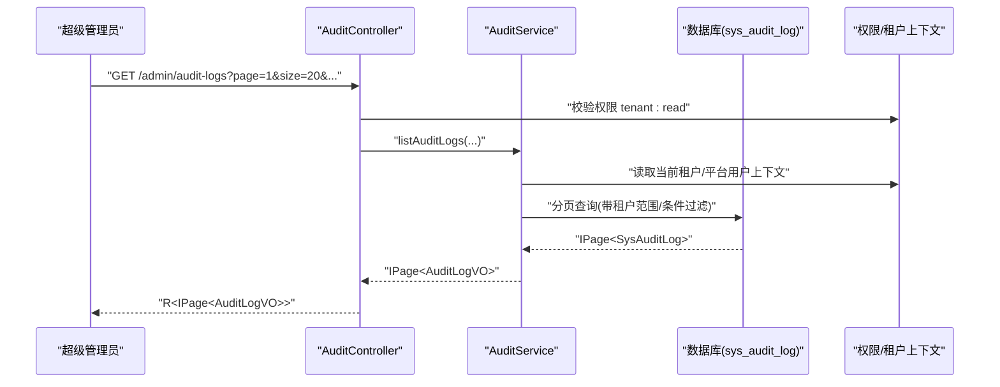
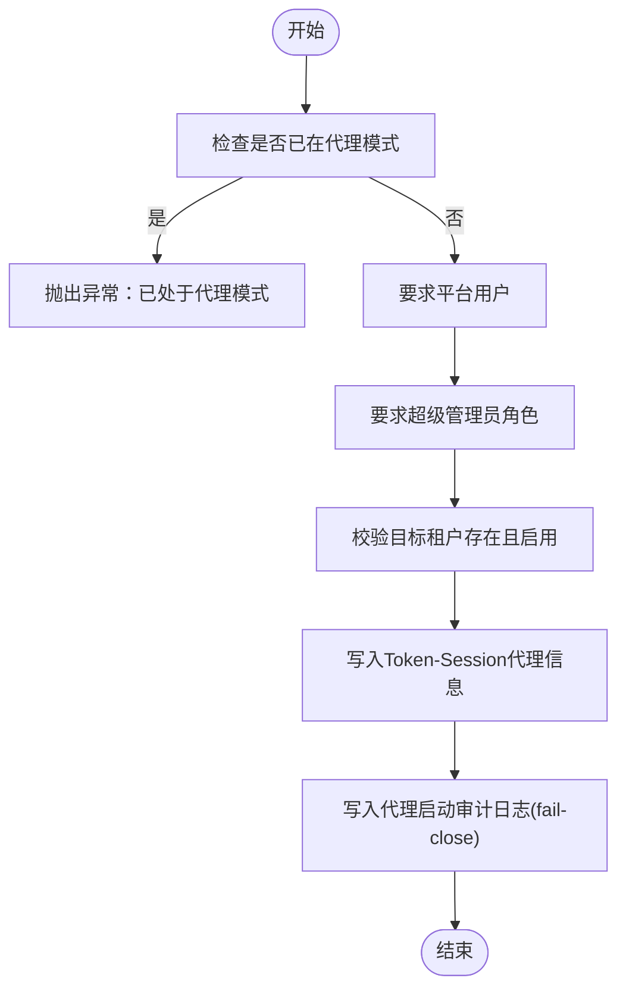
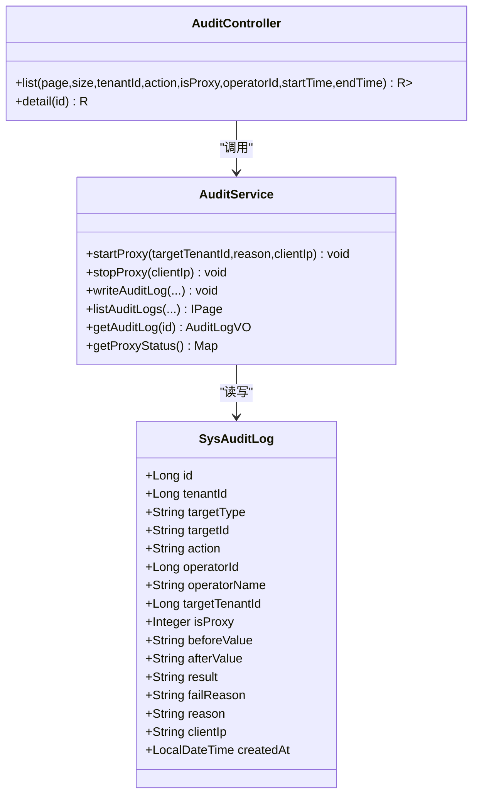
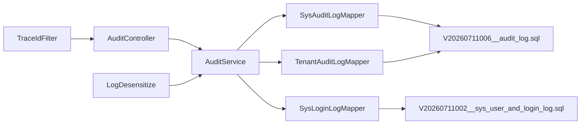

# 审计日志模块

<cite>
**本文引用的文件**   
- [AuditController.java](file://parking-system/src/main/java/com/jushan/system/controller/AuditController.java)
- [AuditService.java](file://parking-system/src/main/java/com/jushan/system/service/AuditService.java)
- [SysAuditLog.java](file://parking-system/src/main/java/com/jushan/system/entity/SysAuditLog.java)
- [SysLoginLog.java](file://parking-system/src/main/java/com/jushan/system/entity/SysLoginLog.java)
- [TenantAuditLog.java](file://parking-system/src/main/java/com/jushan/system/entity/TenantAuditLog.java)
- [V20260711006__audit_log.sql](file://parking-boot/src/main/resources/db/migration/V20260711006__audit_log.sql)
- [V20260711002__sys_user_and_login_log.sql](file://parking-boot/src/main/resources/db/migration/V20260711002__sys_user_and_login_log.sql)
- [SysAuditLogMapper.java](file://parking-system/src/main/java/com/jushan/system/mapper/SysAuditLogMapper.java)
- [SysLoginLogMapper.java](file://parking-system/src/main/java/com/jushan/system/mapper/SysLoginLogMapper.java)
- [TenantAuditLogMapper.java](file://parking-system/src/main/java/com/jushan/system/mapper/TenantAuditLogMapper.java)
- [TraceIdFilter.java](file://parking-framework/src/main/java/com/jushan/framework/web/TraceIdFilter.java)
- [LogDesensitize.java](file://parking-framework/src/main/java/com/jushan/framework/web/LogDesensitize.java)
</cite>

## 目录
1. [简介](#简介)
2. [项目结构](#项目结构)
3. [核心组件](#核心组件)
4. [架构总览](#架构总览)
5. [详细组件分析](#详细组件分析)
6. [依赖关系分析](#依赖关系分析)
7. [性能与可扩展性](#性能与可扩展性)
8. [安全与合规](#安全与合规)
9. [故障排查指南](#故障排查指南)
10. [结论](#结论)
11. [附录：数据模型与存储策略](#附录数据模型与存储策略)

## 简介
本技术文档围绕“审计日志模块”展开，覆盖操作审计设计、安全日志记录与分析查询能力。重点说明以下方面：
- 审计日志的数据模型、存储策略与检索机制
- 登录日志、操作审计日志、租户审核日志的分类管理
- 日志采集、过滤、脱敏与归档的实现方案
- 审计报表生成、合规性报告与安全事件追踪的功能说明
- 日志性能优化、异步写入与大数据量处理策略
- 日志安全保护、访问控制与备份恢复机制

## 项目结构
审计日志相关代码主要分布在 parking-system 与 parking-framework 两个模块中，数据库迁移脚本位于 parking-boot 的 db/migration 目录。整体采用分层架构：控制器层暴露查询接口，服务层实现代操作模式与通用审计写入逻辑，实体与映射器负责持久化。

图表来源
- [AuditController.java:1-78](file://parking-system/src/main/java/com/jushan/system/controller/AuditController.java#L1-L78)
- [AuditService.java:1-418](file://parking-system/src/main/java/com/jushan/system/service/AuditService.java#L1-L418)
- [SysAuditLog.java:1-121](file://parking-system/src/main/java/com/jushan/system/entity/SysAuditLog.java#L1-L121)
- [SysLoginLog.java:1-70](file://parking-system/src/main/java/com/jushan/system/entity/SysLoginLog.java#L1-L70)
- [TenantAuditLog.java:1-72](file://parking-system/src/main/java/com/jushan/system/entity/TenantAuditLog.java#L1-L72)
- [SysAuditLogMapper.java](file://parking-system/src/main/java/com/jushan/system/mapper/SysAuditLogMapper.java)
- [SysLoginLogMapper.java](file://parking-system/src/main/java/com/jushan/system/mapper/SysLoginLogMapper.java)
- [TenantAuditLogMapper.java](file://parking-system/src/main/java/com/jushan/system/mapper/TenantAuditLogMapper.java)
- [TraceIdFilter.java](file://parking-framework/src/main/java/com/jushan/framework/web/TraceIdFilter.java)
- [LogDesensitize.java](file://parking-framework/src/main/java/com/jushan/framework/web/LogDesensitize.java)
- [V20260711006__audit_log.sql](file://parking-boot/src/main/resources/db/migration/V20260711006__audit_log.sql)
- [V20260711002__sys_user_and_login_log.sql](file://parking-boot/src/main/resources/db/migration/V20260711002__sys_user_and_login_log.sql)

章节来源
- [AuditController.java:1-78](file://parking-system/src/main/java/com/jushan/system/controller/AuditController.java#L1-L78)
- [AuditService.java:1-418](file://parking-system/src/main/java/com/jushan/system/service/AuditService.java#L1-L418)
- [SysAuditLog.java:1-121](file://parking-system/src/main/java/com/jushan/system/entity/SysAuditLog.java#L1-L121)
- [SysLoginLog.java:1-70](file://parking-system/src/main/java/com/jushan/system/entity/SysLoginLog.java#L1-L70)
- [TenantAuditLog.java:1-72](file://parking-system/src/main/java/com/jushan/system/entity/TenantAuditLog.java#L1-L72)
- [V20260711006__audit_log.sql](file://parking-boot/src/main/resources/db/migration/V20260711006__audit_log.sql)
- [V20260711002__sys_user_and_login_log.sql](file://parking-boot/src/main/resources/db/migration/V20260711002__sys_user_and_login_log.sql)

## 核心组件
- 审计控制器（AuditController）
  - 提供分页查询与详情查看接口，权限校验使用平台级权限标识，支持按租户、操作类型、是否代操作、操作人、时间范围筛选。
- 审计服务（AuditService）
  - 实现“代理模式”启动/停止流程，确保超级管理员代操作可追溯；提供通用审计写入方法，自动填充操作人、代操作上下文等；提供分页查询与详情查询，内置数据范围限制。
- 实体与映射器
  - SysAuditLog：高风险操作审计日志实体
  - SysLoginLog：登录日志实体
  - TenantAuditLog：租户审核日志实体
  - 对应 Mapper 用于 MyBatis-Plus 数据访问

章节来源
- [AuditController.java:1-78](file://parking-system/src/main/java/com/jushan/system/controller/AuditController.java#L1-L78)
- [AuditService.java:1-418](file://parking-system/src/main/java/com/jushan/system/service/AuditService.java#L1-L418)
- [SysAuditLog.java:1-121](file://parking-system/src/main/java/com/jushan/system/entity/SysAuditLog.java#L1-L121)
- [SysLoginLog.java:1-70](file://parking-system/src/main/java/com/jushan/system/entity/SysLoginLog.java#L1-L70)
- [TenantAuditLog.java:1-72](file://parking-system/src/main/java/com/jushan/system/entity/TenantAuditLog.java#L1-L72)
- [SysAuditLogMapper.java](file://parking-system/src/main/java/com/jushan/system/mapper/SysAuditLogMapper.java)
- [SysLoginLogMapper.java](file://parking-system/src/main/java/com/jushan/system/mapper/SysLoginLogMapper.java)
- [TenantAuditLogMapper.java](file://parking-system/src/main/java/com/jushan/system/mapper/TenantAuditLogMapper.java)

## 架构总览
审计日志模块遵循“写多读少、强一致优先、可观测可审计”的设计原则。关键流程包括：
- 代理模式：超级管理员通过会话状态切换代操作目标租户，所有后续写操作在审计上下文中执行
- 通用审计写入：业务侧调用统一服务方法完成审计落库，失败时根据场景决定是否阻断主流程
- 查询与展示：基于权限与数据范围进行分页查询，返回结构化 VO

图表来源
- [AuditController.java:52-65](file://parking-system/src/main/java/com/jushan/system/controller/AuditController.java#L52-L65)
- [AuditService.java:324-363](file://parking-system/src/main/java/com/jushan/system/service/AuditService.java#L324-L363)
- [SysAuditLog.java:1-121](file://parking-system/src/main/java/com/jushan/system/entity/SysAuditLog.java#L1-L121)

## 详细组件分析

### 代理模式与审计写入
- 启动代操作
  - 仅允许超级管理员启动，校验目标租户存在且启用，将代理信息写入 Token-Session，并立即写入审计日志（fail-close）。
- 停止代操作
  - 清理会话中的代理信息，并写入退出审计日志（fail-close）。
- 通用审计写入
  - 从上下文获取真实操作人与代理状态，构造审计实体后落库；非关键审计写入失败不阻断主业务，但记录错误日志。

图表来源
- [AuditService.java:85-141](file://parking-system/src/main/java/com/jushan/system/service/AuditService.java#L85-L141)

章节来源
- [AuditService.java:85-141](file://parking-system/src/main/java/com/jushan/system/service/AuditService.java#L85-L141)
- [AuditService.java:150-199](file://parking-system/src/main/java/com/jushan/system/service/AuditService.java#L150-L199)
- [AuditService.java:219-305](file://parking-system/src/main/java/com/jushan/system/service/AuditService.java#L219-L305)

### 查询与数据范围控制
- 分页查询
  - 平台用户可查看全平台日志；租户用户只能查看本租户日志；支持按租户、操作类型、是否代操作、操作人、时间范围筛选。
- 详情查询
  - 忽略租户隔离查询单条记录，再进行数据范围校验，防止越权访问。

图表来源
- [AuditController.java:1-78](file://parking-system/src/main/java/com/jushan/system/controller/AuditController.java#L1-L78)
- [AuditService.java:1-418](file://parking-system/src/main/java/com/jushan/system/service/AuditService.java#L1-L418)
- [SysAuditLog.java:1-121](file://parking-system/src/main/java/com/jushan/system/entity/SysAuditLog.java#L1-L121)

章节来源
- [AuditController.java:52-76](file://parking-system/src/main/java/com/jushan/system/controller/AuditController.java#L52-L76)
- [AuditService.java:324-378](file://parking-system/src/main/java/com/jushan/system/service/AuditService.java#L324-L378)

### 登录日志与租户审核日志
- 登录日志（SysLoginLog）
  - 记录登录账号、IP、User-Agent、结果与失败原因，便于安全分析与风控。
- 租户审核日志（TenantAuditLog）
  - 记录对租户的审核、启用、禁用等操作的前后状态与原因，满足合规审计需求。

章节来源
- [SysLoginLog.java:1-70](file://parking-system/src/main/java/com/jushan/system/entity/SysLoginLog.java#L1-L70)
- [TenantAuditLog.java:1-72](file://parking-system/src/main/java/com/jushan/system/entity/TenantAuditLog.java#L1-L72)

## 依赖关系分析
- 控制器依赖服务层，服务层依赖实体与映射器，映射器依赖数据库表结构定义（Flyway 迁移脚本）。
- 框架层提供链路追踪与日志脱敏能力，辅助审计日志的可观测性与安全性。

图表来源
- [AuditController.java:1-78](file://parking-system/src/main/java/com/jushan/system/controller/AuditController.java#L1-L78)
- [AuditService.java:1-418](file://parking-system/src/main/java/com/jushan/system/service/AuditService.java#L1-L418)
- [SysAuditLogMapper.java](file://parking-system/src/main/java/com/jushan/system/mapper/SysAuditLogMapper.java)
- [SysLoginLogMapper.java](file://parking-system/src/main/java/com/jushan/system/mapper/SysLoginLogMapper.java)
- [TenantAuditLogMapper.java](file://parking-system/src/main/java/com/jushan/system/mapper/TenantAuditLogMapper.java)
- [V20260711006__audit_log.sql](file://parking-boot/src/main/resources/db/migration/V20260711006__audit_log.sql)
- [V20260711002__sys_user_and_login_log.sql](file://parking-boot/src/main/resources/db/migration/V20260711002__sys_user_and_login_log.sql)
- [TraceIdFilter.java](file://parking-framework/src/main/java/com/jushan/framework/web/TraceIdFilter.java)
- [LogDesensitize.java](file://parking-framework/src/main/java/com/jushan/framework/web/LogDesensitize.java)

## 性能与可扩展性
- 索引与查询优化
  - 建议在 sys_audit_log 上针对 tenant_id、action、is_proxy、operator_id、created_at 建立复合索引，以支撑高频分页与多维筛选。
  - 时间范围查询建议结合 created_at 索引，避免全表扫描。
- 异步写入与削峰
  - 当前实现为同步写入，适用于中小规模。当审计日志量激增时，可引入消息队列或内存缓冲队列，将写入解耦为异步任务，降低主流程延迟。
- 批量写入
  - 对于批量操作产生的多条审计记录，可采用批量插入减少往返开销。
- 冷热分离与归档
  - 历史数据可按时间分表或归档至低成本存储，查询接口增加“归档区”开关，默认只查热数据。
- 缓存与预聚合
  - 统计类指标（如近7天失败率、Top操作人）可通过定时任务预计算并缓存，减轻实时查询压力。

[本节为通用性能建议，无需具体文件引用]

## 安全与合规
- 访问控制
  - 审计查询接口需具备平台级权限标识；详情查询在执行前进行数据范围校验，防止越权。
- 敏感信息脱敏
  - 使用框架提供的日志脱敏注解，避免在审计日志中输出敏感字段（如密码、密钥等）。
- 链路追踪
  - 通过 TraceIdFilter 注入链路 ID，便于跨服务定位问题与关联审计记录。
- 审计不可抵赖
  - 代理操作的启动/停止采用 fail-close 策略，确保审计缺失时拒绝执行，保障合规性。
- 备份与恢复
  - 建议对审计库进行定期快照与增量备份，保留策略符合合规要求；恢复演练应纳入运维流程。

章节来源
- [AuditController.java:52-76](file://parking-system/src/main/java/com/jushan/system/controller/AuditController.java#L52-L76)
- [AuditService.java:368-378](file://parking-system/src/main/java/com/jushan/system/service/AuditService.java#L368-L378)
- [LogDesensitize.java](file://parking-framework/src/main/java/com/jushan/framework/web/LogDesensitize.java)
- [TraceIdFilter.java](file://parking-framework/src/main/java/com/jushan/framework/web/TraceIdFilter.java)

## 故障排查指南
- 常见问题
  - 无法进入代理模式：检查是否已是代理模式、当前用户是否为超级管理员、目标租户是否存在且启用。
  - 审计写入失败：查看错误日志，确认数据库连接与表结构；代理操作失败会阻断主流程。
  - 查询无数据：确认租户范围是否正确、筛选条件是否过严、时间格式是否符合 ISO 标准。
- 定位手段
  - 使用 TraceId 关联请求链路；核对审计日志中的 operatorId、targetTenantId、isProxy 字段。
  - 对比 beforeValue/afterValue 与业务变更，确认审计完整性。

章节来源
- [AuditService.java:85-141](file://parking-system/src/main/java/com/jushan/system/service/AuditService.java#L85-L141)
- [AuditService.java:273-305](file://parking-system/src/main/java/com/jushan/system/service/AuditService.java#L273-L305)
- [AuditService.java:324-363](file://parking-system/src/main/java/com/jushan/system/service/AuditService.java#L324-L363)

## 结论
审计日志模块通过“代理模式+通用审计写入”的组合，实现了高价值操作的全链路可追溯与强一致性保障。配合权限控制、数据范围校验与脱敏、追踪能力，可满足合规与运营分析需求。未来可在异步写入、批量处理、冷热分离等方面进一步优化，以应对更大规模的审计数据增长。

[本节为总结性内容，无需具体文件引用]

## 附录：数据模型与存储策略
- 高风险操作审计日志（sys_audit_log）
  - 关键字段：租户ID、目标类型、目标ID、操作类型、操作人ID/名称、代操作目标租户ID、是否代操作、前后值JSON、结果、失败原因、原因备注、客户端IP、创建时间
  - 存储策略：建议按租户与时间维度建立索引；长期数据可归档至冷存储
- 登录日志（sys_login_log）
  - 关键字段：用户ID、用户名、IP、User-Agent、结果、失败原因、创建时间
  - 存储策略：按时间分区或按月分表，便于快速检索与清理
- 租户审核日志（tenant_audit_log）
  - 关键字段：租户ID、操作类型、操作人ID、原因、前后状态、创建时间
  - 存储策略：与租户主数据同库，便于关联审计

章节来源
- [SysAuditLog.java:1-121](file://parking-system/src/main/java/com/jushan/system/entity/SysAuditLog.java#L1-L121)
- [SysLoginLog.java:1-70](file://parking-system/src/main/java/com/jushan/system/entity/SysLoginLog.java#L1-L70)
- [TenantAuditLog.java:1-72](file://parking-system/src/main/java/com/jushan/system/entity/TenantAuditLog.java#L1-L72)
- [V20260711006__audit_log.sql](file://parking-boot/src/main/resources/db/migration/V20260711006__audit_log.sql)
- [V20260711002__sys_user_and_login_log.sql](file://parking-boot/src/main/resources/db/migration/V20260711002__sys_user_and_login_log.sql)