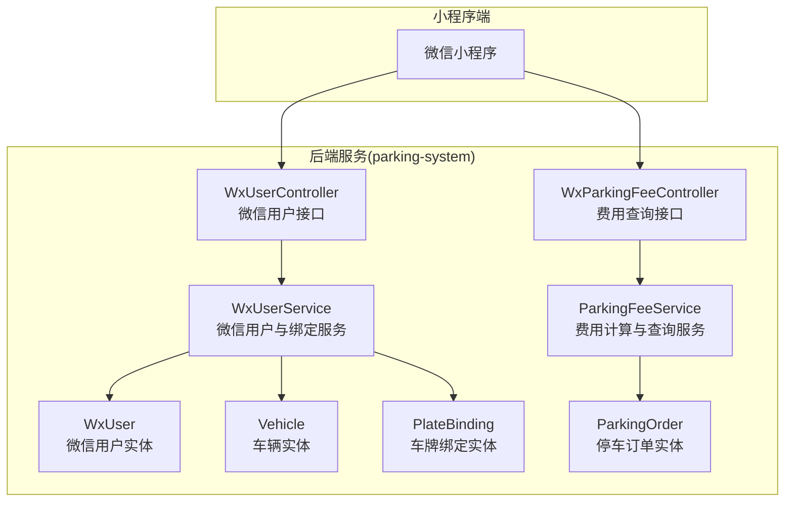
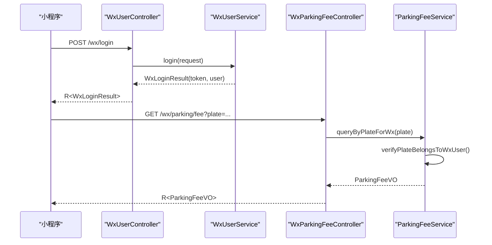
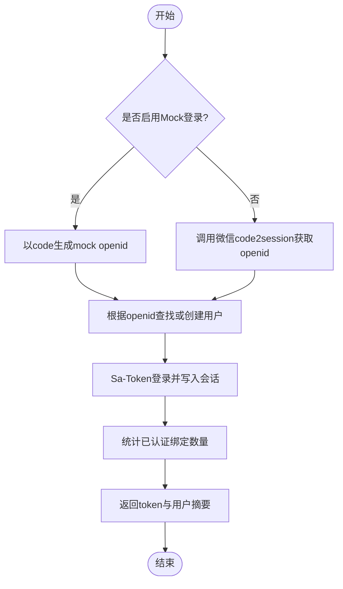
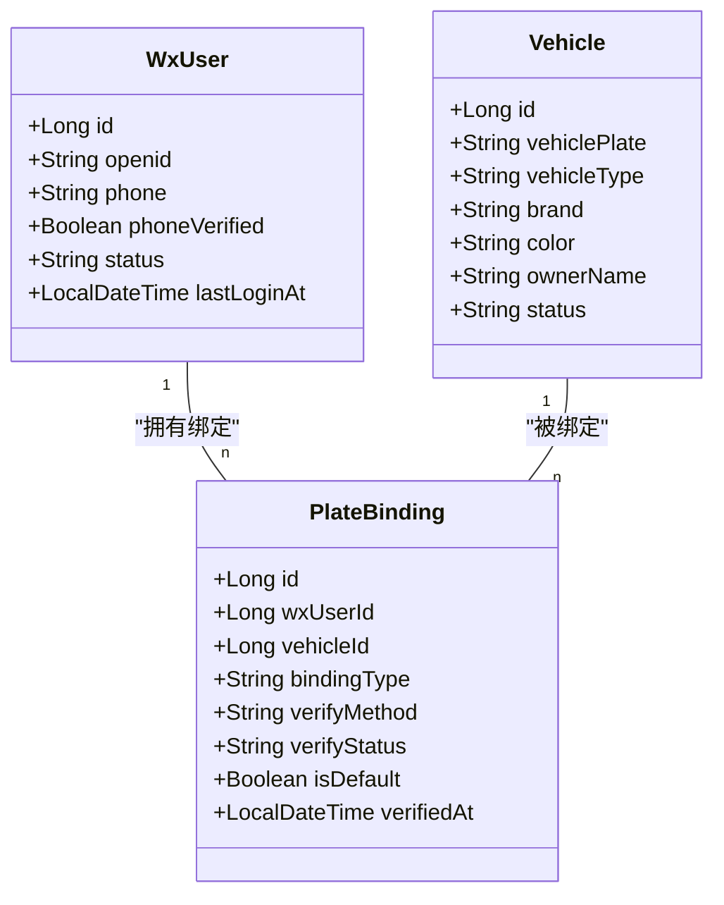
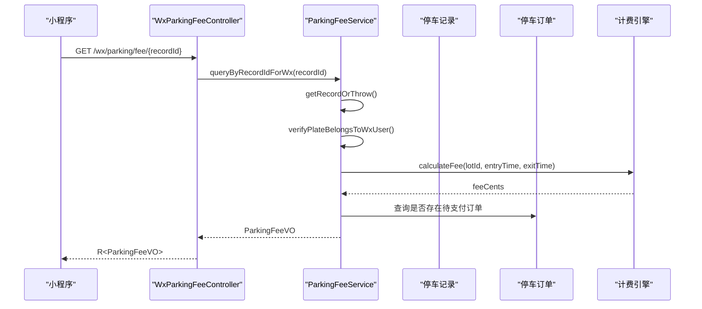
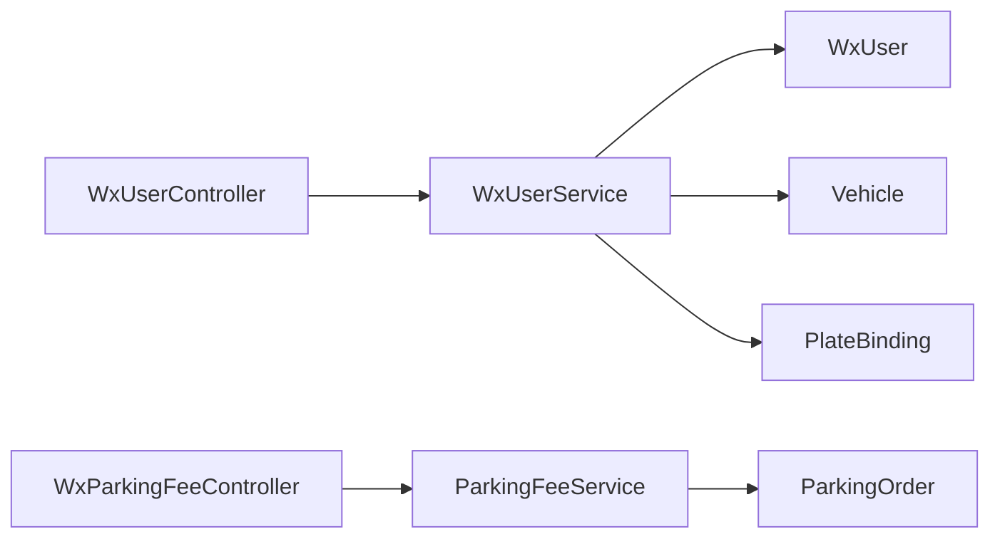

# 小程序服务模块

<cite>
**本文引用的文件**   
- [WxUserController.java](file://parking-system/src/main/java/com/jushan/system/controller/WxUserController.java)
- [WxUserService.java](file://parking-system/src/main/java/com/jushan/system/service/WxUserService.java)
- [WxUser.java](file://parking-system/src/main/java/com/jushan/system/entity/WxUser.java)
- [Vehicle.java](file://parking-system/src/main/java/com/jushan/system/entity/Vehicle.java)
- [PlateBinding.java](file://parking-system/src/main/java/com/jushan/system/entity/PlateBinding.java)
- [WxParkingFeeController.java](file://parking-system/src/main/java/com/jushan/system/controller/WxParkingFeeController.java)
- [ParkingFeeService.java](file://parking-system/src/main/java/com/jushan/system/service/ParkingFeeService.java)
- [ParkingOrder.java](file://parking-system/src/main/java/com/jushan/system/entity/ParkingOrder.java)
</cite>

## 目录
1. [简介](#简介)
2. [项目结构](#项目结构)
3. [核心组件](#核心组件)
4. [架构总览](#架构总览)
5. [详细组件分析](#详细组件分析)
6. [依赖关系分析](#依赖关系分析)
7. [性能与扩展性](#性能与扩展性)
8. [故障排查指南](#故障排查指南)
9. [结论](#结论)
10. [附录：接口规范与安全方案](#附录接口规范与安全方案)

## 简介
本技术文档聚焦于小程序服务模块，覆盖微信用户管理、车辆绑定管理与在线缴费（费用查询与结算预览）三大能力。重点说明：
- 微信授权登录流程、用户信息获取与会话管理
- 车辆绑定策略、车牌识别与用户关联机制
- 支付流程设计、订单管理与回调处理实现（当前为骨架阶段）
- 小程序API接口规范、数据格式与安全传输方案
- 微信SDK集成、签名验证与加解密机制（含待实现项）
- 支付安全、防重放攻击与交易对账的处理方案

## 项目结构
小程序相关后端能力集中在 parking-system 模块中，采用分层架构：
- 控制器层：对外暴露 REST API
- 服务层：业务编排与校验
- 实体层：持久化模型
- 外部依赖：计费引擎、停车记录/订单、车牌标准化等

图表来源
- [WxUserController.java:1-116](file://parking-system/src/main/java/com/jushan/system/controller/WxUserController.java#L1-L116)
- [WxParkingFeeController.java:1-80](file://parking-system/src/main/java/com/jushan/system/controller/WxParkingFeeController.java#L1-L80)
- [WxUserService.java:1-521](file://parking-system/src/main/java/com/jushan/system/service/WxUserService.java#L1-L521)
- [ParkingFeeService.java:1-355](file://parking-system/src/main/java/com/jushan/system/service/ParkingFeeService.java#L1-L355)
- [WxUser.java:1-112](file://parking-system/src/main/java/com/jushan/system/entity/WxUser.java#L1-L112)
- [Vehicle.java:1-111](file://parking-system/src/main/java/com/jushan/system/entity/Vehicle.java#L1-L111)
- [PlateBinding.java:1-123](file://parking-system/src/main/java/com/jushan/system/entity/PlateBinding.java#L1-L123)
- [ParkingOrder.java:1-104](file://parking-system/src/main/java/com/jushan/system/entity/ParkingOrder.java#L1-L104)

章节来源
- [WxUserController.java:1-116](file://parking-system/src/main/java/com/jushan/system/controller/WxUserController.java#L1-L116)
- [WxParkingFeeController.java:1-80](file://parking-system/src/main/java/com/jushan/system/controller/WxParkingFeeController.java#L1-L80)
- [WxUserService.java:1-521](file://parking-system/src/main/java/com/jushan/system/service/WxUserService.java#L1-L521)
- [ParkingFeeService.java:1-355](file://parking-system/src/main/java/com/jushan/system/service/ParkingFeeService.java#L1-L355)

## 核心组件
- 微信用户控制器与服务：提供登录、退出、用户信息查询、手机号绑定、车牌绑定/解绑/默认设置等能力。
- 费用查询控制器与服务：面向小程序的按车牌/记录ID查询费用、结算预览；包含权限校验与计费逻辑调用。
- 实体模型：微信用户、车辆、车牌绑定、停车订单等。

章节来源
- [WxUserController.java:1-116](file://parking-system/src/main/java/com/jushan/system/controller/WxUserController.java#L1-L116)
- [WxUserService.java:1-521](file://parking-system/src/main/java/com/jushan/system/service/WxUserService.java#L1-L521)
- [WxParkingFeeController.java:1-80](file://parking-system/src/main/java/com/jushan/system/controller/WxParkingFeeController.java#L1-L80)
- [ParkingFeeService.java:1-355](file://parking-system/src/main/java/com/jushan/system/service/ParkingFeeService.java#L1-L355)
- [WxUser.java:1-112](file://parking-system/src/main/java/com/jushan/system/entity/WxUser.java#L1-L112)
- [Vehicle.java:1-111](file://parking-system/src/main/java/com/jushan/system/entity/Vehicle.java#L1-L111)
- [PlateBinding.java:1-123](file://parking-system/src/main/java/com/jushan/system/entity/PlateBinding.java#L1-L123)
- [ParkingOrder.java:1-104](file://parking-system/src/main/java/com/jushan/system/entity/ParkingOrder.java#L1-L104)

## 架构总览
小程序通过 REST API 与后端交互，登录与会话由 Sa-Token 管理；费用查询涉及停车记录、计费引擎与订单状态聚合。

图表来源
- [WxUserController.java:43-47](file://parking-system/src/main/java/com/jushan/system/controller/WxUserController.java#L43-L47)
- [WxUserService.java:75-125](file://parking-system/src/main/java/com/jushan/system/service/WxUserService.java#L75-L125)
- [WxParkingFeeController.java:45-51](file://parking-system/src/main/java/com/jushan/system/controller/WxParkingFeeController.java#L45-L51)
- [ParkingFeeService.java:84-104](file://parking-system/src/main/java/com/jushan/system/service/ParkingFeeService.java#L84-L104)

## 详细组件分析

### 微信用户管理
- 登录流程：支持 Mock 登录（local/test），真实环境需接入微信 code2session 换取 openid；登录后使用 Sa-Token 建立会话并写入设备标识与登录类型。
- 用户信息：返回脱敏昵称、头像、脱敏手机号、已验证状态、最后登录时间，以及已认证的车牌列表与默认车牌。
- 手机号绑定：正则校验、唯一性检查、验证码校验（非 Mock 模式）。
- 车牌绑定策略：
  - 策略优先级：停车场 > 租户 > 平台默认
  - 限制：每用户最大绑定数、每车牌最大绑定用户数
  - 验证方式：仅车牌、手机号验证、上传行驶证、人工审核
  - 默认车牌：同一用户仅一个默认
- 会话管理：独立登录类型 wx_user，会话内存储 device、login_type、openid。

图表来源
- [WxUserService.java:75-125](file://parking-system/src/main/java/com/jushan/system/service/WxUserService.java#L75-L125)
- [WxUserService.java:133-144](file://parking-system/src/main/java/com/jushan/system/service/WxUserService.java#L133-L144)

章节来源
- [WxUserController.java:43-69](file://parking-system/src/main/java/com/jushan/system/controller/WxUserController.java#L43-L69)
- [WxUserService.java:75-125](file://parking-system/src/main/java/com/jushan/system/service/WxUserService.java#L75-L125)
- [WxUserService.java:183-227](file://parking-system/src/main/java/com/jushan/system/service/WxUserService.java#L183-L227)
- [WxUserService.java:348-379](file://parking-system/src/main/java/com/jushan/system/service/WxUserService.java#L348-L379)
- [WxUserService.java:384-403](file://parking-system/src/main/java/com/jushan/system/service/WxUserService.java#L384-L403)
- [WxUser.java:1-112](file://parking-system/src/main/java/com/jushan/system/entity/WxUser.java#L1-L112)

### 车辆绑定管理
- 绑定流程：
  - 校验绑定策略（用户上限、车牌用户上限）
  - 标准化车牌号（大写、去空格）
  - 查找或创建车辆
  - 检查重复绑定
  - 根据验证方式决定初始验证状态（仅车牌直接通过，否则待验证）
  - 首次绑定自动设为默认
- 解绑与默认设置：
  - 解绑前校验归属权
  - 设置默认时先清除其他默认再设置新默认
- 数据结构关系：

图表来源
- [WxUser.java:1-112](file://parking-system/src/main/java/com/jushan/system/entity/WxUser.java#L1-L112)
- [Vehicle.java:1-111](file://parking-system/src/main/java/com/jushan/system/entity/Vehicle.java#L1-L111)
- [PlateBinding.java:1-123](file://parking-system/src/main/java/com/jushan/system/entity/PlateBinding.java#L1-L123)

章节来源
- [WxUserController.java:76-104](file://parking-system/src/main/java/com/jushan/system/controller/WxUserController.java#L76-L104)
- [WxUserService.java:235-341](file://parking-system/src/main/java/com/jushan/system/service/WxUserService.java#L235-L341)
- [WxUserService.java:408-464](file://parking-system/src/main/java/com/jushan/system/service/WxUserService.java#L408-L464)
- [WxUserService.java:469-491](file://parking-system/src/main/java/com/jushan/system/service/WxUserService.java#L469-L491)

### 在线缴费（费用查询与结算预览）
- 能力范围：
  - 小程序按车牌查询当前费用（需确保车牌属于当前用户）
  - 小程序按停车记录ID查询费用
  - 小程序结算预览（可指定出场时间进行重新计费）
- 安全约束：
  - 小程序端必须校验车牌归属
  - 金额统一整数分
  - 不修改停车记录和订单状态
- 关键流程：

图表来源
- [WxParkingFeeController.java:59-64](file://parking-system/src/main/java/com/jushan/system/controller/WxParkingFeeController.java#L59-L64)
- [ParkingFeeService.java:112-117](file://parking-system/src/main/java/com/jushan/system/service/ParkingFeeService.java#L112-L117)
- [ParkingFeeService.java:259-287](file://parking-system/src/main/java/com/jushan/system/service/ParkingFeeService.java#L259-L287)
- [ParkingFeeService.java:317-353](file://parking-system/src/main/java/com/jushan/system/service/ParkingFeeService.java#L317-L353)

章节来源
- [WxParkingFeeController.java:45-78](file://parking-system/src/main/java/com/jushan/system/controller/WxParkingFeeController.java#L45-L78)
- [ParkingFeeService.java:84-131](file://parking-system/src/main/java/com/jushan/system/service/ParkingFeeService.java#L84-L131)
- [ParkingFeeService.java:218-235](file://parking-system/src/main/java/com/jushan/system/service/ParkingFeeService.java#L218-L235)
- [ParkingFeeService.java:259-353](file://parking-system/src/main/java/com/jushan/system/service/ParkingFeeService.java#L259-L353)
- [ParkingOrder.java:1-104](file://parking-system/src/main/java/com/jushan/system/entity/ParkingOrder.java#L1-L104)

## 依赖关系分析
- 控制器到服务：WxUserController -> WxUserService；WxParkingFeeController -> ParkingFeeService
- 服务到实体：WxUserService -> WxUser/Vehicle/PlateBinding；ParkingFeeService -> ParkingOrder
- 外部依赖：计费引擎（BillingEngine）、车牌标准化（PlateStandardizer）、Sa-Token 会话管理

图表来源
- [WxUserController.java:1-116](file://parking-system/src/main/java/com/jushan/system/controller/WxUserController.java#L1-L116)
- [WxUserService.java:1-521](file://parking-system/src/main/java/com/jushan/system/service/WxUserService.java#L1-L521)
- [WxParkingFeeController.java:1-80](file://parking-system/src/main/java/com/jushan/system/controller/WxParkingFeeController.java#L1-L80)
- [ParkingFeeService.java:1-355](file://parking-system/src/main/java/com/jushan/system/service/ParkingFeeService.java#L1-L355)
- [WxUser.java:1-112](file://parking-system/src/main/java/com/jushan/system/entity/WxUser.java#L1-L112)
- [Vehicle.java:1-111](file://parking-system/src/main/java/com/jushan/system/entity/Vehicle.java#L1-L111)
- [PlateBinding.java:1-123](file://parking-system/src/main/java/com/jushan/system/entity/PlateBinding.java#L1-L123)
- [ParkingOrder.java:1-104](file://parking-system/src/main/java/com/jushan/system/entity/ParkingOrder.java#L1-L104)

章节来源
- [WxUserController.java:1-116](file://parking-system/src/main/java/com/jushan/system/controller/WxUserController.java#L1-L116)
- [WxUserService.java:1-521](file://parking-system/src/main/java/com/jushan/system/service/WxUserService.java#L1-L521)
- [WxParkingFeeController.java:1-80](file://parking-system/src/main/java/com/jushan/system/controller/WxParkingFeeController.java#L1-L80)
- [ParkingFeeService.java:1-355](file://parking-system/src/main/java/com/jushan/system/service/ParkingFeeService.java#L1-L355)

## 性能与扩展性
- 查询优化：
  - 按车牌查询在场记录时，若存在多条记录应引导使用记录ID精确查询，避免歧义
  - 费用预览仅在需要时触发计费引擎计算，减少不必要的计算开销
- 幂等与一致性：
  - 订单状态更新建议使用条件更新，防止并发覆盖
  - 后续支付回调需实现幂等处理（当前为骨架阶段）
- 可扩展点：
  - 绑定策略支持多粒度配置（停车场/租户/平台）
  - 验证方式可扩展（如OCR行驶证核验、第三方身份核验）

[本节为通用指导，无需源码引用]

## 故障排查指南
- 登录失败：
  - 检查是否启用 Mock 登录；生产环境需配置微信 AppId/Secret 并实现 code2session
  - 确认 Sa-Token 会话是否正常创建与携带
- 无权查询车牌：
  - 确认小程序当前用户是否已绑定该车辆且验证通过
  - 检查车牌标准化是否正确
- 费用异常：
  - 核对入场时间与预览出场时间的合法性
  - 检查是否存在未完成的订单导致状态不一致

章节来源
- [WxUserService.java:133-144](file://parking-system/src/main/java/com/jushan/system/service/WxUserService.java#L133-L144)
- [ParkingFeeService.java:218-235](file://parking-system/src/main/java/com/jushan/system/service/ParkingFeeService.java#L218-L235)
- [ParkingFeeService.java:247-257](file://parking-system/src/main/java/com/jushan/system/service/ParkingFeeService.java#L247-L257)

## 结论
小程序服务模块在用户管理、车辆绑定与费用查询方面已形成稳定闭环；支付流程处于骨架阶段，后续将完善订单状态机、支付单关联与回调幂等。建议在生产环境尽快完成微信真实登录接入与支付安全加固。

[本节为总结，无需源码引用]

## 附录：接口规范与安全方案

### 小程序API接口规范
- 微信用户
  - POST /api/wx/login
    - 请求体：{ code, nickname?, avatarUrl? }
    - 响应：R<WxLoginResult>（token、userId、nickname、avatarUrl、isNewUser、plateCount、loginTime、message）
  - POST /api/wx/logout
    - 响应：R<Void>
  - GET /api/wx/user
    - 响应：R<WxUserVo>（用户信息与绑定车牌列表、默认车牌）
  - POST /api/wx/plates
    - 请求体：{ plate, verifyMethod?, vehicleType?, brand?, color?, ownerName? }
    - 响应：R<PlateBindingVo>
  - DELETE /api/wx/plates/{bindingId}
    - 响应：R<Void>
  - PUT /api/wx/plates/{bindingId}/default
    - 响应：R<Void>
  - POST /api/wx/phone
    - 请求体：{ phone, verifyCode? }
    - 响应：R<Void>
- 费用查询
  - GET /api/wx/parking/fee?plate=...
    - 响应：R<ParkingFeeVO>
  - GET /api/wx/parking/fee/{recordId}
    - 响应：R<ParkingFeeVO>
  - POST /api/wx/parking/fee/preview
    - 请求体：{ recordId, previewExitTime? }
    - 响应：R<ParkingFeeVO>

章节来源
- [WxUserController.java:43-115](file://parking-system/src/main/java/com/jushan/system/controller/WxUserController.java#L43-L115)
- [WxParkingFeeController.java:45-78](file://parking-system/src/main/java/com/jushan/system/controller/WxParkingFeeController.java#L45-L78)

### 数据格式要点
- 金额单位：统一使用“分”（整数），禁止浮点数
- 车牌号：标准化为大写、去除空格，遵循国家规范格式
- 状态枚举：
  - 订单状态：PENDING、PAID、COMPLETED、CANCELLED
  - 绑定验证状态：PENDING、APPROVED、REJECTED
  - 绑定验证方式：PLATE_ONLY、PHONE_VERIFY、UPLOAD_CERT、MANUAL_AUDIT

章节来源
- [ParkingOrder.java:64-67](file://parking-system/src/main/java/com/jushan/system/entity/ParkingOrder.java#L64-L67)
- [PlateBinding.java:28-42](file://parking-system/src/main/java/com/jushan/system/entity/PlateBinding.java#L28-L42)
- [ParkingFeeService.java:317-353](file://parking-system/src/main/java/com/jushan/system/service/ParkingFeeService.java#L317-L353)

### 安全传输与鉴权
- 传输安全：
  - 全链路HTTPS
  - 敏感字段（手机号、昵称）脱敏展示
- 鉴权与会话：
  - 使用 Sa-Token 管理会话，登录类型区分 wx_user
  - 小程序端需在请求头携带 token
- 签名与加密：
  - 当前未实现服务端签名校验与参数加密；建议在网关或统一拦截器增加签名校验与请求体加密（对称或非对称）

章节来源
- [WxUserService.java:94-102](file://parking-system/src/main/java/com/jushan/system/service/WxUserService.java#L94-L102)
- [WxUserService.java:183-227](file://parking-system/src/main/java/com/jushan/system/service/WxUserService.java#L183-L227)

### 微信SDK集成与登录流程
- 当前实现：
  - local/test 环境使用 Mock 登录，以 code 生成 mock openid
- 生产接入：
  - 调用微信 code2session 接口获取 openid（需配置 AppId/Secret）
  - 将 openid 作为用户唯一标识，建立或更新微信用户记录

章节来源
- [WxUserService.java:133-144](file://parking-system/src/main/java/com/jushan/system/service/WxUserService.java#L133-L144)

### 支付安全、防重放与对账
- 支付安全：
  - 金额不可为负，使用整数分
  - 订单状态变更使用条件更新，避免并发覆盖
- 防重放攻击：
  - 支付回调需校验签名、时间戳与随机串
  - 基于订单ID+回调流水号做幂等键，落库前检查是否已处理
- 交易对账：
  - 定时任务拉取第三方支付账单，与本地订单比对差异
  - 差异订单进入人工复核队列，记录审计日志

[本节为通用方案，无需源码引用]