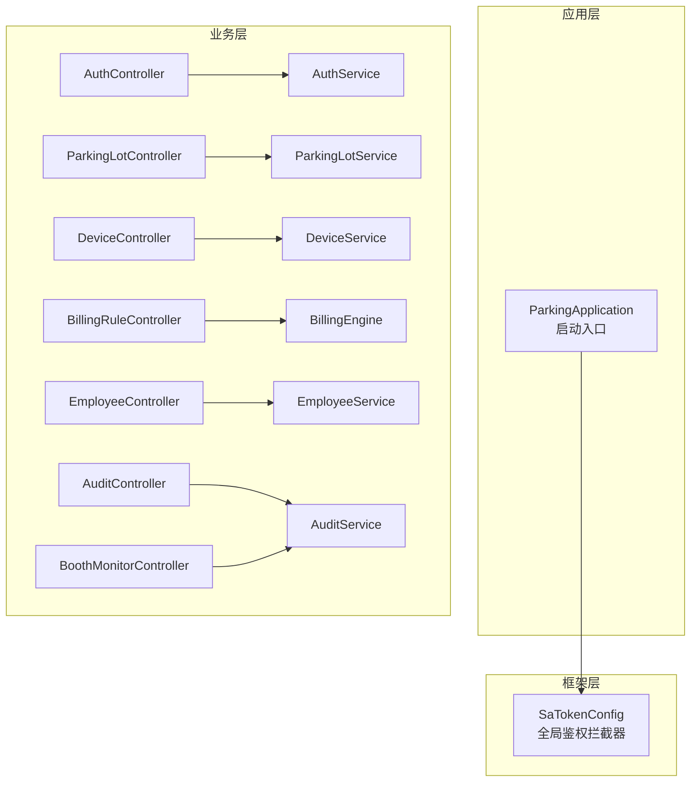
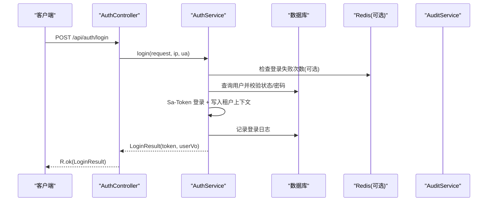
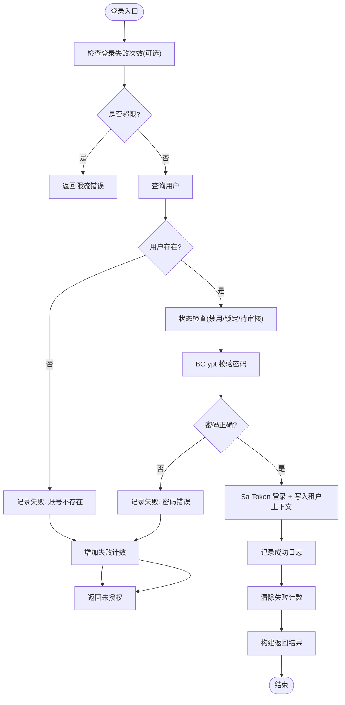
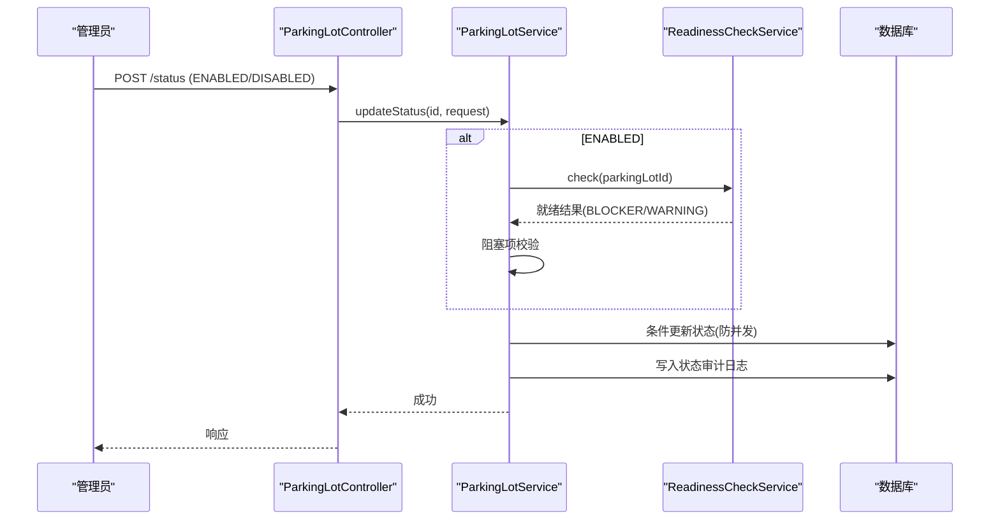
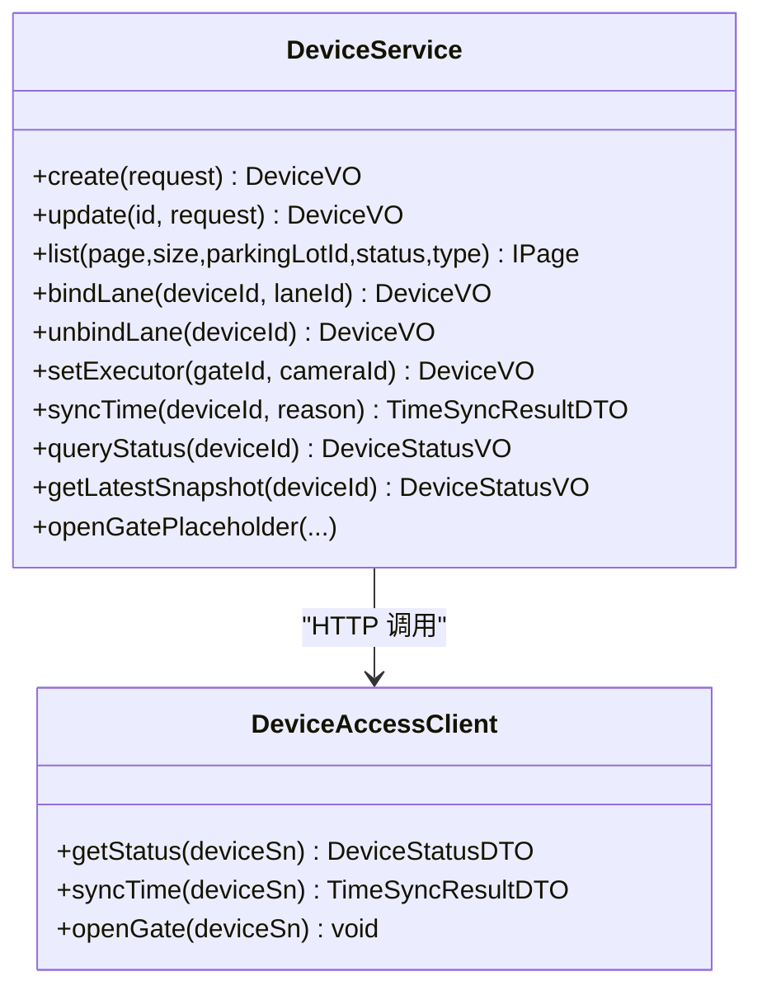
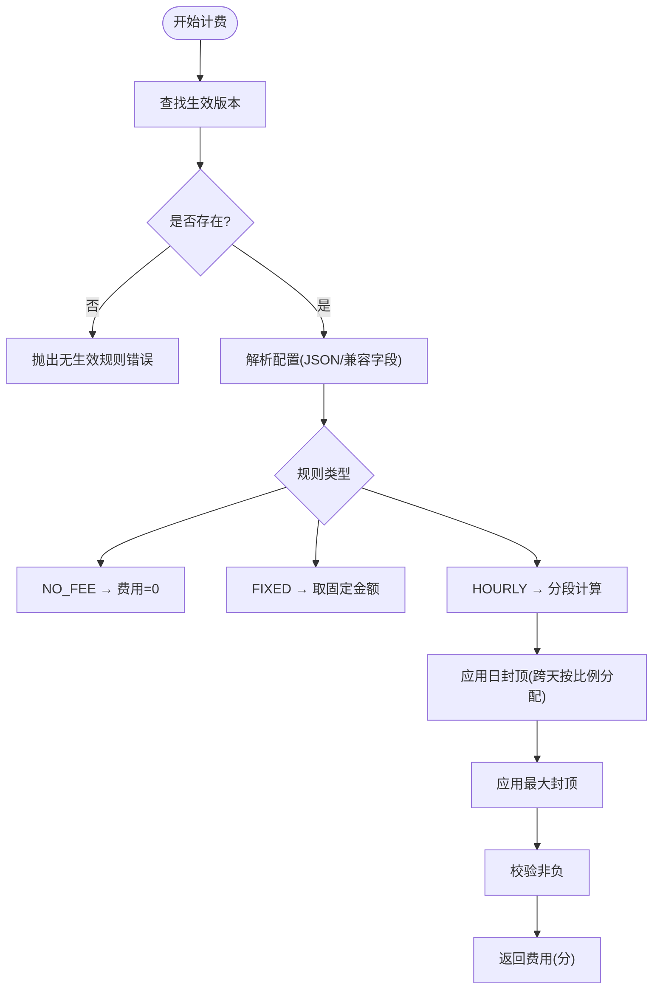
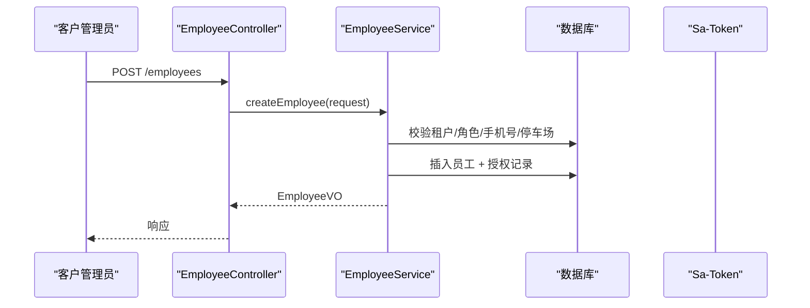
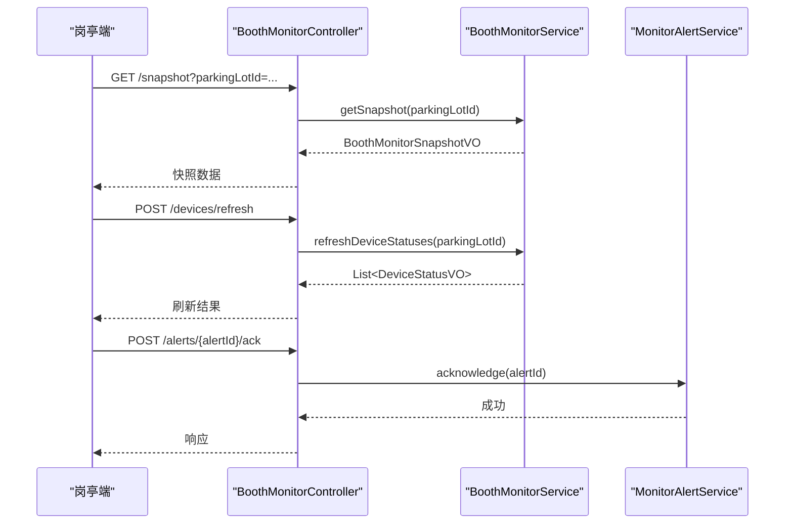
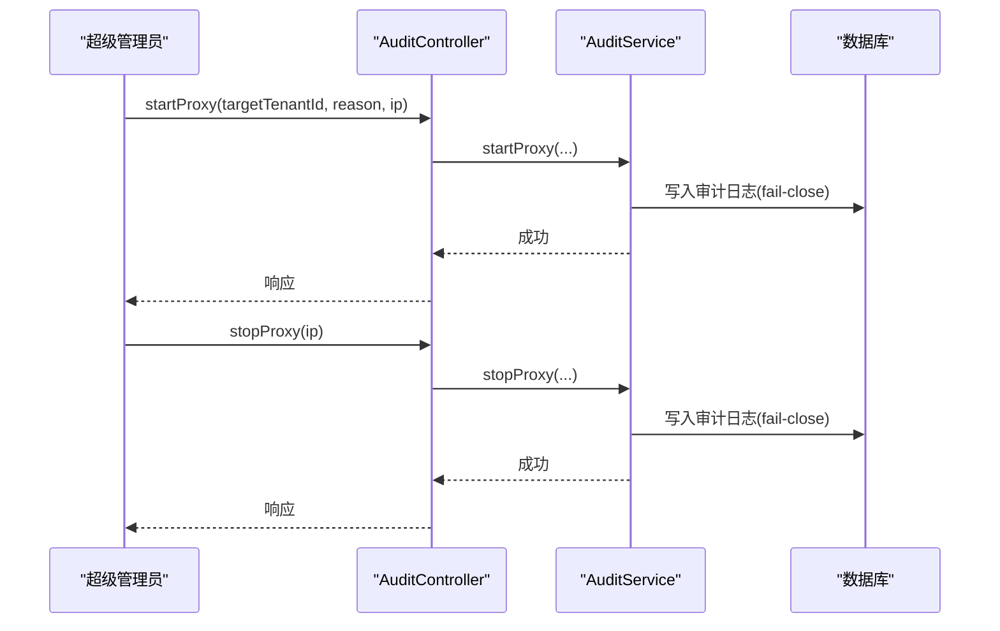
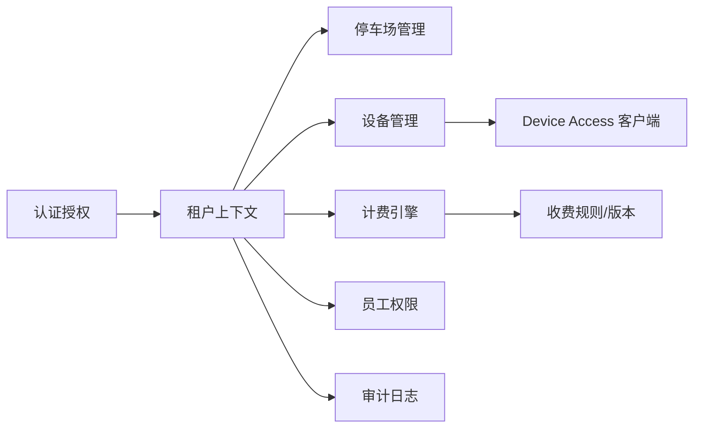

# 核心业务模块

<cite>
**本文引用的文件**   
- [ParkingApplication.java](file://parking-boot/src/main/java/com/jushan/boot/ParkingApplication.java)
- [SaTokenConfig.java](file://parking-framework/src/main/java/com/jushan/framework/auth/SaTokenConfig.java)
- [AuthController.java](file://parking-system/src/main/java/com/jushan/system/controller/AuthController.java)
- [AuthService.java](file://parking-system/src/main/java/com/jushan/system/service/AuthService.java)
- [ParkingLotController.java](file://parking-system/src/main/java/com/jushan/system/controller/ParkingLotController.java)
- [ParkingLotService.java](file://parking-system/src/main/java/com/jushan/system/service/ParkingLotService.java)
- [DeviceController.java](file://parking-system/src/main/java/com/jushan/system/controller/DeviceController.java)
- [DeviceService.java](file://parking-system/src/main/java/com/jushan/system/service/DeviceService.java)
- [DeviceAccessClient.java](file://parking-system/src/main/java/com/jushan/system/client/DeviceAccessClient.java)
- [BillingRuleController.java](file://parking-system/src/main/java/com/jushan/system/controller/BillingRuleController.java)
- [BillingEngine.java](file://parking-system/src/main/java/com/jushan/system/service/BillingEngine.java)
- [EmployeeController.java](file://parking-system/src/main/java/com/jushan/system/controller/EmployeeController.java)
- [EmployeeService.java](file://parking-system/src/main/java/com/jushan/system/service/EmployeeService.java)
- [AuditController.java](file://parking-system/src/main/java/com/jushan/system/controller/AuditController.java)
- [AuditService.java](file://parking-system/src/main/java/com/jushan/system/service/AuditService.java)
- [BoothMonitorController.java](file://parking-system/src/main/java/com/jushan/system/controller/BoothMonitorController.java)
</cite>

## 目录
1. [引言](#引言)
2. [项目结构](#项目结构)
3. [核心组件](#核心组件)
4. [架构总览](#架构总览)
5. [详细组件分析](#详细组件分析)
6. [依赖关系分析](#依赖关系分析)
7. [性能考量](#性能考量)
8. [故障排查指南](#故障排查指南)
9. [结论](#结论)
10. [附录](#附录)

## 引言
本文件聚焦智慧停车 SaaS 平台的核心业务模块，围绕认证授权、停车场管理、设备管理、计费引擎、员工权限、监控告警与审计日志等关键领域，系统性阐述设计理念、实现细节、数据模型、服务接口、依赖交互、配置扩展点与常见问题解决方案。文档兼顾初学者友好与高级开发者深度，提供代码级图示与路径引用，便于快速定位与二次开发。

## 项目结构
整体采用多模块 Maven 工程：
- parking-boot：应用启动入口与运行期装配
- parking-framework：横切能力（鉴权、租户上下文、限流、分布式锁、消息、Redis、Web 全局异常、WebSocket 鉴权等）
- parking-system：核心业务域（控制器、服务、实体、映射器、DTO/VO、客户端、事件、WebSocket 发布等）
- parking-common：通用类型与错误码
- 前端工程：admin-web（运营后台）、booth-web（岗亭端）、miniapp（微信小程序）

图表来源
- [ParkingApplication.java:1-30](file://parking-boot/src/main/java/com/jushan/boot/ParkingApplication.java#L1-L30)
- [SaTokenConfig.java:1-65](file://parking-framework/src/main/java/com/jushan/framework/auth/SaTokenConfig.java#L1-L65)

章节来源
- [ParkingApplication.java:1-30](file://parking-boot/src/main/java/com/jushan/boot/ParkingApplication.java#L1-L30)

## 核心组件
- 认证授权：基于 Sa-Token 的全局登录态校验、会话管理、密码修改、登录失败限流与审计记录
- 停车场管理：CRUD、状态启用/停用（含就绪检查）、容量变更与审计、数据范围控制
- 设备管理：台账 CRUD、厂商/型号、车道绑定、执行相机关联、校时、状态查询与快照、开闸占位
- 计费引擎：规则版本化、NO_FEE/FIXED/HOURLY 三种模式、分时段计费、日封顶与最大封顶、整数分计算
- 员工权限：固定角色、停车场授权、密码重置与会话撤销、缓存清理
- 监控告警：岗亭监控快照、设备状态刷新、异常确认
- 审计日志：代操作模式、高风险操作审计、分页查询与详情

章节来源
- [AuthController.java:1-100](file://parking-system/src/main/java/com/jushan/system/controller/AuthController.java#L1-L100)
- [AuthService.java:1-362](file://parking-system/src/main/java/com/jushan/system/service/AuthService.java#L1-L362)
- [ParkingLotController.java:1-166](file://parking-system/src/main/java/com/jushan/system/controller/ParkingLotController.java#L1-L166)
- [ParkingLotService.java:1-589](file://parking-system/src/main/java/com/jushan/system/service/ParkingLotService.java#L1-L589)
- [DeviceController.java:1-315](file://parking-system/src/main/java/com/jushan/system/controller/DeviceController.java#L1-L315)
- [DeviceService.java:1-800](file://parking-system/src/main/java/com/jushan/system/service/DeviceService.java#L1-L800)
- [BillingRuleController.java:1-160](file://parking-system/src/main/java/com/jushan/system/controller/BillingRuleController.java#L1-L160)
- [BillingEngine.java:1-386](file://parking-system/src/main/java/com/jushan/system/service/BillingEngine.java#L1-L386)
- [EmployeeController.java:1-122](file://parking-system/src/main/java/com/jushan/system/controller/EmployeeController.java#L1-L122)
- [EmployeeService.java:1-445](file://parking-system/src/main/java/com/jushan/system/service/EmployeeService.java#L1-L445)
- [AuditController.java:1-78](file://parking-system/src/main/java/com/jushan/system/controller/AuditController.java#L1-L78)
- [AuditService.java:1-416](file://parking-system/src/main/java/com/jushan/system/service/AuditService.java#L1-L416)
- [BoothMonitorController.java:1-76](file://parking-system/src/main/java/com/jushan/system/controller/BoothMonitorController.java#L1-L76)

## 架构总览
系统以 Spring MVC 为请求入口，Sa-Token 作为统一鉴权中间件；业务层按领域划分服务；外部设备通过 Device Access 契约进行通信；审计与监控贯穿各模块。

图表来源
- [AuthController.java:1-100](file://parking-system/src/main/java/com/jushan/system/controller/AuthController.java#L1-L100)
- [AuthService.java:1-362](file://parking-system/src/main/java/com/jushan/system/service/AuthService.java#L1-L362)
- [AuditService.java:1-416](file://parking-system/src/main/java/com/jushan/system/service/AuditService.java#L1-L416)

## 详细组件分析

### 认证授权模块
- 设计要点
  - 全局登录态校验：除公开路径外，所有请求需登录
  - 登录失败限流：基于 Redis 的键空间计数，窗口 15 分钟，失败 5 次触发限制
  - 会话上下文：将租户 ID、用户类型、角色写入 User-Session，供后续拦截器使用
  - 审计记录：登录成功/失败均落库，失败原因分类清晰
  - 密码修改：旧密码校验后更新，强制登出所有会话
- 关键流程
  - 登录：限流 → 查用户 → 状态校验 → 密码校验 → Sa-Token 登录 → 写会话 → 记日志 → 返回 Token
  - 退出：调用 Sa-Token 登出，使 Token 立即失效
  - 会话信息：返回当前用户角色、权限、代理状态
- 安全与健壮性
  - Redis 不可用时自动降级，不影响主流程
  - 统一异常由全局异常处理器处理，返回 JSON 错误

图表来源
- [AuthService.java:1-362](file://parking-system/src/main/java/com/jushan/system/service/AuthService.java#L1-L362)
- [SaTokenConfig.java:1-65](file://parking-framework/src/main/java/com/jushan/framework/auth/SaTokenConfig.java#L1-L65)

章节来源
- [AuthController.java:1-100](file://parking-system/src/main/java/com/jushan/system/controller/AuthController.java#L1-L100)
- [AuthService.java:1-362](file://parking-system/src/main/java/com/jushan/system/service/AuthService.java#L1-L362)
- [SaTokenConfig.java:1-65](file://parking-framework/src/main/java/com/jushan/framework/auth/SaTokenConfig.java#L1-L65)

### 停车场管理模块
- 设计要点
  - 数据隔离：租户维度 + 停车场级授权（受限角色仅能访问授权停车场）
  - 状态机：启用/停用，启用前必须通过就绪检查
  - 容量管理：支持总车位与剩余车位人工修正，变更审计
  - 权限区分：parking:read/write/disable 细粒度控制
- 关键流程
  - 创建：默认停用，需就绪检查通过后启用
  - 启用：先做就绪检查，再条件更新状态，记录审计日志
  - 容量变更：乐观锁防并发覆盖，记录前后值与原因
- 就绪检查
  - 检查项包含车道配置、设备绑定、相机、容量等，未实现模块标记 implemented=false

图表来源
- [ParkingLotController.java:1-166](file://parking-system/src/main/java/com/jushan/system/controller/ParkingLotController.java#L1-L166)
- [ParkingLotService.java:1-589](file://parking-system/src/main/java/com/jushan/system/service/ParkingLotService.java#L1-L589)

章节来源
- [ParkingLotController.java:1-166](file://parking-system/src/main/java/com/jushan/system/controller/ParkingLotController.java#L1-L166)
- [ParkingLotService.java:1-589](file://parking-system/src/main/java/com/jushan/system/service/ParkingLotService.java#L1-L589)

### 设备管理模块
- 设计要点
  - 台账管理：厂商/型号、设备编码唯一、SN 同厂商唯一
  - 车道绑定：同车道同类型设备唯一；GATE 需指定执行相机
  - 外部集成：Device Access v0.2 提供状态查询与校时；开闸在 v1.0 契约冻结后启用
  - 状态快照：每次查询持久化快照，列表轮询读取最近快照，stale 标识过期
- 关键流程
  - 创建设备：校验归属、厂商/型号、编码/SN 唯一性
  - 绑定车道：校验设备/车道状态、同停车场、同类型唯一
  - 设置执行相机：GATE 与 CAMERA 同车道、已启用
  - 校时：调用 DA，记录审计日志，UNCERTAIN 不重试
  - 状态查询：实时查询并持久化快照；批量查询限流（信号量）

图表来源
- [DeviceService.java:1-800](file://parking-system/src/main/java/com/jushan/system/service/DeviceService.java#L1-L800)
- [DeviceAccessClient.java:1-65](file://parking-system/src/main/java/com/jushan/system/client/DeviceAccessClient.java#L1-L65)

章节来源
- [DeviceController.java:1-315](file://parking-system/src/main/java/com/jushan/system/controller/DeviceController.java#L1-L315)
- [DeviceService.java:1-800](file://parking-system/src/main/java/com/jushan/system/service/DeviceService.java#L1-L800)
- [DeviceAccessClient.java:1-65](file://parking-system/src/main/java/com/jushan/system/client/DeviceAccessClient.java#L1-L65)

### 计费引擎模块
- 设计要点
  - 规则版本化：规则主表 + 版本表，切换生效版本
  - 计费模式：NO_FEE、FIXED、HOURLY
  - HOURLY 支持首时段 + 单位时段、分时段计费、自然日封顶、最大封顶
  - 金额单位：整数分，禁止浮点数；负值或越界抛异常
- 关键流程
  - 查找生效版本 → 解析配置 → 根据规则类型计算 → 应用封顶 → 校验非负

图表来源
- [BillingEngine.java:1-386](file://parking-system/src/main/java/com/jushan/system/service/BillingEngine.java#L1-L386)
- [BillingRuleController.java:1-160](file://parking-system/src/main/java/com/jushan/system/controller/BillingRuleController.java#L1-L160)

章节来源
- [BillingRuleController.java:1-160](file://parking-system/src/main/java/com/jushan/system/controller/BillingRuleController.java#L1-L160)
- [BillingEngine.java:1-386](file://parking-system/src/main/java/com/jushan/system/service/BillingEngine.java#L1-L386)

### 员工权限模块
- 设计要点
  - 固定角色：parking_manager、finance、device_maintenance、booth_operator
  - 停车场授权：员工-停车场多对多，受限角色仅可访问授权停车场
  - 密码重置：重置后撤销全部会话，确保旧密码失效
  - 权限缓存：角色变更后主动清理缓存，新权限即时生效
- 关键流程
  - 创建员工：校验角色合法性、租户上限、手机号唯一、停车场归属
  - 更新员工：更新角色与授权，清理权限缓存
  - 启停员工：条件更新状态，禁用时撤销会话与缓存

图表来源
- [EmployeeController.java:1-122](file://parking-system/src/main/java/com/jushan/system/controller/EmployeeController.java#L1-L122)
- [EmployeeService.java:1-445](file://parking-system/src/main/java/com/jushan/system/service/EmployeeService.java#L1-L445)

章节来源
- [EmployeeController.java:1-122](file://parking-system/src/main/java/com/jushan/system/controller/EmployeeController.java#L1-L122)
- [EmployeeService.java:1-445](file://parking-system/src/main/java/com/jushan/system/service/EmployeeService.java#L1-L445)

### 监控告警模块
- 设计要点
  - 岗亭监控：初始化快照、设备状态刷新、异常提醒确认
  - 权限：booth:monitor
- 关键流程
  - 获取快照：聚合设备与通道状态
  - 刷新设备：批量查询设备状态（受控并发）
  - 确认异常：更新告警状态

图表来源
- [BoothMonitorController.java:1-76](file://parking-system/src/main/java/com/jushan/system/controller/BoothMonitorController.java#L1-L76)

章节来源
- [BoothMonitorController.java:1-76](file://parking-system/src/main/java/com/jushan/system/controller/BoothMonitorController.java#L1-L76)

### 审计日志模块
- 设计要点
  - 代操作模式：超级管理员启动/停止代理，目标租户上下文替换
  - 审计写入：高风险操作记录 before/after、操作人、IP、是否代理
  - 查询：平台用户全平台，租户用户仅本租户
- 关键流程
  - 启动代理：校验平台用户与超级管理员、目标租户启用、写入审计日志
  - 停止代理：清理代理状态、写入审计日志
  - 通用审计：从上下文填充操作人与代理信息

图表来源
- [AuditController.java:1-78](file://parking-system/src/main/java/com/jushan/system/controller/AuditController.java#L1-L78)
- [AuditService.java:1-416](file://parking-system/src/main/java/com/jushan/system/service/AuditService.java#L1-L416)

章节来源
- [AuditController.java:1-78](file://parking-system/src/main/java/com/jushan/system/controller/AuditController.java#L1-L78)
- [AuditService.java:1-416](file://parking-system/src/main/java/com/jushan/system/service/AuditService.java#L1-L416)

## 依赖关系分析
- 横向依赖
  - 认证授权依赖 Sa-Token 与 Redis（可选），并提供租户上下文给各业务模块
  - 设备管理依赖 Device Access HTTP 客户端（v0.2 能力有限）
  - 计费引擎依赖规则与版本数据
  - 审计日志贯穿登录、设备操作、员工管理等高风险场景
- 耦合与内聚
  - 控制器薄、服务厚，职责清晰
  - 数据范围与权限校验集中在 DataScope/TenantContext，提升内聚
- 外部依赖
  - Device Access：状态查询、校时；开闸待 v1.0
  - Redis：会话存储、限流（可选）

图表来源
- [SaTokenConfig.java:1-65](file://parking-framework/src/main/java/com/jushan/framework/auth/SaTokenConfig.java#L1-L65)
- [DeviceAccessClient.java:1-65](file://parking-system/src/main/java/com/jushan/system/client/DeviceAccessClient.java#L1-L65)
- [BillingEngine.java:1-386](file://parking-system/src/main/java/com/jushan/system/service/BillingEngine.java#L1-L386)

章节来源
- [ParkingApplication.java:1-30](file://parking-boot/src/main/java/com/jushan/boot/ParkingApplication.java#L1-L30)
- [SaTokenConfig.java:1-65](file://parking-framework/src/main/java/com/jushan/framework/auth/SaTokenConfig.java#L1-L65)
- [DeviceAccessClient.java:1-65](file://parking-system/src/main/java/com/jushan/system/client/DeviceAccessClient.java#L1-L65)
- [BillingEngine.java:1-386](file://parking-system/src/main/java/com/jushan/system/service/BillingEngine.java#L1-L386)

## 性能考量
- 登录限流：Redis 不可用自动降级，避免单点故障影响主流程
- 设备状态查询：建议仅在用户主动刷新时调用实时接口，列表使用快照接口减少网络开销
- 批量设备状态：内部限流（信号量）保护下游设备服务
- 容量与状态更新：条件更新防止并发覆盖，降低重试与冲突
- 计费计算：整数分计算避免浮点误差，分时段边界截断保证准确性

[本节为通用指导，无需源码引用]

## 故障排查指南
- 登录失败
  - 现象：提示“登录失败次数过多”
  - 排查：检查 Redis 连接与键空间；查看登录日志中的 failReason
  - 参考路径：[AuthService.java:263-314](file://parking-system/src/main/java/com/jushan/system/service/AuthService.java#L263-L314)
- 启用停车场失败
  - 现象：提示“未就绪，无法启用”
  - 排查：查看就绪检查 BLOCKER 项；逐项补齐配置
  - 参考路径：[ParkingLotService.java:360-373](file://parking-system/src/main/java/com/jushan/system/service/ParkingLotService.java#L360-L373)
- 设备校时不确定
  - 现象：结果 UNCERTAIN
  - 排查：检查 Device Access 连通性与超时；关注审计日志中的 failReason
  - 参考路径：[DeviceService.java:575-615](file://parking-system/src/main/java/com/jushan/system/service/DeviceService.java#L575-L615)
- 计费结果为负或报错
  - 现象：计费失败或负值
  - 排查：检查规则配置 JSON 与时间参数；确认分时段无冲突
  - 参考路径：[BillingEngine.java:103-128](file://parking-system/src/main/java/com/jushan/system/service/BillingEngine.java#L103-L128)
- 员工权限未生效
  - 现象：角色变更后权限未更新
  - 排查：确认是否清理权限缓存；必要时重新登录
  - 参考路径：[EmployeeService.java:212-218](file://parking-system/src/main/java/com/jushan/system/service/EmployeeService.java#L212-L218)

章节来源
- [AuthService.java:263-314](file://parking-system/src/main/java/com/jushan/system/service/AuthService.java#L263-L314)
- [ParkingLotService.java:360-373](file://parking-system/src/main/java/com/jushan/system/service/ParkingLotService.java#L360-L373)
- [DeviceService.java:575-615](file://parking-system/src/main/java/com/jushan/system/service/DeviceService.java#L575-L615)
- [BillingEngine.java:103-128](file://parking-system/src/main/java/com/jushan/system/service/BillingEngine.java#L103-L128)
- [EmployeeService.java:212-218](file://parking-system/src/main/java/com/jushan/system/service/EmployeeService.java#L212-L218)

## 结论
本架构以 Sa-Token 为核心鉴权基础，结合租户上下文与数据范围控制，形成清晰的权限与隔离体系；设备管理与外部契约解耦，通过客户端封装与审计保障可追溯；计费引擎以版本化规则与严谨算法确保准确性；审计与监控贯穿全流程，满足合规与运维需求。建议在后续迭代中完善设备开闸能力、增强监控告警策略与优化批量查询性能。

[本节为总结，无需源码引用]

## 附录
- 配置选项与扩展点
  - Sa-Token：token-name、timeout、Redis 存储开关
  - 登录限流：失败阈值与窗口时长（常量定义）
  - 设备快照过期阈值：STALE_THRESHOLD_SECONDS
  - 扩展点：计费规则类型扩展、设备命令类型扩展、监控指标扩展
- 常见使用模式
  - 登录成功后携带 Token 访问受保护接口
  - 设备管理优先使用快照接口，按需刷新实时状态
  - 计费前确保停车场存在生效规则版本
  - 员工角色变更后及时清理权限缓存并重新登录

[本节为补充说明，无需源码引用]