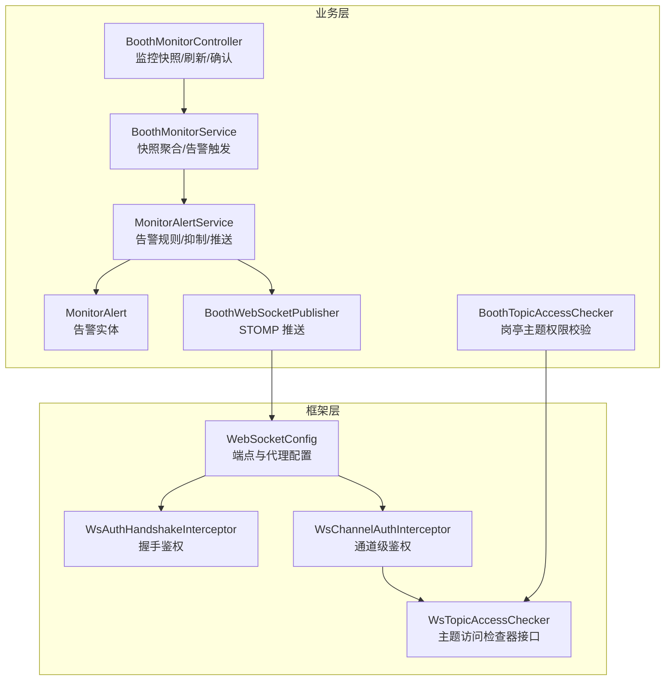
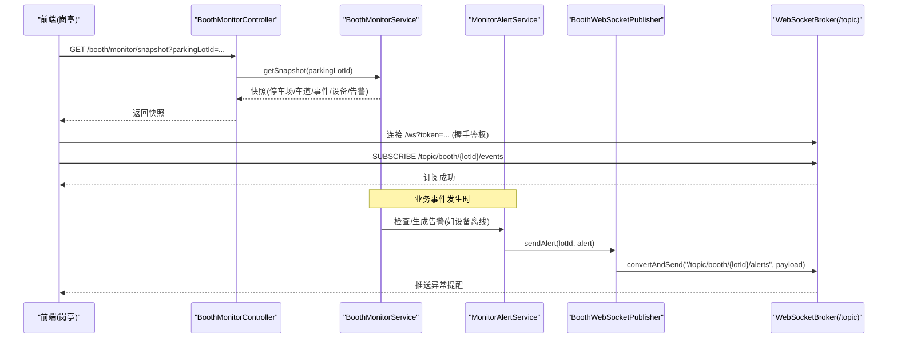
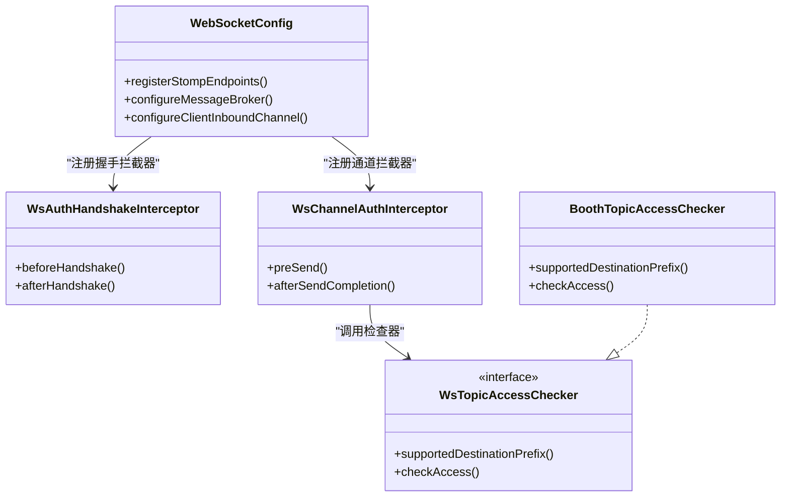
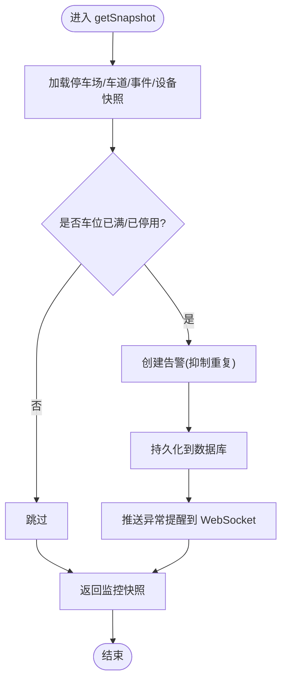
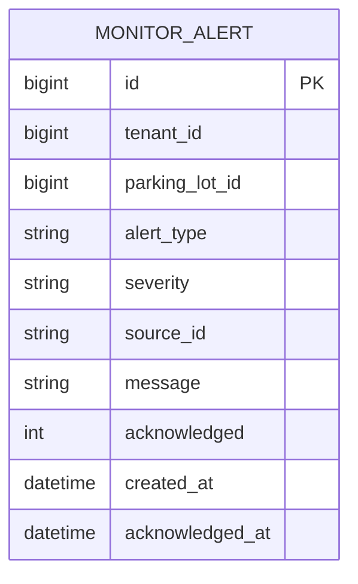
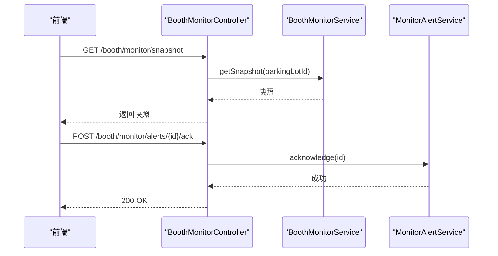
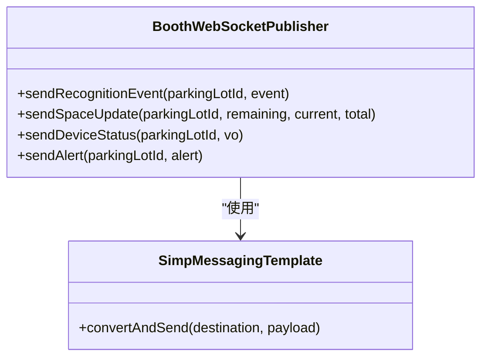
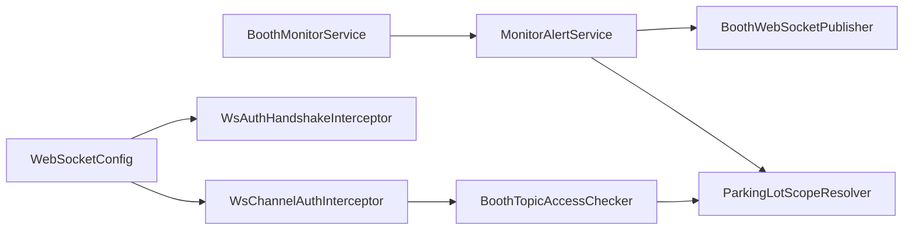

# 监控告警模块

<cite>
**本文引用的文件**   
- [WebSocketConfig.java](file://parking-framework/src/main/java/com/jushan/framework/ws/WebSocketConfig.java)
- [WsAuthHandshakeInterceptor.java](file://parking-framework/src/main/java/com/jushan/framework/ws/WsAuthHandshakeInterceptor.java)
- [WsChannelAuthInterceptor.java](file://parking-framework/src/main/java/com/jushan/framework/ws/WsChannelAuthInterceptor.java)
- [BoothTopicAccessChecker.java](file://parking-system/src/main/java/com/jushan/system/ws/BoothTopicAccessChecker.java)
- [BoothWebSocketPublisher.java](file://parking-system/src/main/java/com/jushan/system/ws/BoothWebSocketPublisher.java)
- [MonitorAlertService.java](file://parking-system/src/main/java/com/jushan/system/service/MonitorAlertService.java)
- [MonitorAlert.java](file://parking-system/src/main/java/com/jushan/system/entity/MonitorAlert.java)
- [BoothMonitorController.java](file://parking-system/src/main/java/com/jushan/system/controller/BoothMonitorController.java)
- [BoothMonitorService.java](file://parking-system/src/main/java/com/jushan/system/service/BoothMonitorService.java)
- [BoothMonitorWebSocketIntegrationTest.java](file://parking-boot/src/test/java/com/jushan/boot/ws/BoothMonitorWebSocketIntegrationTest.java)
</cite>

## 目录
1. [简介](#简介)
2. [项目结构](#项目结构)
3. [核心组件](#核心组件)
4. [架构总览](#架构总览)
5. [详细组件分析](#详细组件分析)
6. [依赖关系分析](#依赖关系分析)
7. [性能与高可用](#性能与高可用)
8. [故障排查指南](#故障排查指南)
9. [结论](#结论)
10. [附录](#附录)

## 简介
本技术文档聚焦“监控告警模块”，围绕以下目标展开：
- 实时监控设计：设备状态、车位变化、识别事件等实时数据推送。
- 告警规则配置与触发机制：基于设备离线、车位已满、停车场停用、识别失败等场景的告警生成与抑制策略。
- WebSocket 推送机制：STOMP over WebSocket 的连接管理、消息路由、鉴权与断线重连方案。
- 监控面板数据聚合、历史查询与趋势分析：快照接口与前端展示联动。
- 安全与权限：租户隔离、数据范围校验、平台用户与租户用户边界控制。
- 性能优化与高可用部署：内置代理与外部 STOMP Broker 扩展、Nginx 反向代理、水平扩展建议。

## 项目结构
后端采用分层架构，监控与告警相关能力分布在 framework（通用框架）与 system（业务系统）两个模块中：
- framework 层提供 WebSocket 基础能力（端点、拦截器、会话上下文、主题访问检查器 SPI）。
- system 层实现岗亭监控的业务逻辑（控制器、服务、实体、推送器、主题访问检查器）。
- 测试用例覆盖 WebSocket 订阅鉴权与错误处理路径。

图表来源
- [WebSocketConfig.java:1-92](file://parking-framework/src/main/java/com/jushan/framework/ws/WebSocketConfig.java#L1-L92)
- [WsAuthHandshakeInterceptor.java:1-140](file://parking-framework/src/main/java/com/jushan/framework/ws/WsAuthHandshakeInterceptor.java#L1-L140)
- [WsChannelAuthInterceptor.java:1-216](file://parking-framework/src/main/java/com/jushan/framework/ws/WsChannelAuthInterceptor.java#L1-L216)
- [BoothTopicAccessChecker.java:1-180](file://parking-system/src/main/java/com/jushan/system/ws/BoothTopicAccessChecker.java#L1-L180)
- [BoothMonitorController.java:1-76](file://parking-system/src/main/java/com/jushan/system/controller/BoothMonitorController.java#L1-L76)
- [BoothMonitorService.java:1-292](file://parking-system/src/main/java/com/jushan/system/service/BoothMonitorService.java#L1-L292)
- [MonitorAlertService.java:1-232](file://parking-system/src/main/java/com/jushan/system/service/MonitorAlertService.java#L1-L232)
- [MonitorAlert.java:1-101](file://parking-system/src/main/java/com/jushan/system/entity/MonitorAlert.java#L1-L101)
- [BoothWebSocketPublisher.java:1-177](file://parking-system/src/main/java/com/jushan/system/ws/BoothWebSocketPublisher.java#L1-L177)

章节来源
- [WebSocketConfig.java:1-92](file://parking-framework/src/main/java/com/jushan/framework/ws/WebSocketConfig.java#L1-L92)
- [BoothMonitorController.java:1-76](file://parking-system/src/main/java/com/jushan/system/controller/BoothMonitorController.java#L1-L76)
- [BoothMonitorService.java:1-292](file://parking-system/src/main/java/com/jushan/system/service/BoothMonitorService.java#L1-L292)
- [MonitorAlertService.java:1-232](file://parking-system/src/main/java/com/jushan/system/service/MonitorAlertService.java#L1-L232)
- [MonitorAlert.java:1-101](file://parking-system/src/main/java/com/jushan/system/entity/MonitorAlert.java#L1-L101)
- [BoothWebSocketPublisher.java:1-177](file://parking-system/src/main/java/com/jushan/system/ws/BoothWebSocketPublisher.java#L1-L177)
- [BoothTopicAccessChecker.java:1-180](file://parking-system/src/main/java/com/jushan/system/ws/BoothTopicAccessChecker.java#L1-L180)

## 核心组件
- WebSocket 基础配置与端点
  - 暴露 STOMP 端点 /ws，支持 SockJS 降级；配置应用前缀 /app、广播前缀 /topic、私信前缀 /user；注册握手与通道拦截器。
- 握手与通道鉴权
  - 握手阶段从 URL 参数或 Authorization 头提取 token，验证登录态并写入会话属性（含租户上下文）。
  - 通道层对 CONNECT/SUBSCRIBE/SEND/DISCONNECT 进行拦截，私有主题必须认证，且通过主题访问检查器执行数据范围校验。
- 岗亭主题访问检查器
  - 仅允许租户用户订阅 /topic/booth/{parkingLotId}/**，平台用户拒绝；解析 parkingLotId 并通过 ParkingLotScopeResolver 校验授权范围。
- 监控快照与告警服务
  - 快照聚合：停车场摘要、车道列表、最近识别事件、设备状态、未确认告警；在快照生成时触发停车场级告警（车位已满、已停用）。
  - 告警规则：设备离线、车位已满、停车场停用、识别失败；具备同类型未确认告警抑制（避免重复推送）。
- WebSocket 推送器
  - 按停车场维度向 /topic/booth/{parkingLotId}/events|spaces|device-status|alerts 推送识别事件、车位变化、设备状态、异常提醒；推送失败不阻断主业务。
- 监控控制器
  - 提供监控快照、刷新设备状态、确认告警等 REST 接口，配合 WebSocket 实时推送形成完整闭环。

章节来源
- [WebSocketConfig.java:1-92](file://parking-framework/src/main/java/com/jushan/framework/ws/WebSocketConfig.java#L1-L92)
- [WsAuthHandshakeInterceptor.java:1-140](file://parking-framework/src/main/java/com/jushan/framework/ws/WsAuthHandshakeInterceptor.java#L1-L140)
- [WsChannelAuthInterceptor.java:1-216](file://parking-framework/src/main/java/com/jushan/framework/ws/WsChannelAuthInterceptor.java#L1-L216)
- [BoothTopicAccessChecker.java:1-180](file://parking-system/src/main/java/com/jushan/system/ws/BoothTopicAccessChecker.java#L1-L180)
- [BoothMonitorService.java:1-292](file://parking-system/src/main/java/com/jushan/system/service/BoothMonitorService.java#L1-L292)
- [MonitorAlertService.java:1-232](file://parking-system/src/main/java/com/jushan/system/service/MonitorAlertService.java#L1-L232)
- [BoothWebSocketPublisher.java:1-177](file://parking-system/src/main/java/com/jushan/system/ws/BoothWebSocketPublisher.java#L1-L177)
- [BoothMonitorController.java:1-76](file://parking-system/src/main/java/com/jushan/system/controller/BoothMonitorController.java#L1-L76)

## 架构总览
整体采用“REST 初始化 + WebSocket 实时推送”的双通道模式：
- 客户端先通过 REST 获取监控快照（包含设备、车道、事件、告警），随后建立 WebSocket 连接订阅对应停车场的主题。
- 服务端在关键业务节点（识别事件、车位变化、设备状态变更、告警产生）通过 STOMP 推送至前端。

图表来源
- [BoothMonitorController.java:1-76](file://parking-system/src/main/java/com/jushan/system/controller/BoothMonitorController.java#L1-L76)
- [BoothMonitorService.java:1-292](file://parking-system/src/main/java/com/jushan/system/service/BoothMonitorService.java#L1-L292)
- [MonitorAlertService.java:1-232](file://parking-system/src/main/java/com/jushan/system/service/MonitorAlertService.java#L1-L232)
- [BoothWebSocketPublisher.java:1-177](file://parking-system/src/main/java/com/jushan/system/ws/BoothWebSocketPublisher.java#L1-L177)
- [WebSocketConfig.java:1-92](file://parking-framework/src/main/java/com/jushan/framework/ws/WebSocketConfig.java#L1-L92)

## 详细组件分析

### WebSocket 配置与安全链路
- 端点与代理
  - 端点路径 /ws，启用 SockJS 降级；配置 /app、/topic、/queue、/user 前缀；注册握手与通道拦截器。
- 握手鉴权
  - 从 URL 参数 token 或 Authorization 头提取令牌，验证登录态并将 loginId、tenantId、userType 写入握手属性。
- 通道鉴权
  - CONNECT：回填会话上下文；SUBSCRIBE：公共主题放行，私有主题需认证并调用主题访问检查器；SEND：禁止非公开目标；DISCONNECT：清理上下文。
- 主题访问检查器
  - 针对 /topic/booth/{parkingLotId}/** 解析 parkingLotId，校验租户用户身份与数据范围，平台用户直接拒绝。

图表来源
- [WebSocketConfig.java:1-92](file://parking-framework/src/main/java/com/jushan/framework/ws/WebSocketConfig.java#L1-L92)
- [WsAuthHandshakeInterceptor.java:1-140](file://parking-framework/src/main/java/com/jushan/framework/ws/WsAuthHandshakeInterceptor.java#L1-L140)
- [WsChannelAuthInterceptor.java:1-216](file://parking-framework/src/main/java/com/jushan/framework/ws/WsChannelAuthInterceptor.java#L1-L216)
- [BoothTopicAccessChecker.java:1-180](file://parking-system/src/main/java/com/jushan/system/ws/BoothTopicAccessChecker.java#L1-L180)

章节来源
- [WebSocketConfig.java:1-92](file://parking-framework/src/main/java/com/jushan/framework/ws/WebSocketConfig.java#L1-L92)
- [WsAuthHandshakeInterceptor.java:1-140](file://parking-framework/src/main/java/com/jushan/framework/ws/WsAuthHandshakeInterceptor.java#L1-L140)
- [WsChannelAuthInterceptor.java:1-216](file://parking-framework/src/main/java/com/jushan/framework/ws/WsChannelAuthInterceptor.java#L1-L216)
- [BoothTopicAccessChecker.java:1-180](file://parking-system/src/main/java/com/jushan/system/ws/BoothTopicAccessChecker.java#L1-L180)

### 监控快照与告警触发流程
- 快照聚合
  - 读取停车场信息、车道列表、最近识别事件、设备最新快照，并在快照生成时触发停车场级告警（车位已满、已停用）。
- 告警规则与抑制
  - 设备离线：根据设备在线性、查询成功率、快照新鲜度判断；若存在同类型未确认告警则抑制。
  - 车位已满/停车场停用：在快照生成时检测并生成告警。
  - 识别失败：由识别事件处理失败分支触发。
- 推送与持久化
  - 告警记录入库后，通过 BoothWebSocketPublisher 推送到 /topic/booth/{lotId}/alerts。

图表来源
- [BoothMonitorService.java:1-292](file://parking-system/src/main/java/com/jushan/system/service/BoothMonitorService.java#L1-L292)
- [MonitorAlertService.java:1-232](file://parking-system/src/main/java/com/jushan/system/service/MonitorAlertService.java#L1-L232)
- [BoothWebSocketPublisher.java:1-177](file://parking-system/src/main/java/com/jushan/system/ws/BoothWebSocketPublisher.java#L1-L177)

章节来源
- [BoothMonitorService.java:1-292](file://parking-system/src/main/java/com/jushan/system/service/BoothMonitorService.java#L1-L292)
- [MonitorAlertService.java:1-232](file://parking-system/src/main/java/com/jushan/system/service/MonitorAlertService.java#L1-L232)
- [MonitorAlert.java:1-101](file://parking-system/src/main/java/com/jushan/system/entity/MonitorAlert.java#L1-L101)
- [BoothWebSocketPublisher.java:1-177](file://parking-system/src/main/java/com/jushan/system/ws/BoothWebSocketPublisher.java#L1-L177)

### 告警实体与级别定义
- 告警类型
  - 设备离线、车位已满、停车场停用、识别失败。
- 严重程度
  - WARNING（警告）、CRITICAL（严重）。
- 字段说明
  - 包含租户 ID、停车场 ID、类型、严重程度、来源 ID、描述、是否已确认、创建时间、确认时间。

图表来源
- [MonitorAlert.java:1-101](file://parking-system/src/main/java/com/jushan/system/entity/MonitorAlert.java#L1-L101)

章节来源
- [MonitorAlert.java:1-101](file://parking-system/src/main/java/com/jushan/system/entity/MonitorAlert.java#L1-L101)

### 控制器与前端交互
- 监控快照接口
  - GET /booth/monitor/snapshot?parkingLotId=...，返回聚合后的监控快照。
- 刷新设备状态
  - POST /booth/monitor/devices/refresh?parkingLotId=...，触发远程设备状态查询并返回最新快照。
- 确认告警
  - POST /booth/monitor/alerts/{alertId}/ack，将告警标记为已确认。

图表来源
- [BoothMonitorController.java:1-76](file://parking-system/src/main/java/com/jushan/system/controller/BoothMonitorController.java#L1-L76)
- [BoothMonitorService.java:1-292](file://parking-system/src/main/java/com/jushan/system/service/BoothMonitorService.java#L1-L292)
- [MonitorAlertService.java:1-232](file://parking-system/src/main/java/com/jushan/system/service/MonitorAlertService.java#L1-L232)

章节来源
- [BoothMonitorController.java:1-76](file://parking-system/src/main/java/com/jushan/system/controller/BoothMonitorController.java#L1-L76)

### WebSocket 推送器与主题约定
- 主题约定
  - /topic/booth/{parkingLotId}/events：识别事件
  - /topic/booth/{parkingLotId}/spaces：车位变化
  - /topic/booth/{parkingLotId}/device-status：设备状态
  - /topic/booth/{parkingLotId}/alerts：异常提醒
- 推送特性
  - 所有推送方法内部捕获异常，确保推送失败不影响主业务事务；按停车场维度广播。

图表来源
- [BoothWebSocketPublisher.java:1-177](file://parking-system/src/main/java/com/jushan/system/ws/BoothWebSocketPublisher.java#L1-L177)

章节来源
- [BoothWebSocketPublisher.java:1-177](file://parking-system/src/main/java/com/jushan/system/ws/BoothWebSocketPublisher.java#L1-L177)

### 集成测试与行为验证
- 测试覆盖
  - 授权订阅成功、未授权订阅被拒绝、平台用户禁止订阅、匿名连接被拒绝。
- 关键断言
  - 订阅成功后获得有效 subscriptionId；未授权或平台用户订阅会收到 ERROR 帧；匿名连接无法建立。

章节来源
- [BoothMonitorWebSocketIntegrationTest.java:1-329](file://parking-boot/src/test/java/com/jushan/boot/ws/BoothMonitorWebSocketIntegrationTest.java#L1-L329)

## 依赖关系分析
- 组件耦合
  - BoothMonitorService 依赖多个 Mapper 与 DeviceService 完成快照聚合；同时依赖 MonitorAlertService 触发告警。
  - MonitorAlertService 依赖 BoothWebSocketPublisher 进行推送，依赖 ParkingLotScopeResolver 做数据范围校验。
  - BoothTopicAccessChecker 依赖 ParkingLotScopeResolver 与 Sa-Token 会话构建 TenantContext 快照。
- 外部依赖
  - STOMP Broker：当前使用内置 Simple Broker，生产环境可切换为外部 STOMP Broker（如 RabbitMQ STOMP plugin）。
  - 鉴权：Sa-Token 用于登录态与会话上下文管理。

图表来源
- [BoothMonitorService.java:1-292](file://parking-system/src/main/java/com/jushan/system/service/BoothMonitorService.java#L1-L292)
- [MonitorAlertService.java:1-232](file://parking-system/src/main/java/com/jushan/system/service/MonitorAlertService.java#L1-L232)
- [BoothTopicAccessChecker.java:1-180](file://parking-system/src/main/java/com/jushan/system/ws/BoothTopicAccessChecker.java#L1-L180)
- [WebSocketConfig.java:1-92](file://parking-framework/src/main/java/com/jushan/framework/ws/WebSocketConfig.java#L1-L92)

章节来源
- [BoothMonitorService.java:1-292](file://parking-system/src/main/java/com/jushan/system/service/BoothMonitorService.java#L1-L292)
- [MonitorAlertService.java:1-232](file://parking-system/src/main/java/com/jushan/system/service/MonitorAlertService.java#L1-L232)
- [BoothTopicAccessChecker.java:1-180](file://parking-system/src/main/java/com/jushan/system/ws/BoothTopicAccessChecker.java#L1-L180)
- [WebSocketConfig.java:1-92](file://parking-framework/src/main/java/com/jushan/framework/ws/WebSocketConfig.java#L1-L92)

## 性能与高可用
- 推送解耦与容错
  - 推送失败不阻断主业务事务，降低实时推送对核心流程的影响。
- 代理与扩展
  - 当前使用内置 Simple Broker，生产环境建议启用外部 STOMP Broker（如 RabbitMQ STOMP plugin），并由 Nginx 代理 WebSocket 连接，便于水平扩展与跨实例广播。
- 鉴权开销
  - 握手与通道拦截器仅在连接建立与消息收发时执行，开销可控；主题访问检查器仅对私有主题生效。
- 快照聚合优化
  - 快照聚合涉及多次数据库查询，建议在热点场景引入缓存（如 Redis）减少远端设备状态查询与历史事件读取压力。
- 消息队列集成
  - 可在告警生成与推送之间引入消息队列缓冲，削峰填谷，提升稳定性与吞吐。

[本节为通用指导，无需源码引用]

## 故障排查指南
- 连接与鉴权问题
  - 匿名连接被拒绝：检查是否携带有效 token（URL 参数或 Authorization 头）。
  - 平台用户订阅岗亭主题被拒绝：确认用户类型为租户用户且具备停车场授权范围。
  - 未授权停车场 topic 订阅报错：检查 ParkingLotScopeResolver 授权范围是否正确。
- 推送问题
  - 推送失败日志：关注 warn 级别日志，定位具体 destination 与错误原因；确认客户端订阅主题与连接状态。
- 快照与告警
  - 快照缺失或延迟：检查设备状态查询与历史事件读取的性能瓶颈；必要时引入缓存或分页限制。
  - 告警重复：确认告警抑制逻辑是否生效（同类型未确认告警不再重复生成）。

章节来源
- [WsAuthHandshakeInterceptor.java:1-140](file://parking-framework/src/main/java/com/jushan/framework/ws/WsAuthHandshakeInterceptor.java#L1-L140)
- [WsChannelAuthInterceptor.java:1-216](file://parking-framework/src/main/java/com/jushan/framework/ws/WsChannelAuthInterceptor.java#L1-L216)
- [BoothTopicAccessChecker.java:1-180](file://parking-system/src/main/java/com/jushan/system/ws/BoothTopicAccessChecker.java#L1-L180)
- [BoothWebSocketPublisher.java:1-177](file://parking-system/src/main/java/com/jushan/system/ws/BoothWebSocketPublisher.java#L1-L177)
- [MonitorAlertService.java:1-232](file://parking-system/src/main/java/com/jushan/system/service/MonitorAlertService.java#L1-L232)

## 结论
监控告警模块以“REST 快照 + WebSocket 实时推送”为核心，结合严格的握手与通道鉴权、细粒度的主题访问控制，实现了面向岗亭端的设备状态监控、识别事件跟踪与异常提醒。告警规则具备抑制策略，推送过程具备容错保障。生产环境可通过外部 STOMP Broker 与 Nginx 反向代理实现高可用与水平扩展，并结合缓存与消息队列进一步优化性能与稳定性。

[本节为总结，无需源码引用]

## 附录
- 主题命名约定
  - /topic/booth/{parkingLotId}/events
  - /topic/booth/{parkingLotId}/spaces
  - /topic/booth/{parkingLotId}/device-status
  - /topic/booth/{parkingLotId}/alerts
- 接口清单
  - GET /booth/monitor/snapshot?parkingLotId=...
  - POST /booth/monitor/devices/refresh?parkingLotId=...
  - POST /booth/monitor/alerts/{alertId}/ack

章节来源
- [BoothMonitorController.java:1-76](file://parking-system/src/main/java/com/jushan/system/controller/BoothMonitorController.java#L1-L76)
- [BoothWebSocketPublisher.java:1-177](file://parking-system/src/main/java/com/jushan/system/ws/BoothWebSocketPublisher.java#L1-L177)