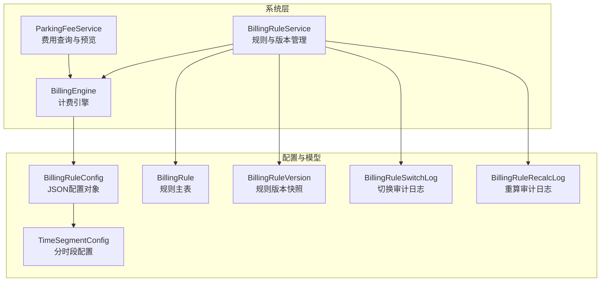
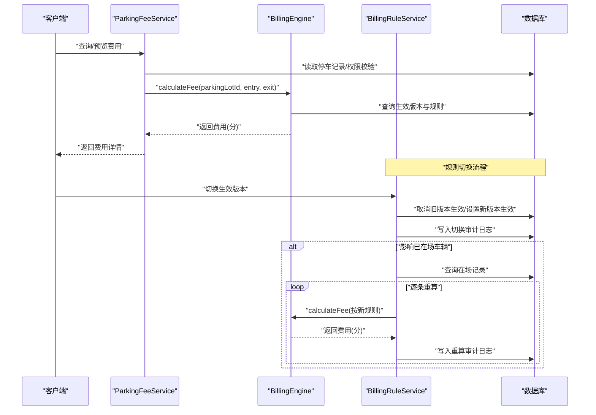
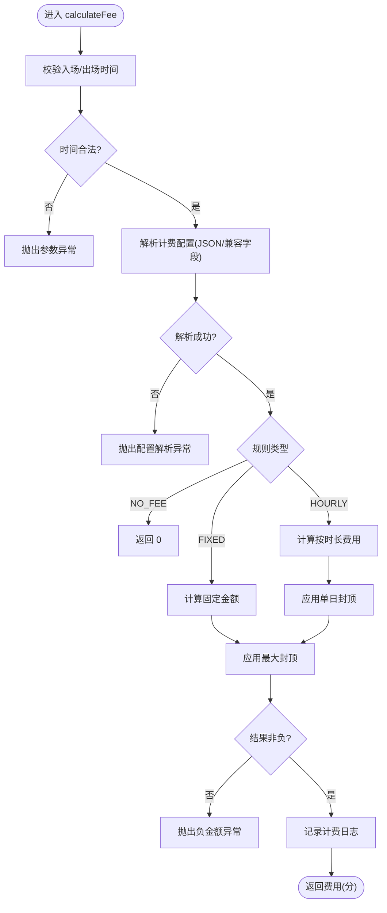
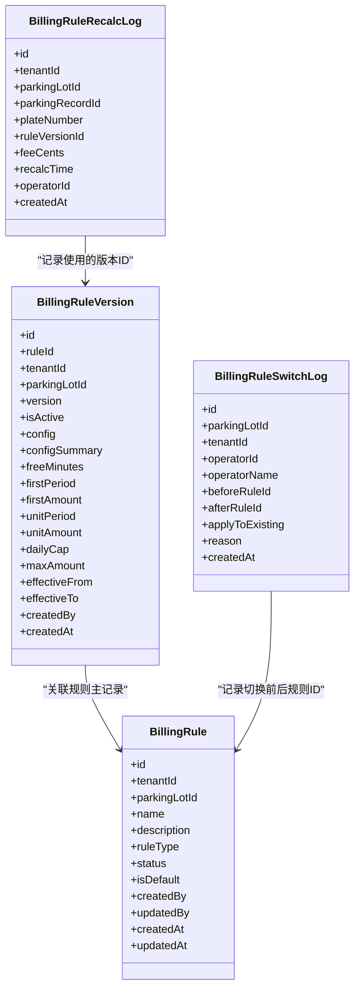
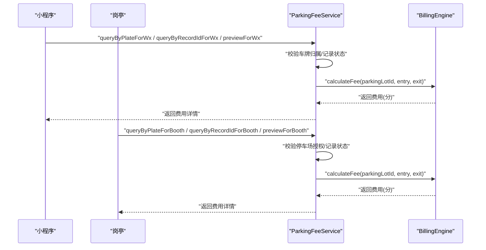
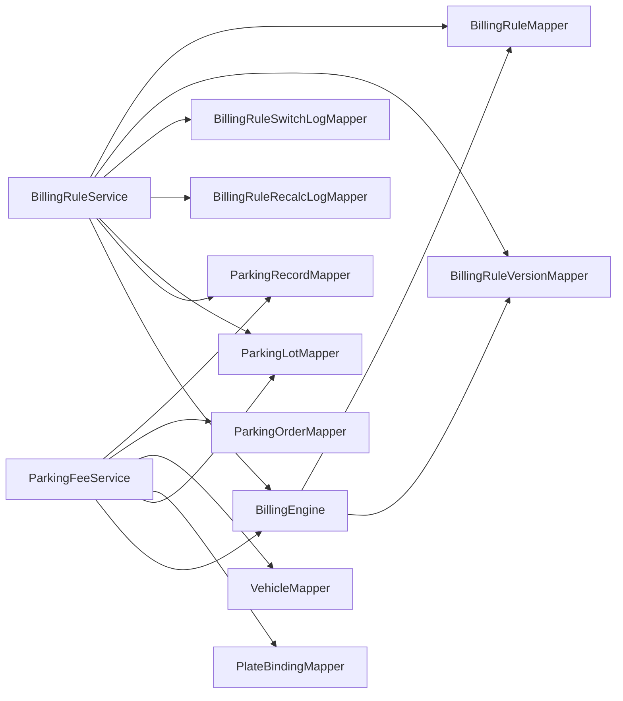

# 计费引擎模块

<cite>
**本文引用的文件**   
- [BillingEngine.java](file://parking-system/src/main/java/com/jushan/system/service/BillingEngine.java)
- [BillingRuleService.java](file://parking-system/src/main/java/com/jushan/system/service/BillingRuleService.java)
- [ParkingFeeService.java](file://parking-system/src/main/java/com/jushan/system/service/ParkingFeeService.java)
- [BillingRuleConfig.java](file://parking-system/src/main/java/com/jushan/system/service/BillingRuleConfig.java)
- [TimeSegmentConfig.java](file://parking-system/src/main/java/com/jushan/system/service/TimeSegmentConfig.java)
- [BillingRule.java](file://parking-system/src/main/java/com/jushan/system/entity/BillingRule.java)
- [BillingRuleVersion.java](file://parking-system/src/main/java/com/jushan/system/entity/BillingRuleVersion.java)
- [BillingRuleSwitchLog.java](file://parking-system/src/main/java/com/jushan/system/entity/BillingRuleSwitchLog.java)
- [BillingRuleRecalcLog.java](file://parking-system/src/main/java/com/jushan/system/entity/BillingRuleRecalcLog.java)
- [BillingEngineTest.java](file://parking-boot/src/test/java/com/jushan/boot/service/BillingEngineTest.java)
</cite>

## 目录
1. [简介](#简介)
2. [项目结构](#项目结构)
3. [核心组件](#核心组件)
4. [架构总览](#架构总览)
5. [详细组件分析](#详细组件分析)
6. [依赖关系分析](#依赖关系分析)
7. [性能与高并发](#性能与高并发)
8. [故障排查指南](#故障排查指南)
9. [结论](#结论)
10. [附录](#附录)

## 简介
本技术文档围绕“计费引擎模块”展开，系统性说明计费规则设计、费用计算算法、版本管理与切换流程、重算日志机制、扩展点与自定义策略实现指南，以及计费精度控制、四舍五入规则与财务对账要求。同时给出性能优化与缓存策略建议，覆盖高并发场景下的处理方案。

## 项目结构
计费引擎位于 parking-system 服务中，核心由以下部分组成：
- 计费引擎：负责根据生效规则版本计算费用，支持免费、固定金额、按时长计费（含分时段、单日封顶、最大封顶）。
- 规则服务：负责收费规则的 CRUD、版本管理、切换与审计日志记录，并支持按新规则对在场车辆进行重新计算。
- 费用查询服务：面向小程序与岗亭的查询与结算预览入口，调用计费引擎完成实时计费。
- 配置模型：以 JSON 形式存储计费配置，包含基础参数与分时段配置。
- 实体与日志：规则主表、版本快照、切换审计日志、重算审计日志。

图表来源
- [BillingEngine.java:1-128](file://parking-system/src/main/java/com/jushan/system/service/BillingEngine.java#L1-L128)
- [BillingRuleService.java:307-372](file://parking-system/src/main/java/com/jushan/system/service/BillingRuleService.java#L307-L372)
- [ParkingFeeService.java:317-353](file://parking-system/src/main/java/com/jushan/system/service/ParkingFeeService.java#L317-L353)
- [BillingRuleConfig.java:1-118](file://parking-system/src/main/java/com/jushan/system/service/BillingRuleConfig.java#L1-L118)
- [TimeSegmentConfig.java:1-58](file://parking-system/src/main/java/com/jushan/system/service/TimeSegmentConfig.java#L1-L58)
- [BillingRule.java:1-105](file://parking-system/src/main/java/com/jushan/system/entity/BillingRule.java#L1-L105)
- [BillingRuleVersion.java:1-138](file://parking-system/src/main/java/com/jushan/system/entity/BillingRuleVersion.java#L1-L138)
- [BillingRuleSwitchLog.java:1-83](file://parking-system/src/main/java/com/jushan/system/entity/BillingRuleSwitchLog.java#L1-L83)
- [BillingRuleRecalcLog.java:1-83](file://parking-system/src/main/java/com/jushan/system/entity/BillingRuleRecalcLog.java#L1-L83)

章节来源
- [BillingEngine.java:1-128](file://parking-system/src/main/java/com/jushan/system/service/BillingEngine.java#L1-L128)
- [BillingRuleService.java:101-144](file://parking-system/src/main/java/com/jushan/system/service/BillingRuleService.java#L101-L144)
- [ParkingFeeService.java:84-131](file://parking-system/src/main/java/com/jushan/system/service/ParkingFeeService.java#L84-L131)

## 核心组件
- 计费引擎（BillingEngine）
  - 职责：解析生效规则版本与配置，执行免费、固定金额、按时长计费；支持分时段计费、单日封顶、最大封顶；严格校验时间与配置冲突。
  - 关键能力：
    - 基于停车场 ID 查找生效版本与规则主记录，校验启用状态。
    - 基于指定版本直接计算（不校验规则启用状态），用于测试与重算。
    - 分时段匹配与边界截断，跨午夜时段支持。
    - 按自然日拆分区间成本，应用单日封顶；最终应用最大封顶。
    - 金额统一使用整数分，禁止浮点数；负值抛异常。
- 规则服务（BillingRuleService）
  - 职责：规则创建、更新（变更时创建新版本）、分页查询、版本历史、切换生效版本、切换审计日志、影响已在场车辆的重算与审计。
  - 关键能力：
    - 版本不可修改，每次变更创建新版本；首个版本自动生效。
    - 切换时需校验目标规则所属停车场、启用状态，写入切换审计日志。
    - 可选“影响已在场车辆”，遍历当前在场记录，按新规则重新计算并记录重算审计日志。
- 费用查询服务（ParkingFeeService）
  - 职责：为小程序与岗亭提供费用查询与结算预览；不修改停车记录与订单状态。
  - 关键能力：
    - 小程序端需校验车牌归属当前微信用户；岗亭端需校验停车场授权范围。
    - 预览模式允许指定出场时间，但不得早于入场时间。
    - 返回费用、时长、免费时段信息、是否可支付、是否存在待支付订单等。

章节来源
- [BillingEngine.java:75-128](file://parking-system/src/main/java/com/jushan/system/service/BillingEngine.java#L75-L128)
- [BillingRuleService.java:307-372](file://parking-system/src/main/java/com/jushan/system/service/BillingRuleService.java#L307-L372)
- [ParkingFeeService.java:317-353](file://parking-system/src/main/java/com/jushan/system/service/ParkingFeeService.java#L317-L353)

## 架构总览
计费引擎作为纯计算内核，被上层服务通过接口调用。规则服务负责版本管理与切换，费用查询服务负责对外暴露查询与预览能力。

图表来源
- [ParkingFeeService.java:317-353](file://parking-system/src/main/java/com/jushan/system/service/ParkingFeeService.java#L317-L353)
- [BillingEngine.java:75-128](file://parking-system/src/main/java/com/jushan/system/service/BillingEngine.java#L75-L128)
- [BillingRuleService.java:307-372](file://parking-system/src/main/java/com/jushan/system/service/BillingRuleService.java#L307-L372)

## 详细组件分析

### 计费引擎（BillingEngine）
- 支持的计费模式
  - 免费（NO_FEE）：直接返回 0。
  - 固定金额（FIXED）：优先使用 fixedAmount，否则回退到 firstAmount；非负校验。
  - 按时长（HOURLY）：首时段 + 后续单位时段；支持分时段单价、单日封顶、最大封顶。
- 计费规则优先级与匹配
  - 先按停车场 ID 查找生效版本，再查规则主记录并校验启用状态。
  - 若直接传入版本与规则类型，则跳过启用状态校验（供测试与重算）。
- 时间分段计算
  - 分时段配置支持跨午夜时段；当处于某时段内时，将当前计费块截断至时段边界。
  - 若未处于任何时段，则找到下一个时段起点作为边界。
  - 分时段冲突检测：同一时刻仅能匹配一个时段，冲突则失败关闭。
- 封顶策略
  - 单日封顶：按自然日拆分区间成本，每日封顶后求和。
  - 最大封顶：在所有封顶之后，再次取最小值。
- 精度与四舍五入
  - 金额统一使用整数分；跨天拆分采用按比例分配确保两部分之和等于原费用。
  - 无显式四舍五入逻辑，避免浮点误差；所有输入输出均为整型分。
- 错误处理
  - 无生效规则、规则不存在或已禁用、时间非法、配置解析失败、分时段冲突、负金额等均抛出业务异常。

图表来源
- [BillingEngine.java:103-128](file://parking-system/src/main/java/com/jushan/system/service/BillingEngine.java#L103-L128)
- [BillingEngine.java:193-250](file://parking-system/src/main/java/com/jushan/system/service/BillingEngine.java#L193-L250)
- [BillingEngine.java:322-356](file://parking-system/src/main/java/com/jushan/system/service/BillingEngine.java#L322-L356)

章节来源
- [BillingEngine.java:75-128](file://parking-system/src/main/java/com/jushan/system/service/BillingEngine.java#L75-L128)
- [BillingEngine.java:193-250](file://parking-system/src/main/java/com/jushan/system/service/BillingEngine.java#L193-L250)
- [BillingEngine.java:252-320](file://parking-system/src/main/java/com/jushan/system/service/BillingEngine.java#L252-L320)
- [BillingEngine.java:322-356](file://parking-system/src/main/java/com/jushan/system/service/BillingEngine.java#L322-L356)

### 规则与版本管理（BillingRuleService）
- 规则创建与初始版本
  - 创建规则后自动生成首个版本，默认生效。
- 规则更新与版本演进
  - 基本信息更新不影响版本；计费配置变更时创建新版本。
  - 版本不可修改，保留完整历史。
- 切换生效版本
  - 校验目标规则所属停车场、启用状态。
  - 取消旧版本生效，设置新版本生效。
  - 写入切换审计日志；可选择“影响已在场车辆”。
- 重算与审计
  - 对当前在场记录按新规则重新计算费用，逐条记录重算审计日志。
  - 单条重算失败不影响整体流程，记录警告并跳过。

图表来源
- [BillingRule.java:1-105](file://parking-system/src/main/java/com/jushan/system/entity/BillingRule.java#L1-L105)
- [BillingRuleVersion.java:1-138](file://parking-system/src/main/java/com/jushan/system/entity/BillingRuleVersion.java#L1-L138)
- [BillingRuleSwitchLog.java:1-83](file://parking-system/src/main/java/com/jushan/system/entity/BillingRuleSwitchLog.java#L1-L83)
- [BillingRuleRecalcLog.java:1-83](file://parking-system/src/main/java/com/jushan/system/entity/BillingRuleRecalcLog.java#L1-L83)

章节来源
- [BillingRuleService.java:101-144](file://parking-system/src/main/java/com/jushan/system/service/BillingRuleService.java#L101-L144)
- [BillingRuleService.java:158-226](file://parking-system/src/main/java/com/jushan/system/service/BillingRuleService.java#L158-L226)
- [BillingRuleService.java:307-372](file://parking-system/src/main/java/com/jushan/system/service/BillingRuleService.java#L307-L372)
- [BillingRuleService.java:554-591](file://parking-system/src/main/java/com/jushan/system/service/BillingRuleService.java#L554-L591)

### 费用查询与预览（ParkingFeeService）
- 小程序端
  - 按车牌查询：校验车牌归属当前微信用户，且仅返回唯一在场记录。
  - 按记录 ID 查询：校验记录存在与归属。
  - 结算预览：允许指定出场时间，但不允许早于入场时间。
- 岗亭端
  - 按停车场+车牌查询：校验停车场授权范围。
  - 按记录 ID 查询：校验记录存在与授权范围。
  - 结算预览：同上。
- 返回内容
  - 费用（分）、时长（分钟）、免费时段、是否可支付、是否存在待支付订单、规则版本信息等。

图表来源
- [ParkingFeeService.java:84-131](file://parking-system/src/main/java/com/jushan/system/service/ParkingFeeService.java#L84-L131)
- [ParkingFeeService.java:142-172](file://parking-system/src/main/java/com/jushan/system/service/ParkingFeeService.java#L142-L172)
- [ParkingFeeService.java:317-353](file://parking-system/src/main/java/com/jushan/system/service/ParkingFeeService.java#L317-L353)

章节来源
- [ParkingFeeService.java:84-131](file://parking-system/src/main/java/com/jushan/system/service/ParkingFeeService.java#L84-L131)
- [ParkingFeeService.java:142-172](file://parking-system/src/main/java/com/jushan/system/service/ParkingFeeService.java#L142-L172)
- [ParkingFeeService.java:317-353](file://parking-system/src/main/java/com/jushan/system/service/ParkingFeeService.java#L317-L353)

### 计费配置模型（BillingRuleConfig 与 TimeSegmentConfig）
- BillingRuleConfig
  - 字段：免费时长、首时段、首时段金额、单位时长、单位金额、单日封顶、最大封顶、固定金额、分时段列表。
  - 金额统一使用整数分；缺失字段按 0 或默认值处理。
- TimeSegmentConfig
  - 字段：开始时间、结束时间（HH:mm）、该时段单位时长、该时段单位金额。
  - 支持跨午夜时段；为空则继承基础配置。

章节来源
- [BillingRuleConfig.java:1-118](file://parking-system/src/main/java/com/jushan/system/service/BillingRuleConfig.java#L1-L118)
- [TimeSegmentConfig.java:1-58](file://parking-system/src/main/java/com/jushan/system/service/TimeSegmentConfig.java#L1-L58)

### 单元测试与行为验证（BillingEngineTest）
- 覆盖场景
  - 免费规则返回 0。
  - 按时长规则收取首时段与后续单位费用。
  - 最大封顶限制。
  - 跨天按自然日单日封顶。
  - 分时段计费按所在时段单价计算。
  - 分时段规则冲突失败关闭。
  - 出场时间早于入场时间抛异常。
  - 直接基于版本计算不校验规则启用状态。

章节来源
- [BillingEngineTest.java:97-161](file://parking-boot/src/test/java/com/jushan/boot/service/BillingEngineTest.java#L97-L161)
- [BillingEngineTest.java:164-195](file://parking-boot/src/test/java/com/jushan/boot/service/BillingEngineTest.java#L164-L195)
- [BillingEngineTest.java:197-207](file://parking-boot/src/test/java/com/jushan/boot/service/BillingEngineTest.java#L197-L207)

## 依赖关系分析
- 计费引擎依赖
  - 数据访问：规则主表、规则版本表。
  - 配置解析：ObjectMapper 反序列化 JSON 配置。
- 规则服务依赖
  - 数据访问：规则主表、版本表、切换审计日志表、重算审计日志表、停车场表、停车记录表。
  - 计费引擎：用于重算在场车辆费用。
- 费用查询服务依赖
  - 数据访问：停车记录表、订单表、车辆表、车牌绑定表、停车场表。
  - 计费引擎：实时计费。

图表来源
- [BillingEngine.java:54-64](file://parking-system/src/main/java/com/jushan/system/service/BillingEngine.java#L54-L64)
- [BillingRuleService.java:64-89](file://parking-system/src/main/java/com/jushan/system/service/BillingRuleService.java#L64-L89)
- [ParkingFeeService.java:49-74](file://parking-system/src/main/java/com/jushan/system/service/ParkingFeeService.java#L49-L74)

章节来源
- [BillingEngine.java:54-64](file://parking-system/src/main/java/com/jushan/system/service/BillingEngine.java#L54-L64)
- [BillingRuleService.java:64-89](file://parking-system/src/main/java/com/jushan/system/service/BillingRuleService.java#L64-L89)
- [ParkingFeeService.java:49-74](file://parking-system/src/main/java/com/jushan/system/service/ParkingFeeService.java#L49-L74)

## 性能与高并发
- 计算复杂度
  - 按时长计费按单位时长循环生成计费区间，复杂度 O(N)，N 为计费区间数（通常较小）。
  - 分时段匹配线性扫描，复杂度 O(M)，M 为时段数量。
- 缓存策略建议
  - 生效版本缓存：按停车场 ID 缓存生效版本与规则主记录，TTL 短（如 1-5 分钟），降低热点查询压力。
  - 配置摘要缓存：规则版本配置摘要可缓存，减少 JSON 解析开销。
  - 注意：缓存失效需与规则切换事件联动，保证一致性。
- 高并发处理
  - 规则切换写路径加分布式锁（按停车场 ID），防止并发切换导致状态不一致。
  - 重算批量任务：对大量在场记录的重算应分批异步执行，避免阻塞切换接口。
  - 幂等性：重算日志写入具备幂等键（如 recordId + versionId），避免重复插入。
- 精度与对账
  - 金额统一使用整数分，避免浮点误差。
  - 跨天拆分按比例分配，确保各段之和等于原费用，便于财务对账。
  - 建议增加对账报表：按日期汇总费用、封顶减免、重算差异等。

[本节为通用指导，无需具体文件引用]

## 故障排查指南
- 常见异常与定位
  - “出场时间早于入场时间”：检查请求时间参数与系统时间同步。
  - “计费配置解析失败”：检查 billing_rule_version.config JSON 格式与字段完整性。
  - “分时段计费规则存在冲突”：检查 timeSegments 时间段是否重叠。
  - “当前收费规则已禁用”：确认规则主记录状态是否为启用。
  - “停车场未配置生效的收费规则”：确认存在 isActive=1 的版本记录。
- 日志与审计
  - 切换审计日志：查看 beforeRuleId、afterRuleId、applyToExisting、reason。
  - 重算审计日志：核对 ruleVersionId、feeCents、recalcTime、operatorId。
- 快速恢复
  - 修正配置后重新切换生效版本。
  - 对受影响记录触发重算，并比对重算日志与预期结果。

章节来源
- [BillingEngine.java:151-158](file://parking-system/src/main/java/com/jushan/system/service/BillingEngine.java#L151-L158)
- [BillingEngine.java:174-179](file://parking-system/src/main/java/com/jushan/system/service/BillingEngine.java#L174-L179)
- [BillingEngine.java:252-269](file://parking-system/src/main/java/com/jushan/system/service/BillingEngine.java#L252-L269)
- [BillingRuleService.java:307-372](file://parking-system/src/main/java/com/jushan/system/service/BillingRuleService.java#L307-L372)
- [BillingRuleService.java:554-591](file://parking-system/src/main/java/com/jushan/system/service/BillingRuleService.java#L554-L591)

## 结论
计费引擎模块以清晰的分层设计与严格的失败关闭策略，实现了免费、固定金额、按时长计费三大模式，并支持分时段计费、单日封顶与最大封顶。版本管理与切换流程完善，配合切换与重算审计日志，保障计费的可追溯性与一致性。在精度控制方面，统一使用整数分，避免浮点误差，满足财务对账要求。结合缓存与并发控制建议，可在高并发场景下保持稳定的计费性能。

[本节为总结，无需具体文件引用]

## 附录
- 计费模式与配置要点
  - NO_FEE：免费，返回 0。
  - FIXED：fixedAmount 优先，其次 firstAmount；非负校验。
  - HOURLY：freeMinutes 后进入计费；首时段 + 单位时段；分时段覆盖单位时长与金额；单日封顶按自然日；最大封顶全局。
- 扩展点与自定义策略
  - 在 BillingEngine 中新增规则类型分支，并在 BillingRuleService 中扩展校验与版本创建逻辑。
  - 通过 BillingRuleConfig 与 TimeSegmentConfig 扩展配置项，保持 JSON 兼容（忽略未知字段）。
  - 如需引入优惠券、积分抵扣等优惠策略，建议在 ParkingFeeService 层组合计费结果，避免污染计费引擎核心逻辑。

[本节为概念性补充，无需具体文件引用]