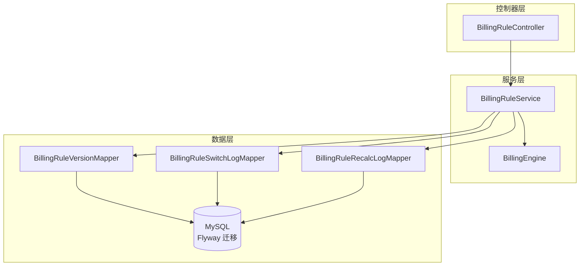
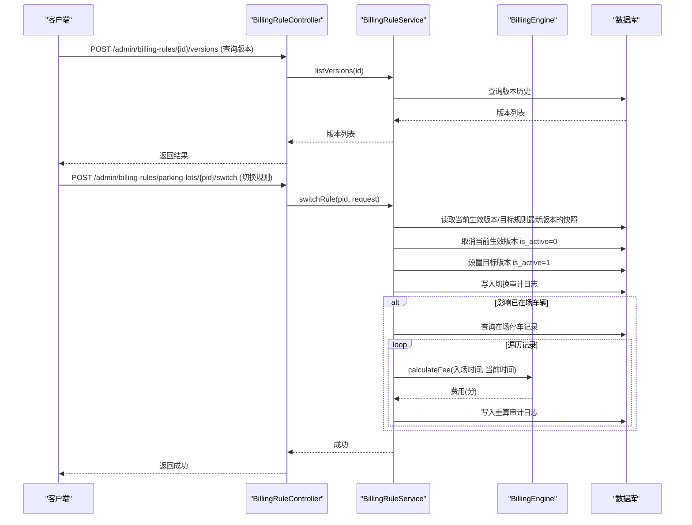
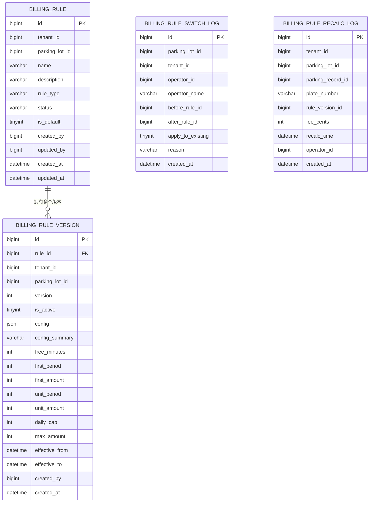
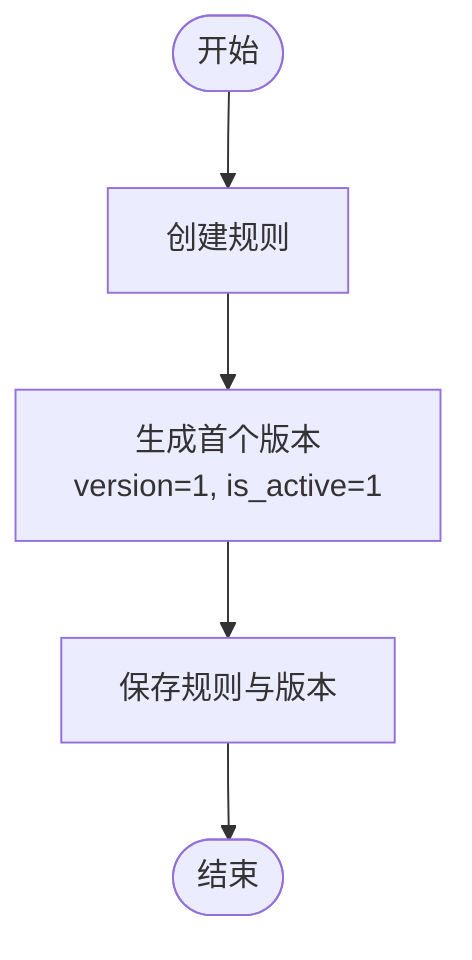
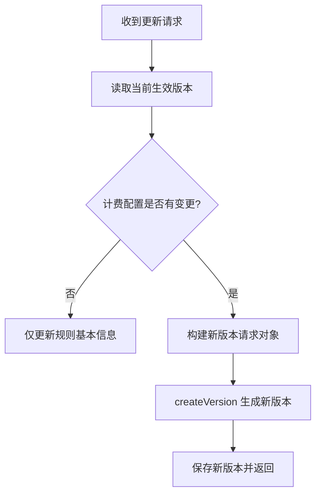
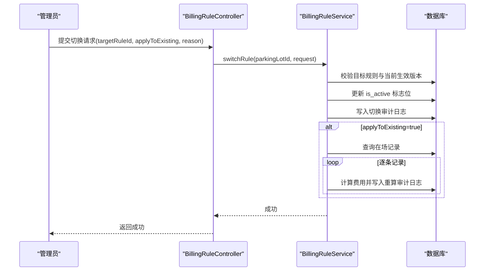
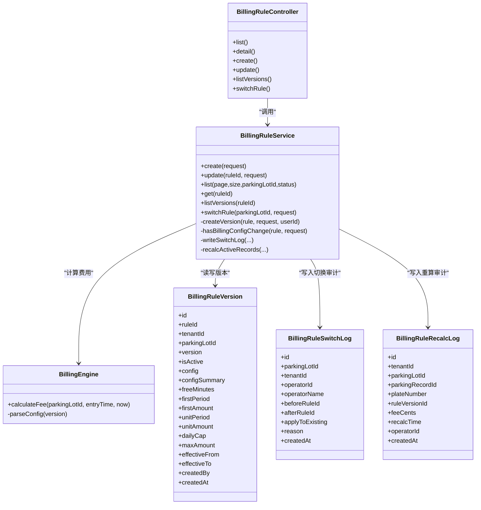
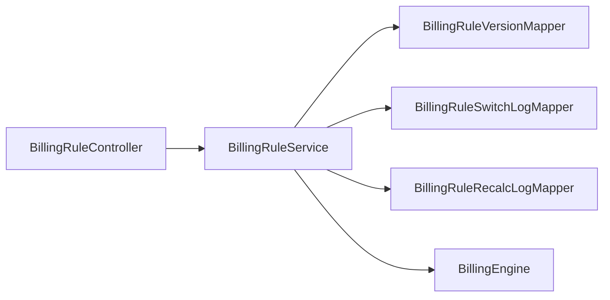

# 计费版本管理

<cite>
**本文引用的文件**   
- [BillingRuleController.java](file://parking-system/src/main/java/com/jushan/system/controller/BillingRuleController.java)
- [BillingRuleService.java](file://parking-system/src/main/java/com/jushan/system/service/BillingRuleService.java)
- [BillingEngine.java](file://parking-system/src/main/java/com/jushan/system/service/BillingEngine.java)
- [BillingRuleVersion.java](file://parking-system/src/main/java/com/jushan/system/entity/BillingRuleVersion.java)
- [BillingRuleSwitchLog.java](file://parking-system/src/main/java/com/jushan/system/entity/BillingRuleSwitchLog.java)
- [BillingRuleRecalcLog.java](file://parking-system/src/main/java/com/jushan/system/entity/BillingRuleRecalcLog.java)
- [CreateBillingRuleRequest.java](file://parking-system/src/main/java/com/jushan/system/dto/CreateBillingRuleRequest.java)
- [UpdateBillingRuleRequest.java](file://parking-system/src/main/java/com/jushan/system/dto/UpdateBillingRuleRequest.java)
- [SwitchBillingRuleRequest.java](file://parking-system/src/main/java/com/jushan/system/dto/SwitchBillingRuleRequest.java)
- [BillingRuleVO.java](file://parking-system/src/main/java/com/jushan/system/vo/BillingRuleVO.java)
- [BillingRuleVersionVO.java](file://parking-system/src/main/java/com/jushan/system/vo/BillingRuleVersionVO.java)
- [V20260712018__billing_rule.sql](file://parking-boot/src/main/resources/db/migration/V20260712018__billing_rule.sql)
</cite>

## 目录
1. [简介](#简介)
2. [项目结构](#项目结构)
3. [核心组件](#核心组件)
4. [架构总览](#架构总览)
5. [详细组件分析](#详细组件分析)
6. [依赖关系分析](#依赖关系分析)
7. [性能与并发](#性能与并发)
8. [故障排查指南](#故障排查指南)
9. [结论](#结论)
10. [附录：API 接口文档](#附录api-接口文档)

## 简介
本技术文档围绕“计费版本管理”能力，系统阐述收费规则的创建、激活与切换流程；说明版本控制机制、版本间差异比较与兼容性处理；解释生效版本选择策略、多停车场版本隔离与版本继承关系；覆盖切换日志记录、变更审计与回滚支持；提供完整的 API 接口说明；并给出数据模型设计、字段定义与业务约束。同时，对冲突检测、并发控制与事务保证进行专项分析与建议。

## 项目结构
计费版本管理相关代码位于 parking-system 模块，主要包含控制器、服务层、实体、DTO/VO 以及数据库迁移脚本。整体采用分层架构：
- 控制器层：对外暴露 REST 接口，负责权限校验与参数校验
- 服务层：实现规则 CRUD、版本管理与切换逻辑，封装事务边界
- 引擎层：计费引擎解析版本配置并计算费用
- 数据层：MyBatis-Plus Mapper + Flyway 迁移脚本维护表结构与索引

图表来源
- [BillingRuleController.java:1-160](file://parking-system/src/main/java/com/jushan/system/controller/BillingRuleController.java#L1-L160)
- [BillingRuleService.java:1-681](file://parking-system/src/main/java/com/jushan/system/service/BillingRuleService.java#L1-L681)
- [BillingEngine.java:160-180](file://parking-system/src/main/java/com/jushan/system/service/BillingEngine.java#L160-L180)
- [V20260712018__billing_rule.sql:1-82](file://parking-boot/src/main/resources/db/migration/V20260712018__billing_rule.sql#L1-L82)

章节来源
- [BillingRuleController.java:1-160](file://parking-system/src/main/java/com/jushan/system/controller/BillingRuleController.java#L1-L160)
- [BillingRuleService.java:1-681](file://parking-system/src/main/java/com/jushan/system/service/BillingRuleService.java#L1-L681)
- [V20260712018__billing_rule.sql:1-82](file://parking-boot/src/main/resources/db/migration/V20260712018__billing_rule.sql#L1-L82)

## 核心组件
- 控制器 BillingRuleController：提供规则列表、详情、创建、更新、版本历史查询与规则切换接口，并通过权限注解限制操作范围（billing:read/write/switch）。
- 服务 BillingRuleService：实现规则与版本的核心业务逻辑，包括创建规则时自动生成首个版本、更新时按配置变更创建新版本、切换生效版本、写入切换与重算审计日志等。
- 计费引擎 BillingEngine：解析版本配置 JSON，兼容旧版列字段构造默认配置，用于费用计算。
- 实体与 VO：BillingRuleVersion、BillingRuleSwitchLog、BillingRuleRecalcLog 及其对应 VO，承载版本快照、切换审计与重算审计信息。
- DTO：CreateBillingRuleRequest、UpdateBillingRuleRequest、SwitchBillingRuleRequest，承载请求参数与校验约束。
- 数据库迁移：Flyway 脚本定义规则主表、版本表、切换审计表及索引与唯一约束。

章节来源
- [BillingRuleController.java:85-160](file://parking-system/src/main/java/com/jushan/system/controller/BillingRuleController.java#L85-L160)
- [BillingRuleService.java:91-372](file://parking-system/src/main/java/com/jushan/system/service/BillingRuleService.java#L91-L372)
- [BillingEngine.java:160-180](file://parking-system/src/main/java/com/jushan/system/service/BillingEngine.java#L160-L180)
- [BillingRuleVersion.java:1-138](file://parking-system/src/main/java/com/jushan/system/entity/BillingRuleVersion.java#L1-L138)
- [BillingRuleSwitchLog.java:1-83](file://parking-system/src/main/java/com/jushan/system/entity/BillingRuleSwitchLog.java#L1-L83)
- [BillingRuleRecalcLog.java:1-83](file://parking-system/src/main/java/com/jushan/system/entity/BillingRuleRecalcLog.java#L1-L83)
- [CreateBillingRuleRequest.java:1-102](file://parking-system/src/main/java/com/jushan/system/dto/CreateBillingRuleRequest.java#L1-L102)
- [UpdateBillingRuleRequest.java:1-91](file://parking-system/src/main/java/com/jushan/system/dto/UpdateBillingRuleRequest.java#L1-L91)
- [SwitchBillingRuleRequest.java:1-33](file://parking-system/src/main/java/com/jushan/system/dto/SwitchBillingRuleRequest.java#L1-L33)
- [V20260712018__billing_rule.sql:1-82](file://parking-boot/src/main/resources/db/migration/V20260712018__billing_rule.sql#L1-L82)

## 架构总览
计费版本管理的端到端调用链如下：
- 前端或运营后台通过 REST 接口触发规则创建、更新、版本查询与切换
- 控制器进行权限校验后委托服务层执行
- 服务层在事务中完成版本创建/激活、审计日志写入，必要时调用计费引擎重新计算费用
- 数据持久化由 MyBatis-Plus 与 Flyway 迁移脚本保障

图表来源
- [BillingRuleController.java:121-160](file://parking-system/src/main/java/com/jushan/system/controller/BillingRuleController.java#L121-L160)
- [BillingRuleService.java:295-372](file://parking-system/src/main/java/com/jushan/system/service/BillingRuleService.java#L295-L372)
- [BillingEngine.java:160-180](file://parking-system/src/main/java/com/jushan/system/service/BillingEngine.java#L160-L180)

## 详细组件分析

### 版本数据模型与约束
- 版本表 billing_rule_version 存储每个规则的不可变快照，包含 JSON 配置与常用字段的冗余列，便于查询与统计。
- 关键字段与约束：
  - rule_id、version：同一规则版本号唯一（uk_rule_version）
  - tenant_id、parking_lot_id：租户与停车场维度隔离
  - is_active：标记当前生效版本（仅一个）
  - config/config_summary：JSON 配置与人类可读摘要
  - free_minutes、first_period、first_amount、unit_period、unit_amount、daily_cap、max_amount：计费参数
  - effective_from/effective_to：预留生效时间窗口（当前未强制使用）
- 规则主表 billing_rule 提供规则元信息与状态（启用/禁用）、默认规则标记等。
- 审计表：
  - billing_rule_switch_log：记录切换前后规则 ID、是否影响已在场车辆、原因、操作人等
  - billing_rule_recalc_log：记录按新规则重算的费用明细与时间

图表来源
- [V20260712018__billing_rule.sql:1-82](file://parking-boot/src/main/resources/db/migration/V20260712018__billing_rule.sql#L1-L82)
- [BillingRuleVersion.java:1-138](file://parking-system/src/main/java/com/jushan/system/entity/BillingRuleVersion.java#L1-L138)
- [BillingRuleSwitchLog.java:1-83](file://parking-system/src/main/java/com/jushan/system/entity/BillingRuleSwitchLog.java#L1-L83)
- [BillingRuleRecalcLog.java:1-83](file://parking-system/src/main/java/com/jushan/system/entity/BillingRuleRecalcLog.java#L1-L83)

章节来源
- [V20260712018__billing_rule.sql:1-82](file://parking-boot/src/main/resources/db/migration/V20260712018__billing_rule.sql#L1-L82)
- [BillingRuleVersion.java:1-138](file://parking-system/src/main/java/com/jushan/system/entity/BillingRuleVersion.java#L1-L138)
- [BillingRuleSwitchLog.java:1-83](file://parking-system/src/main/java/com/jushan/system/entity/BillingRuleSwitchLog.java#L1-L83)
- [BillingRuleRecalcLog.java:1-83](file://parking-system/src/main/java/com/jushan/system/entity/BillingRuleRecalcLog.java#L1-L83)

### 版本创建与激活流程
- 创建规则时自动创建第一个版本，并设为生效版本。
- 更新规则时，若计费配置字段有变更，则创建新版本而非修改已有版本，确保版本历史可追溯。
- 版本号递增，首个版本自动激活。

图表来源
- [BillingRuleService.java:101-144](file://parking-system/src/main/java/com/jushan/system/service/BillingRuleService.java#L101-L144)
- [BillingRuleService.java:379-420](file://parking-system/src/main/java/com/jushan/system/service/BillingRuleService.java#L379-L420)

章节来源
- [BillingRuleService.java:101-144](file://parking-system/src/main/java/com/jushan/system/service/BillingRuleService.java#L101-L144)
- [BillingRuleService.java:379-420](file://parking-system/src/main/java/com/jushan/system/service/BillingRuleService.java#L379-L420)

### 版本间差异比较与兼容性检查
- 差异比较：更新接口会对比请求中的计费配置字段与当前生效版本的对应字段，任一不同即创建新版本。
- 兼容性处理：计费引擎在解析版本配置时，若 JSON 为空则从列字段构造默认配置，兼容旧版本数据。

图表来源
- [BillingRuleService.java:158-226](file://parking-system/src/main/java/com/jushan/system/service/BillingRuleService.java#L158-L226)
- [BillingRuleService.java:457-472](file://parking-system/src/main/java/com/jushan/system/service/BillingRuleService.java#L457-L472)
- [BillingEngine.java:160-180](file://parking-system/src/main/java/com/jushan/system/service/BillingEngine.java#L160-L180)

章节来源
- [BillingRuleService.java:158-226](file://parking-system/src/main/java/com/jushan/system/service/BillingRuleService.java#L158-L226)
- [BillingRuleService.java:457-472](file://parking-system/src/main/java/com/jushan/system/service/BillingRuleService.java#L457-L472)
- [BillingEngine.java:160-180](file://parking-system/src/main/java/com/jushan/system/service/BillingEngine.java#L160-L180)

### 生效版本选择策略与多停车场隔离
- 生效版本选择：通过 is_active=1 标识当前生效版本，切换时将原生效版本置为 0，并将目标最新版本置为 1。
- 多停车场隔离：版本表冗余 parking_lot_id，切换与查询均基于 parking_lot_id 限定范围，避免跨场混淆。
- 版本继承关系：同一规则下版本按 version 递增，形成线性继承链；首个版本自动激活，后续版本需显式切换。

章节来源
- [BillingRuleService.java:307-372](file://parking-system/src/main/java/com/jushan/system/service/BillingRuleService.java#L307-L372)
- [BillingRuleService.java:282-293](file://parking-system/src/main/java/com/jushan/system/service/BillingRuleService.java#L282-L293)
- [V20260712018__billing_rule.sql:34-63](file://parking-boot/src/main/resources/db/migration/V20260712018__billing_rule.sql#L34-L63)

### 切换流程、审计与回滚支持
- 切换流程：
  - 校验目标规则存在、归属同一停车场且处于启用状态
  - 获取当前生效版本与目标规则最新版本
  - 原子性更新 is_active 标志位
  - 写入切换审计日志
  - 可选：对已在场车辆按新规则重新计算费用，并记录重算审计日志
- 审计与回滚：
  - 切换审计记录操作人、原因、前后规则 ID、是否影响已在场车辆
  - 重算审计记录每条记录的新费用与时间戳
  - 当前未实现一键回滚接口，但可通过再次切换至前一版本恢复；结合审计日志可定位问题

图表来源
- [BillingRuleController.java:139-160](file://parking-system/src/main/java/com/jushan/system/controller/BillingRuleController.java#L139-L160)
- [BillingRuleService.java:307-372](file://parking-system/src/main/java/com/jushan/system/service/BillingRuleService.java#L307-L372)
- [BillingRuleService.java:524-591](file://parking-system/src/main/java/com/jushan/system/service/BillingRuleService.java#L524-L591)

章节来源
- [BillingRuleController.java:139-160](file://parking-system/src/main/java/com/jushan/system/controller/BillingRuleController.java#L139-L160)
- [BillingRuleService.java:307-372](file://parking-system/src/main/java/com/jushan/system/service/BillingRuleService.java#L307-L372)
- [BillingRuleService.java:524-591](file://parking-system/src/main/java/com/jushan/system/service/BillingRuleService.java#L524-L591)

### 类关系图（代码级）

图表来源
- [BillingRuleController.java:1-160](file://parking-system/src/main/java/com/jushan/system/controller/BillingRuleController.java#L1-L160)
- [BillingRuleService.java:1-681](file://parking-system/src/main/java/com/jushan/system/service/BillingRuleService.java#L1-L681)
- [BillingEngine.java:160-180](file://parking-system/src/main/java/com/jushan/system/service/BillingEngine.java#L160-L180)
- [BillingRuleVersion.java:1-138](file://parking-system/src/main/java/com/jushan/system/entity/BillingRuleVersion.java#L1-L138)
- [BillingRuleSwitchLog.java:1-83](file://parking-system/src/main/java/com/jushan/system/entity/BillingRuleSwitchLog.java#L1-L83)
- [BillingRuleRecalcLog.java:1-83](file://parking-system/src/main/java/com/jushan/system/entity/BillingRuleRecalcLog.java#L1-L83)

## 依赖关系分析
- 控制器依赖服务层，服务层依赖多个 Mapper 与计费引擎
- 版本表与审计表之间无直接外键约束，通过业务逻辑保证一致性
- 权限与数据范围由框架层（SaToken、DataScope、TenantContext）注入，控制器与服务层共同保障安全访问

图表来源
- [BillingRuleController.java:1-160](file://parking-system/src/main/java/com/jushan/system/controller/BillingRuleController.java#L1-L160)
- [BillingRuleService.java:1-681](file://parking-system/src/main/java/com/jushan/system/service/BillingRuleService.java#L1-L681)

章节来源
- [BillingRuleController.java:1-160](file://parking-system/src/main/java/com/jushan/system/controller/BillingRuleController.java#L1-L160)
- [BillingRuleService.java:1-681](file://parking-system/src/main/java/com/jushan/system/service/BillingRuleService.java#L1-L681)

## 性能与并发
- 事务保证：
  - 创建规则与初始版本、更新规则与创建新版本、切换生效版本与写入审计日志均在 @Transactional 事务内执行，保证原子性
- 并发控制：
  - 当前切换逻辑未引入分布式锁，存在并发切换导致竞态的风险
  - 建议在切换入口增加基于 parking_lot_id 的分布式锁，确保同一停车场切换串行化
- 查询优化：
  - 版本表已建立 tenant_id、parking_lot_id、is_active、rule_id 等索引，满足常见查询场景
  - 建议在高频路径上考虑缓存活跃版本（如 Redis），降低热点查询压力
- 兼容性解析：
  - 计费引擎对空 JSON 配置进行降级处理，提升历史数据兼容性

章节来源
- [BillingRuleService.java:101-144](file://parking-system/src/main/java/com/jushan/system/service/BillingRuleService.java#L101-L144)
- [BillingRuleService.java:158-226](file://parking-system/src/main/java/com/jushan/system/service/BillingRuleService.java#L158-L226)
- [BillingRuleService.java:307-372](file://parking-system/src/main/java/com/jushan/system/service/BillingRuleService.java#L307-L372)
- [BillingEngine.java:160-180](file://parking-system/src/main/java/com/jushan/system/service/BillingEngine.java#L160-L180)
- [V20260712018__billing_rule.sql:34-63](file://parking-boot/src/main/resources/db/migration/V20260712018__billing_rule.sql#L34-L63)

## 故障排查指南
- 切换失败常见原因：
  - 目标规则不存在或不属于该停车场
  - 目标规则未启用
  - 目标规则无有效版本
- 计费配置解析异常：
  - 当 JSON 配置损坏或格式错误时，计费引擎抛出业务异常，需检查版本配置
- 审计日志缺失：
  - 切换成功后应写入切换审计与（可选）重算审计日志，若缺失需检查事务与 Mapper 插入逻辑
- 已在场车辆重算失败：
  - 计费引擎计算抛错时会跳过该记录并记录警告，需核对入场时间与计费配置

章节来源
- [BillingRuleService.java:307-372](file://parking-system/src/main/java/com/jushan/system/service/BillingRuleService.java#L307-L372)
- [BillingEngine.java:160-180](file://parking-system/src/main/java/com/jushan/system/service/BillingEngine.java#L160-L180)
- [BillingRuleService.java:524-591](file://parking-system/src/main/java/com/jushan/system/service/BillingRuleService.java#L524-L591)

## 结论
计费版本管理以“不可变版本快照 + 生效标志位”为核心，实现了清晰的多版本演进与切换能力。通过完善的审计日志与可选的重算机制，保障了变更的可追溯性与可控性。建议在关键路径引入分布式锁与缓存以提升并发与性能，并在未来扩展时间窗生效策略与一键回滚能力。

## 附录：API 接口文档
以下接口均由 BillingRuleController 暴露，统一前缀 /admin/billing-rules。

- 分页查询收费规则列表
  - 方法：GET
  - 路径：/admin/billing-rules
  - 权限：billing:read
  - 参数：page、size、parkingLotId（可选）、status（可选）
  - 返回：分页的规则视图（含当前生效版本摘要）

- 查询收费规则详情
  - 方法：GET
  - 路径：/admin/billing-rules/{id}
  - 权限：billing:read
  - 返回：规则详情（含当前生效版本信息）

- 创建收费规则
  - 方法：POST
  - 路径：/admin/billing-rules
  - 权限：billing:write
  - 请求体：CreateBillingRuleRequest
  - 行为：创建规则并自动生成首个版本，设为生效版本
  - 返回：规则视图

- 更新收费规则
  - 方法：PUT
  - 路径：/admin/billing-rules/{id}
  - 权限：billing:write
  - 请求体：UpdateBillingRuleRequest
  - 行为：若计费配置字段有变更，创建新版本；否则仅更新规则基本信息
  - 返回：规则视图

- 查询规则版本历史
  - 方法：GET
  - 路径：/admin/billing-rules/{id}/versions
  - 权限：billing:read
  - 返回：版本列表（按版本号降序）

- 切换收费规则
  - 方法：POST
  - 路径：/admin/billing-rules/parking-lots/{parkingLotId}/switch
  - 权限：billing:switch
  - 请求体：SwitchBillingRuleRequest
  - 行为：将目标规则的最新版本设为生效，写入切换审计日志；可选对已在场车辆重新计算费用并记录审计
  - 返回：成功响应

章节来源
- [BillingRuleController.java:51-160](file://parking-system/src/main/java/com/jushan/system/controller/BillingRuleController.java#L51-L160)
- [CreateBillingRuleRequest.java:1-102](file://parking-system/src/main/java/com/jushan/system/dto/CreateBillingRuleRequest.java#L1-L102)
- [UpdateBillingRuleRequest.java:1-91](file://parking-system/src/main/java/com/jushan/system/dto/UpdateBillingRuleRequest.java#L1-L91)
- [SwitchBillingRuleRequest.java:1-33](file://parking-system/src/main/java/com/jushan/system/dto/SwitchBillingRuleRequest.java#L1-L33)
- [BillingRuleVO.java:1-124](file://parking-system/src/main/java/com/jushan/system/vo/BillingRuleVO.java#L1-L124)
- [BillingRuleVersionVO.java:1-98](file://parking-system/src/main/java/com/jushan/system/vo/BillingRuleVersionVO.java#L1-L98)