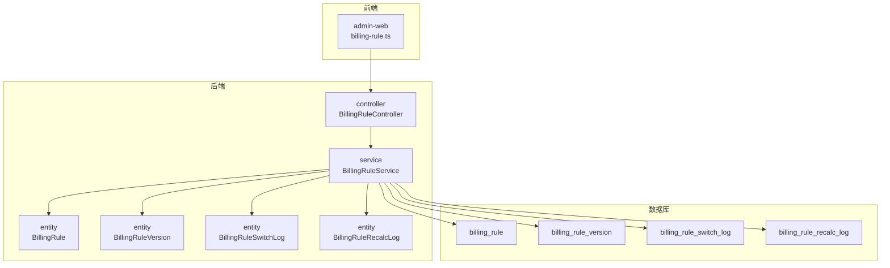
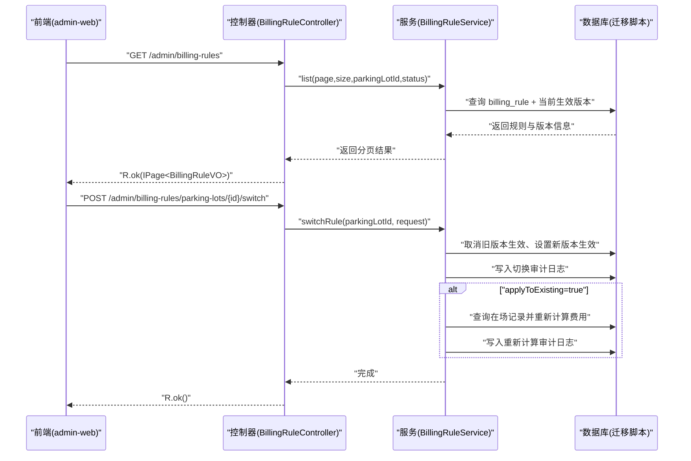
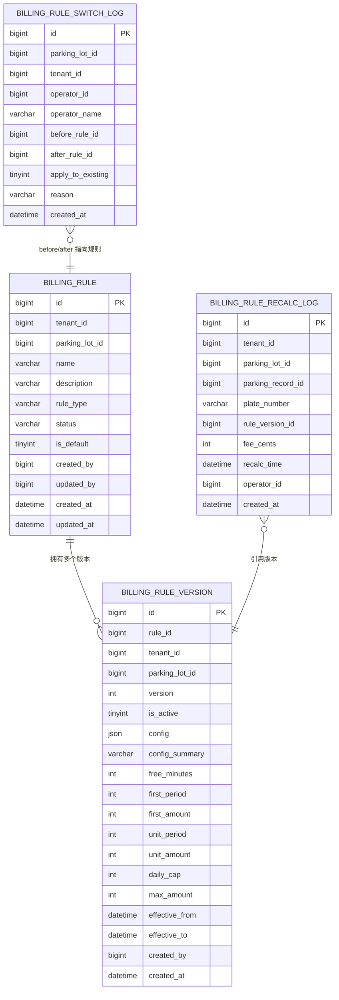
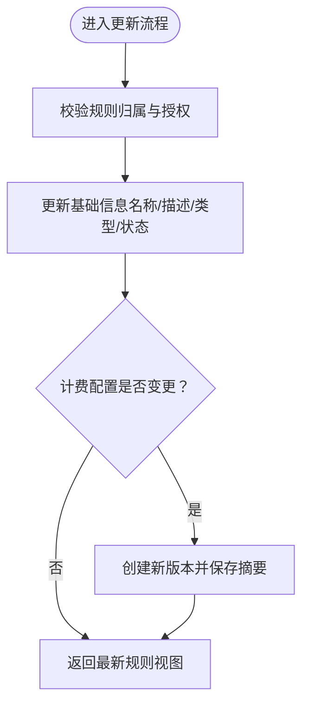
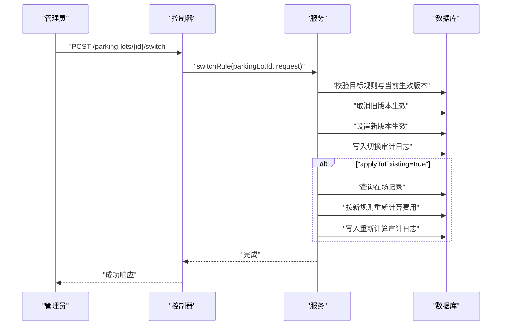
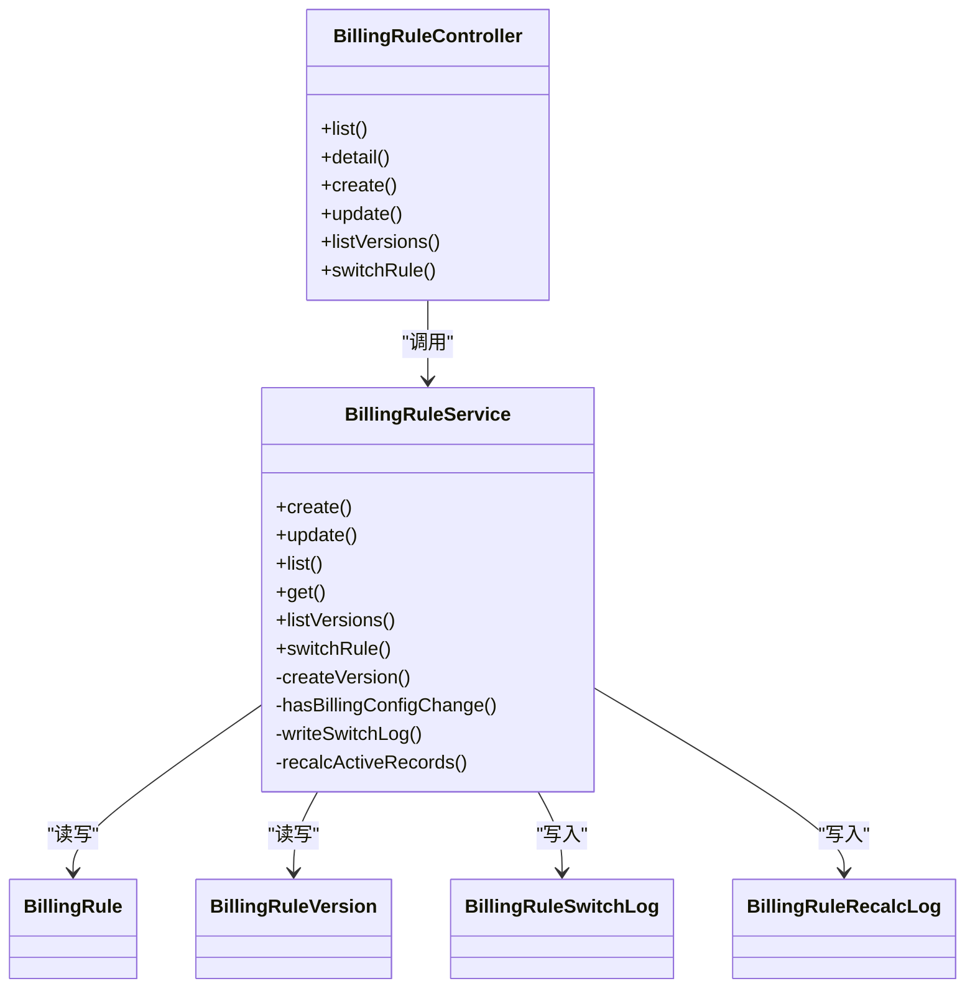

# 计费规则管理

<cite>
**本文引用的文件**   
- [BillingRuleController.java](file://parking-system/src/main/java/com/jushan/system/controller/BillingRuleController.java)
- [BillingRuleService.java](file://parking-system/src/main/java/com/jushan/system/service/BillingRuleService.java)
- [BillingRule.java](file://parking-system/src/main/java/com/jushan/system/entity/BillingRule.java)
- [BillingRuleVersion.java](file://parking-system/src/main/java/com/jushan/system/entity/BillingRuleVersion.java)
- [BillingRuleSwitchLog.java](file://parking-system/src/main/java/com/jushan/system/entity/BillingRuleSwitchLog.java)
- [BillingRuleRecalcLog.java](file://parking-system/src/main/java/com/jushan/system/entity/BillingRuleRecalcLog.java)
- [V20260712018__billing_rule.sql](file://parking-boot/src/main/resources/db/migration/V20260712018__billing_rule.sql)
- [V20260715001__billing_rule_recalc_log.sql](file://parking-boot/src/main/resources/db/migration/V20260715001__billing_rule_recalc_log.sql)
- [billing-rule.ts](file://admin-web/src/api/billing-rule.ts)
</cite>

## 目录
1. [引言](#引言)
2. [项目结构](#项目结构)
3. [核心组件](#核心组件)
4. [架构总览](#架构总览)
5. [详细组件分析](#详细组件分析)
6. [依赖关系分析](#依赖关系分析)
7. [性能与扩展性](#性能与扩展性)
8. [故障排查指南](#故障排查指南)
9. [结论](#结论)
10. [附录](#附录)

## 引言
本技术文档围绕“计费规则管理”功能，系统性阐述以下方面：
- 计费规则的增删改查（CRUD）接口与流程
- 状态管理与版本控制机制（含生效版本切换、历史版本查询）
- 支持的计费类型及配置参数（NO_FEE免费、FIXED固定金额、HOURLY按时计费）
- 启用/禁用流程、优先级匹配逻辑与生效时间控制
- 数据模型设计、字段定义与业务约束
- 计费规则配置的JSON格式规范与校验规则
- 与停车场的关联关系与数据隔离机制
- 历史版本查询、变更审计与回滚机制

## 项目结构
计费规则管理涉及前端API封装、后端控制器与服务层、实体与数据库迁移脚本等模块。整体组织方式采用分层架构：
- 前端：admin-web 提供 API 调用封装与页面交互
- 后端：parking-system 提供业务服务与对外接口；parking-boot 负责启动与数据库迁移
- 数据层：Flyway 迁移脚本维护表结构与索引

图表来源
- [BillingRuleController.java:1-160](file://parking-system/src/main/java/com/jushan/system/controller/BillingRuleController.java#L1-L160)
- [BillingRuleService.java:1-681](file://parking-system/src/main/java/com/jushan/system/service/BillingRuleService.java#L1-L681)
- [BillingRule.java:1-105](file://parking-system/src/main/java/com/jushan/system/entity/BillingRule.java#L1-L105)
- [BillingRuleVersion.java:1-138](file://parking-system/src/main/java/com/jushan/system/entity/BillingRuleVersion.java#L1-L138)
- [BillingRuleSwitchLog.java:1-83](file://parking-system/src/main/java/com/jushan/system/entity/BillingRuleSwitchLog.java#L1-L83)
- [BillingRuleRecalcLog.java:1-83](file://parking-system/src/main/java/com/jushan/system/entity/BillingRuleRecalcLog.java#L1-L83)
- [V20260712018__billing_rule.sql:1-82](file://parking-boot/src/main/resources/db/migration/V20260712018__billing_rule.sql#L1-L82)
- [V20260715001__billing_rule_recalc_log.sql:1-23](file://parking-boot/src/main/resources/db/migration/V20260715001__billing_rule_recalc_log.sql#L1-L23)
- [billing-rule.ts:1-104](file://admin-web/src/api/billing-rule.ts#L1-L104)

章节来源
- [BillingRuleController.java:1-160](file://parking-system/src/main/java/com/jushan/system/controller/BillingRuleController.java#L1-L160)
- [BillingRuleService.java:1-681](file://parking-system/src/main/java/com/jushan/system/service/BillingRuleService.java#L1-L681)
- [billing-rule.ts:1-104](file://admin-web/src/api/billing-rule.ts#L1-L104)

## 核心组件
- 控制器层：提供 REST 接口，包含分页列表、详情、创建、更新、版本历史、切换规则等能力，并基于权限注解进行访问控制。
- 服务层：实现计费规则的业务逻辑，包括创建规则并生成初始版本、更新时检测配置变更并创建新版本、切换生效版本、审计日志记录、重新计算费用等。
- 实体层：定义规则主表、版本快照表、切换审计表、重新计算审计表的字段与约束。
- 数据库迁移：通过 Flyway 脚本创建表结构与索引，确保查询性能与数据一致性。
- 前端 API：封装请求方法，定义视图对象类型，便于页面展示与操作。

章节来源
- [BillingRuleController.java:1-160](file://parking-system/src/main/java/com/jushan/system/controller/BillingRuleController.java#L1-L160)
- [BillingRuleService.java:1-681](file://parking-system/src/main/java/com/jushan/system/service/BillingRuleService.java#L1-L681)
- [BillingRule.java:1-105](file://parking-system/src/main/java/com/jushan/system/entity/BillingRule.java#L1-L105)
- [BillingRuleVersion.java:1-138](file://parking-system/src/main/java/com/jushan/system/entity/BillingRuleVersion.java#L1-L138)
- [BillingRuleSwitchLog.java:1-83](file://parking-system/src/main/java/com/jushan/system/entity/BillingRuleSwitchLog.java#L1-L83)
- [BillingRuleRecalcLog.java:1-83](file://parking-system/src/main/java/com/jushan/system/entity/BillingRuleRecalcLog.java#L1-L83)
- [V20260712018__billing_rule.sql:1-82](file://parking-boot/src/main/resources/db/migration/V20260712018__billing_rule.sql#L1-L82)
- [V20260715001__billing_rule_recalc_log.sql:1-23](file://parking-boot/src/main/resources/db/migration/V20260715001__billing_rule_recalc_log.sql#L1-L23)
- [billing-rule.ts:1-104](file://admin-web/src/api/billing-rule.ts#L1-L104)

## 架构总览
计费规则管理的端到端流程如下：
- 前端通过 admin-web 的 API 封装发起请求
- 控制器接收请求并进行权限校验
- 服务层执行业务逻辑，读写实体与数据库
- 数据库通过 Flyway 迁移脚本维护表结构
- 切换规则时可触发重新计算并写入审计日志

图表来源
- [BillingRuleController.java:1-160](file://parking-system/src/main/java/com/jushan/system/controller/BillingRuleController.java#L1-L160)
- [BillingRuleService.java:1-681](file://parking-system/src/main/java/com/jushan/system/service/BillingRuleService.java#L1-L681)
- [V20260712018__billing_rule.sql:1-82](file://parking-boot/src/main/resources/db/migration/V20260712018__billing_rule.sql#L1-L82)
- [V20260715001__billing_rule_recalc_log.sql:1-23](file://parking-boot/src/main/resources/db/migration/V20260715001__billing_rule_recalc_log.sql#L1-L23)

## 详细组件分析

### 数据模型与字段定义
- 规则主表（billing_rule）
  - 关键字段：租户ID、停车场ID、名称、描述、规则类型、状态、是否默认、创建/修改人与时间
  - 唯一约束：同一停车场下规则名称唯一
  - 索引：按租户、停车场、状态查询优化
- 版本表（billing_rule_version）
  - 关键字段：规则ID、版本号、是否生效、配置JSON、配置摘要、免费时长、首时段、续费单位、封顶与最大金额、生效/失效时间、创建人与时间
  - 唯一约束：同一规则版本号唯一
  - 索引：按规则、租户、停车场、是否生效查询优化
- 切换审计表（billing_rule_switch_log）
  - 关键字段：停车场ID、租户ID、操作人、切换前后规则ID、是否影响已在场车辆、原因、操作时间
- 重新计算审计表（billing_rule_recalc_log）
  - 关键字段：租户ID、停车场ID、停车记录ID、车牌号、规则版本ID、费用（分）、重新计算时间、操作人、创建时间

图表来源
- [V20260712018__billing_rule.sql:1-82](file://parking-boot/src/main/resources/db/migration/V20260712018__billing_rule.sql#L1-L82)
- [V20260715001__billing_rule_recalc_log.sql:1-23](file://parking-boot/src/main/resources/db/migration/V20260715001__billing_rule_recalc_log.sql#L1-L23)
- [BillingRule.java:1-105](file://parking-system/src/main/java/com/jushan/system/entity/BillingRule.java#L1-L105)
- [BillingRuleVersion.java:1-138](file://parking-system/src/main/java/com/jushan/system/entity/BillingRuleVersion.java#L1-L138)
- [BillingRuleSwitchLog.java:1-83](file://parking-system/src/main/java/com/jushan/system/entity/BillingRuleSwitchLog.java#L1-L83)
- [BillingRuleRecalcLog.java:1-83](file://parking-system/src/main/java/com/jushan/system/entity/BillingRuleRecalcLog.java#L1-L83)

章节来源
- [BillingRule.java:1-105](file://parking-system/src/main/java/com/jushan/system/entity/BillingRule.java#L1-L105)
- [BillingRuleVersion.java:1-138](file://parking-system/src/main/java/com/jushan/system/entity/BillingRuleVersion.java#L1-L138)
- [BillingRuleSwitchLog.java:1-83](file://parking-system/src/main/java/com/jushan/system/entity/BillingRuleSwitchLog.java#L1-L83)
- [BillingRuleRecalcLog.java:1-83](file://parking-system/src/main/java/com/jushan/system/entity/BillingRuleRecalcLog.java#L1-L83)
- [V20260712018__billing_rule.sql:1-82](file://parking-boot/src/main/resources/db/migration/V20260712018__billing_rule.sql#L1-L82)
- [V20260715001__billing_rule_recalc_log.sql:1-23](file://parking-boot/src/main/resources/db/migration/V20260715001__billing_rule_recalc_log.sql#L1-L23)

### 计费类型与配置参数
- 计费类型
  - NO_FEE：免费
  - FIXED：固定金额
  - HOURLY：按时长计费
- 配置参数（以分钟和分为单位）
  - freeMinutes：免费时长（分钟）
  - firstPeriod：首时段时长（分钟）
  - firstAmount：首时段金额（分）
  - unitPeriod：续费单位时长（分钟）
  - unitAmount：续费单位金额（分）
  - dailyCap：单日封顶金额（分），0表示不封顶
  - maxAmount：最大金额（分），0表示不封顶
- 配置存储
  - JSON 字段用于灵活扩展
  - 同时冗余关键数值字段以便快速查询与统计
  - 配置摘要字段用于界面快速展示

章节来源
- [BillingRuleService.java:55-63](file://parking-system/src/main/java/com/jushan/system/service/BillingRuleService.java#L55-L63)
- [BillingRuleVersion.java:42-78](file://parking-system/src/main/java/com/jushan/system/entity/BillingRuleVersion.java#L42-L78)
- [V20260712018__billing_rule.sql:34-63](file://parking-boot/src/main/resources/db/migration/V20260712018__billing_rule.sql#L34-L63)

### CRUD 操作与权限控制
- 列表查询：支持分页、按停车场与状态筛选，仅返回当前租户范围且具备停车场级授权的数据
- 详情查询：返回规则基本信息与当前生效版本摘要
- 创建规则：自动创建首个版本并设为生效版本；若设置为默认规则，则清除同停车场其他默认规则
- 更新规则：基础信息直接更新；计费配置变更将创建新版本，保证版本可追溯
- 版本历史：按规则ID查询所有版本，按版本号降序排列
- 切换规则：仅允许客户管理员与停车场管理员执行，需填写原因；可选择是否影响已在场车辆

图表来源
- [BillingRuleService.java:158-226](file://parking-system/src/main/java/com/jushan/system/service/BillingRuleService.java#L158-L226)

章节来源
- [BillingRuleController.java:51-119](file://parking-system/src/main/java/com/jushan/system/controller/BillingRuleController.java#L51-L119)
- [BillingRuleService.java:101-144](file://parking-system/src/main/java/com/jushan/system/service/BillingRuleService.java#L101-L144)
- [BillingRuleService.java:158-226](file://parking-system/src/main/java/com/jushan/system/service/BillingRuleService.java#L158-L226)
- [BillingRuleService.java:241-293](file://parking-system/src/main/java/com/jushan/system/service/BillingRuleService.java#L241-L293)

### 状态管理与生效版本切换
- 状态管理
  - ENABLED：启用
  - DISABLED：禁用
- 生效版本切换流程
  - 校验目标规则存在、属于同一停车场、处于启用状态
  - 获取当前生效版本并取消生效
  - 设置目标规则最新版本为生效
  - 写入切换审计日志
  - 若选择影响已在场车辆，则对当前在场记录按新规则重新计算费用并记录审计

图表来源
- [BillingRuleService.java:307-372](file://parking-system/src/main/java/com/jushan/system/service/BillingRuleService.java#L307-L372)
- [V20260712018__billing_rule.sql:68-82](file://parking-boot/src/main/resources/db/migration/V20260712018__billing_rule.sql#L68-L82)
- [V20260715001__billing_rule_recalc_log.sql:1-23](file://parking-boot/src/main/resources/db/migration/V20260715001__billing_rule_recalc_log.sql#L1-L23)

章节来源
- [BillingRuleService.java:307-372](file://parking-system/src/main/java/com/jushan/system/service/BillingRuleService.java#L307-L372)
- [BillingRuleService.java:524-549](file://parking-system/src/main/java/com/jushan/system/service/BillingRuleService.java#L524-L549)
- [BillingRuleService.java:554-591](file://parking-system/src/main/java/com/jushan/system/service/BillingRuleService.java#L554-L591)

### 优先级匹配逻辑与生效时间控制
- 优先级匹配
  - 通过 is_active 标记确定当前生效版本
  - 切换时将旧版本取消生效、新版本设为生效，确保单一生效版本
- 生效时间控制
  - 版本表提供 effectiveFrom/effectiveTo 字段，可用于预设计费规则生效时间
  - 当前切换逻辑以 is_active 为准；未来可扩展为基于时间窗口的自动切换

章节来源
- [BillingRuleVersion.java:69-78](file://parking-system/src/main/java/com/jushan/system/entity/BillingRuleVersion.java#L69-L78)
- [BillingRuleService.java:330-358](file://parking-system/src/main/java/com/jushan/system/service/BillingRuleService.java#L330-L358)

### 与停车场的关联关系与数据隔离
- 关联关系
  - 规则与停车场通过 parking_lot_id 关联
  - 版本表冗余 parking_lot_id 以加速查询
- 数据隔离
  - 查询时限定 tenantId 与停车场级授权范围
  - 创建/更新/切换均校验停车场归属与用户授权

章节来源
- [BillingRuleService.java:241-263](file://parking-system/src/main/java/com/jushan/system/service/BillingRuleService.java#L241-L263)
- [BillingRuleService.java:498-519](file://parking-system/src/main/java/com/jushan/system/service/BillingRuleService.java#L498-L519)

### 历史版本查询、变更审计与回滚机制
- 历史版本查询
  - 按规则ID查询所有版本，按版本号降序排列
- 变更审计
  - 切换操作写入切换审计日志，包含操作人、原因、切换前后规则ID、是否影响已在场车辆
  - 若重新计算费用，写入重新计算审计日志，包含停车记录ID、车牌号、规则版本ID、费用与时间
- 回滚机制
  - 可通过再次切换至历史版本实现回滚（需满足目标规则启用且属于同一停车场）
  - 建议结合审计日志进行变更追踪与合规审查

章节来源
- [BillingRuleService.java:282-293](file://parking-system/src/main/java/com/jushan/system/service/BillingRuleService.java#L282-L293)
- [BillingRuleService.java:524-549](file://parking-system/src/main/java/com/jushan/system/service/BillingRuleService.java#L524-L549)
- [BillingRuleService.java:554-591](file://parking-system/src/main/java/com/jushan/system/service/BillingRuleService.java#L554-L591)

### 前端 API 与视图对象
- 视图对象
  - BillingRuleVO：规则基本信息与当前生效版本摘要
  - BillingRuleVersionVO：版本详细信息
- API 方法
  - 分页查询、详情、创建、更新、版本历史、切换规则

章节来源
- [billing-rule.ts:5-57](file://admin-web/src/api/billing-rule.ts#L5-L57)
- [billing-rule.ts:59-104](file://admin-web/src/api/billing-rule.ts#L59-L104)

## 依赖关系分析
- 控制器依赖服务层，服务层依赖实体与Mapper，实体映射到数据库表
- 权限与租户上下文由框架层提供，服务层在关键路径进行校验
- 切换与重新计算逻辑依赖计费引擎与停车记录

图表来源
- [BillingRuleController.java:1-160](file://parking-system/src/main/java/com/jushan/system/controller/BillingRuleController.java#L1-L160)
- [BillingRuleService.java:1-681](file://parking-system/src/main/java/com/jushan/system/service/BillingRuleService.java#L1-L681)
- [BillingRule.java:1-105](file://parking-system/src/main/java/com/jushan/system/entity/BillingRule.java#L1-L105)
- [BillingRuleVersion.java:1-138](file://parking-system/src/main/java/com/jushan/system/entity/BillingRuleVersion.java#L1-L138)
- [BillingRuleSwitchLog.java:1-83](file://parking-system/src/main/java/com/jushan/system/entity/BillingRuleSwitchLog.java#L1-L83)
- [BillingRuleRecalcLog.java:1-83](file://parking-system/src/main/java/com/jushan/system/entity/BillingRuleRecalcLog.java#L1-L83)

章节来源
- [BillingRuleController.java:1-160](file://parking-system/src/main/java/com/jushan/system/controller/BillingRuleController.java#L1-L160)
- [BillingRuleService.java:1-681](file://parking-system/src/main/java/com/jushan/system/service/BillingRuleService.java#L1-L681)

## 性能与扩展性
- 索引优化
  - 规则表与版本表针对租户、停车场、状态、是否生效建立索引，提升常见查询性能
- 冗余字段
  - 版本表冗余关键计费参数，避免频繁解析JSON，提高查询效率
- 事务边界
  - 创建、更新、切换均在事务中执行，保证数据一致性
- 扩展点
  - 基于JSON的配置字段支持灵活扩展
  - 生效时间字段预留，便于未来引入时间窗口自动切换

章节来源
- [V20260712018__billing_rule.sql:25-63](file://parking-boot/src/main/resources/db/migration/V20260712018__billing_rule.sql#L25-L63)
- [BillingRuleService.java:101-144](file://parking-system/src/main/java/com/jushan/system/service/BillingRuleService.java#L101-L144)
- [BillingRuleService.java:307-372](file://parking-system/src/main/java/com/jushan/system/service/BillingRuleService.java#L307-L372)

## 故障排查指南
- 常见问题
  - 同名规则冲突：同一停车场下规则名称唯一，创建或更新时需检查
  - 目标规则未启用：切换前需确保目标规则状态为启用
  - 目标规则不属于该停车场：切换时需校验规则与停车场归属一致
  - 无有效版本：目标规则必须至少有一个版本
- 审计与回溯
  - 切换审计日志记录操作人、原因、切换前后规则ID、是否影响已在场车辆
  - 重新计算审计日志记录停车记录ID、车牌号、规则版本ID、费用与时间
- 定位步骤
  - 查看切换审计日志确认操作轨迹
  - 查看重新计算审计日志核对费用变化
  - 检查版本历史确认配置变更

章节来源
- [BillingRuleService.java:316-344](file://parking-system/src/main/java/com/jushan/system/service/BillingRuleService.java#L316-L344)
- [BillingRuleService.java:524-549](file://parking-system/src/main/java/com/jushan/system/service/BillingRuleService.java#L524-L549)
- [BillingRuleService.java:554-591](file://parking-system/src/main/java/com/jushan/system/service/BillingRuleService.java#L554-L591)

## 结论
计费规则管理通过清晰的分层设计与严格的权限控制，实现了多套计费规则的生命周期管理。版本化与审计机制保障了变更的可追溯性与合规性。通过冗余字段与索引优化，系统在查询性能与扩展性之间取得平衡。未来可在生效时间控制与自动切换方面进一步增强。

## 附录

### 计费规则配置 JSON 规范与校验规则
- 字段说明
  - freeMinutes：免费时长（分钟），非负整数
  - firstPeriod：首时段时长（分钟），非负整数
  - firstAmount：首时段金额（分），非负整数
  - unitPeriod：续费单位时长（分钟），非负整数
  - unitAmount：续费单位金额（分），非负整数
  - dailyCap：单日封顶金额（分），非负整数，0表示不封顶
  - maxAmount：最大金额（分），非负整数，0表示不封顶
- 校验规则
  - 必填字段根据计费类型决定：
    - NO_FEE：仅需 freeMinutes（可为0）
    - FIXED：仅需 firstAmount（firstPeriod 可为0）
    - HOURLY：需要 firstPeriod、firstAmount、unitPeriod、unitAmount
  - 金额与时长的取值范围需为非负整数
  - 当 dailyCap 或 maxAmount 为0时表示不封顶
- 示例（概念性）
  - 按时长计费：freeMinutes=10, firstPeriod=60, firstAmount=500, unitPeriod=60, unitAmount=300, dailyCap=3000, maxAmount=0
  - 固定金额：freeMinutes=0, firstPeriod=0, firstAmount=1000, unitPeriod=0, unitAmount=0, dailyCap=0, maxAmount=0
  - 免费：freeMinutes=120, 其余为0

章节来源
- [BillingRuleService.java:379-452](file://parking-system/src/main/java/com/jushan/system/service/BillingRuleService.java#L379-L452)
- [BillingRuleService.java:596-611](file://parking-system/src/main/java/com/jushan/system/service/BillingRuleService.java#L596-L611)
- [BillingRuleVersion.java:42-78](file://parking-system/src/main/java/com/jushan/system/entity/BillingRuleVersion.java#L42-L78)