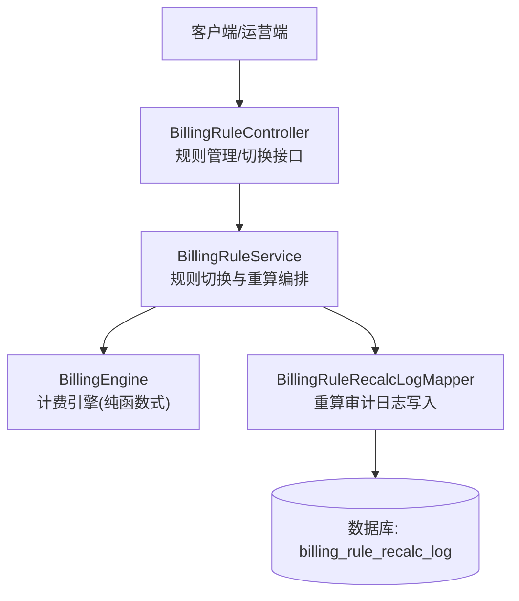
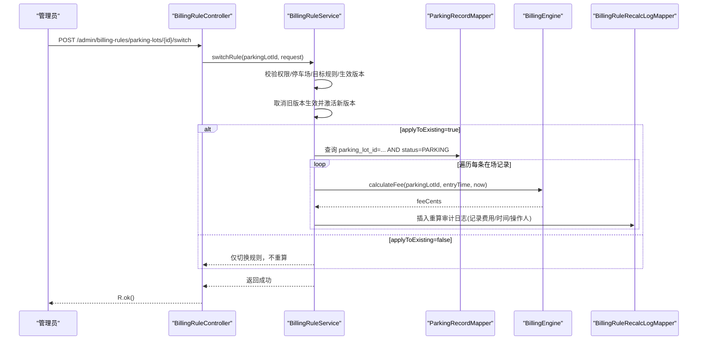
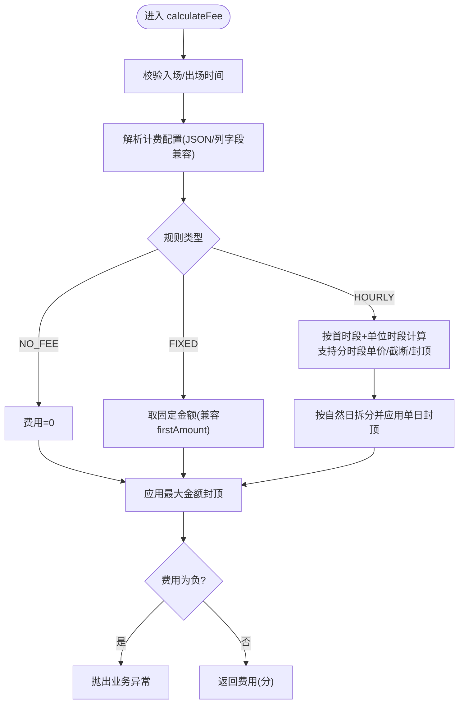
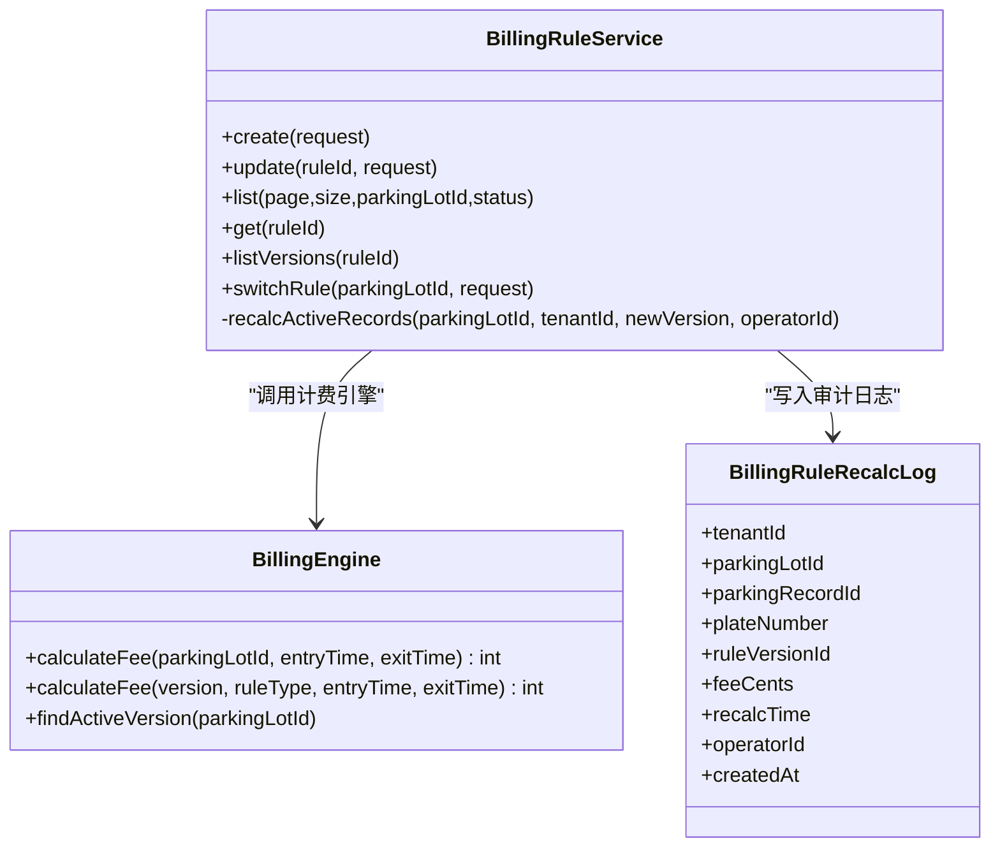
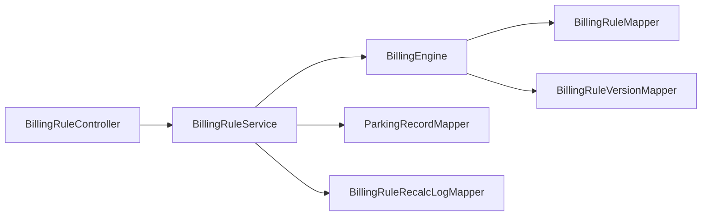

# 计费重算机制

<cite>
**本文引用的文件**   
- [BillingRuleController.java](file://parking-system/src/main/java/com/jushan/system/controller/BillingRuleController.java)
- [BillingRuleService.java](file://parking-system/src/main/java/com/jushan/system/service/BillingRuleService.java)
- [BillingEngine.java](file://parking-system/src/main/java/com/jushan/system/service/BillingEngine.java)
- [BillingRuleRecalcLog.java](file://parking-system/src/main/java/com/jushan/system/entity/BillingRuleRecalcLog.java)
- [BillingRuleRecalcLogMapper.java](file://parking-system/src/main/java/com/jushan/system/mapper/BillingRuleRecalcLogMapper.java)
- [V20260715001__billing_rule_recalc_log.sql](file://parking-boot/src/main/resources/db/migration/V20260715001__billing_rule_recalc_log.sql)
- [BillingEngineTest.java](file://parking-boot/src/test/java/com/jushan/boot/service/BillingEngineTest.java)
</cite>

## 目录
1. [引言](#引言)
2. [项目结构](#项目结构)
3. [核心组件](#核心组件)
4. [架构总览](#架构总览)
5. [详细组件分析](#详细组件分析)
6. [依赖关系分析](#依赖关系分析)
7. [性能与批量处理](#性能与批量处理)
8. [事务、一致性与异常处理](#事务一致性与异常处理)
9. [调度、异步与分布式考虑](#调度异步与分布式考虑)
10. [API 接口文档](#api-接口文档)
11. [监控、资源控制与故障恢复](#监控资源控制与故障恢复)
12. [故障排查指南](#故障排查指南)
13. [结论](#结论)

## 引言
本技术文档围绕“计费规则变更后历史订单费用的重新计算”展开，聚焦以下目标：
- 明确重算触发条件（规则切换时是否影响已在场车辆）
- 描述当前实现的重算流程、日志记录与结果可追溯性
- 给出批量处理策略与性能优化建议
- 说明任务调度、异步化与分布式部署的扩展方案
- 提供重算相关 API 的使用方式与查询手段
- 阐述数据一致性保证、事务边界与异常处理策略
- 补充监控指标、资源消耗控制与故障恢复机制

## 项目结构
计费重算能力由控制器、服务层、计费引擎与审计日志表共同构成。关键路径如下：
- 控制器暴露规则管理与切换接口
- 服务层负责权限校验、版本切换与重算编排
- 计费引擎提供无状态费用计算能力
- 审计日志持久化每次重算的关键信息

图表来源
- [BillingRuleController.java:1-160](file://parking-system/src/main/java/com/jushan/system/controller/BillingRuleController.java#L1-L160)
- [BillingRuleService.java:307-372](file://parking-system/src/main/java/com/jushan/system/service/BillingRuleService.java#L307-L372)
- [BillingEngine.java:75-128](file://parking-system/src/main/java/com/jushan/system/service/BillingEngine.java#L75-L128)
- [BillingRuleRecalcLogMapper.java:1-15](file://parking-system/src/main/java/com/jushan/system/mapper/BillingRuleRecalcLogMapper.java#L1-L15)
- [V20260715001__billing_rule_recalc_log.sql:1-23](file://parking-boot/src/main/resources/db/migration/V20260715001__billing_rule_recalc_log.sql#L1-L23)

章节来源
- [BillingRuleController.java:1-160](file://parking-system/src/main/java/com/jushan/system/controller/BillingRuleController.java#L1-L160)
- [BillingRuleService.java:50-90](file://parking-system/src/main/java/com/jushan/system/service/BillingRuleService.java#L50-L90)
- [BillingEngine.java:45-64](file://parking-system/src/main/java/com/jushan/system/service/BillingEngine.java#L45-L64)
- [BillingRuleRecalcLog.java:1-83](file://parking-system/src/main/java/com/jushan/system/entity/BillingRuleRecalcLog.java#L1-L83)
- [BillingRuleRecalcLogMapper.java:1-15](file://parking-system/src/main/java/com/jushan/system/mapper/BillingRuleRecalcLogMapper.java#L1-L15)
- [V20260715001__billing_rule_recalc_log.sql:1-23](file://parking-boot/src/main/resources/db/migration/V20260715001__billing_rule_recalc_log.sql#L1-L23)

## 核心组件
- BillingRuleController：对外暴露收费规则 CRUD、版本查询与规则切换接口；切换接口支持“影响已在场车辆”的重算开关。
- BillingRuleService：实现规则切换事务逻辑，并在需要时对在场停车记录进行重算，同时写入重算审计日志。
- BillingEngine：无状态计费引擎，支持 NO_FEE/FIXED/HOURLY 等规则类型，含分时段、单日封顶、最大金额封顶等复杂计费逻辑。
- BillingRuleRecalcLog + Mapper + 迁移脚本：记录每次重算的明细，包括停车场、停车记录、车牌、规则版本、费用、时间与操作人。

章节来源
- [BillingRuleController.java:137-160](file://parking-system/src/main/java/com/jushan/system/controller/BillingRuleController.java#L137-L160)
- [BillingRuleService.java:307-372](file://parking-system/src/main/java/com/jushan/system/service/BillingRuleService.java#L307-L372)
- [BillingEngine.java:75-128](file://parking-system/src/main/java/com/jushan/system/service/BillingEngine.java#L75-L128)
- [BillingRuleRecalcLog.java:1-83](file://parking-system/src/main/java/com/jushan/system/entity/BillingRuleRecalcLog.java#L1-L83)
- [BillingRuleRecalcLogMapper.java:1-15](file://parking-system/src/main/java/com/jushan/system/mapper/BillingRuleRecalcLogMapper.java#L1-L15)
- [V20260715001__billing_rule_recalc_log.sql:1-23](file://parking-boot/src/main/resources/db/migration/V20260715001__billing_rule_recalc_log.sql#L1-L23)

## 架构总览
计费重算在“规则切换”流程中触发，采用“同步串行+逐条重试跳过”的策略，确保单条失败不影响整体流程，并通过审计日志保留证据。

图表来源
- [BillingRuleController.java:151-159](file://parking-system/src/main/java/com/jushan/system/controller/BillingRuleController.java#L151-L159)
- [BillingRuleService.java:307-372](file://parking-system/src/main/java/com/jushan/system/service/BillingRuleService.java#L307-L372)
- [BillingRuleService.java:553-591](file://parking-system/src/main/java/com/jushan/system/service/BillingRuleService.java#L553-L591)
- [BillingEngine.java:75-128](file://parking-system/src/main/java/com/jushan/system/service/BillingEngine.java#L75-L128)

## 详细组件分析

### 计费引擎（BillingEngine）
- 职责：根据停车场当前生效规则或指定规则版本，计算停车费用；支持免费、固定金额、按时长计费（首时段+单位时段）、分时段单价、单日封顶、全局最大金额封顶。
- 安全约束：金额使用整数分；无生效规则/规则禁用/配置解析失败/分时段冲突均失败关闭；结果非负。
- 复杂度：按入场到出场时间分段计算，时间复杂度与分段数量线性相关；跨天场景按自然日拆分后应用单日封顶。

图表来源
- [BillingEngine.java:75-128](file://parking-system/src/main/java/com/jushan/system/service/BillingEngine.java#L75-L128)
- [BillingEngine.java:193-250](file://parking-system/src/main/java/com/jushan/system/service/BillingEngine.java#L193-L250)
- [BillingEngine.java:322-335](file://parking-system/src/main/java/com/jushan/system/service/BillingEngine.java#L322-L335)

章节来源
- [BillingEngine.java:45-64](file://parking-system/src/main/java/com/jushan/system/service/BillingEngine.java#L45-L64)
- [BillingEngine.java:75-128](file://parking-system/src/main/java/com/jushan/system/service/BillingEngine.java#L75-L128)
- [BillingEngine.java:193-250](file://parking-system/src/main/java/com/jushan/system/service/BillingEngine.java#L193-L250)
- [BillingEngine.java:322-335](file://parking-system/src/main/java/com/jushan/system/service/BillingEngine.java#L322-L335)
- [BillingEngineTest.java:1-261](file://parking-boot/src/test/java/com/jushan/boot/service/BillingEngineTest.java#L1-L261)

### 规则切换与重算编排（BillingRuleService）
- 切换流程：校验权限与归属 → 取消旧版本生效 → 激活新版本 → 可选对在场记录重算 → 写入切换审计日志。
- 重算范围：仅针对 parking_lot_id 匹配且 status=PARKING 的记录。
- 失败处理：单条重算失败记录警告并跳过，继续处理后续记录；最终汇总日志输出。
- 审计日志：每条重算写入 billing_rule_recalc_log，包含租户、停车场、停车记录、车牌、规则版本、费用、时间与操作人。

图表来源
- [BillingRuleService.java:307-372](file://parking-system/src/main/java/com/jushan/system/service/BillingRuleService.java#L307-L372)
- [BillingRuleService.java:553-591](file://parking-system/src/main/java/com/jushan/system/service/BillingRuleService.java#L553-L591)
- [BillingEngine.java:75-128](file://parking-system/src/main/java/com/jushan/system/service/BillingEngine.java#L75-L128)
- [BillingRuleRecalcLog.java:1-83](file://parking-system/src/main/java/com/jushan/system/entity/BillingRuleRecalcLog.java#L1-L83)

章节来源
- [BillingRuleService.java:307-372](file://parking-system/src/main/java/com/jushan/system/service/BillingRuleService.java#L307-L372)
- [BillingRuleService.java:553-591](file://parking-system/src/main/java/com/jushan/system/service/BillingRuleService.java#L553-L591)

### 重算审计日志模型与存储
- 实体字段：租户、停车场、停车记录、车牌、规则版本、费用（分）、重算时间、操作人、创建时间。
- 索引设计：按停车场、停车记录、规则版本建立索引，便于审计与回溯。
- 迁移脚本：定义表结构与注释，确保可维护性与可读性。

章节来源
- [BillingRuleRecalcLog.java:1-83](file://parking-system/src/main/java/com/jushan/system/entity/BillingRuleRecalcLog.java#L1-L83)
- [BillingRuleRecalcLogMapper.java:1-15](file://parking-system/src/main/java/com/jushan/system/mapper/BillingRuleRecalcLogMapper.java#L1-L15)
- [V20260715001__billing_rule_recalc_log.sql:1-23](file://parking-boot/src/main/resources/db/migration/V20260715001__billing_rule_recalc_log.sql#L1-L23)

## 依赖关系分析
- 控制器依赖服务层，服务层依赖计费引擎与多个 Mapper（规则、版本、停车场、停车记录、重算日志）。
- 计费引擎依赖规则与版本 Mapper，以及 JSON 解析器。
- 重算日志通过独立 Mapper 写入，避免与主业务流程耦合过深。

图表来源
- [BillingRuleController.java:1-160](file://parking-system/src/main/java/com/jushan/system/controller/BillingRuleController.java#L1-L160)
- [BillingRuleService.java:50-90](file://parking-system/src/main/java/com/jushan/system/service/BillingRuleService.java#L50-L90)
- [BillingEngine.java:54-64](file://parking-system/src/main/java/com/jushan/system/service/BillingEngine.java#L54-L64)

章节来源
- [BillingRuleController.java:1-160](file://parking-system/src/main/java/com/jushan/system/controller/BillingRuleController.java#L1-L160)
- [BillingRuleService.java:50-90](file://parking-system/src/main/java/com/jushan/system/service/BillingRuleService.java#L50-L90)
- [BillingEngine.java:54-64](file://parking-system/src/main/java/com/jushan/system/service/BillingEngine.java#L54-L64)

## 性能与批量处理
- 当前实现：切换时若选择影响已在场车辆，则按停车场维度查询所有 PARKING 状态的记录，逐条计算并重算日志落库。
- 复杂度评估：
  - 查询：一次按停车场与状态过滤的列表查询
  - 计算：每条记录的计费复杂度与时间跨度及分时段段数线性相关
  - 写入：每条记录一条审计日志插入
- 优化建议（可扩展）：
  - 分批处理：将 PARKING 记录分页拉取，每批 N 条，降低单次事务与内存占用
  - 并发处理：基于停车场 ID 加锁，多实例并行处理不同批次，提升吞吐
  - 预聚合：对超长跨天记录，先按自然日切分再计算，减少重复区间判断
  - 缓存热点：规则版本与配置可在本地短 TTL 缓存，降低频繁读取
  - 幂等与去重：以 parking_record_id + rule_version_id 作为幂等键，避免重复重算

章节来源
- [BillingRuleService.java:553-591](file://parking-system/src/main/java/com/jushan/system/service/BillingRuleService.java#L553-L591)
- [BillingEngine.java:193-250](file://parking-system/src/main/java/com/jushan/system/service/BillingEngine.java#L193-L250)

## 事务、一致性与异常处理
- 事务边界：
  - 规则切换本身在事务内完成（取消旧版本、激活新版本、写入切换审计日志）
  - 重算过程在切换事务之外执行，单条失败不影响切换结果
- 一致性保障：
  - 切换前后规则版本互斥（同一停车场只有一个 isActive=1 的版本）
  - 重算日志与原始记录一一对应，具备可追溯性
- 异常处理：
  - 计费引擎在非法输入、配置错误、分时段冲突、结果为负等情况下抛出业务异常
  - 重算过程中捕获业务异常并记录警告，跳过该记录继续处理

章节来源
- [BillingRuleService.java:307-372](file://parking-system/src/main/java/com/jushan/system/service/BillingRuleService.java#L307-L372)
- [BillingRuleService.java:553-591](file://parking-system/src/main/java/com/jushan/system/service/BillingRuleService.java#L553-L591)
- [BillingEngine.java:75-128](file://parking-system/src/main/java/com/jushan/system/service/BillingEngine.java#L75-L128)
- [BillingEngine.java:252-269](file://parking-system/src/main/java/com/jushan/system/service/BillingEngine.java#L252-L269)

## 调度、异步与分布式考虑
- 当前实现：重算在切换接口中同步执行，适合小规模或在场记录较少的场景。
- 调度建议：
  - 引入定时任务或消息队列，将重算任务解耦为后台作业
  - 支持按停车场、时间段、规则版本筛选的任务参数
- 异步化方案：
  - 将重算任务投递至 MQ，消费者按批次消费，结合分布式锁保证同停车场顺序
  - 支持任务重试与死信队列，失败记录进入重试池
- 分布式部署：
  - 多实例共享数据库与 MQ，按停车场 ID 哈希路由到不同消费者组
  - 使用 Redis 分布式锁防止同一停车场被多实例重复处理

章节来源
- [BillingRuleService.java:307-372](file://parking-system/src/main/java/com/jushan/system/service/BillingRuleService.java#L307-L372)
- [BillingRuleService.java:553-591](file://parking-system/src/main/java/com/jushan/system/service/BillingRuleService.java#L553-L591)

## API 接口文档
- 切换收费规则（支持重算已在场车辆）
  - 方法：POST
  - 路径：/admin/billing-rules/parking-lots/{parkingLotId}/switch
  - 权限：billing:switch（仅客户管理员和停车场管理员）
  - 请求体关键字段：
    - targetRuleId：目标规则 ID
    - applyToExisting：是否影响已在场车辆（true/false）
    - reason：切换原因（必填）
  - 响应：统一包装对象，成功返回空数据
- 其他相关接口（用于重算前置准备与结果查询）：
  - 获取规则详情：GET /admin/billing-rules/{id}
  - 获取规则版本历史：GET /admin/billing-rules/{id}/versions
  - 查询重算审计日志：直接访问数据库表 billing_rule_recalc_log（或通过新增查询接口扩展）

章节来源
- [BillingRuleController.java:151-159](file://parking-system/src/main/java/com/jushan/system/controller/BillingRuleController.java#L151-L159)
- [BillingRuleController.java:78-83](file://parking-system/src/main/java/com/jushan/system/controller/BillingRuleController.java#L78-L83)
- [BillingRuleController.java:130-135](file://parking-system/src/main/java/com/jushan/system/controller/BillingRuleController.java#L130-L135)

## 监控、资源控制与故障恢复
- 监控指标：
  - 切换成功率、重算记录数、平均耗时、失败率
  - 计费引擎异常分布（配置解析失败、分时段冲突、负值等）
- 资源控制：
  - 限制单次重算的最大记录数与并发度
  - 设置超时与熔断，避免长时间阻塞切换接口
- 故障恢复：
  - 失败记录进入重试队列，支持指数退避
  - 提供补算任务，按停车场与规则版本增量重算
  - 审计日志作为最终一致性依据，支持人工核对与修正

章节来源
- [BillingRuleService.java:553-591](file://parking-system/src/main/java/com/jushan/system/service/BillingRuleService.java#L553-L591)
- [BillingEngine.java:75-128](file://parking-system/src/main/java/com/jushan/system/service/BillingEngine.java#L75-L128)

## 故障排查指南
- 常见问题定位：
  - 切换失败：检查权限、停车场归属、目标规则是否存在与启用状态
  - 重算未发生：确认 applyToExisting 是否为 true，且存在 PARKING 状态记录
  - 计费异常：查看计费引擎抛出的业务异常信息（如分时段冲突、配置解析失败、负值）
- 审计与回溯：
  - 通过 billing_rule_recalc_log 查询某次切换的重算明细
  - 对比切换前后的规则版本与配置摘要，确认变更点
- 测试参考：
  - 计费引擎单元测试覆盖多种场景（免费、固定、按时长、分时段、封顶、时间合法性等），可作为回归基线

章节来源
- [BillingRuleService.java:307-372](file://parking-system/src/main/java/com/jushan/system/service/BillingRuleService.java#L307-L372)
- [BillingRuleService.java:553-591](file://parking-system/src/main/java/com/jushan/system/service/BillingRuleService.java#L553-L591)
- [BillingEngineTest.java:1-261](file://parking-boot/src/test/java/com/jushan/boot/service/BillingEngineTest.java#L1-L261)

## 结论
当前计费重算机制以“规则切换”为核心触发点，采用同步串行与逐条重试跳过的策略，配合完善的审计日志实现可追溯与可核查。对于大规模历史订单或高并发场景，建议引入分批、并发、MQ 异步与分布式锁等扩展方案，以提升吞吐与稳定性。通过完善的监控与故障恢复机制，可保障计费准确性与系统可用性。