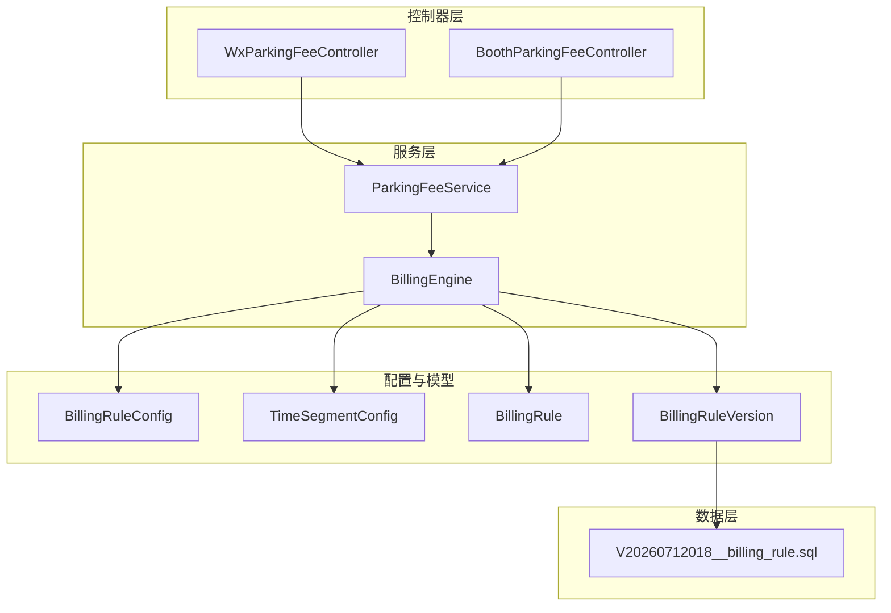
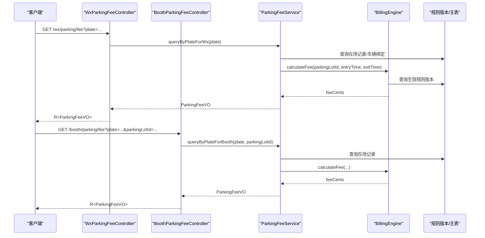
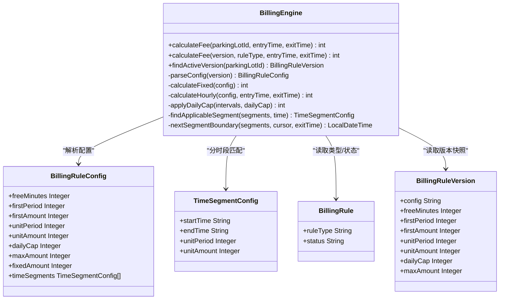
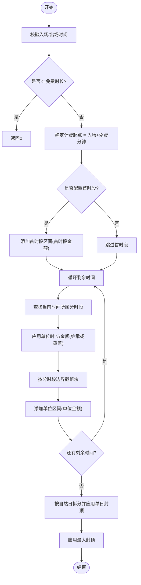
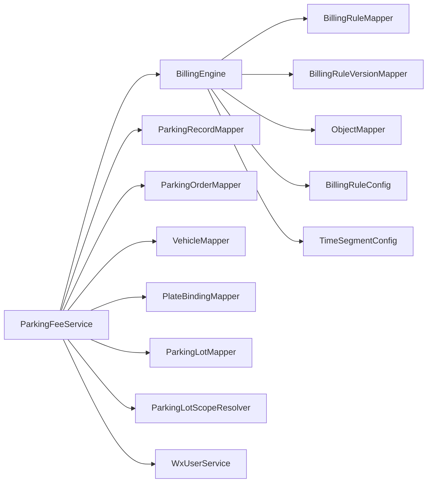

# 费用计算引擎

<cite>
**本文引用的文件**   
- [BillingEngine.java](file://parking-system/src/main/java/com/jushan/system/service/BillingEngine.java)
- [BillingRuleConfig.java](file://parking-system/src/main/java/com/jushan/system/service/BillingRuleConfig.java)
- [TimeSegmentConfig.java](file://parking-system/src/main/java/com/jushan/system/service/TimeSegmentConfig.java)
- [BillingRule.java](file://parking-system/src/main/java/com/jushan/system/entity/BillingRule.java)
- [BillingRuleVersion.java](file://parking-system/src/main/java/com/jushan/system/entity/BillingRuleVersion.java)
- [ParkingFeeService.java](file://parking-system/src/main/java/com/jushan/system/service/ParkingFeeService.java)
- [WxParkingFeeController.java](file://parking-system/src/main/java/com/jushan/system/controller/WxParkingFeeController.java)
- [BoothParkingFeeController.java](file://parking-system/src/main/java/com/jushan/system/controller/BoothParkingFeeController.java)
- [V20260712018__billing_rule.sql](file://parking-boot/src/main/resources/db/migration/V20260712018__billing_rule.sql)
- [BillingEngineTest.java](file://parking-boot/src/test/java/com/jushan/boot/service/BillingEngineTest.java)
</cite>

## 目录
1. [简介](#简介)
2. [项目结构](#项目结构)
3. [核心组件](#核心组件)
4. [架构总览](#架构总览)
5. [详细组件分析](#详细组件分析)
6. [依赖关系分析](#依赖关系分析)
7. [性能与并发优化](#性能与并发优化)
8. [计费精度、四舍五入与财务对账](#计费精度四舍五入与财务对账)
9. [异常处理与可观测性](#异常处理与可观测性)
10. [扩展点与自定义策略指南](#扩展点与自定义策略指南)
11. [故障排查指南](#故障排查指南)
12. [结论](#结论)

## 简介
本技术文档围绕停车费用计算引擎，系统性解析其计费算法与实现细节。重点覆盖：
- 免费模式、固定金额模式、按时计费模式的计算逻辑
- 按时计费的首时段计费、单位时段计费、分时段计费算法
- 跨天计费的自然日封顶与最大封顶策略
- 计费精度控制、四舍五入规则与财务对账要求
- 计费引擎的扩展点设计与自定义计费策略实现指南
- 计费性能优化、缓存策略与高并发场景处理方案
- 计费异常处理、错误日志记录与调试信息输出

## 项目结构
计费相关代码主要位于 parking-system 模块的服务层与实体层，并通过 parking-boot 中的迁移脚本完成数据库表结构初始化；小程序与岗亭端通过控制器暴露查询与预览接口，内部委托 ParkingFeeService 调用 BillingEngine 进行计费。

图表来源
- [WxParkingFeeController.java:1-80](file://parking-system/src/main/java/com/jushan/system/controller/WxParkingFeeController.java#L1-L80)
- [BoothParkingFeeController.java:1-88](file://parking-system/src/main/java/com/jushan/system/controller/BoothParkingFeeController.java#L1-L88)
- [ParkingFeeService.java:1-355](file://parking-system/src/main/java/com/jushan/system/service/ParkingFeeService.java#L1-L355)
- [BillingEngine.java:1-386](file://parking-system/src/main/java/com/jushan/system/service/BillingEngine.java#L1-L386)
- [BillingRuleConfig.java:1-118](file://parking-system/src/main/java/com/jushan/system/service/BillingRuleConfig.java#L1-L118)
- [TimeSegmentConfig.java:1-58](file://parking-system/src/main/java/com/jushan/system/service/TimeSegmentConfig.java#L1-L58)
- [BillingRule.java:1-105](file://parking-system/src/main/java/com/jushan/system/entity/BillingRule.java#L1-L105)
- [BillingRuleVersion.java:1-138](file://parking-system/src/main/java/com/jushan/system/entity/BillingRuleVersion.java#L1-L138)
- [V20260712018__billing_rule.sql:1-82](file://parking-boot/src/main/resources/db/migration/V20260712018__billing_rule.sql#L1-L82)

章节来源
- [WxParkingFeeController.java:1-80](file://parking-system/src/main/java/com/jushan/system/controller/WxParkingFeeController.java#L1-L80)
- [BoothParkingFeeController.java:1-88](file://parking-system/src/main/java/com/jushan/system/controller/BoothParkingFeeController.java#L1-L88)
- [ParkingFeeService.java:1-355](file://parking-system/src/main/java/com/jushan/system/service/ParkingFeeService.java#L1-L355)
- [BillingEngine.java:1-386](file://parking-system/src/main/java/com/jushan/system/service/BillingEngine.java#L1-L386)
- [BillingRuleConfig.java:1-118](file://parking-system/src/main/java/com/jushan/system/service/BillingRuleConfig.java#L1-L118)
- [TimeSegmentConfig.java:1-58](file://parking-system/src/main/java/com/jushan/system/service/TimeSegmentConfig.java#L1-L58)
- [BillingRule.java:1-105](file://parking-system/src/main/java/com/jushan/system/entity/BillingRule.java#L1-L105)
- [BillingRuleVersion.java:1-138](file://parking-system/src/main/java/com/jushan/system/entity/BillingRuleVersion.java#L1-L138)
- [V20260712018__billing_rule.sql:1-82](file://parking-boot/src/main/resources/db/migration/V20260712018__billing_rule.sql#L1-L82)

## 核心组件
- 计费引擎（BillingEngine）：负责根据生效的收费规则版本计算费用，支持免费、固定金额、按时长计费，含首时段、单位时段、分时段、自然日封顶与最大封顶等能力。
- 收费规则配置（BillingRuleConfig、TimeSegmentConfig）：以 JSON 形式存储灵活计费参数，包含免费时长、首时段、单位时段、单价、封顶值及分时段配置。
- 规则主表与版本表（BillingRule、BillingRuleVersion）：规则主表定义类型与状态，版本表保存不可变快照，计费时读取当前生效版本。
- 费用查询服务（ParkingFeeService）：面向小程序与岗亭的费用查询与结算预览入口，封装权限校验、车牌归属校验、记录状态处理，并调用计费引擎。
- 控制器（WxParkingFeeController、BoothParkingFeeController）：对外暴露查询与预览接口，记录审计日志。

章节来源
- [BillingEngine.java:1-386](file://parking-system/src/main/java/com/jushan/system/service/BillingEngine.java#L1-L386)
- [BillingRuleConfig.java:1-118](file://parking-system/src/main/java/com/jushan/system/service/BillingRuleConfig.java#L1-L118)
- [TimeSegmentConfig.java:1-58](file://parking-system/src/main/java/com/jushan/system/service/TimeSegmentConfig.java#L1-L58)
- [BillingRule.java:1-105](file://parking-system/src/main/java/com/jushan/system/entity/BillingRule.java#L1-L105)
- [BillingRuleVersion.java:1-138](file://parking-system/src/main/java/com/jushan/system/entity/BillingRuleVersion.java#L1-L138)
- [ParkingFeeService.java:1-355](file://parking-system/src/main/java/com/jushan/system/service/ParkingFeeService.java#L1-L355)
- [WxParkingFeeController.java:1-80](file://parking-system/src/main/java/com/jushan/system/controller/WxParkingFeeController.java#L1-L80)
- [BoothParkingFeeController.java:1-88](file://parking-system/src/main/java/com/jushan/system/controller/BoothParkingFeeController.java#L1-L88)

## 架构总览
计费流程从控制器进入，经服务层进行业务校验与上下文准备，最终由计费引擎执行具体算法。

图表来源
- [WxParkingFeeController.java:1-80](file://parking-system/src/main/java/com/jushan/system/controller/WxParkingFeeController.java#L1-L80)
- [BoothParkingFeeController.java:1-88](file://parking-system/src/main/java/com/jushan/system/controller/BoothParkingFeeController.java#L1-L88)
- [ParkingFeeService.java:1-355](file://parking-system/src/main/java/com/jushan/system/service/ParkingFeeService.java#L1-L355)
- [BillingEngine.java:1-386](file://parking-system/src/main/java/com/jushan/system/service/BillingEngine.java#L1-L386)
- [BillingRule.java:1-105](file://parking-system/src/main/java/com/jushan/system/entity/BillingRule.java#L1-L105)
- [BillingRuleVersion.java:1-138](file://parking-system/src/main/java/com/jushan/system/entity/BillingRuleVersion.java#L1-L138)

## 详细组件分析

### 计费引擎（BillingEngine）
- 入口方法
  - calculateFee(parkingLotId, entryTime, exitTime)：查找停车场生效版本，校验规则启用状态，再委派到基于版本的计算方法。
  - calculateFee(version, ruleType, entryTime, exitTime)：直接基于版本计算，不校验规则启用状态，便于测试与重新计算。
- 规则解析
  - parseConfig(version)：优先解析 JSON 配置；若为空则回退到列字段构造，兼容旧版本。
- 计费模式
  - NO_FEE：返回 0。
  - FIXED：返回 fixedAmount 或 firstAmount（当 fixedAmount 为 0 时）。
  - HOURLY：按免费时长、首时段、单位时段、分时段、封顶策略计算。
- 封顶策略
  - 最大封顶（maxAmount）：在最终结果上取最小值。
  - 自然日封顶（dailyCap）：将区间按自然日拆分，按日封顶后求和。
- 分时段计费
  - findApplicableSegment：匹配当前时间所在时段，冲突时报错失败关闭。
  - nextSegmentBoundary：将块截断至时段边界，支持跨午夜时段。
- 安全约束
  - 金额使用整数分，禁止浮点数。
  - 无生效规则、规则禁用、配置解析失败、分时段冲突均失败关闭。
  - 计算结果为非负，负值抛异常。

图表来源
- [BillingEngine.java:1-386](file://parking-system/src/main/java/com/jushan/system/service/BillingEngine.java#L1-L386)
- [BillingRuleConfig.java:1-118](file://parking-system/src/main/java/com/jushan/system/service/BillingRuleConfig.java#L1-L118)
- [TimeSegmentConfig.java:1-58](file://parking-system/src/main/java/com/jushan/system/service/TimeSegmentConfig.java#L1-L58)
- [BillingRule.java:1-105](file://parking-system/src/main/java/com/jushan/system/entity/BillingRule.java#L1-L105)
- [BillingRuleVersion.java:1-138](file://parking-system/src/main/java/com/jushan/system/entity/BillingRuleVersion.java#L1-L138)

章节来源
- [BillingEngine.java:1-386](file://parking-system/src/main/java/com/jushan/system/service/BillingEngine.java#L1-L386)

#### 按时计费算法流程（HOURLY）

图表来源
- [BillingEngine.java:193-250](file://parking-system/src/main/java/com/jushan/system/service/BillingEngine.java#L193-L250)
- [BillingEngine.java:252-309](file://parking-system/src/main/java/com/jushan/system/service/BillingEngine.java#L252-L309)
- [BillingEngine.java:322-356](file://parking-system/src/main/java/com/jushan/system/service/BillingEngine.java#L322-L356)

章节来源
- [BillingEngine.java:193-250](file://parking-system/src/main/java/com/jushan/system/service/BillingEngine.java#L193-L250)
- [BillingEngine.java:252-309](file://parking-system/src/main/java/com/jushan/system/service/BillingEngine.java#L252-L309)
- [BillingEngine.java:322-356](file://parking-system/src/main/java/com/jushan/system/service/BillingEngine.java#L322-L356)

### 费用查询服务（ParkingFeeService）
- 小程序端
  - queryByPlateForWx：校验车牌归属当前微信用户，定位唯一在场记录，构建费用 VO。
  - queryByRecordIdForWx：按记录 ID 查询，校验权限。
  - previewForWx：支持指定预览出场时间，用于结算预览。
- 岗亭端
  - queryByPlateForBooth：校验停车场访问范围，定位在场记录。
  - queryByRecordIdForBooth：按记录 ID 查询，校验访问范围。
  - previewForBooth：支持结算预览。
- 公共逻辑
  - buildParkingFee：调用 BillingEngine.calculateFee 计算费用，填充免费时长、规则版本、待支付订单等信息。

章节来源
- [ParkingFeeService.java:76-172](file://parking-system/src/main/java/com/jushan/system/service/ParkingFeeService.java#L76-L172)
- [ParkingFeeService.java:259-353](file://parking-system/src/main/java/com/jushan/system/service/ParkingFeeService.java#L259-L353)

### 控制器（小程序与岗亭）
- WxParkingFeeController：提供按车牌、按记录 ID 查询与预览接口，记录审计日志。
- BoothParkingFeeController：提供相同能力的岗亭端接口，增加权限注解与日志。

章节来源
- [WxParkingFeeController.java:1-80](file://parking-system/src/main/java/com/jushan/system/controller/WxParkingFeeController.java#L1-L80)
- [BoothParkingFeeController.java:1-88](file://parking-system/src/main/java/com/jushan/system/controller/BoothParkingFeeController.java#L1-L88)

### 数据模型与迁移
- billing_rule：规则主表，定义规则类型（HOURLY/FIXED/NO_FEE）、状态（ENABLED/DISABLED）、默认标记等。
- billing_rule_version：规则版本快照，包含 JSON 配置与摘要字段，支持 freeMinutes、firstPeriod、firstAmount、unitPeriod、unitAmount、dailyCap、maxAmount 等明细字段。
- billing_rule_switch_log：规则切换审计日志。

章节来源
- [BillingRule.java:1-105](file://parking-system/src/main/java/com/jushan/system/entity/BillingRule.java#L1-L105)
- [BillingRuleVersion.java:1-138](file://parking-system/src/main/java/com/jushan/system/entity/BillingRuleVersion.java#L1-L138)
- [V20260712018__billing_rule.sql:1-82](file://parking-boot/src/main/resources/db/migration/V20260712018__billing_rule.sql#L1-L82)

## 依赖关系分析
- BillingEngine 依赖：
  - BillingRuleMapper、BillingRuleVersionMapper：查询规则主表与版本快照。
  - ObjectMapper：解析 JSON 配置。
  - BillingRuleConfig、TimeSegmentConfig：承载计费参数与时段配置。
- ParkingFeeService 依赖：
  - 多个 Mapper（ParkingRecord、ParkingOrder、Vehicle、PlateBinding、ParkingLot）：查询记录、订单、车辆与绑定关系。
  - BillingEngine：实际计费计算。
  - ParkingLotScopeResolver、WxUserService：权限与范围校验。

图表来源
- [BillingEngine.java:1-386](file://parking-system/src/main/java/com/jushan/system/service/BillingEngine.java#L1-L386)
- [ParkingFeeService.java:1-355](file://parking-system/src/main/java/com/jushan/system/service/ParkingFeeService.java#L1-L355)

章节来源
- [BillingEngine.java:1-386](file://parking-system/src/main/java/com/jushan/system/service/BillingEngine.java#L1-L386)
- [ParkingFeeService.java:1-355](file://parking-system/src/main/java/com/jushan/system/service/ParkingFeeService.java#L1-L355)

## 性能与并发优化
- 本地缓存建议
  - 生效规则版本缓存：按 parkingLotId 缓存当前生效版本及其 JSON 配置，设置合理 TTL（如 5-10 分钟），降低频繁 DB 查询。
  - 分时段配置缓存：同一规则的 timeSegments 可复用，避免重复解析。
- 计算复杂度
  - HOURLY 模式的时间块划分与分时段边界计算为线性复杂度 O(n)，n 为计费区间内单位块数量；通常 n 较小，性能可控。
- 并发安全
  - 计费引擎为无状态纯计算，线程安全；但需确保外部缓存写入与失效策略一致，避免脏读。
- 预计算与增量更新
  - 对于长时间跨度的停车，可在后台定时任务按自然日拆分并累计费用，减少实时计算压力。

[本节为通用指导，无需源码引用]

## 计费精度、四舍五入与财务对账
- 精度与类型
  - 所有金额统一使用整数分，禁止浮点数，避免精度丢失。
- 四舍五入规则
  - 跨天拆分采用按比例分配，确保两部分之和等于原费用，不进行额外四舍五入，保证总额一致性。
- 财务对账要求
  - 计费结果必须非负；出现负值立即抛出异常，防止入账异常。
  - 最大封顶与单日封顶分别作用于最终结果与每日费用，确保对账口径清晰。
  - 建议保留计费详情（各区间成本、封顶应用情况）以便审计与对账。

章节来源
- [BillingEngine.java:116-128](file://parking-system/src/main/java/com/jushan/system/service/BillingEngine.java#L116-L128)
- [BillingEngine.java:322-356](file://parking-system/src/main/java/com/jushan/system/service/BillingEngine.java#L322-L356)

## 异常处理与可观测性
- 异常类型与触发条件
  - 无生效规则：抛出“未配置生效”的业务异常。
  - 规则已禁用：抛出“当前收费规则已禁用”。
  - 配置解析失败：抛出“计费配置解析失败”。
  - 分时段冲突：抛出“分时段计费规则存在冲突”。
  - 时间非法：出场早于入场或时间为空，抛出参数错误。
  - 负金额：抛出“计算费用为负值”。
- 日志记录
  - 关键路径记录 warn/info 日志，包括计费完成、解析失败、规则缺失等，便于问题定位。
- 调试信息
  - 建议在 ParkingFeeService 中输出规则版本、免费时长、待支付订单等上下文信息，辅助前端展示与排障。

章节来源
- [BillingEngine.java:75-91](file://parking-system/src/main/java/com/jushan/system/service/BillingEngine.java#L75-L91)
- [BillingEngine.java:160-180](file://parking-system/src/main/java/com/jushan/system/service/BillingEngine.java#L160-L180)
- [BillingEngine.java:252-269](file://parking-system/src/main/java/com/jushan/system/service/BillingEngine.java#L252-L269)
- [BillingEngine.java:151-158](file://parking-system/src/main/java/com/jushan/system/service/BillingEngine.java#L151-L158)
- [BillingEngine.java:121-128](file://parking-system/src/main/java/com/jushan/system/service/BillingEngine.java#L121-L128)
- [ParkingFeeService.java:259-353](file://parking-system/src/main/java/com/jushan/system/service/ParkingFeeService.java#L259-L353)

## 扩展点与自定义策略指南
- 扩展点设计建议
  - 新增计费模式：在 calculateFee 的 switch 分支中添加新规则类型，并在 BillingRuleConfig 中扩展对应字段。
  - 自定义封顶策略：在 applyDailyCap 之后引入新的封顶策略（如周封顶、月封顶），保持总额一致性。
  - 分时段增强：扩展 TimeSegmentConfig 支持更复杂的时段权重或折扣系数。
- 实现步骤
  - 在 BillingRuleConfig 中声明新字段，确保 JSON 反序列化兼容。
  - 在 BillingEngine 中实现新算法逻辑，遵循“失败关闭”原则，遇到冲突或非法配置立即抛异常。
  - 补充单元测试，覆盖正常路径、边界条件与异常路径。
- 兼容性
  - 保持对旧版本列字段的回退兼容，确保历史数据不受影响。

章节来源
- [BillingEngine.java:103-128](file://parking-system/src/main/java/com/jushan/system/service/BillingEngine.java#L103-L128)
- [BillingRuleConfig.java:1-118](file://parking-system/src/main/java/com/jushan/system/service/BillingRuleConfig.java#L1-L118)
- [TimeSegmentConfig.java:1-58](file://parking-system/src/main/java/com/jushan/system/service/TimeSegmentConfig.java#L1-L58)

## 故障排查指南
- 常见问题
  - 未找到生效规则：检查 billing_rule_version 中 is_active=1 的记录是否存在。
  - 规则已禁用：确认 billing_rule.status 是否为 ENABLED。
  - 分时段冲突：检查 timeSegments 是否存在重叠，确保每个时间点仅匹配一个时段。
  - 配置解析失败：核对 config JSON 格式与字段名是否与 BillingRuleConfig 一致。
  - 出场时间早于入场时间：校验请求参数或系统时间同步。
- 定位手段
  - 查看 BillingEngine 的 warn/info 日志，关注 versionId、ruleType、feeCents 等关键字段。
  - 使用单元测试用例复现问题，参考 BillingEngineTest 的断言与构造方式。

章节来源
- [BillingEngine.java:75-91](file://parking-system/src/main/java/com/jushan/system/service/BillingEngine.java#L75-L91)
- [BillingEngine.java:160-180](file://parking-system/src/main/java/com/jushan/system/service/BillingEngine.java#L160-L180)
- [BillingEngine.java:252-269](file://parking-system/src/main/java/com/jushan/system/service/BillingEngine.java#L252-L269)
- [BillingEngineTest.java:1-232](file://parking-boot/src/test/java/com/jushan/boot/service/BillingEngineTest.java#L1-L232)

## 结论
计费引擎以清晰的职责分层与严格的失败关闭策略，实现了免费、固定金额与按时计费的完整能力，并支持分时段计费、自然日封顶与最大封顶。通过整数分精度与比例拆分，保障财务对账的一致性。结合缓存与合理的异常日志，可在高并发场景下稳定运行。未来可通过扩展点机制平滑接入新的计费策略，同时保持向后兼容。