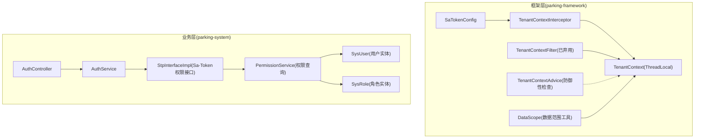
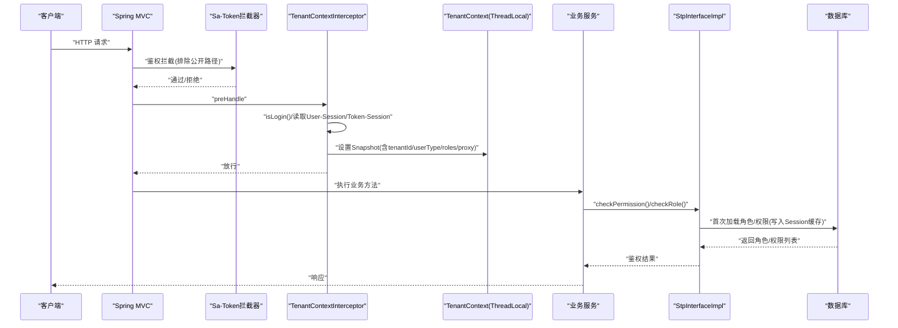
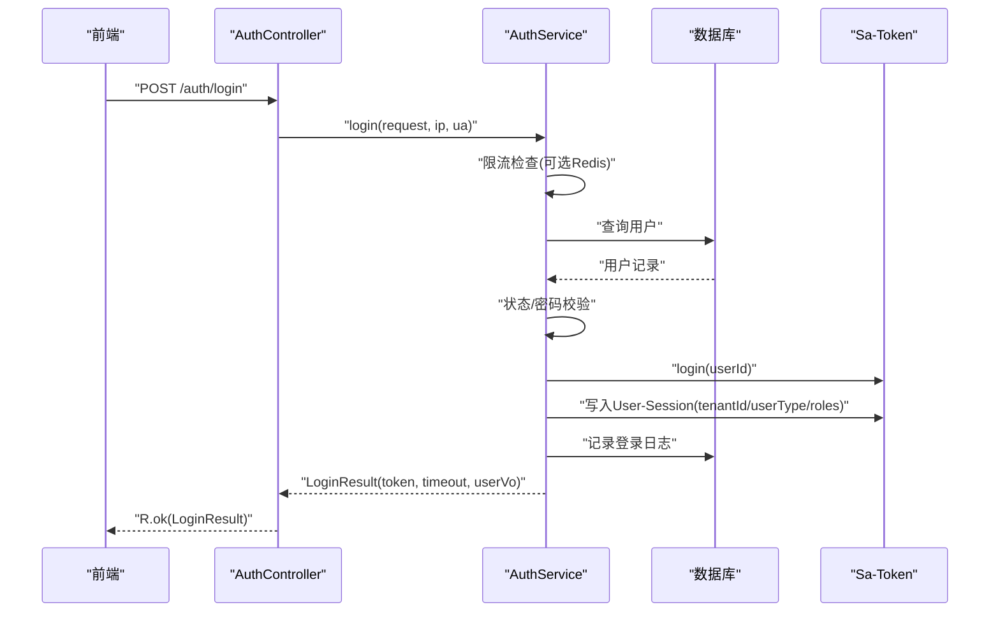
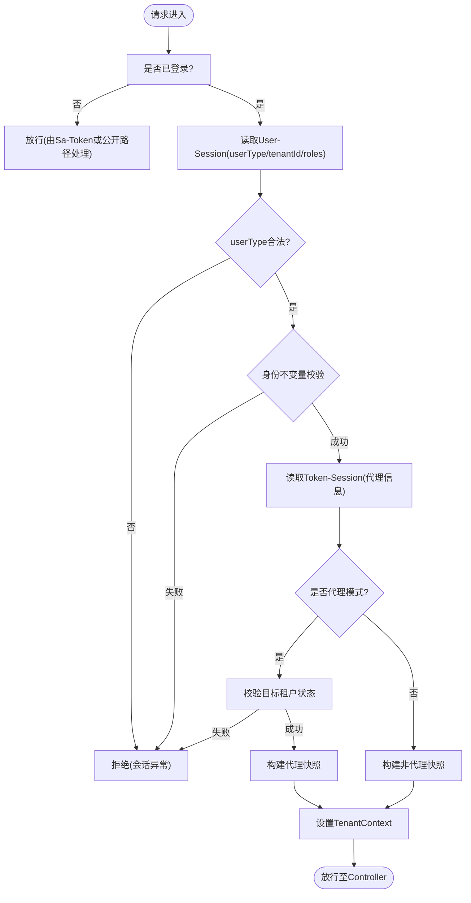
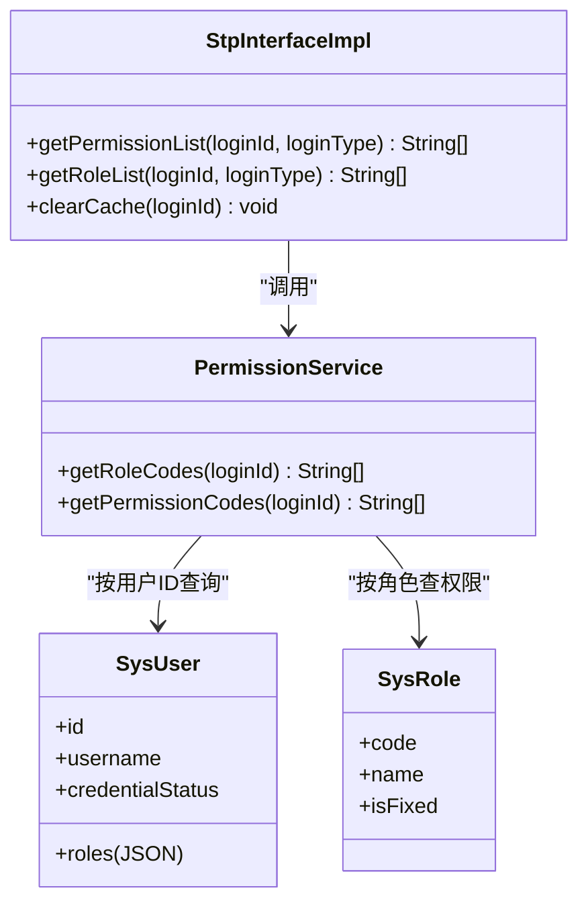
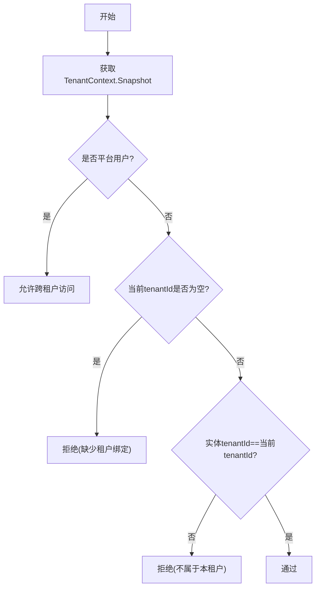
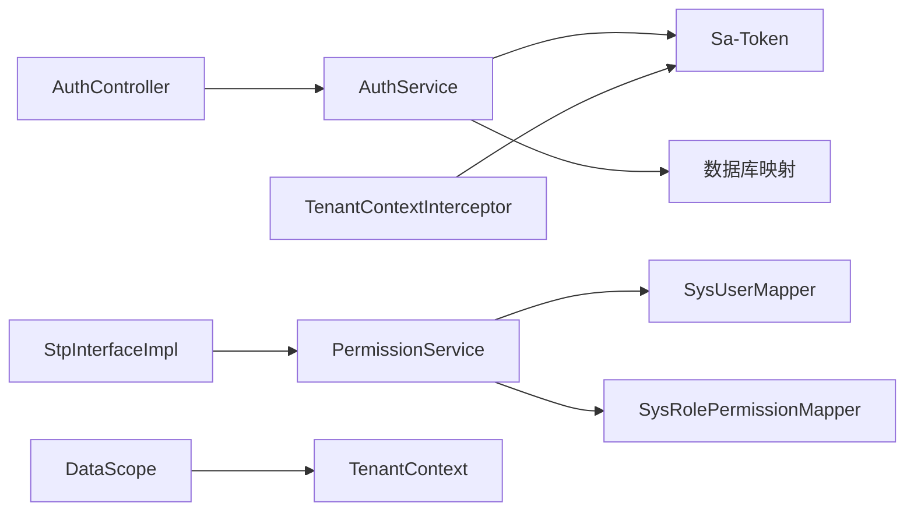

# 认证授权模块

<cite>
**本文引用的文件**   
- [SaTokenConfig.java](file://parking-framework/src/main/java/com/jushan/framework/auth/SaTokenConfig.java)
- [TenantContextInterceptor.java](file://parking-framework/src/main/java/com/jushan/framework/auth/TenantContextInterceptor.java)
- [TenantContextFilter.java](file://parking-framework/src/main/java/com/jushan/framework/auth/TenantContextFilter.java)
- [TenantContextAdvice.java](file://parking-framework/src/main/java/com/jushan/framework/auth/TenantContextAdvice.java)
- [TenantContext.java](file://parking-framework/src/main/java/com/jushan/framework/auth/TenantContext.java)
- [DataScope.java](file://parking-framework/src/main/java/com/jushan/framework/auth/DataScope.java)
- [AuthController.java](file://parking-system/src/main/java/com/jushan/system/controller/AuthController.java)
- [AuthService.java](file://parking-system/src/main/java/com/jushan/system/service/AuthService.java)
- [StpInterfaceImpl.java](file://parking-system/src/main/java/com/jushan/system/service/StpInterfaceImpl.java)
- [PermissionService.java](file://parking-system/src/main/java/com/jushan/system/service/PermissionService.java)
- [SysUser.java](file://parking-system/src/main/java/com/jushan/system/entity/SysUser.java)
- [SysRole.java](file://parking-system/src/main/java/com/jushan/system/entity/SysRole.java)
</cite>

## 目录
1. [简介](#简介)
2. [项目结构](#项目结构)
3. [核心组件](#核心组件)
4. [架构总览](#架构总览)
5. [详细组件分析](#详细组件分析)
6. [依赖关系分析](#依赖关系分析)
7. [性能考虑](#性能考虑)
8. [故障排查指南](#故障排查指南)
9. [结论](#结论)
10. [附录](#附录)

## 简介
本技术文档聚焦于基于 Sa-Token 的认证与授权实现，覆盖用户登录流程、Token 管理、会话控制与安全策略配置；并深入说明多租户上下文管理机制（租户 ID 提取、数据隔离、权限验证）、角色权限模型、数据范围控制与细粒度权限校验。文档同时提供集成示例路径、扩展点与最佳实践，以及常见安全问题解决方案与性能优化建议。

## 项目结构
认证授权相关代码主要分布在两个模块：
- parking-framework：框架层安全能力（Sa-Token 配置、租户上下文装配、数据范围工具）
- parking-system：业务层认证服务、权限加载接口实现、实体与控制器

图表来源
- [SaTokenConfig.java:1-65](file://parking-framework/src/main/java/com/jushan/framework/auth/SaTokenConfig.java#L1-L65)
- [TenantContextInterceptor.java:1-239](file://parking-framework/src/main/java/com/jushan/framework/auth/TenantContextInterceptor.java#L1-L239)
- [TenantContextFilter.java:1-138](file://parking-framework/src/main/java/com/jushan/framework/auth/TenantContextFilter.java#L1-L138)
- [TenantContextAdvice.java:1-88](file://parking-framework/src/main/java/com/jushan/framework/auth/TenantContextAdvice.java#L1-L88)
- [TenantContext.java:1-257](file://parking-framework/src/main/java/com/jushan/framework/auth/TenantContext.java#L1-L257)
- [DataScope.java:1-240](file://parking-framework/src/main/java/com/jushan/framework/auth/DataScope.java#L1-L240)
- [AuthController.java:1-100](file://parking-system/src/main/java/com/jushan/system/controller/AuthController.java#L1-L100)
- [AuthService.java:1-362](file://parking-system/src/main/java/com/jushan/system/service/AuthService.java#L1-L362)
- [StpInterfaceImpl.java:1-107](file://parking-system/src/main/java/com/jushan/system/service/StpInterfaceImpl.java#L1-L107)
- [PermissionService.java:1-105](file://parking-system/src/main/java/com/jushan/system/service/PermissionService.java#L1-L105)
- [SysUser.java:1-81](file://parking-system/src/main/java/com/jushan/system/entity/SysUser.java#L1-L81)
- [SysRole.java:1-65](file://parking-system/src/main/java/com/jushan/system/entity/SysRole.java#L1-L65)

章节来源
- [SaTokenConfig.java:1-65](file://parking-framework/src/main/java/com/jushan/framework/auth/SaTokenConfig.java#L1-L65)
- [TenantContextInterceptor.java:1-239](file://parking-framework/src/main/java/com/jushan/framework/auth/TenantContextInterceptor.java#L1-L239)
- [TenantContextFilter.java:1-138](file://parking-framework/src/main/java/com/jushan/framework/auth/TenantContextFilter.java#L1-L138)
- [TenantContextAdvice.java:1-88](file://parking-framework/src/main/java/com/jushan/framework/auth/TenantContextAdvice.java#L1-L88)
- [TenantContext.java:1-257](file://parking-framework/src/main/java/com/jushan/framework/auth/TenantContext.java#L1-L257)
- [DataScope.java:1-240](file://parking-framework/src/main/java/com/jushan/framework/auth/DataScope.java#L1-L240)
- [AuthController.java:1-100](file://parking-system/src/main/java/com/jushan/system/controller/AuthController.java#L1-L100)
- [AuthService.java:1-362](file://parking-system/src/main/java/com/jushan/system/service/AuthService.java#L1-L362)
- [StpInterfaceImpl.java:1-107](file://parking-system/src/main/java/com/jushan/system/service/StpInterfaceImpl.java#L1-L107)
- [PermissionService.java:1-105](file://parking-system/src/main/java/com/jushan/system/service/PermissionService.java#L1-L105)
- [SysUser.java:1-81](file://parking-system/src/main/java/com/jushan/system/entity/SysUser.java#L1-L81)
- [SysRole.java:1-65](file://parking-system/src/main/java/com/jushan/system/entity/SysRole.java#L1-L65)

## 核心组件
- Sa-Token 基础配置：全局鉴权拦截器、公开路径白名单、异常统一处理、Redis 会话存储回退策略
- 租户上下文装配：唯一权威链路为 Spring MVC Interceptor，严格身份不变量校验与代理模式支持
- 权限加载接口：Sa-Token 角色/权限缓存至 Session，避免频繁数据库访问
- 数据范围工具：租户匹配、角色精确匹配、平台用户强制校验、停车场范围校验
- 认证服务：登录限流、密码校验、审计日志、会话管理与凭据状态处理

章节来源
- [SaTokenConfig.java:1-65](file://parking-framework/src/main/java/com/jushan/framework/auth/SaTokenConfig.java#L1-L65)
- [TenantContextInterceptor.java:1-239](file://parking-framework/src/main/java/com/jushan/framework/auth/TenantContextInterceptor.java#L1-L239)
- [StpInterfaceImpl.java:1-107](file://parking-system/src/main/java/com/jushan/system/service/StpInterfaceImpl.java#L1-L107)
- [DataScope.java:1-240](file://parking-framework/src/main/java/com/jushan/framework/auth/DataScope.java#L1-L240)
- [AuthService.java:1-362](file://parking-system/src/main/java/com/jushan/system/service/AuthService.java#L1-L362)

## 架构总览
下图展示从请求进入、认证、租户上下文装配到权限校验的整体流程。

图表来源
- [SaTokenConfig.java:1-65](file://parking-framework/src/main/java/com/jushan/framework/auth/SaTokenConfig.java#L1-L65)
- [TenantContextInterceptor.java:1-239](file://parking-framework/src/main/java/com/jushan/framework/auth/TenantContextInterceptor.java#L1-L239)
- [StpInterfaceImpl.java:1-107](file://parking-system/src/main/java/com/jushan/system/service/StpInterfaceImpl.java#L1-L107)

## 详细组件分析

### 认证与登录流程
- 登录入口：控制器接收用户名与密码，调用认证服务完成限流、账号状态、密码校验、Sa-Token 登录与会话初始化
- 会话信息：将租户 ID、用户类型、角色等写入 User-Session；代理状态写入 Token-Session
- 退出与修改密码：登出使 Token 失效；修改密码后强制注销所有会话

图表来源
- [AuthController.java:1-100](file://parking-system/src/main/java/com/jushan/system/controller/AuthController.java#L1-L100)
- [AuthService.java:1-362](file://parking-system/src/main/java/com/jushan/system/service/AuthService.java#L1-L362)

章节来源
- [AuthController.java:1-100](file://parking-system/src/main/java/com/jushan/system/controller/AuthController.java#L1-L100)
- [AuthService.java:1-362](file://parking-system/src/main/java/com/jushan/system/service/AuthService.java#L1-L362)

### 租户上下文管理
- 唯一权威装配点：TenantContextInterceptor 在 preHandle 中填充 TenantContext.Snapshot，afterCompletion 清理
- 身份不变量：platform（无租户绑定）、tenant（有租户绑定）、proxy（平台用户以目标租户范围代操作）
- 代理模式：从 Token-Session 读取代理信息，严格限制目标租户范围
- 废弃链路：TenantContextFilter 不再注册，仅保留历史参考；TenantContextAdvice 仅做防御性告警

图表来源
- [TenantContextInterceptor.java:1-239](file://parking-framework/src/main/java/com/jushan/framework/auth/TenantContextInterceptor.java#L1-L239)
- [TenantContext.java:1-257](file://parking-framework/src/main/java/com/jushan/framework/auth/TenantContext.java#L1-L257)

章节来源
- [TenantContextInterceptor.java:1-239](file://parking-framework/src/main/java/com/jushan/framework/auth/TenantContextInterceptor.java#L1-L239)
- [TenantContextFilter.java:1-138](file://parking-framework/src/main/java/com/jushan/framework/auth/TenantContextFilter.java#L1-L138)
- [TenantContextAdvice.java:1-88](file://parking-framework/src/main/java/com/jushan/framework/auth/TenantContextAdvice.java#L1-L88)
- [TenantContext.java:1-257](file://parking-framework/src/main/java/com/jushan/framework/auth/TenantContext.java#L1-L257)

### 权限模型与细粒度校验
- 角色与权限加载：StpInterfaceImpl 实现 Sa-Token 权限接口，首次加载后缓存至 Session
- 权限查询：PermissionService 根据用户角色计算权限集合，供 @SaCheckPermission/@SaCheckRole 使用
- 数据范围：DataScope 提供租户匹配、角色精确匹配、平台用户强制校验、停车场范围校验等 fail-close 断言

图表来源
- [StpInterfaceImpl.java:1-107](file://parking-system/src/main/java/com/jushan/system/service/StpInterfaceImpl.java#L1-L107)
- [PermissionService.java:1-105](file://parking-system/src/main/java/com/jushan/system/service/PermissionService.java#L1-L105)
- [SysUser.java:1-81](file://parking-system/src/main/java/com/jushan/system/entity/SysUser.java#L1-L81)
- [SysRole.java:1-65](file://parking-system/src/main/java/com/jushan/system/entity/SysRole.java#L1-L65)

章节来源
- [StpInterfaceImpl.java:1-107](file://parking-system/src/main/java/com/jushan/system/service/StpInterfaceImpl.java#L1-L107)
- [PermissionService.java:1-105](file://parking-system/src/main/java/com/jushan/system/service/PermissionService.java#L1-L105)
- [SysUser.java:1-81](file://parking-system/src/main/java/com/jushan/system/entity/SysUser.java#L1-L81)
- [SysRole.java:1-65](file://parking-system/src/main/java/com/jushan/system/entity/SysRole.java#L1-L65)

### 数据范围控制与租户隔离
- 租户匹配：DataScope.validateTenantMatch 要求显式平台用户才允许跨租户访问，否则必须 tenantId 完全匹配
- 角色精确匹配：DataScope.requireRole 使用 JSON 数组解析进行精确匹配，防止子串误匹配
- 平台用户强制校验：DataScope.requirePlatformUser 正向确认 isPlatformUser() == true
- 停车场范围：DataScope.validateParkingLotsBelongToTenant 批量校验停车场归属

图表来源
- [DataScope.java:1-240](file://parking-framework/src/main/java/com/jushan/framework/auth/DataScope.java#L1-L240)
- [TenantContext.java:1-257](file://parking-framework/src/main/java/com/jushan/framework/auth/TenantContext.java#L1-L257)

章节来源
- [DataScope.java:1-240](file://parking-framework/src/main/java/com/jushan/framework/auth/DataScope.java#L1-L240)
- [TenantContext.java:1-257](file://parking-framework/src/main/java/com/jushan/framework/auth/TenantContext.java#L1-L257)

### 安全策略与配置要点
- 全局鉴权拦截器：除公开路径外，所有请求需登录；异常由 @RestControllerAdvice 统一处理
- Redis 会话存储：生产环境确保 Redis 可用，不可用时自动回退内存存储
- 令牌名称：通过 sa-token.token-name 配置读取 Authorization 头中的 Token
- 公开路径白名单：/actuator/**、/auth/login、/wx/login、/register/**、/demo/**、/api/v1/internal/mock/**、静态资源与错误页

章节来源
- [SaTokenConfig.java:1-65](file://parking-framework/src/main/java/com/jushan/framework/auth/SaTokenConfig.java#L1-L65)

## 依赖关系分析
- 控制器与服务：AuthController 依赖 AuthService
- 认证与会话：AuthService 依赖 Sa-Token 与数据库映射
- 权限加载：StpInterfaceImpl 依赖 PermissionService，后者依赖用户与角色映射
- 上下文装配：TenantContextInterceptor 依赖 Sa-Token 与 SecurityPrincipalValidator（可选）
- 数据范围：DataScope 依赖 TenantContext 提供的线程级上下文

图表来源
- [AuthController.java:1-100](file://parking-system/src/main/java/com/jushan/system/controller/AuthController.java#L1-L100)
- [AuthService.java:1-362](file://parking-system/src/main/java/com/jushan/system/service/AuthService.java#L1-L362)
- [StpInterfaceImpl.java:1-107](file://parking-system/src/main/java/com/jushan/system/service/StpInterfaceImpl.java#L1-L107)
- [PermissionService.java:1-105](file://parking-system/src/main/java/com/jushan/system/service/PermissionService.java#L1-L105)
- [TenantContextInterceptor.java:1-239](file://parking-framework/src/main/java/com/jushan/framework/auth/TenantContextInterceptor.java#L1-L239)
- [DataScope.java:1-240](file://parking-framework/src/main/java/com/jushan/framework/auth/DataScope.java#L1-L240)
- [TenantContext.java:1-257](file://parking-framework/src/main/java/com/jushan/framework/auth/TenantContext.java#L1-L257)

章节来源
- [AuthController.java:1-100](file://parking-system/src/main/java/com/jushan/system/controller/AuthController.java#L1-L100)
- [AuthService.java:1-362](file://parking-system/src/main/java/com/jushan/system/service/AuthService.java#L1-L362)
- [StpInterfaceImpl.java:1-107](file://parking-system/src/main/java/com/jushan/system/service/StpInterfaceImpl.java#L1-L107)
- [PermissionService.java:1-105](file://parking-system/src/main/java/com/jushan/system/service/PermissionService.java#L1-L105)
- [TenantContextInterceptor.java:1-239](file://parking-framework/src/main/java/com/jushan/framework/auth/TenantContextInterceptor.java#L1-L239)
- [DataScope.java:1-240](file://parking-framework/src/main/java/com/jushan/framework/auth/DataScope.java#L1-L240)
- [TenantContext.java:1-257](file://parking-framework/src/main/java/com/jushan/framework/auth/TenantContext.java#L1-L257)

## 性能考虑
- 权限缓存：StpInterfaceImpl 将角色与权限缓存至 Sa-Token Session，减少每次鉴权的数据库访问
- 限流降级：登录失败计数依赖 Redis，不可用时自动降级，不阻塞主流程
- 会话存储：生产环境启用 Redis 会话存储，避免进程重启导致会话丢失
- 角色解析：JSON 数组解析采用轻量实现，避免引入额外依赖

章节来源
- [StpInterfaceImpl.java:1-107](file://parking-system/src/main/java/com/jushan/system/service/StpInterfaceImpl.java#L1-L107)
- [AuthService.java:1-362](file://parking-system/src/main/java/com/jushan/system/service/AuthService.java#L1-L362)
- [SaTokenConfig.java:1-65](file://parking-framework/src/main/java/com/jushan/framework/auth/SaTokenConfig.java#L1-L65)

## 故障排查指南
- 未登录或会话过期：检查 Sa-Token 拦截器与公开路径白名单；确认 Authorization 头携带正确 token-name
- 租户上下文为空但已认证：查看 TenantContextAdvice 防御性告警日志；确认 TenantContextInterceptor 正常注册与执行
- 代理模式异常：检查 Token-Session 中代理字段是否正确写入；确认目标租户状态有效
- 权限校验失败：确认 StpInterfaceImpl 缓存命中；必要时清除指定用户缓存后重新登录
- 登录限流触发：检查 Redis 连接与键空间；确认失败次数窗口与阈值配置

章节来源
- [SaTokenConfig.java:1-65](file://parking-framework/src/main/java/com/jushan/framework/auth/SaTokenConfig.java#L1-L65)
- [TenantContextAdvice.java:1-88](file://parking-framework/src/main/java/com/jushan/framework/auth/TenantContextAdvice.java#L1-L88)
- [TenantContextInterceptor.java:1-239](file://parking-framework/src/main/java/com/jushan/framework/auth/TenantContextInterceptor.java#L1-L239)
- [StpInterfaceImpl.java:1-107](file://parking-system/src/main/java/com/jushan/system/service/StpInterfaceImpl.java#L1-L107)
- [AuthService.java:1-362](file://parking-system/src/main/java/com/jushan/system/service/AuthService.java#L1-L362)

## 结论
本模块以 Sa-Token 为核心，结合严格的租户上下文装配与数据范围控制，实现了高内聚、低耦合的认证授权体系。通过 Session 缓存与限流降级策略，在保证安全性的前提下兼顾了性能与可用性。建议在后续迭代中持续完善动态角色与细粒度权限扩展点，并强化审计与监控能力。

## 附录

### 集成示例与最佳实践
- 登录集成：参考控制器与服务路径，确保前端传递正确的 token-name 并在后续请求中携带 Authorization 头
- 自定义权限验证器：实现 SecurityPrincipalValidator 以接入用户/租户状态校验逻辑
- 安全异常处理：利用 @RestControllerAdvice 统一捕获并返回标准错误结构
- 异步任务上下文：在异步线程中手动 capture/restore TenantContext 快照，保证上下文一致性

章节来源
- [AuthController.java:1-100](file://parking-system/src/main/java/com/jushan/system/controller/AuthController.java#L1-L100)
- [AuthService.java:1-362](file://parking-system/src/main/java/com/jushan/system/service/AuthService.java#L1-L362)
- [TenantContext.java:1-257](file://parking-framework/src/main/java/com/jushan/framework/auth/TenantContext.java#L1-L257)