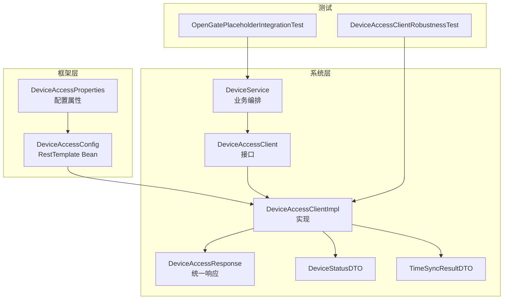
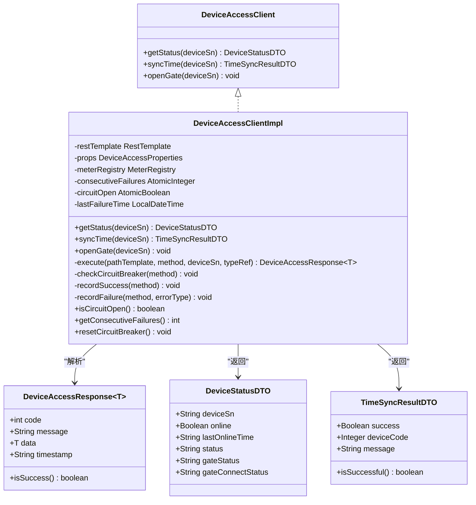
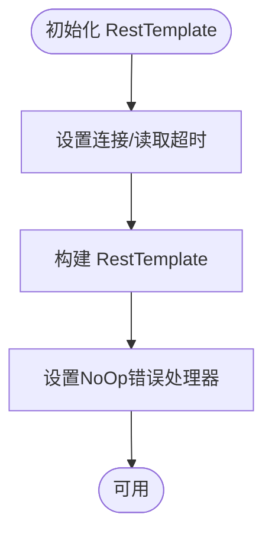
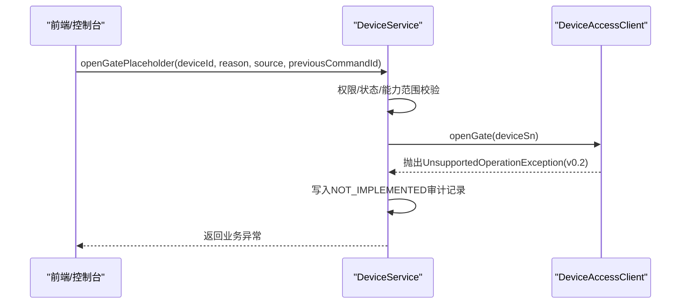
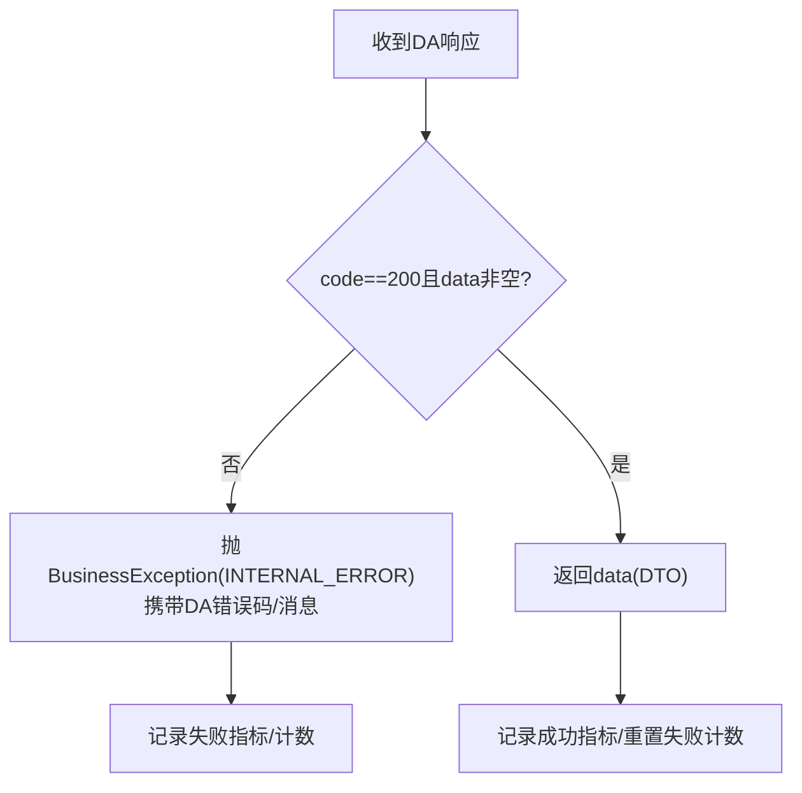
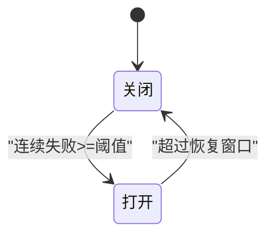
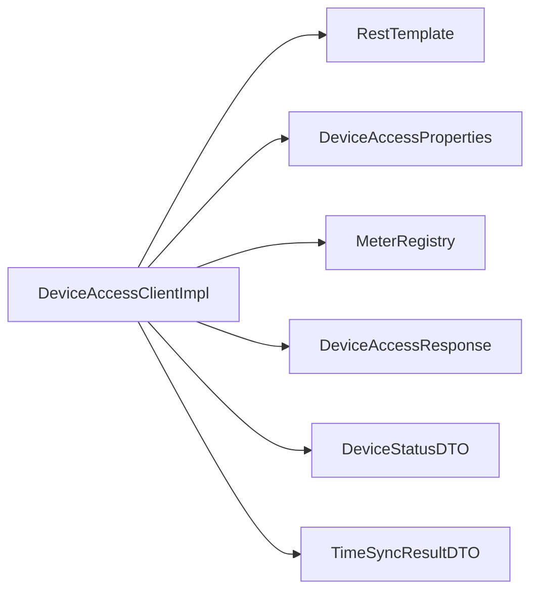

# Device Access服务集成

<cite>
**本文引用的文件**   
- [DeviceAccessClient.java](file://parking-system/src/main/java/com/jushan/system/client/DeviceAccessClient.java)
- [DeviceAccessClientImpl.java](file://parking-system/src/main/java/com/jushan/system/client/DeviceAccessClientImpl.java)
- [DeviceAccessConfig.java](file://parking-framework/src/main/java/com/jushan/framework/config/DeviceAccessConfig.java)
- [DeviceAccessProperties.java](file://parking-framework/src/main/java/com/jushan/framework/config/DeviceAccessProperties.java)
- [DeviceAccessResponse.java](file://parking-system/src/main/java/com/jushan/system/client/dto/DeviceAccessResponse.java)
- [DeviceStatusDTO.java](file://parking-system/src/main/java/com/jushan/system/client/dto/DeviceStatusDTO.java)
- [TimeSyncResultDTO.java](file://parking-system/src/main/java/com/jushan/system/client/dto/TimeSyncResultDTO.java)
- [DeviceService.java](file://parking-system/src/main/java/com/jushan/system/service/DeviceService.java)
- [OpenGatePlaceholderIntegrationTest.java](file://parking-boot/src/test/java/com/jushan/boot/service/OpenGatePlaceholderIntegrationTest.java)
- [DeviceAccessClientRobustnessTest.java](file://parking-boot/src/test/java/com/jushan/boot/client/DeviceAccessClientRobustnessTest.java)
</cite>

## 目录
1. [简介](#简介)
2. [项目结构](#项目结构)
3. [核心组件](#核心组件)
4. [架构总览](#架构总览)
5. [详细组件分析](#详细组件分析)
6. [依赖关系分析](#依赖关系分析)
7. [性能与可靠性考虑](#性能与可靠性考虑)
8. [故障排查指南](#故障排查指南)
9. [结论](#结论)
10. [附录](#附录)

## 简介
本技术文档围绕 Device Access 服务集成功能，系统性阐述 DeviceAccessClient 的设计模式与实现架构，覆盖 HTTP 客户端封装、连接池与超时配置、重试策略、设备命令下发机制（开闸、关闸、配置更新等）、响应数据解析与错误码映射、熔断降级、限流保护、监控埋点、安全认证与签名验证流程，以及异步命令执行与结果回调处理模式。当前版本基于 v0.2 契约，部分能力（如开闸）以占位方式预留，待 v1.0 契约冻结后启用。

## 项目结构
本项目采用分层模块化组织：
- framework 层提供通用配置与基础设施（HTTP 客户端、属性绑定、Web 与安全等）
- system 层承载业务领域逻辑与对外接口（设备管理、计费、权限等）
- boot 层为应用启动与测试入口

Device Access 相关代码主要分布在：
- parking-framework: DeviceAccessConfig、DeviceAccessProperties
- parking-system: DeviceAccessClient 接口与实现、统一响应与 DTO
- parking-boot: 健壮性与集成测试用例



图表来源
- [DeviceAccessConfig.java:1-71](file://parking-framework/src/main/java/com/jushan/framework/config/DeviceAccessConfig.java#L1-L71)
- [DeviceAccessProperties.java:1-44](file://parking-framework/src/main/java/com/jushan/framework/config/DeviceAccessProperties.java#L1-L44)
- [DeviceAccessClient.java:1-65](file://parking-system/src/main/java/com/jushan/system/client/DeviceAccessClient.java#L1-L65)
- [DeviceAccessClientImpl.java:1-346](file://parking-system/src/main/java/com/jushan/system/client/DeviceAccessClientImpl.java#L1-L346)
- [DeviceAccessResponse.java:1-55](file://parking-system/src/main/java/com/jushan/system/client/dto/DeviceAccessResponse.java#L1-L55)
- [DeviceStatusDTO.java:1-68](file://parking-system/src/main/java/com/jushan/system/client/dto/DeviceStatusDTO.java#L1-L68)
- [TimeSyncResultDTO.java:1-58](file://parking-system/src/main/java/com/jushan/system/client/dto/TimeSyncResultDTO.java#L1-L58)
- [DeviceService.java:648-681](file://parking-system/src/main/java/com/jushan/system/service/DeviceService.java#L648-L681)
- [DeviceAccessClientRobustnessTest.java:29-69](file://parking-boot/src/test/java/com/jushan/boot/client/DeviceAccessClientRobustnessTest.java#L29-L69)
- [OpenGatePlaceholderIntegrationTest.java:163-242](file://parking-boot/src/test/java/com/jushan/boot/service/OpenGatePlaceholderIntegrationTest.java#L163-L242)

章节来源
- [DeviceAccessConfig.java:1-71](file://parking-framework/src/main/java/com/jushan/framework/config/DeviceAccessConfig.java#L1-L71)
- [DeviceAccessProperties.java:1-44](file://parking-framework/src/main/java/com/jushan/framework/config/DeviceAccessProperties.java#L1-L44)
- [DeviceAccessClient.java:1-65](file://parking-system/src/main/java/com/jushan/system/client/DeviceAccessClient.java#L1-L65)
- [DeviceAccessClientImpl.java:1-346](file://parking-system/src/main/java/com/jushan/system/client/DeviceAccessClientImpl.java#L1-L346)
- [DeviceAccessResponse.java:1-55](file://parking-system/src/main/java/com/jushan/system/client/dto/DeviceAccessResponse.java#L1-L55)
- [DeviceStatusDTO.java:1-68](file://parking-system/src/main/java/com/jushan/system/client/dto/DeviceStatusDTO.java#L1-L68)
- [TimeSyncResultDTO.java:1-58](file://parking-system/src/main/java/com/jushan/system/client/dto/TimeSyncResultDTO.java#L1-L58)
- [DeviceService.java:648-681](file://parking-system/src/main/java/com/jushan/system/service/DeviceService.java#L648-L681)
- [DeviceAccessClientRobustnessTest.java:29-69](file://parking-boot/src/test/java/com/jushan/boot/client/DeviceAccessClientRobustnessTest.java#L29-L69)
- [OpenGatePlaceholderIntegrationTest.java:163-242](file://parking-boot/src/test/java/com/jushan/boot/service/OpenGatePlaceholderIntegrationTest.java#L163-L242)

## 核心组件
- DeviceAccessClient 接口：定义面向业务的设备访问能力，包括状态查询、校时、开闸（v0.2 未实现，默认抛出异常）。
- DeviceAccessClientImpl 实现：基于 RestTemplate 的 HTTP 调用封装，包含指标采集、熔断降级、错误分类与记录。
- DeviceAccessConfig/Properties：创建专用 RestTemplate Bean，设置连接与读取超时，禁用自动重试；属性前缀 jushan.device-access。
- 统一响应与 DTO：DeviceAccessResponse<T> 表示 DA 统一响应；DeviceStatusDTO、TimeSyncResultDTO 分别表示状态与校时结果。
- DeviceService：业务编排层，负责权限校验、审计记录、命令下发占位与后续扩展。

章节来源
- [DeviceAccessClient.java:1-65](file://parking-system/src/main/java/com/jushan/system/client/DeviceAccessClient.java#L1-L65)
- [DeviceAccessClientImpl.java:1-346](file://parking-system/src/main/java/com/jushan/system/client/DeviceAccessClientImpl.java#L1-L346)
- [DeviceAccessConfig.java:1-71](file://parking-framework/src/main/java/com/jushan/framework/config/DeviceAccessConfig.java#L1-L71)
- [DeviceAccessProperties.java:1-44](file://parking-framework/src/main/java/com/jushan/framework/config/DeviceAccessProperties.java#L1-L44)
- [DeviceAccessResponse.java:1-55](file://parking-system/src/main/java/com/jushan/system/client/dto/DeviceAccessResponse.java#L1-L55)
- [DeviceStatusDTO.java:1-68](file://parking-system/src/main/java/com/jushan/system/client/dto/DeviceStatusDTO.java#L1-L68)
- [TimeSyncResultDTO.java:1-58](file://parking-system/src/main/java/com/jushan/system/client/dto/TimeSyncResultDTO.java#L1-L58)
- [DeviceService.java:648-681](file://parking-system/src/main/java/com/jushan/system/service/DeviceService.java#L648-L681)

## 架构总览
整体调用链路从业务层 DeviceService 发起，通过 DeviceAccessClient 接口进入实现类，使用专用 RestTemplate 向 Device Access 服务发送 HTTP 请求，统一响应经 DeviceAccessResponse 解析并转换为业务 DTO，失败路径按错误类型分类并触发降级与指标上报。

```mermaid
sequenceDiagram
participant Biz as "业务层(DeviceService)"
participant Client as "DeviceAccessClient(接口)"
participant Impl as "DeviceAccessClientImpl(实现)"
participant RT as "RestTemplate(专用Bean)"
participant DA as "Device Access服务"
Biz->>Client : getStatus(deviceSn)/syncTime(deviceSn)
Client->>Impl : 委托调用
Impl->>Impl : 检查熔断/开始计时
Impl->>RT : exchange(url, method, typeRef, deviceSn)
RT-->>Impl : ResponseEntity<DeviceAccessResponse<T>>
Impl->>Impl : 解析响应/错误分类/记录指标
Impl-->>Biz : 返回业务DTO或抛BusinessException
Note over Impl,Biz : 网络异常标记UNCERTAIN; 连续失败触发降级
```

图表来源
- [DeviceAccessClient.java:1-65](file://parking-system/src/main/java/com/jushan/system/client/DeviceAccessClient.java#L1-L65)
- [DeviceAccessClientImpl.java:109-158](file://parking-system/src/main/java/com/jushan/system/client/DeviceAccessClientImpl.java#L109-L158)
- [DeviceAccessConfig.java:42-69](file://parking-framework/src/main/java/com/jushan/framework/config/DeviceAccessConfig.java#L42-L69)
- [DeviceAccessResponse.java:1-55](file://parking-system/src/main/java/com/jushan/system/client/dto/DeviceAccessResponse.java#L1-L55)

## 详细组件分析

### DeviceAccessClient 接口设计
- 职责边界：屏蔽底层 URL 拼接与协议细节，业务仅通过方法名表达意图。
- 已实现能力：
  - 状态查询：GET /api/v1/devices/{deviceSn}/status → DeviceStatusDTO
  - 设备校时：POST /api/v1/devices/{deviceSn}/time/sync → TimeSyncResultDTO
- 预留能力：
  - 开闸：openGate(String) 在 v0.2 中默认抛出 UnsupportedOperationException，待 v1.0 契约冻结后启用。

章节来源
- [DeviceAccessClient.java:1-65](file://parking-system/src/main/java/com/jushan/system/client/DeviceAccessClient.java#L1-L65)

### DeviceAccessClientImpl 实现与错误分类
- HTTP 调用：通过 execute(pathTemplate, method, deviceSn, typeRef) 统一封装，URL 由 baseUrl + pathTemplate 拼接。
- 响应解析：
  - 空响应体 → INTERNAL_ERROR
  - DA code != 200 → INTERNAL_ERROR（携带 DA code/message）
  - 成功 → 返回 data
- 异常分类：
  - ResourceAccessException（网络超时/连接失败）→ INTERNAL_ERROR（UNCERTAIN）
  - RestClientException（序列化/反序列化/未知 Content-Type）→ INTERNAL_ERROR
- 指标与降级：
  - Micrometer 指标：calls.total、calls.errors、latency、circuit_breaker.state
  - 内存级熔断：连续失败阈值触发打开，超过恢复窗口尝试关闭并重置计数器



图表来源
- [DeviceAccessClient.java:1-65](file://parking-system/src/main/java/com/jushan/system/client/DeviceAccessClient.java#L1-L65)
- [DeviceAccessClientImpl.java:52-346](file://parking-system/src/main/java/com/jushan/system/client/DeviceAccessClientImpl.java#L52-L346)
- [DeviceAccessResponse.java:1-55](file://parking-system/src/main/java/com/jushan/system/client/dto/DeviceAccessResponse.java#L1-L55)
- [DeviceStatusDTO.java:1-68](file://parking-system/src/main/java/com/jushan/system/client/dto/DeviceStatusDTO.java#L1-L68)
- [TimeSyncResultDTO.java:1-58](file://parking-system/src/main/java/com/jushan/system/client/dto/TimeSyncResultDTO.java#L1-L58)

章节来源
- [DeviceAccessClientImpl.java:109-158](file://parking-system/src/main/java/com/jushan/system/client/DeviceAccessClientImpl.java#L109-L158)
- [DeviceAccessClientImpl.java:170-246](file://parking-system/src/main/java/com/jushan/system/client/DeviceAccessClientImpl.java#L170-L246)
- [DeviceAccessClientImpl.java:263-316](file://parking-system/src/main/java/com/jushan/system/client/DeviceAccessClientImpl.java#L263-L316)
- [DeviceAccessResponse.java:1-55](file://parking-system/src/main/java/com/jushan/system/client/dto/DeviceAccessResponse.java#L1-L55)
- [DeviceStatusDTO.java:1-68](file://parking-system/src/main/java/com/jushan/system/client/dto/DeviceStatusDTO.java#L1-L68)
- [TimeSyncResultDTO.java:1-58](file://parking-system/src/main/java/com/jushan/system/client/dto/TimeSyncResultDTO.java#L1-L58)

### HTTP 客户端封装与超时配置
- RestTemplate Bean：
  - 使用 SimpleClientHttpRequestFactory 设置 connectTimeout 与 readTimeout
  - 不添加任何自动重试拦截器，写请求透明重试被显式禁止
  - 自定义 ResponseErrorHandler 为 NoOp，HTTP 4xx/5xx 不抛异常，交由客户端自行解析响应体中的错误码
- 配置属性：
  - 前缀 jushan.device-access
  - baseUrl、connectTimeout（默认 3s）、readTimeout（默认 12s，覆盖 DA 内部约 10s MQTT 等待）



图表来源
- [DeviceAccessConfig.java:42-69](file://parking-framework/src/main/java/com/jushan/framework/config/DeviceAccessConfig.java#L42-L69)
- [DeviceAccessProperties.java:21-43](file://parking-framework/src/main/java/com/jushan/framework/config/DeviceAccessProperties.java#L21-L43)

章节来源
- [DeviceAccessConfig.java:1-71](file://parking-framework/src/main/java/com/jushan/framework/config/DeviceAccessConfig.java#L1-L71)
- [DeviceAccessProperties.java:1-44](file://parking-framework/src/main/java/com/jushan/framework/config/DeviceAccessProperties.java#L1-L44)

### 设备命令下发机制（开闸、关闸、配置更新）
- 开闸：
  - v0.2 未实现，DeviceAccessClient.openGate 默认抛出 UnsupportedOperationException
  - DeviceService.openGatePlaceholder 用于权限校验、审计记录与占位调用
  - 集成测试验证：抛出 UNSUPPORTED_OPERATION 并记录 NOT_IMPLEMENTED 审计
- 关闸/配置更新：
  - 当前未在接口中暴露，可参考 openGate 的占位模式进行扩展，待 v1.0 契约冻结后实现



图表来源
- [DeviceAccessClient.java:51-64](file://parking-system/src/main/java/com/jushan/system/client/DeviceAccessClient.java#L51-L64)
- [DeviceService.java:648-681](file://parking-system/src/main/java/com/jushan/system/service/DeviceService.java#L648-L681)
- [OpenGatePlaceholderIntegrationTest.java:163-242](file://parking-boot/src/test/java/com/jushan/boot/service/OpenGatePlaceholderIntegrationTest.java#L163-L242)

章节来源
- [DeviceAccessClient.java:51-64](file://parking-system/src/main/java/com/jushan/system/client/DeviceAccessClient.java#L51-L64)
- [DeviceService.java:648-681](file://parking-system/src/main/java/com/jushan/system/service/DeviceService.java#L648-L681)
- [OpenGatePlaceholderIntegrationTest.java:163-242](file://parking-boot/src/test/java/com/jushan/boot/service/OpenGatePlaceholderIntegrationTest.java#L163-L242)

### 响应数据解析与错误码映射
- 统一响应 DeviceAccessResponse：
  - code=200 表示成功，data 非 null；失败时 data 可能为 null
  - isSuccess() 判断 code==200 且 data!=null
- 错误映射：
  - DA 返回非 200 → BusinessException（INTERNAL_ERROR），携带 DA code/message
  - 网络异常 → INTERNAL_ERROR（UNCERTAIN）
  - 解析异常 → INTERNAL_ERROR
- 校时结果 TimeSyncResultDTO：
  - isSuccessful() 判断 success 为 true 且 deviceCode 为 null 或 200



图表来源
- [DeviceAccessResponse.java:1-55](file://parking-system/src/main/java/com/jushan/system/client/dto/DeviceAccessResponse.java#L1-L55)
- [DeviceAccessClientImpl.java:263-316](file://parking-system/src/main/java/com/jushan/system/client/DeviceAccessClientImpl.java#L263-L316)
- [TimeSyncResultDTO.java:1-58](file://parking-system/src/main/java/com/jushan/system/client/dto/TimeSyncResultDTO.java#L1-L58)

章节来源
- [DeviceAccessResponse.java:1-55](file://parking-system/src/main/java/com/jushan/system/client/dto/DeviceAccessResponse.java#L1-L55)
- [DeviceAccessClientImpl.java:263-316](file://parking-system/src/main/java/com/jushan/system/client/DeviceAccessClientImpl.java#L263-L316)
- [TimeSyncResultDTO.java:1-58](file://parking-system/src/main/java/com/jushan/system/client/dto/TimeSyncResultDTO.java#L1-L58)

### 熔断降级、限流保护与监控埋点
- 熔断降级：
  - 内存级状态：连续失败阈值触发打开，超过恢复窗口尝试关闭并重置计数器
  - 降级期间快速失败，避免级联阻塞
- 限流保护：
  - 当前未实现显式限流；可通过网关或外部限流组件补充
- 监控埋点：
  - Micrometer 指标：calls.total、calls.errors、latency、circuit_breaker.state
  - 标签维度：method、status、error_type



图表来源
- [DeviceAccessClientImpl.java:170-246](file://parking-system/src/main/java/com/jushan/system/client/DeviceAccessClientImpl.java#L170-L246)

章节来源
- [DeviceAccessClientImpl.java:170-246](file://parking-system/src/main/java/com/jushan/system/client/DeviceAccessClientImpl.java#L170-L246)
- [DeviceAccessClientRobustnessTest.java:284-313](file://parking-boot/src/test/java/com/jushan/boot/client/DeviceAccessClientRobustnessTest.java#L284-L313)

### 安全认证与签名验证流程
- 当前最低安全要求（部署侧）：
  - 端口仅内网可访问、安全组/防火墙限制调用源
  - 不允许浏览器端直接调用、所有调用由平台后端发起
  - 对开闸接口设置平台侧权限和频率限制、保存人工开闸审计
  - 测试/预生产/生产网络隔离，生产前补充 HTTPS 或可信内网加密通道
- 后续安全目标（保留为演进方向）：
  - HTTPS、HMAC-SHA256、X-Client-Id/X-Timestamp/X-Nonce/X-Signature、防重放、双密钥轮换、RabbitMQ TLS 与最小权限
- 注意：上述安全目标在 Device Access 未实现前，不得假定服务端已支持

章节来源
- [OpenGatePlaceholderIntegrationTest.java:163-242](file://parking-boot/src/test/java/com/jushan/boot/service/OpenGatePlaceholderIntegrationTest.java#L163-L242)

### 异步命令执行与结果回调处理模式
- 当前实现：
  - 同步 HTTP 调用，无自动重试
  - 网络超时/连接失败标记 UNCERTAIN，需上层业务决策
- 未来扩展建议：
  - 引入异步命令队列（如 RabbitMQ/Kafka）与事件总线
  - 命令幂等：commandId 作为去重键，结合 Redis 持久化
  - 结果回调：设备侧事件驱动回调至平台，平台侧持久化并通知业务层
  - 补偿与重试：基于最终一致性的重试与补偿策略

[本节为概念性说明，不涉及具体源码文件]

## 依赖关系分析
- 组件耦合与内聚：
  - DeviceAccessClientImpl 强依赖 RestTemplate、DeviceAccessProperties、MeterRegistry
  - 统一响应与 DTO 解耦了 DA 协议与平台业务模型
- 外部依赖：
  - Spring Web（RestTemplate）
  - Micrometer（指标采集）
  - Jackson（JSON 序列化/反序列化）



图表来源
- [DeviceAccessClientImpl.java:69-90](file://parking-system/src/main/java/com/jushan/system/client/DeviceAccessClientImpl.java#L69-L90)
- [DeviceAccessConfig.java:42-69](file://parking-framework/src/main/java/com/jushan/framework/config/DeviceAccessConfig.java#L42-L69)
- [DeviceAccessProperties.java:21-43](file://parking-framework/src/main/java/com/jushan/framework/config/DeviceAccessProperties.java#L21-L43)
- [DeviceAccessResponse.java:1-55](file://parking-system/src/main/java/com/jushan/system/client/dto/DeviceAccessResponse.java#L1-L55)
- [DeviceStatusDTO.java:1-68](file://parking-system/src/main/java/com/jushan/system/client/dto/DeviceStatusDTO.java#L1-L68)
- [TimeSyncResultDTO.java:1-58](file://parking-system/src/main/java/com/jushan/system/client/dto/TimeSyncResultDTO.java#L1-L58)

章节来源
- [DeviceAccessClientImpl.java:69-90](file://parking-system/src/main/java/com/jushan/system/client/DeviceAccessClientImpl.java#L69-L90)
- [DeviceAccessConfig.java:42-69](file://parking-framework/src/main/java/com/jushan/framework/config/DeviceAccessConfig.java#L42-L69)
- [DeviceAccessProperties.java:21-43](file://parking-framework/src/main/java/com/jushan/framework/config/DeviceAccessProperties.java#L21-L43)
- [DeviceAccessResponse.java:1-55](file://parking-system/src/main/java/com/jushan/system/client/dto/DeviceAccessResponse.java#L1-L55)
- [DeviceStatusDTO.java:1-68](file://parking-system/src/main/java/com/jushan/system/client/dto/DeviceStatusDTO.java#L1-L68)
- [TimeSyncResultDTO.java:1-58](file://parking-system/src/main/java/com/jushan/system/client/dto/TimeSyncResultDTO.java#L1-L58)

## 性能与可靠性考虑
- 超时配置：
  - 连接超时默认 3s，读取超时默认 12s（覆盖 DA 内部约 10s MQTT 等待）
- 重试策略：
  - 明确禁止自动重试，避免写请求重复执行导致副作用
- 熔断降级：
  - 连续失败阈值与恢复窗口控制，防止雪崩
- 监控埋点：
  - 延迟分布、成功率、失败原因分类，便于定位问题
- 资源占用：
  - 内存级状态，单实例有效；多实例场景需分布式方案（如 Redis）

[本节为通用指导，不涉及具体源码文件]

## 故障排查指南
- 常见问题与定位：
  - 网络异常（UNCERTAIN）：检查 DA 服务可达性、超时配置、网络连通性
  - DA 返回错误：查看 DA code/message，确认设备状态与权限
  - 降级触发：观察 circuit_breaker.state 指标与连续失败次数
  - 开闸未实现：确认是否处于 v0.2 阶段，审计记录是否为 NOT_IMPLEMENTED
- 运维操作：
  - 手动重置熔断：调用 resetCircuitBreaker 恢复
  - 调整超时：根据实际环境调优 connectTimeout/readTimeout

章节来源
- [DeviceAccessClientImpl.java:170-246](file://parking-system/src/main/java/com/jushan/system/client/DeviceAccessClientImpl.java#L170-L246)
- [DeviceAccessClientImpl.java:323-345](file://parking-system/src/main/java/com/jushan/system/client/DeviceAccessClientImpl.java#L323-L345)
- [DeviceAccessClientRobustnessTest.java:284-313](file://parking-boot/src/test/java/com/jushan/boot/client/DeviceAccessClientRobustnessTest.java#L284-L313)
- [OpenGatePlaceholderIntegrationTest.java:163-242](file://parking-boot/src/test/java/com/jushan/boot/service/OpenGatePlaceholderIntegrationTest.java#L163-L242)

## 结论
Device Access 服务集成在当前 v0.2 阶段提供了稳定的状态查询与校时能力，并通过统一的响应结构与错误分类提升了可观测性与可维护性。熔断降级与指标埋点增强了系统的鲁棒性。开闸等写操作以占位方式预留，待 v1.0 契约冻结后逐步完善。建议在后续迭代中引入异步命令与事件回调、分布式熔断与限流、以及更完善的安全认证与签名验证机制，以实现端到端的可靠设备通信。

[本节为总结性内容，不涉及具体源码文件]

## 附录
- 配置项清单（jushan.device-access）：
  - baseUrl：Device Access 服务地址
  - connectTimeout：连接超时（毫秒）
  - readTimeout：读取超时（毫秒）
- 指标名称（Micrometer）：
  - device.access.calls.total（标签：method、status）
  - device.access.calls.errors（标签：method、error_type）
  - device.access.latency（标签：method）
  - device.access.circuit_breaker.state（Gauge）

章节来源
- [DeviceAccessProperties.java:21-43](file://parking-framework/src/main/java/com/jushan/framework/config/DeviceAccessProperties.java#L21-L43)
- [DeviceAccessClientImpl.java:103-107](file://parking-system/src/main/java/com/jushan/system/client/DeviceAccessClientImpl.java#L103-L107)