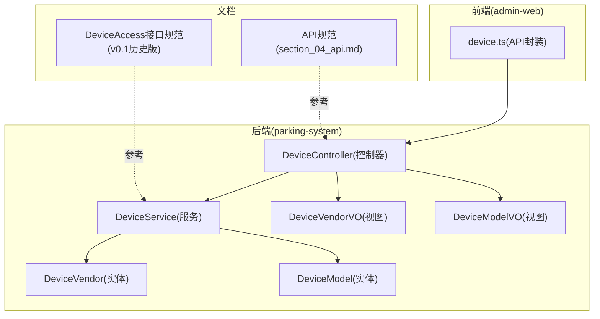
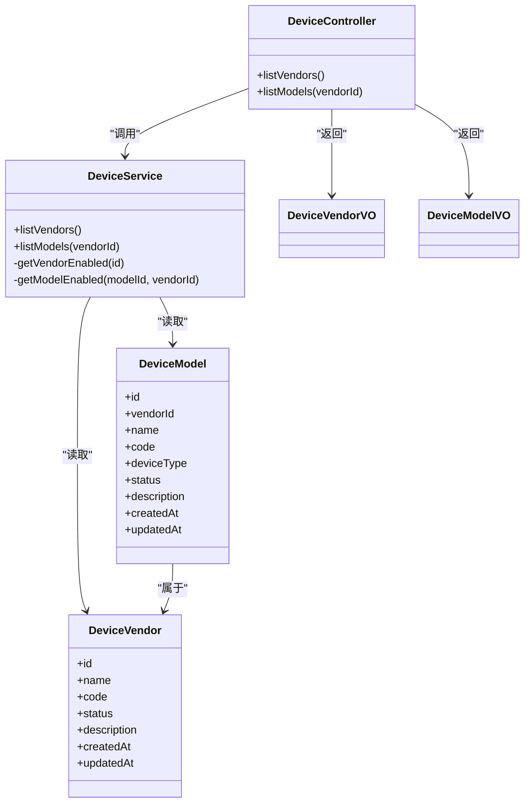
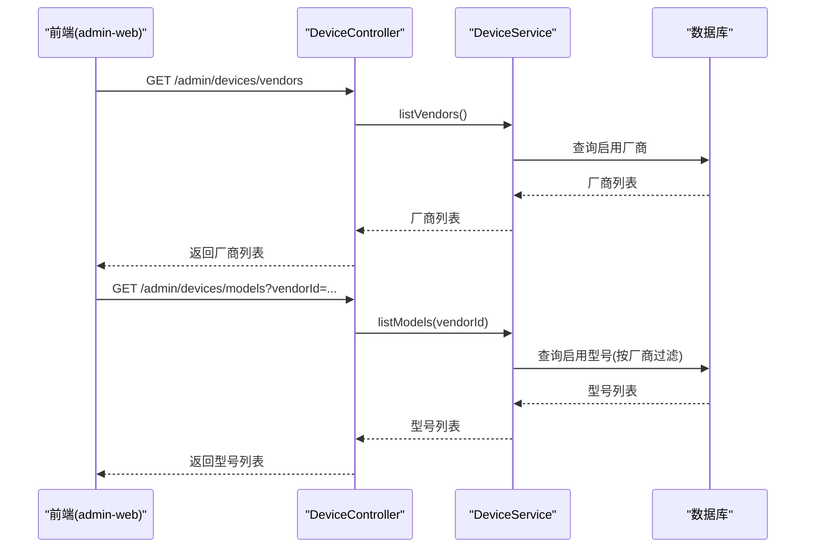
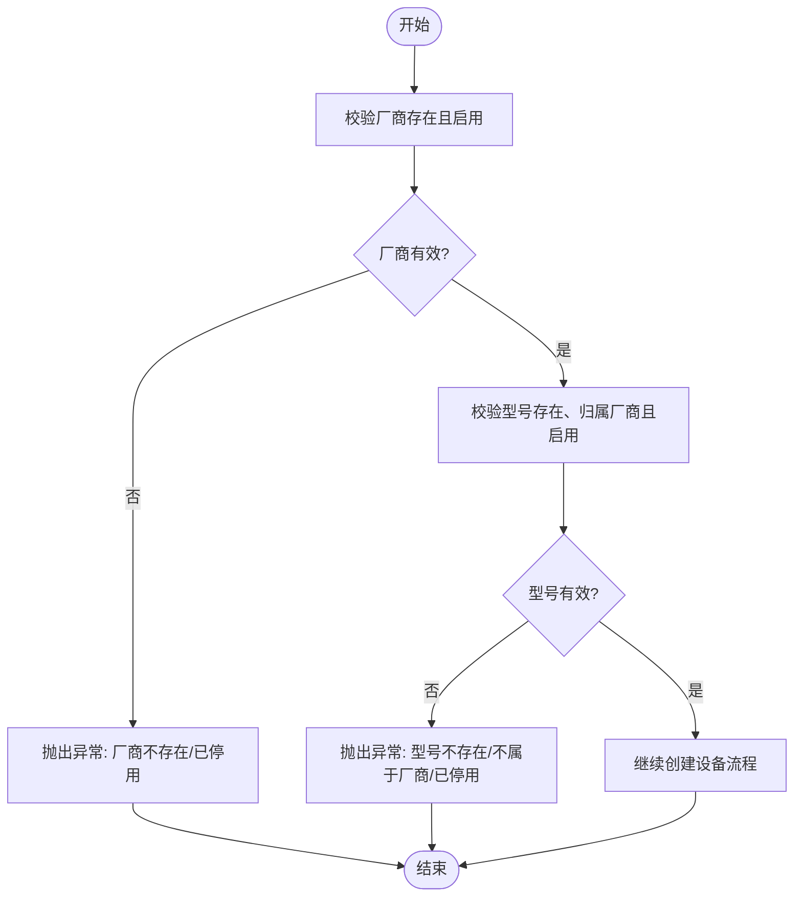
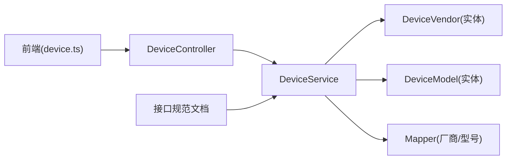

# 设备厂商与型号管理

<cite>
**本文引用的文件**   
- [DeviceVendor.java](file://parking-system/src/main/java/com/jushan/system/entity/DeviceVendor.java)
- [DeviceModel.java](file://parking-system/src/main/java/com/jushan/system/entity/DeviceModel.java)
- [DeviceController.java](file://parking-system/src/main/java/com/jushan/system/controller/DeviceController.java)
- [DeviceService.java](file://parking-system/src/main/java/com/jushan/system/service/DeviceService.java)
- [DeviceVendorVO.java](file://parking-system/src/main/java/com/jushan/system/vo/DeviceVendorVO.java)
- [DeviceModelVO.java](file://parking-system/src/main/java/com/jushan/system/vo/DeviceModelVO.java)
- [device.ts](file://admin-web/src/api/device.ts)
- [section_04_api.md](file://docs/开发计划/section_04_api.md)
- [停车业务平台与DeviceAccess接口规范-v0.1-历史版.md](file://docs/归档/平台侧/停车业务平台与DeviceAccess接口规范-v0.1-历史版.md)
- [ReadinessCheckService.java](file://parking-system/src/main/java/com/jushan/system/service/ReadinessCheckService.java)
</cite>

## 目录
1. [简介](#简介)
2. [项目结构](#项目结构)
3. [核心组件](#核心组件)
4. [架构总览](#架构总览)
5. [详细组件分析](#详细组件分析)
6. [依赖关系分析](#依赖关系分析)
7. [性能考量](#性能考量)
8. [故障排查指南](#故障排查指南)
9. [结论](#结论)
10. [附录](#附录)

## 简介
本技术文档聚焦“设备厂商与型号管理”能力，围绕 DeviceVendor（设备厂商）与 DeviceModel（设备型号）的实体设计、层次化管理体系、注册流程与版本管理机制进行系统化说明。同时覆盖：
- 设备能力矩阵的定义与管理方式，以及不同厂商设备的功能差异适配策略
- 设备型号的注册流程与版本管理建议
- 设备能力枚举的定义与扩展方式
- 厂商与型号管理的 CRUD 接口说明及前端展示组件
- 设备兼容性检查与选型建议的实现逻辑

## 项目结构
与厂商/型号相关的代码主要分布在 parking-system 模块中，包含实体、控制器、服务、视图对象；前端在 admin-web 提供 API 封装与类型定义。

图表来源
- [DeviceVendor.java:1-63](file://parking-system/src/main/java/com/jushan/system/entity/DeviceVendor.java#L1-L63)
- [DeviceModel.java:1-75](file://parking-system/src/main/java/com/jushan/system/entity/DeviceModel.java#L1-L75)
- [DeviceController.java:1-315](file://parking-system/src/main/java/com/jushan/system/controller/DeviceController.java#L1-L315)
- [DeviceService.java:1-800](file://parking-system/src/main/java/com/jushan/system/service/DeviceService.java#L1-L800)
- [DeviceVendorVO.java:1-44](file://parking-system/src/main/java/com/jushan/system/vo/DeviceVendorVO.java#L1-L44)
- [DeviceModelVO.java:1-56](file://parking-system/src/main/java/com/jushan/system/vo/DeviceModelVO.java#L1-L56)
- [device.ts:1-158](file://admin-web/src/api/device.ts#L1-L158)
- [section_04_api.md:1-800](file://docs/开发计划/section_04_api.md#L1-L800)
- [停车业务平台与DeviceAccess接口规范-v0.1-历史版.md:1828-2257](file://docs/归档/平台侧/停车业务平台与DeviceAccess接口规范-v0.1-历史版.md#L1828-L2257)

章节来源
- [DeviceVendor.java:1-63](file://parking-system/src/main/java/com/jushan/system/entity/DeviceVendor.java#L1-L63)
- [DeviceModel.java:1-75](file://parking-system/src/main/java/com/jushan/system/entity/DeviceModel.java#L1-L75)
- [DeviceController.java:185-211](file://parking-system/src/main/java/com/jushan/system/controller/DeviceController.java#L185-L211)
- [DeviceService.java:336-363](file://parking-system/src/main/java/com/jushan/system/service/DeviceService.java#L336-L363)
- [device.ts:109-117](file://admin-web/src/api/device.ts#L109-L117)

## 核心组件
- 设备厂商实体 DeviceVendor：维护厂商基础信息（名称、编码、状态、描述等），用于统一标识与筛选。
- 设备型号实体 DeviceModel：维护型号基础信息（所属厂商、名称、编码、设备类型、状态、描述等），承载型号维度的能力与约束。
- 控制器 DeviceController：暴露厂商/型号查询接口，供前端下拉选择或列表展示。
- 服务层 DeviceService：实现厂商/型号查询、校验（启用状态、归属关系）、并在设备创建/更新时进行一致性校验。
- 视图对象 DeviceVendorVO / DeviceModelVO：面向前端的扁平化数据模型，便于渲染。

章节来源
- [DeviceVendor.java:1-63](file://parking-system/src/main/java/com/jushan/system/entity/DeviceVendor.java#L1-L63)
- [DeviceModel.java:1-75](file://parking-system/src/main/java/com/jushan/system/entity/DeviceModel.java#L1-L75)
- [DeviceController.java:185-211](file://parking-system/src/main/java/com/jushan/system/controller/DeviceController.java#L185-L211)
- [DeviceService.java:336-363](file://parking-system/src/main/java/com/jushan/system/service/DeviceService.java#L336-L363)
- [DeviceVendorVO.java:1-44](file://parking-system/src/main/java/com/jushan/system/vo/DeviceVendorVO.java#L1-L44)
- [DeviceModelVO.java:1-56](file://parking-system/src/main/java/com/jushan/system/vo/DeviceModelVO.java#L1-L56)

## 架构总览
厂商与型号作为设备主数据的元数据维度，被设备台账（Device）引用。控制器仅暴露只读查询，避免直接对厂商/型号进行写操作，确保数据治理由统一入口管控。

图表来源
- [DeviceVendor.java:1-63](file://parking-system/src/main/java/com/jushan/system/entity/DeviceVendor.java#L1-L63)
- [DeviceModel.java:1-75](file://parking-system/src/main/java/com/jushan/system/entity/DeviceModel.java#L1-L75)
- [DeviceController.java:185-211](file://parking-system/src/main/java/com/jushan/system/controller/DeviceController.java#L185-L211)
- [DeviceService.java:336-363](file://parking-system/src/main/java/com/jushan/system/service/DeviceService.java#L336-L363)
- [DeviceVendorVO.java:1-44](file://parking-system/src/main/java/com/jushan/system/vo/DeviceVendorVO.java#L1-L44)
- [DeviceModelVO.java:1-56](file://parking-system/src/main/java/com/jushan/system/vo/DeviceModelVO.java#L1-L56)

## 详细组件分析

### 实体设计与关系映射
- DeviceVendor
  - 关键字段：id、name、code、status、description、时间戳
  - 作用：唯一标识厂商，支持启用/停用控制
- DeviceModel
  - 关键字段：id、vendorId、name、code、deviceType、status、description、时间戳
  - 作用：按厂商组织型号，区分设备类型（如相机/道闸），支持启用/停用控制
- 关系
  - DeviceModel.vendorId → DeviceVendor.id（一对多）
  - 设备台账 Device 引用 DeviceModel 与 DeviceVendor，形成“车场→设备→型号→厂商”的层次结构

章节来源
- [DeviceVendor.java:1-63](file://parking-system/src/main/java/com/jushan/system/entity/DeviceVendor.java#L1-L63)
- [DeviceModel.java:1-75](file://parking-system/src/main/java/com/jushan/system/entity/DeviceModel.java#L1-L75)

### 设备能力矩阵与差异化适配
- 能力字段
  - 设备实体包含 capabilities 字符串字段，用于声明该设备具备的能力集合（例如识别、抓拍、开闸等）
  - 能力以逗号分隔的枚举值形式存储，便于前后端一致解析
- 能力校验与动态变化
  - 平台侧根据配置控制 UI 与命令入口；Device Access 再次校验
  - 不支持的命令返回特定错误码；固件升级或配置变化后能力可能变化，需刷新展示
- 厂商差异适配
  - 通过 DeviceModel.deviceType 与 Device.capabilities 组合，对不同厂商设备的能力进行差异化处理
  - 对于未实现的能力（如 v0.2 的开闸），采用占位与审计记录，待契约冻结后启用

章节来源
- [DeviceService.java:148-211](file://parking-system/src/main/java/com/jushan/system/service/DeviceService.java#L148-L211)
- [停车业务平台与DeviceAccess接口规范-v0.1-历史版.md:1828-1890](file://docs/归档/平台侧/停车业务平台与DeviceAccess接口规范-v0.1-历史版.md#L1828-L1890)
- [停车业务平台与DeviceAccess接口规范-v0.1-历史版.md:2206-2243](file://docs/归档/平台侧/停车业务平台与DeviceAccess接口规范-v0.1-历史版.md#L2206-L2243)

### 设备型号注册流程与版本管理
- 注册流程（当前为只读查询）
  - 前端通过接口获取所有启用的厂商列表
  - 选择厂商后，加载该厂商下启用的型号列表
  - 创建设备时，服务层校验所选厂商与型号存在且启用，并保证型号归属正确
- 版本管理建议
  - 在 DeviceModel 上增加 version 字段，配合 status 与 effectiveAt/expireAt 时间窗，实现灰度与回滚
  - 新增型号时默认禁用，经测试验证后启用；重大变更通过新版本号发布，旧版本保留过渡期
  - 结合设备能力矩阵，按版本限定能力范围，避免静默执行未授权能力

章节来源
- [DeviceController.java:185-211](file://parking-system/src/main/java/com/jushan/system/controller/DeviceController.java#L185-L211)
- [DeviceService.java:336-363](file://parking-system/src/main/java/com/jushan/system/service/DeviceService.java#L336-L363)
- [DeviceService.java:1086-1103](file://parking-system/src/main/java/com/jushan/system/service/DeviceService.java#L1086-L1103)

### 设备能力枚举定义与扩展
- 现有设备类型
  - CAMERA（相机）、GATE（道闸）
- 能力枚举示例
  - 识别/抓拍：RECOGNIZE、CAPTURE
  - 开闸相关：OPEN_GATE、CLOSE（具体以实际接入为准）
- 扩展方式
  - 在设备创建/更新时写入 capabilities 字段，保持前后端约定一致
  - 新增能力需在接口契约与 Device Access 侧同步更新，并进行能力校验与错误码对齐

章节来源
- [DeviceService.java:95-100](file://parking-system/src/main/java/com/jushan/system/service/DeviceService.java#L95-L100)
- [DeviceService.java:148-211](file://parking-system/src/main/java/com/jushan/system/service/DeviceService.java#L148-L211)
- [停车业务平台与DeviceAccess接口规范-v0.1-历史版.md:1828-1890](file://docs/归档/平台侧/停车业务平台与DeviceAccess接口规范-v0.1-历史版.md#L1828-L1890)

### 厂商与型号管理的 CRUD 接口说明
- 查询启用厂商列表
  - 路径：GET /admin/devices/vendors
  - 权限：device:read
  - 返回：厂商列表（含 id、name、code、status 等）
- 查询型号列表（可按厂商筛选）
  - 路径：GET /admin/devices/models?vendorId={vendorId}
  - 权限：device:read
  - 返回：型号列表（含 id、vendorId、name、code、deviceType、status 等）
- 注意
  - 当前仅提供只读接口；写操作（新增/编辑厂商/型号）应通过统一的数据治理入口（不在本控制器暴露）
  - 前端使用 device.ts 中的 getVendors/getModels 方法调用

章节来源
- [DeviceController.java:185-211](file://parking-system/src/main/java/com/jushan/system/controller/DeviceController.java#L185-L211)
- [device.ts:109-117](file://admin-web/src/api/device.ts#L109-L117)

### 前端展示组件与交互
- 类型定义
  - DeviceVendor：id、name、code
  - DeviceModel：id、vendorId、name、code、deviceType
- 交互流程
  - 页面初始化时请求厂商列表
  - 用户选择厂商后，请求对应型号列表
  - 创建设备表单中，将选中的 vendorId/modelId 提交至后端

章节来源
- [device.ts:52-66](file://admin-web/src/api/device.ts#L52-L66)
- [device.ts:109-117](file://admin-web/src/api/device.ts#L109-L117)

### 兼容性检查与选型建议
- 兼容性检查
  - 基于设备类型与能力字段，判断是否满足业务场景需求（如入场需要识别能力，出场需要开闸能力）
  - 若能力缺失，给出明确提示与替代方案
- 选型建议
  - 优先选择已启用且能力完备的型号
  - 针对厂商差异，结合历史运行稳定性与生态成熟度进行选择
  - 对尚未实现的能力（如 v0.2 的开闸），采用占位与审计记录，等待契约冻结后启用

章节来源
- [DeviceService.java:148-211](file://parking-system/src/main/java/com/jushan/system/service/DeviceService.java#L148-L211)
- [停车业务平台与DeviceAccess接口规范-v0.1-历史版.md:1828-1890](file://docs/归档/平台侧/停车业务平台与DeviceAccess接口规范-v0.1-历史版.md#L1828-L1890)

### 序列图：前端加载厂商/型号

图表来源
- [DeviceController.java:185-211](file://parking-system/src/main/java/com/jushan/system/controller/DeviceController.java#L185-L211)
- [DeviceService.java:336-363](file://parking-system/src/main/java/com/jushan/system/service/DeviceService.java#L336-L363)

### 流程图：设备创建时的厂商/型号校验

图表来源
- [DeviceService.java:148-211](file://parking-system/src/main/java/com/jushan/system/service/DeviceService.java#L148-L211)
- [DeviceService.java:1086-1103](file://parking-system/src/main/java/com/jushan/system/service/DeviceService.java#L1086-L1103)

## 依赖关系分析
- 控制器依赖服务层，服务层依赖实体与 Mapper
- 前端通过 device.ts 调用控制器接口
- 文档规范为能力校验与错误码提供依据

图表来源
- [device.ts:109-117](file://admin-web/src/api/device.ts#L109-L117)
- [DeviceController.java:185-211](file://parking-system/src/main/java/com/jushan/system/controller/DeviceController.java#L185-L211)
- [DeviceService.java:336-363](file://parking-system/src/main/java/com/jushan/system/service/DeviceService.java#L336-L363)
- [DeviceVendor.java:1-63](file://parking-system/src/main/java/com/jushan/system/entity/DeviceVendor.java#L1-L63)
- [DeviceModel.java:1-75](file://parking-system/src/main/java/com/jushan/system/entity/DeviceModel.java#L1-L75)

章节来源
- [device.ts:109-117](file://admin-web/src/api/device.ts#L109-L117)
- [DeviceController.java:185-211](file://parking-system/src/main/java/com/jushan/system/controller/DeviceController.java#L185-L211)
- [DeviceService.java:336-363](file://parking-system/src/main/java/com/jushan/system/service/DeviceService.java#L336-L363)

## 性能考量
- 查询优化
  - 厂商/型号查询为只读，建议在应用层缓存常用列表（如 Redis），减少数据库压力
  - 前端按需加载型号（选择厂商后再请求），降低首屏数据量
- 并发与一致性
  - 厂商/型号启用/停用涉及状态变更，应在服务层加锁或使用乐观锁防止并发覆盖
- 快照与实时状态
  - 设备状态快照有过期阈值，前端应避免频繁轮询，优先使用快照接口

[本节为通用指导，不直接分析具体文件]

## 故障排查指南
- 常见错误
  - 厂商/型号不存在或已停用：检查数据状态与关联关系
  - 型号不属于所选厂商：确认前端提交的 vendorId 与 modelId 匹配
  - 能力不支持：核对设备 capabilities 与 Device Access 能力校验结果
- 定位步骤
  - 查看控制器日志与服务层异常信息
  - 核对数据库记录与接口响应
  - 对照接口规范中的错误码与消息

章节来源
- [DeviceService.java:1086-1103](file://parking-system/src/main/java/com/jushan/system/service/DeviceService.java#L1086-L1103)
- [停车业务平台与DeviceAccess接口规范-v0.1-历史版.md:2206-2243](file://docs/归档/平台侧/停车业务平台与DeviceAccess接口规范-v0.1-历史版.md#L2206-L2243)

## 结论
设备厂商与型号管理构成了设备台账的基础元数据体系。通过清晰的实体设计与严格的校验逻辑，平台能够安全、可控地支撑多厂商设备的接入与差异化能力管理。后续可在型号层面引入版本管理与生效窗口，进一步细化灰度与回滚策略，提升系统演进的可控性与可观测性。

[本节为总结，不直接分析具体文件]

## 附录

### 接口清单（厂商/型号）
- 查询启用厂商列表
  - 路径：GET /admin/devices/vendors
  - 权限：device:read
  - 返回：厂商列表
- 查询型号列表（可选按厂商筛选）
  - 路径：GET /admin/devices/models?vendorId={vendorId}
  - 权限：device:read
  - 返回：型号列表

章节来源
- [DeviceController.java:185-211](file://parking-system/src/main/java/com/jushan/system/controller/DeviceController.java#L185-L211)
- [device.ts:109-117](file://admin-web/src/api/device.ts#L109-L117)
- [section_04_api.md:1-800](file://docs/开发计划/section_04_api.md#L1-L800)

### 兼容性检查与在线状态
- 兼容性检查
  - 基于设备类型与能力字段进行业务规则校验
- 在线状态检查
  - 通过设备状态快照判断在线/离线，辅助运维决策

章节来源
- [ReadinessCheckService.java:266-363](file://parking-system/src/main/java/com/jushan/system/service/ReadinessCheckService.java#L266-L363)