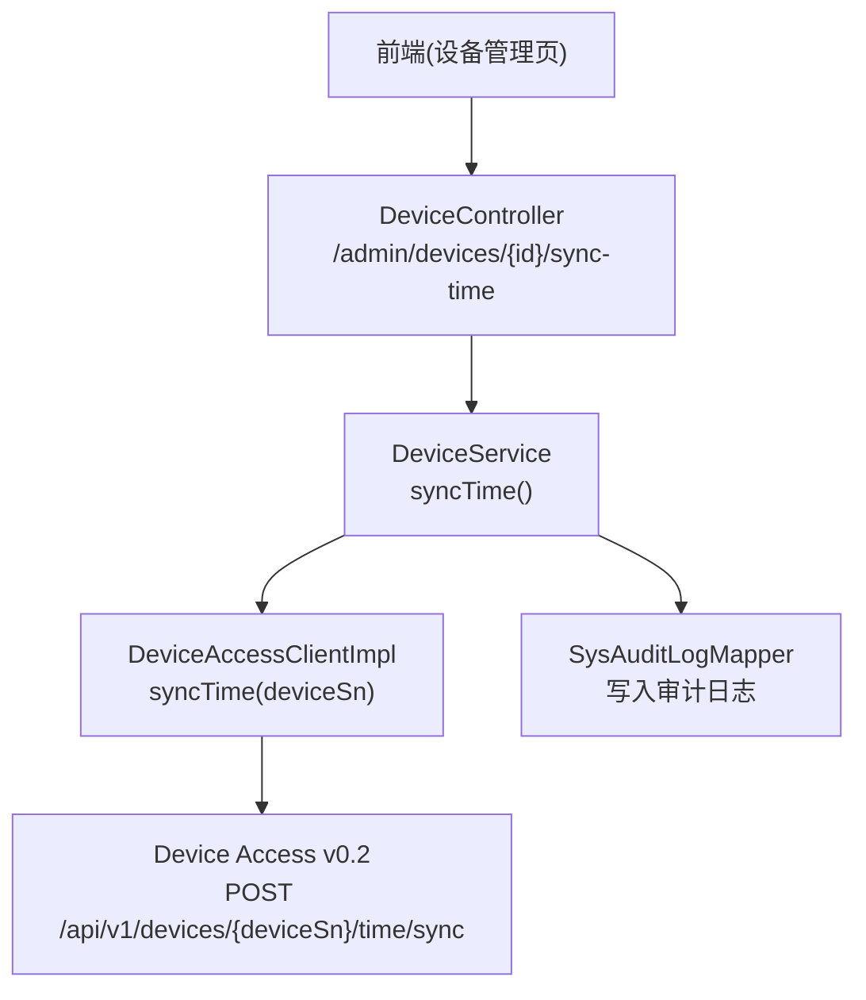
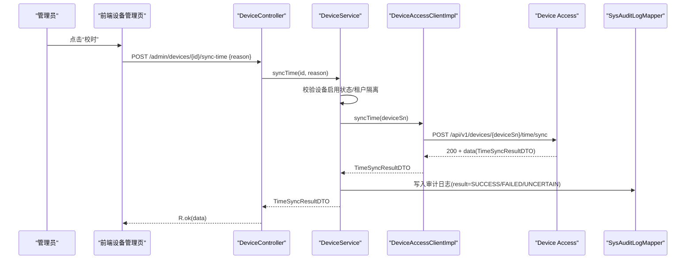
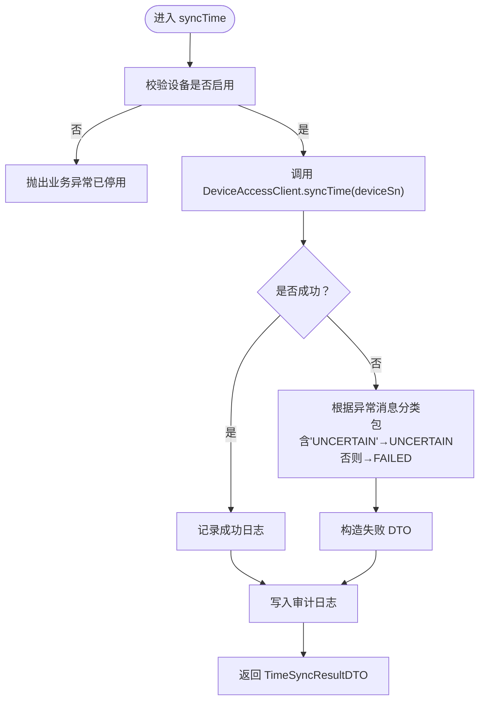
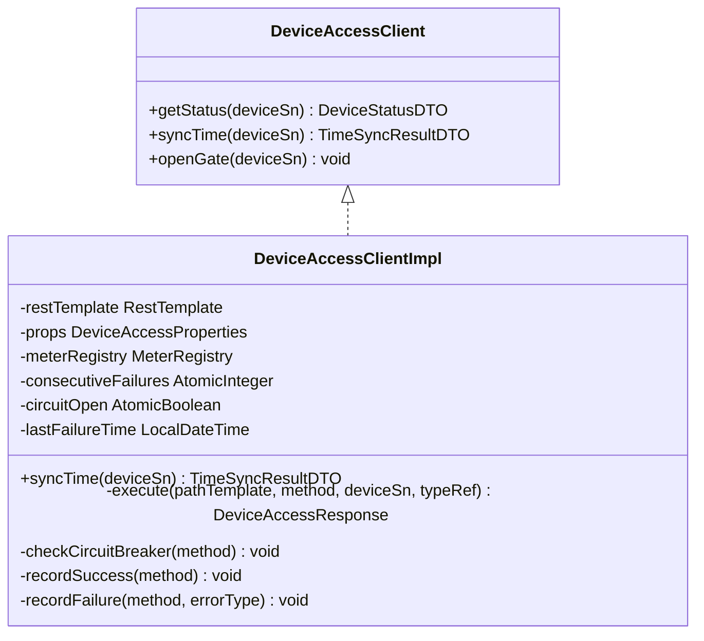
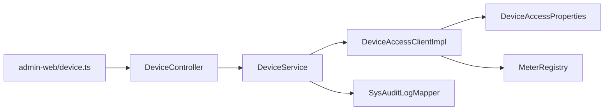

# 设备时间同步

<cite>
**本文引用的文件**   
- [DeviceController.java](file://parking-system/src/main/java/com/jushan/system/controller/DeviceController.java)
- [DeviceService.java](file://parking-system/src/main/java/com/jushan/system/service/DeviceService.java)
- [DeviceAccessClient.java](file://parking-system/src/main/java/com/jushan/system/client/DeviceAccessClient.java)
- [DeviceAccessClientImpl.java](file://parking-system/src/main/java/com/jushan/system/client/DeviceAccessClientImpl.java)
- [TimeSyncResultDTO.java](file://parking-system/src/main/java/com/jushan/system/client/dto/TimeSyncResultDTO.java)
- [DeviceTimeSyncIntegrationTest.java](file://parking-boot/src/test/java/com/jushan/boot/controller/DeviceTimeSyncIntegrationTest.java)
- [DeviceAccessClientTest.java](file://parking-boot/src/test/java/com/jushan/boot/client/DeviceAccessClientTest.java)
- [device.ts](file://admin-web/src/api/device.ts)
</cite>

## 目录
1. [简介](#简介)
2. [项目结构](#项目结构)
3. [核心组件](#核心组件)
4. [架构总览](#架构总览)
5. [详细组件分析](#详细组件分析)
6. [依赖关系分析](#依赖关系分析)
7. [性能与可观测性](#性能与可观测性)
8. [故障排查指南](#故障排查指南)
9. [结论](#结论)
10. [附录：API 与测试用例说明](#附录api-与测试用例说明)

## 简介
本技术文档聚焦“设备时间同步”能力，覆盖从前端触发到后端调用 Device Access（DA）的完整链路，包括：
- 请求发起流程（手动触发、未来可扩展定时任务）
- 结果数据结构 TimeSyncResultDTO 及其判定逻辑
- 错误分类与处理策略（含 UNCERTAIN 语义）
- 降级与重试策略（当前无自动重试，具备快速失败与指标监控）
- API 接口定义与测试用例要点
- 时区与夏令时的考虑与建议

## 项目结构
围绕设备时间同步的关键代码分布在以下模块：
- 控制器层：暴露管理端校时接口
- 服务层：权限校验、审计日志持久化、异常归因
- 客户端层：封装对 DA 的 HTTP 调用、统一异常与指标
- DTO：对齐 DA v0.2 CommandResultDTO 字段
- 测试：集成测试与客户端单元测试
- 前端：管理端设备页面提供“校时”操作入口

图表来源
- [DeviceController.java:213-234](file://parking-system/src/main/java/com/jushan/system/controller/DeviceController.java#L213-L234)
- [DeviceService.java:562-615](file://parking-system/src/main/java/com/jushan/system/service/DeviceService.java#L562-L615)
- [DeviceAccessClientImpl.java:134-158](file://parking-system/src/main/java/com/jushan/system/client/DeviceAccessClientImpl.java#L134-L158)
- [DeviceAccessClient.java:39-49](file://parking-system/src/main/java/com/jushan/system/client/DeviceAccessClient.java#L39-L49)

章节来源
- [DeviceController.java:213-234](file://parking-system/src/main/java/com/jushan/system/controller/DeviceController.java#L213-L234)
- [DeviceService.java:562-615](file://parking-system/src/main/java/com/jushan/system/service/DeviceService.java#L562-L615)
- [DeviceAccessClient.java:39-49](file://parking-system/src/main/java/com/jushan/system/client/DeviceAccessClient.java#L39-L49)
- [DeviceAccessClientImpl.java:134-158](file://parking-system/src/main/java/com/jushan/system/client/DeviceAccessClientImpl.java#L134-L158)

## 核心组件
- 控制器 DeviceController：对外暴露 POST /admin/devices/{id}/sync-time，接收 reason 参数并委托 Service。
- 服务 DeviceService：校验设备状态、调用 DA 客户端、构造并持久化审计日志，返回 TimeSyncResultDTO。
- 客户端 DeviceAccessClient/Impl：封装 DA HTTP 调用，统一异常分类、Micrometer 指标与降级控制。
- DTO TimeSyncResultDTO：对齐 DA v0.2 CommandResultDTO，包含 success、deviceCode、message，并提供 isSuccessful() 判定。

章节来源
- [DeviceController.java:213-234](file://parking-system/src/main/java/com/jushan/system/controller/DeviceController.java#L213-L234)
- [DeviceService.java:562-615](file://parking-system/src/main/java/com/jushan/system/service/DeviceService.java#L562-L615)
- [DeviceAccessClient.java:39-49](file://parking-system/src/main/java/com/jushan/system/client/DeviceAccessClient.java#L39-L49)
- [DeviceAccessClientImpl.java:134-158](file://parking-system/src/main/java/com/jushan/system/client/DeviceAccessClientImpl.java#L134-L158)
- [TimeSyncResultDTO.java:1-58](file://parking-system/src/main/java/com/jushan/system/client/dto/TimeSyncResultDTO.java#L1-L58)

## 架构总览
下图展示一次完整的设备校时调用序列，涵盖权限校验、DA 调用、异常分类、审计记录与结果返回。

图表来源
- [DeviceController.java:213-234](file://parking-system/src/main/java/com/jushan/system/controller/DeviceController.java#L213-L234)
- [DeviceService.java:562-615](file://parking-system/src/main/java/com/jushan/system/service/DeviceService.java#L562-L615)
- [DeviceAccessClientImpl.java:134-158](file://parking-system/src/main/java/com/jushan/system/client/DeviceAccessClientImpl.java#L134-L158)

## 详细组件分析

### 控制器层：DeviceController
- 路由：POST /admin/devices/{id}/sync-time
- 入参：JSON body 中的 reason（可选），用于审计原因记录
- 权限：device:manage
- 行为：解析 reason，调用 DeviceService.syncTime，返回统一响应

章节来源
- [DeviceController.java:213-234](file://parking-system/src/main/java/com/jushan/system/controller/DeviceController.java#L213-L234)

### 服务层：DeviceService.syncTime
- 前置校验：设备必须为启用状态；否则抛出业务异常
- 调用链：通过 DeviceAccessClient.syncTime(deviceSn) 发起 DA 请求
- 异常处理：
  - 若捕获到包含 “UNCERTAIN” 的业务异常，审计结果记为 UNCERTAIN
  - 其他异常记为 FAILED，并构造失败 DTO 返回
- 审计日志：持久化 SysAuditLog，包含操作人、目标设备、结果、失败原因、reason 等
- 返回值：始终返回 TimeSyncResultDTO（成功或失败均返回）

图表来源
- [DeviceService.java:562-615](file://parking-system/src/main/java/com/jushan/system/service/DeviceService.java#L562-L615)

章节来源
- [DeviceService.java:562-615](file://parking-system/src/main/java/com/jushan/system/service/DeviceService.java#L562-L615)

### 客户端层：DeviceAccessClientImpl
- 职责：封装对 DA 的 HTTP 调用，统一异常分类、指标上报与降级控制
- 关键路径：
  - 构建 URL：props.getBaseUrl() + "/api/v1/devices/{deviceSn}/time/sync"
  - 执行请求：RestTemplate.exchange(...)
  - 响应校验：空响应、非 200、DA code 非成功均抛 BusinessException
  - 网络异常：ResourceAccessException → 标记 UNCERTAIN（由上层 Service 识别）
  - 其他异常：RestClientException → 内部错误
- 降级策略：连续失败达到阈值后打开降级开关，在恢复窗口内快速失败，避免级联阻塞
- 指标：calls.total、calls.errors、latency、circuit_breaker.state

图表来源
- [DeviceAccessClient.java:1-65](file://parking-system/src/main/java/com/jushan/system/client/DeviceAccessClient.java#L1-L65)
- [DeviceAccessClientImpl.java:1-346](file://parking-system/src/main/java/com/jushan/system/client/DeviceAccessClientImpl.java#L1-L346)

章节来源
- [DeviceAccessClient.java:1-65](file://parking-system/src/main/java/com/jushan/system/client/DeviceAccessClient.java#L1-L65)
- [DeviceAccessClientImpl.java:134-158](file://parking-system/src/main/java/com/jushan/system/client/DeviceAccessClientImpl.java#L134-L158)
- [DeviceAccessClientImpl.java:263-316](file://parking-system/src/main/java/com/jushan/system/client/DeviceAccessClientImpl.java#L263-L316)
- [DeviceAccessClientImpl.java:170-246](file://parking-system/src/main/java/com/jushan/system/client/DeviceAccessClientImpl.java#L170-L246)

### 数据模型：TimeSyncResultDTO
- 字段：
  - success：Boolean，来自 DA 真实响应
  - deviceCode：Integer，设备返回码（200 表示成功）
  - message：String，结果描述
- 判定方法：isSuccessful() 当且仅当 success 为 true 且 deviceCode 为空或等于 200

章节来源
- [TimeSyncResultDTO.java:1-58](file://parking-system/src/main/java/com/jushan/system/client/dto/TimeSyncResultDTO.java#L1-L58)

### 前端触发：管理端设备页面
- 入口：设备列表页“校时”按钮
- 调用：POST /admin/devices/{id}/sync-time，body 中携带 reason
- 展示：弹窗显示 TimeSyncResultDTO 的结果、设备返回码与消息

章节来源
- [device.ts:45-135](file://admin-web/src/api/device.ts#L45-L135)

## 依赖关系分析
- 控制器依赖服务层进行业务编排与审计
- 服务层依赖客户端访问 DA，同时依赖审计日志 Mapper 持久化
- 客户端依赖配置（DA 基础地址）、HTTP 客户端与指标注册中心
- 前端依赖管理端 API 封装函数

图表来源
- [DeviceController.java:213-234](file://parking-system/src/main/java/com/jushan/system/controller/DeviceController.java#L213-L234)
- [DeviceService.java:562-615](file://parking-system/src/main/java/com/jushan/system/service/DeviceService.java#L562-L615)
- [DeviceAccessClientImpl.java:134-158](file://parking-system/src/main/java/com/jushan/system/client/DeviceAccessClientImpl.java#L134-L158)
- [device.ts:45-135](file://admin-web/src/api/device.ts#L45-L135)

章节来源
- [DeviceController.java:213-234](file://parking-system/src/main/java/com/jushan/system/controller/DeviceController.java#L213-L234)
- [DeviceService.java:562-615](file://parking-system/src/main/java/com/jushan/system/service/DeviceService.java#L562-L615)
- [DeviceAccessClientImpl.java:134-158](file://parking-system/src/main/java/com/jushan/system/client/DeviceAccessClientImpl.java#L134-L158)
- [device.ts:45-135](file://admin-web/src/api/device.ts#L45-L135)

## 性能与可观测性
- 指标维度：
  - 调用次数：按 method、status 标签统计
  - 错误次数：按 method、error_type 标签统计（含 circuit_breaker、resource_access、da_error_*、rest_client）
  - 延迟分布：Timer 记录 latency，按 method 标签
  - 降级状态：Gauge 暴露 circuit_breaker.state
- 降级策略：
  - 连续失败阈值：超过设定值即打开降级
  - 恢复窗口：超过指定秒数后尝试关闭降级并重置计数器
- 建议：
  - 结合 Prometheus/Grafana 监控 DA 可用性
  - 针对高并发场景评估是否需要引入分布式锁或幂等机制（当前 DA v0.2 无 commandId 幂等）

章节来源
- [DeviceAccessClientImpl.java:103-107](file://parking-system/src/main/java/com/jushan/system/client/DeviceAccessClientImpl.java#L103-L107)
- [DeviceAccessClientImpl.java:170-246](file://parking-system/src/main/java/com/jushan/system/client/DeviceAccessClientImpl.java#L170-L246)

## 故障排查指南
- 常见错误类型与定位：
  - DA 返回非 200 或 code 非成功：检查 DA 服务状态与设备可达性
  - 网络异常（超时/连接失败）：检查网络连通性与 DA 服务健康度，审计结果为 UNCERTAIN
  - 响应解析失败：检查 Content-Type 与响应体结构是否符合预期
  - 降级触发：观察连续失败次数与恢复窗口，必要时手动重置降级状态
- 审计日志：
  - 查看 action=time_sync 的记录，关注 result 字段（SUCCESS/FAILED/UNCERTAIN）与 failReason
- 前端提示：
  - 若 reason 未传入，审计记录的 reason 为空字符串，属于正常行为

章节来源
- [DeviceService.java:590-615](file://parking-system/src/main/java/com/jushan/system/service/DeviceService.java#L590-L615)
- [DeviceAccessClientImpl.java:263-316](file://parking-system/src/main/java/com/jushan/system/client/DeviceAccessClientImpl.java#L263-L316)

## 结论
- 设备时间同步采用“单次调用 + 强审计”的设计，确保每次操作可追溯
- 错误分类清晰，UNCERTAIN 语义用于区分网络不可达导致的未知结果
- 当前不包含自动重试，避免重复下发导致设备侧不确定性
- 具备 Micrometer 指标与内存级降级，便于监控与保护系统稳定性
- 后续可在契约稳定后引入幂等与可控重试策略

## 附录：API 与测试用例说明

### API 定义
- 接口：POST /admin/devices/{id}/sync-time
- 权限：device:manage
- 请求体：{ reason?: string }
- 响应体：R<TimeSyncResultDTO>
  - TimeSyncResultDTO：success(Boolean)、deviceCode(Integer)、message(String)，isSuccessful() 判定逻辑见上文

章节来源
- [DeviceController.java:213-234](file://parking-system/src/main/java/com/jushan/system/controller/DeviceController.java#L213-L234)
- [TimeSyncResultDTO.java:1-58](file://parking-system/src/main/java/com/jushan/system/client/dto/TimeSyncResultDTO.java#L1-L58)

### 测试用例要点
- 集成测试（DeviceTimeSyncIntegrationTest）：
  - 成功场景：返回 200 且 data.success=true，审计记录 result=SUCCESS
  - 失败场景：模拟 DA 返回错误，审计记录 result=FAILED
  - 超时/不确定：模拟网络异常，审计记录 result=UNCERTAIN
  - 停用设备：拒绝校时，返回业务错误码
  - 重复校时：当前无幂等，允许重复调用
- 客户端测试（DeviceAccessClientTest）：
  - 200 响应映射：验证 TimeSyncResultDTO 字段与 isSuccessful() 判定

章节来源
- [DeviceTimeSyncIntegrationTest.java:172-401](file://parking-boot/src/test/java/com/jushan/boot/controller/DeviceTimeSyncIntegrationTest.java#L172-L401)
- [DeviceAccessClientTest.java:112-139](file://parking-boot/src/test/java/com/jushan/boot/client/DeviceAccessClientTest.java#L112-L139)

### 时区与夏令时考虑
- 平台侧未实现时间偏差检测与补偿算法，仅负责将平台时间下发给设备
- 设备侧应依据自身时区与夏令时规则应用时间，平台不强制转换
- 建议在设备侧支持 NTP/DA 时间同步后的本地时区适配，平台侧保留审计与可观测性

[本节为概念性说明，不涉及具体源码文件]