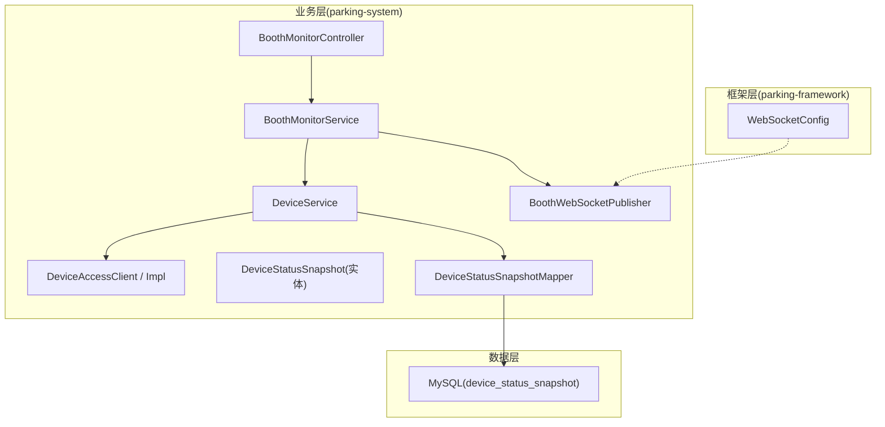
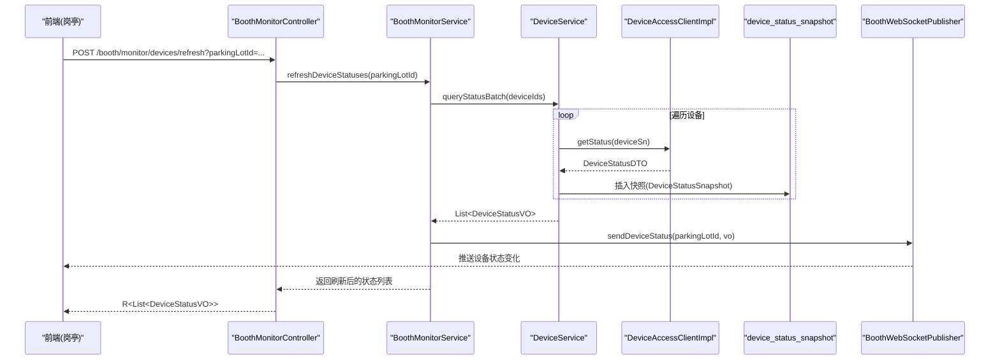
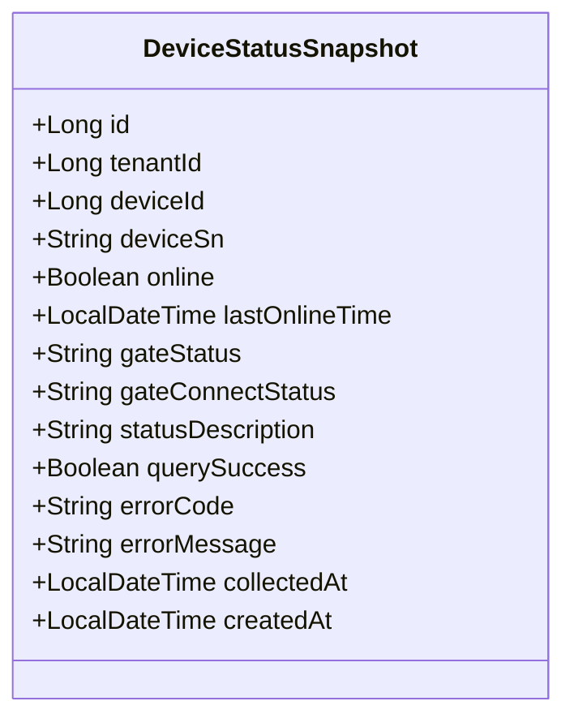
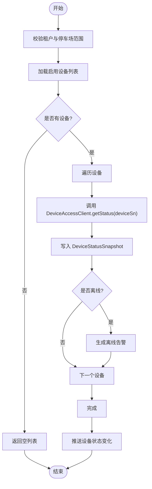
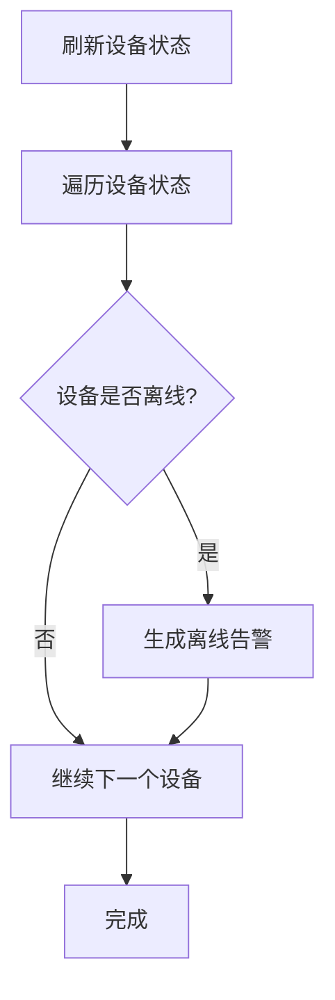
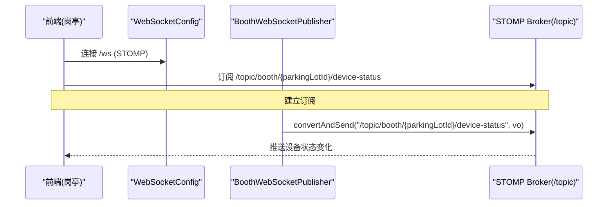
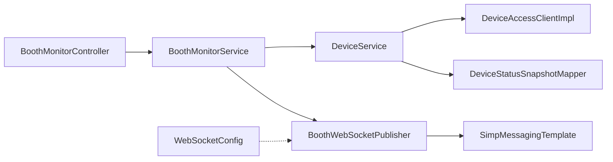

# 设备状态监控

<cite>
**本文引用的文件**   
- [DeviceStatusSnapshot.java](file://parking-system/src/main/java/com/jushan/system/entity/DeviceStatusSnapshot.java)
- [DeviceStatusSnapshotMapper.java](file://parking-system/src/main/java/com/jushan/system/mapper/DeviceStatusSnapshotMapper.java)
- [BoothMonitorController.java](file://parking-system/src/main/java/com/jushan/system/controller/BoothMonitorController.java)
- [BoothMonitorService.java](file://parking-system/src/main/java/com/jushan/system/service/BoothMonitorService.java)
- [DeviceAccessClient.java](file://parking-system/src/main/java/com/jushan/system/client/DeviceAccessClient.java)
- [DeviceAccessClientImpl.java](file://parking-system/src/main/java/com/jushan/system/client/DeviceAccessClientImpl.java)
- [DeviceService.java](file://parking-system/src/main/java/com/jushan/system/service/DeviceService.java)
- [BoothWebSocketPublisher.java](file://parking-system/src/main/java/com/jushan/system/ws/BoothWebSocketPublisher.java)
- [WebSocketConfig.java](file://parking-framework/src/main/java/com/jushan/framework/ws/WebSocketConfig.java)
- [V20260711011__device_status_snapshot.sql](file://parking-boot/src/main/resources/db/migration/V20260711011__device_status_snapshot.sql)
</cite>

## 目录
1. [简介](#简介)
2. [项目结构](#项目结构)
3. [核心组件](#核心组件)
4. [架构总览](#架构总览)
5. [详细组件分析](#详细组件分析)
6. [依赖关系分析](#依赖关系分析)
7. [性能考量](#性能考量)
8. [故障排查指南](#故障排查指南)
9. [结论](#结论)
10. [附录](#附录)

## 简介
本技术文档围绕“设备状态监控”能力，系统性说明设备状态快照机制的设计与实现、从 Device Access 服务获取实时状态并落库的同步流程、状态查询接口（含批量查询与条件过滤）、异常检测（离线检测、告警与自动恢复）、以及 WebSocket 推送与前端展示方案。目标是帮助开发者快速理解系统如何以“查询快照 + 事件推送”的方式提供稳定、可观测、可扩展的设备状态监控体验。

## 项目结构
与设备状态监控相关的代码分布在以下模块：
- parking-system：业务实体、控制器、服务、客户端、WebSocket 推送器
- parking-framework：WebSocket 基础配置与安全拦截
- parking-boot：数据库迁移脚本（Flyway）

图表来源
- [BoothMonitorController.java:1-76](file://parking-system/src/main/java/com/jushan/system/controller/BoothMonitorController.java#L1-L76)
- [BoothMonitorService.java:1-292](file://parking-system/src/main/java/com/jushan/system/service/BoothMonitorService.java#L1-L292)
- [DeviceService.java:774-800](file://parking-system/src/main/java/com/jushan/system/service/DeviceService.java#L774-L800)
- [DeviceAccessClient.java:1-65](file://parking-system/src/main/java/com/jushan/system/client/DeviceAccessClient.java#L1-L65)
- [DeviceAccessClientImpl.java:1-346](file://parking-system/src/main/java/com/jushan/system/client/DeviceAccessClientImpl.java#L1-L346)
- [BoothWebSocketPublisher.java:1-177](file://parking-system/src/main/java/com/jushan/system/ws/BoothWebSocketPublisher.java#L1-L177)
- [WebSocketConfig.java:1-92](file://parking-framework/src/main/java/com/jushan/framework/ws/WebSocketConfig.java#L1-L92)
- [V20260711011__device_status_snapshot.sql:1-32](file://parking-boot/src/main/resources/db/migration/V20260711011__device_status_snapshot.sql#L1-L32)

章节来源
- [BoothMonitorController.java:1-76](file://parking-system/src/main/java/com/jushan/system/controller/BoothMonitorController.java#L1-L76)
- [BoothMonitorService.java:1-292](file://parking-system/src/main/java/com/jushan/system/service/BoothMonitorService.java#L1-L292)
- [DeviceService.java:774-800](file://parking-system/src/main/java/com/jushan/system/service/DeviceService.java#L774-L800)
- [DeviceAccessClient.java:1-65](file://parking-system/src/main/java/com/jushan/system/client/DeviceAccessClient.java#L1-L65)
- [DeviceAccessClientImpl.java:1-346](file://parking-system/src/main/java/com/jushan/system/client/DeviceAccessClientImpl.java#L1-L346)
- [BoothWebSocketPublisher.java:1-177](file://parking-system/src/main/java/com/jushan/system/ws/BoothWebSocketPublisher.java#L1-L177)
- [WebSocketConfig.java:1-92](file://parking-framework/src/main/java/com/jushan/framework/ws/WebSocketConfig.java#L1-L92)
- [V20260711011__device_status_snapshot.sql:1-32](file://parking-boot/src/main/resources/db/migration/V20260711011__device_status_snapshot.sql#L1-L32)

## 核心组件
- 设备状态快照实体与存储
  - 实体字段覆盖在线性、最近在线时间、道闸杆/连接状态、状态描述、查询成功标志、错误码/消息、采集时间等，用于记录每次对 Device Access 的状态查询结果，支持最新快照读取与历史审计。
  - 表结构与索引设计支持按设备查询最新快照、按采集时间范围检索、按查询成功/失败筛选。
- 设备访问客户端
  - 封装对 Device Access v0.2 的 HTTP 调用，包含指标统计、降级策略（连续失败阈值与恢复窗口）、统一异常分类（UNCERTAIN 标记网络异常）。
- 监控服务与控制器
  - 提供初始化快照、刷新设备状态、确认异常提醒等接口；在刷新时触发 DA 调用并生成离线告警。
- 设备服务
  - 负责设备台账、权限校验、状态查询与快照持久化、批量查询与分页等通用能力。
- WebSocket 推送
  - 基于 STOMP over WebSocket，按停车场维度广播识别事件、车位变化、设备状态变化与异常提醒。

章节来源
- [DeviceStatusSnapshot.java:1-113](file://parking-system/src/main/java/com/jushan/system/entity/DeviceStatusSnapshot.java#L1-L113)
- [V20260711011__device_status_snapshot.sql:1-32](file://parking-boot/src/main/resources/db/migration/V20260711011__device_status_snapshot.sql#L1-L32)
- [DeviceAccessClient.java:1-65](file://parking-system/src/main/java/com/jushan/system/client/DeviceAccessClient.java#L1-L65)
- [DeviceAccessClientImpl.java:1-346](file://parking-system/src/main/java/com/jushan/system/client/DeviceAccessClientImpl.java#L1-L346)
- [BoothMonitorController.java:1-76](file://parking-system/src/main/java/com/jushan/system/controller/BoothMonitorController.java#L1-L76)
- [BoothMonitorService.java:1-292](file://parking-system/src/main/java/com/jushan/system/service/BoothMonitorService.java#L1-L292)
- [DeviceService.java:774-800](file://parking-system/src/main/java/com/jushan/system/service/DeviceService.java#L774-L800)
- [BoothWebSocketPublisher.java:1-177](file://parking-system/src/main/java/com/jushan/system/ws/BoothWebSocketPublisher.java#L1-L177)
- [WebSocketConfig.java:1-92](file://parking-framework/src/main/java/com/jushan/framework/ws/WebSocketConfig.java#L1-L92)

## 架构总览
设备状态监控采用“查询快照 + 事件推送”的双通道模式：
- 拉取路径：控制器 → 监控服务 → 设备服务 → Device Access 客户端 → Device Access 服务；成功后写入 device_status_snapshot 表，返回最新快照或列表。
- 推送路径：业务事件（识别事件、车位变化、设备状态变化、异常提醒）通过 BoothWebSocketPublisher 推送到 /topic/booth/{parkingLotId}/...，由 WebSocketConfig 提供的 STOMP 基础设施转发到前端。

图表来源
- [BoothMonitorController.java:56-61](file://parking-system/src/main/java/com/jushan/system/controller/BoothMonitorController.java#L56-L61)
- [BoothMonitorService.java:110-133](file://parking-system/src/main/java/com/jushan/system/service/BoothMonitorService.java#L110-L133)
- [DeviceService.java:774-800](file://parking-system/src/main/java/com/jushan/system/service/DeviceService.java#L774-L800)
- [DeviceAccessClientImpl.java:110-132](file://parking-system/src/main/java/com/jushan/system/client/DeviceAccessClientImpl.java#L110-L132)
- [V20260711011__device_status_snapshot.sql:11-31](file://parking-boot/src/main/resources/db/migration/V20260711011__device_status_snapshot.sql#L11-L31)
- [BoothWebSocketPublisher.java:123-134](file://parking-system/src/main/java/com/jushan/system/ws/BoothWebSocketPublisher.java#L123-L134)

## 详细组件分析

### 设备状态快照实体与存储策略
- 字段定义要点
  - 标识与归属：id、tenantId、deviceId、deviceSn
  - 状态信息：online、lastOnlineTime、gateStatus、gateConnectStatus、statusDescription
  - 查询质量：querySuccess、errorCode、errorMessage
  - 时间戳：collectedAt（DA 调用时间）、createdAt（记录创建时间）
- 存储策略
  - 表名：device_status_snapshot
  - 索引：idx_device_id、idx_device_id_collected（按设备+采集时间倒序，便于取最新快照）、idx_query_success、idx_collected_at
  - 用途：最新快照用于前端展示，历史快照用于审计与排障；前端需根据 collectedAt 显示采集时间，不得将缓存快照冒充实时状态

图表来源
- [DeviceStatusSnapshot.java:1-113](file://parking-system/src/main/java/com/jushan/system/entity/DeviceStatusSnapshot.java#L1-L113)
- [V20260711011__device_status_snapshot.sql:11-31](file://parking-boot/src/main/resources/db/migration/V20260711011__device_status_snapshot.sql#L11-L31)

章节来源
- [DeviceStatusSnapshot.java:1-113](file://parking-system/src/main/java/com/jushan/system/entity/DeviceStatusSnapshot.java#L1-L113)
- [V20260711011__device_status_snapshot.sql:1-32](file://parking-boot/src/main/resources/db/migration/V20260711011__device_status_snapshot.sql#L1-L32)

### 设备状态同步流程（从 Device Access 到本地缓存）
- 触发点
  - 用户主动刷新：POST /booth/monitor/devices/refresh
  - 初始化快照：GET /booth/monitor/snapshot（内部使用最新快照而非实时调用）
- 关键步骤
  - 权限与范围校验（租户隔离、停车场范围）
  - 批量查询设备 ID 列表
  - 逐个调用 DeviceAccessClient.getStatus(deviceSn)
  - 将返回结果持久化为 DeviceStatusSnapshot
  - 检查离线设备并生成告警
  - 通过 WebSocket 推送设备状态变化
- 错误处理与降级
  - DeviceAccessClientImpl 内置降级：连续失败达到阈值后打开降级开关，超过恢复窗口后尝试恢复
  - 网络异常标记为 UNCERTAIN，避免误判

图表来源
- [BoothMonitorService.java:110-133](file://parking-system/src/main/java/com/jushan/system/service/BoothMonitorService.java#L110-L133)
- [DeviceAccessClientImpl.java:110-132](file://parking-system/src/main/java/com/jushan/system/client/DeviceAccessClientImpl.java#L110-L132)
- [DeviceService.java:774-800](file://parking-system/src/main/java/com/jushan/system/service/DeviceService.java#L774-L800)
- [BoothWebSocketPublisher.java:123-134](file://parking-system/src/main/java/com/jushan/system/ws/BoothWebSocketPublisher.java#L123-L134)

章节来源
- [BoothMonitorController.java:56-61](file://parking-system/src/main/java/com/jushan/system/controller/BoothMonitorController.java#L56-L61)
- [BoothMonitorService.java:110-133](file://parking-system/src/main/java/com/jushan/system/service/BoothMonitorService.java#L110-L133)
- [DeviceAccessClientImpl.java:110-132](file://parking-system/src/main/java/com/jushan/system/client/DeviceAccessClientImpl.java#L110-L132)
- [DeviceService.java:774-800](file://parking-system/src/main/java/com/jushan/system/service/DeviceService.java#L774-L800)
- [BoothWebSocketPublisher.java:123-134](file://parking-system/src/main/java/com/jushan/system/ws/BoothWebSocketPublisher.java#L123-L134)

### 状态查询接口（批量、条件过滤、分页）
- 批量查询
  - 通过 DeviceService.queryStatusBatch(deviceIds) 批量获取设备状态（内部会调用 DA 并写快照），供刷新接口使用。
- 条件过滤
  - 设备列表查询支持按停车场、状态、设备类型筛选；监控快照中仅加载启用设备。
- 分页支持
  - 设备列表查询使用 MyBatis-Plus Page 进行分页，适用于管理后台设备管理场景。
- 初始化快照
  - GET /booth/monitor/snapshot 返回停车场摘要、车道、最近识别事件、设备状态列表（来自最新快照）与未确认异常提醒。

章节来源
- [BoothMonitorController.java:44-48](file://parking-system/src/main/java/com/jushan/system/controller/BoothMonitorController.java#L44-L48)
- [BoothMonitorService.java:79-100](file://parking-system/src/main/java/com/jushan/system/service/BoothMonitorService.java#L79-L100)
- [DeviceService.java:299-321](file://parking-system/src/main/java/com/jushan/system/service/DeviceService.java#L299-L321)

### 设备异常检测逻辑（离线检测、故障告警、自动恢复）
- 离线检测
  - 刷新流程中对每个设备状态进行检查，若离线则调用 MonitorAlertService.checkDeviceOffline 生成告警。
- 故障告警
  - 除设备离线外，还会根据停车场状态生成 lot full / lot disabled 等告警。
- 自动恢复
  - DeviceAccessClientImpl 内置降级恢复：当连续失败次数达到阈值后打开降级开关，超过恢复窗口后自动关闭降级并重置计数器，后续请求恢复正常。

图表来源
- [BoothMonitorService.java:125-133](file://parking-system/src/main/java/com/jushan/system/service/BoothMonitorService.java#L125-L133)
- [DeviceAccessClientImpl.java:170-201](file://parking-system/src/main/java/com/jushan/system/client/DeviceAccessClientImpl.java#L170-L201)

章节来源
- [BoothMonitorService.java:125-133](file://parking-system/src/main/java/com/jushan/system/service/BoothMonitorService.java#L125-L133)
- [DeviceAccessClientImpl.java:170-201](file://parking-system/src/main/java/com/jushan/system/client/DeviceAccessClientImpl.java#L170-L201)

### WebSocket 推送与前端展示方案
- 后端推送
  - BoothWebSocketPublisher 提供识别事件、车位变化、设备状态变化、异常提醒的推送方法，目标 topic 为 /topic/booth/{parkingLotId}/...
  - 所有推送方法内部捕获异常，确保推送失败不阻断主业务事务。
- 前端订阅
  - 前端通过 STOMP over WebSocket 连接 /ws，订阅对应 topic，接收实时推送并在界面更新。
- 安全与跨域
  - WebSocketConfig 注册 STOMP 端点，允许指定来源，并提供 SockJS 降级；握手与通道级鉴权由框架拦截器实现。

图表来源
- [WebSocketConfig.java:66-71](file://parking-framework/src/main/java/com/jushan/framework/ws/WebSocketConfig.java#L66-L71)
- [BoothWebSocketPublisher.java:123-134](file://parking-system/src/main/java/com/jushan/system/ws/BoothWebSocketPublisher.java#L123-L134)

章节来源
- [WebSocketConfig.java:1-92](file://parking-framework/src/main/java/com/jushan/framework/ws/WebSocketConfig.java#L1-L92)
- [BoothWebSocketPublisher.java:1-177](file://parking-system/src/main/java/com/jushan/system/ws/BoothWebSocketPublisher.java#L1-L177)

## 依赖关系分析
- 控制器依赖服务：BoothMonitorController 依赖 BoothMonitorService 与 MonitorAlertService
- 服务依赖客户端与仓储：BoothMonitorService 依赖 DeviceService、各类 Mapper；DeviceService 依赖 DeviceAccessClient、DeviceStatusSnapshotMapper
- 客户端依赖外部服务：DeviceAccessClientImpl 依赖 RestTemplate 与 Micrometer MeterRegistry
- 推送依赖消息模板：BoothWebSocketPublisher 依赖 SimpMessagingTemplate
- 配置依赖拦截器：WebSocketConfig 注入 WsChannelAuthInterceptor

图表来源
- [BoothMonitorController.java:27-34](file://parking-system/src/main/java/com/jushan/system/controller/BoothMonitorController.java#L27-L34)
- [BoothMonitorService.java:47-68](file://parking-system/src/main/java/com/jushan/system/service/BoothMonitorService.java#L47-L68)
- [DeviceService.java:105-136](file://parking-system/src/main/java/com/jushan/system/service/DeviceService.java#L105-L136)
- [DeviceAccessClientImpl.java:69-90](file://parking-system/src/main/java/com/jushan/system/client/DeviceAccessClientImpl.java#L69-L90)
- [BoothWebSocketPublisher.java:49-53](file://parking-system/src/main/java/com/jushan/system/ws/BoothWebSocketPublisher.java#L49-L53)
- [WebSocketConfig.java:44-48](file://parking-framework/src/main/java/com/jushan/framework/ws/WebSocketConfig.java#L44-L48)

章节来源
- [BoothMonitorController.java:27-34](file://parking-system/src/main/java/com/jushan/system/controller/BoothMonitorController.java#L27-L34)
- [BoothMonitorService.java:47-68](file://parking-system/src/main/java/com/jushan/system/service/BoothMonitorService.java#L47-L68)
- [DeviceService.java:105-136](file://parking-system/src/main/java/com/jushan/system/service/DeviceService.java#L105-L136)
- [DeviceAccessClientImpl.java:69-90](file://parking-system/src/main/java/com/jushan/system/client/DeviceAccessClientImpl.java#L69-L90)
- [BoothWebSocketPublisher.java:49-53](file://parking-system/src/main/java/com/jushan/system/ws/BoothWebSocketPublisher.java#L49-L53)
- [WebSocketConfig.java:44-48](file://parking-framework/src/main/java/com/jushan/framework/ws/WebSocketConfig.java#L44-L48)

## 性能考量
- 快照优先：初始化快照使用最新快照而非实时调用 DA，降低网络开销与外部依赖压力。
- 批量刷新：刷新接口批量查询设备状态，减少多次往返；建议在前端限制刷新频率。
- 降级保护：DeviceAccessClientImpl 的降级策略避免级联阻塞，保障整体可用性。
- 索引优化：device_status_snapshot 表针对设备与采集时间的组合索引，提升最新快照查询效率。
- 推送解耦：WebSocket 推送失败不影响主业务，保证核心链路稳定性。

[本节为通用指导，无需具体文件引用]

## 故障排查指南
- 设备状态查询失败
  - 检查 DeviceAccessClientImpl 的降级状态与连续失败计数；关注日志中的降级触发与恢复信息。
  - 查看 device_status_snapshot 表中 querySuccess、errorCode、errorMessage 字段定位失败原因。
- 离线告警过多
  - 确认刷新流程是否正确触发；核对 MonitorAlertService 的离线检测逻辑与告警去重策略。
- WebSocket 推送异常
  - 检查 BoothWebSocketPublisher 的推送日志；确认前端是否正确订阅 /topic/booth/{parkingLotId}/... 主题。
  - 验证 WebSocketConfig 的端点与跨域配置，确保浏览器能成功建立连接。

章节来源
- [DeviceAccessClientImpl.java:170-201](file://parking-system/src/main/java/com/jushan/system/client/DeviceAccessClientImpl.java#L170-L201)
- [DeviceStatusSnapshot.java:54-64](file://parking-system/src/main/java/com/jushan/system/entity/DeviceStatusSnapshot.java#L54-L64)
- [BoothMonitorService.java:125-133](file://parking-system/src/main/java/com/jushan/system/service/BoothMonitorService.java#L125-L133)
- [BoothWebSocketPublisher.java:123-134](file://parking-system/src/main/java/com/jushan/system/ws/BoothWebSocketPublisher.java#L123-L134)
- [WebSocketConfig.java:66-71](file://parking-framework/src/main/java/com/jushan/framework/ws/WebSocketConfig.java#L66-L71)

## 结论
设备状态监控通过“查询快照 + 事件推送”的组合，既保证了前端展示的时效性与一致性，又有效降低了对外部设备的直接依赖压力。快照表的结构与索引设计兼顾了最新状态读取与历史审计需求；Device Access 客户端的降级与指标能力提升了系统的可观测性与鲁棒性；WebSocket 推送实现了实时反馈，满足岗亭监控场景的交互要求。建议在后续迭代中持续完善告警规则、优化批量刷新策略，并结合 Prometheus 等工具强化监控与告警闭环。

[本节为总结，无需具体文件引用]

## 附录
- API 参考
  - GET /booth/monitor/snapshot：获取岗亭监控初始化快照
  - POST /booth/monitor/devices/refresh：刷新设备状态
  - POST /booth/monitor/alerts/{alertId}/ack：确认异常提醒

章节来源
- [BoothMonitorController.java:44-74](file://parking-system/src/main/java/com/jushan/system/controller/BoothMonitorController.java#L44-L74)