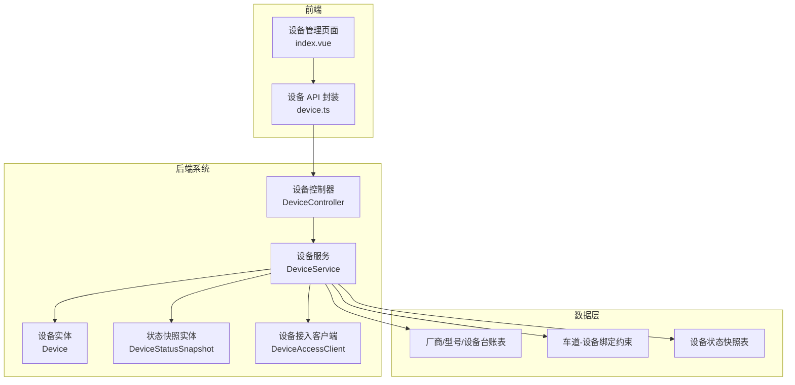
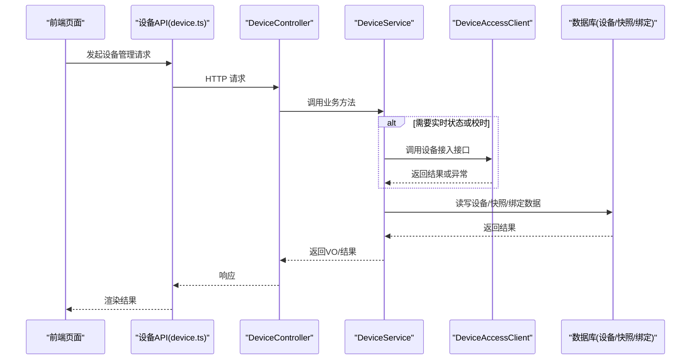
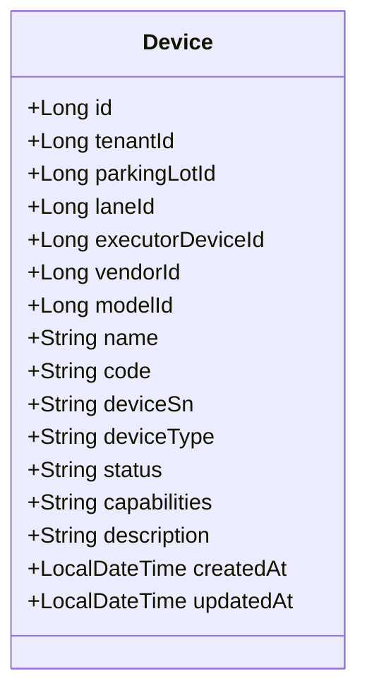
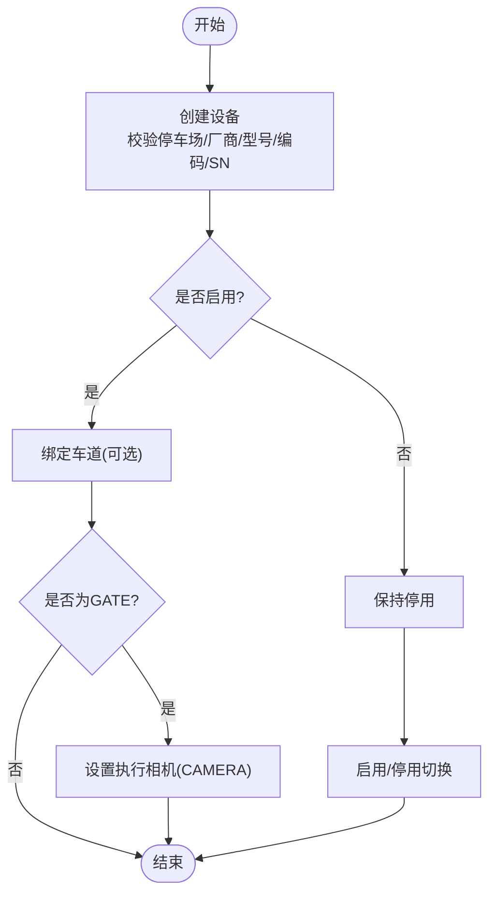
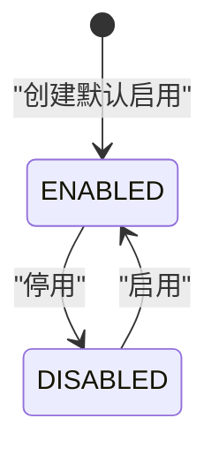
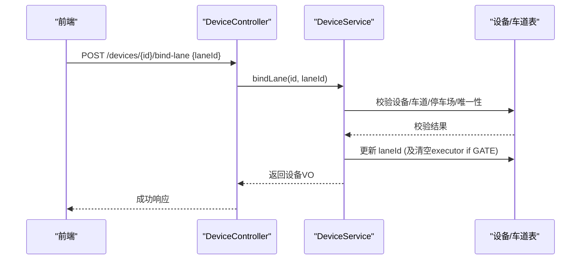
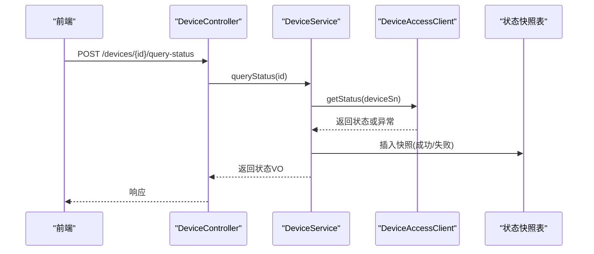
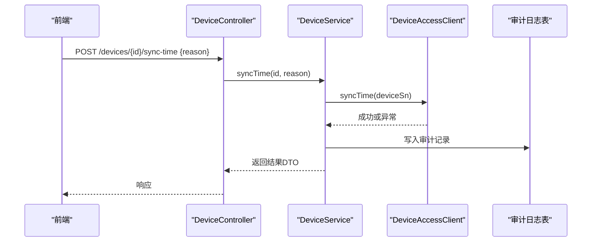
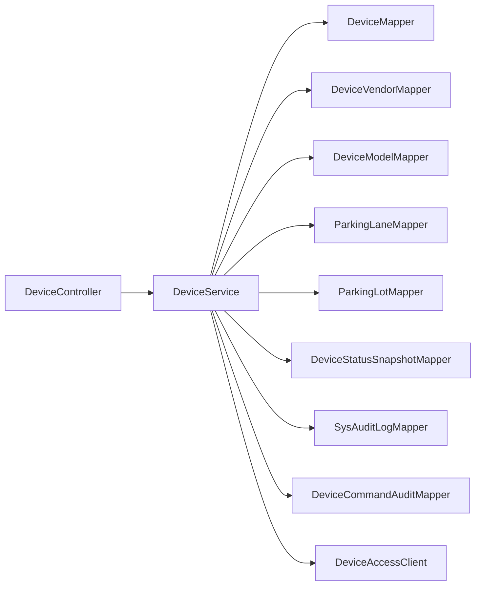

# 设备生命周期管理

<cite>
**本文引用的文件列表**
- [Device.java](file://parking-system/src/main/java/com/jushan/system/entity/Device.java)
- [DeviceController.java](file://parking-system/src/main/java/com/jushan/system/controller/DeviceController.java)
- [DeviceService.java](file://parking-system/src/main/java/com/jushan/system/service/DeviceService.java)
- [V20260711009__device_vendor_model.sql](file://parking-boot/src/main/resources/db/migration/V20260711009__device_vendor_model.sql)
- [V20260711010__lane_device_binding.sql](file://parking-boot/src/main/resources/db/migration/V20260711010__lane_device_binding.sql)
- [V20260711011__device_status_snapshot.sql](file://parking-boot/src/main/resources/db/migration/V20260711011__device_status_snapshot.sql)
- [device.ts](file://admin-web/src/api/device.ts)
- [index.vue](file://admin-web/src/views/device/index.vue)
</cite>

## 目录
1. [引言](#引言)
2. [项目结构](#项目结构)
3. [核心组件](#核心组件)
4. [架构总览](#架构总览)
5. [详细组件分析](#详细组件分析)
6. [依赖关系分析](#依赖关系分析)
7. [性能与可用性](#性能与可用性)
8. [故障排查指南](#故障排查指南)
9. [结论](#结论)
10. [附录：API 与前端集成示例](#附录api-与前端集成示例)

## 引言
本技术文档围绕“设备生命周期管理”展开，覆盖设备的创建、启用、停用、删除（预留）、绑定到停车场与车道、状态管理与快照、能力配置与描述信息、时间戳管理，以及设备校时等关键流程。同时提供后端 API 说明与前端集成示例，帮助读者快速理解并落地实现。

## 项目结构
设备生命周期相关代码主要分布在以下模块：
- parking-system：业务实体、控制器、服务层、视图对象与客户端调用封装
- parking-boot：数据库迁移脚本（厂商/型号/设备台账、车道绑定、状态快照）
- admin-web：设备管理的前端页面与 API 封装

图表来源
- [DeviceController.java:1-315](file://parking-system/src/main/java/com/jushan/system/controller/DeviceController.java#L1-L315)
- [DeviceService.java:1-1134](file://parking-system/src/main/java/com/jushan/system/service/DeviceService.java#L1-L1134)
- [Device.java:1-134](file://parking-system/src/main/java/com/jushan/system/entity/Device.java#L1-L134)
- [V20260711009__device_vendor_model.sql:1-89](file://parking-boot/src/main/resources/db/migration/V20260711009__device_vendor_model.sql#L1-L89)
- [V20260711010__lane_device_binding.sql:1-29](file://parking-boot/src/main/resources/db/migration/V20260711010__lane_device_binding.sql#L1-L29)
- [V20260711011__device_status_snapshot.sql:1-32](file://parking-boot/src/main/resources/db/migration/V20260711011__device_status_snapshot.sql#L1-L32)
- [device.ts:1-158](file://admin-web/src/api/device.ts#L1-L158)
- [index.vue:1-446](file://admin-web/src/views/device/index.vue#L1-L446)

章节来源
- [DeviceController.java:1-315](file://parking-system/src/main/java/com/jushan/system/controller/DeviceController.java#L1-L315)
- [DeviceService.java:1-1134](file://parking-system/src/main/java/com/jushan/system/service/DeviceService.java#L1-L1134)
- [Device.java:1-134](file://parking-system/src/main/java/com/jushan/system/entity/Device.java#L1-L134)
- [V20260711009__device_vendor_model.sql:1-89](file://parking-boot/src/main/resources/db/migration/V20260711009__device_vendor_model.sql#L1-L89)
- [V20260711010__lane_device_binding.sql:1-29](file://parking-boot/src/main/resources/db/migration/V20260711010__lane_device_binding.sql#L1-L29)
- [V20260711011__device_status_snapshot.sql:1-32](file://parking-boot/src/main/resources/db/migration/V20260711011__device_status_snapshot.sql#L1-L32)
- [device.ts:1-158](file://admin-web/src/api/device.ts#L1-L158)
- [index.vue:1-446](file://admin-web/src/views/device/index.vue#L1-L446)

## 核心组件
- 设备实体 Device：平台设备主数据源，承载设备基本信息、厂商/型号关联、业务编码、序列号、类型、状态、能力、描述与时间戳。
- 设备控制器 DeviceController：对外暴露设备 CRUD、状态变更、车道绑定、执行相机设置、设备校时、状态查询与快照接口。
- 设备服务 DeviceService：实现设备全生命周期逻辑，包括租户隔离校验、唯一性校验、状态转换规则、绑定约束、快照持久化、批量查询并发控制等。
- 数据库迁移脚本：定义厂商/型号/设备台账、车道-设备绑定约束、设备状态快照表结构与索引。
- 前端 API 与页面：封装设备管理相关 HTTP 请求，并提供可视化操作界面。

章节来源
- [Device.java:1-134](file://parking-system/src/main/java/com/jushan/system/entity/Device.java#L1-L134)
- [DeviceController.java:1-315](file://parking-system/src/main/java/com/jushan/system/controller/DeviceController.java#L1-L315)
- [DeviceService.java:1-1134](file://parking-system/src/main/java/com/jushan/system/service/DeviceService.java#L1-L1134)
- [V20260711009__device_vendor_model.sql:1-89](file://parking-boot/src/main/resources/db/migration/V20260711009__device_vendor_model.sql#L1-L89)
- [V20260711010__lane_device_binding.sql:1-29](file://parking-boot/src/main/resources/db/migration/V20260711010__lane_device_binding.sql#L1-L29)
- [V20260711011__device_status_snapshot.sql:1-32](file://parking-boot/src/main/resources/db/migration/V20260711011__device_status_snapshot.sql#L1-L32)
- [device.ts:1-158](file://admin-web/src/api/device.ts#L1-L158)
- [index.vue:1-446](file://admin-web/src/views/device/index.vue#L1-L446)

## 架构总览
设备生命周期管理的整体交互如下：
- 前端通过 device.ts 调用 /admin/devices 系列接口
- DeviceController 接收请求并进行权限校验
- DeviceService 执行业务逻辑（含租户隔离、唯一性校验、状态转换、绑定约束、快照持久化）
- 必要时调用 DeviceAccessClient 与设备侧通信（如状态查询、校时）
- 数据落库至设备台账、车道绑定、状态快照等表

图表来源
- [DeviceController.java:1-315](file://parking-system/src/main/java/com/jushan/system/controller/DeviceController.java#L1-L315)
- [DeviceService.java:1-1134](file://parking-system/src/main/java/com/jushan/system/service/DeviceService.java#L1-L1134)
- [device.ts:1-158](file://admin-web/src/api/device.ts#L1-L158)
- [index.vue:1-446](file://admin-web/src/views/device/index.vue#L1-L446)

## 详细组件分析

### 设备台账设计与字段语义
- 设备台账表包含设备基本信息（名称、编码、序列号、类型）、厂商/型号引用、所属停车场与车道、执行设备（GATE 指向实际开闸的 CAMERA）、状态、能力、描述与时间戳。
- 安全约束：禁止前端直接传入 device_sn；SN 在同厂商内唯一；设备编码在停车场内唯一；通过 parking_lot_id → tenant_id 推导租户范围，确保数据隔离。
- 时间戳：created_at、updated_at 由数据库默认值维护；服务层在更新时显式设置 updatedAt。

图表来源
- [Device.java:1-134](file://parking-system/src/main/java/com/jushan/system/entity/Device.java#L1-L134)
- [V20260711009__device_vendor_model.sql:1-89](file://parking-boot/src/main/resources/db/migration/V20260711009__device_vendor_model.sql#L1-L89)

章节来源
- [Device.java:1-134](file://parking-system/src/main/java/com/jushan/system/entity/Device.java#L1-L134)
- [V20260711009__device_vendor_model.sql:1-89](file://parking-boot/src/main/resources/db/migration/V20260711009__device_vendor_model.sql#L1-L89)

### 设备生命周期流程（创建、启用、停用、删除）
- 创建：校验停车场归属、厂商/型号有效性、设备类型、编码唯一性、SN 唯一性；默认状态为 ENABLED；写入设备台账。
- 启用/停用：仅允许在 ENABLED 与 DISABLED 之间切换；使用条件更新防止并发覆盖；若当前状态与目标一致则拒绝。
- 删除：当前未提供删除接口；如需软删除可在后续扩展。
- 绑定/解绑车道：仅已启用的设备可绑定；同车道每种设备类型最多一台；GATE 绑定后清空旧的执行相机，需重新指定。
- 设置执行相机：仅 GATE 设备支持；执行相机必须为 CAMERA、已启用且与 GATE 绑定到同一车道。

图表来源
- [DeviceService.java:138-404](file://parking-system/src/main/java/com/jushan/system/service/DeviceService.java#L138-L404)
- [DeviceService.java:406-560](file://parking-system/src/main/java/com/jushan/system/service/DeviceService.java#L406-L560)

章节来源
- [DeviceService.java:138-404](file://parking-system/src/main/java/com/jushan/system/service/DeviceService.java#L138-L404)
- [DeviceService.java:406-560](file://parking-system/src/main/java/com/jushan/system/service/DeviceService.java#L406-L560)

### 设备状态管理机制（ENABLED/DISABLED）
- 状态常量：ENABLED、DISABLED
- 转换规则：
  - 仅允许在两者之间切换
  - 若当前状态与目标相同，拒绝操作
  - 使用条件更新（基于当前状态）保证并发安全
- 业务含义：
  - ENABLED：设备可用，允许进行状态查询、绑定车道、校时等操作
  - DISABLED：设备不可用，禁止绑定、状态查询、校时等

图表来源
- [DeviceService.java:365-404](file://parking-system/src/main/java/com/jushan/system/service/DeviceService.java#L365-L404)

章节来源
- [DeviceService.java:365-404](file://parking-system/src/main/java/com/jushan/system/service/DeviceService.java#L365-L404)

### 设备与停车场、车道的绑定关系管理
- 绑定前校验：
  - 设备必须已启用
  - 车道存在且已启用
  - 设备与车道属于同一停车场
  - 同车道同类型设备唯一（排除自身）
- 绑定后行为：
  - 更新 laneId
  - 若为 GATE，自动清空旧的 executorDeviceId，需重新指定执行相机
- 解绑：
  - 清空 laneId 与 executorDeviceId

图表来源
- [DeviceController.java:130-163](file://parking-system/src/main/java/com/jushan/system/controller/DeviceController.java#L130-L163)
- [DeviceService.java:406-509](file://parking-system/src/main/java/com/jushan/system/service/DeviceService.java#L406-L509)
- [V20260711010__lane_device_binding.sql:1-29](file://parking-boot/src/main/resources/db/migration/V20260711010__lane_device_binding.sql#L1-L29)

章节来源
- [DeviceController.java:130-163](file://parking-system/src/main/java/com/jushan/system/controller/DeviceController.java#L130-L163)
- [DeviceService.java:406-509](file://parking-system/src/main/java/com/jushan/system/service/DeviceService.java#L406-L509)
- [V20260711010__lane_device_binding.sql:1-29](file://parking-boot/src/main/resources/db/migration/V20260711010__lane_device_binding.sql#L1-L29)

### 设备能力配置、描述信息与时间戳管理
- 能力配置 capabilities：字符串形式（JSON 或逗号分隔），用于声明设备能力集合
- 描述信息 description：运营备注
- 时间戳：
  - created_at：创建时间，默认当前时间
  - updated_at：更新时间，默认当前时间并在每次更新时刷新
- 服务层在更新时显式设置 updatedAt，确保审计与排障准确性

章节来源
- [Device.java:1-134](file://parking-system/src/main/java/com/jushan/system/entity/Device.java#L1-L134)
- [DeviceService.java:213-283](file://parking-system/src/main/java/com/jushan/system/service/DeviceService.java#L213-L283)
- [V20260711009__device_vendor_model.sql:1-89](file://parking-boot/src/main/resources/db/migration/V20260711009__device_vendor_model.sql#L1-L89)

### 设备状态查询与快照（T24）
- 实时状态查询：
  - 调用 DeviceAccessClient 获取在线状态、道闸状态、连接状态、最近在线时间等
  - 将结果持久化为快照记录，包含采集时间、成功标志、错误码/消息
- 最新快照读取：
  - 不触发网络请求，仅读取最近一次快照
  - 计算 stale 标志（超过阈值视为过期），供前端展示“最后查询于 X 秒前”
- 批量查询：
  - 受控并发（信号量限制同时调用的 DA 请求数）
  - 单次上限与失败隔离（单个设备失败不影响其他设备）

图表来源
- [DeviceController.java:236-295](file://parking-system/src/main/java/com/jushan/system/controller/DeviceController.java#L236-L295)
- [DeviceService.java:774-972](file://parking-system/src/main/java/com/jushan/system/service/DeviceService.java#L774-L972)
- [V20260711011__device_status_snapshot.sql:1-32](file://parking-boot/src/main/resources/db/migration/V20260711011__device_status_snapshot.sql#L1-L32)

章节来源
- [DeviceController.java:236-295](file://parking-system/src/main/java/com/jushan/system/controller/DeviceController.java#L236-L295)
- [DeviceService.java:774-972](file://parking-system/src/main/java/com/jushan/system/service/DeviceService.java#L774-L972)
- [V20260711011__device_status_snapshot.sql:1-32](file://parking-boot/src/main/resources/db/migration/V20260711011__device_status_snapshot.sql#L1-L32)

### 设备校时（T25）
- 前置校验：设备必须已启用
- 调用 DeviceAccessClient 发送校时命令
- 结果持久化到审计日志（包含操作人、原因、结果、失败原因）
- 无自动重试；UNCERTAIN 标记需人工确认

图表来源
- [DeviceController.java:213-234](file://parking-system/src/main/java/com/jushan/system/controller/DeviceController.java#L213-L234)
- [DeviceService.java:562-653](file://parking-system/src/main/java/com/jushan/system/service/DeviceService.java#L562-L653)

章节来源
- [DeviceController.java:213-234](file://parking-system/src/main/java/com/jushan/system/controller/DeviceController.java#L213-L234)
- [DeviceService.java:562-653](file://parking-system/src/main/java/com/jushan/system/service/DeviceService.java#L562-L653)

## 依赖关系分析
- 控制器依赖服务层，服务层依赖多个 Mapper（设备、厂商、型号、停车场、车道、快照、审计）与外部客户端（DeviceAccessClient）
- 数据隔离通过停车场级授权与租户上下文共同保障
- 并发控制通过信号量限制批量状态查询的并发度

图表来源
- [DeviceController.java:1-315](file://parking-system/src/main/java/com/jushan/system/controller/DeviceController.java#L1-L315)
- [DeviceService.java:1-136](file://parking-system/src/main/java/com/jushan/system/service/DeviceService.java#L1-L136)

章节来源
- [DeviceController.java:1-315](file://parking-system/src/main/java/com/jushan/system/controller/DeviceController.java#L1-L315)
- [DeviceService.java:1-136](file://parking-system/src/main/java/com/jushan/system/service/DeviceService.java#L1-L136)

## 性能与可用性
- 批量状态查询采用虚拟线程与信号量限流，避免长时间占用线程池
- 单次批量查询上限与并发度有明确限制，防止对设备接入侧造成压力
- 快照机制减少频繁实时查询，提升列表轮询性能
- 条件更新与唯一性约束降低并发冲突风险

[本节为通用指导，无需具体文件分析]

## 故障排查指南
- 状态查询失败：
  - 检查快照表的 error_code 与 error_message，定位是 UNCERTAIN、404、503 还是未知错误
  - 核对设备是否启用、SN 是否正确、设备接入服务是否可达
- 绑定失败：
  - 检查设备与车道是否属于同一停车场、是否已启用、是否存在重复类型设备
- 校时失败：
  - 查看审计日志中的 result 与 fail_reason，确认是否为 UNCERTAIN 或 FAILED
- 并发冲突：
  - 状态切换提示“设备状态已变更”，请刷新后重试

章节来源
- [DeviceService.java:774-972](file://parking-system/src/main/java/com/jushan/system/service/DeviceService.java#L774-L972)
- [DeviceService.java:365-404](file://parking-system/src/main/java/com/jushan/system/service/DeviceService.java#L365-L404)
- [DeviceService.java:406-509](file://parking-system/src/main/java/com/jushan/system/service/DeviceService.java#L406-L509)
- [DeviceService.java:562-653](file://parking-system/src/main/java/com/jushan/system/service/DeviceService.java#L562-L653)

## 结论
设备生命周期管理以设备台账为核心，结合严格的租户与停车场级数据隔离、唯一性约束与状态转换规则，提供了完整的创建、启用、停用、绑定、状态查询与校时能力。通过快照机制与并发控制，系统在可用性与性能之间取得平衡。建议后续补充删除（软删除）能力与更完善的设备能力矩阵校验。

[本节为总结，无需具体文件分析]

## 附录：API 与前端集成示例

### 后端 API 概览（/admin/devices）
- 分页查询设备列表：GET /admin/devices
- 查询设备详情：GET /admin/devices/{id}
- 创建设备：POST /admin/devices
- 更新设备基础信息：PUT /admin/devices/{id}
- 启用/停用设备：POST /admin/devices/{id}/status
- 绑定车道：POST /admin/devices/{id}/bind-lane
- 解绑车道：DELETE /admin/devices/{id}/bind-lane
- 设置执行相机：POST /admin/devices/{id}/executor
- 设备校时：POST /admin/devices/{id}/sync-time
- 查询实时状态：POST /admin/devices/{id}/query-status
- 批量查询实时状态：POST /admin/devices/query-status-batch
- 获取最新快照：GET /admin/devices/{id}/status
- 批量获取最新快照：POST /admin/devices/status-snapshots

章节来源
- [DeviceController.java:1-315](file://parking-system/src/main/java/com/jushan/system/controller/DeviceController.java#L1-L315)

### 前端 API 封装（device.ts）
- 提供 getDevices、createDevice、updateDevice、updateDeviceStatus、bindLane、unbindLane、setExecutor、syncDeviceTime、queryDeviceStatus、queryDeviceStatusBatch、getDeviceStatusSnapshot、getDeviceStatusSnapshots 等方法
- 类型定义包含 DeviceVO、DeviceStatusVO、TimeSyncResult、DeviceVendor、DeviceModel

章节来源
- [device.ts:1-158](file://admin-web/src/api/device.ts#L1-L158)

### 前端页面集成示例（index.vue）
- 列表页支持按停车场、设备类型、状态筛选
- 新增/编辑弹窗包含停车场、名称、编码、序列号、类型、厂商、型号、能力、备注
- 在线状态通过快照显示，点击可触发实时查询
- 支持绑定/解绑车道、设置执行相机、校时、启用/停用
- 批量刷新状态支持选择多行设备

章节来源
- [index.vue:1-446](file://admin-web/src/views/device/index.vue#L1-L446)