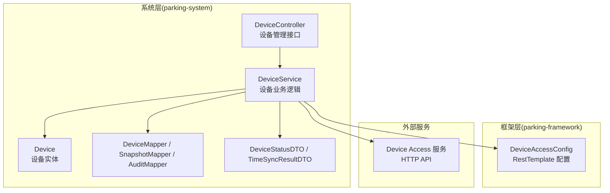
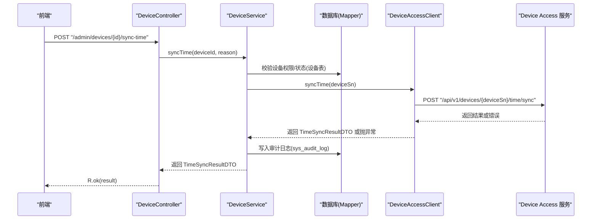
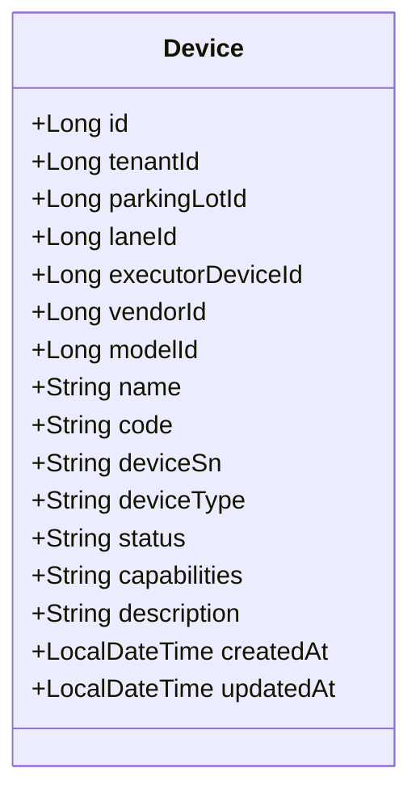
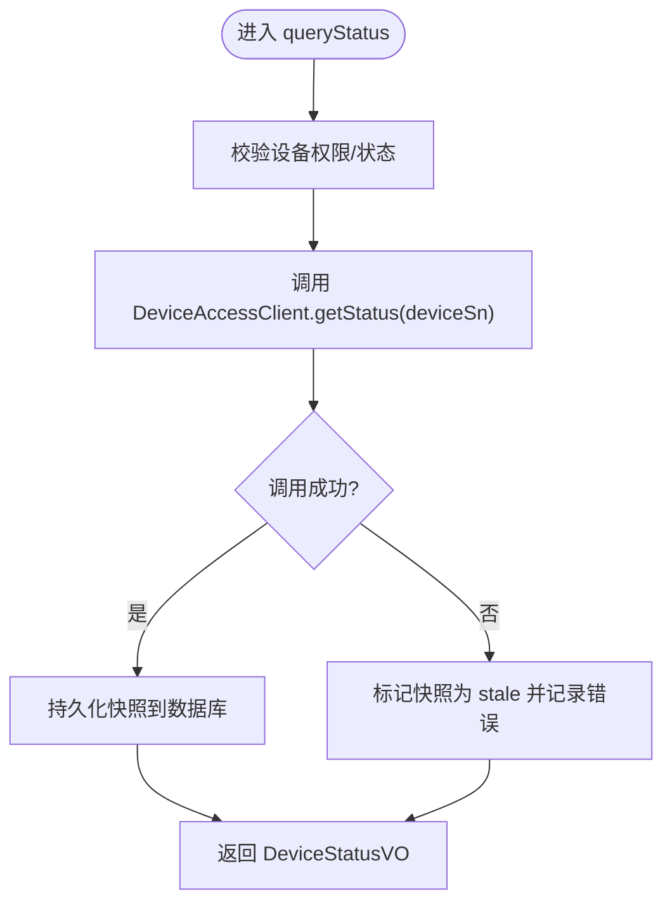
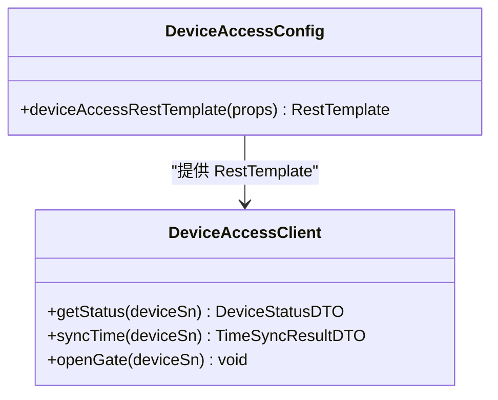
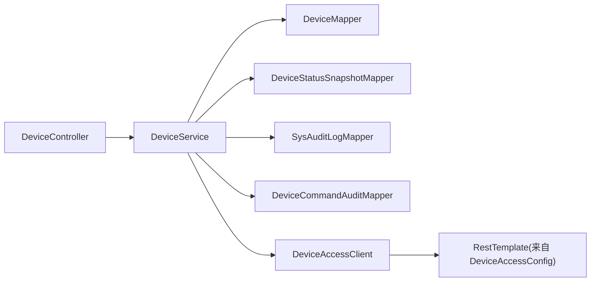

# 设备管理模块

<cite>
**本文引用的文件**   
- [Device.java](file://parking-system/src/main/java/com/jushan/system/entity/Device.java)
- [DeviceService.java](file://parking-system/src/main/java/com/jushan/system/service/DeviceService.java)
- [DeviceController.java](file://parking-system/src/main/java/com/jushan/system/controller/DeviceController.java)
- [DeviceAccessClient.java](file://parking-system/src/main/java/com/jushan/system/client/DeviceAccessClient.java)
- [DeviceAccessConfig.java](file://parking-framework/src/main/java/com/jushan/framework/config/DeviceAccessConfig.java)
</cite>

## 目录
1. [简介](#简介)
2. [项目结构](#项目结构)
3. [核心组件](#核心组件)
4. [架构总览](#架构总览)
5. [详细组件分析](#详细组件分析)
6. [依赖关系分析](#依赖关系分析)
7. [性能与连接池配置](#性能与连接池配置)
8. [监控与告警集成](#监控与告警集成)
9. [故障排查指南](#故障排查指南)
10. [结论](#结论)
11. [附录：协议、数据格式与安全](#附录协议数据格式与安全)

## 简介
本技术文档围绕“设备管理模块”展开，覆盖设备台账设计、状态监控机制、时间同步策略、生命周期管理、厂商协议适配与远程命令下发、设备状态快照、异常检测与自动恢复流程、与 Device Access 服务的集成实现（HTTP 客户端封装、重试策略与错误处理）、设备配置管理、固件升级与批量操作方案、通信协议与数据格式、安全性考虑、性能优化、连接池配置以及监控告警集成等主题。文档以代码为依据，提供可视化架构图与流程图，帮助读者快速理解并落地实施。

## 项目结构
设备管理模块主要位于 parking-system 与 parking-framework 两个子工程中：
- parking-system：业务层（控制器、服务、实体、DTO/VO、Mapper）
- parking-framework：通用框架能力（HTTP 客户端配置、认证上下文、分布式锁、消息队列、Redis 等）

图表来源
- [DeviceController.java:1-315](file://parking-system/src/main/java/com/jushan/system/controller/DeviceController.java#L1-L315)
- [DeviceService.java:1-800](file://parking-system/src/main/java/com/jushan/system/service/DeviceService.java#L1-L800)
- [Device.java:1-134](file://parking-system/src/main/java/com/jushan/system/entity/Device.java#L1-L134)
- [DeviceAccessConfig.java:1-71](file://parking-framework/src/main/java/com/jushan/framework/config/DeviceAccessConfig.java#L1-L71)

章节来源
- [DeviceController.java:1-315](file://parking-system/src/main/java/com/jushan/system/controller/DeviceController.java#L1-L315)
- [DeviceService.java:1-800](file://parking-system/src/main/java/com/jushan/system/service/DeviceService.java#L1-L800)
- [Device.java:1-134](file://parking-system/src/main/java/com/jushan/system/entity/Device.java#L1-L134)
- [DeviceAccessConfig.java:1-71](file://parking-framework/src/main/java/com/jushan/framework/config/DeviceAccessConfig.java#L1-L71)

## 核心组件
- 设备实体（Device）：平台设备台账主数据源，包含租户、停车场、车道绑定、执行相机映射、厂商/型号、类型、能力集、状态等字段，并提供安全约束说明。
- 设备服务（DeviceService）：负责设备 CRUD、启用/停用、车道绑定/解绑、设置执行相机、设备校时、开闸占位、状态查询与快照持久化、批量状态查询等。
- 设备控制器（DeviceController）：对外暴露设备管理 REST 接口，包括分页列表、详情、创建/更新、状态变更、车道绑定/解绑、执行相机设置、校时、状态查询与快照获取、批量状态查询等。
- Device Access 客户端（DeviceAccessClient）：对 Device Access 的 HTTP 调用抽象，当前已实现状态查询与校时，开闸为预留接口（v0.2 未实现）。
- Device Access 配置（DeviceAccessConfig）：构建专用 RestTemplate，配置连接与读取超时，禁用自动重试与默认错误处理器，由上层解析响应体错误码。

章节来源
- [Device.java:1-134](file://parking-system/src/main/java/com/jushan/system/entity/Device.java#L1-L134)
- [DeviceService.java:1-800](file://parking-system/src/main/java/com/jushan/system/service/DeviceService.java#L1-L800)
- [DeviceController.java:1-315](file://parking-system/src/main/java/com/jushan/system/controller/DeviceController.java#L1-L315)
- [DeviceAccessClient.java:1-65](file://parking-system/src/main/java/com/jushan/system/client/DeviceAccessClient.java#L1-L65)
- [DeviceAccessConfig.java:1-71](file://parking-framework/src/main/java/com/jushan/framework/config/DeviceAccessConfig.java#L1-L71)

## 架构总览
设备管理模块采用分层架构：控制器接收请求，服务编排业务逻辑与数据访问，并通过 Device Access 客户端与外部设备接入服务交互。所有写操作均记录审计日志，状态查询结果持久化为快照，供前端轮询展示。

图表来源
- [DeviceController.java:213-234](file://parking-system/src/main/java/com/jushan/system/controller/DeviceController.java#L213-L234)
- [DeviceService.java:562-653](file://parking-system/src/main/java/com/jushan/system/service/DeviceService.java#L562-L653)
- [DeviceAccessClient.java:39-49](file://parking-system/src/main/java/com/jushan/system/client/DeviceAccessClient.java#L39-L49)

## 详细组件分析

### 设备实体与台账设计（Device）
- 字段与职责
  - 基础信息：名称、编码、序列号、类型（CAMERA/GATE）、能力集、描述
  - 归属关系：租户 ID、停车场 ID、车道 ID、执行相机映射（仅 GATE）
  - 厂商/型号：vendorId、modelId
  - 运行状态：ENABLED/DISABLED
  - 审计时间：createdAt、updatedAt
- 安全约束
  - 前端仅可提交平台设备引用，禁止直接传入 device_sn
  - SN 在同厂商内唯一，且不可跨租户/停车场复用
  - 通过 parking_lot_id → tenant_id 推导租户范围，确保数据隔离

图表来源
- [Device.java:1-134](file://parking-system/src/main/java/com/jushan/system/entity/Device.java#L1-L134)

章节来源
- [Device.java:1-134](file://parking-system/src/main/java/com/jushan/system/entity/Device.java#L1-L134)

### 设备服务（DeviceService）
- 生命周期管理
  - 创建：校验停车场归属、厂商/型号有效性、编码唯一性、SN 唯一性；默认启用
  - 更新：部分更新，支持名称、编码、类型、能力集、描述；编码变更需唯一性校验
  - 启用/停用：条件更新防止并发覆盖，幂等检查避免重复操作
- 车道绑定与执行相机
  - 绑定：校验设备与车道启用状态、同停车场、同车道同类型唯一；GATE 绑定后清空旧执行相机
  - 解绑：清空 laneId 与 executorDeviceId
  - 设置执行相机：仅 GATE 可用，要求执行相机为 CAMERA、启用且与 GATE 同车道
- 时间同步（T25）
  - 调用 Device Access 进行校时，捕获异常并区分 SUCCESS/FAILED/UNCERTAIN
  - 写入审计日志（sys_audit_log），包含操作人、目标、原因、前后值等
- 开闸占位（P001）
  - 仅 GATE 支持；创建结构化审计记录（device_command_audit）
  - 调用 openGate 占位接口，v0.2 抛出 UnsupportedOperationException，更新审计并提示待 v1.0 启用
- 状态查询与快照（T24）
  - queryStatus：实时查询 DA，持久化快照（device_status_snapshot），标记采集时间
  - getLatestSnapshot/getLatestSnapshots：读取最近快照，计算 stale 标志（超过阈值视为过期）
  - queryStatusBatch：批量查询，限流保护（最多同时 5 台），单失败不影响其他设备

图表来源
- [DeviceService.java:774-800](file://parking-system/src/main/java/com/jushan/system/service/DeviceService.java#L774-L800)

章节来源
- [DeviceService.java:138-283](file://parking-system/src/main/java/com/jushan/system/service/DeviceService.java#L138-L283)
- [DeviceService.java:365-404](file://parking-system/src/main/java/com/jushan/system/service/DeviceService.java#L365-L404)
- [DeviceService.java:406-560](file://parking-system/src/main/java/com/jushan/system/service/DeviceService.java#L406-L560)
- [DeviceService.java:562-653](file://parking-system/src/main/java/com/jushan/system/service/DeviceService.java#L562-L653)
- [DeviceService.java:655-772](file://parking-system/src/main/java/com/jushan/system/service/DeviceService.java#L655-L772)
- [DeviceService.java:774-800](file://parking-system/src/main/java/com/jushan/system/service/DeviceService.java#L774-L800)

### 设备控制器（DeviceController）
- 接口清单
  - GET /admin/devices：分页列表（按停车场筛选，支持状态/类型过滤）
  - GET /admin/devices/{id}：设备详情
  - POST /admin/devices：创建设备
  - PUT /admin/devices/{id}：更新设备
  - POST /admin/devices/{id}/status：启用/停用
  - POST /admin/devices/{id}/bind-lane：绑定车道
  - DELETE /admin/devices/{id}/bind-lane：解绑车道
  - POST /admin/devices/{id}/executor：设置执行相机
  - GET /admin/devices/vendors：厂商列表
  - GET /admin/devices/models：型号列表（可选按厂商筛选）
  - POST /admin/devices/{id}/sync-time：设备校时
  - POST /admin/devices/{id}/query-status：实时状态查询
  - POST /admin/devices/query-status-batch：批量实时状态查询
  - GET /admin/devices/{id}/status：最新快照
  - POST /admin/devices/status-snapshots：批量快照
- 权限控制
  - 使用 SaToken 注解进行权限校验（device:read / device:manage）
- 输入输出
  - 统一返回包装 R<T>，错误码与消息遵循全局异常处理

章节来源
- [DeviceController.java:1-315](file://parking-system/src/main/java/com/jushan/system/controller/DeviceController.java#L1-L315)

### Device Access 客户端与配置
- 客户端接口（DeviceAccessClient）
  - getStatus(deviceSn)：查询设备状态
  - syncTime(deviceSn)：设备校时
  - openGate(deviceSn)：预留接口，v0.2 未实现，默认抛出异常
- 配置（DeviceAccessConfig）
  - 构建专用 RestTemplate，设置连接与读取超时
  - 禁用自动重试拦截器与默认错误处理器，由调用方解析响应体错误码
  - 明确不透明重试策略：写请求不得透明重试，网络错误或超时标记为 UNCERTAIN

图表来源
- [DeviceAccessClient.java:1-65](file://parking-system/src/main/java/com/jushan/system/client/DeviceAccessClient.java#L1-L65)
- [DeviceAccessConfig.java:1-71](file://parking-framework/src/main/java/com/jushan/framework/config/DeviceAccessConfig.java#L1-L71)

章节来源
- [DeviceAccessClient.java:1-65](file://parking-system/src/main/java/com/jushan/system/client/DeviceAccessClient.java#L1-L65)
- [DeviceAccessConfig.java:1-71](file://parking-framework/src/main/java/com/jushan/framework/config/DeviceAccessConfig.java#L1-L71)

## 依赖关系分析
- 控制器依赖服务，服务依赖 Mapper 与 DeviceAccessClient
- DeviceAccessClient 依赖 DeviceAccessConfig 提供的 RestTemplate
- 服务在关键路径上写入审计日志与状态快照，保证可追溯性与前端展示

图表来源
- [DeviceController.java:1-315](file://parking-system/src/main/java/com/jushan/system/controller/DeviceController.java#L1-L315)
- [DeviceService.java:1-800](file://parking-system/src/main/java/com/jushan/system/service/DeviceService.java#L1-L800)
- [DeviceAccessConfig.java:1-71](file://parking-framework/src/main/java/com/jushan/framework/config/DeviceAccessConfig.java#L1-L71)

章节来源
- [DeviceController.java:1-315](file://parking-system/src/main/java/com/jushan/system/controller/DeviceController.java#L1-L315)
- [DeviceService.java:1-800](file://parking-system/src/main/java/com/jushan/system/service/DeviceService.java#L1-L800)
- [DeviceAccessConfig.java:1-71](file://parking-framework/src/main/java/com/jushan/framework/config/DeviceAccessConfig.java#L1-L71)

## 性能与连接池配置
- 连接与超时
  - 通过 DeviceAccessConfig 配置连接超时与读取超时，避免长阻塞
  - 不使用自动重试，减少抖动与重复开销
- 批量查询限流
  - 批量状态查询限制并发度（最多 5 台），降低瞬时压力
- 快照缓存
  - 前端优先读取快照，减少频繁调用 DA
  - stale 标志用于提示前端刷新时机
- 建议扩展
  - 引入连接池（如 Apache HttpClient 或 OkHttp）提升吞吐
  - 增加熔断与退避策略（如 Resilience4j），在网络不稳定时保护上游
  - 异步化批量查询（CompletableFuture 或线程池），结合信号量限流

[本节为通用指导，无需源码引用]

## 监控与告警集成
- 审计日志
  - 校时操作写入 sys_audit_log，包含操作人、目标、结果、失败原因、原因说明等
  - 开闸命令写入 device_command_audit，记录请求上下文与状态
- 指标与追踪
  - 建议在 DeviceAccessClient 中埋点（耗时、成功率、错误分类）
  - 结合 TraceIdFilter 与全局异常处理器，统一链路追踪与错误归因
- 告警规则
  - 基于快照 stale 比例与查询失败率触发告警
  - 对 UNCERTAIN 状态的命令进行人工确认与二次处理

章节来源
- [DeviceService.java:562-653](file://parking-system/src/main/java/com/jushan/system/service/DeviceService.java#L562-L653)
- [DeviceService.java:655-772](file://parking-system/src/main/java/com/jushan/system/service/DeviceService.java#L655-L772)

## 故障排查指南
- 常见问题定位
  - 设备无法校时：检查设备是否启用、Device Access 可达性、超时配置
  - 状态查询失败：查看快照 stale 标志与错误信息，确认 DA 返回码
  - 开闸未实现：v0.2 不支持，等待 v1.0 契约冻结后启用
- 日志与审计
  - 查看 sys_audit_log 与 device_command_audit 记录，定位操作人与失败原因
  - 关注 DeviceService 中的 warn/error 日志，辅助定位网络与业务异常
- 恢复策略
  - 对 UNCERTAIN 的命令进行人工复核与重试（注意幂等与防抖）
  - 对快照过期的设备，触发一次实时查询以刷新快照

章节来源
- [DeviceService.java:562-653](file://parking-system/src/main/java/com/jushan/system/service/DeviceService.java#L562-L653)
- [DeviceService.java:655-772](file://parking-system/src/main/java/com/jushan/system/service/DeviceService.java#L655-L772)

## 结论
设备管理模块以设备台账为核心，结合状态快照与审计日志，形成完整的设备生命周期管理与可观测体系。通过 Device Access 客户端与专用 RestTemplate 配置，实现了稳定的外部服务集成与明确的错误处理策略。后续可在连接池、熔断与异步化方面进一步优化，以提升整体性能与稳定性。

[本节为总结，无需源码引用]

## 附录：协议、数据格式与安全
- 通信协议
  - 设备状态查询：GET /api/v1/devices/{deviceSn}/status
  - 设备校时：POST /api/v1/devices/{deviceSn}/time/sync
  - 开闸（v1.0）：预留接口，当前 v0.2 未实现
- 数据格式
  - 请求/响应遵循 JSON 格式，具体字段参考 DeviceAccessClient 注释与返回值 DTO
- 安全性考虑
  - 前端仅能提交平台设备引用，禁止直接传入 device_sn
  - 通过 parking_lot_id → tenant_id 推导租户范围，确保数据隔离
  - 所有写操作记录审计日志，便于追溯与合规

章节来源
- [DeviceAccessClient.java:26-64](file://parking-system/src/main/java/com/jushan/system/client/DeviceAccessClient.java#L26-L64)
- [DeviceService.java:138-283](file://parking-system/src/main/java/com/jushan/system/service/DeviceService.java#L138-L283)