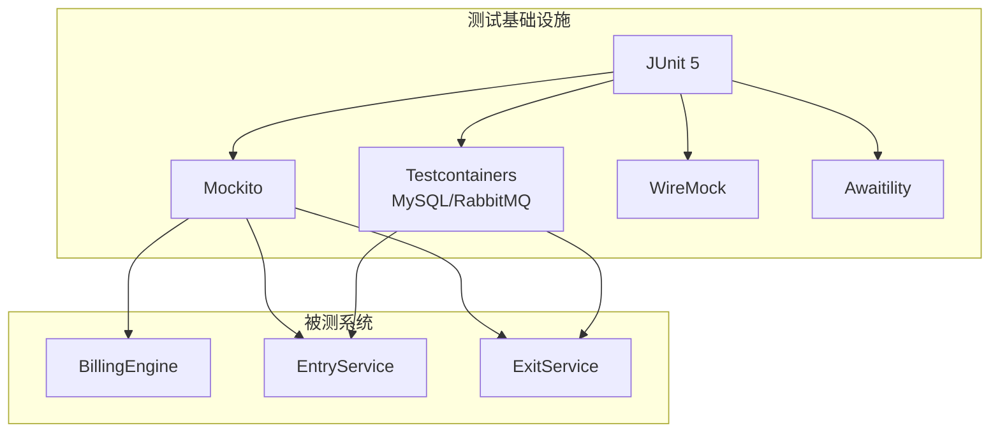
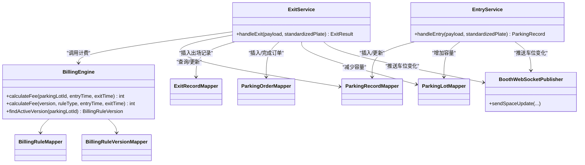
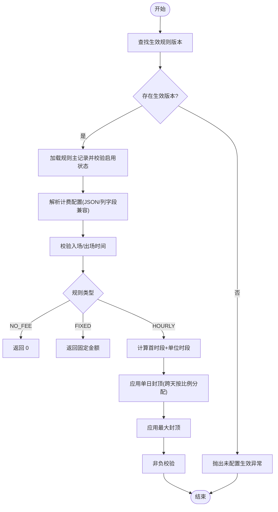
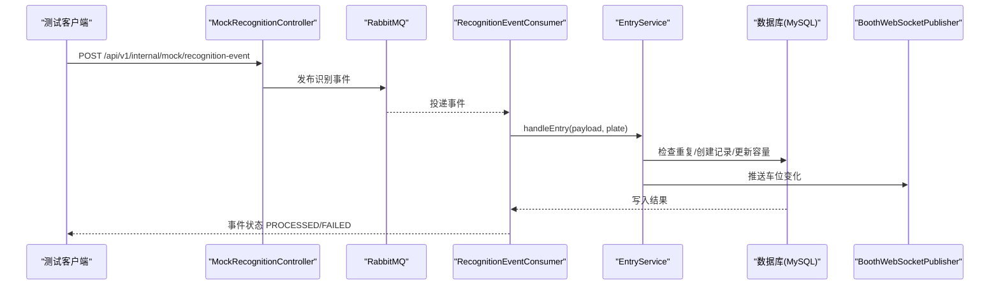
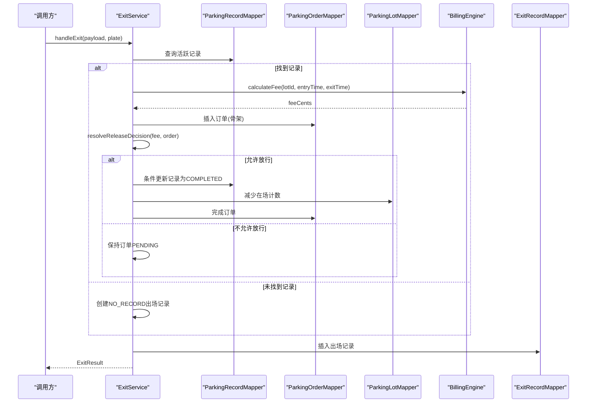
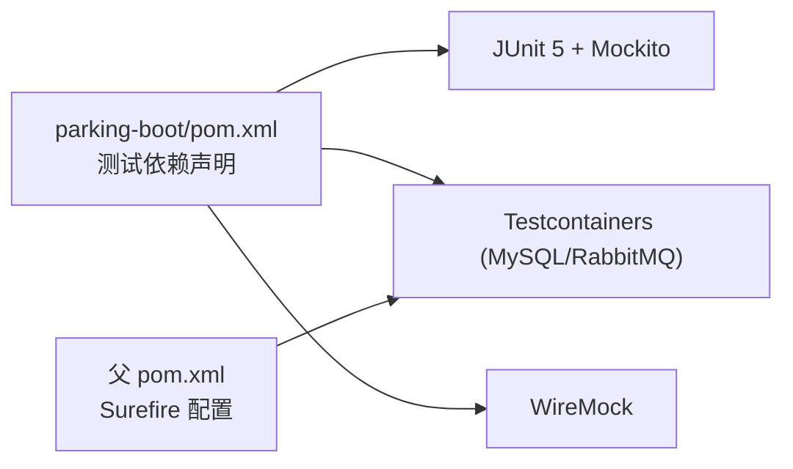

# 单元测试

<cite>
**本文引用的文件**   
- [parking-boot/pom.xml](file://parking-boot/pom.xml)
- [pom.xml](file://pom.xml)
- [TestcontainersBaseTest.java](file://parking-boot/src/test/java/com/jushan/boot/test/TestcontainersBaseTest.java)
- [LightweightTestConfig.java](file://parking-boot/src/test/java/com/jushan/boot/test/LightweightTestConfig.java)
- [BillingEngineTest.java](file://parking-boot/src/test/java/com/jushan/boot/service/BillingEngineTest.java)
- [EntryServiceTest.java](file://parking-boot/src/test/java/com/jushan/boot/event/EntryServiceTest.java)
- [ExitServiceTest.java](file://parking-boot/src/test/java/com/jushan/boot/service/ExitServiceTest.java)
- [BillingEngine.java](file://parking-system/src/main/java/com/jushan/system/service/BillingEngine.java)
- [EntryService.java](file://parking-system/src/main/java/com/jushan/system/service/EntryService.java)
- [ExitService.java](file://parking-system/src/main/java/com/jushan/system/service/ExitService.java)
</cite>

## 目录
1. [引言](#引言)
2. [项目结构](#项目结构)
3. [核心组件](#核心组件)
4. [架构总览](#架构总览)
5. [详细组件分析](#详细组件分析)
6. [依赖分析](#依赖分析)
7. [性能考虑](#性能考虑)
8. [故障排查指南](#故障排查指南)
9. [结论](#结论)
10. [附录](#附录)

## 引言
本文件面向停车平台后端模块的单元测试实践，聚焦 JUnit 5 与 Mockito 的配置和使用，围绕计费引擎（BillingEngine）、入场服务（EntryService）、出场服务（ExitService）三大关键业务组件，系统化阐述测试策略、Mock 对象使用、测试数据准备、断言最佳实践，并给出覆盖复杂业务逻辑、异常场景与边界条件的示例路径。同时提供测试覆盖率要求与命名规范建议，帮助团队建立稳定、可维护的测试体系。

## 项目结构
- 测试框架与基础设施
  - JUnit Jupiter（JUnit 5）：通过 spring-boot-starter-test 引入，配合 @ExtendWith(MockitoExtension.class) 启用 Mockito。
  - Mockito：用于构造轻量级单测，隔离外部依赖（Mapper、WebSocket 等）。
  - Testcontainers + Spring Boot Testcontainers：为集成测试提供 MySQL、RabbitMQ 等真实运行时环境。
  - WireMock：对外部 HTTP 接口进行 Mock（设备接入等），在相关测试中使用。
  - Awaitility：异步等待与断言，常用于 MQ 消费后的最终一致性验证。
- 测试组织方式
  - 单元层：针对纯业务计算与服务编排逻辑，采用 Mockito 隔离外部依赖。
  - 集成层：基于 Testcontainers 启动数据库与消息中间件，端到端验证事件处理、容量一致性与并发安全。
- 构建与执行
  - Maven Surefire 插件配置了 Docker 环境变量，确保 Testcontainers 在 CI/本地均可运行。

**章节来源**
- [parking-boot/pom.xml:77-115](file://parking-boot/pom.xml#L77-L115)
- [pom.xml:201-211](file://pom.xml#L201-L211)
- [TestcontainersBaseTest.java:1-33](file://parking-boot/src/test/java/com/jushan/boot/test/TestcontainersBaseTest.java#L1-L33)
- [LightweightTestConfig.java:1-26](file://parking-boot/src/test/java/com/jushan/boot/test/LightweightTestConfig.java#L1-L26)

## 核心组件
- 计费引擎（BillingEngine）
  - 职责：根据停车场生效计费规则版本计算费用；支持免费、固定金额、按小时计费（含首时段、单位时段、封顶、分时段等）。
  - 测试要点：无生效规则、NO_FEE/FIXED/HOURLY 多种规则、免费时长、封顶、跨天单日封顶、分时段冲突、时间校验、直接基于版本计算等。
- 入场服务（EntryService）
  - 职责：入场识别事件处理；重复入场策略（REJECT/UPDATE/EXCEPTION）；创建或更新停车记录；更新停车场容量；推送车位变化。
  - 测试要点：正常入场、重复入场拒绝、并发入场保护、容量一致性、停车场停用+禁止入场、出口事件不创建记录等。
- 出场服务（ExitService）
  - 职责：匹配在场记录、调用计费引擎、生成订单骨架、决定放行策略、条件更新停车记录、减少在场计数、创建出场记录。
  - 测试要点：零费放行、待支付不放行、无在场记录、并发下状态变更不重复减容量等。

**章节来源**
- [BillingEngine.java:45-128](file://parking-system/src/main/java/com/jushan/system/service/BillingEngine.java#L45-L128)
- [EntryService.java:44-134](file://parking-system/src/main/java/com/jushan/system/service/EntryService.java#L44-L134)
- [ExitService.java:47-134](file://parking-system/src/main/java/com/jushan/system/service/ExitService.java#L47-L134)

## 架构总览
下图展示三个核心服务的依赖关系与交互点，以及测试中常用的 Mock 与容器化基础设施。

**图表来源**
- [BillingEngine.java:45-128](file://parking-system/src/main/java/com/jushan/system/service/BillingEngine.java#L45-L128)
- [EntryService.java:44-134](file://parking-system/src/main/java/com/jushan/system/service/EntryService.java#L44-L134)
- [ExitService.java:47-134](file://parking-system/src/main/java/com/jushan/system/service/ExitService.java#L47-L134)

## 详细组件分析

### 计费引擎（BillingEngine）单元测试
- 测试目标
  - 覆盖规则类型：NO_FEE、FIXED、HOURLY。
  - 覆盖边界与异常：无生效规则、规则禁用、分时段冲突、出场早于入场、负值保护、最大封顶、跨天单日封顶。
  - 直接基于版本计算：绕过规则启用检查，便于回归重算。
- Mock 策略
  - 使用 @Mock 注入 BillingRuleMapper 与 BillingRuleVersionMapper，返回预设的规则与版本数据。
  - 使用 ObjectMapper 解析 JSON 配置（测试内构造合法 JSON）。
- 测试数据准备
  - 构造 BillingRuleVersion 字段与 config JSON，包含 freeMinutes、firstPeriod、firstAmount、unitPeriod、unitAmount、dailyCap、maxAmount、timeSegments。
- 断言最佳实践
  - 使用 AssertJ 的 assertThat / assertThatThrownBy 进行精确断言。
  - 对异常分支使用 hasMessageContaining 校验错误信息片段。
- 典型用例路径
  - 无生效规则 → 抛出业务异常。
  - NO_FEE → 费用为 0。
  - FIXED → 返回固定金额。
  - HOURLY 免费时段 → 费用为 0。
  - HOURLY 首时段+后续单位 → 正确累加。
  - HOURLY 最大封顶 → 截断至 maxAmount。
  - 跨天停车按自然日单日封顶 → 分段累计后封顶。
  - 分时段计费 → 按所在时段单价计算。
  - 分时段冲突 → 失败关闭。
  - 出场早于入场 → 参数异常。
  - 直接基于版本计算 → 不校验规则启用状态。

**图表来源**
- [BillingEngine.java:75-128](file://parking-system/src/main/java/com/jushan/system/service/BillingEngine.java#L75-L128)
- [BillingEngine.java:193-250](file://parking-system/src/main/java/com/jushan/system/service/BillingEngine.java#L193-L250)
- [BillingEngine.java:322-356](file://parking-system/src/main/java/com/jushan/system/service/BillingEngine.java#L322-L356)

**章节来源**
- [BillingEngineTest.java:30-207](file://parking-boot/src/test/java/com/jushan/boot/service/BillingEngineTest.java#L30-L207)
- [BillingEngine.java:75-128](file://parking-system/src/main/java/com/jushan/system/service/BillingEngine.java#L75-L128)

### 入场服务（EntryService）集成测试
- 测试目标
  - 正常入场：事件经 Consumer 处理后创建 PARKING 记录并更新容量。
  - 重复入场拒绝：功能唯一索引 uk_active_parking 阻止同车同场重复 PARKING。
  - 并发入场保护：并发触发同一车牌仅产生一条 PARKING 记录。
  - 容量一致性：currentVehicles 递增、remainingSpaces 递减，且二者之和等于 totalSpaces。
  - 停车场状态：停用+禁止新车入场 → 拒绝；允许新车入场 → 正常创建。
  - 出口事件：不创建停车记录，仅标记事件已处理。
- 测试环境与数据准备
  - 使用 RabbitMqTestBase 提供的 RabbitMQ 容器与队列清理。
  - 在 setUp 中清空队列与业务表，预置停车场、车道、设备，保证测试隔离。
- 异步与最终一致性
  - 使用 awaitility.await().untilAsserted(...) 等待消费者处理完成后再断言。
- 并发测试设计
  - 多线程同时触发同一车牌入场，验证数据库唯一索引保护与容量只更新一次。
  - 并发不同车牌入场，验证全部成功且容量正确累加。

**图表来源**
- [EntryServiceTest.java:186-231](file://parking-boot/src/test/java/com/jushan/boot/event/EntryServiceTest.java#L186-L231)
- [EntryService.java:75-134](file://parking-system/src/main/java/com/jushan/system/service/EntryService.java#L75-L134)

**章节来源**
- [EntryServiceTest.java:60-751](file://parking-boot/src/test/java/com/jushan/boot/event/EntryServiceTest.java#L60-L751)
- [EntryService.java:75-134](file://parking-system/src/main/java/com/jushan/system/service/EntryService.java#L75-L134)

### 出场服务（ExitService）单元测试
- 测试目标
  - 零费订单：放行，完成停车记录与订单。
  - 有费用订单：待支付，不放行，不完成停车记录。
  - 无在场记录：创建 NO_RECORD 出场记录。
  - 并发下记录状态变更：仍创建出场记录但不重复减容量。
- Mock 策略
  - 使用 @Mock 注入各 Mapper、BillingEngine、BoothWebSocketPublisher。
  - 使用 ArgumentCaptor 捕获插入的对象，断言其字段与状态。
  - 使用 verify(..., never()) 验证不应发生的操作。
- 关键流程
  - 匹配活跃记录 → 计费 → 生成订单 → 决策放行 → 条件更新记录 → 减少容量 → 创建出场记录 → 完成订单（若放行）。

**图表来源**
- [ExitService.java:83-134](file://parking-system/src/main/java/com/jushan/system/service/ExitService.java#L83-L134)
- [ExitServiceTest.java:69-158](file://parking-boot/src/test/java/com/jushan/boot/service/ExitServiceTest.java#L69-L158)

**章节来源**
- [ExitServiceTest.java:41-182](file://parking-boot/src/test/java/com/jushan/boot/service/ExitServiceTest.java#L41-L182)
- [ExitService.java:83-134](file://parking-system/src/main/java/com/jushan/system/service/ExitService.java#L83-L134)

## 依赖分析
- 测试依赖
  - parking-boot 模块引入 spring-boot-starter-test、wiremock-standalone、spring-boot-testcontainers、testcontainers 的 mysql/rabbitmq/junit-jupiter。
  - 父 POM 中 maven-surefire-plugin 配置 DOCKER_HOST 与 TESTCONTAINERS_DOCKER_SOCKET_OVERRIDE，保障容器化测试运行。
- 组件耦合
  - ExitService 强依赖 BillingEngine 与多个 Mapper，适合用 Mockito 隔离。
  - EntryService 依赖 DuplicateEntryHandler 与 BoothWebSocketPublisher，集成测试中更关注数据库约束与容量一致性。
  - BillingEngine 依赖两个 Mapper 与 ObjectMapper，适合单测隔离。

**图表来源**
- [parking-boot/pom.xml:77-115](file://parking-boot/pom.xml#L77-L115)
- [pom.xml:201-211](file://pom.xml#L201-L211)

**章节来源**
- [parking-boot/pom.xml:77-115](file://parking-boot/pom.xml#L77-L115)
- [pom.xml:201-211](file://pom.xml#L201-L211)

## 性能考虑
- 单测优先使用 Mockito，避免启动完整 Spring 上下文，提升执行速度。
- 集成测试使用 Testcontainers 共享容器实例，减少启动开销。
- 并发测试控制线程数与超时，避免长时间阻塞导致套件执行缓慢。
- 使用条件更新与数据库唯一索引保障幂等与一致性，降低重试与补偿成本。

## 故障排查指南
- 常见异常与定位
  - 无生效规则：检查 BillingRuleVersion 是否设置 isActive=1，并确保测试中返回有效版本。
  - 分时段冲突：确认 timeSegments 不重叠，测试中构造合法区间。
  - 重复入场：核对 uk_active_parking 功能唯一索引是否生效，测试中模拟并发插入。
  - 容量不一致：检查 EntryService/ExitService 的条件更新与 SQL 自增/自减逻辑。
- 调试技巧
  - 使用 awaitility 等待异步处理完成后再断言。
  - 使用 ArgumentCaptor 捕获持久化对象，比对关键字段。
  - 在集成测试中先 purge 队列与清理业务表，避免历史数据污染。

**章节来源**
- [BillingEngineTest.java:46-195](file://parking-boot/src/test/java/com/jushan/boot/service/BillingEngineTest.java#L46-L195)
- [EntryServiceTest.java:266-464](file://parking-boot/src/test/java/com/jushan/boot/event/EntryServiceTest.java#L266-L464)
- [ExitServiceTest.java:98-158](file://parking-boot/src/test/java/com/jushan/boot/service/ExitServiceTest.java#L98-L158)

## 结论
本项目在单测与集成测试层面形成了清晰的分层与策略：单测以 Mockito 隔离外部依赖，快速验证计费与编排逻辑；集成测试借助 Testcontainers 与 MQ 容器，验证事件驱动下的数据一致性与并发安全。通过严格的断言与异常路径覆盖，提升了计费与出入场流程的可靠性与可维护性。

## 附录

### JUnit 5 与 Mockito 配置与使用要点
- 启用 Mockito
  - 在测试类上使用 @ExtendWith(MockitoExtension.class)。
  - 使用 @Mock 注入依赖，@BeforeEach 中构造被测对象。
- 断言库
  - 使用 AssertJ 的 assertThat / assertThatThrownBy 进行行为与异常断言。
- 异步等待
  - 使用 awaitility.await().untilAsserted(...) 等待 MQ 消费完成。
- 容器化测试
  - 继承 TestcontainersBaseTest，自动启动 MySQL 容器并通过 ServiceConnection 注入数据源。
  - 父 POM 中 Surefire 配置 DOCKER_HOST 与 TESTCONTAINERS_DOCKER_SOCKET_OVERRIDE。

**章节来源**
- [BillingEngineTest.java:30-44](file://parking-boot/src/test/java/com/jushan/boot/service/BillingEngineTest.java#L30-L44)
- [ExitServiceTest.java:41-67](file://parking-boot/src/test/java/com/jushan/boot/service/ExitServiceTest.java#L41-L67)
- [TestcontainersBaseTest.java:27-33](file://parking-boot/src/test/java/com/jushan/boot/test/TestcontainersBaseTest.java#L27-L33)
- [pom.xml:201-211](file://pom.xml#L201-L211)

### 测试数据准备方法
- 单测数据
  - 构造实体对象（如 BillingRuleVersion、ParkingRecord）并填充关键字段。
  - 构造 JSON 配置字符串（如 timeSegments）供 ObjectMapper 解析。
- 集成测试数据
  - 在 setUp 中清理队列与业务表，预置停车场、车道、设备等基础数据。
  - 使用 UUID 生成 eventId，避免重复。

**章节来源**
- [BillingEngineTest.java:209-261](file://parking-boot/src/test/java/com/jushan/boot/service/BillingEngineTest.java#L209-L261)
- [EntryServiceTest.java:82-177](file://parking-boot/src/test/java/com/jushan/boot/event/EntryServiceTest.java#L82-L177)

### 断言最佳实践
- 行为断言
  - 使用 verify(...).insert/update 验证持久化操作。
  - 使用 ArgumentCaptor 捕获对象并断言字段。
- 异常断言
  - 使用 assertThatThrownBy(...).isInstanceOf(...).hasMessageContaining(...)。
- 最终一致性断言
  - 使用 awaitility.await().untilAsserted(...) 等待异步结果。

**章节来源**
- [ExitServiceTest.java:84-123](file://parking-boot/src/test/java/com/jushan/boot/service/ExitServiceTest.java#L84-L123)
- [BillingEngineTest.java:46-55](file://parking-boot/src/test/java/com/jushan/boot/service/BillingEngineTest.java#L46-L55)
- [EntryServiceTest.java:202-231](file://parking-boot/src/test/java/com/jushan/boot/event/EntryServiceTest.java#L202-L231)

### 复杂业务逻辑、异常场景与边界条件示例路径
- 计费引擎
  - 无生效规则、NO_FEE、FIXED、HOURLY 免费时段、首时段+单位、封顶、跨天单日封顶、分时段冲突、出场早于入场、直接基于版本计算。
  - 参考路径：[BillingEngineTest.java:46-207](file://parking-boot/src/test/java/com/jushan/boot/service/BillingEngineTest.java#L46-L207)
- 入场服务
  - 正常入场、多辆车、重复入场拒绝、并发入场保护、容量一致性、停车场停用+禁止入场、出口事件不创建记录。
  - 参考路径：[EntryServiceTest.java:186-749](file://parking-boot/src/test/java/com/jushan/boot/event/EntryServiceTest.java#L186-L749)
- 出场服务
  - 零费放行、待支付不放行、无在场记录、并发下状态变更不重复减容量。
  - 参考路径：[ExitServiceTest.java:69-158](file://parking-boot/src/test/java/com/jushan/boot/service/ExitServiceTest.java#L69-L158)

### 测试覆盖率要求与命名规范
- 覆盖率要求（建议）
  - 核心业务类（BillingEngine、EntryService、ExitService）行覆盖率 ≥ 80%。
  - 分支覆盖率 ≥ 70%，重点覆盖异常与边界分支。
  - 集成测试覆盖关键路径（入场/出场全流程、并发与容量一致性）。
- 命名规范（建议）
  - 测试类名：被测类名 + Test（如 BillingEngineTest、ExitServiceTest）。
  - 测试方法名：should + 预期行为 + When_条件（如 shouldReturnZeroForNoFeeRule、shouldRejectDuplicateEntry）。
  - 使用 @DisplayName 描述中文语义，便于阅读与报告输出。