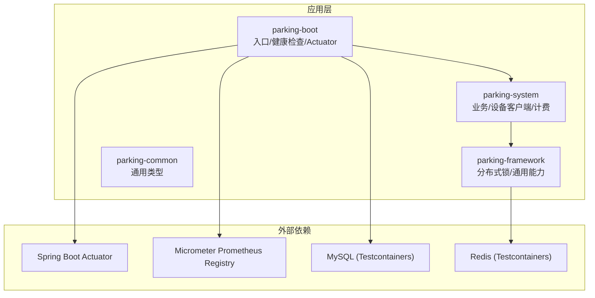
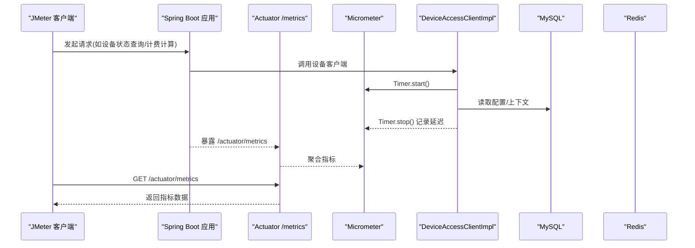
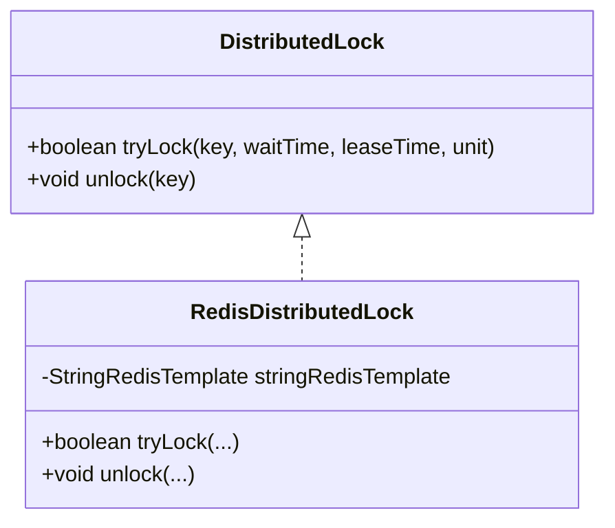
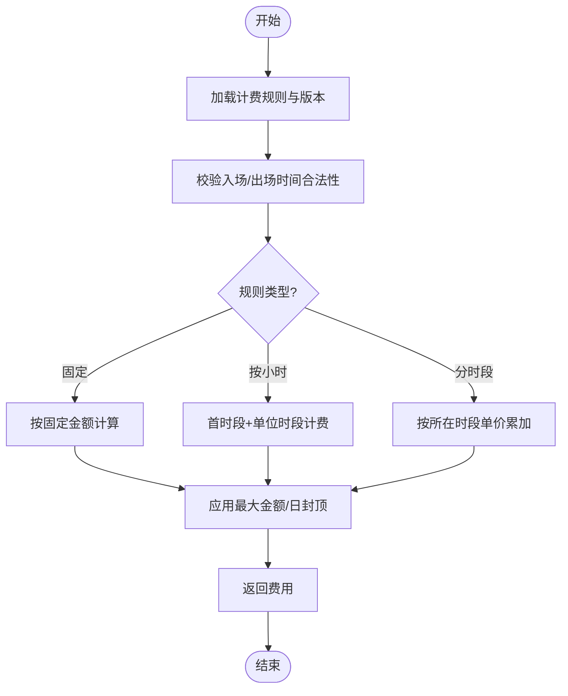
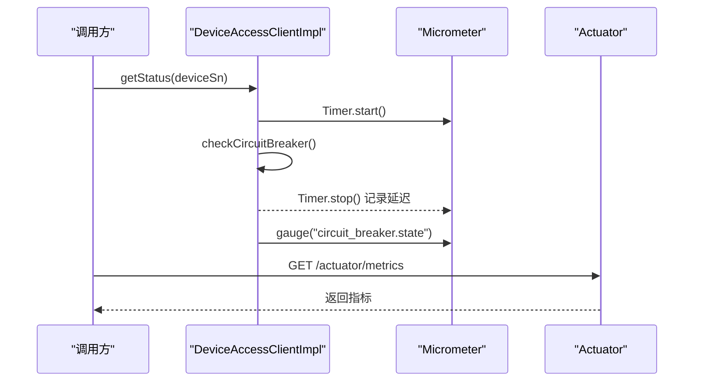
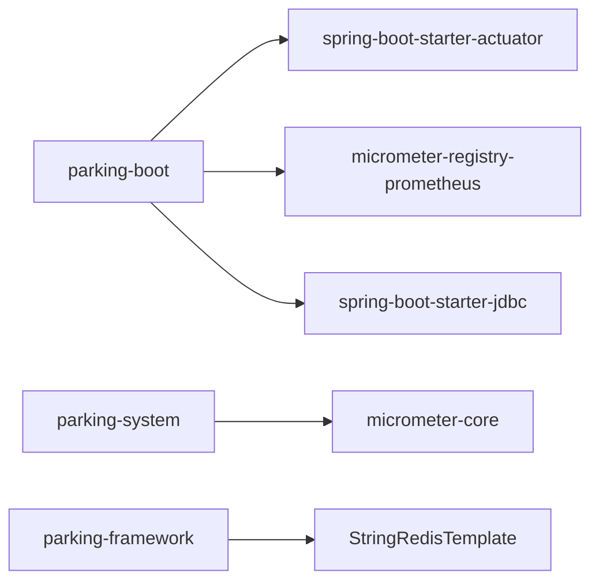

# 性能测试

<cite>
**本文引用的文件**
- [pom.xml](file://pom.xml)
- [parking-boot/pom.xml](file://parking-boot/pom.xml)
- [parking-system/pom.xml](file://parking-system/pom.xml)
- [ReadinessHealthIndicator.java](file://parking-boot/src/main/java/com/jushan/boot/health/ReadinessHealthIndicator.java)
- [DeviceAccessClientImpl.java](file://parking-system/src/main/java/com/jushan/system/client/DeviceAccessClientImpl.java)
- [DistributedLock.java](file://parking-framework/src/main/java/com/jushan/framework/lock/DistributedLock.java)
- [RedisDistributedLock.java](file://parking-framework/src/main/java/com/jushan/framework/lock/RedisDistributedLock.java)
- [RedisInfrastructureTest.java](file://parking-boot/src/test/java/com/jushan/boot/redis/RedisInfrastructureTest.java)
- [BillingEngineTest.java](file://parking-boot/src/test/java/com/jushan/boot/service/BillingEngineTest.java)
- [DeviceAccessClientRobustnessTest.java](file://parking-boot/src/test/java/com/jushan/boot/client/DeviceAccessClientRobustnessTest.java)
- [TestcontainersBaseTest.java](file://parking-boot/src/test/java/com/jushan/boot/test/TestcontainersBaseTest.java)
</cite>

## 目录
1. [引言](#引言)
2. [项目结构](#项目结构)
3. [核心组件](#核心组件)
4. [架构总览](#架构总览)
5. [详细组件分析](#详细组件分析)
6. [依赖分析](#依赖分析)
7. [性能考虑](#性能考虑)
8. [故障排查指南](#故障排查指南)
9. [结论](#结论)
10. [附录](#附录)

## 引言
本文件面向智慧停车 SaaS 平台的性能测试策略，聚焦以下目标：
- 基于 Spring Boot Actuator 与 Micrometer 的指标采集与暴露方案
- JMeter 并发场景设计（分布式锁、计费引擎高并发计算、数据库连接池压力）
- 基准测试设计与指标收集策略
- 内存泄漏检测与 CPU 分析方法
- 性能优化建议、瓶颈识别与结果分析方法
- 持续集成中的性能回归测试配置

## 项目结构
本项目为多模块 Maven 工程，包含 common、framework、system、boot 四个子模块。Actuator 与 Micrometer 在 boot 模块引入，System 模块使用 Micrometer Core 进行业务指标埋点；框架层提供分布式锁实现；测试层通过 Testcontainers 启动 MySQL/Redis 等基础设施以支撑集成与可靠性验证。

图表来源
- [pom.xml:1-217](file://pom.xml#L1-L217)
- [parking-boot/pom.xml:1-127](file://parking-boot/pom.xml#L1-L127)
- [parking-system/pom.xml:1-62](file://parking-system/pom.xml#L1-L62)

章节来源
- [pom.xml:1-217](file://pom.xml#L1-L217)
- [parking-boot/pom.xml:1-127](file://parking-boot/pom.xml#L1-L127)
- [parking-system/pom.xml:1-62](file://parking-system/pom.xml#L1-L62)

## 核心组件
- Actuator 与 Micrometer
  - 在 boot 模块引入 actuator 与 prometheus registry，用于健康检查与指标暴露
  - system 模块引入 micrometer-core，用于业务指标埋点
- 就绪探针
  - ReadinessHealthIndicator 检查数据库与 Redis 连通性，作为 K8s/Docker readiness probe
- 分布式锁
  - DistributedLock 接口 + RedisDistributedLock 实现，基于 Redis SET NX PX 原子命令
- 设备访问客户端
  - DeviceAccessClientImpl 中注册 Micrometer 指标（调用次数、错误数、延迟、熔断状态 Gauge）
- 计费引擎
  - BillingEngine 单元测试覆盖多种计费规则与时段逻辑，可作为高并发计算压测的核心路径

章节来源
- [parking-boot/pom.xml:41-51](file://parking-boot/pom.xml#L41-L51)
- [parking-system/pom.xml:41-45](file://parking-system/pom.xml#L41-L45)
- [ReadinessHealthIndicator.java:1-113](file://parking-boot/src/main/java/com/jushan/boot/health/ReadinessHealthIndicator.java#L1-L113)
- [DistributedLock.java:1-53](file://parking-framework/src/main/java/com/jushan/framework/lock/DistributedLock.java#L1-L53)
- [RedisDistributedLock.java:1-130](file://parking-framework/src/main/java/com/jushan/framework/lock/RedisDistributedLock.java#L1-L130)
- [DeviceAccessClientImpl.java:92-126](file://parking-system/src/main/java/com/jushan/system/client/DeviceAccessClientImpl.java#L92-L126)
- [BillingEngineTest.java:1-232](file://parking-boot/src/test/java/com/jushan/boot/service/BillingEngineTest.java#L1-L232)

## 架构总览
下图展示从 Actuator 到 Micrometer 的指标流，以及设备客户端的计时与熔断状态指标。

图表来源
- [DeviceAccessClientImpl.java:92-126](file://parking-system/src/main/java/com/jushan/system/client/DeviceAccessClientImpl.java#L92-L126)
- [parking-boot/pom.xml:41-51](file://parking-boot/pom.xml#L41-L51)

## 详细组件分析

### 分布式锁性能测试
- 目标
  - 验证在高并发下锁获取互斥性与超时自动释放行为
  - 评估锁竞争对吞吐与延迟的影响
- 关键实现
  - 接口：DistributedLock
  - 实现：RedisDistributedLock（SET NX PX + Lua 安全释放）
- 并发场景设计（JMeter）
  - 线程模型：固定并发数（如 50/100/200），循环 N 次，逐步提升并发
  - 采样点：tryLock/unlock 耗时、失败率、锁等待时间分布
  - 资源：Redis 实例独立或隔离，避免与其他压测干扰
- 指标收集
  - 应用侧：可通过 AOP 或自定义 Micrometer Timer 统计锁获取耗时
  - 系统侧：JVM GC、CPU、Redis 连接池活跃/空闲、网络 IO
- 验收标准
  - 无死锁、无误删锁
  - 锁超时自动释放后，其他线程可正常获取
  - 随着并发增加，P95/P99 延迟增长可控，错误率低于阈值

图表来源
- [DistributedLock.java:1-53](file://parking-framework/src/main/java/com/jushan/framework/lock/DistributedLock.java#L1-L53)
- [RedisDistributedLock.java:1-130](file://parking-framework/src/main/java/com/jushan/framework/lock/RedisDistributedLock.java#L1-L130)

章节来源
- [RedisInfrastructureTest.java:99-144](file://parking-boot/src/test/java/com/jushan/boot/redis/RedisInfrastructureTest.java#L99-L144)
- [RedisDistributedLock.java:1-130](file://parking-framework/src/main/java/com/jushan/framework/lock/RedisDistributedLock.java#L1-L130)

### 计费引擎高并发计算测试
- 目标
  - 验证计费引擎在不同计费规则与时段下的正确性与性能
  - 评估 CPU 密集计算在高并发下的吞吐与延迟
- 关键实现
  - 计费引擎单元测试覆盖多种规则（固定、按小时、分时段、封顶等）
- 并发场景设计（JMeter）
  - 线程模型：模拟大量出场结算请求，参数化入场/出场时间与规则 ID
  - 采样点：calculateFee 耗时、异常率、规则命中率
  - 资源：CPU 密集型，关注 JVM CPU 使用率、GC 频率
- 指标收集
  - 应用侧：对计费方法埋点 Timer，输出 P50/P95/P99 延迟
  - 系统侧：CPU、上下文切换、GC 暂停时间
- 验收标准
  - 计算结果与单测一致
  - 高并发下延迟稳定，错误率为零

图表来源
- [BillingEngineTest.java:1-232](file://parking-boot/src/test/java/com/jushan/boot/service/BillingEngineTest.java#L1-L232)

章节来源
- [BillingEngineTest.java:1-232](file://parking-boot/src/test/java/com/jushan/boot/service/BillingEngineTest.java#L1-L232)

### 数据库连接池压力测试
- 目标
  - 评估 HikariCP 在高并发 SQL 执行下的吞吐、延迟与稳定性
- 关键实现
  - boot 模块引入 spring-boot-starter-jdbc，默认使用 HikariCP
  - Testcontainers 提供 MySQL 容器，便于本地与 CI 环境一致性
- 并发场景设计（JMeter）
  - 线程模型：固定并发 + 递增并发，循环执行典型读写 SQL
  - 采样点：SQL 响应时间、连接池活跃/等待/泄露告警
  - 资源：MySQL 与 JDBC 连接池独立监控
- 指标收集
  - 应用侧：HikariPool 指标（Active、Idle、Pending、Leaked）
  - 系统侧：MySQL QPS、InnoDB 缓冲池命中率、磁盘 IO
- 验收标准
  - 无连接泄露，等待队列不持续增长
  - P95/P99 延迟随并发线性增长且可控

章节来源
- [parking-boot/pom.xml:53-64](file://parking-boot/pom.xml#L53-L64)
- [TestcontainersBaseTest.java:1-49](file://parking-boot/src/test/java/com/jushan/boot/test/TestcontainersBaseTest.java#L1-L49)

### 设备访问客户端指标埋点
- 目标
  - 观测设备访问调用的成功率、错误分类、延迟分布与熔断状态
- 关键实现
  - initMetrics 注册 Gauge（熔断状态）
  - 调用前后使用 Timer 记录延迟
- 指标说明
  - calls.total/calls.errors：按 method、status/error_type 标签
  - latency：按 method 标签
  - circuit_breaker.state：0=关闭，1=打开
- 指标采集
  - 通过 Actuator /actuator/metrics 暴露，Prometheus 抓取

图表来源
- [DeviceAccessClientImpl.java:92-126](file://parking-system/src/main/java/com/jushan/system/client/DeviceAccessClientImpl.java#L92-L126)

章节来源
- [DeviceAccessClientImpl.java:92-126](file://parking-system/src/main/java/com/jushan/system/client/DeviceAccessClientImpl.java#L92-L126)
- [DeviceAccessClientRobustnessTest.java:393-415](file://parking-boot/src/test/java/com/jushan/boot/client/DeviceAccessClientRobustnessTest.java#L393-L415)

## 依赖分析
- Actuator 与 Micrometer
  - boot 模块引入 actuator 与 prometheus registry
  - system 模块引入 micrometer-core
- 数据库与连接池
  - jdbc starter 引入 HikariCP
  - Testcontainers 提供 MySQL 容器
- Redis 与分布式锁
  - RedisDistributedLock 基于 StringRedisTemplate
  - 测试中使用 Redis 容器

图表来源
- [parking-boot/pom.xml:41-64](file://parking-boot/pom.xml#L41-L64)
- [parking-system/pom.xml:41-52](file://parking-system/pom.xml#L41-L52)

章节来源
- [parking-boot/pom.xml:41-64](file://parking-boot/pom.xml#L41-L64)
- [parking-system/pom.xml:41-52](file://parking-system/pom.xml#L41-L52)

## 性能考虑
- 指标采集
  - 启用 Actuator 端点并限制暴露范围，仅在生产开启必要指标
  - 使用 Micrometer Timer/Gauge/Counter 对热点路径埋点
- 连接池
  - 合理设置 HikariCP 最大连接数与超时，避免连接饥饿
- 缓存与锁
  - 分布式锁尽量缩短持有时间，避免长事务
  - 热点数据优先走缓存，降低数据库压力
- 压测环境
  - 使用 Testcontainers 保证环境一致性
  - 隔离外部依赖（Redis/MySQL）以避免相互影响

[本节为通用指导，无需源码引用]

## 故障排查指南
- 就绪探针
  - ReadinessHealthIndicator 检查数据库与 Redis 连通性，结合日志定位问题
- 指标断言
  - 设备客户端 Robustness 测试验证 Gauge 与 Timer 指标存在与初始值
- 分布式锁
  - 并发互斥与超时自动释放用例已覆盖，若出现异常需检查 Redis 可用性与脚本执行结果

章节来源
- [ReadinessHealthIndicator.java:1-113](file://parking-boot/src/main/java/com/jushan/boot/health/ReadinessHealthIndicator.java#L1-L113)
- [DeviceAccessClientRobustnessTest.java:393-415](file://parking-boot/src/test/java/com/jushan/boot/client/DeviceAccessClientRobustnessTest.java#L393-L415)
- [RedisInfrastructureTest.java:99-144](file://parking-boot/src/test/java/com/jushan/boot/redis/RedisInfrastructureTest.java#L99-L144)

## 结论
- 项目已具备 Actuator/Micrometer 基础能力，可在热点路径补充埋点
- 分布式锁与计费引擎已有完善单测与集成测试，适合扩展为性能回归基线
- 建议在 CI 中引入轻量级性能回归（短时长、低并发）与关键指标阈值断言

[本节为总结，无需源码引用]

## 附录

### JMeter 与 Actuator 指标对接建议
- 在压测前通过 /actuator/metrics 拉取基线指标
- 压测过程中周期性抓取指标，对比 P50/P95/P99、错误率、连接池状态
- 将关键指标导出至时序数据库（如 Prometheus）以便趋势分析

[本节为概念性内容，无需源码引用]

### 内存泄漏检测与 CPU 分析工具
- 内存泄漏检测
  - 使用 jmap 生成堆转储，配合 MAT/JProfiler 分析大对象与未释放引用
  - 在压测后定期采集堆快照，观察对象数量与占用变化
- CPU 分析
  - 使用 jstack 抓取线程栈，定位热点方法与阻塞点
  - 使用 async-profiler 或 JFR 生成火焰图，识别 CPU 热点路径
- 结合应用指标
  - 将 GC 停顿、线程池排队、锁等待等指标与火焰图关联定位根因

[本节为通用指导，无需源码引用]

### 持续集成中的性能回归测试配置
- 触发条件
  - 合并到主干分支或发布候选时触发
- 执行步骤
  - 启动 Testcontainers（MySQL/Redis）
  - 运行轻量级 JMeter 计划（短时长、低并发）
  - 拉取 /actuator/metrics 关键指标并与基线比较
  - 若超过阈值则标记构建失败
- 报告与归档
  - 保存指标 CSV/JSON 与 JMeter 结果，便于回溯

[本节为概念性内容，无需源码引用]