# 测试策略

<cite>
**本文引用的文件**
- [README.md](file://README.md)
- [pom.xml](file://parking-boot/pom.xml)
- [TestcontainersBaseTest.java](file://parking-boot/src/test/java/com/jushan/boot/test/TestcontainersBaseTest.java)
- [RabbitMqTestBase.java](file://parking-boot/src/test/java/com/jushan/boot/mq/RabbitMqTestBase.java)
- [ParkingApplicationTests.java](file://parking-boot/src/test/java/com/jushan/boot/ParkingApplicationTests.java)
- [DeviceAccessClientTest.java](file://parking-boot/src/test/java/com/jushan/boot/client/DeviceAccessClientTest.java)
- [AuthControllerIntegrationTest.java](file://parking-boot/src/test/java/com/jushan/boot/controller/AuthControllerIntegrationTest.java)
- [RolePermissionIntegrationTest.java](file://parking-boot/src/test/java/com/jushan/boot/controller/RolePermissionIntegrationTest.java)
- [BillingEngineTest.java](file://parking-boot/src/test/java/com/jushan/boot/service/BillingEngineTest.java)
- [EntryServiceTest.java](file://parking-boot/src/test/java/com/jushan/boot/event/EntryServiceTest.java)
- [ExitFlowIntegrationTest.java](file://parking-boot/src/test/java/com/jushan/boot/service/ExitFlowIntegrationTest.java)
- [RedisInfrastructureTest.java](file://parking-boot/src/test/java/com/jushan/boot/redis/RedisInfrastructureTest.java)
- [WebSocketInfrastructureTest.java](file://parking-boot/src/test/java/com/jushan/boot/ws/WebSocketInfrastructureTest.java)
- [MockRecognitionIntegrationTest.java](file://parking-boot/src/test/java/com/jushan/boot/controller/MockRecognitionIntegrationTest.java)
</cite>

## 目录
1. [引言](#引言)
2. [项目结构](#项目结构)
3. [核心组件](#核心组件)
4. [架构总览](#架构总览)
5. [详细组件分析](#详细组件分析)
6. [依赖分析](#依赖分析)
7. [性能考虑](#性能考虑)
8. [故障排查指南](#故障排查指南)
9. [结论](#结论)
10. [附录](#附录)

## 引言
本测试策略面向智慧停车 SaaS 平台，覆盖单元测试、集成测试与端到端测试的框架配置、执行策略、Mock 对象使用、测试数据准备、测试环境搭建、关键业务场景（计费引擎、权限控制、并发处理）、API 接口测试、数据库集成测试、外部服务模拟、性能与压力测试方案、结果分析方法、覆盖率要求以及持续集成与质量门禁。

## 项目结构
仓库采用多模块 Maven 工程，后端以 Spring Boot 3 为核心，测试集中在 parking-boot 模块的 test 源码集。测试基础设施通过 Testcontainers 提供 MySQL、RabbitMQ、Redis 等容器化依赖；对外部 HTTP 服务使用 WireMock 进行模拟；认证鉴权基于 Sa-Token；消息中间件用于识别事件消费链路。

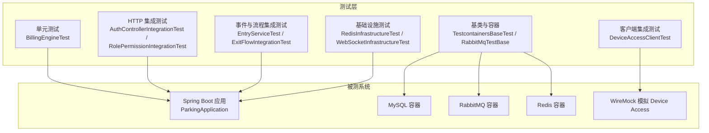

图表来源
- [TestcontainersBaseTest.java:1-50](file://parking-boot/src/test/java/com/jushan/boot/test/TestcontainersBaseTest.java#L1-L50)
- [RabbitMqTestBase.java:1-51](file://parking-boot/src/test/java/com/jushan/boot/mq/RabbitMqTestBase.java#L1-L51)
- [DeviceAccessClientTest.java:1-283](file://parking-boot/src/test/java/com/jushan/boot/client/DeviceAccessClientTest.java#L1-L283)

章节来源
- [README.md:1-77](file://README.md#L1-L77)
- [pom.xml:77-126](file://parking-boot/pom.xml#L77-L126)

## 核心组件
- 测试基类与环境
  - TestcontainersBaseTest：提供共享 MySQL 容器与 test profile，所有需要数据库的集成测试可继承复用。
  - RabbitMqTestBase：在 TestcontainersBaseTest 基础上增加 RabbitMQ 与 Redis 容器，并启用平台内部 MQ 配置。
- 单元测试
  - BillingEngineTest：对计费引擎进行纯逻辑验证，使用 Mockito 隔离持久层。
- 集成测试
  - AuthControllerIntegrationTest：登录、会话、退出、强制改密、未授权拦截等。
  - RolePermissionIntegrationTest：固定角色模型与权限校验，覆盖注解与编程式权限判断。
  - DeviceAccessClientTest：使用 WireMock 模拟 Device Access v0.2，覆盖成功、错误码、超时、解析失败、占位异常等。
  - EntryServiceTest：入场事件从 Mock API → MQ → Consumer → 数据库落库与容量一致性，含重复与并发保护。
  - ExitFlowIntegrationTest：出场流程完整链路，匹配记录、计费、订单与放行决策。
  - RedisInfrastructureTest：Redis 连通性、Key 前缀隔离、分布式锁互斥与超时释放。
  - WebSocketInfrastructureTest：STOMP over WebSocket 认证连接、匿名拒绝、订阅公共 topic、SockJS 降级。
  - MockRecognitionIntegrationTest：Mock 识别事件控制器参数校验、设备与方向校验、事件来源标记。
- 最小上下文加载
  - ParkingApplicationTests：验证 Spring 容器正常启动与依赖方向正确。

章节来源
- [TestcontainersBaseTest.java:1-50](file://parking-boot/src/test/java/com/jushan/boot/test/TestcontainersBaseTest.java#L1-L50)
- [RabbitMqTestBase.java:1-51](file://parking-boot/src/test/java/com/jushan/boot/mq/RabbitMqTestBase.java#L1-L51)
- [BillingEngineTest.java:1-262](file://parking-boot/src/test/java/com/jushan/boot/service/BillingEngineTest.java#L1-L262)
- [AuthControllerIntegrationTest.java:1-386](file://parking-boot/src/test/java/com/jushan/boot/controller/AuthControllerIntegrationTest.java#L1-L386)
- [RolePermissionIntegrationTest.java:1-586](file://parking-boot/src/test/java/com/jushan/boot/controller/RolePermissionIntegrationTest.java#L1-L586)
- [DeviceAccessClientTest.java:1-283](file://parking-boot/src/test/java/com/jushan/boot/client/DeviceAccessClientTest.java#L1-L283)
- [EntryServiceTest.java:1-751](file://parking-boot/src/test/java/com/jushan/boot/event/EntryServiceTest.java#L1-L751)
- [ExitFlowIntegrationTest.java:1-298](file://parking-boot/src/test/java/com/jushan/boot/service/ExitFlowIntegrationTest.java#L1-L298)
- [RedisInfrastructureTest.java:1-145](file://parking-boot/src/test/java/com/jushan/boot/redis/RedisInfrastructureTest.java#L1-L145)
- [WebSocketInfrastructureTest.java:1-196](file://parking-boot/src/test/java/com/jushan/boot/ws/WebSocketInfrastructureTest.java#L1-L196)
- [MockRecognitionIntegrationTest.java:1-412](file://parking-boot/src/test/java/com/jushan/boot/controller/MockRecognitionIntegrationTest.java#L1-L412)
- [ParkingApplicationTests.java:1-21](file://parking-boot/src/test/java/com/jushan/boot/ParkingApplicationTests.java#L1-L21)

## 架构总览
下图展示测试层与被测系统的交互关系，包括容器化基础设施与外部服务模拟。

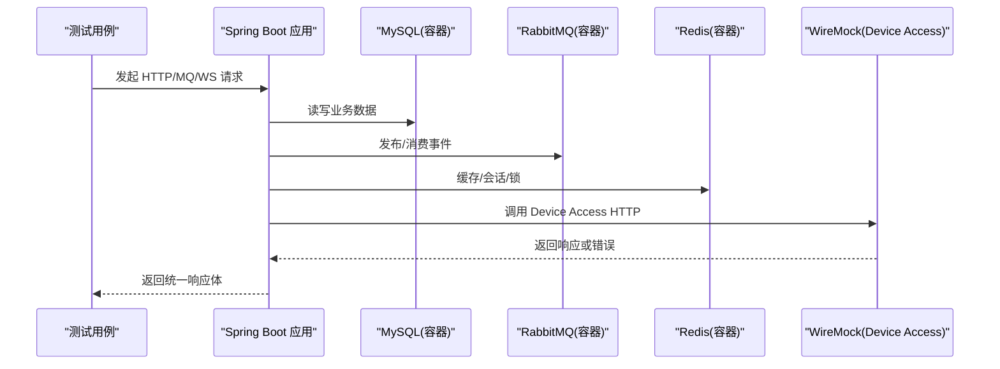

图表来源
- [DeviceAccessClientTest.java:1-283](file://parking-boot/src/test/java/com/jushan/boot/client/DeviceAccessClientTest.java#L1-L283)
- [EntryServiceTest.java:1-751](file://parking-boot/src/test/java/com/jushan/boot/event/EntryServiceTest.java#L1-L751)
- [WebSocketInfrastructureTest.java:1-196](file://parking-boot/src/test/java/com/jushan/boot/ws/WebSocketInfrastructureTest.java#L1-L196)

## 详细组件分析

### 单元测试：计费引擎
- 目标：验证计费规则计算逻辑（免费、固定、按时长、分时段、封顶、跨天单日封顶、冲突校验、时间合法性）。
- 设计要点：
  - 使用 Mockito 隔离 Mapper 依赖，构造不同规则版本与时间段。
  - 断言费用计算结果与异常信息。
- 复杂度与优化：
  - 时间分段计算涉及区间划分与向上取整，建议保持 O(n) 分段遍历，必要时引入有序区间索引提升性能。
- 错误处理：
  - 无生效规则、分时段冲突、出场早于入场等路径抛出明确业务异常。

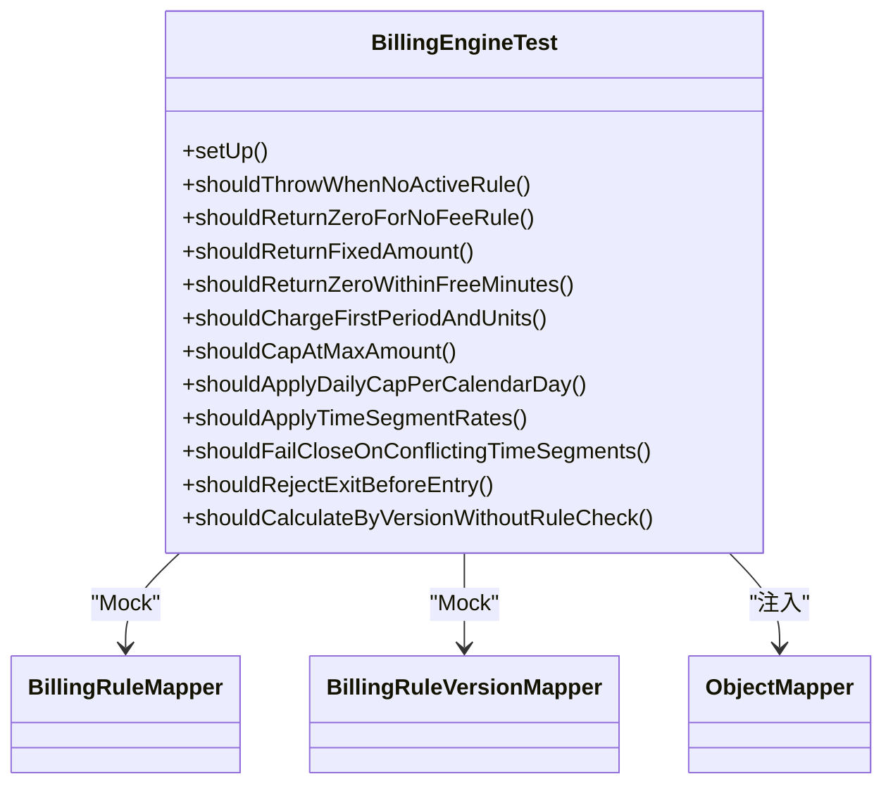

图表来源
- [BillingEngineTest.java:1-262](file://parking-boot/src/test/java/com/jushan/boot/service/BillingEngineTest.java#L1-L262)

章节来源
- [BillingEngineTest.java:1-262](file://parking-boot/src/test/java/com/jushan/boot/service/BillingEngineTest.java#L1-L262)

### 集成测试：认证与会话
- 目标：验证登录、密码错误、禁用账号、退出、会话查询、未登录拦截、伪造 Token、强制修改密码与旧 Token 失效。
- 设计要点：
  - 使用 MockMvc 发送 HTTP 请求，结合数据库断言登录日志与用户状态。
  - 使用 Redis 容器承载会话存储（Sa-Token）。
- 安全与合规：
  - 错误密码不泄露用户存在性；登录接口在未登录时返回 401 而非重定向。

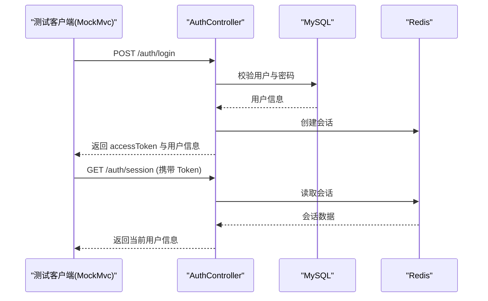

图表来源
- [AuthControllerIntegrationTest.java:1-386](file://parking-boot/src/test/java/com/jushan/boot/controller/AuthControllerIntegrationTest.java#L1-L386)

章节来源
- [AuthControllerIntegrationTest.java:1-386](file://parking-boot/src/test/java/com/jushan/boot/controller/AuthControllerIntegrationTest.java#L1-L386)

### 集成测试：权限控制
- 目标：验证固定角色模型的权限数据加载、注解与编程式权限判断、各角色访问矩阵。
- 设计要点：
  - 为每个角色创建测试用户，登录后分别访问允许与拒绝端点，断言 HTTP 状态与响应体。
  - 覆盖 @SaCheckRole 与 hasPermission 编程式检查。

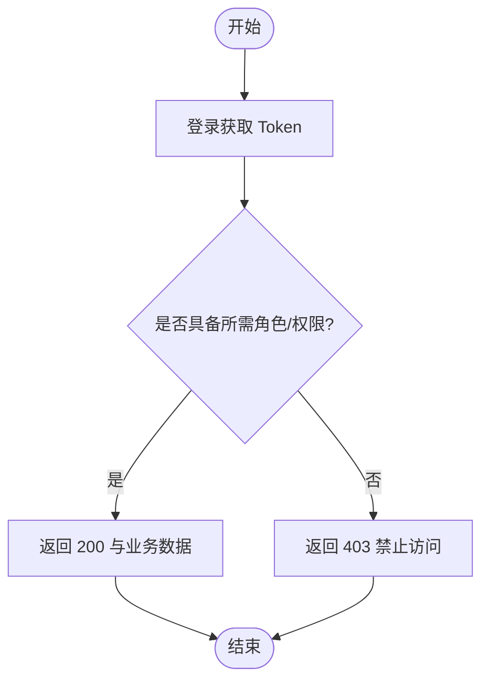

图表来源
- [RolePermissionIntegrationTest.java:1-586](file://parking-boot/src/test/java/com/jushan/boot/controller/RolePermissionIntegrationTest.java#L1-L586)

章节来源
- [RolePermissionIntegrationTest.java:1-586](file://parking-boot/src/test/java/com/jushan/boot/controller/RolePermissionIntegrationTest.java#L1-L586)

### 集成测试：外部服务模拟（Device Access）
- 目标：验证 Device Access HTTP Client 的成功、错误码、超时、解析失败、占位异常等。
- 设计要点：
  - 使用 WireMock 动态端口注册期望映射，设置延迟模拟超时。
  - 短超时配置快速触发超时分支。
  - 断言 BusinessException 包含特定语义（如 UNCERTAIN）。

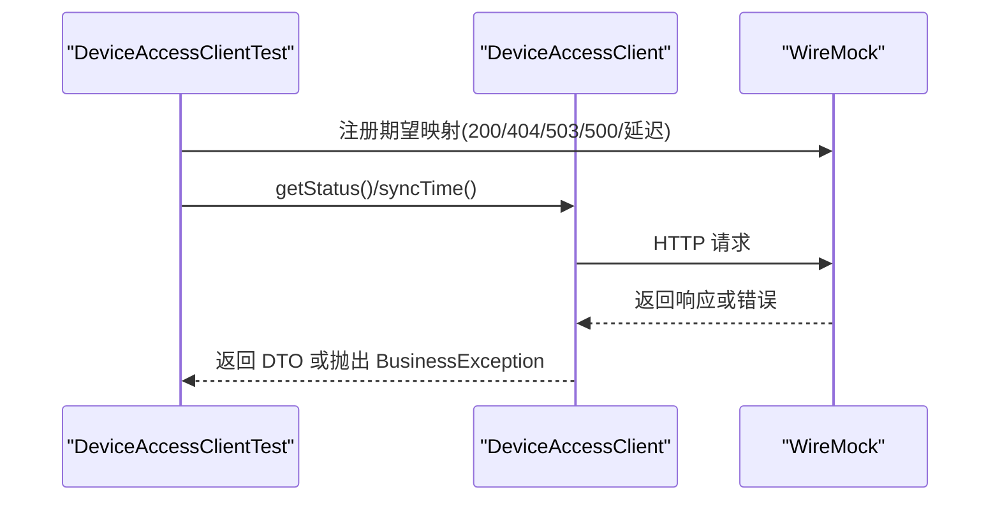

图表来源
- [DeviceAccessClientTest.java:1-283](file://parking-boot/src/test/java/com/jushan/boot/client/DeviceAccessClientTest.java#L1-L283)

章节来源
- [DeviceAccessClientTest.java:1-283](file://parking-boot/src/test/java/com/jushan/boot/client/DeviceAccessClientTest.java#L1-L283)

### 集成测试：入场流程与并发保护
- 目标：验证入口事件 → 消费者 → 停车记录创建与容量更新；重复入场拒绝；并发入场仅产生一条记录；容量一致性；停车场停用策略；出口事件不创建记录。
- 设计要点：
  - 使用 Mock API 触发识别事件，持久化到数据库并通过 MQ 异步消费。
  - 使用功能唯一索引保证幂等与并发安全。
  - 使用 Awaitility 等待异步处理完成后再断言。
  - 并发场景使用线程池同时触发，验证最终一致性。

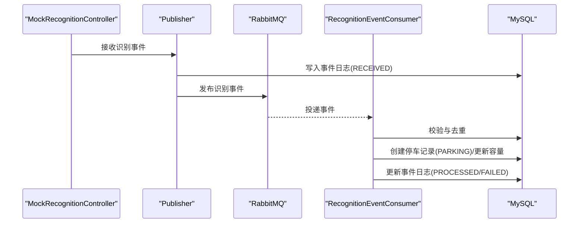

图表来源
- [EntryServiceTest.java:1-751](file://parking-boot/src/test/java/com/jushan/boot/event/EntryServiceTest.java#L1-L751)
- [MockRecognitionIntegrationTest.java:1-412](file://parking-boot/src/test/java/com/jushan/boot/controller/MockRecognitionIntegrationTest.java#L1-L412)

章节来源
- [EntryServiceTest.java:1-751](file://parking-boot/src/test/java/com/jushan/boot/event/EntryServiceTest.java#L1-L751)
- [MockRecognitionIntegrationTest.java:1-412](file://parking-boot/src/test/java/com/jushan/boot/controller/MockRecognitionIntegrationTest.java#L1-L412)

### 集成测试：出场流程
- 目标：验证出场识别事件匹配在场记录、计费引擎计算、生成订单、出场记录与放行决策。
- 设计要点：
  - 预置 NO_FEE 与 HOURLY 两种规则，断言零元放行与待支付不放行。
  - 断言停车记录状态、订单金额与状态、出场记录决策码。
  - 断言停车场容量变化。

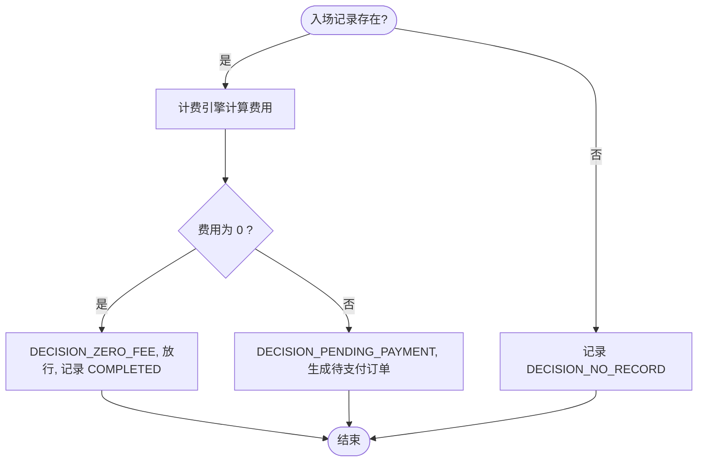

图表来源
- [ExitFlowIntegrationTest.java:1-298](file://parking-boot/src/test/java/com/jushan/boot/service/ExitFlowIntegrationTest.java#L1-L298)

章节来源
- [ExitFlowIntegrationTest.java:1-298](file://parking-boot/src/test/java/com/jushan/boot/service/ExitFlowIntegrationTest.java#L1-L298)

### 基础设施测试：Redis 与分布式锁
- 目标：验证 Redis 连通性、基本读写、Key 前缀隔离、分布式锁获取/释放、并发互斥与超时自动释放。
- 设计要点：
  - 使用 StringRedisTemplate 进行基础操作。
  - 使用 DistributedLock 接口进行锁行为验证。

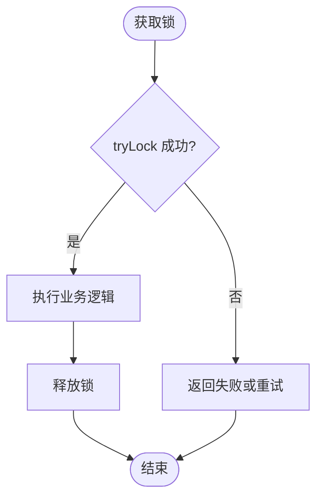

图表来源
- [RedisInfrastructureTest.java:1-145](file://parking-boot/src/test/java/com/jushan/boot/redis/RedisInfrastructureTest.java#L1-L145)

章节来源
- [RedisInfrastructureTest.java:1-145](file://parking-boot/src/test/java/com/jushan/boot/redis/RedisInfrastructureTest.java#L1-L145)

### 基础设施测试：WebSocket 认证与订阅
- 目标：验证 STOMP over WebSocket 认证后连接、匿名连接拒绝、订阅公共 topic、SockJS 降级支持。
- 设计要点：
  - 先通过 HTTP 登录获取 token，再建立 WS 连接。
  - 断言匿名连接被拒绝，认证后可订阅 /topic/health。

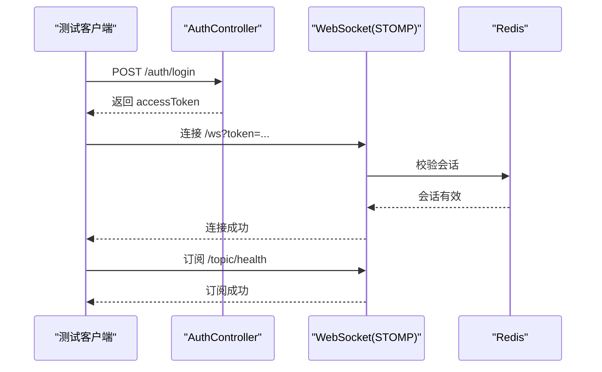

图表来源
- [WebSocketInfrastructureTest.java:1-196](file://parking-boot/src/test/java/com/jushan/boot/ws/WebSocketInfrastructureTest.java#L1-L196)

章节来源
- [WebSocketInfrastructureTest.java:1-196](file://parking-boot/src/test/java/com/jushan/boot/ws/WebSocketInfrastructureTest.java#L1-L196)

### 最小上下文加载测试
- 目标：确保 Spring 容器正常启动，模块依赖方向正确。
- 设计要点：
  - 继承 TestcontainersBaseTest，使用完整上下文与 MySQL 容器。

章节来源
- [ParkingApplicationTests.java:1-21](file://parking-boot/src/test/java/com/jushan/boot/ParkingApplicationTests.java#L1-L21)

## 依赖分析
- 测试依赖
  - WireMock：用于 Device Access HTTP 模拟。
  - Testcontainers：MySQL、RabbitMQ、Redis 容器化依赖。
  - JUnit Jupiter、AssertJ、Awaitility：测试框架与断言工具。
- 运行期依赖
  - Spring Boot 3、MyBatis-Plus、Sa-Token、RabbitMQ、Redis、WebSocket。

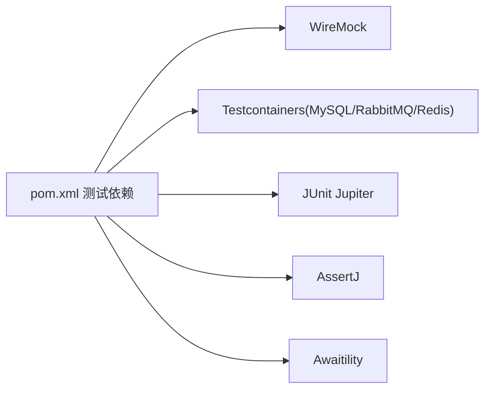

图表来源
- [pom.xml:77-126](file://parking-boot/pom.xml#L77-L126)

章节来源
- [pom.xml:77-126](file://parking-boot/pom.xml#L77-L126)

## 性能考虑
- 测试性能基线
  - 参考契约文档中的性能建议：100 设备在线、每秒 100 条识别事件持续 10 分钟、事件重复率 10%、RabbitMQ 暂停恢复、命令 P95 受理时间小于 500ms、识别事件到平台 P95 小于 2 秒。
- 压测工具与方法
  - 使用 JMeter 或 Gatling 构建并发场景，模拟识别事件批量入队与消费。
  - 针对计费引擎与出场流程进行 CPU 密集路径压测，关注 JVM GC 与慢 SQL。
- 结果分析方法
  - 收集吞吐、延迟分布（P50/P90/P95/P99）、错误率、资源利用率（CPU/内存/IO/网络）。
  - 结合数据库与 MQ 监控指标（队列积压、消费速率、死信队列）。
  - 定位热点方法，评估是否需要引入缓存、批处理或分片。

章节来源
- [README.md:1-77](file://README.md#L1-L77)

## 故障排查指南
- 常见失败原因
  - 容器未就绪：确认 Docker 可用，Testcontainers 镜像拉取成功。
  - 端口冲突：WireMock 动态端口与本地服务端口冲突。
  - 消息堆积：消费者处理缓慢导致队列积压，需检查业务逻辑与数据库锁竞争。
  - 权限问题：Token 过期或权限不足导致 401/403。
- 调试技巧
  - 开启详细日志与 traceId，结合全局异常处理器输出堆栈。
  - 使用 Mock API 与 MQ 管理界面观察消息流转。
  - 对计费引擎与并发场景添加断点与计数器，定位竞态条件。

章节来源
- [AuthControllerIntegrationTest.java:1-386](file://parking-boot/src/test/java/com/jushan/boot/controller/AuthControllerIntegrationTest.java#L1-L386)
- [EntryServiceTest.java:1-751](file://parking-boot/src/test/java/com/jushan/boot/event/EntryServiceTest.java#L1-L751)

## 结论
本测试策略围绕“单元—集成—端到端”三层展开，借助 Testcontainers 与 WireMock 实现稳定可靠的测试环境与外部依赖隔离。通过覆盖认证鉴权、权限控制、计费引擎、入场/出场流程、并发与幂等、基础设施连通性等关键场景，形成闭环的质量保障体系。后续建议补充覆盖率阈值与 CI 门禁，完善性能基准与回归策略，持续提升交付质量。

## 附录
- 测试环境搭建
  - 安装 Docker，确保镜像可拉取。
  - 使用 mvn test 执行测试，Testcontainers 会自动启动所需容器。
- 覆盖率要求
  - 建议设定行覆盖率 ≥ 80%，分支覆盖率 ≥ 70%，关键域（计费、权限、事件）≥ 90%。
- 持续集成与质量门禁
  - 在 CI 流水线中执行单元测试与集成测试，失败则阻断合并。
  - 上传覆盖率报告，低于阈值则标记质量门禁失败。
  - 定期执行性能回归，对比基线指标，超阈告警。