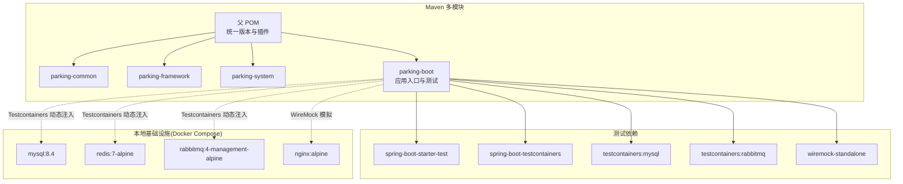
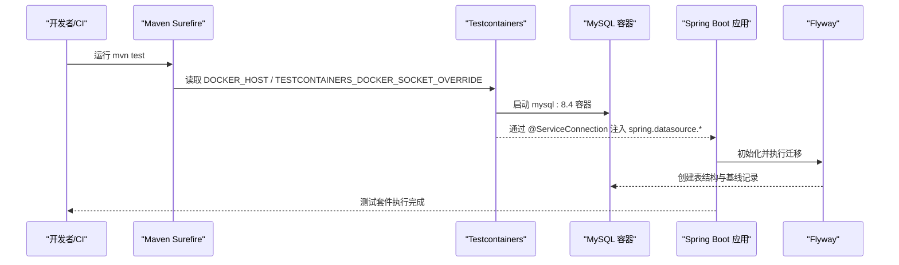
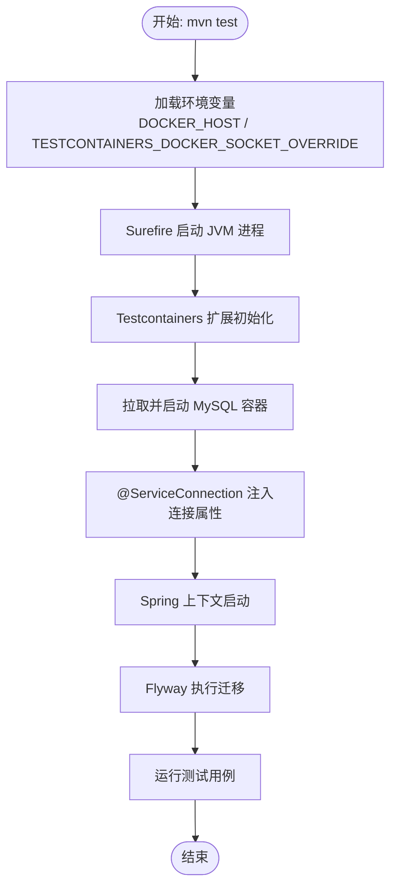
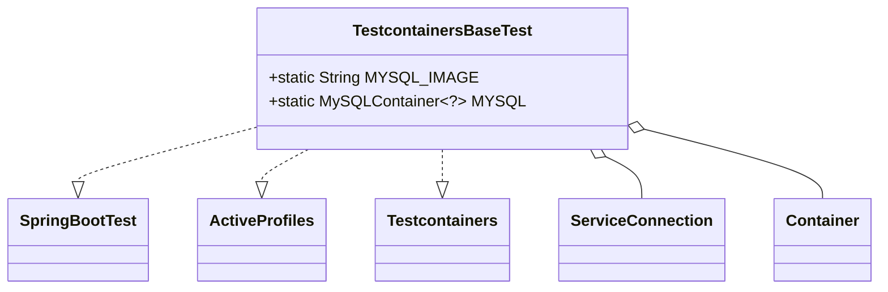
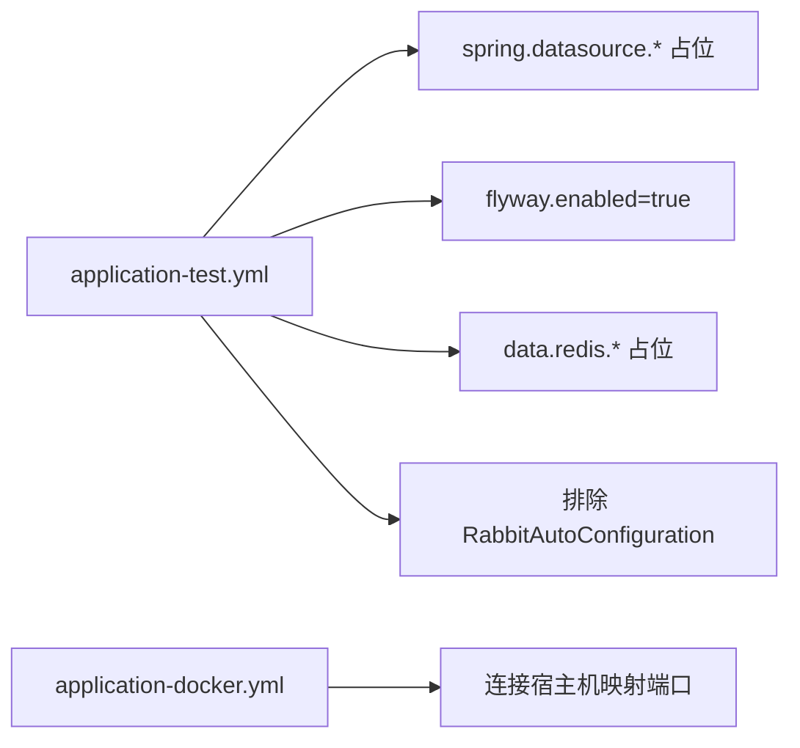
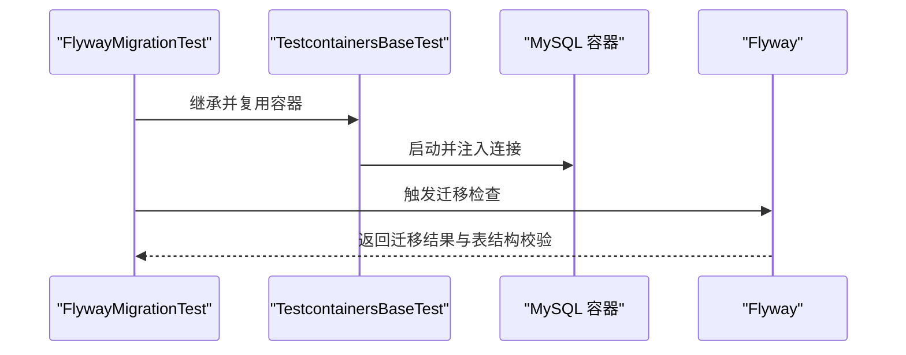
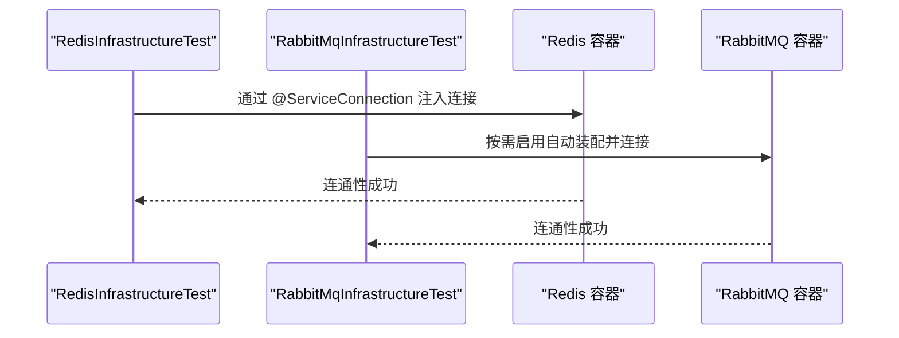
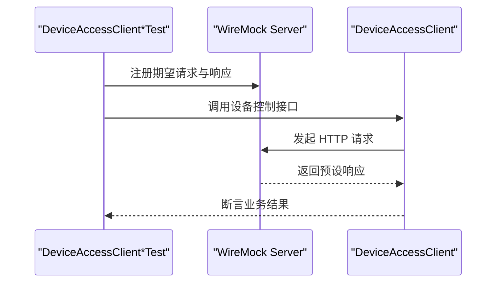
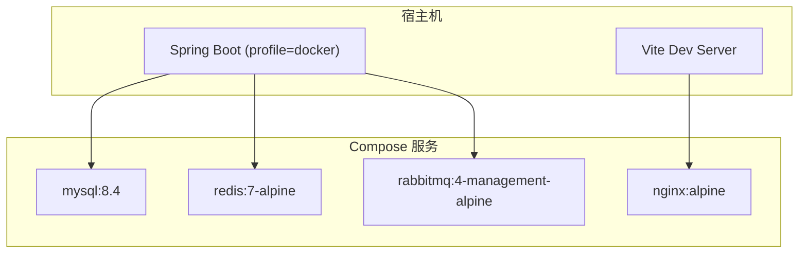
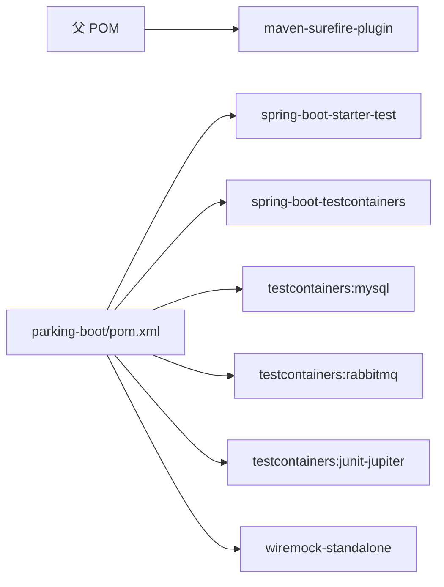

# 测试自动化

<cite>
**本文引用的文件**
- [pom.xml](file://pom.xml)
- [parking-boot/pom.xml](file://parking-boot/pom.xml)
- [docker-compose.yml](file://docker-compose.yml)
- [application-test.yml](file://parking-boot/src/main/resources/application-test.yml)
- [application-docker.yml](file://parking-boot/src/main/resources/application-docker.yml)
- [TestcontainersBaseTest.java](file://parking-boot/src/test/java/com/jushan/boot/test/TestcontainersBaseTest.java)
- [FlywayMigrationTest.java](file://parking-boot/src/test/java/com/jushan/boot/migration/FlywayMigrationTest.java)
- [RabbitMqInfrastructureTest.java](file://parking-boot/src/test/java/com/jushan/boot/mq/RabbitMqInfrastructureTest.java)
- [RedisInfrastructureTest.java](file://parking-boot/src/test/java/com/jushan/boot/redis/RedisInfrastructureTest.java)
- [DeviceAccessClientRobustnessTest.java](file://parking-boot/src/test/java/com/jushan/boot/client/DeviceAccessClientRobustnessTest.java)
- [DeviceAccessClientTest.java](file://parking-boot/src/test/java/com/jushan/boot/client/DeviceAccessClientTest.java)
</cite>

## 目录
1. [简介](#简介)
2. [项目结构](#项目结构)
3. [核心组件](#核心组件)
4. [架构总览](#架构总览)
5. [详细组件分析](#详细组件分析)
6. [依赖分析](#依赖分析)
7. [性能考虑](#性能考虑)
8. [故障排查指南](#故障排查指南)
9. [结论](#结论)
10. [附录](#附录)

## 简介
本文件面向“测试自动化”目标，系统化说明：
- Maven 测试插件配置与执行流程
- Testcontainers 在测试环境中的应用（MySQL、Redis、RabbitMQ）
- Docker Compose 在本地开发/集成测试中的基础设施编排
- CI/CD 流水线建议（GitHub Actions/Jenkins），包括自动触发、报告生成与质量门禁
- 测试数据管理策略、环境隔离与并行执行方案
- 覆盖率报告集成与失败告警机制

## 项目结构
仓库采用多模块 Maven 工程。测试相关能力集中在 parking-boot 模块的 test 源码集，并通过父 POM 统一构建与插件配置。Docker Compose 提供本地开发所需的基础设施（MySQL、Redis、RabbitMQ、Nginx）。

图表来源
- [pom.xml:1-216](file://pom.xml#L1-L216)
- [parking-boot/pom.xml:1-127](file://parking-boot/pom.xml#L1-L127)
- [docker-compose.yml:1-167](file://docker-compose.yml#L1-L167)

章节来源
- [pom.xml:1-216](file://pom.xml#L1-L216)
- [parking-boot/pom.xml:1-127](file://parking-boot/pom.xml#L1-L127)
- [docker-compose.yml:1-167](file://docker-compose.yml#L1-L167)

## 核心组件
- Maven Surefire 插件：负责单元测试与集成测试的执行，并传递 Testcontainers 所需的 Docker 环境变量。
- Spring Boot Testcontainers 集成：通过 @ServiceConnection 将容器连接信息自动注入到 Spring 上下文。
- 测试配置文件 application-test.yml：为测试环境提供默认数据源、Redis、禁用 RabbitMQ 等配置。
- 基础测试类 TestcontainersBaseTest：封装 MySQL 容器的生命周期管理与属性注入。
- 专项测试：Flyway 迁移验证、Redis 连通性、RabbitMQ 连通性、Device Access 客户端健壮性与 Mock 测试。

章节来源
- [pom.xml:201-211](file://pom.xml#L201-L211)
- [application-test.yml:1-80](file://parking-boot/src/main/resources/application-test.yml#L1-L80)
- [TestcontainersBaseTest.java:1-50](file://parking-boot/src/test/java/com/jushan/boot/test/TestcontainersBaseTest.java#L1-L50)
- [FlywayMigrationTest.java:1-39](file://parking-boot/src/test/java/com/jushan/boot/migration/FlywayMigrationTest.java#L1-L39)
- [RedisInfrastructureTest.java](file://parking-boot/src/test/java/com/jushan/boot/redis/RedisInfrastructureTest.java)
- [RabbitMqInfrastructureTest.java](file://parking-boot/src/test/java/com/jushan/boot/mq/RabbitMqInfrastructureTest.java)
- [DeviceAccessClientTest.java](file://parking-boot/src/test/java/com/jushan/boot/client/DeviceAccessClientTest.java)
- [DeviceAccessClientRobustnessTest.java](file://parking-boot/src/test/java/com/jushan/boot/client/DeviceAccessClientRobustnessTest.java)

## 架构总览
下图展示从 Maven 执行测试到 Testcontainers 启动容器、Spring 注入连接、应用启动并完成 Flyway 迁移的关键流程。

图表来源
- [pom.xml:201-211](file://pom.xml#L201-L211)
- [TestcontainersBaseTest.java:1-50](file://parking-boot/src/test/java/com/jushan/boot/test/TestcontainersBaseTest.java#L1-L50)
- [application-test.yml:1-80](file://parking-boot/src/main/resources/application-test.yml#L1-L80)
- [FlywayMigrationTest.java:1-39](file://parking-boot/src/test/java/com/jushan/boot/migration/FlywayMigrationTest.java#L1-L39)

## 详细组件分析

### Maven 测试插件与执行流程
- 父 POM 中通过 pluginManagement 声明 maven-surefire-plugin，并设置 environmentVariables 以支持 Testcontainers 访问宿主 Docker。
- 子模块 parking-boot 继承该配置，无需重复声明即可使用。
- 执行命令：mvn test（或指定范围如 -pl parking-boot -am -Dtest=...）。

图表来源
- [pom.xml:201-211](file://pom.xml#L201-L211)
- [TestcontainersBaseTest.java:1-50](file://parking-boot/src/test/java/com/jushan/boot/test/TestcontainersBaseTest.java#L1-L50)
- [application-test.yml:1-80](file://parking-boot/src/main/resources/application-test.yml#L1-L80)

章节来源
- [pom.xml:201-211](file://pom.xml#L201-L211)

### Testcontainers 集成与测试基类
- TestcontainersBaseTest 使用 @Testcontainers 与 @Container + @ServiceConnection 管理 MySQL 容器，并在同一 JVM 内共享实例，减少启动开销。
- 通过 @ActiveProfiles("test") 激活测试配置，确保使用 application-test.yml。
- 容器镜像与生产一致（mysql:8.4），提升回归有效性。

图表来源
- [TestcontainersBaseTest.java:1-50](file://parking-boot/src/test/java/com/jushan/boot/test/TestcontainersBaseTest.java#L1-L50)

章节来源
- [TestcontainersBaseTest.java:1-50](file://parking-boot/src/test/java/com/jushan/boot/test/TestcontainersBaseTest.java#L1-L50)

### 测试环境与配置
- application-test.yml：
  - 数据源占位值由 Testcontainers 覆盖；
  - Flyway 启用且禁止 clean；
  - Redis 占位值由 Testcontainers 覆盖；
  - 默认排除 RabbitAutoConfiguration，需要 MQ 的测试通过 @TestPropertySource 单独启用。
- application-docker.yml：用于本地开发 profile docker，连接 Docker Compose 暴露的端口。

图表来源
- [application-test.yml:1-80](file://parking-boot/src/main/resources/application-test.yml#L1-L80)
- [application-docker.yml:1-88](file://parking-boot/src/main/resources/application-docker.yml#L1-L88)

章节来源
- [application-test.yml:1-80](file://parking-boot/src/main/resources/application-test.yml#L1-L80)
- [application-docker.yml:1-88](file://parking-boot/src/main/resources/application-docker.yml#L1-L88)

### 数据库迁移验证（Flyway）
- FlywayMigrationTest 基于 TestcontainersBaseTest，验证迁移历史表、关键表结构与幂等性。
- 使用 @DirtiesContext(classMode = BEFORE_CLASS) 避免全量套件中连接池状态污染。

图表来源
- [FlywayMigrationTest.java:1-39](file://parking-boot/src/test/java/com/jushan/boot/migration/FlywayMigrationTest.java#L1-L39)
- [TestcontainersBaseTest.java:1-50](file://parking-boot/src/test/java/com/jushan/boot/test/TestcontainersBaseTest.java#L1-L50)

章节来源
- [FlywayMigrationTest.java:1-39](file://parking-boot/src/test/java/com/jushan/boot/migration/FlywayMigrationTest.java#L1-L39)

### Redis 与 RabbitMQ 集成测试
- RedisInfrastructureTest：验证 Redis 连通性与基本操作。
- RabbitMqInfrastructureTest：在需要时启用 RabbitMQ 自动装配，验证队列/交换器/消费者连通性。
- 注意：默认测试配置禁用 RabbitMQ，需按用例显式启用。

图表来源
- [RedisInfrastructureTest.java](file://parking-boot/src/test/java/com/jushan/boot/redis/RedisInfrastructureTest.java)
- [RabbitMqInfrastructureTest.java](file://parking-boot/src/test/java/com/jushan/boot/mq/RabbitMqInfrastructureTest.java)
- [application-test.yml:35-38](file://parking-boot/src/main/resources/application-test.yml#L35-L38)

章节来源
- [RedisInfrastructureTest.java](file://parking-boot/src/test/java/com/jushan/boot/redis/RedisInfrastructureTest.java)
- [RabbitMqInfrastructureTest.java](file://parking-boot/src/test/java/com/jushan/boot/mq/RabbitMqInfrastructureTest.java)
- [application-test.yml:35-38](file://parking-boot/src/main/resources/application-test.yml#L35-L38)

### Device Access 客户端测试与 WireMock
- DeviceAccessClientTest 与 DeviceAccessClientRobustnessTest：针对设备接入 HTTP 接口进行正常路径与异常路径验证。
- 使用 wiremock-standalone 作为 HTTP Mock，结合测试配置覆盖 base-url 与超时参数。

图表来源
- [DeviceAccessClientTest.java](file://parking-boot/src/test/java/com/jushan/boot/client/DeviceAccessClientTest.java)
- [DeviceAccessClientRobustnessTest.java](file://parking-boot/src/test/java/com/jushan/boot/client/DeviceAccessClientRobustnessTest.java)
- [parking-boot/pom.xml:79-85](file://parking-boot/pom.xml#L79-L85)
- [application-test.yml:42-49](file://parking-boot/src/main/resources/application-test.yml#L42-L49)

章节来源
- [parking-boot/pom.xml:79-85](file://parking-boot/pom.xml#L79-L85)
- [application-test.yml:42-49](file://parking-boot/src/main/resources/application-test.yml#L42-L49)
- [DeviceAccessClientTest.java](file://parking-boot/src/test/java/com/jushan/boot/client/DeviceAccessClientTest.java)
- [DeviceAccessClientRobustnessTest.java](file://parking-boot/src/test/java/com/jushan/boot/client/DeviceAccessClientRobustnessTest.java)

### Docker Compose 在测试环境中的应用
- 提供 MySQL、Redis、RabbitMQ、Nginx 服务，健康检查与数据卷持久化。
- 后端与前端在宿主机运行，Compose 仅编排基础设施。
- 本地开发可通过 profile docker 连接映射端口。

图表来源
- [docker-compose.yml:1-167](file://docker-compose.yml#L1-L167)
- [application-docker.yml:1-88](file://parking-boot/src/main/resources/application-docker.yml#L1-L88)

章节来源
- [docker-compose.yml:1-167](file://docker-compose.yml#L1-L167)
- [application-docker.yml:1-88](file://parking-boot/src/main/resources/application-docker.yml#L1-L88)

## 依赖分析
- 测试依赖集中于 parking-boot 模块：
  - spring-boot-starter-test（JUnit、AssertJ、Mockito 等）
  - spring-boot-testcontainers（与 Spring 集成）
  - testcontainers:mysql、testcontainers:rabbitmq、testcontainers:junit-jupiter
  - wiremock-standalone（HTTP Mock）
- 父 POM 统一管理第三方版本与插件行为。

图表来源
- [pom.xml:1-216](file://pom.xml#L1-L216)
- [parking-boot/pom.xml:77-115](file://parking-boot/pom.xml#L77-L115)

章节来源
- [pom.xml:1-216](file://pom.xml#L1-L216)
- [parking-boot/pom.xml:77-115](file://parking-boot/pom.xml#L77-L115)

## 性能考虑
- 容器复用：TestcontainersBaseTest 使用静态容器实例，减少多次启动开销。
- 连接池与超时：测试配置中合理设置 Lettuce 连接池与超时，避免资源争用。
- 并行执行：可在 CI 中开启 Surefire 并行（如 forkCount、perCoreThreadCount），但需注意外部资源竞争（建议每个并发进程独立容器实例或使用不同网络命名空间）。
- 日志级别：测试环境降低无关日志输出，聚焦关键信息。

[本节为通用指导，不直接分析具体文件]

## 故障排查指南
- 无法连接 Docker：
  - 确认 DOCKER_HOST 与 TESTCONTAINERS_DOCKER_SOCKET_OVERRIDE 已正确传递至 Surefire 进程。
- 容器启动失败：
  - 检查镜像拉取权限与磁盘空间；查看 Testcontainers 与 Docker 日志。
- 迁移失败：
  - 确认 Flyway 位置与 baseline-on-migrate/clean-disabled 配置；参考 FlywayMigrationTest 的断言点。
- RabbitMQ 未启用：
  - 默认测试配置排除了 RabbitAutoConfiguration，需在对应测试中显式启用。
- WireMock 不生效：
  - 确认 base-url 与超时参数在测试配置中被覆盖，且期望请求已注册。

章节来源
- [pom.xml:201-211](file://pom.xml#L201-L211)
- [application-test.yml:1-80](file://parking-boot/src/main/resources/application-test.yml#L1-L80)
- [FlywayMigrationTest.java:1-39](file://parking-boot/src/test/java/com/jushan/boot/migration/FlywayMigrationTest.java#L1-L39)

## 结论
本项目通过 Maven Surefire 与 Testcontainers 实现了“零外部依赖”的集成测试环境，配合 Docker Compose 提供稳定的本地开发基础设施。测试分层清晰：单元、集成、迁移验证、消息与缓存连通性、外部系统 Mock 均具备相应支撑。建议在 CI 中引入并行执行、覆盖率门禁与失败告警，进一步提升交付质量与效率。

[本节为总结性内容，不直接分析具体文件]

## 附录

### CI/CD 流水线建议（GitHub Actions / Jenkins）
- 触发条件：push、PR/MR、定时任务。
- 步骤建议：
  - 安装 JDK 21、Maven、Docker
  - 构建与编译
  - 运行测试（mvn test）
  - 生成测试报告（Surefire HTML/XML）
  - 生成覆盖率报告（JaCoCo XML/HTML）
  - 上传制品与报告
  - 质量门禁（覆盖率阈值、失败阻断）
  - 失败告警（邮件/IM/Slack）
- 示例要点（概念性描述）：
  - GitHub Actions：使用 actions/setup-java、actions/cache、run mvn verify，使用 junit-report-artifact 与 jacoco-action 处理报告与门禁。
  - Jenkins：Pipeline 中使用 stages 定义 build/test/report/gate，使用 Publish HTML Reports 与 JaCoCo Plugin 实现可视化与门禁。

[本节为概念性建议，不直接分析具体文件]

### 测试数据管理策略
- 使用 Testcontainers 提供的临时数据库实例，保证每次测试会话的数据隔离。
- 通过 Flyway 基线与增量脚本保障结构一致性；必要时在测试夹具中插入最小必要数据。
- 对写操作较多的场景，使用事务回滚或 @DirtiesContext 控制上下文清理边界。

[本节为概念性建议，不直接分析具体文件]

### 测试环境隔离与并行执行方案
- 隔离：每个测试进程拥有独立的容器实例与网络命名空间，避免端口冲突与数据污染。
- 并行：Surefire 并行执行时，建议限制并发度并结合资源监控；对于强依赖外部服务的测试，可分组串行执行。

[本节为概念性建议，不直接分析具体文件]

### 覆盖率报告集成与失败告警机制
- 覆盖率：在父 POM 中引入 JaCoCo 插件，在 CI 阶段生成 XML/HTML 报告，并设置阈值（如行覆盖率≥80%）。
- 告警：在 CI 失败时发送通知（邮件/IM），附带失败用例列表与报告链接，便于快速定位问题。

[本节为概念性建议，不直接分析具体文件]