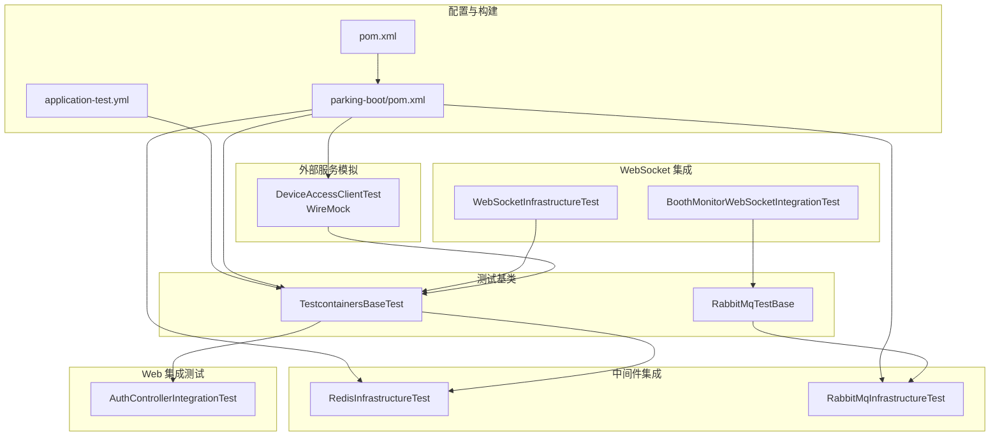
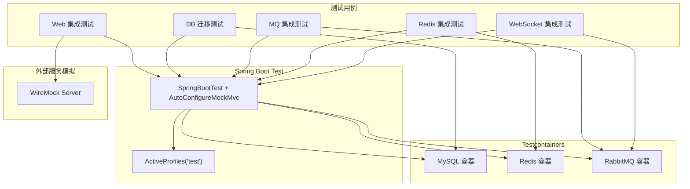
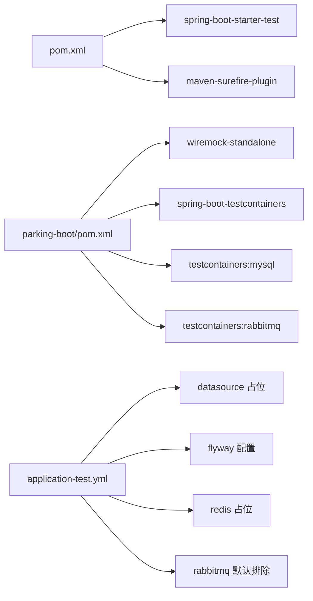

# 集成测试

<cite>
**本文引用的文件**   
- [pom.xml](file://pom.xml)
- [parking-boot/pom.xml](file://parking-boot/pom.xml)
- [application-test.yml](file://parking-boot/src/main/resources/application-test.yml)
- [TestcontainersBaseTest.java](file://parking-boot/src/test/java/com/jushan/boot/test/TestcontainersBaseTest.java)
- [RabbitMqTestBase.java](file://parking-boot/src/test/java/com/jushan/boot/mq/RabbitMqTestBase.java)
- [FlywayMigrationTest.java](file://parking-boot/src/test/java/com/jushan/boot/migration/FlywayMigrationTest.java)
- [DeviceAccessClientTest.java](file://parking-boot/src/test/java/com/jushan/boot/client/DeviceAccessClientTest.java)
- [AuthControllerIntegrationTest.java](file://parking-boot/src/test/java/com/jushan/boot/controller/AuthControllerIntegrationTest.java)
- [RedisInfrastructureTest.java](file://parking-boot/src/test/java/com/jushan/boot/redis/RedisInfrastructureTest.java)
- [RabbitMqInfrastructureTest.java](file://parking-boot/src/test/java/com/jushan/boot/mq/RabbitMqInfrastructureTest.java)
- [WebSocketInfrastructureTest.java](file://parking-boot/src/test/java/com/jushan/boot/ws/WebSocketInfrastructureTest.java)
- [BoothMonitorWebSocketIntegrationTest.java](file://parking-boot/src/test/java/com/jushan/boot/ws/BoothMonitorWebSocketIntegrationTest.java)
</cite>

## 目录
1. [引言](#引言)
2. [项目结构](#项目结构)
3. [核心组件](#核心组件)
4. [架构总览](#架构总览)
5. [详细组件分析](#详细组件分析)
6. [依赖分析](#依赖分析)
7. [性能考虑](#性能考虑)
8. [故障排查指南](#故障排查指南)
9. [结论](#结论)
10. [附录](#附录)

## 引言
本文件面向“智慧停车 SaaS 平台”的集成测试体系，系统性说明 Spring Boot Test 框架的配置与使用方式，覆盖 Web 层、数据库、消息队列、缓存（Redis）以及 WebSocket 的端到端集成测试。文档同时阐述 Testcontainers 的容器化测试环境搭建策略、外部服务模拟方案（特别是 Device Access 服务的 WireMock 实现）、API 接口测试最佳实践（请求构造、响应验证、错误处理），并给出 WebSocket 认证与鉴权、事务管理与测试数据清理策略等实操建议。

## 项目结构
本项目采用多模块 Maven 工程，测试代码集中在 parking-boot 模块的 test 源码集下，按功能域组织：
- 基础设施基类：TestcontainersBaseTest、RabbitMqTestBase
- 迁移验证：FlywayMigrationTest
- 外部客户端模拟：DeviceAccessClientTest（WireMock）
- Web 控制器集成：AuthControllerIntegrationTest 等
- 中间件集成：RedisInfrastructureTest、RabbitMqInfrastructureTest
- WebSocket 集成：WebSocketInfrastructureTest、BoothMonitorWebSocketIntegrationTest

图表来源
- [pom.xml:152-157](file://pom.xml#L152-L157)
- [parking-boot/pom.xml:77-115](file://parking-boot/pom.xml#L77-L115)
- [application-test.yml:1-38](file://parking-boot/src/main/resources/application-test.yml#L1-L38)
- [TestcontainersBaseTest.java:27-49](file://parking-boot/src/test/java/com/jushan/boot/test/TestcontainersBaseTest.java#L27-L49)
- [RabbitMqTestBase.java:22-50](file://parking-boot/src/test/java/com/jushan/boot/mq/RabbitMqTestBase.java#L22-L50)
- [DeviceAccessClientTest.java:43-76](file://parking-boot/src/test/java/com/jushan/boot/client/DeviceAccessClientTest.java#L43-L76)
- [AuthControllerIntegrationTest.java:34-41](file://parking-boot/src/test/java/com/jushan/boot/controller/AuthControllerIntegrationTest.java#L34-L41)
- [RedisInfrastructureTest.java:33-46](file://parking-boot/src/test/java/com/jushan/boot/redis/RedisInfrastructureTest.java#L33-L46)
- [RabbitMqInfrastructureTest.java:26-31](file://parking-boot/src/test/java/com/jushan/boot/mq/RabbitMqInfrastructureTest.java#L26-L31)
- [WebSocketInfrastructureTest.java:47-57](file://parking-boot/src/test/java/com/jushan/boot/ws/WebSocketInfrastructureTest.java#L47-L57)
- [BoothMonitorWebSocketIntegrationTest.java:59-68](file://parking-boot/src/test/java/com/jushan/boot/ws/BoothMonitorWebSocketIntegrationTest.java#L59-L68)

章节来源
- [pom.xml:152-157](file://pom.xml#L152-L157)
- [parking-boot/pom.xml:77-115](file://parking-boot/pom.xml#L77-L115)
- [application-test.yml:1-38](file://parking-boot/src/main/resources/application-test.yml#L1-L38)

## 核心组件
- 测试基类与容器编排
  - TestcontainersBaseTest：提供 MySQL 容器的静态共享实例，并通过 @ServiceConnection 自动注入 spring.datasource.* 属性；配合 @ActiveProfiles("test") 加载测试配置。
  - RabbitMqTestBase：在 TestcontainersBaseTest 基础上扩展，额外启动 RabbitMQ 和 Redis 容器，用于需要完整中间件的测试场景。
- 迁移验证
  - FlywayMigrationTest：基于 Testcontainers 启动真实 MySQL，验证 Flyway 迁移执行与幂等性，并使用 @DirtiesContext(classMode = BEFORE_CLASS) 避免连接池污染。
- 外部服务模拟
  - DeviceAccessClientTest：通过 WireMock 模拟 Device Access HTTP 服务，覆盖成功、业务异常、超时、解析失败等路径；使用 @DynamicPropertySource 动态注入 base-url。
- Web 集成测试
  - AuthControllerIntegrationTest：使用 MockMvc 对登录、会话、权限、密码修改等流程进行端到端验证，结合 Testcontainers 提供的 MySQL 与 Redis。
- 中间件集成
  - RedisInfrastructureTest：验证 Redis 连通性、Key 前缀隔离与分布式锁行为。
  - RabbitMqInfrastructureTest：验证消息投递、路由、幂等标记、死信队列声明与序列化往返。
- WebSocket 集成
  - WebSocketInfrastructureTest：验证 STOMP over WebSocket 的认证连接、匿名拒绝、公共 topic 订阅与 SockJS info 端点可用性。
  - BoothMonitorWebSocketIntegrationTest：基于租户、停车场、员工数据的准备与清理，验证岗亭操作员对授权停车场 topic 的订阅与未授权拒绝。

章节来源
- [TestcontainersBaseTest.java:27-49](file://parking-boot/src/test/java/com/jushan/boot/test/TestcontainersBaseTest.java#L27-L49)
- [RabbitMqTestBase.java:22-50](file://parking-boot/src/test/java/com/jushan/boot/mq/RabbitMqTestBase.java#L22-L50)
- [FlywayMigrationTest.java:32-34](file://parking-boot/src/test/java/com/jushan/boot/migration/FlywayMigrationTest.java#L32-L34)
- [DeviceAccessClientTest.java:43-76](file://parking-boot/src/test/java/com/jushan/boot/client/DeviceAccessClientTest.java#L43-L76)
- [AuthControllerIntegrationTest.java:34-41](file://parking-boot/src/test/java/com/jushan/boot/controller/AuthControllerIntegrationTest.java#L34-L41)
- [RedisInfrastructureTest.java:33-46](file://parking-boot/src/test/java/com/jushan/boot/redis/RedisInfrastructureTest.java#L33-L46)
- [RabbitMqInfrastructureTest.java:26-31](file://parking-boot/src/test/java/com/jushan/boot/mq/RabbitMqInfrastructureTest.java#L26-L31)
- [WebSocketInfrastructureTest.java:47-57](file://parking-boot/src/test/java/com/jushan/boot/ws/WebSocketInfrastructureTest.java#L47-L57)
- [BoothMonitorWebSocketIntegrationTest.java:59-68](file://parking-boot/src/test/java/com/jushan/boot/ws/BoothMonitorWebSocketIntegrationTest.java#L59-L68)

## 架构总览
下图展示了集成测试的整体架构：测试用例通过 Spring Boot Test 启动应用上下文，借助 Testcontainers 拉起 MySQL、Redis、RabbitMQ 等真实中间件；对外部依赖（Device Access）使用 WireMock 进行 HTTP 契约级模拟；WebSocket 测试通过 STOMP 协议完成认证与鉴权链路验证。

图表来源
- [AuthControllerIntegrationTest.java:34-41](file://parking-boot/src/test/java/com/jushan/boot/controller/AuthControllerIntegrationTest.java#L34-L41)
- [FlywayMigrationTest.java:32-34](file://parking-boot/src/test/java/com/jushan/boot/migration/FlywayMigrationTest.java#L32-L34)
- [RabbitMqInfrastructureTest.java:26-31](file://parking-boot/src/test/java/com/jushan/boot/mq/RabbitMqInfrastructureTest.java#L26-L31)
- [RedisInfrastructureTest.java:33-46](file://parking-boot/src/test/java/com/jushan/boot/redis/RedisInfrastructureTest.java#L33-L46)
- [WebSocketInfrastructureTest.java:47-57](file://parking-boot/src/test/java/com/jushan/boot/ws/WebSocketInfrastructureTest.java#L47-L57)
- [DeviceAccessClientTest.java:43-76](file://parking-boot/src/test/java/com/jushan/boot/client/DeviceAccessClientTest.java#L43-L76)

## 详细组件分析

### 数据库集成测试与迁移验证
- 目标
  - 验证 Flyway 迁移在容器启动时自动执行且幂等；校验关键表结构与约束。
- 关键点
  - 使用 TestcontainersBaseTest 提供 MySQL 容器；@DirtiesContext(classMode = BEFORE_CLASS) 确保每个测试类获得全新上下文，避免连接池状态污染。
  - application-test.yml 中启用 Flyway，locations 指向 db/migration。
- 建议
  - 针对复杂迁移或回滚脚本，增加反向验证（如删除后重建）。
  - 对关键索引与唯一约束进行断言，提升回归稳定性。

章节来源
- [FlywayMigrationTest.java:32-34](file://parking-boot/src/test/java/com/jushan/boot/migration/FlywayMigrationTest.java#L32-L34)
- [application-test.yml:17-22](file://parking-boot/src/main/resources/application-test.yml#L17-L22)
- [TestcontainersBaseTest.java:27-49](file://parking-boot/src/test/java/com/jushan/boot/test/TestcontainersBaseTest.java#L27-L49)

### Web 层集成测试（MockMvc）
- 目标
  - 以端到端方式验证 REST API 的请求/响应、参数校验、权限控制与副作用（如日志记录）。
- 关键点
  - 使用 @AutoConfigureMockMvc 与 @SpringBootTest 组合；通过 @TestPropertySource 排除不需要的自动装配（如 RabbitMQ）。
  - 使用 JUnit 5 的 @BeforeEach/@AfterEach 管理测试数据与状态恢复。
- 最佳实践
  - 请求构造：统一封装 JSON 载荷与 Header；对敏感字段做脱敏断言。
  - 响应验证：优先断言 code/message/data 结构，再断言关键字段。
  - 错误处理：覆盖 400/401/403/500 等典型分支，确保全局异常处理器返回一致格式。

章节来源
- [AuthControllerIntegrationTest.java:34-41](file://parking-boot/src/test/java/com/jushan/boot/controller/AuthControllerIntegrationTest.java#L34-L41)
- [AuthControllerIntegrationTest.java:61-71](file://parking-boot/src/test/java/com/jushan/boot/controller/AuthControllerIntegrationTest.java#L61-L71)

### 外部服务模拟（Device Access 服务）
- 目标
  - 在不依赖真实设备接入服务的情况下，稳定复现其正常与异常行为。
- 关键点
  - 使用 WireMock 启动独立服务器，通过 @DynamicPropertySource 将动态端口注入为 jushan.device-access.base-url。
  - 覆盖 200/404/500/503、超时、畸形 JSON、空响应体、data 为 null 等场景。
- 建议
  - 将常用契约（请求/响应样例）抽取为 JSON 资源文件，便于维护与版本化。
  - 对超时场景设置较短 read-timeout，加速测试执行。

章节来源
- [DeviceAccessClientTest.java:43-76](file://parking-boot/src/test/java/com/jushan/boot/client/DeviceAccessClientTest.java#L43-L76)
- [DeviceAccessClientTest.java:85-110](file://parking-boot/src/test/java/com/jushan/boot/client/DeviceAccessClientTest.java#L85-L110)
- [DeviceAccessClientTest.java:197-221](file://parking-boot/src/test/java/com/jushan/boot/client/DeviceAccessClientTest.java#L197-L221)
- [DeviceAccessClientTest.java:225-236](file://parking-boot/src/test/java/com/jushan/boot/client/DeviceAccessClientTest.java#L225-L236)

### 消息队列集成测试（RabbitMQ）
- 目标
  - 验证内部消息基础设施：Exchange/Queue/Binding 声明、消息投递与消费、幂等标记、死信队列、序列化往返。
- 关键点
  - 继承 RabbitMqTestBase，自动启动 MySQL + RabbitMQ + Redis 容器；通过 RabbitAdmin 动态声明队列与绑定。
  - 使用 MessageIdempotency 接口验证相同 messageId 的重复处理识别。
- 建议
  - 对 DLX 与重试策略进行专项测试；对消费者异常路径增加断言。

章节来源
- [RabbitMqTestBase.java:22-50](file://parking-boot/src/test/java/com/jushan/boot/mq/RabbitMqTestBase.java#L22-L50)
- [RabbitMqInfrastructureTest.java:45-56](file://parking-boot/src/test/java/com/jushan/boot/mq/RabbitMqInfrastructureTest.java#L45-L56)
- [RabbitMqInfrastructureTest.java:82-98](file://parking-boot/src/test/java/com/jushan/boot/mq/RabbitMqInfrastructureTest.java#L82-L98)
- [RabbitMqInfrastructureTest.java:118-123](file://parking-boot/src/test/java/com/jushan/boot/mq/RabbitMqInfrastructureTest.java#L118-L123)

### 缓存集成测试（Redis）
- 目标
  - 验证 Redis 连通性、Key 前缀隔离与分布式锁并发互斥、超时释放等行为。
- 关键点
  - 通过 @ServiceConnection 注入 Redis 容器；使用 StringRedisTemplate 进行基本读写断言。
  - 分布式锁测试覆盖获取/释放、并发互斥、过期自动释放。
- 建议
  - 对热点 Key 的 TTL 与容量策略进行压测；对锁粒度与竞争条件进行边界测试。

章节来源
- [RedisInfrastructureTest.java:33-46](file://parking-boot/src/test/java/com/jushan/boot/redis/RedisInfrastructureTest.java#L33-L46)
- [RedisInfrastructureTest.java:81-97](file://parking-boot/src/test/java/com/jushan/boot/redis/RedisInfrastructureTest.java#L81-L97)
- [RedisInfrastructureTest.java:99-125](file://parking-boot/src/test/java/com/jushan/boot/redis/RedisInfrastructureTest.java#L99-L125)
- [RedisInfrastructureTest.java:127-143](file://parking-boot/src/test/java/com/jushan/boot/redis/RedisInfrastructureTest.java#L127-L143)

### WebSocket 集成测试（STOMP/SockJS）
- 目标
  - 验证认证后连接建立、匿名连接拒绝、公共 topic 订阅、SockJS info 端点可用性与岗位监控权限控制。
- 关键点
  - 使用 RANDOM_PORT 启动应用，通过 HTTP 登录获取 token，再以 ?token= 形式发起 STOMP 连接。
  - 使用 CountDownLatch 与超时断言保证异步连接的确定性。
  - 岗位监控场景需准备租户、停车场、员工数据，并在 AfterEach 清理。
- 建议
  - 对鉴权拦截器与主题访问检查进行单独单元测试；对网络抖动与重连策略进行健壮性测试。

章节来源
- [WebSocketInfrastructureTest.java:47-57](file://parking-boot/src/test/java/com/jushan/boot/ws/WebSocketInfrastructureTest.java#L47-L57)
- [WebSocketInfrastructureTest.java:74-89](file://parking-boot/src/test/java/com/jushan/boot/ws/WebSocketInfrastructureTest.java#L74-L89)
- [WebSocketInfrastructureTest.java:93-112](file://parking-boot/src/test/java/com/jushan/boot/ws/WebSocketInfrastructureTest.java#L93-L112)
- [BoothMonitorWebSocketIntegrationTest.java:59-68](file://parking-boot/src/test/java/com/jushan/boot/ws/BoothMonitorWebSocketIntegrationTest.java#L59-L68)
- [BoothMonitorWebSocketIntegrationTest.java:101-115](file://parking-boot/src/test/java/com/jushan/boot/ws/BoothMonitorWebSocketIntegrationTest.java#L101-L115)
- [BoothMonitorWebSocketIntegrationTest.java:122-140](file://parking-boot/src/test/java/com/jushan/boot/ws/BoothMonitorWebSocketIntegrationTest.java#L122-L140)
- [BoothMonitorWebSocketIntegrationTest.java:311-327](file://parking-boot/src/test/java/com/jushan/boot/ws/BoothMonitorWebSocketIntegrationTest.java#L311-L327)

### API 接口测试最佳实践
- 请求构造
  - 使用统一的 JSON 载荷与 Header 工具方法；对分页、排序、过滤参数进行组合断言。
- 响应验证
  - 先断言整体结构（code/message/data），再断言关键字段类型与取值范围；对时间戳与时区进行规范化比较。
- 错误处理
  - 覆盖参数校验失败、权限不足、业务异常、系统异常等分支；确保全局异常处理器输出一致的错误码与消息。
- 事务与数据清理
  - 对于写操作较多的测试，建议使用 @Transactional 与 @Rollback 控制事务边界；或使用 @DirtiesContext 重置上下文。
  - 对跨进程/异步副作用（如 MQ、WS）使用等待与断言机制，确保最终一致性。

章节来源
- [AuthControllerIntegrationTest.java:75-93](file://parking-boot/src/test/java/com/jushan/boot/controller/AuthControllerIntegrationTest.java#L75-L93)
- [AuthControllerIntegrationTest.java:113-138](file://parking-boot/src/test/java/com/jushan/boot/controller/AuthControllerIntegrationTest.java#L113-L138)
- [AuthControllerIntegrationTest.java:238-259](file://parking-boot/src/test/java/com/jushan/boot/controller/AuthControllerIntegrationTest.java#L238-L259)

### 事务管理与测试数据清理策略
- 事务管理
  - 对仅读测试可复用事务上下文；对写操作测试建议在方法级开启事务并在结束后回滚，避免影响其他用例。
- 数据清理
  - 使用 @BeforeEach/@AfterEach 准备与清理数据；对跨模块关联数据（租户、用户、停车场、员工）进行成组清理。
  - 对容器化数据库，注意不同测试类的数据库名隔离，避免相互污染。

章节来源
- [FlywayMigrationTest.java:32-34](file://parking-boot/src/test/java/com/jushan/boot/migration/FlywayMigrationTest.java#L32-L34)
- [BoothMonitorWebSocketIntegrationTest.java:101-115](file://parking-boot/src/test/java/com/jushan/boot/ws/BoothMonitorWebSocketIntegrationTest.java#L101-L115)
- [BoothMonitorWebSocketIntegrationTest.java:311-327](file://parking-boot/src/test/java/com/jushan/boot/ws/BoothMonitorWebSocketIntegrationTest.java#L311-L327)

## 依赖分析
- 顶层依赖
  - spring-boot-starter-test：提供 JUnit 5、AssertJ、MockMvc 等基础能力。
  - maven-surefire-plugin：传递 Docker 环境变量，支持 Testcontainers 运行。
- 子模块依赖（parking-boot）
  - wiremock-standalone：Device Access 服务 HTTP 模拟。
  - spring-boot-testcontainers、testcontainers:mysql、testcontainers:rabbitmq：容器化中间件支持。
- 测试配置
  - application-test.yml：定义默认数据源、Flyway、Redis 占位值与 RabbitMQ 默认禁用。

图表来源
- [pom.xml:152-157](file://pom.xml#L152-L157)
- [pom.xml:201-211](file://pom.xml#L201-L211)
- [parking-boot/pom.xml:77-115](file://parking-boot/pom.xml#L77-L115)
- [application-test.yml:10-38](file://parking-boot/src/main/resources/application-test.yml#L10-L38)

章节来源
- [pom.xml:152-157](file://pom.xml#L152-L157)
- [pom.xml:201-211](file://pom.xml#L201-L211)
- [parking-boot/pom.xml:77-115](file://parking-boot/pom.xml#L77-L115)
- [application-test.yml:10-38](file://parking-boot/src/main/resources/application-test.yml#L10-L38)

## 性能考虑
- 容器镜像选择与预热
  - 使用轻量镜像（如 redis:7-alpine、mysql:8.4）缩短拉取与启动时间；在 CI 中缓存镜像层。
- 超时与重试
  - 对外部调用（WireMock）设置较短超时；对 MQ/WS 连接增加合理超时与重试策略。
- 并行执行
  - 使用不同数据库名与端口隔离测试；避免共享状态导致的串行化瓶颈。
- 资源限制
  - 在本地与 CI 环境中限制容器 CPU/内存，防止资源争用导致不稳定。

[本节为通用指导，无需列出具体文件来源]

## 故障排查指南
- Testcontainers 无法连接 Docker
  - 确认 DOCKER_HOST 与 TESTCONTAINERS_DOCKER_SOCKET_OVERRIDE 环境变量已正确传递；检查 Docker 守护进程是否运行。
- HikariCP 连接池污染
  - 对涉及数据库迁移或连接池操作的测试类使用 @DirtiesContext(classMode = BEFORE_CLASS)。
- WireMock 端口冲突
  - 使用动态端口并通过 @DynamicPropertySource 注入；确保在 @AfterAll 停止服务。
- WebSocket 连接失败
  - 检查 token 是否正确传入；确认匿名连接被拒绝的策略生效；验证 SockJS info 端点可达。
- RabbitMQ 队列未声明
  - 在测试 @BeforeEach 中显式声明队列与绑定；验证 DLX 队列存在。

章节来源
- [pom.xml:201-211](file://pom.xml#L201-L211)
- [FlywayMigrationTest.java:32-34](file://parking-boot/src/test/java/com/jushan/boot/migration/FlywayMigrationTest.java#L32-L34)
- [DeviceAccessClientTest.java:73-76](file://parking-boot/src/test/java/com/jushan/boot/client/DeviceAccessClientTest.java#L73-L76)
- [WebSocketInfrastructureTest.java:116-134](file://parking-boot/src/test/java/com/jushan/boot/ws/WebSocketInfrastructureTest.java#L116-L134)
- [RabbitMqInfrastructureTest.java:45-56](file://parking-boot/src/test/java/com/jushan/boot/mq/RabbitMqInfrastructureTest.java#L45-L56)

## 结论
本项目的集成测试体系以 Spring Boot Test 为核心，结合 Testcontainers 提供真实的中间件环境，辅以 WireMock 对外部服务进行契约级模拟，覆盖了 Web、数据库、消息队列、缓存与 WebSocket 的关键路径。通过合理的基类抽象、配置隔离与数据清理策略，测试具备高稳定性与可维护性。建议持续完善契约测试与性能回归用例，进一步提升质量保障能力。

[本节为总结性内容，无需列出具体文件来源]

## 附录
- 快速开始
  - 安装 Docker 并确保守护进程可用。
  - 在项目根目录执行 mvn test，即可运行所有集成测试。
- 参考配置
  - 顶层 pom.xml 中的 surefire 插件与环境变量传递。
  - parking-boot/pom.xml 中的测试依赖与插件。
  - application-test.yml 中的默认测试配置。

章节来源
- [pom.xml:201-211](file://pom.xml#L201-L211)
- [parking-boot/pom.xml:117-126](file://parking-boot/pom.xml#L117-L126)
- [application-test.yml:1-38](file://parking-boot/src/main/resources/application-test.yml#L1-L38)