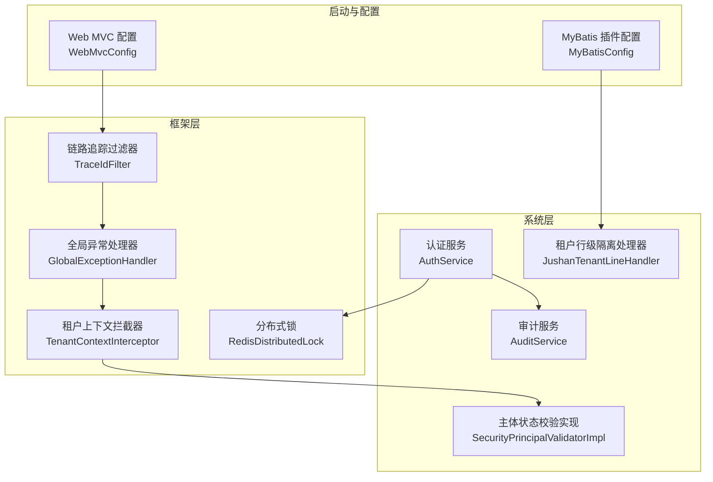
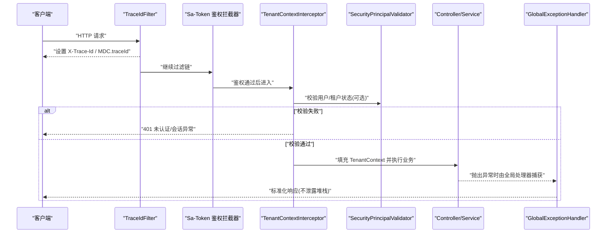
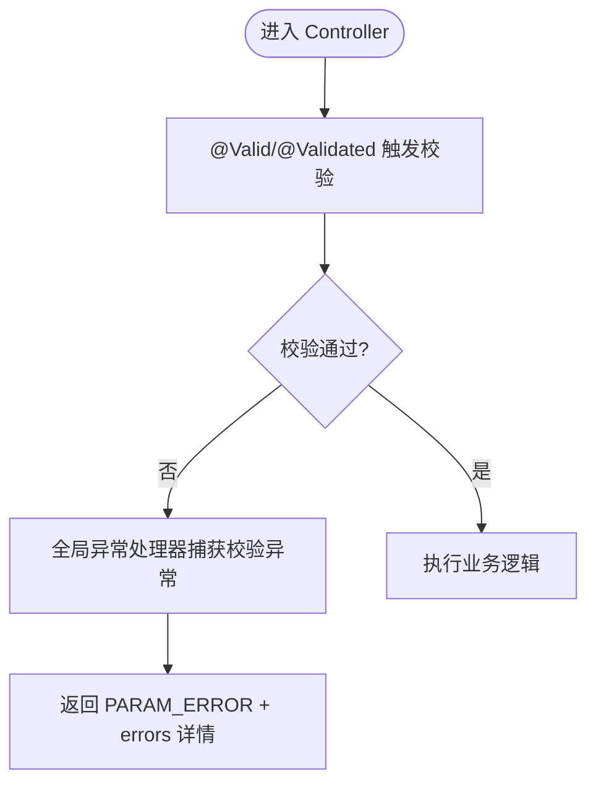
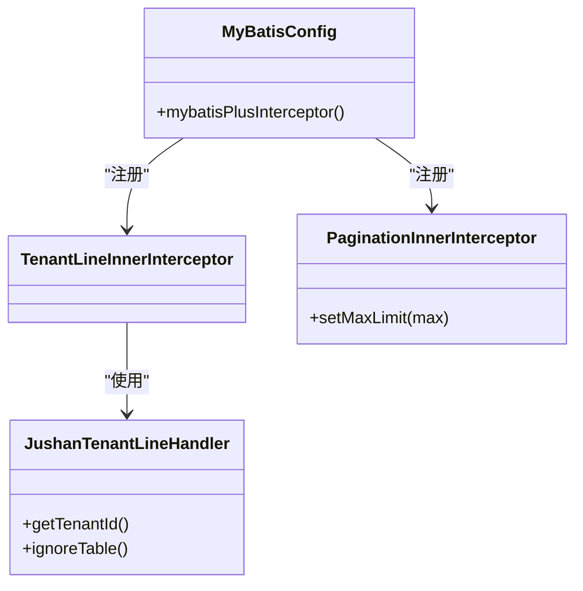
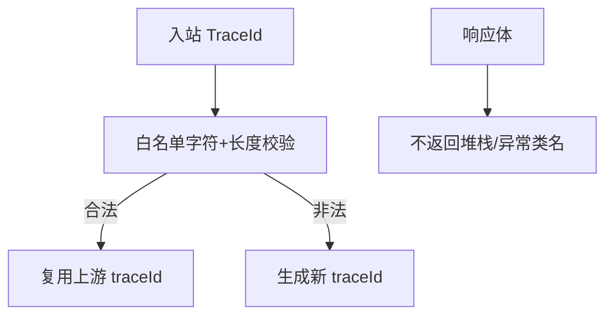
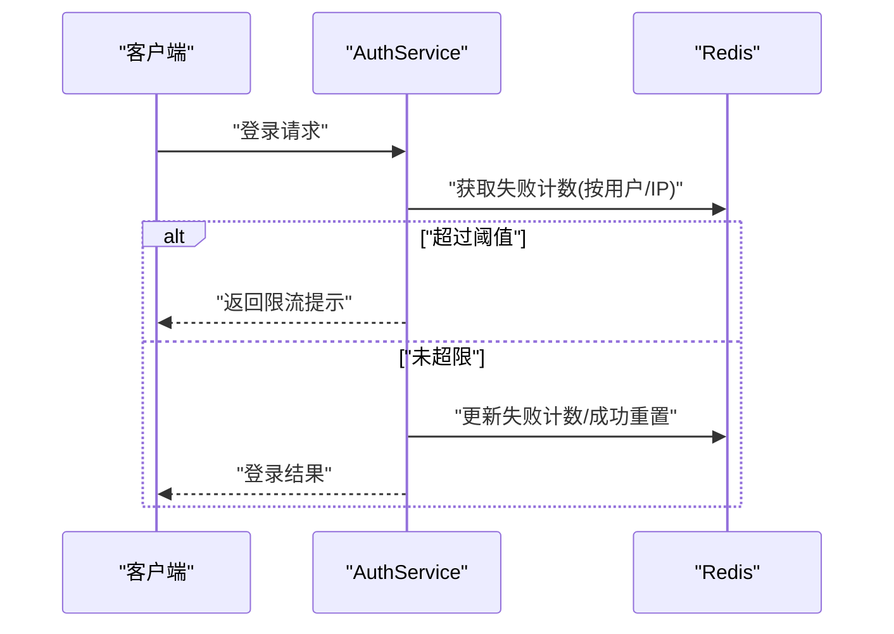
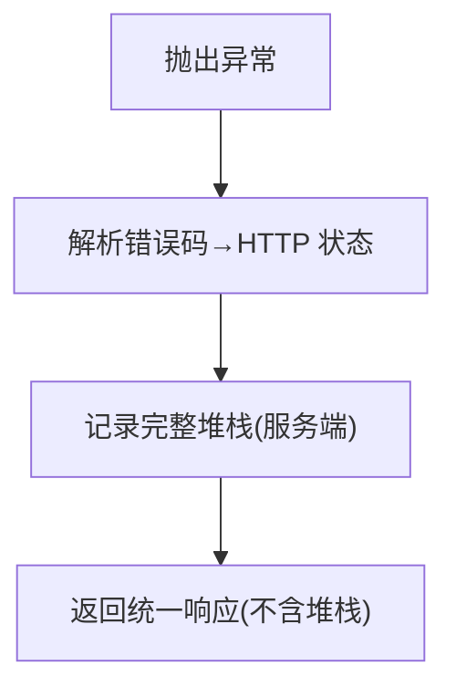
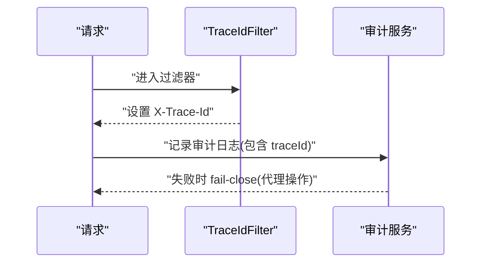
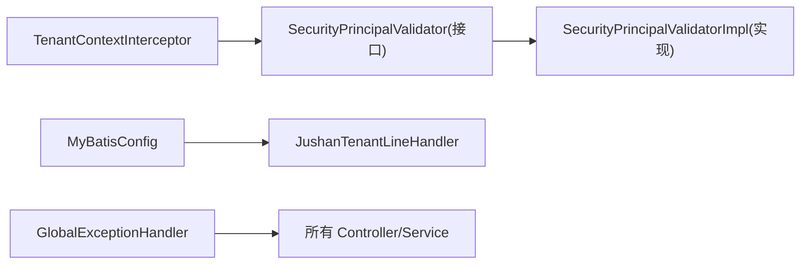

# API 安全防护

<cite>
**本文引用的文件**   
- [GlobalExceptionHandler.java](file://parking-framework/src/main/java/com/jushan/framework/web/GlobalExceptionHandler.java)
- [TenantContextInterceptor.java](file://parking-framework/src/main/java/com/jushan/framework/auth/TenantContextInterceptor.java)
- [SecurityPrincipalValidator.java](file://parking-framework/src/main/java/com/jushan/framework/auth/SecurityPrincipalValidator.java)
- [SecurityPrincipalValidatorImpl.java](file://parking-system/src/main/java/com/jushan/system/service/SecurityPrincipalValidatorImpl.java)
- [TraceIdFilter.java](file://parking-framework/src/main/java/com/jushan/framework/web/TraceIdFilter.java)
- [WebMvcConfig.java](file://parking-framework/src/main/java/com/jushan/framework/config/WebMvcConfig.java)
- [LoginRequest.java](file://parking-system/src/main/java/com/jushan/system/dto/LoginRequest.java)
- [CreateDeviceRequest.java](file://parking-system/src/main/java/com/jushan/system/dto/CreateDeviceRequest.java)
- [MyBatisConfig.java](file://parking-boot/src/main/java/com/jushan/boot/config/MyBatisConfig.java)
- [JushanTenantLineHandler.java](file://parking-system/src/main/java/com/jushan/system/mybatis/JushanTenantLineHandler.java)
- [TenantIgnore.java](file://parking-system/src/main/java/com/jushan/system/mybatis/TenantIgnore.java)
- [AuditService.java](file://parking-system/src/main/java/com/jushan/system/service/AuditService.java)
- [AuthService.java](file://parking-system/src/main/java/com/jushan/system/service/AuthService.java)
- [RedisDistributedLock.java](file://parking-framework/src/main/java/com/jushan/framework/lock/RedisDistributedLock.java)
- [TraceIdAndHttpStatusTest.java](file://parking-boot/src/test/java/com/jushan/boot/controller/TraceIdAndHttpStatusTest.java)
- [TraceIdFilterTest.java](file://parking-framework/src/test/java/com/jushan/framework/web/TraceIdFilterTest.java)
</cite>

## 目录
1. [简介](#简介)
2. [项目结构](#项目结构)
3. [核心组件](#核心组件)
4. [架构总览](#架构总览)
5. [详细组件分析](#详细组件分析)
6. [依赖关系分析](#依赖关系分析)
7. [性能与可用性考虑](#性能与可用性考虑)
8. [故障排查指南](#故障排查指南)
9. [结论](#结论)
10. [附录：安全配置示例与常见漏洞防护清单](#附录安全配置示例与常见漏洞防护清单)

## 简介
本文件聚焦于停车 SaaS 平台在 API 层的安全防护能力，围绕请求参数校验、SQL 注入防护、XSS 输入输出过滤、接口限流与防刷、错误处理与异常安全、请求签名与防重放（现状与建议）、安全日志与审计追踪等主题进行系统化说明。文档同时给出架构图、时序图与流程图，帮助读者快速理解现有实现与改进方向。

## 项目结构
本项目采用多模块分层组织：
- parking-framework：通用框架能力（全局异常、过滤器、拦截器、分布式锁、Redis 键前缀等）
- parking-system：业务领域实现（控制器、服务、实体、Mapper、事件消费等）
- parking-boot：启动与基础配置（MyBatis 插件、应用属性等）
- 前端工程（admin-web、booth-web、miniapp）通过 HTTP 调用后端 API

图表来源
- [GlobalExceptionHandler.java:1-240](file://parking-framework/src/main/java/com/jushan/framework/web/GlobalExceptionHandler.java#L1-L240)
- [TenantContextInterceptor.java:1-239](file://parking-framework/src/main/java/com/jushan/framework/auth/TenantContextInterceptor.java#L1-L239)
- [SecurityPrincipalValidatorImpl.java:1-84](file://parking-system/src/main/java/com/jushan/system/service/SecurityPrincipalValidatorImpl.java#L1-L84)
- [TraceIdFilter.java:1-76](file://parking-framework/src/main/java/com/jushan/framework/web/TraceIdFilter.java#L1-L76)
- [WebMvcConfig.java:1-38](file://parking-framework/src/main/java/com/jushan/framework/config/WebMvcConfig.java#L1-L38)
- [MyBatisConfig.java:41-87](file://parking-boot/src/main/java/com/jushan/boot/config/MyBatisConfig.java#L41-L87)
- [JushanTenantLineHandler.java:1-36](file://parking-system/src/main/java/com/jushan/system/mybatis/JushanTenantLineHandler.java#L1-L36)
- [AuthService.java:44-72](file://parking-system/src/main/java/com/jushan/system/service/AuthService.java#L44-L72)
- [RedisDistributedLock.java:1-38](file://parking-framework/src/main/java/com/jushan/framework/lock/RedisDistributedLock.java#L1-L38)

章节来源
- [WebMvcConfig.java:1-38](file://parking-framework/src/main/java/com/jushan/framework/config/WebMvcConfig.java#L1-L38)
- [MyBatisConfig.java:41-87](file://parking-boot/src/main/java/com/jushan/boot/config/MyBatisConfig.java#L41-L87)

## 核心组件
- 全局异常处理器：统一将参数校验失败、业务异常、认证授权异常、Spring 内置异常转换为标准响应体，并保证不泄露内部堆栈细节。
- 租户上下文拦截器：在鉴权通过后从会话读取可信身份，填充租户上下文，并在进入 Controller 前校验用户/租户状态。
- 安全主体校验器：在数据库可用时校验用户/租户是否处于启用状态；不可用时安全降级。
- 链路追踪过滤器：为每个请求分配或复用 traceId，写入 MDC 和响应头，便于问题定位。
- MyBatis 多租户行级隔离：基于拦截器自动注入 tenant_id 条件，防止跨租户访问。
- 认证与登录限流：对登录失败次数进行窗口计数限制，结合 Redis 分布式锁增强幂等与并发控制。
- 审计服务：关键操作记录审计日志，代理类操作在审计写入失败时 fail-close。

章节来源
- [GlobalExceptionHandler.java:24-149](file://parking-framework/src/main/java/com/jushan/framework/web/GlobalExceptionHandler.java#L24-L149)
- [TenantContextInterceptor.java:64-199](file://parking-framework/src/main/java/com/jushan/framework/auth/TenantContextInterceptor.java#L64-L199)
- [SecurityPrincipalValidator.java:16-33](file://parking-framework/src/main/java/com/jushan/framework/auth/SecurityPrincipalValidator.java#L16-L33)
- [SecurityPrincipalValidatorImpl.java:44-82](file://parking-system/src/main/java/com/jushan/system/service/SecurityPrincipalValidatorImpl.java#L44-L82)
- [TraceIdFilter.java:27-76](file://parking-framework/src/main/java/com/jushan/framework/web/TraceIdFilter.java#L27-L76)
- [MyBatisConfig.java:57-87](file://parking-boot/src/main/java/com/jushan/boot/config/MyBatisConfig.java#L57-L87)
- [JushanTenantLineHandler.java:19-36](file://parking-system/src/main/java/com/jushan/system/mybatis/JushanTenantLineHandler.java#L19-L36)
- [AuthService.java:44-72](file://parking-system/src/main/java/com/jushan/system/service/AuthService.java#L44-L72)
- [AuditService.java:249-292](file://parking-system/src/main/java/com/jushan/system/service/AuditService.java#L249-L292)

## 架构总览
下图展示一次受保护的 API 请求在框架层的流转路径与安全控制点。

图表来源
- [TraceIdFilter.java:57-76](file://parking-framework/src/main/java/com/jushan/framework/web/TraceIdFilter.java#L57-L76)
- [TenantContextInterceptor.java:64-199](file://parking-framework/src/main/java/com/jushan/framework/auth/TenantContextInterceptor.java#L64-L199)
- [SecurityPrincipalValidator.java:16-33](file://parking-framework/src/main/java/com/jushan/framework/auth/SecurityPrincipalValidator.java#L16-L33)
- [GlobalExceptionHandler.java:44-149](file://parking-framework/src/main/java/com/jushan/framework/web/GlobalExceptionHandler.java#L44-L149)

## 详细组件分析

### 请求参数校验机制（注解校验与自定义校验器）
- 注解校验：DTO 使用 Jakarta Validation 注解（如 @NotBlank、@Size、@NotNull）声明约束，Controller 入参开启 @Valid/@Validated 后由 Spring 触发校验。
- 全局异常处理：对 MethodArgumentNotValidException、ConstraintViolationException 以及 Servlet 层参数异常进行统一捕获，返回结构化错误列表与 traceId。
- 自定义校验器：可在 DTO 上扩展自定义注解与 Validator 实现，配合全局异常处理器输出统一格式。

图表来源
- [LoginRequest.java:12-27](file://parking-system/src/main/java/com/jushan/system/dto/LoginRequest.java#L12-L27)
- [CreateDeviceRequest.java:13-82](file://parking-system/src/main/java/com/jushan/system/dto/CreateDeviceRequest.java#L13-L82)
- [GlobalExceptionHandler.java:55-104](file://parking-framework/src/main/java/com/jushan/framework/web/GlobalExceptionHandler.java#L55-L104)

章节来源
- [LoginRequest.java:12-27](file://parking-system/src/main/java/com/jushan/system/dto/LoginRequest.java#L12-L27)
- [CreateDeviceRequest.java:13-82](file://parking-system/src/main/java/com/jushan/system/dto/CreateDeviceRequest.java#L13-L82)
- [GlobalExceptionHandler.java:55-104](file://parking-framework/src/main/java/com/jushan/framework/web/GlobalExceptionHandler.java#L55-L104)

### SQL 注入防护策略（预编译语句与参数绑定）
- 持久层使用 MyBatis-Plus，默认以预编译语句与参数绑定方式执行 SQL，避免拼接导致的注入风险。
- 多租户行级隔离：通过 TenantLineInnerInterceptor 与 JushanTenantLineHandler 自动注入 tenant_id 条件，禁止从前端直接信任 tenantId。
- 分页溢出保护：PaginationInnerInterceptor 限制最大页大小，降低深度分页带来的资源消耗风险。

图表来源
- [MyBatisConfig.java:57-87](file://parking-boot/src/main/java/com/jushan/boot/config/MyBatisConfig.java#L57-L87)
- [JushanTenantLineHandler.java:19-36](file://parking-system/src/main/java/com/jushan/system/mybatis/JushanTenantLineHandler.java#L19-L36)

章节来源
- [MyBatisConfig.java:57-87](file://parking-boot/src/main/java/com/jushan/boot/config/MyBatisConfig.java#L57-L87)
- [JushanTenantLineHandler.java:19-36](file://parking-system/src/main/java/com/jushan/system/mybatis/JushanTenantLineHandler.java#L19-L36)

### XSS 攻击防护措施（输入输出过滤）
- 输入侧：
  - 链路追踪过滤器对入站 traceId 进行白名单字符与长度校验，拒绝非法字符（含尖括号、换行、空格等），降低注入面。
  - DTO 字段长度与必填校验减少恶意超长输入。
- 输出侧：
  - 全局异常处理器不返回堆栈或内部异常类名，仅返回友好消息与 traceId，避免信息泄露。
  - 建议在前端渲染层对所有用户可控内容进行 HTML 转义或使用安全的 DOM 构建方式。

图表来源
- [TraceIdFilter.java:49-76](file://parking-framework/src/main/java/com/jushan/framework/web/TraceIdFilter.java#L49-L76)
- [GlobalExceptionHandler.java:224-231](file://parking-framework/src/main/java/com/jushan/framework/web/GlobalExceptionHandler.java#L224-L231)

章节来源
- [TraceIdFilter.java:49-76](file://parking-framework/src/main/java/com/jushan/framework/web/TraceIdFilter.java#L49-L76)
- [GlobalExceptionHandler.java:224-231](file://parking-framework/src/main/java/com/jushan/framework/web/GlobalExceptionHandler.java#L224-L231)

### 接口限流与防刷机制
- 登录失败限流：在服务层维护登录失败次数与时间窗口，达到阈值后拒绝登录请求。
- 分布式锁：基于 Redis 的原子 SET NX PX 实现分布式锁，用于防重放与并发控制（例如幂等键、热点资源保护）。
- 建议：在网关层增加 IP/用户维度的速率限制；对敏感接口引入验证码或二次确认。

图表来源
- [AuthService.java:44-72](file://parking-system/src/main/java/com/jushan/system/service/AuthService.java#L44-L72)
- [RedisDistributedLock.java:1-38](file://parking-framework/src/main/java/com/jushan/framework/lock/RedisDistributedLock.java#L1-L38)

章节来源
- [AuthService.java:44-72](file://parking-system/src/main/java/com/jushan/system/service/AuthService.java#L44-L72)
- [RedisDistributedLock.java:1-38](file://parking-framework/src/main/java/com/jushan/framework/lock/RedisDistributedLock.java#L1-L38)

### 错误处理与异常安全（防止敏感信息泄露）
- 统一异常映射：将协议级错误码映射到对应 HTTP 状态码，普通业务错误保持 HTTP 200 但 code 非 0。
- 安全红线：禁止将堆栈 trace 或内部错误详情返回前端；所有异常均记录完整堆栈至服务端日志。
- 测试覆盖：单元测试验证不同错误码对应的 HTTP 状态码与响应体不包含异常类名。

图表来源
- [GlobalExceptionHandler.java:114-149](file://parking-framework/src/main/java/com/jushan/framework/web/GlobalExceptionHandler.java#L114-L149)
- [TraceIdAndHttpStatusTest.java:244-303](file://parking-boot/src/test/java/com/jushan/boot/controller/TraceIdAndHttpStatusTest.java#L244-L303)

章节来源
- [GlobalExceptionHandler.java:114-149](file://parking-framework/src/main/java/com/jushan/framework/web/GlobalExceptionHandler.java#L114-L149)
- [TraceIdAndHttpStatusTest.java:244-303](file://parking-boot/src/test/java/com/jushan/boot/controller/TraceIdAndHttpStatusTest.java#L244-L303)

### 请求签名验证与防重放攻击机制（现状与建议）
- 现状：当前代码库未发现统一的请求签名与时间戳/Nonce 防重放实现。
- 建议方案：
  - 对外部设备/第三方接入接口引入 HMAC 签名、时间戳与随机数校验。
  - 服务端校验时间戳有效期与 Nonce 唯一性（可结合 Redis 去重）。
  - 对幂等写操作使用业务幂等键（如 outTradeNo、commandId）与分布式锁保障重复请求不产生副作用。

[本节为概念性建议，不直接分析具体源码文件]

### 安全日志记录与审计追踪
- 全链路 traceId：TraceIdFilter 在每个请求中注入 traceId，全局异常处理器在响应体附带 traceId，便于问题定位。
- 审计日志：关键操作（尤其是代理操作）写入审计表，审计写入失败时对代理操作 fail-close，确保不可审计即不可执行。
- 建议：对敏感字段（密码、密钥、Token、证书、手机号、身份证等）进行脱敏后再落盘或输出。

图表来源
- [TraceIdFilter.java:57-76](file://parking-framework/src/main/java/com/jushan/framework/web/TraceIdFilter.java#L57-L76)
- [AuditService.java:249-292](file://parking-system/src/main/java/com/jushan/system/service/AuditService.java#L249-L292)

章节来源
- [TraceIdFilter.java:57-76](file://parking-framework/src/main/java/com/jushan/framework/web/TraceIdFilter.java#L57-L76)
- [AuditService.java:249-292](file://parking-system/src/main/java/com/jushan/system/service/AuditService.java#L249-L292)

## 依赖关系分析
- 框架层与系统层解耦：TenantContextInterceptor 通过 SecurityPrincipalValidator 接口调用系统层实现，避免循环依赖。
- 多租户隔离贯穿 Web 层与持久层：拦截器填充上下文，MyBatis 拦截器自动注入条件，形成端到端的数据边界。
- 全局异常处理器作为兜底，确保所有分支均能返回一致的安全响应。

图表来源
- [TenantContextInterceptor.java:55-62](file://parking-framework/src/main/java/com/jushan/framework/auth/TenantContextInterceptor.java#L55-L62)
- [SecurityPrincipalValidator.java:16-33](file://parking-framework/src/main/java/com/jushan/framework/auth/SecurityPrincipalValidator.java#L16-L33)
- [SecurityPrincipalValidatorImpl.java:29-42](file://parking-system/src/main/java/com/jushan/system/service/SecurityPrincipalValidatorImpl.java#L29-L42)
- [MyBatisConfig.java:57-87](file://parking-boot/src/main/java/com/jushan/boot/config/MyBatisConfig.java#L57-L87)
- [JushanTenantLineHandler.java:19-36](file://parking-system/src/main/java/com/jushan/system/mybatis/JushanTenantLineHandler.java#L19-L36)
- [GlobalExceptionHandler.java:44-149](file://parking-framework/src/main/java/com/jushan/framework/web/GlobalExceptionHandler.java#L44-L149)

章节来源
- [TenantContextInterceptor.java:55-62](file://parking-framework/src/main/java/com/jushan/framework/auth/TenantContextInterceptor.java#L55-L62)
- [SecurityPrincipalValidator.java:16-33](file://parking-framework/src/main/java/com/jushan/framework/auth/SecurityPrincipalValidator.java#L16-L33)
- [SecurityPrincipalValidatorImpl.java:29-42](file://parking-system/src/main/java/com/jushan/system/service/SecurityPrincipalValidatorImpl.java#L29-L42)
- [MyBatisConfig.java:57-87](file://parking-boot/src/main/java/com/jushan/boot/config/MyBatisConfig.java#L57-L87)
- [JushanTenantLineHandler.java:19-36](file://parking-system/src/main/java/com/jushan/system/mybatis/JushanTenantLineHandler.java#L19-L36)
- [GlobalExceptionHandler.java:44-149](file://parking-framework/src/main/java/com/jushan/framework/web/GlobalExceptionHandler.java#L44-L149)

## 性能与可用性考虑
- 分页上限：通过 PaginationInnerInterceptor 限制最大每页条数，避免深度分页拖垮数据库。
- 分布式锁降级：当 Redis 不可用时 tryLock 返回 false，避免阻塞主流程。
- 降级与熔断：外部依赖（如 Device Access）具备连续失败计数与恢复窗口，失败时快速失败，保护系统稳定性。

章节来源
- [MyBatisConfig.java:70-74](file://parking-boot/src/main/java/com/jushan/boot/config/MyBatisConfig.java#L70-L74)
- [RedisDistributedLock.java:1-38](file://parking-framework/src/main/java/com/jushan/framework/lock/RedisDistributedLock.java#L1-L38)

## 故障排查指南
- 使用响应头 X-Trace-Id 与服务端日志中的 traceId 关联问题。
- 若出现“未登录/无权限”等 401/403，检查 Sa-Token 会话与角色权限配置。
- 若出现“参数校验失败”，根据 errors 数组定位字段与提示信息。
- 若出现“系统异常”，查看服务端日志堆栈，注意不要将堆栈暴露给前端。

章节来源
- [TraceIdFilter.java:57-76](file://parking-framework/src/main/java/com/jushan/framework/web/TraceIdFilter.java#L57-L76)
- [GlobalExceptionHandler.java:156-191](file://parking-framework/src/main/java/com/jushan/framework/web/GlobalExceptionHandler.java#L156-L191)
- [TraceIdFilterTest.java:1-57](file://parking-framework/src/test/java/com/jushan/framework/web/TraceIdFilterTest.java#L1-L57)

## 结论
本项目在 API 安全防护方面已具备较为完善的基础能力：严格的参数校验、统一的异常处理、多租户行级隔离、全链路 traceId、审计日志与登录限流等。建议在后续迭代中补充请求签名与防重放机制，并在网关层强化速率限制与 WAF 能力，进一步提升整体安全性与韧性。

## 附录：安全配置示例与常见漏洞防护清单
- 参数校验
  - 使用 @NotBlank/@NotNull/@Size 等注解约束入参
  - 在 Controller 方法参数上使用 @Valid/@Validated
- SQL 注入防护
  - 使用预编译语句与参数绑定（MyBatis-Plus 默认行为）
  - 启用多租户行级隔离，禁止信任前端传入的 tenantId
- XSS 防护
  - 输入侧：严格白名单与长度限制
  - 输出侧：HTML 转义或安全渲染
- 接口限流与防刷
  - 登录失败次数限制与时间窗口
  - 分布式锁用于幂等与热点保护
  - 网关层增加 IP/用户维度速率限制
- 错误处理与异常安全
  - 统一异常处理器，不泄露堆栈
  - 协议级错误码映射到 HTTP 状态码
- 请求签名与防重放（建议）
  - HMAC 签名 + 时间戳 + Nonce
  - 幂等键 + 分布式锁
- 审计与日志
  - 全链路 traceId
  - 关键操作审计，代理操作审计失败 fail-close
  - 敏感字段脱敏

[本节为通用实践建议，不直接分析具体源码文件]