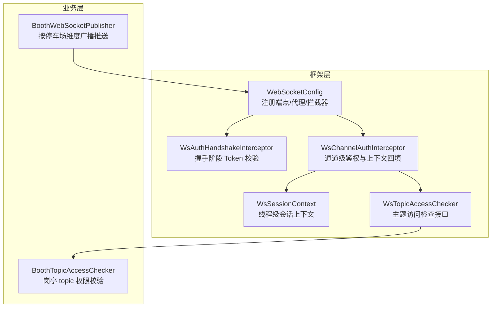
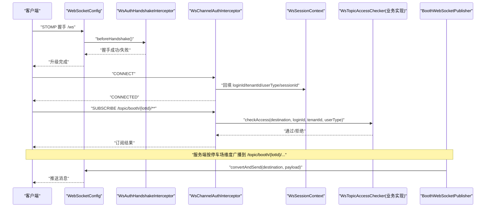
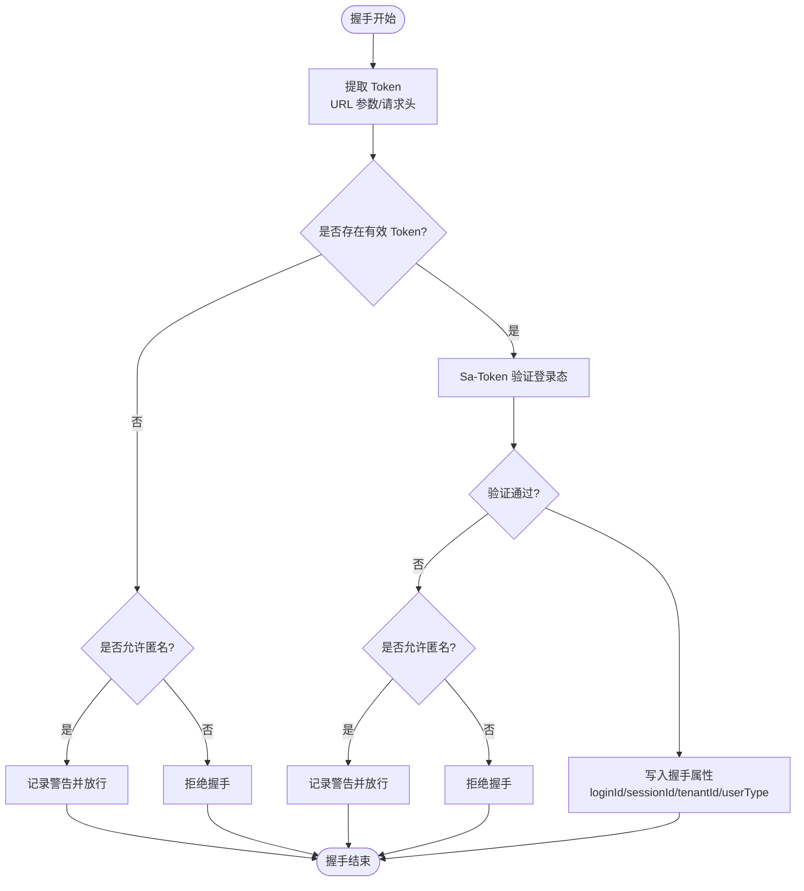
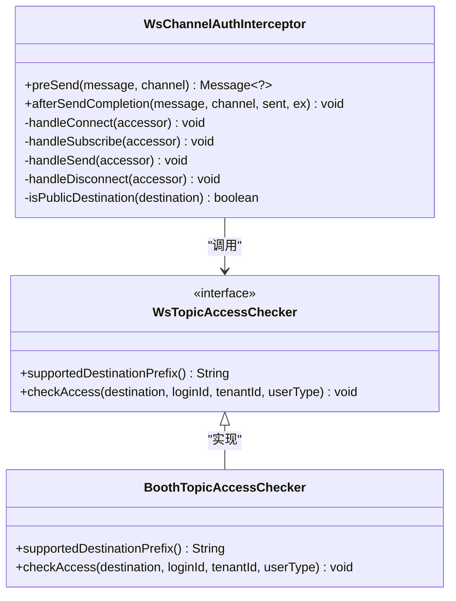
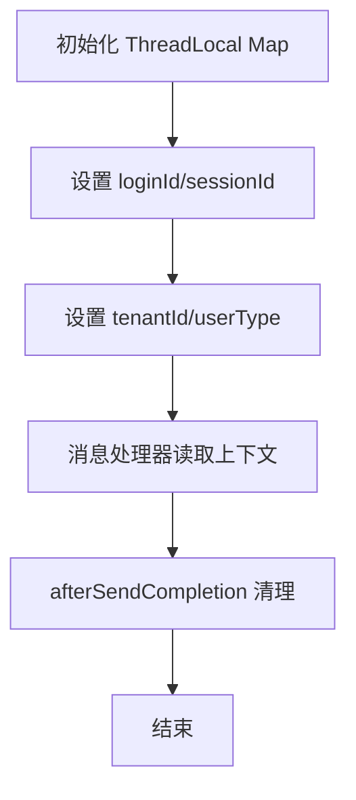
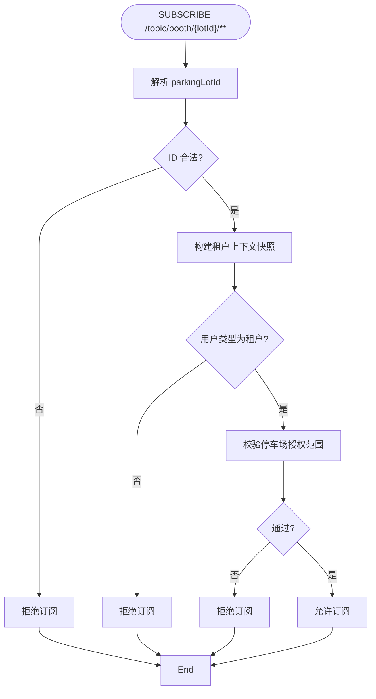
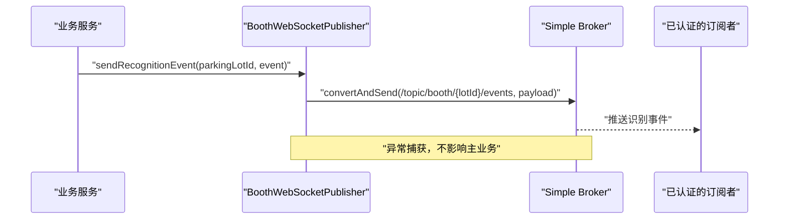
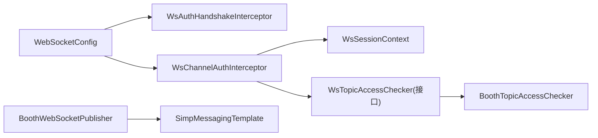

# WebSocket 安全

<cite>
**本文引用的文件**
- [WebSocketConfig.java](file://parking-framework/src/main/java/com/jushan/framework/ws/WebSocketConfig.java)
- [WsAuthHandshakeInterceptor.java](file://parking-framework/src/main/java/com/jushan/framework/ws/WsAuthHandshakeInterceptor.java)
- [WsChannelAuthInterceptor.java](file://parking-framework/src/main/java/com/jushan/framework/ws/WsChannelAuthInterceptor.java)
- [WsSessionContext.java](file://parking-framework/src/main/java/com/jushan/framework/ws/WsSessionContext.java)
- [WsTopicAccessChecker.java](file://parking-framework/src/main/java/com/jushan/framework/ws/WsTopicAccessChecker.java)
- [BoothTopicAccessChecker.java](file://parking-system/src/main/java/com/jushan/system/ws/BoothTopicAccessChecker.java)
- [BoothWebSocketPublisher.java](file://parking-system/src/main/java/com/jushan/system/ws/BoothWebSocketPublisher.java)
- [package-info.java](file://parking-framework/src/main/java/com/jushan/framework/ws/package-info.java)
</cite>

## 目录
1. [简介](#简介)
2. [项目结构](#项目结构)
3. [核心组件](#核心组件)
4. [架构总览](#架构总览)
5. [详细组件分析](#详细组件分析)
6. [依赖关系分析](#依赖关系分析)
7. [性能与容量控制](#性能与容量控制)
8. [故障排查指南](#故障排查指南)
9. [结论](#结论)
10. [附录：威胁分析与防护、配置与监控](#附录：威胁分析与防护配置与监控)

## 简介
本文件聚焦于平台内部 WebSocket（STOMP over WebSocket）的安全设计与实现，覆盖握手鉴权、通道级访问控制、会话上下文管理、消息路由与广播安全、连接生命周期与资源清理、以及可扩展的频道访问控制机制。文档同时给出威胁分析与防护措施建议、安全配置要点与监控告警方案，帮助读者在生产环境中构建高可用的实时推送能力并确保安全性。

## 项目结构
WebSocket 安全相关代码主要分布在框架层与系统业务层：
- 框架层提供 STOMP 端点注册、握手拦截器、通道拦截器、会话上下文与主题访问检查接口
- 业务层实现具体主题的访问检查与推送服务

图表来源
- [WebSocketConfig.java:65-90](file://parking-framework/src/main/java/com/jushan/framework/ws/WebSocketConfig.java#L65-L90)
- [WsAuthHandshakeInterceptor.java:51-108](file://parking-framework/src/main/java/com/jushan/framework/ws/WsAuthHandshakeInterceptor.java#L51-L108)
- [WsChannelAuthInterceptor.java:61-89](file://parking-framework/src/main/java/com/jushan/framework/ws/WsChannelAuthInterceptor.java#L61-L89)
- [WsSessionContext.java:24-104](file://parking-framework/src/main/java/com/jushan/framework/ws/WsSessionContext.java#L24-L104)
- [WsTopicAccessChecker.java:13-35](file://parking-framework/src/main/java/com/jushan/framework/ws/WsTopicAccessChecker.java#L13-L35)
- [BoothTopicAccessChecker.java:27-87](file://parking-system/src/main/java/com/jushan/system/ws/BoothTopicAccessChecker.java#L27-L87)
- [BoothWebSocketPublisher.java:29-176](file://parking-system/src/main/java/com/jushan/system/ws/BoothWebSocketPublisher.java#L29-L176)

章节来源
- [package-info.java:1-22](file://parking-framework/src/main/java/com/jushan/framework/ws/package-info.java#L1-L22)

## 核心组件
- STOMP 端点与代理配置：定义客户端入口路径、跨域策略、应用目标前缀与用户目标前缀，并启用内置 Simple Broker 与 SockJS 降级
- 握手鉴权拦截器：在握手阶段从 URL 参数或请求头提取 Token，基于 Sa-Token 验证登录态，并将认证信息写入握手属性
- 通道鉴权拦截器：在 CONNECT/SUBSCRIBE/SEND/DISCONNECT 等命令阶段进行二次校验，回填线程级上下文，调用主题访问检查器执行数据范围校验
- 会话上下文：以 ThreadLocal 存储当前连接的登录 ID、租户 ID、用户类型与会话 ID，供后续处理逻辑使用
- 主题访问检查接口：为不同主题前缀提供细粒度权限校验扩展点
- 业务主题检查器：针对“岗亭监控”主题实现租户用户校验与停车场授权范围校验
- 推送服务：按停车场维度向 /topic/booth/{parkingLotId}/... 广播事件，异常捕获确保不影响主业务

章节来源
- [WebSocketConfig.java:40-92](file://parking-framework/src/main/java/com/jushan/framework/ws/WebSocketConfig.java#L40-L92)
- [WsAuthHandshakeInterceptor.java:36-140](file://parking-framework/src/main/java/com/jushan/framework/ws/WsAuthHandshakeInterceptor.java#L36-L140)
- [WsChannelAuthInterceptor.java:34-216](file://parking-framework/src/main/java/com/jushan/framework/ws/WsChannelAuthInterceptor.java#L34-L216)
- [WsSessionContext.java:24-105](file://parking-framework/src/main/java/com/jushan/framework/ws/WsSessionContext.java#L24-L105)
- [WsTopicAccessChecker.java:1-36](file://parking-framework/src/main/java/com/jushan/framework/ws/WsTopicAccessChecker.java#L1-L36)
- [BoothTopicAccessChecker.java:1-180](file://parking-system/src/main/java/com/jushan/system/ws/BoothTopicAccessChecker.java#L1-L180)
- [BoothWebSocketPublisher.java:1-177](file://parking-system/src/main/java/com/jushan/system/ws/BoothWebSocketPublisher.java#L1-L177)

## 架构总览
下图展示 WebSocket 连接建立与消息处理的端到端流程，包括握手鉴权、通道鉴权、上下文回填、主题访问控制与广播推送。

图表来源
- [WebSocketConfig.java:65-90](file://parking-framework/src/main/java/com/jushan/framework/ws/WebSocketConfig.java#L65-L90)
- [WsAuthHandshakeInterceptor.java:51-108](file://parking-framework/src/main/java/com/jushan/framework/ws/WsAuthHandshakeInterceptor.java#L51-L108)
- [WsChannelAuthInterceptor.java:61-89](file://parking-framework/src/main/java/com/jushan/framework/ws/WsChannelAuthInterceptor.java#L61-L89)
- [BoothTopicAccessChecker.java:46-87](file://parking-system/src/main/java/com/jushan/system/ws/BoothTopicAccessChecker.java#L46-L87)
- [BoothWebSocketPublisher.java:61-87](file://parking-system/src/main/java/com/jushan/system/ws/BoothWebSocketPublisher.java#L61-L87)

## 详细组件分析

### 握手鉴权拦截器（Token 验证与会话上下文注入）
- 功能要点
  - 支持从 URL 查询参数 token 或 Authorization 请求头提取 Token
  - 基于 Sa-Token 验证登录态，未认证直接拒绝握手
  - 认证成功后将 loginId、sessionId 写入握手属性，并从 User-Session 读取租户上下文（tenantId、userType）注入到握手属性，供后续通道拦截器使用
- 关键行为
  - 若 Token 缺失或无效且不允许匿名连接，则握手失败
  - 若允许匿名连接（开发阶段），记录警告日志并放行
- 安全影响
  - 防止匿名连接接入私有主题
  - 将租户上下文提前绑定到会话属性，避免后续线程切换导致上下文丢失

图表来源
- [WsAuthHandshakeInterceptor.java:51-108](file://parking-framework/src/main/java/com/jushan/framework/ws/WsAuthHandshakeInterceptor.java#L51-L108)
- [WsAuthHandshakeInterceptor.java:119-138](file://parking-framework/src/main/java/com/jushan/framework/ws/WsAuthHandshakeInterceptor.java#L119-L138)

章节来源
- [WsAuthHandshakeInterceptor.java:36-140](file://parking-framework/src/main/java/com/jushan/framework/ws/WsAuthHandshakeInterceptor.java#L36-L140)

### 通道鉴权拦截器（CONNECT/SUBSCRIBE/SEND/DISCONNECT）
- 功能要点
  - CONNECT：从握手属性回填线程级上下文（loginId、tenantId、userType、sessionId）
  - SUBSCRIBE：对非公共目标进行认证校验，并调用主题访问检查器执行数据范围校验
  - SEND：禁止未认证用户发送到非公共目标；当前阶段禁止客户端发送消息到业务主题
  - DISCONNECT：清理线程上下文，防止线程池复用泄漏
- 公共目标白名单
  - 如 /topic/public、/topic/health 等无需认证即可访问的目标
- 安全影响
  - 确保所有私有主题必须认证后访问
  - 通过可插拔的检查器实现细粒度数据范围控制

图表来源
- [WsChannelAuthInterceptor.java:61-89](file://parking-framework/src/main/java/com/jushan/framework/ws/WsChannelAuthInterceptor.java#L61-L89)
- [WsChannelAuthInterceptor.java:123-164](file://parking-framework/src/main/java/com/jushan/framework/ws/WsChannelAuthInterceptor.java#L123-L164)
- [WsTopicAccessChecker.java:13-35](file://parking-framework/src/main/java/com/jushan/framework/ws/WsTopicAccessChecker.java#L13-L35)
- [BoothTopicAccessChecker.java:41-87](file://parking-system/src/main/java/com/jushan/system/ws/BoothTopicAccessChecker.java#L41-L87)

章节来源
- [WsChannelAuthInterceptor.java:34-216](file://parking-framework/src/main/java/com/jushan/framework/ws/WsChannelAuthInterceptor.java#L34-L216)

### 会话上下文（线程级）
- 设计要点
  - 使用 ThreadLocal 存储当前线程的登录 ID、租户 ID、用户类型与会话 ID
  - 提供便捷读写方法与 clear 清理方法，确保消息处理完成后释放上下文
- 生命周期
  - 握手阶段由握手拦截器设置基础信息
  - 通道拦截器在 CONNECT 时回填完整上下文
  - 消息处理结束后在 afterSendCompletion 中清理

图表来源
- [WsSessionContext.java:24-104](file://parking-framework/src/main/java/com/jushan/framework/ws/WsSessionContext.java#L24-L104)
- [WsChannelAuthInterceptor.java:85-89](file://parking-framework/src/main/java/com/jushan/framework/ws/WsChannelAuthInterceptor.java#L85-L89)

章节来源
- [WsSessionContext.java:24-105](file://parking-framework/src/main/java/com/jushan/framework/ws/WsSessionContext.java#L24-L105)

### 主题访问控制（基于角色的订阅权限）
- 扩展点
  - 通过实现 WsTopicAccessChecker 接口，指定支持的 destination 前缀，并在 checkAccess 中实现细粒度校验
- 岗亭监控主题示例
  - 仅允许租户用户订阅，平台用户禁止访问
  - 解析 parkingLotId 并校验授权范围，失败则拒绝订阅
  - 从 Sa-Token Session 构建租户上下文快照，兼容代理模式

图表来源
- [BoothTopicAccessChecker.java:46-87](file://parking-system/src/main/java/com/jushan/system/ws/BoothTopicAccessChecker.java#L46-L87)
- [BoothTopicAccessChecker.java:92-104](file://parking-system/src/main/java/com/jushan/system/ws/BoothTopicAccessChecker.java#L92-L104)

章节来源
- [BoothTopicAccessChecker.java:1-180](file://parking-system/src/main/java/com/jushan/system/ws/BoothTopicAccessChecker.java#L1-L180)
- [WsTopicAccessChecker.java:1-36](file://parking-framework/src/main/java/com/jushan/framework/ws/WsTopicAccessChecker.java#L1-L36)

### 广播与点对点消息的安全路由
- 广播
  - 服务端通过 SimpMessagingTemplate 向 /topic/booth/{parkingLotId}/... 广播事件
  - 推送失败被捕获并记录警告，不阻断主业务事务
- 点对点
  - 配置了 /user 前缀用于 convertAndSendToUser 的用户专属队列
  - 当前实现未展示具体的点对点业务逻辑，但可通过相同鉴权链路保障安全

图表来源
- [BoothWebSocketPublisher.java:61-87](file://parking-system/src/main/java/com/jushan/system/ws/BoothWebSocketPublisher.java#L61-L87)
- [WebSocketConfig.java:76-83](file://parking-framework/src/main/java/com/jushan/framework/ws/WebSocketConfig.java#L76-L83)

章节来源
- [BoothWebSocketPublisher.java:1-177](file://parking-system/src/main/java/com/jushan/system/ws/BoothWebSocketPublisher.java#L1-L177)
- [WebSocketConfig.java:40-92](file://parking-framework/src/main/java/com/jushan/framework/ws/WebSocketConfig.java#L40-L92)

## 依赖关系分析
- 组件耦合
  - WebSocketConfig 依赖握手拦截器与通道拦截器
  - 通道拦截器依赖会话上下文与主题访问检查器集合
  - 业务主题检查器依赖停车场授权解析器与租户上下文
  - 推送服务依赖消息模板与业务实体/视图对象
- 外部依赖
  - Sa-Token 用于会话与角色权限
  - Spring Messaging 与 STOMP 协议栈
  - 可选的外部 STOMP broker（生产环境建议）

图表来源
- [WebSocketConfig.java:44-90](file://parking-framework/src/main/java/com/jushan/framework/ws/WebSocketConfig.java#L44-L90)
- [WsChannelAuthInterceptor.java:47-51](file://parking-framework/src/main/java/com/jushan/framework/ws/WsChannelAuthInterceptor.java#L47-L51)
- [BoothTopicAccessChecker.java:35-39](file://parking-system/src/main/java/com/jushan/system/ws/BoothTopicAccessChecker.java#L35-L39)
- [BoothWebSocketPublisher.java:49-53](file://parking-system/src/main/java/com/jushan/system/ws/BoothWebSocketPublisher.java#L49-L53)

章节来源
- [WebSocketConfig.java:40-92](file://parking-framework/src/main/java/com/jushan/framework/ws/WebSocketConfig.java#L40-L92)
- [WsChannelAuthInterceptor.java:34-216](file://parking-framework/src/main/java/com/jushan/framework/ws/WsChannelAuthInterceptor.java#L34-L216)
- [BoothTopicAccessChecker.java:1-180](file://parking-system/src/main/java/com/jushan/system/ws/BoothTopicAccessChecker.java#L1-L180)
- [BoothWebSocketPublisher.java:1-177](file://parking-system/src/main/java/com/jushan/system/ws/BoothWebSocketPublisher.java#L1-L177)

## 性能与容量控制
- 内置 Simple Broker 适合中小规模场景；生产环境建议启用外部 STOMP broker（如 RabbitMQ STOMP plugin）并通过 Nginx 反向代理 WebSocket 连接
- 推送失败采用异常捕获与日志记录，避免阻塞主业务事务
- 建议在网关层增加连接数限制、速率限制与防滥用策略（例如单 IP/单用户的最大并发连接数、订阅频率限制）
- 注意线程池大小与消息队列长度，避免内存溢出与背压问题

[本节为通用指导，不直接分析具体文件]

## 故障排查指南
- 常见错误与定位
  - 握手被拒绝：检查 Token 是否提供且有效，确认 ALLOW_UNAUTHENTICATED 配置
  - 订阅被拒绝：检查是否为公共目标，确认用户类型与租户上下文是否正确，查看主题访问检查器日志
  - 推送失败：关注推送服务的异常日志，确认 parkingLotId 是否可信且正确
- 日志关键字
  - “WebSocket 握手被拒绝”、“token 无效”、“未认证用户尝试订阅私有主题”、“无权访问该停车场监控主题”、“WebSocket 推送失败（不影响主业务）”

章节来源
- [WsAuthHandshakeInterceptor.java:51-108](file://parking-framework/src/main/java/com/jushan/framework/ws/WsAuthHandshakeInterceptor.java#L51-L108)
- [WsChannelAuthInterceptor.java:123-164](file://parking-framework/src/main/java/com/jushan/framework/ws/WsChannelAuthInterceptor.java#L123-L164)
- [BoothTopicAccessChecker.java:46-87](file://parking-system/src/main/java/com/jushan/system/ws/BoothTopicAccessChecker.java#L46-L87)
- [BoothWebSocketPublisher.java:83-86](file://parking-system/src/main/java/com/jushan/system/ws/BoothWebSocketPublisher.java#L83-L86)

## 结论
本项目通过握手拦截器与通道拦截器构建了完整的 WebSocket 安全链路：握手阶段完成 Token 验证与会话上下文注入，通道阶段实现公共目标白名单与细粒度主题访问控制，结合线程级会话上下文确保消息处理期间的身份与租户信息可用。推送服务遵循“失败不阻断主业务”的原则，提升整体稳定性。未来可在网关层增强连接与速率限制，并引入外部 STOMP broker 以提升水平扩展能力。

[本节为总结性内容，不直接分析具体文件]

## 附录：威胁分析与防护、配置与监控

### 威胁分析与防护措施
- 未授权访问
  - 风险：匿名连接订阅私有主题
  - 防护：握手拦截器强制 Token 验证；通道拦截器对非公共目标进行认证校验
- 越权访问
  - 风险：用户订阅其无权限的停车场主题
  - 防护：主题访问检查器解析 parkingLotId 并校验授权范围；平台用户禁止访问岗亭主题
- 上下文泄露
  - 风险：ThreadLocal 在线程池复用中残留
  - 防护：afterSendCompletion 中统一清理上下文
- 消息注入与篡改
  - 风险：恶意 payload 或非法目的地
  - 防护：服务端构造推送目标与 payload；客户端仅能订阅受控主题；禁止客户端发送到业务主题
- 资源耗尽与滥用
  - 风险：大量连接或高频订阅造成资源压力
  - 防护：网关层限流与连接数限制；后端记录异常与告警

[本节为通用指导，不直接分析具体文件]

### 安全配置示例
- 端点与跨域
  - 端点路径：/ws
  - 允许的 Origin：本地开发与 Nginx 反向代理地址
- 目标前缀约定
  - /app/**：客户端 → 服务端
  - /topic/**：服务端 → 客户端广播
  - /user/**：服务端 → 客户端私信
- 公共目标白名单
  - /topic/public、/topic/health

章节来源
- [WebSocketConfig.java:50-83](file://parking-framework/src/main/java/com/jushan/framework/ws/WebSocketConfig.java#L50-L83)
- [WsChannelAuthInterceptor.java:42-46](file://parking-framework/src/main/java/com/jushan/framework/ws/WsChannelAuthInterceptor.java#L42-L46)

### 监控与告警方案
- 指标采集
  - 握手成功率/失败率（含 Token 无效）
  - 订阅/发送次数与拒绝次数（按主题前缀统计）
  - 推送失败次数与延迟
- 告警规则
  - 握手失败率超过阈值
  - 未认证用户尝试访问私有主题的次数突增
  - 推送失败持续上升
- 日志规范
  - 统一记录 sessionId、loginId、destination、tenantId、userType 等关键上下文字段，便于追踪

[本节为通用指导，不直接分析具体文件]