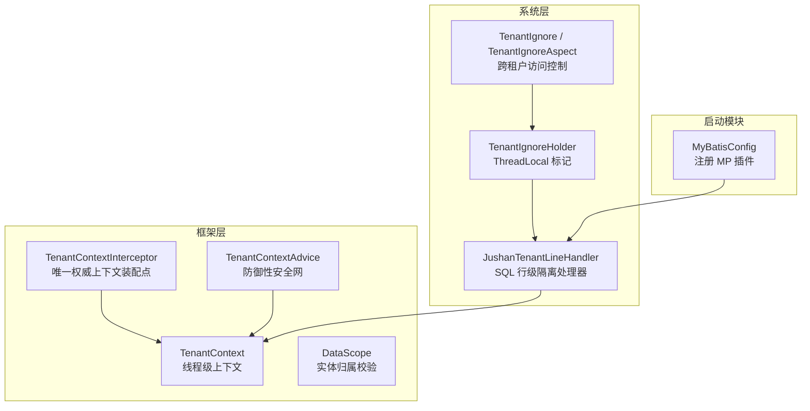
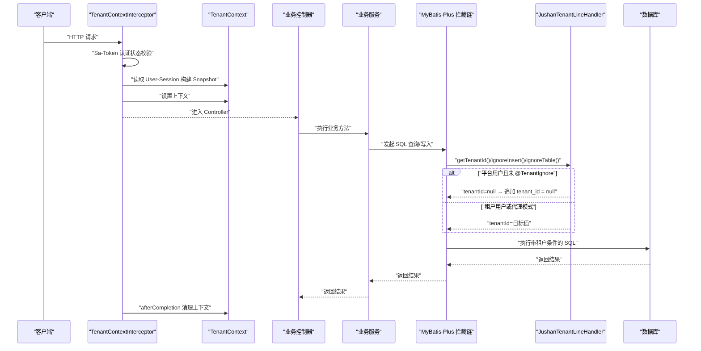
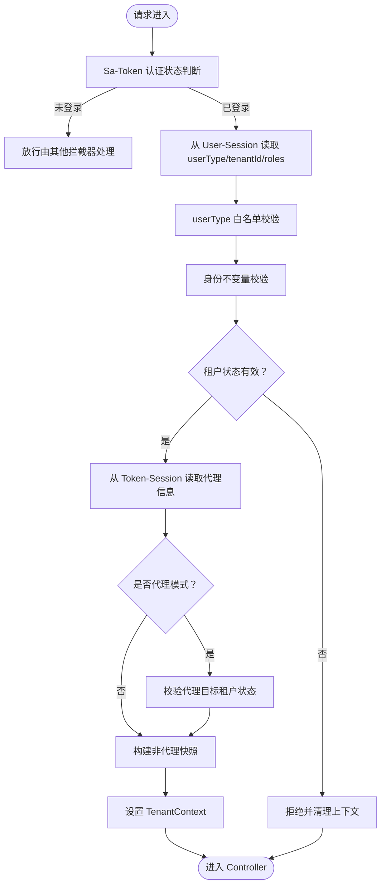
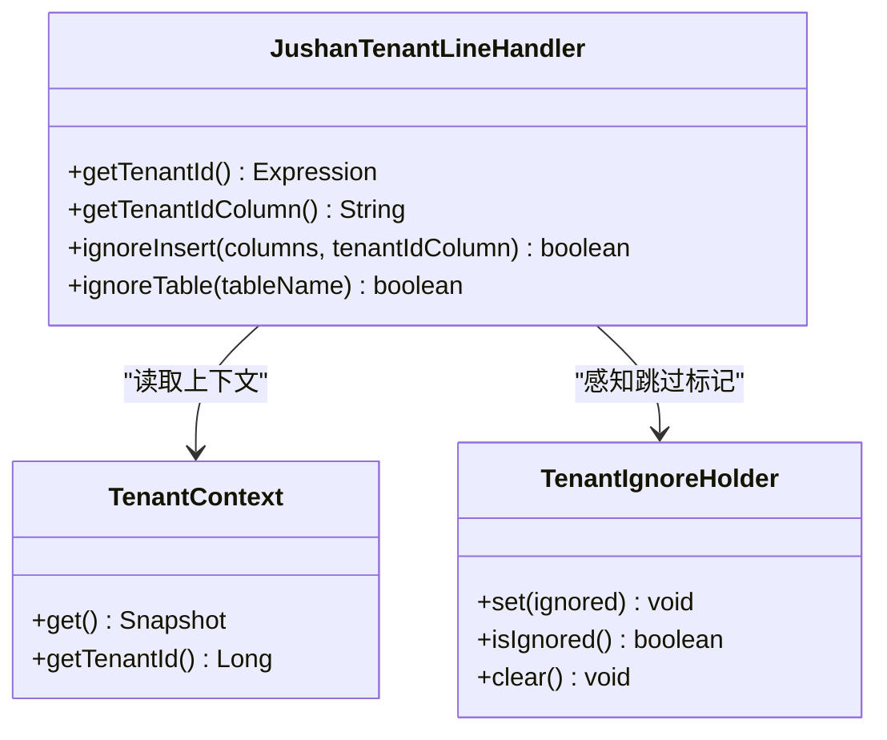
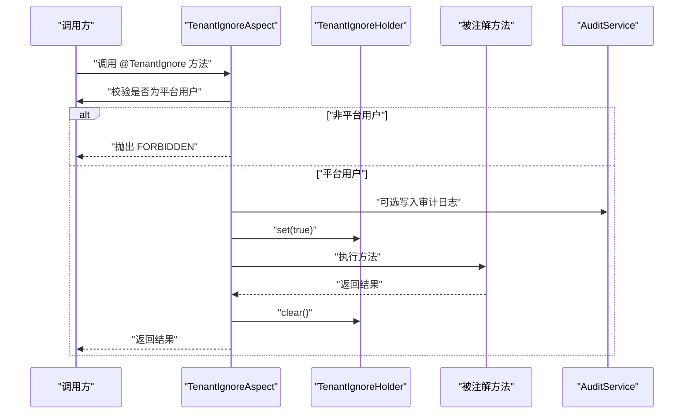
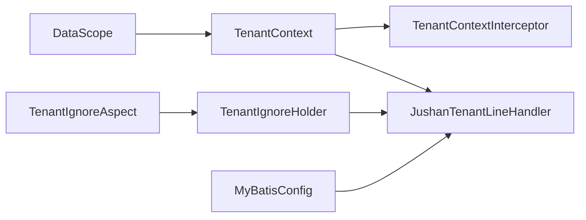

# 多租户数据隔离

<cite>
**本文引用的文件**
- [TenantContext.java](file://parking-framework/src/main/java/com/jushan/framework/auth/TenantContext.java)
- [TenantContextInterceptor.java](file://parking-framework/src/main/java/com/jushan/framework/auth/TenantContextInterceptor.java)
- [TenantContextFilter.java](file://parking-framework/src/main/java/com/jushan/framework/auth/TenantContextFilter.java)
- [TenantContextAdvice.java](file://parking-framework/src/main/java/com/jushan/framework/auth/TenantContextAdvice.java)
- [DataScope.java](file://parking-framework/src/main/java/com/jushan/framework/auth/DataScope.java)
- [MyBatisConfig.java](file://parking-boot/src/main/java/com/jushan/boot/config/MyBatisConfig.java)
- [JushanTenantLineHandler.java](file://parking-system/src/main/java/com/jushan/system/mybatis/JushanTenantLineHandler.java)
- [TenantIgnore.java](file://parking-system/src/main/java/com/jushan/system/mybatis/TenantIgnore.java)
- [TenantIgnoreAspect.java](file://parking-system/src/main/java/com/jushan/system/mybatis/TenantIgnoreAspect.java)
- [TenantIgnoreHolder.java](file://parking-system/src/main/java/com/jushan/system/mybatis/TenantIgnoreHolder.java)
- [TenantService.java](file://parking-system/src/main/java/com/jushan/system/service/TenantService.java)
</cite>

## 目录
1. [简介](#简介)
2. [项目结构](#项目结构)
3. [核心组件](#核心组件)
4. [架构总览](#架构总览)
5. [详细组件分析](#详细组件分析)
6. [依赖关系分析](#依赖关系分析)
7. [性能考量](#性能考量)
8. [故障排查指南](#故障排查指南)
9. [结论](#结论)
10. [附录：配置与最佳实践](#附录配置与最佳实践)

## 简介
本文件系统性阐述多租户数据隔离方案，覆盖以下关键主题：
- 租户上下文传递机制：请求头解析、上下文设置与清理
- 数据隔离实现策略：SQL 自动注入、MyBatis 插件拦截
- 租户标识来源与验证逻辑
- 跨服务调用中的租户信息传递
- 租户切换与边界检查机制
- 安全风险与防护措施
- 配置示例与最佳实践

## 项目结构
本项目在多租户能力上采用“框架层 + 系统层 + 启动模块”的分层组织方式：
- 框架层（parking-framework）：提供可信的租户上下文、拦截器与校验工具
- 系统层（parking-system）：实现业务相关的注解、AOP 切面与 MyBatis 处理器
- 启动模块（parking-boot）：注册 MyBatis-Plus 插件，装配多租户拦截链

图表来源
- [TenantContext.java:1-257](file://parking-framework/src/main/java/com/jushan/framework/auth/TenantContext.java#L1-L257)
- [TenantContextInterceptor.java:1-239](file://parking-framework/src/main/java/com/jushan/framework/auth/TenantContextInterceptor.java#L1-L239)
- [TenantContextAdvice.java:12-43](file://parking-framework/src/main/java/com/jushan/framework/auth/TenantContextAdvice.java#L12-L43)
- [DataScope.java:31-56](file://parking-framework/src/main/java/com/jushan/framework/auth/DataScope.java#L31-L56)
- [JushanTenantLineHandler.java:1-116](file://parking-system/src/main/java/com/jushan/system/mybatis/JushanTenantLineHandler.java#L1-L116)
- [TenantIgnore.java:1-38](file://parking-system/src/main/java/com/jushan/system/mybatis/TenantIgnore.java#L1-L38)
- [TenantIgnoreAspect.java:1-103](file://parking-system/src/main/java/com/jushan/system/mybatis/TenantIgnoreAspect.java#L1-L103)
- [TenantIgnoreHolder.java:1-41](file://parking-system/src/main/java/com/jushan/system/mybatis/TenantIgnoreHolder.java#L1-L41)
- [MyBatisConfig.java:1-88](file://parking-boot/src/main/java/com/jushan/boot/config/MyBatisConfig.java#L1-L88)

章节来源
- [TenantContext.java:1-257](file://parking-framework/src/main/java/com/jushan/framework/auth/TenantContext.java#L1-L257)
- [TenantContextInterceptor.java:1-239](file://parking-framework/src/main/java/com/jushan/framework/auth/TenantContextInterceptor.java#L1-L239)
- [MyBatisConfig.java:1-88](file://parking-boot/src/main/java/com/jushan/boot/config/MyBatisConfig.java#L1-L88)

## 核心组件
- 可信租户上下文（TenantContext）
  - 以 ThreadLocal 保存不可变快照 Snapshot，包含 tenantId、userId、userType、roles、代理信息等
  - 提供 requireTenantId()/requireUserId() 等强制推导方法，确保 fail-close
  - 明确平台用户与租户用户的不变量，并支持 capture()/restore() 用于异步场景
- 上下文装配拦截器（TenantContextInterceptor）
  - 唯一权威装配点：基于 Sa-Token 认证状态与 User-Session 填充上下文
  - 严格白名单校验 userType，校验用户/租户状态，处理代理模式
  - afterCompletion 兜底清理，防止线程复用导致上下文串扰
- SQL 行级隔离处理器（JushanTenantLineHandler）
  - 从 TenantContext 获取 tenantId，平台用户默认返回 null，实现 fail-closed
  - ignoreInsert 在无明确租户上下文时不自动注入 tenant_id，避免重复列或越权
  - ignoreTable 白名单跳过全局表
- 跨租户访问控制（@TenantIgnore + TenantIgnoreAspect）
  - 仅允许平台用户通过注解显式跳过租户拦截，记录审计日志
  - 使用 TenantIgnoreHolder 在方法执行期间标记跳过
- 实体归属校验（DataScope）
  - 校验实体是否属于当前租户；平台用户需显式确认身份才允许跨租户访问
- MyBatis-Plus 插件装配（MyBatisConfig）
  - 注册 TenantLineInnerInterceptor 与 PaginationInnerInterceptor
  - 支持通过配置开关 jushan.tenant.line.enabled 关闭 SQL 级隔离

章节来源
- [TenantContext.java:1-257](file://parking-framework/src/main/java/com/jushan/framework/auth/TenantContext.java#L1-L257)
- [TenantContextInterceptor.java:1-239](file://parking-framework/src/main/java/com/jushan/framework/auth/TenantContextInterceptor.java#L1-L239)
- [JushanTenantLineHandler.java:1-116](file://parking-system/src/main/java/com/jushan/system/mybatis/JushanTenantLineHandler.java#L1-L116)
- [TenantIgnore.java:1-38](file://parking-system/src/main/java/com/jushan/system/mybatis/TenantIgnore.java#L1-L38)
- [TenantIgnoreAspect.java:1-103](file://parking-system/src/main/java/com/jushan/system/mybatis/TenantIgnoreAspect.java#L1-L103)
- [TenantIgnoreHolder.java:1-41](file://parking-system/src/main/java/com/jushan/system/mybatis/TenantIgnoreHolder.java#L1-L41)
- [DataScope.java:31-56](file://parking-framework/src/main/java/com/jushan/framework/auth/DataScope.java#L31-L56)
- [MyBatisConfig.java:1-88](file://parking-boot/src/main/java/com/jushan/boot/config/MyBatisConfig.java#L1-L88)

## 架构总览
下图展示一次 HTTP 请求中租户上下文的完整生命周期与数据隔离路径。

图表来源
- [TenantContextInterceptor.java:64-199](file://parking-framework/src/main/java/com/jushan/framework/auth/TenantContextInterceptor.java#L64-L199)
- [TenantContext.java:94-205](file://parking-framework/src/main/java/com/jushan/framework/auth/TenantContext.java#L94-L205)
- [JushanTenantLineHandler.java:72-114](file://parking-system/src/main/java/com/jushan/system/mybatis/JushanTenantLineHandler.java#L72-L114)
- [MyBatisConfig.java:57-75](file://parking-boot/src/main/java/com/jushan/boot/config/MyBatisConfig.java#L57-L75)

## 详细组件分析

### 组件一：租户上下文装配与生命周期
- 权威装配点
  - 使用 StpUtil.isLogin() 判定认证状态，不再手动解析 Header/Cookie
  - 从 User-Session 读取 userType、tenantId、roles，与登录写入一致
  - 从 Token-Session 读取代理信息（operatorId/operatorName/targetTenantId），不同 Token 互不影响
- 身份不变量与校验
  - platform：userType="platform"，tenantId=null，isProxy=false
  - tenant：userType="tenant"，tenantId≠null，isProxy=false
  - proxy：userType="platform"，tenantId=proxyTargetTenantId，isProxy=true
- 生命周期
  - preHandle：填充上下文（失败时主动清理）
  - afterCompletion：兜底清理（成功路径和异常均执行）

图表来源
- [TenantContextInterceptor.java:64-199](file://parking-framework/src/main/java/com/jushan/framework/auth/TenantContextInterceptor.java#L64-L199)
- [TenantContext.java:104-178](file://parking-framework/src/main/java/com/jushan/framework/auth/TenantContext.java#L104-L178)

章节来源
- [TenantContextInterceptor.java:1-239](file://parking-framework/src/main/java/com/jushan/framework/auth/TenantContextInterceptor.java#L1-L239)
- [TenantContext.java:1-257](file://parking-framework/src/main/java/com/jushan/framework/auth/TenantContext.java#L1-L257)

### 组件二：SQL 自动注入与 MyBatis 插件拦截
- 插件装配
  - 通过 MyBatisConfig 注册 TenantLineInnerInterceptor 与 PaginationInnerInterceptor
  - 支持 jushan.tenant.line.enabled 开关，可回退到 Service 层手动校验
- 行级隔离处理器
  - getTenantId：从 TenantContext 获取 tenantId；平台用户返回 null，实现 fail-closed
  - ignoreInsert：无明确租户上下文时不自动注入 tenant_id，避免重复列或越权
  - ignoreTable：白名单跳过全局表（如 sys_role、sys_permission 等）

图表来源
- [JushanTenantLineHandler.java:72-114](file://parking-system/src/main/java/com/jushan/system/mybatis/JushanTenantLineHandler.java#L72-L114)
- [TenantContext.java:94-127](file://parking-framework/src/main/java/com/jushan/framework/auth/TenantContext.java#L94-L127)
- [TenantIgnoreHolder.java:14-40](file://parking-system/src/main/java/com/jushan/system/mybatis/TenantIgnoreHolder.java#L14-L40)

章节来源
- [MyBatisConfig.java:57-86](file://parking-boot/src/main/java/com/jushan/boot/config/MyBatisConfig.java#L57-L86)
- [JushanTenantLineHandler.java:1-116](file://parking-system/src/main/java/com/jushan/system/mybatis/JushanTenantLineHandler.java#L1-L116)

### 组件三：跨租户访问控制（@TenantIgnore）
- 注解定义
  - reason：必填，用于审计说明
  - audit：默认开启，自动写入审计日志
- AOP 切面
  - 前置校验：仅平台用户允许 bypass；租户用户直接拒绝
  - 设置 TenantIgnoreHolder 标记，方法结束后清理
  - 可选审计日志写入，失败不阻塞主流程

图表来源
- [TenantIgnore.java:24-37](file://parking-system/src/main/java/com/jushan/system/mybatis/TenantIgnore.java#L24-L37)
- [TenantIgnoreAspect.java:40-81](file://parking-system/src/main/java/com/jushan/system/mybatis/TenantIgnoreAspect.java#L40-L81)
- [TenantIgnoreHolder.java:14-40](file://parking-system/src/main/java/com/jushan/system/mybatis/TenantIgnoreHolder.java#L14-L40)

章节来源
- [TenantIgnore.java:1-38](file://parking-system/src/main/java/com/jushan/system/mybatis/TenantIgnore.java#L1-L38)
- [TenantIgnoreAspect.java:1-103](file://parking-system/src/main/java/com/jushan/system/mybatis/TenantIgnoreAspect.java#L1-L103)

### 组件四：实体归属校验（DataScope）
- 设计要点
  - 未初始化上下文直接拒绝（fail-close）
  - 平台用户需显式 isPlatformUser() 才允许跨租户访问
  - 租户用户要求实体 tenantId 与上下文完全匹配
- 典型用法
  - 在 Service 层对实体进行归属校验，防止越权更新/删除

章节来源
- [DataScope.java:31-56](file://parking-framework/src/main/java/com/jushan/framework/auth/DataScope.java#L31-L56)

### 组件五：历史兼容与防御性 Advice
- TenantContextFilter（已弃用）
  - 保留作为历史参考，不再注册到 Servlet 容器
  - 弃用原因：运行在 SaInterceptor 之前、硬编码 Authorization、异常无法统一捕获、与 Interceptor 形成竞争链路
- TenantContextAdvice（防御性安全网）
  - 不再主动填充上下文，仅做防御性检查
  - 若上下文意外为空且用户已认证，记录 WARN 日志但不覆盖，交由 requireTenantId() fail-close

章节来源
- [TenantContextFilter.java:1-138](file://parking-framework/src/main/java/com/jushan/framework/auth/TenantContextFilter.java#L1-L138)
- [TenantContextAdvice.java:12-43](file://parking-framework/src/main/java/com/jushan/framework/auth/TenantContextAdvice.java#L12-L43)

### 组件六：跨服务调用中的租户信息传递
- 原则
  - 所有下游服务必须信任上游传入的租户上下文，不得从前端参数直接读取
  - 建议在网关/服务间调用处将 TenantContext.Snapshot 序列化后随请求传递
- 建议做法
  - 在 Feign/RestTemplate 拦截器中读取 TenantContext.capture()，放入请求头或消息体
  - 下游服务在入口拦截器中 restore(snapshot)，保持上下文一致性
  - 对于异步任务、消息消费、定时任务，必须在调用前 restore(capture())

[本节为通用指导，不直接分析具体文件]

### 组件七：租户切换与边界检查
- 代理模式
  - 代理模式下，tenantId 替换为目标租户 ID，使 DataScope 校验通过
  - 代理只允许平台身份用户启动，目标租户需处于有效状态
- 边界检查
  - 平台用户默认无法访问业务表（fail-closed），必须显式 @TenantIgnore 才能跨租户
  - 租户用户禁止 bypass，任何绕过尝试将被拒绝

章节来源
- [TenantContextInterceptor.java:150-199](file://parking-framework/src/main/java/com/jushan/framework/auth/TenantContextInterceptor.java#L150-L199)
- [TenantIgnoreAspect.java:40-60](file://parking-system/src/main/java/com/jushan/system/mybatis/TenantIgnoreAspect.java#L40-L60)

## 依赖关系分析
- 组件耦合与内聚
  - TenantContext 为核心内聚对象，被 Interceptor、Handler、Advice 共同依赖
  - JushanTenantLineHandler 强依赖 TenantContext 与 TenantIgnoreHolder
  - MyBatisConfig 负责装配插件，弱依赖 JushanTenantLineHandler
- 外部依赖
  - Sa-Token：认证与会话管理
  - MyBatis-Plus：SQL 拦截与分页
- 潜在循环依赖
  - 当前未见循环导入；AOP 切面与处理器通过 ThreadLocal 解耦

图表来源
- [TenantContext.java:1-257](file://parking-framework/src/main/java/com/jushan/framework/auth/TenantContext.java#L1-L257)
- [TenantContextInterceptor.java:1-239](file://parking-framework/src/main/java/com/jushan/framework/auth/TenantContextInterceptor.java#L1-L239)
- [JushanTenantLineHandler.java:1-116](file://parking-system/src/main/java/com/jushan/system/mybatis/JushanTenantLineHandler.java#L1-L116)
- [TenantIgnoreAspect.java:1-103](file://parking-system/src/main/java/com/jushan/system/mybatis/TenantIgnoreAspect.java#L1-L103)
- [TenantIgnoreHolder.java:1-41](file://parking-system/src/main/java/com/jushan/system/mybatis/TenantIgnoreHolder.java#L1-L41)
- [MyBatisConfig.java:1-88](file://parking-boot/src/main/java/com/jushan/boot/config/MyBatisConfig.java#L1-L88)
- [DataScope.java:31-56](file://parking-framework/src/main/java/com/jushan/framework/auth/DataScope.java#L31-L56)

章节来源
- [TenantContext.java:1-257](file://parking-framework/src/main/java/com/jushan/framework/auth/TenantContext.java#L1-L257)
- [TenantContextInterceptor.java:1-239](file://parking-framework/src/main/java/com/jushan/framework/auth/TenantContextInterceptor.java#L1-L239)
- [JushanTenantLineHandler.java:1-116](file://parking-system/src/main/java/com/jushan/system/mybatis/JushanTenantLineHandler.java#L1-L116)
- [TenantIgnoreAspect.java:1-103](file://parking-system/src/main/java/com/jushan/system/mybatis/TenantIgnoreAspect.java#L1-L103)
- [TenantIgnoreHolder.java:1-41](file://parking-system/src/main/java/com/jushan/system/mybatis/TenantIgnoreHolder.java#L1-L41)
- [MyBatisConfig.java:1-88](file://parking-boot/src/main/java/com/jushan/boot/config/MyBatisConfig.java#L1-L88)
- [DataScope.java:31-56](file://parking-framework/src/main/java/com/jushan/framework/auth/DataScope.java#L31-L56)

## 性能考量
- SQL 注入开销
  - 多租户条件注入发生在 SQL 解析阶段，影响较小；但需确保忽略表白名单准确，避免误注入
- 分页限制
  - 通过 PaginationInnerInterceptor 设置最大页大小，防止深度分页拖垮数据库
- 上下文操作
  - ThreadLocal 读写开销极低；务必在 finally 中清理，避免线程池复用导致的上下文污染

[本节为通用指导，不直接分析具体文件]

## 故障排查指南
- 常见问题
  - 上下文为空：检查 Interceptor 是否注册、Sa-Token 是否生效、User-Session 是否包含必要键
  - 平台用户无法查数据：确认是否使用了 @TenantIgnore 且具备审计记录
  - 租户用户越权：检查 DataScope 校验是否遗漏
- 定位步骤
  - 查看 Interceptor 日志输出（preHandle/afterCompletion）
  - 检查 Handler 的 ignoreTable 白名单是否覆盖所有全局表
  - 核对 @TenantIgnore 的 reason 审计日志

章节来源
- [TenantContextInterceptor.java:194-205](file://parking-framework/src/main/java/com/jushan/framework/auth/TenantContextInterceptor.java#L194-L205)
- [JushanTenantLineHandler.java:107-114](file://parking-system/src/main/java/com/jushan/system/mybatis/JushanTenantLineHandler.java#L107-L114)
- [TenantIgnoreAspect.java:62-81](file://parking-system/src/main/java/com/jushan/system/mybatis/TenantIgnoreAspect.java#L62-L81)

## 结论
本方案通过“权威装配 + 行级隔离 + 显式绕过 + 实体校验”的多层防护，实现了严格的多租户数据隔离。关键要点包括：
- 唯一权威装配点，杜绝多链路竞争
- 平台用户默认 fail-closed，跨租户必须显式声明并审计
- 代理模式限定目标租户范围，不具备平台全局权限
- 完善的清理与校验机制，保障线程安全与边界正确

[本节为总结，不直接分析具体文件]

## 附录：配置与最佳实践

### 配置项
- 启用/关闭 SQL 级租户隔离
  - 名称：jushan.tenant.line.enabled
  - 类型：boolean
  - 默认：true
  - 说明：关闭后将回退到 Service 层手动校验
- 全局表白名单（逗号分隔）
  - 名称：jushan.tenant.ignore-tables
  - 类型：string
  - 默认：空
  - 说明：补充默认白名单之外的全局表名（小写）

章节来源
- [MyBatisConfig.java:57-86](file://parking-boot/src/main/java/com/jushan/boot/config/MyBatisConfig.java#L57-L86)

### 最佳实践
- 始终通过 TenantContext 获取租户标识，严禁从前端参数读取
- 需要跨租户访问的方法使用 @TenantIgnore，并填写 reason；必要时关闭审计
- 在 Service 层对实体进行 DataScope 校验，确保更新/删除的归属正确
- 异步任务、消息消费、定时任务在调用前 capture()，并在子线程 restore()
- 跨服务调用时，将 TenantContext.Snapshot 序列化至请求头或消息体，下游入口恢复上下文
- 定期审查 ignoreTable 白名单，确保无遗漏的全局表

[本节为通用指导，不直接分析具体文件]