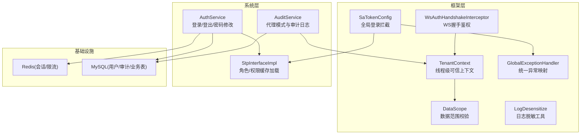
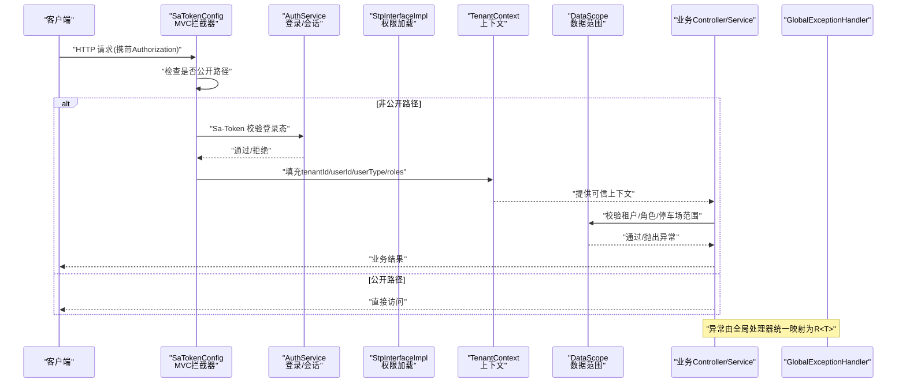
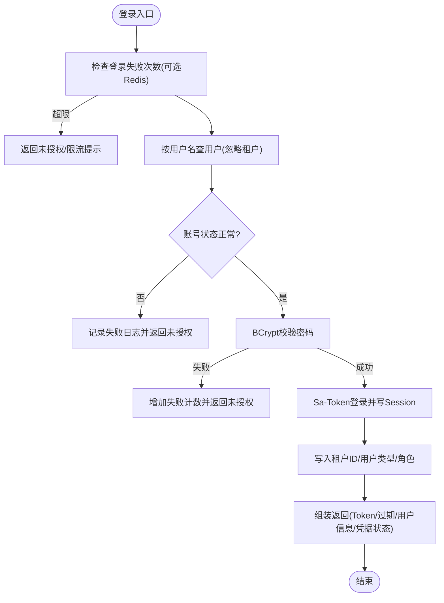
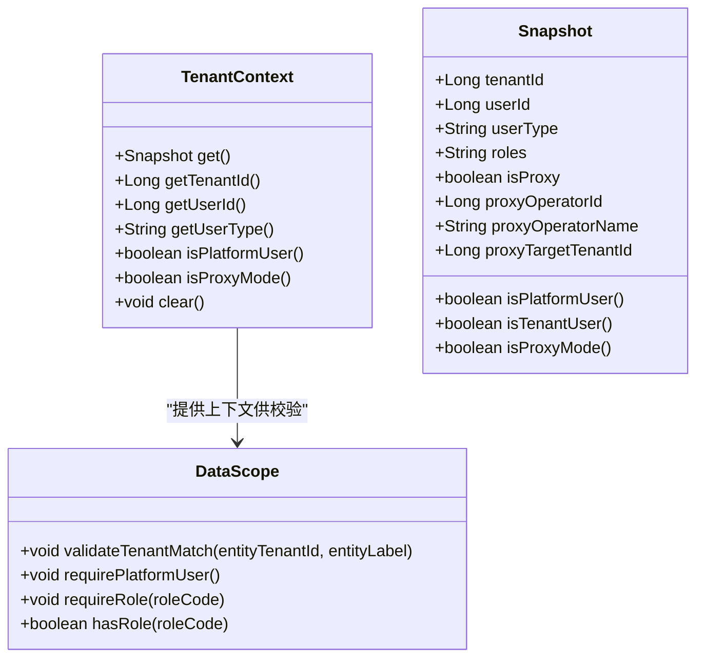
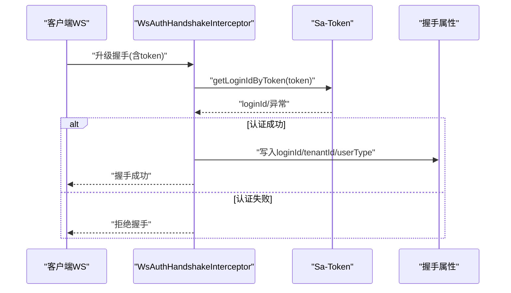
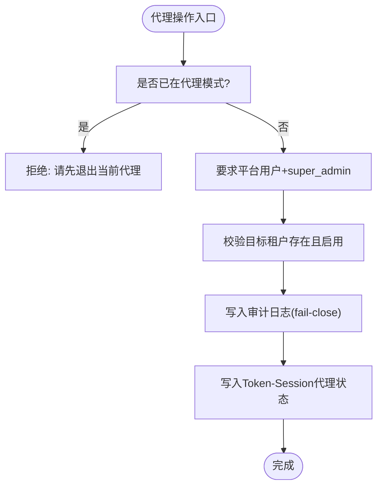
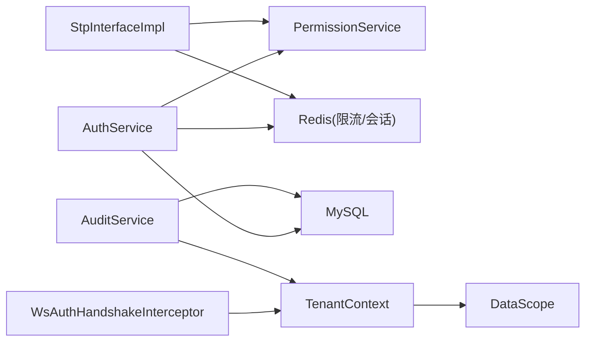

# 安全架构

<cite>
**本文引用的文件**   
- [SaTokenConfig.java](file://parking-framework/src/main/java/com/jushan/framework/auth/SaTokenConfig.java)
- [StpInterfaceImpl.java](file://parking-system/src/main/java/com/jushan/system/service/StpInterfaceImpl.java)
- [AuthService.java](file://parking-system/src/main/java/com/jushan/system/service/AuthService.java)
- [LoginResult.java](file://parking-system/src/main/java/com/jushan/system/dto/LoginResult.java)
- [TenantContext.java](file://parking-framework/src/main/java/com/jushan/framework/auth/TenantContext.java)
- [DataScope.java](file://parking-framework/src/main/java/com/jushan/framework/auth/DataScope.java)
- [GlobalExceptionHandler.java](file://parking-framework/src/main/java/com/jushan/framework/web/GlobalExceptionHandler.java)
- [LogDesensitize.java](file://parking-framework/src/main/java/com/jushan/framework/web/LogDesensitize.java)
- [WsAuthHandshakeInterceptor.java](file://parking-framework/src/main/java/com/jushan/framework/ws/WsAuthHandshakeInterceptor.java)
- [AuditService.java](file://parking-system/src/main/java/com/jushan/system/service/AuditService.java)
- [V20260711002__sys_user_and_login_log.sql](file://parking-boot/src/main/resources/db/migration/V20260711002__sys_user_and_login_log.sql)
- [V20260711013__credential_status.sql](file://parking-boot/src/main/resources/db/migration/V20260711013__credential_status.sql)
- [WebSocketInfrastructureTest.java](file://parking-boot/src/test/java/com/jushan/boot/ws/WebSocketInfrastructureTest.java)
- [TenantContextIntegrationTest.java](file://parking-boot/src/test/java/com/jushan/boot/controller/TenantContextIntegrationTest.java)
</cite>

## 目录
1. [引言](#引言)
2. [项目结构](#项目结构)
3. [核心组件](#核心组件)
4. [架构总览](#架构总览)
5. [详细组件分析](#详细组件分析)
6. [依赖关系分析](#依赖关系分析)
7. [性能与安全权衡](#性能与安全权衡)
8. [故障排查指南](#故障排查指南)
9. [结论](#结论)
10. [附录](#附录)

## 引言
本安全架构文档围绕认证授权、多租户数据隔离、API 安全防护、敏感数据保护、WebSocket 连接安全以及审计日志保障展开，结合 Sa-Token 实现方案与框架层能力，给出端到端的安全设计说明与落地要点。

## 项目结构
本项目采用分层模块化组织：
- parking-framework：提供安全与通用能力（认证拦截、租户上下文、全局异常处理、日志脱敏、WebSocket 握手鉴权等）
- parking-system：业务领域实现（认证服务、权限加载、审计服务、控制器与实体等）
- parking-boot：启动入口与数据库迁移脚本
- 前端工程（admin-web、booth-web、miniapp）通过 HTTP/WS 调用后端 API

图表来源
- [SaTokenConfig.java:1-65](file://parking-framework/src/main/java/com/jushan/framework/auth/SaTokenConfig.java#L1-L65)
- [StpInterfaceImpl.java:1-107](file://parking-system/src/main/java/com/jushan/system/service/StpInterfaceImpl.java#L1-L107)
- [AuthService.java:1-361](file://parking-system/src/main/java/com/jushan/system/service/AuthService.java#L1-L361)
- [TenantContext.java:1-257](file://parking-framework/src/main/java/com/jushan/framework/auth/TenantContext.java#L1-L257)
- [DataScope.java:1-240](file://parking-framework/src/main/java/com/jushan/framework/auth/DataScope.java#L1-L240)
- [GlobalExceptionHandler.java:1-240](file://parking-framework/src/main/java/com/jushan/framework/web/GlobalExceptionHandler.java#L1-L240)
- [LogDesensitize.java:1-106](file://parking-framework/src/main/java/com/jushan/framework/web/LogDesensitize.java#L1-L106)
- [WsAuthHandshakeInterceptor.java:1-140](file://parking-framework/src/main/java/com/jushan/framework/ws/WsAuthHandshakeInterceptor.java#L1-L140)
- [AuditService.java:1-418](file://parking-system/src/main/java/com/jushan/system/service/AuditService.java#L1-L418)

章节来源
- [SaTokenConfig.java:1-65](file://parking-framework/src/main/java/com/jushan/framework/auth/SaTokenConfig.java#L1-L65)
- [StpInterfaceImpl.java:1-107](file://parking-system/src/main/java/com/jushan/system/service/StpInterfaceImpl.java#L1-L107)
- [AuthService.java:1-361](file://parking-system/src/main/java/com/jushan/system/service/AuthService.java#L1-L361)
- [TenantContext.java:1-257](file://parking-framework/src/main/java/com/jushan/framework/auth/TenantContext.java#L1-L257)
- [DataScope.java:1-240](file://parking-framework/src/main/java/com/jushan/framework/auth/DataScope.java#L1-L240)
- [GlobalExceptionHandler.java:1-240](file://parking-framework/src/main/java/com/jushan/framework/web/GlobalExceptionHandler.java#L1-L240)
- [LogDesensitize.java:1-106](file://parking-framework/src/main/java/com/jushan/framework/web/LogDesensitize.java#L1-L106)
- [WsAuthHandshakeInterceptor.java:1-140](file://parking-framework/src/main/java/com/jushan/framework/ws/WsAuthHandshakeInterceptor.java#L1-L140)
- [AuditService.java:1-418](file://parking-system/src/main/java/com/jushan/system/service/AuditService.java#L1-L418)

## 核心组件
- 认证与会话
  - Sa-Token 全局拦截器负责登录态校验，公开路径白名单控制
  - 登录流程完成凭据校验、失败次数限制、会话建立与上下文写入
  - 角色与权限从数据库加载并缓存至 Session，减少重复查询
- 多租户与数据范围
  - 基于 ThreadLocal 的可信上下文承载 tenantId、userId、userType、roles 及代理信息
  - DataScope 提供 fail-close 的租户匹配与平台用户强制校验
- 全局异常与参数校验
  - 统一将参数校验、业务异常、未登录/无权限等转换为标准响应
- 敏感信息与日志脱敏
  - 提供手机号、身份证、Token、密钥等脱敏方法，禁止明文输出
- WebSocket 安全
  - 握手阶段强制校验 Token，拒绝匿名连接，并将上下文注入后续通道
- 审计与代理模式
  - 超级管理员可进入“代操作”模式，目标租户范围受限且审计强一致

章节来源
- [SaTokenConfig.java:1-65](file://parking-framework/src/main/java/com/jushan/framework/auth/SaTokenConfig.java#L1-L65)
- [AuthService.java:1-361](file://parking-system/src/main/java/com/jushan/system/service/AuthService.java#L1-L361)
- [StpInterfaceImpl.java:1-107](file://parking-system/src/main/java/com/jushan/system/service/StpInterfaceImpl.java#L1-L107)
- [TenantContext.java:1-257](file://parking-framework/src/main/java/com/jushan/framework/auth/TenantContext.java#L1-L257)
- [DataScope.java:1-240](file://parking-framework/src/main/java/com/jushan/framework/auth/DataScope.java#L1-L240)
- [GlobalExceptionHandler.java:1-240](file://parking-framework/src/main/java/com/jushan/framework/web/GlobalExceptionHandler.java#L1-L240)
- [LogDesensitize.java:1-106](file://parking-framework/src/main/java/com/jushan/framework/web/LogDesensitize.java#L1-L106)
- [WsAuthHandshakeInterceptor.java:1-140](file://parking-framework/src/main/java/com/jushan/framework/ws/WsAuthHandshakeInterceptor.java#L1-L140)
- [AuditService.java:1-418](file://parking-system/src/main/java/com/jushan/system/service/AuditService.java#L1-L418)

## 架构总览
下图展示一次受保护的 API 请求在安全链路上的流转：从 Sa-Token 登录态校验，到租户上下文装配、数据范围校验、业务处理与异常统一返回。

图表来源
- [SaTokenConfig.java:1-65](file://parking-framework/src/main/java/com/jushan/framework/auth/SaTokenConfig.java#L1-L65)
- [AuthService.java:1-361](file://parking-system/src/main/java/com/jushan/system/service/AuthService.java#L1-L361)
- [StpInterfaceImpl.java:1-107](file://parking-system/src/main/java/com/jushan/system/service/StpInterfaceImpl.java#L1-L107)
- [TenantContext.java:1-257](file://parking-framework/src/main/java/com/jushan/framework/auth/TenantContext.java#L1-L257)
- [DataScope.java:1-240](file://parking-framework/src/main/java/com/jushan/framework/auth/DataScope.java#L1-L240)
- [GlobalExceptionHandler.java:1-240](file://parking-framework/src/main/java/com/jushan/framework/web/GlobalExceptionHandler.java#L1-L240)

## 详细组件分析

### 认证与授权（Sa-Token）
- 登录流程
  - 输入校验与限流：基于 Redis 的失败计数窗口，超限则拒绝
  - 账号状态与密码校验：BCrypt 比对，失败记录登录日志
  - 会话建立：写入设备标识、租户上下文、用户类型与角色
  - 返回 Token 与过期时间，附带凭据状态（首次登录需改密）
- 权限加载
  - 首次从数据库加载角色与权限，缓存至 Sa-Token Session
  - 支持按 loginId 读取 Session 进行快速鉴权
- 退出与改密
  - 退出使 Token 立即失效；改密后强制注销所有会话

图表来源
- [AuthService.java:1-361](file://parking-system/src/main/java/com/jushan/system/service/AuthService.java#L1-L361)
- [LoginResult.java:1-51](file://parking-system/src/main/java/com/jushan/system/dto/LoginResult.java#L1-L51)
- [V20260711002__sys_user_and_login_log.sql:1-54](file://parking-boot/src/main/resources/db/migration/V20260711002__sys_user_and_login_log.sql#L1-L54)
- [V20260711013__credential_status.sql:1-17](file://parking-boot/src/main/resources/db/migration/V20260711013__credential_status.sql#L1-L17)

章节来源
- [AuthService.java:1-361](file://parking-system/src/main/java/com/jushan/system/service/AuthService.java#L1-L361)
- [LoginResult.java:1-51](file://parking-system/src/main/java/com/jushan/system/dto/LoginResult.java#L1-L51)
- [StpInterfaceImpl.java:1-107](file://parking-system/src/main/java/com/jushan/system/service/StpInterfaceImpl.java#L1-L107)
- [SaTokenConfig.java:1-65](file://parking-framework/src/main/java/com/jushan/framework/auth/SaTokenConfig.java#L1-L65)
- [V20260711002__sys_user_and_login_log.sql:1-54](file://parking-boot/src/main/resources/db/migration/V20260711002__sys_user_and_login_log.sql#L1-L54)
- [V20260711013__credential_status.sql:1-17](file://parking-boot/src/main/resources/db/migration/V20260711013__credential_status.sql#L1-L17)

### 多租户数据隔离与上下文传递
- 上下文来源
  - 登录成功后将 tenantId、userType、roles 写入 User-Session
  - 请求到达时由过滤器/拦截器推导并设置到 TenantContext（ThreadLocal）
- 平台用户 vs 租户用户
  - 平台用户：tenantId 为空，需显式 isPlatformUser() 判定才允许跨租户
  - 租户用户：必须严格限定在本租户范围内
- 代理模式
  - 超级管理员可进入代操作模式，当前数据范围被替换为目标租户
  - 代理模式下不再视为平台用户，不可跨租户访问

图表来源
- [TenantContext.java:1-257](file://parking-framework/src/main/java/com/jushan/framework/auth/TenantContext.java#L1-L257)
- [DataScope.java:1-240](file://parking-framework/src/main/java/com/jushan/framework/auth/DataScope.java#L1-L240)

章节来源
- [TenantContext.java:1-257](file://parking-framework/src/main/java/com/jushan/framework/auth/TenantContext.java#L1-L257)
- [DataScope.java:1-240](file://parking-framework/src/main/java/com/jushan/framework/auth/DataScope.java#L1-L240)
- [TenantContextIntegrationTest.java:494-518](file://parking-boot/src/test/java/com/jushan/boot/controller/TenantContextIntegrationTest.java#L494-L518)

### API 安全防护策略
- 请求签名
  - 当前代码库未发现服务端侧的请求签名校验实现，建议对高敏感接口引入签名与时间戳防重放机制
- 参数校验
  - 使用 @Valid/@NotBlank 等注解，配合 GlobalExceptionHandler 统一返回错误详情
- SQL 注入防护
  - 通过 MyBatis Plus 条件构造器与预编译语句避免拼接 SQL；迁移脚本中未见 SELECT * 滥用
- 全局异常映射
  - 未登录/无权限/参数错误/未知异常均映射为标准 R<T> 响应，不泄露堆栈

章节来源
- [GlobalExceptionHandler.java:1-240](file://parking-framework/src/main/java/com/jushan/framework/web/GlobalExceptionHandler.java#L1-L240)

### 敏感数据保护
- 密码加密
  - 使用 BCrypt 存储哈希值，登录与改密均基于哈希比对
- 日志脱敏
  - 提供手机号、身份证、Token、密钥等脱敏方法，严禁明文输出
- 凭据状态
  - 新增 credential_status 字段，默认密码标记为 EXPIRED，登录后提示强制改密

章节来源
- [AuthService.java:1-361](file://parking-system/src/main/java/com/jushan/system/service/AuthService.java#L1-L361)
- [LogDesensitize.java:1-106](file://parking-framework/src/main/java/com/jushan/framework/web/LogDesensitize.java#L1-L106)
- [V20260711002__sys_user_and_login_log.sql:1-54](file://parking-boot/src/main/resources/db/migration/V20260711002__sys_user_and_login_log.sql#L1-L54)
- [V20260711013__credential_status.sql:1-17](file://parking-boot/src/main/resources/db/migration/V20260711013__credential_status.sql#L1-L17)

### WebSocket 连接安全认证
- 握手鉴权
  - 从 URL 参数或 Authorization 头提取 token，验证有效性后放行
  - 当前已关闭匿名连接（ALLOW_UNAUTHENTICATED=false），测试覆盖匿名拒绝场景
- 上下文注入
  - 握手成功后将 loginId、tenantId、userType 写入握手属性，供后续消息拦截器使用

图表来源
- [WsAuthHandshakeInterceptor.java:1-140](file://parking-framework/src/main/java/com/jushan/framework/ws/WsAuthHandshakeInterceptor.java#L1-L140)
- [WebSocketInfrastructureTest.java:100-163](file://parking-boot/src/test/java/com/jushan/boot/ws/WebSocketInfrastructureTest.java#L100-L163)

章节来源
- [WsAuthHandshakeInterceptor.java:1-140](file://parking-framework/src/main/java/com/jushan/framework/ws/WsAuthHandshakeInterceptor.java#L1-L140)
- [WebSocketInfrastructureTest.java:100-163](file://parking-boot/src/test/java/com/jushan/boot/ws/WebSocketInfrastructureTest.java#L100-L163)

### 审计日志与安全保障
- 代理模式审计
  - 启动/停止代操作均写入审计日志，且采用 fail-close 策略：审计写入失败则拒绝执行
- 通用审计
  - 业务高风险操作完成后调用审计服务记录，自动填充操作人、代理状态、目标租户等
- 查询范围
  - 平台用户可查全平台日志，租户用户仅能查看本租户日志

图表来源
- [AuditService.java:1-418](file://parking-system/src/main/java/com/jushan/system/service/AuditService.java#L1-L418)

章节来源
- [AuditService.java:1-418](file://parking-system/src/main/java/com/jushan/system/service/AuditService.java#L1-L418)

## 依赖关系分析
- 组件耦合
  - AuthService 依赖 PermissionService 获取权限列表，依赖 Redis 做限流（可选）
  - StpInterfaceImpl 依赖 PermissionService 并缓存至 Sa-Token Session
  - TenantContext 与 DataScope 紧密协作，前者提供上下文，后者进行断言
  - WsAuthHandshakeInterceptor 依赖 Sa-Token 与 TenantContext 常量
  - AuditService 依赖 TenantContext 与 Mapper，审计写入失败可按策略 fail-close
- 外部依赖
  - Redis：会话存储、登录失败限流
  - MySQL：用户、审计、业务数据持久化

图表来源
- [AuthService.java:1-361](file://parking-system/src/main/java/com/jushan/system/service/AuthService.java#L1-L361)
- [StpInterfaceImpl.java:1-107](file://parking-system/src/main/java/com/jushan/system/service/StpInterfaceImpl.java#L1-L107)
- [TenantContext.java:1-257](file://parking-framework/src/main/java/com/jushan/framework/auth/TenantContext.java#L1-L257)
- [DataScope.java:1-240](file://parking-framework/src/main/java/com/jushan/framework/auth/DataScope.java#L1-L240)
- [WsAuthHandshakeInterceptor.java:1-140](file://parking-framework/src/main/java/com/jushan/framework/ws/WsAuthHandshakeInterceptor.java#L1-L140)
- [AuditService.java:1-418](file://parking-system/src/main/java/com/jushan/system/service/AuditService.java#L1-L418)

章节来源
- [AuthService.java:1-361](file://parking-system/src/main/java/com/jushan/system/service/AuthService.java#L1-L361)
- [StpInterfaceImpl.java:1-107](file://parking-system/src/main/java/com/jushan/system/service/StpInterfaceImpl.java#L1-L107)
- [TenantContext.java:1-257](file://parking-framework/src/main/java/com/jushan/framework/auth/TenantContext.java#L1-L257)
- [DataScope.java:1-240](file://parking-framework/src/main/java/com/jushan/framework/auth/DataScope.java#L1-L240)
- [WsAuthHandshakeInterceptor.java:1-140](file://parking-framework/src/main/java/com/jushan/framework/ws/WsAuthHandshakeInterceptor.java#L1-L140)
- [AuditService.java:1-418](file://parking-system/src/main/java/com/jushan/system/service/AuditService.java#L1-L418)

## 性能与安全权衡
- 权限缓存
  - 角色与权限首次加载后存入 Session，显著降低鉴权时的数据库压力
- 限流降级
  - 登录失败限流依赖 Redis，不可用时自动降级，保证可用性
- 审计写入
  - 代理操作审计采用 fail-close，确保安全性优先于性能；普通审计失败不影响主流程

[本节为通用指导，无需源码引用]

## 故障排查指南
- 未登录/无权限
  - 检查 Sa-Token 拦截器配置与公开路径白名单
  - 确认 Authorization 头是否正确携带
- 租户越权
  - 核查 TenantContext 是否初始化、isPlatformUser 判定逻辑
  - 使用 DataScope.validateTenantMatch 进行资源归属校验
- WebSocket 连接失败
  - 确认握手参数包含有效 token，且 ALLOW_UNAUTHENTICATED=false
- 审计缺失
  - 检查代理模式审计是否 fail-close 触发，确认审计表写入是否正常

章节来源
- [SaTokenConfig.java:1-65](file://parking-framework/src/main/java/com/jushan/framework/auth/SaTokenConfig.java#L1-L65)
- [TenantContext.java:1-257](file://parking-framework/src/main/java/com/jushan/framework/auth/TenantContext.java#L1-L257)
- [DataScope.java:1-240](file://parking-framework/src/main/java/com/jushan/framework/auth/DataScope.java#L1-L240)
- [WsAuthHandshakeInterceptor.java:1-140](file://parking-framework/src/main/java/com/jushan/framework/ws/WsAuthHandshakeInterceptor.java#L1-L140)
- [AuditService.java:1-418](file://parking-system/src/main/java/com/jushan/system/service/AuditService.java#L1-L418)

## 结论
本安全架构以 Sa-Token 为核心，结合框架层的上下文与数据范围校验、全局异常处理与日志脱敏，形成从认证、授权、隔离到审计的闭环。生产环境应持续完善请求签名、速率限制、SQL 注入防护与敏感数据治理，并通过自动化测试与风险评审保障安全基线。

[本节为总结性内容，无需源码引用]

## 附录
- 威胁模型与防护措施（概念性）
  - 身份冒用：强制登录态校验、Token 有效期管理、WebSocket 握手鉴权
  - 越权访问：租户上下文不可信原则、DataScope 强制校验、平台用户显式判定
  - 暴力破解：登录失败限流、账号锁定/禁用状态检查
  - 数据泄露：日志脱敏、最小化返回字段、凭据状态强制改密
  - 审计缺失：代理操作 fail-close 审计、关键操作留痕
- 参考规范
  - 安全审查清单强调：不信任前端传入的 tenantId/parkingLotId/device SN，禁止 fail-open 鉴权

[本节为概念性内容，无需源码引用]