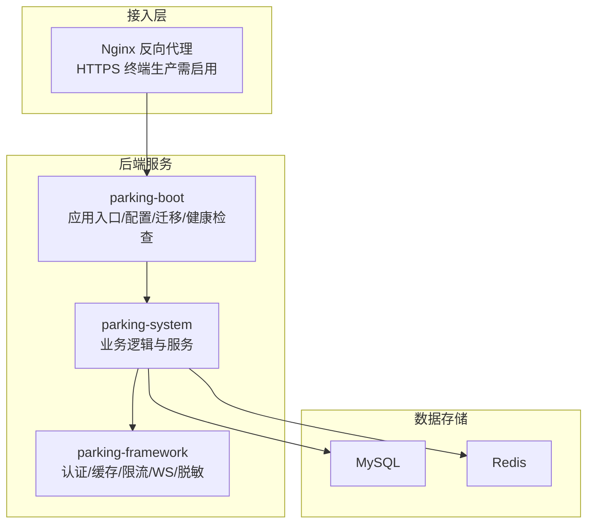
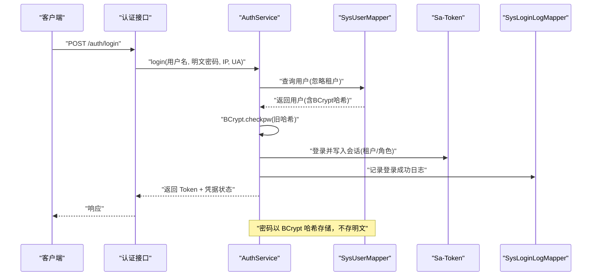
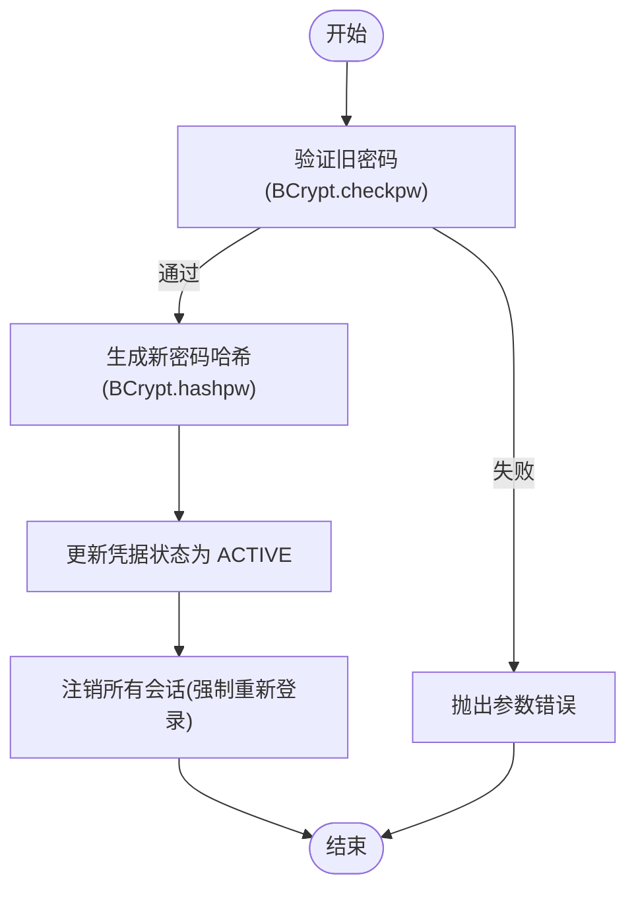
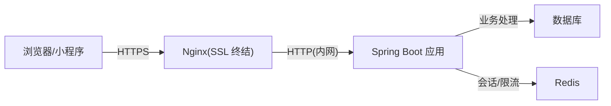
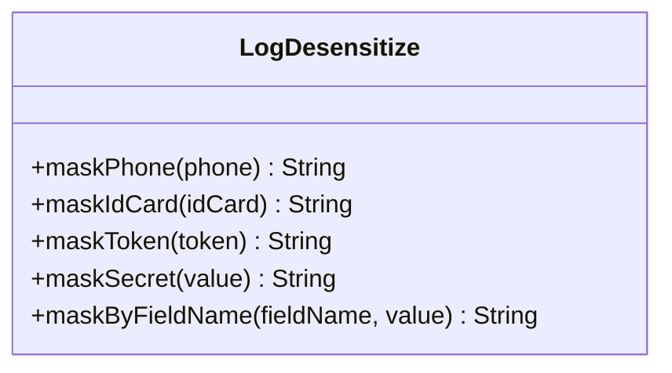
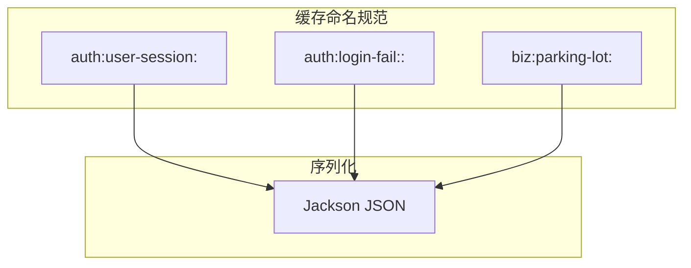
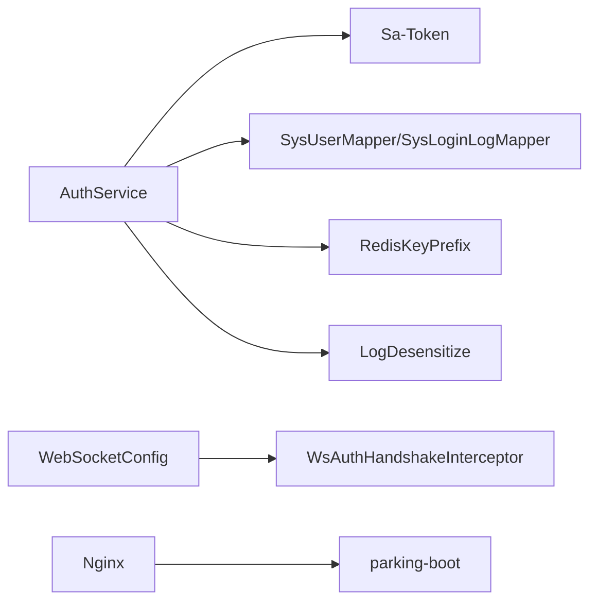

# 数据安全保护

<cite>
**本文引用的文件**   
- [AuthService.java](file://parking-system/src/main/java/com/jushan/system/service/AuthService.java)
- [V20260711002__sys_user_and_login_log.sql](file://parking-boot/src/main/resources/db/migration/V20260711002__sys_user_and_login_log.sql)
- [V20260711013__credential_status.sql](file://parking-boot/src/main/resources/db/migration/V20260711013__credential_status.sql)
- [LogDesensitize.java](file://parking-framework/src/main/java/com/jushan/framework/web/LogDesensitize.java)
- [default.conf](file://docker/nginx/conf.d/default.conf)
- [RedisKeyPrefix.java](file://parking-framework/src/main/java/com/jushan/framework/redis/RedisKeyPrefix.java)
- [application-prod.yml](file://parking-boot/src/main/resources/application-prod.yml)
- [配置说明.md](file://docs/部署运维/配置说明.md)
- [WebSocketConfig.java](file://parking-framework/src/main/java/com/jushan/framework/ws/WebSocketConfig.java)
- [WsAuthHandshakeInterceptor.java](file://parking-framework/src/main/java/com/jushan/framework/ws/WsAuthHandshakeInterceptor.java)
- [CacheNames.java](file://parking-framework/src/main/java/com/jushan/framework/redis/CacheNames.java)
- [RedisConfig.java](file://parking-framework/src/main/java/com/jushan/framework/redis/RedisConfig.java)
- [ReadinessHealthIndicator.java](file://parking-boot/src/main/java/com/jushan/boot/health/ReadinessHealthIndicator.java)
- [TokenDebugTest.java](file://parking-boot/src/test/java/com/jushan/boot/controller/TokenDebugTest.java)
- [AuthControllerIntegrationTest.java](file://parking-boot/src/test/java/com/jushan/boot/controller/AuthControllerIntegrationTest.java)
</cite>

## 目录
1. [引言](#引言)
2. [项目结构](#项目结构)
3. [核心组件](#核心组件)
4. [架构总览](#架构总览)
5. [详细组件分析](#详细组件分析)
6. [依赖关系分析](#依赖关系分析)
7. [性能与安全权衡](#性能与安全权衡)
8. [故障排查指南](#故障排查指南)
9. [结论](#结论)
10. [附录](#附录)

## 引言
本文件面向平台研发与运维人员，系统性梳理并完善“数据安全保护”方案。围绕敏感数据加密存储、传输加密、日志脱敏、数据库字段加密/解密、文件上传安全、缓存数据安全以及备份恢复安全等维度，结合仓库现有实现进行现状分析与改进建议，确保在生产环境具备可落地、可审计、可回滚的安全能力。

## 项目结构
本项目采用多模块分层：
- parking-framework：通用框架（认证、限流、缓存、WebSocket、全局异常、日志脱敏等）
- parking-system：业务域（用户、权限、设备、计费、事件等）
- parking-boot：应用启动、配置、迁移脚本、健康检查
- 前端工程：admin-web、booth-web、miniapp
- 部署：Docker Compose + Nginx 反向代理

图表来源
- [default.conf:1-124](file://docker/nginx/conf.d/default.conf#L1-L124)
- [application-prod.yml:1-46](file://parking-boot/src/main/resources/application-prod.yml#L1-L46)
- [ReadinessHealthIndicator.java:39-70](file://parking-boot/src/main/java/com/jushan/boot/health/ReadinessHealthIndicator.java#L39-L70)

章节来源
- [application-prod.yml:1-46](file://parking-boot/src/main/resources/application-prod.yml#L1-L46)
- [配置说明.md:1-92](file://docs/部署运维/配置说明.md#L1-L92)

## 核心组件
- 密码加密与凭据管理：基于 BCrypt 的哈希存储与校验；支持强制首次修改密码流程与凭据状态标记。
- 登录与会话：Sa-Token 会话管理，登录失败次数限制与窗口过期，审计日志记录。
- 日志脱敏：提供手机号、身份证、Token、密钥类字段的掩码工具与按字段名自动猜测策略。
- 传输通道：Nginx 反向代理统一转发，WebSocket 握手鉴权拦截器预留扩展点。
- 缓存命名与序列化：统一的 Key 前缀与 JSON 序列化，避免跨域混用。
- 健康检查：数据库与 Redis 连通性探测，便于快速定位基础设施问题。

章节来源
- [AuthService.java:1-361](file://parking-system/src/main/java/com/jushan/system/service/AuthService.java#L1-L361)
- [LogDesensitize.java:1-106](file://parking-framework/src/main/java/com/jushan/framework/web/LogDesensitize.java#L1-L106)
- [RedisKeyPrefix.java:1-67](file://parking-framework/src/main/java/com/jushan/framework/redis/RedisKeyPrefix.java#L1-L67)
- [WebSocketConfig.java:44-73](file://parking-framework/src/main/java/com/jushan/framework/ws/WebSocketConfig.java#L44-L73)
- [WsAuthHandshakeInterceptor.java:1-38](file://parking-framework/src/main/java/com/jushan/framework/ws/WsAuthHandshakeInterceptor.java#L1-L38)
- [CacheNames.java:1-39](file://parking-framework/src/main/java/com/jushan/framework/redis/CacheNames.java#L1-L39)
- [RedisConfig.java:1-69](file://parking-framework/src/main/java/com/jushan/framework/redis/RedisConfig.java#L1-L69)
- [ReadinessHealthIndicator.java:39-70](file://parking-boot/src/main/java/com/jushan/boot/health/ReadinessHealthIndicator.java#L39-L70)

## 架构总览
下图展示认证与密码变更的关键调用链，体现 BCrypt 的使用位置、会话写入与审计日志落库。

图表来源
- [AuthService.java:91-176](file://parking-system/src/main/java/com/jushan/system/service/AuthService.java#L91-L176)
- [V20260711002__sys_user_and_login_log.sql:12-41](file://parking-boot/src/main/resources/db/migration/V20260711002__sys_user_and_login_log.sql#L12-L41)

章节来源
- [AuthService.java:91-176](file://parking-system/src/main/java/com/jushan/system/service/AuthService.java#L91-L176)
- [V20260711002__sys_user_and_login_log.sql:12-41](file://parking-boot/src/main/resources/db/migration/V20260711002__sys_user_and_login_log.sql#L12-L41)

## 详细组件分析

### 1. 敏感数据加密存储（密码与盐值）
- 算法选择：使用 BCrypt 对密码进行单向哈希存储，禁止明文落库。
- 盐值管理：BCrypt 内部自动生成随机盐并嵌入哈希串中，无需外部维护盐值。
- 凭据生命周期：新增凭据状态字段，默认或初始密码标记为需强制修改；修改成功后置为正常状态。
- 相关表结构：系统用户表包含密码哈希列；登录日志表记录登录结果与原因（不含密码）。

图表来源
- [AuthService.java:205-227](file://parking-system/src/main/java/com/jushan/system/service/AuthService.java#L205-L227)
- [V20260711013__credential_status.sql:1-17](file://parking-boot/src/main/resources/db/migration/V20260711013__credential_status.sql#L1-L17)
- [V20260711002__sys_user_and_login_log.sql:12-23](file://parking-boot/src/main/resources/db/migration/V20260711002__sys_user_and_login_log.sql#L12-L23)

章节来源
- [AuthService.java:205-227](file://parking-system/src/main/java/com/jushan/system/service/AuthService.java#L205-L227)
- [V20260711013__credential_status.sql:1-17](file://parking-boot/src/main/resources/db/migration/V20260711013__credential_status.sql#L1-L17)
- [V20260711002__sys_user_and_login_log.sql:12-23](file://parking-boot/src/main/resources/db/migration/V20260711002__sys_user_and_login_log.sql#L12-L23)

### 2. 数据传输加密（HTTPS 与敏感字段）
- 当前 Nginx 配置为 HTTP 反向代理，生产环境应启用 HTTPS 并在 Nginx 层完成 SSL 终结，将敏感请求全程加密传输。
- WebSocket 路径已配置升级头与超时，后续在 TLS 下同样适用。
- 建议：全站强制 HTTPS，禁用明文端口对外暴露；对关键接口增加签名与时间戳防重放。

图表来源
- [default.conf:1-124](file://docker/nginx/conf.d/default.conf#L1-L124)
- [WebSocketConfig.java:44-73](file://parking-framework/src/main/java/com/jushan/framework/ws/WebSocketConfig.java#L44-L73)

章节来源
- [default.conf:1-124](file://docker/nginx/conf.d/default.conf#L1-L124)
- [WebSocketConfig.java:44-73](file://parking-framework/src/main/java/com/jushan/framework/ws/WebSocketConfig.java#L44-L73)

### 3. 日志脱敏机制（注解驱动与自定义规则）
- 现状：提供 LogDesensitize 工具类，支持手机号、身份证、Token、密钥类字段的掩码方法，并提供按字段名猜测的通用脱敏。
- 建议：在 AOP 或 Jackson 序列化阶段引入注解（如 @Sensitive），配合 LogDesensitize.maskByFieldName 实现自动脱敏，减少遗漏风险。
- 红线：严禁在日志输出 Token、密钥、密码、身份证号、手机号明文。

图表来源
- [LogDesensitize.java:1-106](file://parking-framework/src/main/java/com/jushan/framework/web/LogDesensitize.java#L1-L106)

章节来源
- [LogDesensitize.java:1-106](file://parking-framework/src/main/java/com/jushan/framework/web/LogDesensitize.java#L1-L106)

### 4. 数据库字段加密与解密（AES-256）
- 需求要求：API 密钥、支付证书、用户手机号等敏感信息采用 AES-256 加密存储。
- 建议实现：
  - 定义统一加解密工具（基于 JCA 或 BouncyCastle），密钥从环境变量注入，定期轮换。
  - 在实体层或 MyBatis TypeHandler 中实现透明加解密，避免业务代码散落。
  - 对索引字段谨慎设计，必要时采用分片或不可逆哈希替代。
- 注意：当前仓库未包含具体实现，需在后续迭代中补齐。

章节来源
- [停车SaaS系统完整需求文档_PRD_V1.0_最终定稿.md:2535-2548](file://docs/需求文档/停车SaaS系统完整需求文档_PRD_V1.0_最终定稿.md#L2535-L2548)

### 5. 文件上传安全（类型验证与恶意检测）
- 建议策略：
  - 白名单校验：仅允许受控后缀与 MIME 类型，服务端二次校验。
  - 内容检测：对图片/文档进行魔数解析与病毒扫描。
  - 体积与数量限制：单文件大小上限、并发上传限制。
  - 存储隔离：独立对象存储桶，最小权限访问策略，禁止直接执行。
- 当前仓库未包含上传控制器与校验逻辑，建议在业务模块新增控制器与校验拦截器。

[本节为概念性建议，无直接源码引用]

### 6. 缓存数据安全（敏感数据缓存策略）
- 现状：
  - 统一 Key 前缀与命名空间，避免不同业务数据混用同一缓存空间。
  - RedisTemplate 使用 JSON 序列化，便于结构化存储。
  - 登录失败计数使用专用 Key 前缀，具备过期策略。
- 建议：
  - 敏感数据（如用户会话、验证码）设置较短 TTL，并避免缓存明文敏感字段。
  - 对缓存键进行租户隔离，防止越权读取。
  - 对缓存命中率与内存占用进行监控告警。

图表来源
- [RedisKeyPrefix.java:1-67](file://parking-framework/src/main/java/com/jushan/framework/redis/RedisKeyPrefix.java#L1-L67)
- [RedisConfig.java:1-69](file://parking-framework/src/main/java/com/jushan/framework/redis/RedisConfig.java#L1-L69)
- [CacheNames.java:1-39](file://parking-framework/src/main/java/com/jushan/framework/redis/CacheNames.java#L1-L39)

章节来源
- [RedisKeyPrefix.java:1-67](file://parking-framework/src/main/java/com/jushan/framework/redis/RedisKeyPrefix.java#L1-L67)
- [RedisConfig.java:1-69](file://parking-framework/src/main/java/com/jushan/framework/redis/RedisConfig.java#L1-L69)
- [CacheNames.java:1-39](file://parking-framework/src/main/java/com/jushan/framework/redis/CacheNames.java#L1-L39)

### 7. 数据备份与恢复的安全考虑
- 备份策略：每日全量备份，保留 7 天；关键表实时同步到备库（参考需求文档）。
- 安全要点：
  - 备份文件加密存储，传输通道使用 TLS。
  - 备份介质最小权限访问，严格审计。
  - 定期演练恢复流程，验证完整性与一致性。
- 当前仓库未包含备份脚本与自动化任务，建议在运维侧补充。

章节来源
- [停车SaaS系统完整需求文档_PRD_V1.0_最终定稿.md:2535-2548](file://docs/需求文档/停车SaaS系统完整需求文档_PRD_V1.0_最终定稿.md#L2535-L2548)

## 依赖关系分析
- 认证链路依赖：AuthService 依赖 Sa-Token、MyBatis Mapper、Redis（可选）、审计日志 Mapper。
- 缓存与 Key 命名：RedisKeyPrefix 与 RedisConfig 共同保障 Key 前缀与序列化一致性。
- 传输链路：Nginx 作为反向代理，WebSocket 端点注册与握手拦截器提供鉴权钩子。

图表来源
- [AuthService.java:1-361](file://parking-system/src/main/java/com/jushan/system/service/AuthService.java#L1-L361)
- [RedisKeyPrefix.java:1-67](file://parking-framework/src/main/java/com/jushan/framework/redis/RedisKeyPrefix.java#L1-L67)
- [LogDesensitize.java:1-106](file://parking-framework/src/main/java/com/jushan/framework/web/LogDesensitize.java#L1-L106)
- [WebSocketConfig.java:44-73](file://parking-framework/src/main/java/com/jushan/framework/ws/WebSocketConfig.java#L44-L73)
- [WsAuthHandshakeInterceptor.java:1-38](file://parking-framework/src/main/java/com/jushan/framework/ws/WsAuthHandshakeInterceptor.java#L1-L38)
- [default.conf:1-124](file://docker/nginx/conf.d/default.conf#L1-L124)

章节来源
- [AuthService.java:1-361](file://parking-system/src/main/java/com/jushan/system/service/AuthService.java#L1-L361)
- [RedisKeyPrefix.java:1-67](file://parking-framework/src/main/java/com/jushan/framework/redis/RedisKeyPrefix.java#L1-L67)
- [LogDesensitize.java:1-106](file://parking-framework/src/main/java/com/jushan/framework/web/LogDesensitize.java#L1-L106)
- [WebSocketConfig.java:44-73](file://parking-framework/src/main/java/com/jushan/framework/ws/WebSocketConfig.java#L44-L73)
- [WsAuthHandshakeInterceptor.java:1-38](file://parking-framework/src/main/java/com/jushan/framework/ws/WsAuthHandshakeInterceptor.java#L1-L38)
- [default.conf:1-124](file://docker/nginx/conf.d/default.conf#L1-L124)

## 性能与安全权衡
- BCrypt 计算开销较大，应在登录与改密路径做好限流与幂等控制，避免被滥用。
- 登录失败计数使用 Redis，具备过期清理，但需保证 Redis 可用性；不可用时降级放行并记录告警。
- 日志脱敏在高频场景可能带来正则匹配开销，建议仅在必要路径使用，或采用更高效的掩码策略。
- 缓存敏感数据需平衡安全性与性能，短 TTL 与最小化字段可降低泄露面。

章节来源
- [AuthService.java:269-313](file://parking-system/src/main/java/com/jushan/system/service/AuthService.java#L269-L313)
- [LogDesensitize.java:1-106](file://parking-framework/src/main/java/com/jushan/framework/web/LogDesensitize.java#L1-L106)

## 故障排查指南
- 登录失败与限流：
  - 检查 Redis 是否可用，查看失败计数 Key 是否存在与过期时间。
  - 确认登录日志是否落库，核对失败原因分类。
- 会话与 Token：
  - 调试登录与 Token 提取流程，确认 Authorization 头传递正确。
- 健康检查：
  - 通过健康检查端点观察数据库与 Redis 连通性，快速定位基础设施问题。

章节来源
- [AuthService.java:269-313](file://parking-system/src/main/java/com/jushan/system/service/AuthService.java#L269-L313)
- [TokenDebugTest.java:32-60](file://parking-boot/src/test/java/com/jushan/boot/controller/TokenDebugTest.java#L32-L60)
- [AuthControllerIntegrationTest.java:338-356](file://parking-boot/src/test/java/com/jushan/boot/controller/AuthControllerIntegrationTest.java#L338-L356)
- [ReadinessHealthIndicator.java:39-70](file://parking-boot/src/main/java/com/jushan/boot/health/ReadinessHealthIndicator.java#L39-L70)

## 结论
当前项目在密码加密存储、登录限流、日志脱敏、缓存命名与序列化等方面已有良好基础。下一步重点包括：
- 生产环境启用全站 HTTPS，并在 Nginx 层完成 SSL 终结。
- 引入注解驱动的日志自动脱敏，降低人为遗漏风险。
- 实现数据库字段级 AES-256 加解密，覆盖 API 密钥、支付证书、手机号等敏感字段。
- 完善文件上传安全校验与恶意文件检测。
- 建立备份与恢复流程，确保数据安全与合规。

[本节为总结性内容，无直接源码引用]

## 附录
- 配置要点：
  - 生产环境敏感配置通过环境变量注入，禁止写入配置文件。
  - Sa-Token 从 Authorization 头读取 Token，关闭 Cookie/Body 来源，防止来源混乱。
- 健康检查：
  - 提供数据库与 Redis 连通性探测，便于快速发现基础设施异常。

章节来源
- [application-prod.yml:1-46](file://parking-boot/src/main/resources/application-prod.yml#L1-L46)
- [配置说明.md:1-92](file://docs/部署运维/配置说明.md#L1-L92)
- [ReadinessHealthIndicator.java:39-70](file://parking-boot/src/main/java/com/jushan/boot/health/ReadinessHealthIndicator.java#L39-L70)