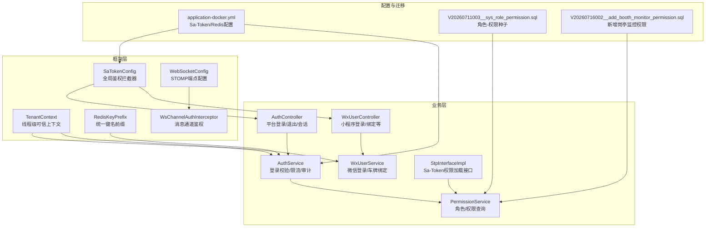
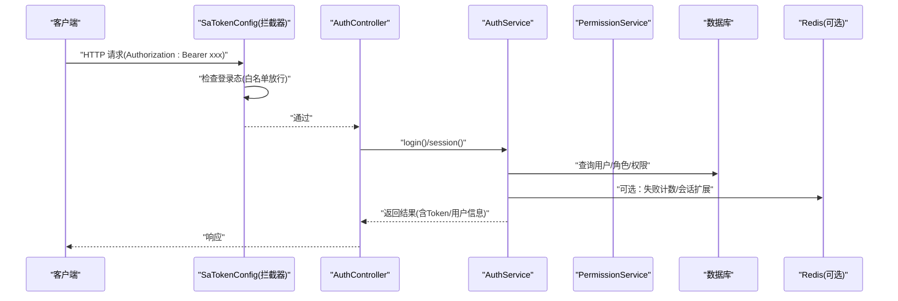
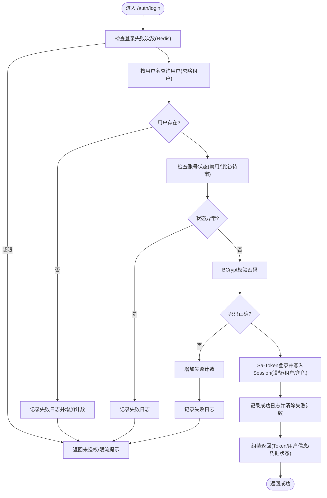
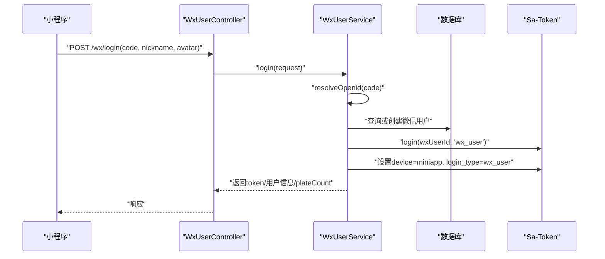
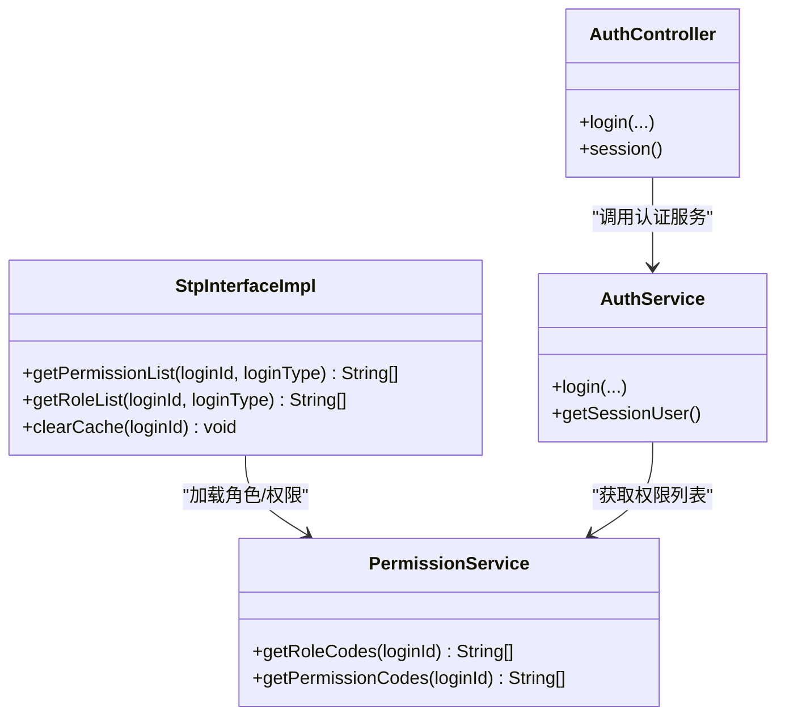
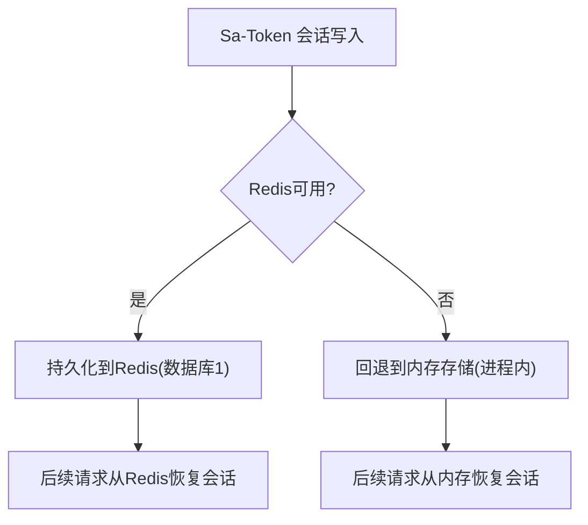
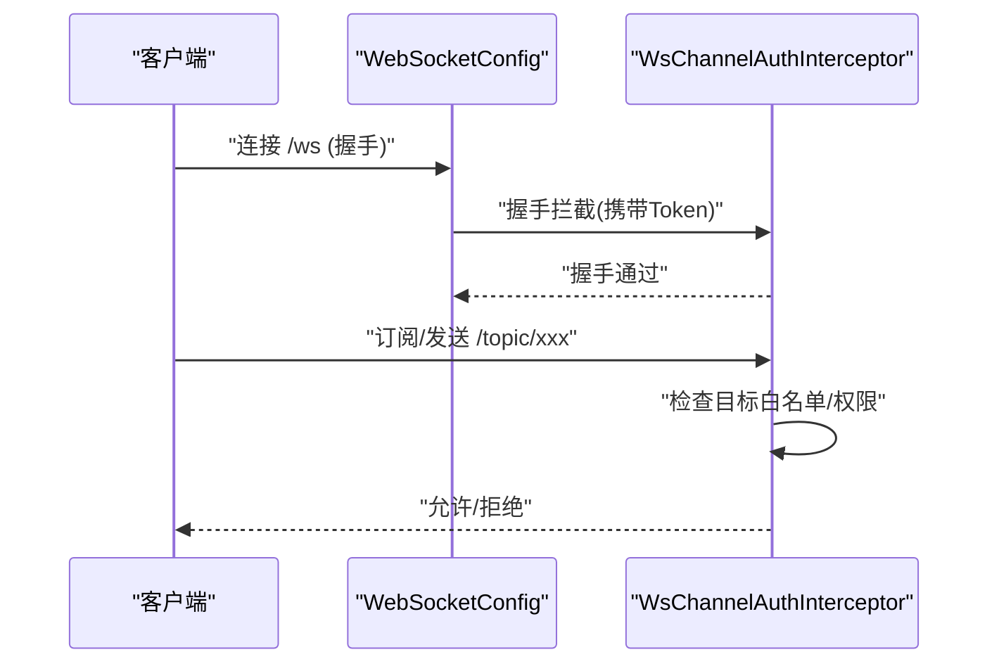
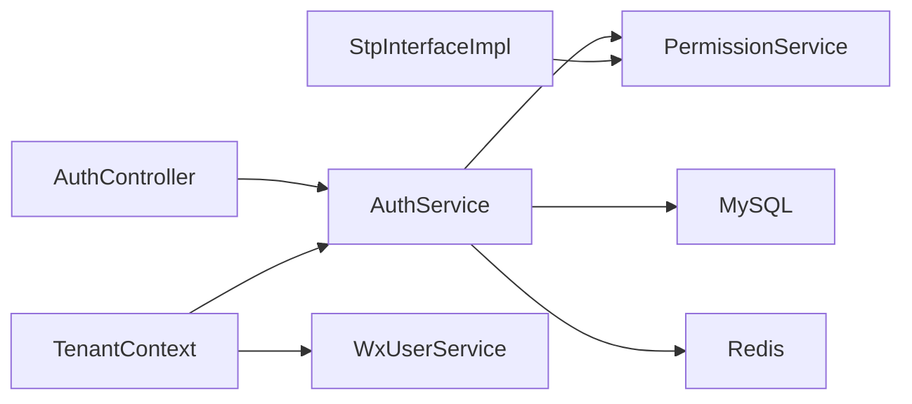

# 认证授权机制

<cite>
**本文引用的文件**
- [SaTokenConfig.java](file://parking-framework/src/main/java/com/jushan/framework/auth/SaTokenConfig.java)
- [AuthService.java](file://parking-system/src/main/java/com/jushan/system/service/AuthService.java)
- [AuthController.java](file://parking-system/src/main/java/com/jushan/system/controller/AuthController.java)
- [WxUserService.java](file://parking-system/src/main/java/com/jushan/system/service/WxUserService.java)
- [WxUserController.java](file://parking-system/src/main/java/com/jushan/system/controller/WxUserController.java)
- [PermissionService.java](file://parking-system/src/main/java/com/jushan/system/service/PermissionService.java)
- [StpInterfaceImpl.java](file://parking-system/src/main/java/com/jushan/system/service/StpInterfaceImpl.java)
- [TenantContext.java](file://parking-framework/src/main/java/com/jushan/framework/auth/TenantContext.java)
- [RedisKeyPrefix.java](file://parking-framework/src/main/java/com/jushan/framework/redis/RedisKeyPrefix.java)
- [application-docker.yml](file://parking-boot/src/main/resources/application-docker.yml)
- [V20260711003__sys_role_permission.sql](file://parking-boot/src/main/resources/db/migration/V20260711003__sys_role_permission.sql)
- [V20260716002__add_booth_monitor_permission.sql](file://parking-boot/src/main/resources/db/migration/V20260716002__add_booth_monitor_permission.sql)
- [WebSocketConfig.java](file://parking-framework/src/main/java/com/jushan/framework/ws/WebSocketConfig.java)
- [WsChannelAuthInterceptor.java](file://parking-framework/src/main/java/com/jushan/framework/ws/WsChannelAuthInterceptor.java)
- [AuthControllerIntegrationTest.java](file://parking-boot/src/test/java/com/jushan/boot/controller/AuthControllerIntegrationTest.java)
- [RolePermissionIntegrationTest.java](file://parking-boot/src/test/java/com/jushan/boot/controller/RolePermissionIntegrationTest.java)
</cite>

## 目录
1. [简介](#简介)
2. [项目结构](#项目结构)
3. [核心组件](#核心组件)
4. [架构总览](#架构总览)
5. [详细组件分析](#详细组件分析)
6. [依赖关系分析](#依赖关系分析)
7. [性能与可用性](#性能与可用性)
8. [故障排查指南](#故障排查指南)
9. [结论](#结论)
10. [附录：配置参数说明](#附录配置参数说明)

## 简介
本文件系统性阐述基于 Sa-Token 的认证与授权实现，覆盖 Token 生成、验证与存储、管理员与小程序用户登录流程、权限控制（角色与数据权限）、会话管理（Redis 存储与内存回退）、安全拦截器与路径白名单、以及 WebSocket 鉴权。文档同时提供关键流程图与时序图，帮助读者快速理解并落地使用。

## 项目结构
认证授权相关代码主要分布在以下模块：
- parking-framework：框架层安全配置（Sa-Token 拦截器、租户上下文、Redis Key 前缀、WebSocket 鉴权）
- parking-system：业务层认证服务、权限加载、控制器
- parking-boot：应用启动与环境配置（Docker 环境下的 Sa-Token + Redis 配置）

图表来源
- [SaTokenConfig.java:1-65](file://parking-framework/src/main/java/com/jushan/framework/auth/SaTokenConfig.java#L1-L65)
- [TenantContext.java:1-257](file://parking-framework/src/main/java/com/jushan/framework/auth/TenantContext.java#L1-L257)
- [RedisKeyPrefix.java:1-67](file://parking-framework/src/main/java/com/jushan/framework/redis/RedisKeyPrefix.java#L1-L67)
- [AuthController.java:1-100](file://parking-system/src/main/java/com/jushan/system/controller/AuthController.java#L1-L100)
- [AuthService.java:1-361](file://parking-system/src/main/java/com/jushan/system/service/AuthService.java#L1-L361)
- [WxUserController.java:1-116](file://parking-system/src/main/java/com/jushan/system/controller/WxUserController.java#L1-L116)
- [WxUserService.java:1-521](file://parking-system/src/main/java/com/jushan/system/service/WxUserService.java#L1-L521)
- [PermissionService.java:1-105](file://parking-system/src/main/java/com/jushan/system/service/PermissionService.java#L1-L105)
- [StpInterfaceImpl.java:1-107](file://parking-system/src/main/java/com/jushan/system/service/StpInterfaceImpl.java#L1-L107)
- [application-docker.yml:1-88](file://parking-boot/src/main/resources/application-docker.yml#L1-L88)
- [V20260711003__sys_role_permission.sql:86-122](file://parking-boot/src/main/resources/db/migration/V20260711003__sys_role_permission.sql#L86-L122)
- [V20260716002__add_booth_monitor_permission.sql:1-17](file://parking-boot/src/main/resources/db/migration/V20260716002__add_booth_monitor_permission.sql#L1-L17)
- [WebSocketConfig.java:44-73](file://parking-framework/src/main/java/com/jushan/framework/ws/WebSocketConfig.java#L44-L73)
- [WsChannelAuthInterceptor.java:37-69](file://parking-framework/src/main/java/com/jushan/framework/ws/WsChannelAuthInterceptor.java#L37-L69)

章节来源
- [SaTokenConfig.java:1-65](file://parking-framework/src/main/java/com/jushan/framework/auth/SaTokenConfig.java#L1-L65)
- [application-docker.yml:56-72](file://parking-boot/src/main/resources/application-docker.yml#L56-L72)

## 核心组件
- 安全拦截器与白名单：通过 Spring MVC Interceptor 注册 Sa-Token 全局鉴权，除公开路径外均要求登录。
- 认证服务：负责账号密码校验、失败限流、会话创建、审计日志记录。
- 小程序登录服务：支持 Mock 模式微信登录，独立会话标识，返回小程序侧所需信息。
- 权限加载：实现 Sa-Token 权限接口，首次从数据库加载后缓存至 Session，后续鉴权走缓存。
- 租户上下文：线程级可信上下文，区分平台用户与租户用户，并在代理模式下限定数据范围。
- 配置与存储：Sa-Token 默认读取 Authorization 头；生产使用 Redis 持久化会话，不可用时自动回退内存。

章节来源
- [SaTokenConfig.java:38-64](file://parking-framework/src/main/java/com/jushan/framework/auth/SaTokenConfig.java#L38-L64)
- [AuthService.java:91-176](file://parking-system/src/main/java/com/jushan/system/service/AuthService.java#L91-L176)
- [WxUserService.java:75-125](file://parking-system/src/main/java/com/jushan/system/service/WxUserService.java#L75-L125)
- [StpInterfaceImpl.java:43-91](file://parking-system/src/main/java/com/jushan/system/service/StpInterfaceImpl.java#L43-L91)
- [TenantContext.java:27-90](file://parking-framework/src/main/java/com/jushan/framework/auth/TenantContext.java#L27-L90)
- [application-docker.yml:56-72](file://parking-boot/src/main/resources/application-docker.yml#L56-L72)

## 架构总览
下图展示一次受保护请求的完整调用链：客户端携带 Token → 拦截器校验登录态 → 业务控制器 → 认证/权限服务 → 数据库/Redis。

图表来源
- [SaTokenConfig.java:38-64](file://parking-framework/src/main/java/com/jushan/framework/auth/SaTokenConfig.java#L38-L64)
- [AuthController.java:40-68](file://parking-system/src/main/java/com/jushan/system/controller/AuthController.java#L40-L68)
- [AuthService.java:91-176](file://parking-system/src/main/java/com/jushan/system/service/AuthService.java#L91-L176)
- [PermissionService.java:59-70](file://parking-system/src/main/java/com/jushan/system/service/PermissionService.java#L59-L70)

## 详细组件分析

### 管理员登录流程（平台账号）
- 入口：POST /auth/login
- 处理要点：
  - 限流检查：基于 Redis 的“用户名+IP”窗口计数，超过阈值拒绝登录
  - 用户查找：忽略租户隔离，按用户名查询
  - 状态校验：禁用/锁定/待审核直接拒绝
  - 密码校验：BCrypt 比对
  - 会话建立：Sa-Token 登录，写入设备标识与租户上下文到 User-Session
  - 审计日志：成功/失败均落库
  - 返回：Token、过期时间、用户信息（含角色与权限列表）

图表来源
- [AuthController.java:40-46](file://parking-system/src/main/java/com/jushan/system/controller/AuthController.java#L40-L46)
- [AuthService.java:91-176](file://parking-system/src/main/java/com/jushan/system/service/AuthService.java#L91-L176)
- [RedisKeyPrefix.java:29-30](file://parking-framework/src/main/java/com/jushan/framework/redis/RedisKeyPrefix.java#L29-L30)

章节来源
- [AuthController.java:40-46](file://parking-system/src/main/java/com/jushan/system/controller/AuthController.java#L40-L46)
- [AuthService.java:91-176](file://parking-system/src/main/java/com/jushan/system/service/AuthService.java#L91-L176)
- [RedisKeyPrefix.java:29-30](file://parking-framework/src/main/java/com/jushan/framework/redis/RedisKeyPrefix.java#L29-L30)

### 小程序用户登录流程（微信用户）
- 入口：POST /wx/login
- 处理要点：
  - 解析 openid：本地开发使用 Mock 模式，真实环境需调用微信接口
  - 用户存在则更新登录信息，不存在则新建用户
  - Sa-Token 登录并使用独立 loginType，会话中记录设备与登录类型
  - 返回 Token、用户基本信息、是否新用户、已绑定车牌数

图表来源
- [WxUserController.java:43-47](file://parking-system/src/main/java/com/jushan/system/controller/WxUserController.java#L43-L47)
- [WxUserService.java:75-125](file://parking-system/src/main/java/com/jushan/system/service/WxUserService.java#L75-L125)

章节来源
- [WxUserController.java:43-47](file://parking-system/src/main/java/com/jushan/system/controller/WxUserController.java#L43-L47)
- [WxUserService.java:75-125](file://parking-system/src/main/java/com/jushan/system/service/WxUserService.java#L75-L125)

### 权限控制体系（角色与权限）
- 角色与权限模型：
  - 角色-权限映射由 Flyway 脚本初始化，包含超级管理员、平台运营、客户管理员、财务、岗亭操作员等角色及对应权限集合
  - 新增权限（如岗亭实时监控）通过迁移脚本追加
- 权限加载与缓存：
  - 登录时计算用户角色与权限，写入返回体供前端渲染
  - 运行时通过 StpInterfaceImpl 实现权限加载，首次从数据库加载后缓存到 Sa-Token Session，后续鉴权直接读缓存
- 编程式与注解式鉴权：
  - 支持 @SaCheckRole/@SaCheckPermission 注解
  - 支持 StpUtil.checkPermission()/checkRole() 编程式判断

图表来源
- [PermissionService.java:44-70](file://parking-system/src/main/java/com/jushan/system/service/PermissionService.java#L44-L70)
- [StpInterfaceImpl.java:43-91](file://parking-system/src/main/java/com/jushan/system/service/StpInterfaceImpl.java#L43-L91)
- [AuthController.java:40-68](file://parking-system/src/main/java/com/jushan/system/controller/AuthController.java#L40-L68)
- [AuthService.java:158-176](file://parking-system/src/main/java/com/jushan/system/service/AuthService.java#L158-L176)

章节来源
- [V20260711003__sys_role_permission.sql:86-122](file://parking-boot/src/main/resources/db/migration/V20260711003__sys_role_permission.sql#L86-L122)
- [V20260716002__add_booth_monitor_permission.sql:1-17](file://parking-boot/src/main/resources/db/migration/V20260716002__add_booth_monitor_permission.sql#L1-L17)
- [PermissionService.java:44-70](file://parking-system/src/main/java/com/jushan/system/service/PermissionService.java#L44-L70)
- [StpInterfaceImpl.java:43-91](file://parking-system/src/main/java/com/jushan/system/service/StpInterfaceImpl.java#L43-L91)
- [RolePermissionIntegrationTest.java:162-212](file://parking-boot/src/test/java/com/jushan/boot/controller/RolePermissionIntegrationTest.java#L162-L212)

### 会话管理与存储（Redis 与内存回退）
- 会话存储：
  - Docker 环境下 Sa-Token 配置 alone-redis，将会话持久化到 Redis
  - 当 Redis 不可用时，Sa-Token 自动回退到内存存储（单进程内有效）
- 会话内容：
  - 平台用户：写入 device、tenantId、userType、roles 等
  - 小程序用户：写入 device、login_type、openid 等
- 键名前缀：
  - 自定义业务 Key 遵循 RedisKeyPrefix 规范，统一以 jushan: 开头

图表来源
- [application-docker.yml:56-72](file://parking-boot/src/main/resources/application-docker.yml#L56-L72)
- [SaTokenConfig.java:22-28](file://parking-framework/src/main/java/com/jushan/framework/auth/SaTokenConfig.java#L22-L28)
- [RedisKeyPrefix.java:1-20](file://parking-framework/src/main/java/com/jushan/framework/redis/RedisKeyPrefix.java#L1-L20)

章节来源
- [application-docker.yml:56-72](file://parking-boot/src/main/resources/application-docker.yml#L56-L72)
- [SaTokenConfig.java:22-28](file://parking-framework/src/main/java/com/jushan/framework/auth/SaTokenConfig.java#L22-L28)
- [RedisKeyPrefix.java:24-33](file://parking-framework/src/main/java/com/jushan/framework/redis/RedisKeyPrefix.java#L24-L33)

### 安全拦截器与路径白名单
- 全局拦截器：SaInterceptor 对所有 /** 生效，仅允许白名单路径免登录访问
- 白名单路径示例：
  - 健康检查：/actuator/**
  - 登录接口：/auth/login、/wx/login
  - 注册接口：/register、/register/**
  - Demo/Mock：/demo/**、/api/v1/internal/mock/**
  - 静态资源与错误页：/favicon.ico、/error
- 异常处理：鉴权异常由全局异常处理器统一返回 JSON 错误码

章节来源
- [SaTokenConfig.java:38-64](file://parking-framework/src/main/java/com/jushan/framework/auth/SaTokenConfig.java#L38-L64)
- [AuthControllerIntegrationTest.java:271-294](file://parking-boot/src/test/java/com/jushan/boot/controller/AuthControllerIntegrationTest.java#L271-L294)

### WebSocket 鉴权与主题访问控制
- STOMP 端点：/ws，握手阶段注入鉴权拦截器
- 通道鉴权：WsChannelAuthInterceptor 对订阅/发送目标进行权限校验，公共目标无需鉴权
- 典型公共目标：/topic/public、/topic/health

图表来源
- [WebSocketConfig.java:65-71](file://parking-framework/src/main/java/com/jushan/framework/ws/WebSocketConfig.java#L65-L71)
- [WsChannelAuthInterceptor.java:61-69](file://parking-framework/src/main/java/com/jushan/framework/ws/WsChannelAuthInterceptor.java#L61-L69)

章节来源
- [WebSocketConfig.java:65-71](file://parking-framework/src/main/java/com/jushan/framework/ws/WebSocketConfig.java#L65-L71)
- [WsChannelAuthInterceptor.java:61-69](file://parking-framework/src/main/java/com/jushan/framework/ws/WsChannelAuthInterceptor.java#L61-L69)

## 依赖关系分析
- 组件耦合：
  - AuthController 依赖 AuthService，后者依赖 PermissionService 与数据库/Redis
  - StpInterfaceImpl 依赖 PermissionService 完成权限加载
  - TenantContext 为跨层共享的可信上下文，避免前端传入 tenantId 被信任
- 外部依赖：
  - Sa-Token 框架（鉴权与会话）
  - Redis（会话持久化与登录失败计数）
  - MySQL（用户、角色、权限、审计日志）

图表来源
- [AuthController.java:40-68](file://parking-system/src/main/java/com/jushan/system/controller/AuthController.java#L40-L68)
- [AuthService.java:91-176](file://parking-system/src/main/java/com/jushan/system/service/AuthService.java#L91-L176)
- [PermissionService.java:44-70](file://parking-system/src/main/java/com/jushan/system/service/PermissionService.java#L44-L70)
- [StpInterfaceImpl.java:43-91](file://parking-system/src/main/java/com/jushan/system/service/StpInterfaceImpl.java#L43-L91)
- [TenantContext.java:27-90](file://parking-framework/src/main/java/com/jushan/framework/auth/TenantContext.java#L27-L90)

章节来源
- [AuthController.java:40-68](file://parking-system/src/main/java/com/jushan/system/controller/AuthController.java#L40-L68)
- [AuthService.java:91-176](file://parking-system/src/main/java/com/jushan/system/service/AuthService.java#L91-L176)
- [PermissionService.java:44-70](file://parking-system/src/main/java/com/jushan/system/service/PermissionService.java#L44-L70)
- [StpInterfaceImpl.java:43-91](file://parking-system/src/main/java/com/jushan/system/service/StpInterfaceImpl.java#L43-L91)
- [TenantContext.java:27-90](file://parking-framework/src/main/java/com/jushan/framework/auth/TenantContext.java#L27-L90)

## 性能与可用性
- 权限缓存：首次加载后存入 Sa-Token Session，减少鉴权时的数据库压力
- 会话存储：生产建议启用 Redis，避免进程重启导致会话丢失；测试环境可回退内存
- 限流策略：登录失败计数采用 Redis 原子操作，具备高并发能力；Redis 不可用时降级放行并记录告警
- 异步场景：如需在异步任务中使用租户上下文，应捕获快照并在子线程恢复

[本节为通用指导，不直接分析具体文件]

## 故障排查指南
- 伪造 Token 访问受保护接口：预期返回 401，且错误码为 UNAUTHORIZED
- 登录接口在未登录时访问：由于在白名单中，不会触发拦截器 401，但业务逻辑会返回 401
- 权限不足：根据角色-权限映射，若缺少必要权限，将返回 FORBIDDEN
- 限流触发：同一用户名+IP 在短时间内多次失败将被限制，等待窗口期后重试

章节来源
- [AuthControllerIntegrationTest.java:271-294](file://parking-boot/src/test/java/com/jushan/boot/controller/AuthControllerIntegrationTest.java#L271-L294)
- [RolePermissionIntegrationTest.java:561-585](file://parking-boot/src/test/java/com/jushan/boot/controller/RolePermissionIntegrationTest.java#L561-L585)

## 结论
本项目基于 Sa-Token 构建了统一的认证与授权体系，结合 Redis 会话持久化与内存回退策略，兼顾了安全性与可用性。通过角色-权限模型与 Session 缓存，实现了高效的权限校验。租户上下文确保数据范围严格隔离，配合 WebSocket 鉴权形成端到端的安全闭环。

[本节为总结性内容，不直接分析具体文件]

## 附录：配置参数说明
- Sa-Token 核心参数（Docker 环境）
  - token-name：Authorization
  - timeout：会话超时秒数（默认 86400）
  - active-timeout：活跃超时秒数（默认 1800）
  - is-concurrent：是否允许多端登录
  - is-share：是否共享会话
  - token-style：令牌风格（tik）
  - is-log/is-print：日志开关
  - alone-redis：独立 Redis 配置（host/port/password/database）
- Redis Key 前缀规范
  - 统一以 jushan: 开头，按模块分层命名
  - 认证相关：auth:、auth:login-fail:、auth:user-session:
- 角色与权限种子
  - 超级管理员、平台运营、客户管理员、财务、岗亭操作员等角色及其权限集合
  - 新增权限（如 booth:monitor）通过迁移脚本追加

章节来源
- [application-docker.yml:56-72](file://parking-boot/src/main/resources/application-docker.yml#L56-L72)
- [RedisKeyPrefix.java:24-33](file://parking-framework/src/main/java/com/jushan/framework/redis/RedisKeyPrefix.java#L24-L33)
- [V20260711003__sys_role_permission.sql:86-122](file://parking-boot/src/main/resources/db/migration/V20260711003__sys_role_permission.sql#L86-L122)
- [V20260716002__add_booth_monitor_permission.sql:1-17](file://parking-boot/src/main/resources/db/migration/V20260716002__add_booth_monitor_permission.sql#L1-L17)