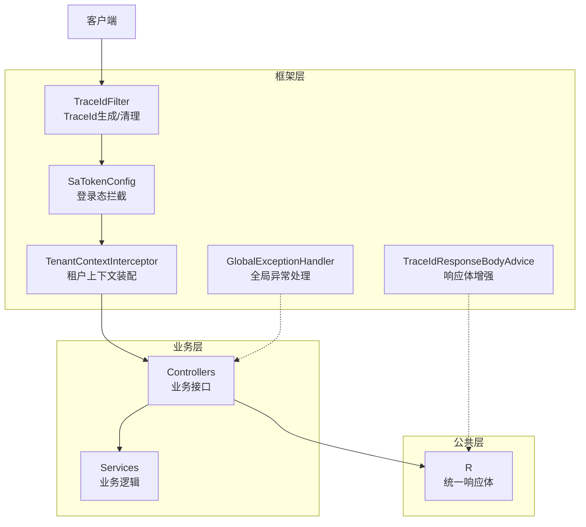
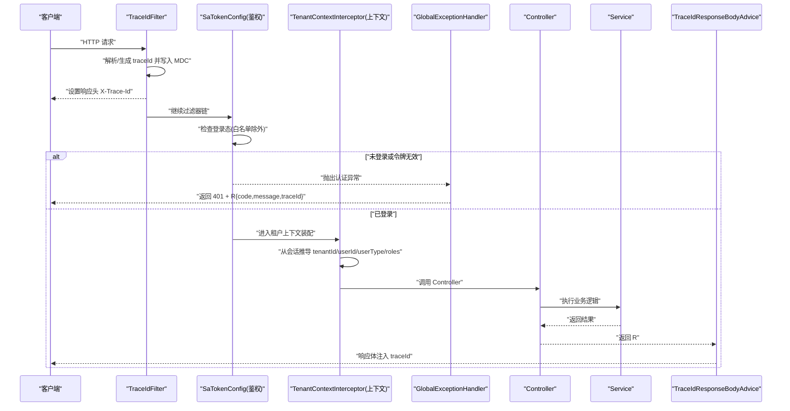
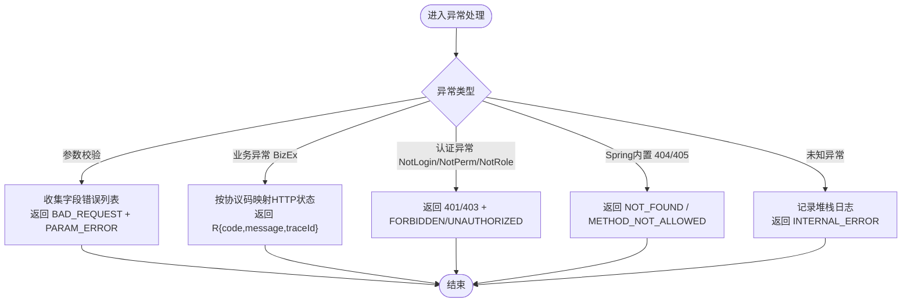
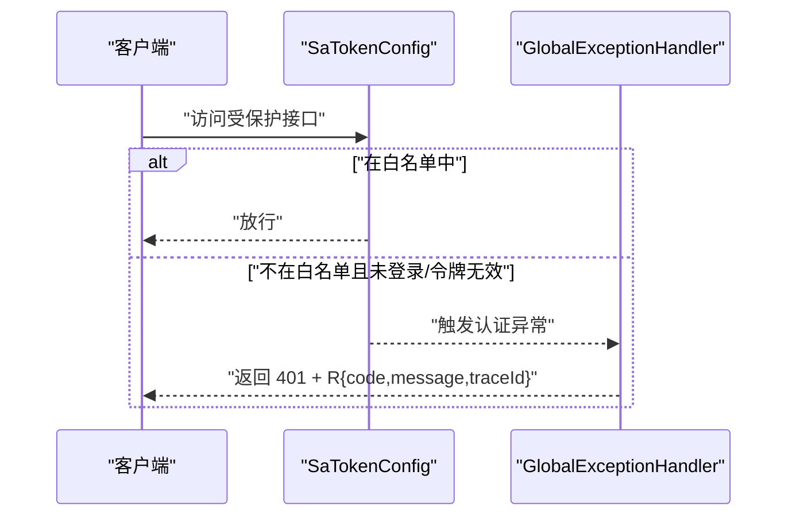
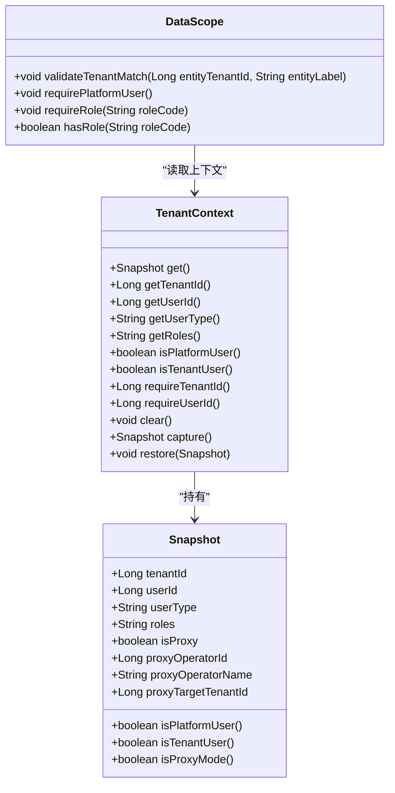
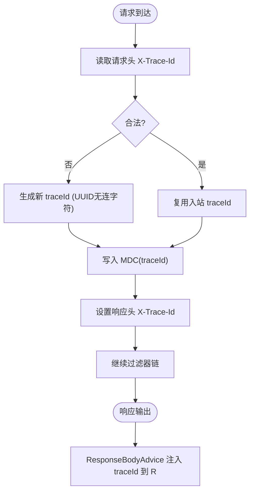
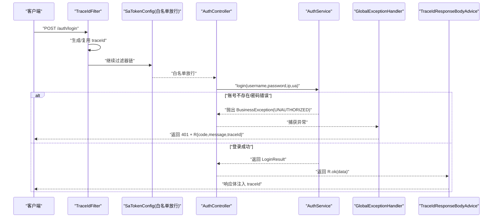
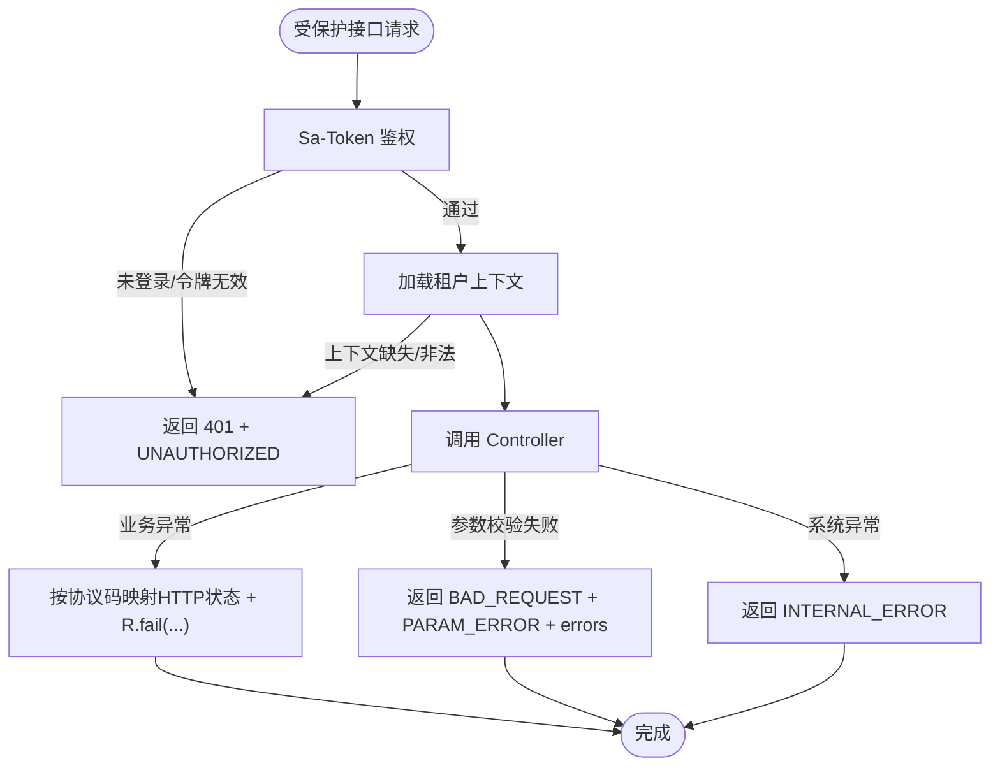
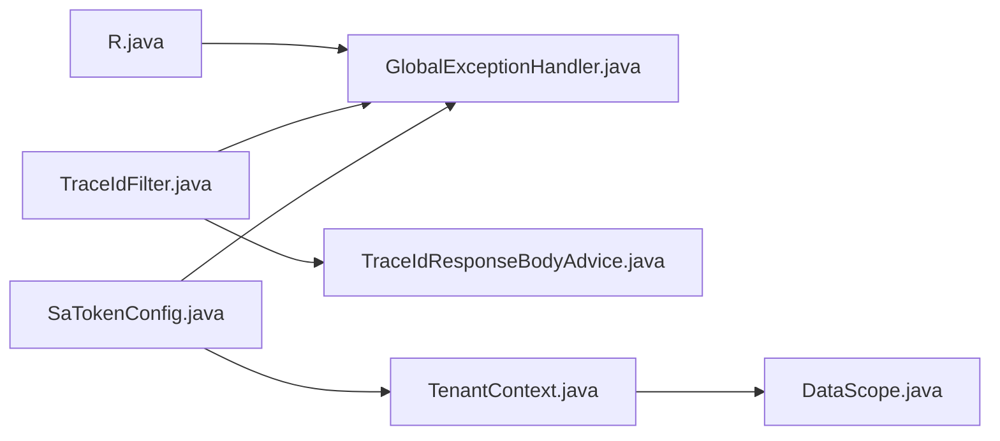

# HTTP请求处理流

<cite>
**本文引用的文件**
- [GlobalExceptionHandler.java](file://parking-framework/src/main/java/com/jushan/framework/web/GlobalExceptionHandler.java)
- [TraceIdFilter.java](file://parking-framework/src/main/java/com/jushan/framework/web/TraceIdFilter.java)
- [TraceIdResponseBodyAdvice.java](file://parking-framework/src/main/java/com/jushan/framework/web/TraceIdResponseBodyAdvice.java)
- [SaTokenConfig.java](file://parking-framework/src/main/java/com/jushan/framework/auth/SaTokenConfig.java)
- [TenantContext.java](file://parking-framework/src/main/java/com/jushan/framework/auth/TenantContext.java)
- [DataScope.java](file://parking-framework/src/main/java/com/jushan/framework/auth/DataScope.java)
- [R.java](file://parking-common/src/main/java/com/jushan/common/R.java)
- [AuthService.java](file://parking-system/src/main/java/com/jushan/system/service/AuthService.java)
- [TenantContextIntegrationTest.java](file://parking-boot/src/test/java/com/jushan/boot/controller/TenantContextIntegrationTest.java)
- [AuthControllerIntegrationTest.java](file://parking-boot/src/test/java/com/jushan/boot/controller/AuthControllerIntegrationTest.java)
- [TraceIdAndHttpStatusTest.java](file://parking-boot/src/test/java/com/jushan/boot/controller/TraceIdAndHttpStatusTest.java)
</cite>

## 目录
1. [简介](#简介)
2. [项目结构](#项目结构)
3. [核心组件](#核心组件)
4. [架构总览](#架构总览)
5. [详细组件分析](#详细组件分析)
6. [依赖关系分析](#依赖关系分析)
7. [性能考虑](#性能考虑)
8. [故障排查指南](#故障排查指南)
9. [结论](#结论)
10. [附录](#附录)

## 简介
本文件聚焦于从前端发起HTTP请求到后端处理的完整链路，覆盖以下关键能力：
- 请求拦截与认证授权（基于 Sa-Token）
- 多租户上下文提取与数据隔离
- 参数校验、业务逻辑处理、响应封装
- 全局异常处理与统一错误码
- 全链路追踪（TraceId）注入与透传
- 典型API时序图与错误处理流程图

## 项目结构
本项目采用分层模块化设计：
- parking-common：通用类型与统一响应体 R
- parking-framework：框架层能力（鉴权、租户上下文、全局异常、追踪等）
- parking-system：业务服务与控制器
- parking-boot：启动入口与集成测试

图表来源
- [SaTokenConfig.java:33-65](file://parking-framework/src/main/java/com/jushan/framework/auth/SaTokenConfig.java#L33-L65)
- [TenantContext.java:27-90](file://parking-framework/src/main/java/com/jushan/framework/auth/TenantContext.java#L27-L90)
- [GlobalExceptionHandler.java:44-47](file://parking-framework/src/main/java/com/jushan/framework/web/GlobalExceptionHandler.java#L44-L47)
- [TraceIdFilter.java:27-75](file://parking-framework/src/main/java/com/jushan/framework/web/TraceIdFilter.java#L27-L75)
- [TraceIdResponseBodyAdvice.java:22-50](file://parking-framework/src/main/java/com/jushan/framework/web/TraceIdResponseBodyAdvice.java#L22-L50)
- [R.java:31-161](file://parking-common/src/main/java/com/jushan/common/R.java#L31-L161)

章节来源
- [SaTokenConfig.java:33-65](file://parking-framework/src/main/java/com/jushan/framework/auth/SaTokenConfig.java#L33-L65)
- [TenantContext.java:27-90](file://parking-framework/src/main/java/com/jushan/framework/auth/TenantContext.java#L27-L90)
- [GlobalExceptionHandler.java:44-47](file://parking-framework/src/main/java/com/jushan/framework/web/GlobalExceptionHandler.java#L44-L47)
- [TraceIdFilter.java:27-75](file://parking-framework/src/main/java/com/jushan/framework/web/TraceIdFilter.java#L27-L75)
- [TraceIdResponseBodyAdvice.java:22-50](file://parking-framework/src/main/java/com/jushan/framework/web/TraceIdResponseBodyAdvice.java#L22-L50)
- [R.java:31-161](file://parking-common/src/main/java/com/jushan/common/R.java#L31-L161)

## 核心组件
- 统一响应体 R：所有接口返回统一结构，包含 code、message、data、traceId、errors。
- 全局异常处理器 GlobalExceptionHandler：将参数校验、业务异常、认证/授权异常、Spring内置异常统一转换为 R。
- 认证拦截器 SaTokenConfig：通过 Spring MVC Interceptor 实现登录态校验，白名单放行公开接口。
- 租户上下文 TenantContext：线程级快照，保存 tenantId、userId、userType、roles、代理信息等。
- 数据范围 DataScope：提供平台用户判定、角色精确匹配、租户匹配校验等安全能力。
- 追踪 TraceIdFilter + TraceIdResponseBodyAdvice：入站生成/复用 traceId，出站在响应体自动注入。

章节来源
- [R.java:31-161](file://parking-common/src/main/java/com/jushan/common/R.java#L31-L161)
- [GlobalExceptionHandler.java:44-231](file://parking-framework/src/main/java/com/jushan/framework/web/GlobalExceptionHandler.java#L44-L231)
- [SaTokenConfig.java:33-65](file://parking-framework/src/main/java/com/jushan/framework/auth/SaTokenConfig.java#L33-L65)
- [TenantContext.java:27-256](file://parking-framework/src/main/java/com/jushan/framework/auth/TenantContext.java#L27-L256)
- [DataScope.java:31-179](file://parking-framework/src/main/java/com/jushan/framework/auth/DataScope.java#L31-L179)
- [TraceIdFilter.java:27-75](file://parking-framework/src/main/java/com/jushan/framework/web/TraceIdFilter.java#L27-L75)
- [TraceIdResponseBodyAdvice.java:22-50](file://parking-framework/src/main/java/com/jushan/framework/web/TraceIdResponseBodyAdvice.java#L22-L50)

## 架构总览
下图展示一次受保护接口的端到端流程：Servlet Filter → Sa-Token 鉴权 → 租户上下文装配 → Controller → Service → 统一响应封装 → 异常兜底。

图表来源
- [TraceIdFilter.java:57-75](file://parking-framework/src/main/java/com/jushan/framework/web/TraceIdFilter.java#L57-L75)
- [SaTokenConfig.java:38-63](file://parking-framework/src/main/java/com/jushan/framework/auth/SaTokenConfig.java#L38-L63)
- [TenantContext.java:94-126](file://parking-framework/src/main/java/com/jushan/framework/auth/TenantContext.java#L94-L126)
- [GlobalExceptionHandler.java:149-191](file://parking-framework/src/main/java/com/jushan/framework/web/GlobalExceptionHandler.java#L149-L191)
- [TraceIdResponseBodyAdvice.java:32-49](file://parking-framework/src/main/java/com/jushan/framework/web/TraceIdResponseBodyAdvice.java#L32-L49)

## 详细组件分析

### 统一响应体 R 的设计模式
- 字段：code、message、data、traceId、errors（非空时序列化）。
- 工厂方法：ok()/fail() 快速构造成功/失败响应。
- Fluent API：traceId()/errors() 便于链式填充。
- 配合 ResponseBodyAdvice 自动注入 traceId，保证正常与异常路径一致。

章节来源
- [R.java:31-161](file://parking-common/src/main/java/com/jushan/common/R.java#L31-L161)
- [TraceIdResponseBodyAdvice.java:22-50](file://parking-framework/src/main/java/com/jushan/framework/web/TraceIdResponseBodyAdvice.java#L22-L50)

### 全局异常处理器 GlobalExceptionHandler
- 参数校验异常：MethodArgumentNotValidException、ConstraintViolationException、Servlet 层参数异常 → BAD_REQUEST + PARAM_ERROR，附带 errors 详情。
- 业务异常：BusinessException → 根据协议级错误码映射 HTTP 状态（400/401/403/404/409/429），其余保持 200 + code 非 0。
- 认证/授权异常：Sa-Token NotLoginException/NotPermissionException/NotRoleException → 401/403 + 对应错误码。
- Spring 内置异常：404/405 → NOT_FOUND/METHOD_NOT_ALLOWED。
- 兜底异常：记录堆栈日志，返回 INTERNAL_ERROR，不泄露内部细节。
- 所有异常响应均携带 traceId。

图表来源
- [GlobalExceptionHandler.java:49-104](file://parking-framework/src/main/java/com/jushan/framework/web/GlobalExceptionHandler.java#L49-L104)
- [GlobalExceptionHandler.java:106-147](file://parking-framework/src/main/java/com/jushan/framework/web/GlobalExceptionHandler.java#L106-L147)
- [GlobalExceptionHandler.java:149-191](file://parking-framework/src/main/java/com/jushan/framework/web/GlobalExceptionHandler.java#L149-L191)
- [GlobalExceptionHandler.java:193-231](file://parking-framework/src/main/java/com/jushan/framework/web/GlobalExceptionHandler.java#L193-L231)

章节来源
- [GlobalExceptionHandler.java:44-231](file://parking-framework/src/main/java/com/jushan/framework/web/GlobalExceptionHandler.java#L44-L231)

### 认证与授权（Sa-Token）
- 使用 Spring MVC Interceptor 注册 Sa-Token 鉴权，优先于业务拦截器执行。
- 白名单路径：/actuator/**、/auth/login、/wx/login、/register/**、/demo/**、/api/v1/internal/mock/**、静态资源与/error。
- 未登录或令牌无效时抛出认证异常，由全局异常处理器统一返回 401。

图表来源
- [SaTokenConfig.java:38-63](file://parking-framework/src/main/java/com/jushan/framework/auth/SaTokenConfig.java#L38-L63)
- [GlobalExceptionHandler.java:149-177](file://parking-framework/src/main/java/com/jushan/framework/web/GlobalExceptionHandler.java#L149-L177)

章节来源
- [SaTokenConfig.java:33-65](file://parking-framework/src/main/java/com/jushan/framework/auth/SaTokenConfig.java#L33-L65)
- [AuthControllerIntegrationTest.java:271-294](file://parking-boot/src/test/java/com/jushan/boot/controller/AuthControllerIntegrationTest.java#L271-L294)

### 多租户上下文传递与数据隔离
- 上下文快照 Snapshot：包含 tenantId、userId、userType、roles、代理信息（是否代理、操作人、目标租户）。
- 平台用户 vs 租户用户：
  - 平台用户：tenantId == null 且 userType == platform，可跨租户访问。
  - 租户用户：tenantId != null，数据限定在本租户。
- 代理模式：当前操作人是平台管理员，但数据范围严格限定在目标租户。
- 强制要求：需要租户范围的接口必须通过 requireTenantId() 获取，避免平台用户误用。
- 数据隔离：DataScope.validateTenantMatch(entityTenantId, label) 确保实体归属与当前上下文一致；requirePlatformUser() 限制平台级操作。

图表来源
- [TenantContext.java:27-256](file://parking-framework/src/main/java/com/jushan/framework/auth/TenantContext.java#L27-L256)
- [DataScope.java:31-179](file://parking-framework/src/main/java/com/jushan/framework/auth/DataScope.java#L31-L179)

章节来源
- [TenantContext.java:27-256](file://parking-framework/src/main/java/com/jushan/framework/auth/TenantContext.java#L27-L256)
- [DataScope.java:31-179](file://parking-framework/src/main/java/com/jushan/framework/auth/DataScope.java#L31-L179)
- [TenantContextIntegrationTest.java:498-522](file://parking-boot/src/test/java/com/jushan/boot/controller/TenantContextIntegrationTest.java#L498-L522)

### 全链路追踪（TraceId）
- 入站：TraceIdFilter 解析上游传入的 X-Trace-Id，若非法则生成新的 UUID（去除连字符），写入 SLF4J MDC 并设置响应头。
- 出站：TraceIdResponseBodyAdvice 对返回类型为 R 的响应体自动注入 traceId（若未被显式设置）。
- 校验规则：长度≤64，仅允许字母数字下划线连字符，拒绝空白与非法字符。

图表来源
- [TraceIdFilter.java:49-75](file://parking-framework/src/main/java/com/jushan/framework/web/TraceIdFilter.java#L49-L75)
- [TraceIdResponseBodyAdvice.java:32-49](file://parking-framework/src/main/java/com/jushan/framework/web/TraceIdResponseBodyAdvice.java#L32-L49)
- [TraceIdAndHttpStatusTest.java:79-174](file://parking-boot/src/test/java/com/jushan/boot/controller/TraceIdAndHttpStatusTest.java#L79-L174)

章节来源
- [TraceIdFilter.java:27-75](file://parking-framework/src/main/java/com/jushan/framework/web/TraceIdFilter.java#L27-L75)
- [TraceIdResponseBodyAdvice.java:22-50](file://parking-framework/src/main/java/com/jushan/framework/web/TraceIdResponseBodyAdvice.java#L22-L50)
- [TraceIdAndHttpStatusTest.java:79-174](file://parking-boot/src/test/java/com/jushan/boot/controller/TraceIdAndHttpStatusTest.java#L79-L174)

### 典型API调用时序（以登录为例）

图表来源
- [AuthService.java:91-104](file://parking-system/src/main/java/com/jushan/system/service/AuthService.java#L91-L104)
- [GlobalExceptionHandler.java:138-147](file://parking-framework/src/main/java/com/jushan/framework/web/GlobalExceptionHandler.java#L138-L147)
- [TraceIdResponseBodyAdvice.java:32-49](file://parking-framework/src/main/java/com/jushan/framework/web/TraceIdResponseBodyAdvice.java#L32-L49)
- [TraceIdFilter.java:57-75](file://parking-framework/src/main/java/com/jushan/framework/web/TraceIdFilter.java#L57-L75)

章节来源
- [AuthService.java:91-104](file://parking-system/src/main/java/com/jushan/system/service/AuthService.java#L91-L104)
- [AuthControllerIntegrationTest.java:283-294](file://parking-boot/src/test/java/com/jushan/boot/controller/AuthControllerIntegrationTest.java#L283-L294)

### 错误处理流程图（受保护接口）

图表来源
- [GlobalExceptionHandler.java:49-104](file://parking-framework/src/main/java/com/jushan/framework/web/GlobalExceptionHandler.java#L49-L104)
- [GlobalExceptionHandler.java:138-147](file://parking-framework/src/main/java/com/jushan/framework/web/GlobalExceptionHandler.java#L138-L147)
- [GlobalExceptionHandler.java:193-231](file://parking-framework/src/main/java/com/jushan/framework/web/GlobalExceptionHandler.java#L193-L231)

## 依赖关系分析
- 全局异常处理器依赖统一响应体 R 与 TraceIdFilter 的 MDC 键名。
- 响应体增强依赖 R 类型判断与 MDC 中的 traceId。
- 认证拦截器依赖 Sa-Token 提供的登录态检查。
- 租户上下文依赖 Sa-Token Session 中的键值（tenantId、userType、roles、代理相关键）。
- 数据范围工具依赖 TenantContext 快照进行平台/租户判定与角色精确匹配。

图表来源
- [R.java:31-161](file://parking-common/src/main/java/com/jushan/common/R.java#L31-L161)
- [GlobalExceptionHandler.java:44-231](file://parking-framework/src/main/java/com/jushan/framework/web/GlobalExceptionHandler.java#L44-L231)
- [TraceIdFilter.java:27-75](file://parking-framework/src/main/java/com/jushan/framework/web/TraceIdFilter.java#L27-L75)
- [TraceIdResponseBodyAdvice.java:22-50](file://parking-framework/src/main/java/com/jushan/framework/web/TraceIdResponseBodyAdvice.java#L22-L50)
- [SaTokenConfig.java:33-65](file://parking-framework/src/main/java/com/jushan/framework/auth/SaTokenConfig.java#L33-L65)
- [TenantContext.java:27-256](file://parking-framework/src/main/java/com/jushan/framework/auth/TenantContext.java#L27-L256)
- [DataScope.java:31-179](file://parking-framework/src/main/java/com/jushan/framework/auth/DataScope.java#L31-L179)

章节来源
- [R.java:31-161](file://parking-common/src/main/java/com/jushan/common/R.java#L31-L161)
- [GlobalExceptionHandler.java:44-231](file://parking-framework/src/main/java/com/jushan/framework/web/GlobalExceptionHandler.java#L44-L231)
- [TraceIdFilter.java:27-75](file://parking-framework/src/main/java/com/jushan/framework/web/TraceIdFilter.java#L27-L75)
- [TraceIdResponseBodyAdvice.java:22-50](file://parking-framework/src/main/java/com/jushan/framework/web/TraceIdResponseBodyAdvice.java#L22-L50)
- [SaTokenConfig.java:33-65](file://parking-framework/src/main/java/com/jushan/framework/auth/SaTokenConfig.java#L33-L65)
- [TenantContext.java:27-256](file://parking-framework/src/main/java/com/jushan/framework/auth/TenantContext.java#L27-L256)
- [DataScope.java:31-179](file://parking-framework/src/main/java/com/jushan/framework/auth/DataScope.java#L31-L179)

## 性能考虑
- 鉴权拦截器使用 Spring MVC Interceptor，异常可被 @RestControllerAdvice 捕获，减少额外包装成本。
- TraceIdFilter 仅在请求生命周期内维护 MDC，finally 清理避免线程池复用污染。
- 响应体增强仅针对 R 类型，避免不必要的反射与对象复制。
- 租户上下文快照为不可变对象，降低并发风险与拷贝开销。
- 建议在生产环境启用 Redis 持久化会话，避免内存回退导致的状态丢失与性能抖动。

[本节为通用指导，无需具体文件引用]

## 故障排查指南
- 未登录/伪造 Token：
  - 现象：401 + UNAUTHORIZED。
  - 定位：检查 Sa-Token 配置与白名单，确认 Authorization 头是否正确。
  - 参考：[SaTokenConfig.java:38-63](file://parking-framework/src/main/java/com/jushan/framework/auth/SaTokenConfig.java#L38-L63)、[AuthControllerIntegrationTest.java:271-294](file://parking-boot/src/test/java/com/jushan/boot/controller/AuthControllerIntegrationTest.java#L271-L294)
- 参数校验失败：
  - 现象：BAD_REQUEST + PARAM_ERROR + errors 数组。
  - 定位：检查 DTO 注解与请求体格式。
  - 参考：[GlobalExceptionHandler.java:49-104](file://parking-framework/src/main/java/com/jushan/framework/web/GlobalExceptionHandler.java#L49-L104)
- 租户上下文缺失：
  - 现象：401/403 或业务提示“未登录或会话已过期”。
  - 定位：确认登录成功后会话中是否写入 tenantId/userType/roles。
  - 参考：[TenantContextIntegrationTest.java:498-522](file://parking-boot/src/test/java/com/jushan/boot/controller/TenantContextIntegrationTest.java#L498-L522)
- TraceId 不一致：
  - 现象：响应头与响应体 traceId 不一致或为空。
  - 定位：检查 TraceIdFilter 与 ResponseBodyAdvice 是否生效。
  - 参考：[TraceIdAndHttpStatusTest.java:79-174](file://parking-boot/src/test/java/com/jushan/boot/controller/TraceIdAndHttpStatusTest.java#L79-L174)

章节来源
- [SaTokenConfig.java:38-63](file://parking-framework/src/main/java/com/jushan/framework/auth/SaTokenConfig.java#L38-L63)
- [AuthControllerIntegrationTest.java:271-294](file://parking-boot/src/test/java/com/jushan/boot/controller/AuthControllerIntegrationTest.java#L271-L294)
- [GlobalExceptionHandler.java:49-104](file://parking-framework/src/main/java/com/jushan/framework/web/GlobalExceptionHandler.java#L49-L104)
- [TenantContextIntegrationTest.java:498-522](file://parking-boot/src/test/java/com/jushan/boot/controller/TenantContextIntegrationTest.java#L498-L522)
- [TraceIdAndHttpStatusTest.java:79-174](file://parking-boot/src/test/java/com/jushan/boot/controller/TraceIdAndHttpStatusTest.java#L79-L174)

## 结论
本方案通过 Servlet Filter → MVC Interceptor → Controller → Service 的标准链路，结合 Sa-Token 鉴权、租户上下文快照、全局异常处理与统一响应体，实现了高内聚、低耦合的请求处理体系。全链路追踪贯穿入站与出站，便于问题定位与性能监控。多租户数据隔离通过严格的上下文与数据范围校验保障安全性。

[本节为总结性内容，无需具体文件引用]

## 附录
- 统一响应体字段说明：
  - code：业务状态码，0 表示成功。
  - message：提示信息。
  - data：业务数据。
  - traceId：请求追踪 ID。
  - errors：字段校验错误详情（可选）。
- 协议级错误码映射：
  - 400 → BAD_REQUEST
  - 401 → UNAUTHORIZED
  - 403 → FORBIDDEN
  - 404 → NOT_FOUND
  - 409 → CONFLICT
  - 429 → TOO_MANY_REQUESTS
  - 其他 → HTTP 200 + code 非 0

章节来源
- [R.java:31-161](file://parking-common/src/main/java/com/jushan/common/R.java#L31-L161)
- [GlobalExceptionHandler.java:114-130](file://parking-framework/src/main/java/com/jushan/framework/web/GlobalExceptionHandler.java#L114-L130)