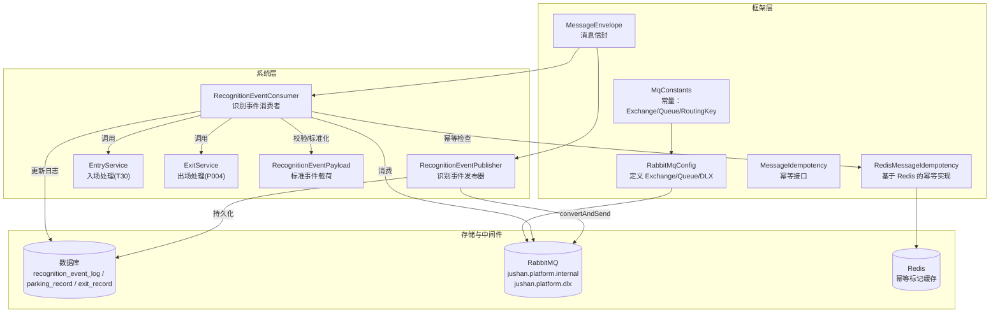
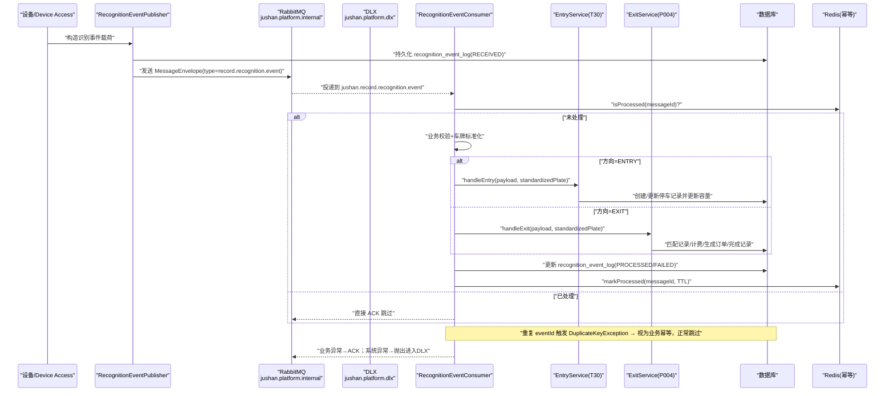
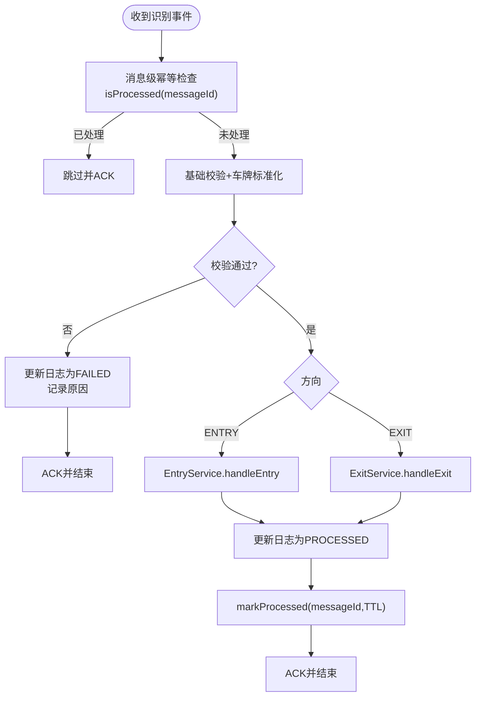
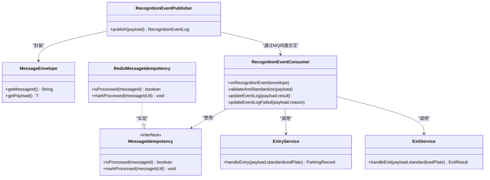
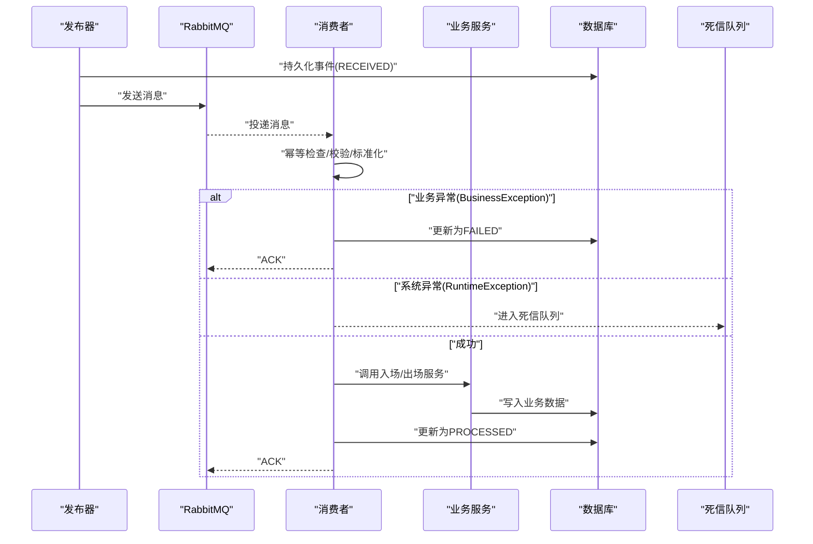

# 事件消息流转

<cite>
**本文引用的文件**   
- [RecognitionEventConsumer.java](file://parking-system/src/main/java/com/jushan/system/event/RecognitionEventConsumer.java)
- [RecognitionEventPublisher.java](file://parking-system/src/main/java/com/jushan/system/event/RecognitionEventPublisher.java)
- [MqConstants.java](file://parking-framework/src/main/java/com/jushan/framework/mq/MqConstants.java)
- [RabbitMqConfig.java](file://parking-framework/src/main/java/com/jushan/framework/mq/RabbitMqConfig.java)
- [MessageEnvelope.java](file://parking-framework/src/main/java/com/jushan/framework/mq/MessageEnvelope.java)
- [MessageIdempotency.java](file://parking-framework/src/main/java/com/jushan/framework/mq/MessageIdempotency.java)
- [RedisMessageIdempotency.java](file://parking-framework/src/main/java/com/jushan/framework/mq/RedisMessageIdempotency.java)
- [RecognitionEventPayload.java](file://parking-system/src/main/java/com/jushan/system/event/RecognitionEventPayload.java)
- [EntryService.java](file://parking-system/src/main/java/com/jushan/system/service/EntryService.java)
- [ExitService.java](file://parking-system/src/main/java/com/jushan/system/service/ExitService.java)
- [RecognitionEventConsumerTest.java](file://parking-boot/src/test/java/com/jushan/boot/event/RecognitionEventConsumerTest.java)
- [V20260712015__recognition_event_log.sql](file://parking-boot/src/main/resources/db/migration/V20260712015__recognition_event_log.sql)
- [V20260712017__parking_record.sql](file://parking-boot/src/main/resources/db/migration/V20260712017__parking_record.sql)
- [V20260714001__exit_flow_skeleton.sql](file://parking-boot/src/main/resources/db/migration/V20260714001__exit_flow_skeleton.sql)
</cite>

## 目录
1. [引言](#引言)
2. [项目结构](#项目结构)
3. [核心组件](#核心组件)
4. [架构总览](#架构总览)
5. [详细组件分析](#详细组件分析)
6. [依赖关系分析](#依赖关系分析)
7. [性能与可靠性](#性能与可靠性)
8. [故障排查指南](#故障排查指南)
9. [结论](#结论)
10. [附录](#附录)

## 引言
本文件聚焦“设备识别事件”的端到端消息流转，覆盖从设备到平台处理的全链路：设备 → Device Access服务 → RabbitMQ消息队列 → 平台消费者 → 业务处理。文档重点说明：
- 消息幂等性保障机制（消息级幂等 + 业务级幂等）
- 发布、消费、重试与死信策略
- 识别事件类型（T28、T30、P004）及其处理流程
- 消息序列化格式、路由规则与分区策略
- 关键时序图与异常处理流程图

## 项目结构
围绕识别事件的核心代码分布在 framework（基础设施）、system（业务逻辑）、boot（启动与测试）三个模块中：
- framework 提供 MQ 基础能力（Exchange/Queue/DLX、消息信封、幂等接口及 Redis 实现）
- system 提供识别事件的发布器、消费者以及入场/出场业务服务
- boot 提供集成测试，验证消息流与幂等行为

图表来源
- [RabbitMqConfig.java:63-101](file://parking-framework/src/main/java/com/jushan/framework/mq/RabbitMqConfig.java#L63-L101)
- [MqConstants.java:28-74](file://parking-framework/src/main/java/com/jushan/framework/mq/MqConstants.java#L28-L74)
- [MessageEnvelope.java:27-67](file://parking-framework/src/main/java/com/jushan/framework/mq/MessageEnvelope.java#L27-L67)
- [MessageIdempotency.java:21-38](file://parking-framework/src/main/java/com/jushan/framework/mq/MessageIdempotency.java#L21-L38)
- [RedisMessageIdempotency.java:35-90](file://parking-framework/src/main/java/com/jushan/framework/mq/RedisMessageIdempotency.java#L35-L90)
- [RecognitionEventPublisher.java:38-102](file://parking-system/src/main/java/com/jushan/system/event/RecognitionEventPublisher.java#L38-L102)
- [RecognitionEventConsumer.java:57-176](file://parking-system/src/main/java/com/jushan/system/event/RecognitionEventConsumer.java#L57-L176)
- [EntryService.java:44-134](file://parking-system/src/main/java/com/jushan/system/service/EntryService.java#L44-L134)
- [ExitService.java:47-134](file://parking-system/src/main/java/com/jushan/system/service/ExitService.java#L47-L134)

章节来源
- [RabbitMqConfig.java:53-176](file://parking-framework/src/main/java/com/jushan/framework/mq/RabbitMqConfig.java#L53-L176)
- [MqConstants.java:1-75](file://parking-framework/src/main/java/com/jushan/framework/mq/MqConstants.java#L1-L75)
- [MessageEnvelope.java:1-138](file://parking-framework/src/main/java/com/jushan/framework/mq/MessageEnvelope.java#L1-L138)
- [MessageIdempotency.java:1-39](file://parking-framework/src/main/java/com/jushan/framework/mq/MessageIdempotency.java#L1-L39)
- [RedisMessageIdempotency.java:1-91](file://parking-framework/src/main/java/com/jushan/framework/mq/RedisMessageIdempotency.java#L1-L91)
- [RecognitionEventPublisher.java:1-127](file://parking-system/src/main/java/com/jushan/system/event/RecognitionEventPublisher.java#L1-L127)
- [RecognitionEventConsumer.java:1-344](file://parking-system/src/main/java/com/jushan/system/event/RecognitionEventConsumer.java#L1-L344)
- [EntryService.java:1-216](file://parking-system/src/main/java/com/jushan/system/service/EntryService.java#L1-L216)
- [ExitService.java:1-309](file://parking-system/src/main/java/com/jushan/system/service/ExitService.java#L1-L309)

## 核心组件
- 消息信封 MessageEnvelope：统一封装 messageId、type、tenantId/parkingLotId、timestamp、payload，用于跨服务传递上下文与幂等键。
- 常量与配置 MqConstants/RabbitMqConfig：声明内部 Topic Exchange、DLX、识别事件 Queue/Binding、JSON 转换器、监听容器参数。
- 幂等接口与实现 MessageIdempotency/RedisMessageIdempotency：基于 Redis SETNX 原子操作实现消息级幂等，TTL 默认 72 小时。
- 发布器 RecognitionEventPublisher：先持久化 recognition_event_log，再异步发送到 MQ；MQ 不可用时降级为仅落库。
- 消费者 RecognitionEventConsumer：消息级幂等检查 → 业务校验与车牌标准化 → T30 入场或 P004 出场 → 更新事件日志状态 → 标记已处理。
- 业务服务 EntryService/ExitService：分别处理入场（创建停车记录、容量更新）和出场（匹配记录、计费、订单、放行决策、完成记录）。

章节来源
- [MessageEnvelope.java:27-67](file://parking-framework/src/main/java/com/jushan/framework/mq/MessageEnvelope.java#L27-L67)
- [MqConstants.java:28-74](file://parking-framework/src/main/java/com/jushan/framework/mq/MqConstants.java#L28-L74)
- [RabbitMqConfig.java:63-101](file://parking-framework/src/main/java/com/jushan/framework/mq/RabbitMqConfig.java#L63-L101)
- [MessageIdempotency.java:21-38](file://parking-framework/src/main/java/com/jushan/framework/mq/MessageIdempotency.java#L21-L38)
- [RedisMessageIdempotency.java:35-90](file://parking-framework/src/main/java/com/jushan/framework/mq/RedisMessageIdempotency.java#L35-L90)
- [RecognitionEventPublisher.java:64-102](file://parking-system/src/main/java/com/jushan/system/event/RecognitionEventPublisher.java#L64-L102)
- [RecognitionEventConsumer.java:97-176](file://parking-system/src/main/java/com/jushan/system/event/RecognitionEventConsumer.java#L97-L176)
- [EntryService.java:75-134](file://parking-system/src/main/java/com/jushan/system/service/EntryService.java#L75-L134)
- [ExitService.java:83-134](file://parking-system/src/main/java/com/jushan/system/service/ExitService.java#L83-L134)

## 架构总览
下图展示识别事件在平台内的完整流转路径，包括幂等、校验、业务处理与持久化。

图表来源
- [RecognitionEventPublisher.java:64-102](file://parking-system/src/main/java/com/jushan/system/event/RecognitionEventPublisher.java#L64-L102)
- [RabbitMqConfig.java:87-101](file://parking-framework/src/main/java/com/jushan/framework/mq/RabbitMqConfig.java#L87-L101)
- [RecognitionEventConsumer.java:97-176](file://parking-system/src/main/java/com/jushan/system/event/RecognitionEventConsumer.java#L97-L176)
- [EntryService.java:75-134](file://parking-system/src/main/java/com/jushan/system/service/EntryService.java#L75-L134)
- [ExitService.java:83-134](file://parking-system/src/main/java/com/jushan/system/service/ExitService.java#L83-L134)
- [RedisMessageIdempotency.java:53-89](file://parking-framework/src/main/java/com/jushan/framework/mq/RedisMessageIdempotency.java#L53-L89)

## 详细组件分析

### 发布器：RecognitionEventPublisher
- 职责：将识别事件持久化到 recognition_event_log，随后包装为 MessageEnvelope 并发布至内部 Exchange。
- 安全约束：tenantId/parkingLotId 由调用方从可信记录推导，不信任外部输入。
- 降级策略：当 RabbitMQ 不可用或发送失败时，仅记录警告日志，不影响已持久化的日志记录。
- WebSocket 推送：成功后尝试推送实时事件到岗亭前端（失败不影响主流程）。

章节来源
- [RecognitionEventPublisher.java:38-102](file://parking-system/src/main/java/com/jushan/system/event/RecognitionEventPublisher.java#L38-L102)
- [MessageEnvelope.java:60-67](file://parking-framework/src/main/java/com/jushan/framework/mq/MessageEnvelope.java#L60-L67)
- [MqConstants.java:64-74](file://parking-framework/src/main/java/com/jushan/framework/mq/MqConstants.java#L64-L74)

### 消费者：RecognitionEventConsumer
- 消费入口：@RabbitListener 监听 jushan.record.recognition.event。
- 处理步骤：
  1) 消息级幂等：通过 MessageIdempotency.isProcessed(messageId) 判断是否重复投递。
  2) 基础校验：payload 非空、设备存在且启用、类型为 CAMERA、绑定停车场存在、租户/停车场一致性校验、车道方向匹配。
  3) 车牌标准化：使用 PlateStandardizer.normalize 统一格式。
  4) 业务处理：
     - ENTRY：委托 EntryService.handleEntry 创建停车记录并更新容量。
     - EXIT：委托 ExitService.handleExit 匹配记录、计费、生成订单、决定放行策略、完成记录。
  5) 结果落库：更新 recognition_event_log 状态为 PROCESSED 或 FAILED。
  6) 幂等标记：markProcessed(messageId, TTL)。
- 异常处理：
  - BusinessException：记录失败原因，标记 FAILED，不重试（正常 ACK）。
  - DuplicateKeyException：重复 eventId（业务幂等），正常跳过。
  - 其他 RuntimeException：重新抛出，消息进入死信队列。

图表来源
- [RecognitionEventConsumer.java:97-176](file://parking-system/src/main/java/com/jushan/system/event/RecognitionEventConsumer.java#L97-L176)
- [EntryService.java:75-134](file://parking-system/src/main/java/com/jushan/system/service/EntryService.java#L75-L134)
- [ExitService.java:83-134](file://parking-system/src/main/java/com/jushan/system/service/ExitService.java#L83-L134)

章节来源
- [RecognitionEventConsumer.java:57-176](file://parking-system/src/main/java/com/jushan/system/event/RecognitionEventConsumer.java#L57-L176)

### 入场处理：EntryService（T30）
- 功能要点：
  - 检查停车场状态与是否允许新车入场。
  - 查询是否存在活跃 PARKING 记录，按重复入场策略（REJECT/UPDATE/EXCEPTION）处理。
  - 若创建了新记录，则原子更新停车场容量（current_vehicles/remaining_spaces）。
  - 通过唯一索引 uk_active_parking 保证同车同场仅一条 PARKING 记录。
- 输出：返回 ParkingRecord，供上层记录与后续出场处理关联。

章节来源
- [EntryService.java:44-134](file://parking-system/src/main/java/com/jushan/system/service/EntryService.java#L44-L134)
- [V20260712017__parking_record.sql:1-30](file://parking-boot/src/main/resources/db/migration/V20260712017__parking_record.sql#L1-L30)

### 出场处理：ExitService（P004）
- 功能要点：
  - 匹配同停车场未结（PARKING）记录。
  - 计算费用（BillingEngine），生成订单（ParkingOrder），决定放行策略（零元/已支付/待支付）。
  - 条件更新停车记录状态为 COMPLETED，减少在场车辆计数。
  - 创建出场记录（ExitRecord），记录决策与原因。
- 安全约束：不直接开闸；未支付不自动放行；使用条件更新避免覆盖并发修改。

章节来源
- [ExitService.java:47-134](file://parking-system/src/main/java/com/jushan/system/service/ExitService.java#L47-L134)
- [V20260714001__exit_flow_skeleton.sql:1-30](file://parking-boot/src/main/resources/db/migration/V20260714001__exit_flow_skeleton.sql#L1-L30)

### 消息模型与序列化
- 载荷 RecognitionEventPayload：包含 eventId、deviceId、laneId、parkingLotId、tenantId、plateNumber、direction、eventTime、confidence、source、rawData、vendorEventId、logId 等字段。
- 信封 MessageEnvelope：统一封装 messageId、type、tenantId/parkingLotId、timestamp、payload。
- 序列化：Jackson2JsonMessageConverter，信任所有包（平台内部可信服务）。

章节来源
- [RecognitionEventPayload.java:42-227](file://parking-system/src/main/java/com/jushan/system/event/RecognitionEventPayload.java#L42-L227)
- [MessageEnvelope.java:27-67](file://parking-framework/src/main/java/com/jushan/framework/mq/MessageEnvelope.java#L27-L67)
- [RabbitMqConfig.java:105-109](file://parking-framework/src/main/java/com/jushan/framework/mq/RabbitMqConfig.java#L105-L109)

### 路由规则与分区策略
- Exchange：jushan.platform.internal（Topic）
- Queue：jushan.record.recognition.event（持久化）
- RoutingKey：jushan.record.recognition.event
- 分区策略：当前未实现显式分区键；如需按设备/停车场分片，可在未来扩展 routingKey 或自定义分区键。

章节来源
- [MqConstants.java:28-74](file://parking-framework/src/main/java/com/jushan/framework/mq/MqConstants.java#L28-L74)
- [RabbitMqConfig.java:87-101](file://parking-framework/src/main/java/com/jushan/framework/mq/RabbitMqConfig.java#L87-L101)

### 幂等性保障机制
- 消息级幂等：基于 messageId（来自 MessageEnvelope）在 Redis 中 SETNX 原子写入，TTL 默认 72 小时；重复投递直接跳过。
- 业务级幂等：recognition_event_log.eventId 具备唯一约束，重复插入触发 DuplicateKeyException，消费者捕获后视为幂等成功。
- 双重保护：即使 Redis 不可用，业务层唯一约束仍能提供最终幂等保障。

章节来源
- [MessageIdempotency.java:21-38](file://parking-framework/src/main/java/com/jushan/framework/mq/MessageIdempotency.java#L21-L38)
- [RedisMessageIdempotency.java:35-90](file://parking-framework/src/main/java/com/jushan/framework/mq/RedisMessageIdempotency.java#L35-L90)
- [RecognitionEventConsumer.java:169-175](file://parking-system/src/main/java/com/jushan/system/event/RecognitionEventConsumer.java#L169-L175)
- [V20260712015__recognition_event_log.sql:1-30](file://parking-boot/src/main/resources/db/migration/V20260712015__recognition_event_log.sql#L1-L30)

### 事件类型与处理流程（T28/T30/P004）
- T28（识别事件标准与发布）：RecognitionEventPublisher 负责将识别事件持久化并发送到 MQ。
- T30（入场通行）：EntryService.handleEntry 根据重复入场策略处理，创建停车记录并更新容量。
- P004（出场流程骨架）：ExitService.handleExit 匹配记录、计费、生成订单、决定放行策略、完成记录。

章节来源
- [RecognitionEventPublisher.java:64-102](file://parking-system/src/main/java/com/jushan/system/event/RecognitionEventPublisher.java#L64-L102)
- [EntryService.java:75-134](file://parking-system/src/main/java/com/jushan/system/service/EntryService.java#L75-L134)
- [ExitService.java:83-134](file://parking-system/src/main/java/com/jushan/system/service/ExitService.java#L83-L134)

## 依赖关系分析
- 消费者依赖：
  - MessageIdempotency（RedisMessageIdempotency）：消息级幂等
  - DeviceMapper/ParkingLotMapper/ParkingLaneMapper：设备/停车场/车道校验
  - RecognitionEventLogMapper：事件日志读写
  - EntryService/ExitService：入场/出场业务处理
- 发布器依赖：
  - RabbitTemplate：发送消息（ObjectProvider 注入，支持降级）
  - RecognitionEventLogMapper：持久化事件日志
  - BoothWebSocketPublisher：推送实时事件（可选）

图表来源
- [RecognitionEventConsumer.java:57-176](file://parking-system/src/main/java/com/jushan/system/event/RecognitionEventConsumer.java#L57-L176)
- [MessageIdempotency.java:21-38](file://parking-framework/src/main/java/com/jushan/framework/mq/MessageIdempotency.java#L21-L38)
- [RedisMessageIdempotency.java:35-90](file://parking-framework/src/main/java/com/jushan/framework/mq/RedisMessageIdempotency.java#L35-L90)
- [RecognitionEventPublisher.java:38-102](file://parking-system/src/main/java/com/jushan/system/event/RecognitionEventPublisher.java#L38-L102)
- [EntryService.java:44-134](file://parking-system/src/main/java/com/jushan/system/service/EntryService.java#L44-L134)
- [ExitService.java:47-134](file://parking-system/src/main/java/com/jushan/system/service/ExitService.java#L47-L134)
- [MessageEnvelope.java:27-67](file://parking-framework/src/main/java/com/jushan/framework/mq/MessageEnvelope.java#L27-L67)

章节来源
- [RecognitionEventConsumer.java:57-176](file://parking-system/src/main/java/com/jushan/system/event/RecognitionEventConsumer.java#L57-L176)
- [RecognitionEventPublisher.java:38-102](file://parking-system/src/main/java/com/jushan/system/event/RecognitionEventPublisher.java#L38-L102)
- [MessageIdempotency.java:21-38](file://parking-framework/src/main/java/com/jushan/framework/mq/MessageIdempotency.java#L21-L38)
- [RedisMessageIdempotency.java:35-90](file://parking-framework/src/main/java/com/jushan/framework/mq/RedisMessageIdempotency.java#L35-L90)
- [EntryService.java:44-134](file://parking-system/src/main/java/com/jushan/system/service/EntryService.java#L44-L134)
- [ExitService.java:47-134](file://parking-system/src/main/java/com/jushan/system/service/ExitService.java#L47-L134)
- [MessageEnvelope.java:27-67](file://parking-framework/src/main/java/com/jushan/framework/mq/MessageEnvelope.java#L27-L67)

## 性能与可靠性
- 消费者并发：监听容器默认并发消费者 1，最大 5，预取 10，适合中等吞吐场景。
- 幂等开销：Redis SETNX 原子操作，TTL 72 小时，避免 Key 堆积。
- 降级策略：
  - RabbitMQ 不可用：发布器仅落库，可补偿重发。
  - Redis 不可用：幂等检查降级为“尽量处理”，业务层唯一约束兜底。
- 死信策略：消费异常抛出的消息进入 jushan.platform.dlx.queue，保留原始 messageId，便于人工重放与审计。

章节来源
- [RabbitMqConfig.java:147-162](file://parking-framework/src/main/java/com/jushan/framework/mq/RabbitMqConfig.java#L147-L162)
- [RedisMessageIdempotency.java:45-90](file://parking-framework/src/main/java/com/jushan/framework/mq/RedisMessageIdempotency.java#L45-L90)
- [RecognitionEventPublisher.java:73-94](file://parking-system/src/main/java/com/jushan/system/event/RecognitionEventPublisher.java#L73-L94)
- [RabbitMqConfig.java:69-85](file://parking-framework/src/main/java/com/jushan/framework/mq/RabbitMqConfig.java#L69-L85)

## 故障排查指南
- 常见失败原因与定位：
  - 设备不存在/停用/类型不符：消费者标记 FAILED 并记录原因。
  - 跨租户/停车场越权：消费者拒绝并记录原因。
  - 方向不匹配：消费者拒绝并记录原因。
  - 重复 eventId：业务幂等生效，跳过处理。
  - 系统异常（如 DB 不可用）：消息进入死信队列，需人工介入。
- 排查建议：
  - 查看 recognition_event_log 的状态与 failureReason。
  - 检查 Redis 中 mq:consumed:{messageId} 是否存在。
  - 检查 DLX 队列是否有积压消息，必要时进行人工重放。

章节来源
- [RecognitionEventConsumer.java:121-176](file://parking-system/src/main/java/com/jushan/system/event/RecognitionEventConsumer.java#L121-L176)
- [RecognitionEventConsumerTest.java:367-493](file://parking-boot/src/test/java/com/jushan/boot/event/RecognitionEventConsumerTest.java#L367-L493)

## 结论
本方案通过“消息级幂等 + 业务级幂等”的双重保障，结合严格的业务校验与标准化处理，确保识别事件在平台内可靠、一致地流转。发布器与消费者均具备降级与容错能力，配合死信队列与人工重放机制，形成完整的异常闭环。T28/T30/P004 的职责边界清晰，便于后续扩展与演进。

## 附录

### 消息流转时序图（含异常分支）

图表来源
- [RecognitionEventPublisher.java:64-102](file://parking-system/src/main/java/com/jushan/system/event/RecognitionEventPublisher.java#L64-L102)
- [RecognitionEventConsumer.java:97-176](file://parking-system/src/main/java/com/jushan/system/event/RecognitionEventConsumer.java#L97-L176)
- [EntryService.java:75-134](file://parking-system/src/main/java/com/jushan/system/service/EntryService.java#L75-L134)
- [ExitService.java:83-134](file://parking-system/src/main/java/com/jushan/system/service/ExitService.java#L83-L134)
- [RabbitMqConfig.java:69-85](file://parking-framework/src/main/java/com/jushan/framework/mq/RabbitMqConfig.java#L69-L85)