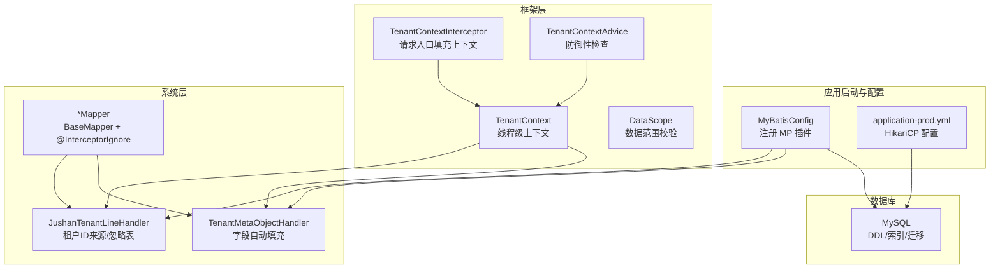
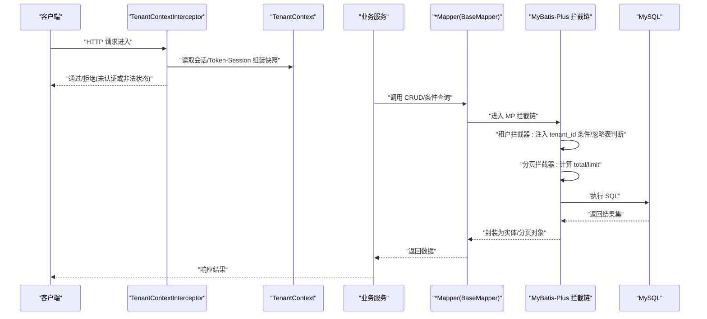
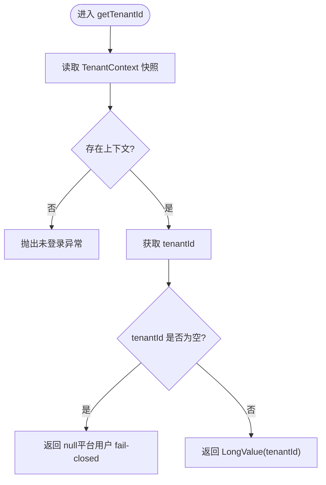
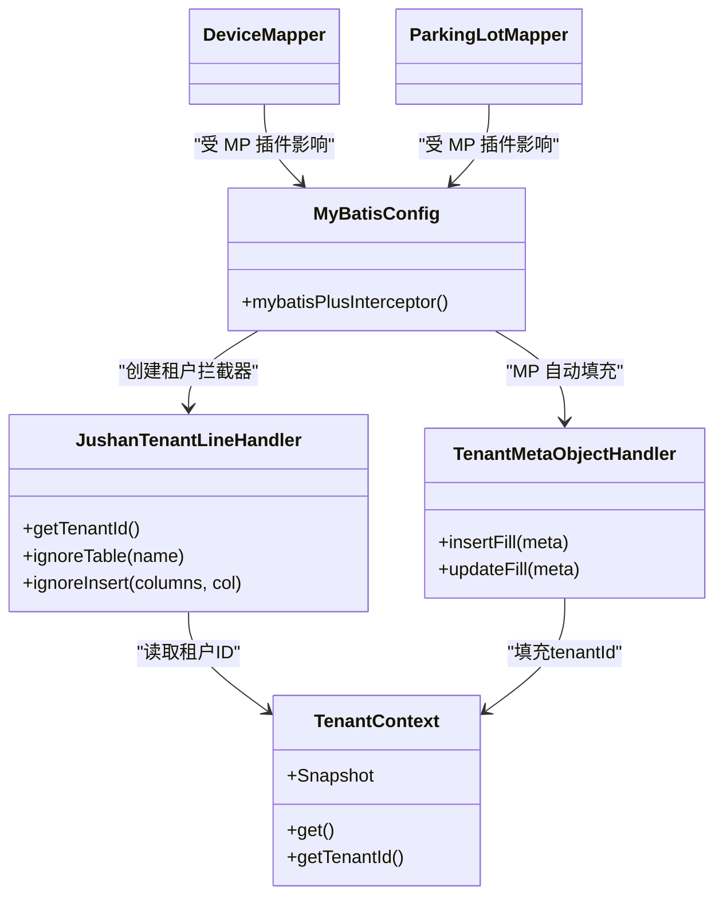
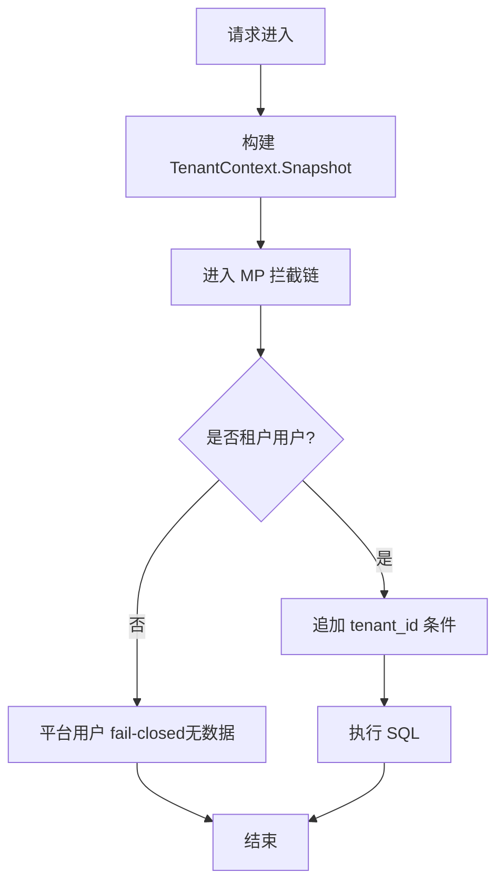

# 数据库操作流

<cite>
**本文引用的文件**   
- [MyBatisConfig.java](file://parking-boot/src/main/java/com/jushan/boot/config/MyBatisConfig.java)
- [JushanTenantLineHandler.java](file://parking-system/src/main/java/com/jushan/system/mybatis/JushanTenantLineHandler.java)
- [TenantMetaObjectHandler.java](file://parking-system/src/main/java/com/jushan/system/mybatis/TenantMetaObjectHandler.java)
- [TenantContext.java](file://parking-framework/src/main/java/com/jushan/framework/auth/TenantContext.java)
- [TenantContextInterceptor.java](file://parking-framework/src/main/java/com/jushan/framework/auth/TenantContextInterceptor.java)
- [TenantContextAdvice.java](file://parking-framework/src/main/java/com/jushan/framework/auth/TenantContextAdvice.java)
- [DataScope.java](file://parking-framework/src/main/java/com/jushan/framework/auth/DataScope.java)
- [DeviceMapper.java](file://parking-system/src/main/java/com/jushan/system/mapper/DeviceMapper.java)
- [ParkingLotMapper.java](file://parking-system/src/main/java/com/jushan/system/mapper/ParkingLotMapper.java)
- [application-prod.yml](file://parking-boot/src/main/resources/application-prod.yml)
- [V20260710001__baseline.sql](file://parking-boot/src/main/resources/db/migration/V20260710001__baseline.sql)
- [V20260712017__parking_record.sql](file://parking-boot/src/main/resources/db/migration/V20260712017__parking_record.sql)
- [V20260711011__device_status_snapshot.sql](file://parking-boot/src/main/resources/db/migration/V20260711011__device_status_snapshot.sql)
- [FlywayMigrationTest.java](file://parking-boot/src/test/java/com/jushan/boot/migration/FlywayMigrationTest.java)
- [section_03_ddl.md](file://docs/开发计划/section_03_ddl.md)
</cite>

## 目录
1. [引言](#引言)
2. [项目结构](#项目结构)
3. [核心组件](#核心组件)
4. [架构总览](#架构总览)
5. [详细组件分析](#详细组件分析)
6. [依赖关系分析](#依赖关系分析)
7. [性能与连接池配置](#性能与连接池配置)
8. [复杂查询优化与索引设计](#复杂查询优化与索引设计)
9. [事务管理与数据一致性](#事务管理与数据一致性)
10. [多租户隔离机制](#多租户隔离机制)
11. [数据库迁移与版本控制](#数据库迁移与版本控制)
12. [最佳实践与常见陷阱](#最佳实践与常见陷阱)
13. [故障排查指南](#故障排查指南)
14. [结论](#结论)

## 引言
本文件聚焦于数据访问层（DAL）的数据库操作流，围绕 MyBatis-Plus 的数据访问设计、实体映射、查询构建、事务管理展开；重点阐述多租户数据隔离的实现机制（包括租户 ID 自动注入与 SQL 改写）、数据库连接池配置与性能优化策略、复杂查询优化技巧与索引设计原则，并给出数据库迁移管理与版本控制策略，以及数据访问层的最佳实践与常见陷阱规避方法。

## 项目结构
本项目采用分层模块化组织：
- parking-framework：提供框架级能力（认证、上下文、拦截器、Web 增强等）
- parking-system：业务领域实现（实体、Mapper、Service、VO/DTO 等）
- parking-boot：应用启动与配置（Spring Boot 配置、资源、迁移脚本、测试）

数据访问相关的关键位置：
- 配置与插件：MyBatis-Plus 插件装配、分页与多租户拦截器
- 多租户处理器：SQL 改写与忽略表白名单
- 元对象填充：公共字段自动填充（含 tenantId）
- Mapper 层：BaseMapper 扩展与 @InterceptorIgnore 使用
- 迁移脚本：Flyway 管理的 DDL 与索引定义

图表来源
- [MyBatisConfig.java:57-75](file://parking-boot/src/main/java/com/jushan/boot/config/MyBatisConfig.java#L57-L75)
- [JushanTenantLineHandler.java:72-114](file://parking-system/src/main/java/com/jushan/system/mybatis/JushanTenantLineHandler.java#L72-L114)
- [TenantMetaObjectHandler.java:33-43](file://parking-system/src/main/java/com/jushan/system/mybatis/TenantMetaObjectHandler.java#L33-L43)
- [TenantContextInterceptor.java:64-199](file://parking-framework/src/main/java/com/jushan/framework/auth/TenantContextInterceptor.java#L64-L199)
- [TenantContextAdvice.java:75-86](file://parking-framework/src/main/java/com/jushan/framework/auth/TenantContextAdvice.java#L75-L86)
- [application-prod.yml:17-27](file://parking-boot/src/main/resources/application-prod.yml#L17-L27)

章节来源
- [MyBatisConfig.java:36-88](file://parking-boot/src/main/java/com/jushan/boot/config/MyBatisConfig.java#L36-L88)
- [application-prod.yml:17-27](file://parking-boot/src/main/resources/application-prod.yml#L17-L27)

## 核心组件
- MyBatis-Plus 插件装配：统一注册多租户拦截器与分页拦截器，控制执行顺序与溢出保护
- 多租户行级隔离处理器：从可信上下文获取租户 ID，提供全局表白名单与插入时不自动注入策略
- 元对象自动填充：INSERT/UPDATE 时自动填充 tenantId、createdAt、updatedAt
- 请求上下文拦截器：在 MVC 拦截阶段完成用户身份与租户上下文的权威装配
- Mapper 扩展：基于 BaseMapper 的 CRUD 能力，结合 @InterceptorIgnore 进行跨租户场景的受控绕过

章节来源
- [MyBatisConfig.java:57-75](file://parking-boot/src/main/java/com/jushan/boot/config/MyBatisConfig.java#L57-L75)
- [JushanTenantLineHandler.java:72-114](file://parking-system/src/main/java/com/jushan/system/mybatis/JushanTenantLineHandler.java#L72-L114)
- [TenantMetaObjectHandler.java:33-43](file://parking-system/src/main/java/com/jushan/system/mybatis/TenantMetaObjectHandler.java#L33-L43)
- [TenantContextInterceptor.java:64-199](file://parking-framework/src/main/java/com/jushan/framework/auth/TenantContextInterceptor.java#L64-L199)
- [DeviceMapper.java:24-26](file://parking-system/src/main/java/com/jushan/system/mapper/DeviceMapper.java#L24-L26)
- [ParkingLotMapper.java:24-26](file://parking-system/src/main/java/com/jushan/system/mapper/ParkingLotMapper.java#L24-L26)

## 架构总览
下图展示了从 HTTP 请求到数据库执行的完整链路，涵盖上下文装配、租户隔离、SQL 改写、分页与自动填充。

图表来源
- [TenantContextInterceptor.java:64-199](file://parking-framework/src/main/java/com/jushan/framework/auth/TenantContextInterceptor.java#L64-L199)
- [MyBatisConfig.java:57-75](file://parking-boot/src/main/java/com/jushan/boot/config/MyBatisConfig.java#L57-L75)
- [JushanTenantLineHandler.java:72-114](file://parking-system/src/main/java/com/jushan/system/mybatis/JushanTenantLineHandler.java#L72-L114)

## 详细组件分析

### 多租户行级隔离处理器（JushanTenantLineHandler）
- 职责
  - 提供 getTenantId()：从 TenantContext 获取当前租户 ID，平台用户返回 null（fail-closed）
  - ignoreTable(tableName)：维护全局表白名单，避免对无 tenant_id 列的表追加条件
  - ignoreInsert(columns, tenantIdColumn)：在无明确租户上下文时不自动注入 tenant_id，交由业务显式设置
- 关键点
  - 租户 ID 来源唯一可信：仅从线程上下文读取，禁止前端传入
  - 代理模式：上下文已替换为目标租户 ID，无需特殊处理
  - 平台用户默认不可访问业务表，除非显式使用 @InterceptorIgnore 或注解开关

图表来源
- [JushanTenantLineHandler.java:72-88](file://parking-system/src/main/java/com/jushan/system/mybatis/JushanTenantLineHandler.java#L72-L88)

章节来源
- [JushanTenantLineHandler.java:72-114](file://parking-system/src/main/java/com/jushan/system/mybatis/JushanTenantLineHandler.java#L72-L114)

### 元对象自动填充（TenantMetaObjectHandler）
- 职责
  - insertFill：填充 tenantId（若上下文有值）、createdAt、updatedAt
  - updateFill：更新 updatedAt
- 关键点
  - 仅在字段存在且当前值为 null 时填充，避免覆盖调用方显式设置
  - 平台用户未指定目标租户时，tenantId 保持 null（如注册流程）

章节来源
- [TenantMetaObjectHandler.java:33-43](file://parking-system/src/main/java/com/jushan/system/mybatis/TenantMetaObjectHandler.java#L33-L43)
- [TenantMetaObjectHandler.java:51-63](file://parking-system/src/main/java/com/jushan/system/mybatis/TenantMetaObjectHandler.java#L51-L63)

### 请求上下文装配（TenantContextInterceptor）
- 职责
  - 在 preHandle 中基于 Sa-Token 判定认证状态，读取 User-Session 与 Token-Session，构建 Snapshot 并写入 ThreadLocal
  - 严格校验 userType 白名单与身份不变量，必要时强制登出并拒绝请求
  - afterCompletion 兜底清理上下文
- 关键点
  - 唯一权威装配点，避免 Filter/Advice 竞争
  - 代理模式下以目标租户 ID 作为数据范围

章节来源
- [TenantContextInterceptor.java:64-199](file://parking-framework/src/main/java/com/jushan/framework/auth/TenantContextInterceptor.java#L64-L199)
- [TenantContextAdvice.java:75-86](file://parking-framework/src/main/java/com/jushan/framework/auth/TenantContextAdvice.java#L75-L86)

### Mapper 层与跨租户受控绕过
- 基础能力
  - 继承 BaseMapper，获得标准 CRUD 与条件构造能力
- 跨租户受控绕过
  - 使用 @InterceptorIgnore(tenantLine = "true") 在特定 Mapper 方法上跳过租户拦截器，用于“先查实体再校验归属”的场景
  - 典型示例：按 ID 查询设备/停车场时忽略租户拦截器，后续由 Service 层做归属校验

章节来源
- [DeviceMapper.java:24-26](file://parking-system/src/main/java/com/jushan/system/mapper/DeviceMapper.java#L24-L26)
- [ParkingLotMapper.java:24-26](file://parking-system/src/main/java/com/jushan/system/mapper/ParkingLotMapper.java#L24-L26)

## 依赖关系分析
- 组件耦合
  - MyBatisConfig 依赖 JushanTenantLineHandler 与分页拦截器
  - JushanTenantLineHandler 依赖 TenantContext 获取租户 ID
  - TenantMetaObjectHandler 依赖 TenantContext 填充 tenantId
  - Mapper 层依赖 MP 插件链（租户/分页）与自动填充
- 外部依赖
  - HikariCP 连接池（生产配置）
  - Flyway 迁移（DDL 版本化）
  - MySQL 8.x（功能索引、字符集等）

图表来源
- [MyBatisConfig.java:57-75](file://parking-boot/src/main/java/com/jushan/boot/config/MyBatisConfig.java#L57-L75)
- [JushanTenantLineHandler.java:72-114](file://parking-system/src/main/java/com/jushan/system/mybatis/JushanTenantLineHandler.java#L72-L114)
- [TenantMetaObjectHandler.java:33-43](file://parking-system/src/main/java/com/jushan/system/mybatis/TenantMetaObjectHandler.java#L33-L43)
- [DeviceMapper.java:24-26](file://parking-system/src/main/java/com/jushan/system/mapper/DeviceMapper.java#L24-L26)
- [ParkingLotMapper.java:24-26](file://parking-system/src/main/java/com/jushan/system/mapper/ParkingLotMapper.java#L24-L26)

章节来源
- [MyBatisConfig.java:36-88](file://parking-boot/src/main/java/com/jushan/boot/config/MyBatisConfig.java#L36-L88)

## 性能与连接池配置
- 连接池（HikariCP）
  - maximum-pool-size、minimum-idle、idle-timeout、connection-timeout 等参数在生产配置中通过环境变量注入，便于弹性调整
- 分页溢出保护
  - 分页拦截器设置最大每页条数，防止深度分页拖垮数据库
- 建议
  - 根据 QPS 与慢查询监控动态调优 pool size
  - 合理设置 idle-timeout 与 connection-timeout，避免连接泄漏与等待超时

章节来源
- [application-prod.yml:17-27](file://parking-boot/src/main/resources/application-prod.yml#L17-L27)
- [MyBatisConfig.java:70-74](file://parking-boot/src/main/java/com/jushan/boot/config/MyBatisConfig.java#L70-L74)

## 复杂查询优化与索引设计
- 设计原则
  - 所有业务表必须包含 tenant_id 与 deleted_at 索引
  - 高频查询建立组合索引，例如 (tenant_id, lot_id, recognize_time)、(tenant_id, lot_id, order_status, created_at)
  - 车牌字段统一大写存储，模糊搜索使用前缀匹配或搜索引擎
  - 时间字段频繁查询时考虑分区或时间索引
  - 大表按 tenant_id 或时间分表/分区规划
  - 乐观锁 version 配合 WHERE version = #{oldVersion} 防并发更新
- 现有索引示例
  - 停车记录：功能性唯一索引 uk_active_parking（同车同场仅允许一条 PARKING），辅助索引 idx_parking_record_lot_status、idx_parking_record_plate、idx_parking_record_entry_event
  - 设备状态快照：idx_device_id_collected、idx_query_success、idx_collected_at 等

章节来源
- [section_03_ddl.md:2014-2028](file://docs/开发计划/section_03_ddl.md#L2014-L2028)
- [V20260712017__parking_record.sql:27-37](file://parking-boot/src/main/resources/db/migration/V20260712017__parking_record.sql#L27-L37)
- [V20260711011__device_status_snapshot.sql:27-31](file://parking-boot/src/main/resources/db/migration/V20260711011__device_status_snapshot.sql#L27-L31)

## 事务管理与数据一致性
- 事务边界
  - 业务方法通过声明式事务标注（如 @Transactional）保证多步写操作的原子性与一致性
- 并发安全
  - 利用数据库唯一索引与乐观锁保障幂等与一致性（如停车记录的功能性唯一索引）
- 审计与可追溯
  - 关键操作写入审计日志，结合 traceId 贯穿请求链路

章节来源
- [V20260712017__parking_record.sql:27-37](file://parking-boot/src/main/resources/db/migration/V20260712017__parking_record.sql#L27-L37)

## 多租户隔离机制
- 上下文来源
  - 请求入口由 TenantContextInterceptor 从 Sa-Token 会话推导用户类型、租户 ID、角色等信息，写入 TenantContext
- SQL 级隔离
  - 多租户拦截器在 SQL 生成阶段自动追加 tenant_id 条件；平台用户返回 null，导致 fail-closed
  - 全局表白名单避免对无 tenant_id 列的表追加条件
- 插入行为
  - 无明确租户上下文时不自动注入 tenant_id，由业务显式设置，避免重复列或与目标租户不一致
- 数据范围校验
  - DataScope 提供 validateTenantMatch 等方法，确保实体归属与当前上下文一致

图表来源
- [TenantContextInterceptor.java:64-199](file://parking-framework/src/main/java/com/jushan/framework/auth/TenantContextInterceptor.java#L64-L199)
- [JushanTenantLineHandler.java:72-114](file://parking-system/src/main/java/com/jushan/system/mybatis/JushanTenantLineHandler.java#L72-L114)
- [DataScope.java:45-56](file://parking-framework/src/main/java/com/jushan/framework/auth/DataScope.java#L45-L56)

章节来源
- [TenantContext.java:27-90](file://parking-framework/src/main/java/com/jushan/framework/auth/TenantContext.java#L27-L90)
- [TenantContextInterceptor.java:64-199](file://parking-framework/src/main/java/com/jushan/framework/auth/TenantContextInterceptor.java#L64-L199)
- [JushanTenantLineHandler.java:72-114](file://parking-system/src/main/java/com/jushan/system/mybatis/JushanTenantLineHandler.java#L72-L114)
- [DataScope.java:45-56](file://parking-framework/src/main/java/com/jushan/framework/auth/DataScope.java#L45-L56)

## 数据库迁移与版本控制
- 工具与策略
  - 使用 Flyway 管理数据库迁移，启用 clean-disabled 保证生产环境不可清理
  - 基线迁移 V20260710001__baseline.sql 初始化基础设施表（如 sys_config）
- 验证与回归
  - 通过 FlywayMigrationTest 验证迁移历史表记录、表结构与幂等性
- 索引与约束
  - 在迁移脚本中集中定义索引与约束，确保一致性

章节来源
- [application-prod.yml:28-33](file://parking-boot/src/main/resources/application-prod.yml#L28-L33)
- [V20260710001__baseline.sql:1-22](file://parking-boot/src/main/resources/db/migration/V20260710001__baseline.sql#L1-L22)
- [FlywayMigrationTest.java:41-55](file://parking-boot/src/test/java/com/jushan/boot/migration/FlywayMigrationTest.java#L41-L55)
- [FlywayMigrationTest.java:100-118](file://parking-boot/src/test/java/com/jushan/boot/migration/FlywayMigrationTest.java#L100-L118)

## 最佳实践与常见陷阱
- 最佳实践
  - 始终通过 TenantContext 获取租户 ID，禁止信任前端传入
  - 使用 @InterceptorIgnore 仅在必要且受控的场景下绕过租户拦截器，并在 Service 层做归属校验
  - 在 INSERT 前确保 tenantId 正确设置（可由自动填充或业务显式设置）
  - 为高频查询建立合适的组合索引，遵循文档中的索引设计原则
  - 使用分页拦截器的最大页限制，避免深度分页
- 常见陷阱
  - 忘记在 finally 中清理上下文（已由拦截器兜底，但自定义异步任务需手动 capture/restore）
  - 将平台用户误认为租户用户导致越权访问（需严格区分 isPlatformUser/isTenantUser）
  - 在未配置 DataSource 的情况下仍扫描 Mapper（可通过 jushan.scan-mappers=false 禁用）
  - 忽略全局表白名单导致 SQL 报错（需在忽略表中包含所有无 tenant_id 列的表）

章节来源
- [TenantContext.java:138-151](file://parking-framework/src/main/java/com/jushan/framework/auth/TenantContext.java#L138-L151)
- [MyBatisConfig.java:36-38](file://parking-boot/src/main/java/com/jushan/boot/config/MyBatisConfig.java#L36-L38)
- [JushanTenantLineHandler.java:107-114](file://parking-system/src/main/java/com/jushan/system/mybatis/JushanTenantLineHandler.java#L107-L114)

## 故障排查指南
- 现象：分页 total 恒为 0
  - 原因：未注册分页拦截器
  - 解决：确认 MyBatisConfig 中已注册 PaginationInnerInterceptor
- 现象：平台用户无法查询任何业务数据
  - 原因：平台用户 tenantId 为 null，SQL 追加 tenant_id = null 导致 fail-closed
  - 解决：如需跨租户访问，使用 @InterceptorIgnore 并在 Service 层做归属校验
- 现象：重复启动后表结构被重复 alter
  - 原因：迁移脚本非幂等
  - 解决：确保迁移脚本幂等，并通过 FlywayMigrationTest 验证
- 现象：未认证但上下文为空
  - 原因：上下文未在拦截器中装配
  - 解决：确认 TenantContextInterceptor 已注册并正常执行

章节来源
- [MyBatisConfig.java:70-74](file://parking-boot/src/main/java/com/jushan/boot/config/MyBatisConfig.java#L70-L74)
- [JushanTenantLineHandler.java:72-88](file://parking-system/src/main/java/com/jushan/system/mybatis/JushanTenantLineHandler.java#L72-L88)
- [FlywayMigrationTest.java:100-118](file://parking-boot/src/test/java/com/jushan/boot/migration/FlywayMigrationTest.java#L100-L118)
- [TenantContextInterceptor.java:64-199](file://parking-framework/src/main/java/com/jushan/framework/auth/TenantContextInterceptor.java#L64-L199)

## 结论
本项目在多租户数据隔离、SQL 改写、分页与自动填充方面形成了清晰而稳健的数据访问层体系。通过可信上下文装配、严格的租户 ID 来源控制、全局表白名单与受控绕过机制，有效避免了跨租户越权风险；结合合理的连接池配置、索引设计与迁移策略，保障了系统的性能与可演进性。建议在后续迭代中持续完善索引覆盖、监控告警与回归测试，确保数据访问层在高并发与复杂查询场景下的稳定性与可观测性。