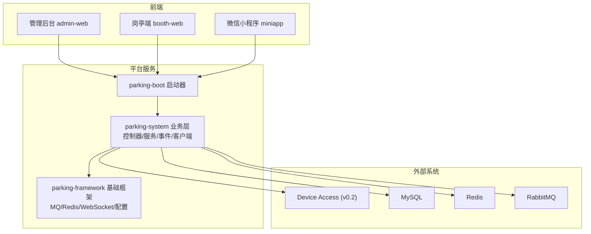
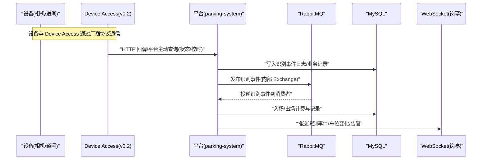
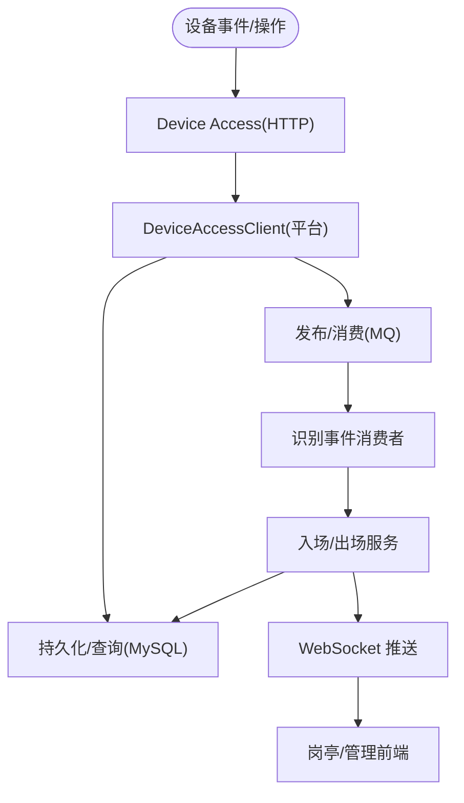
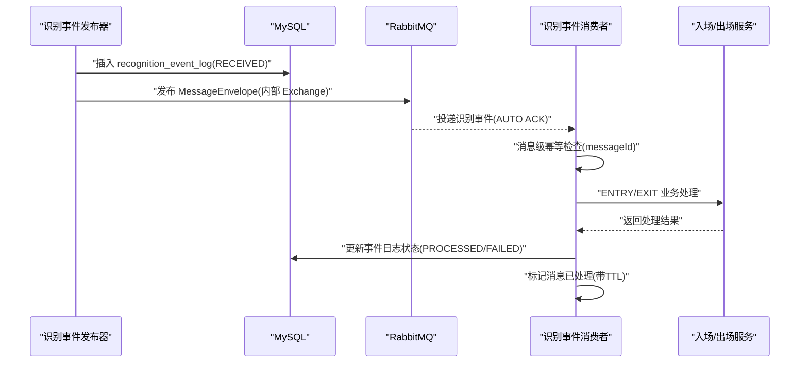
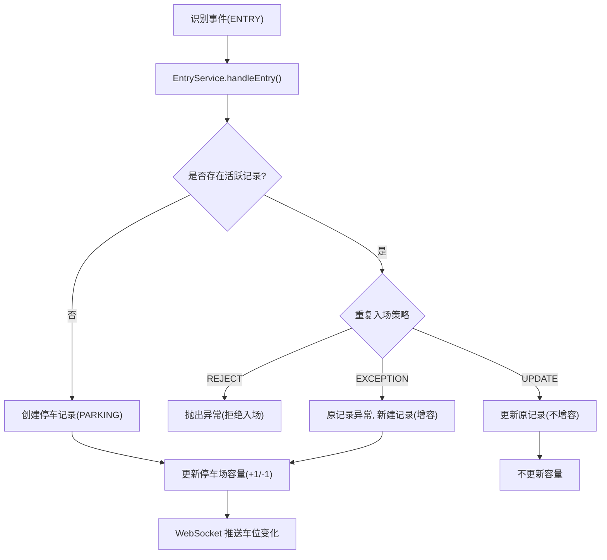
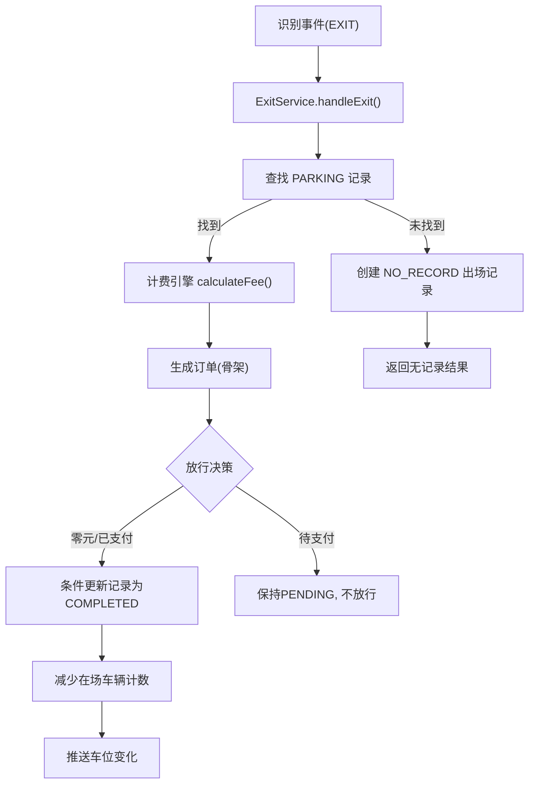
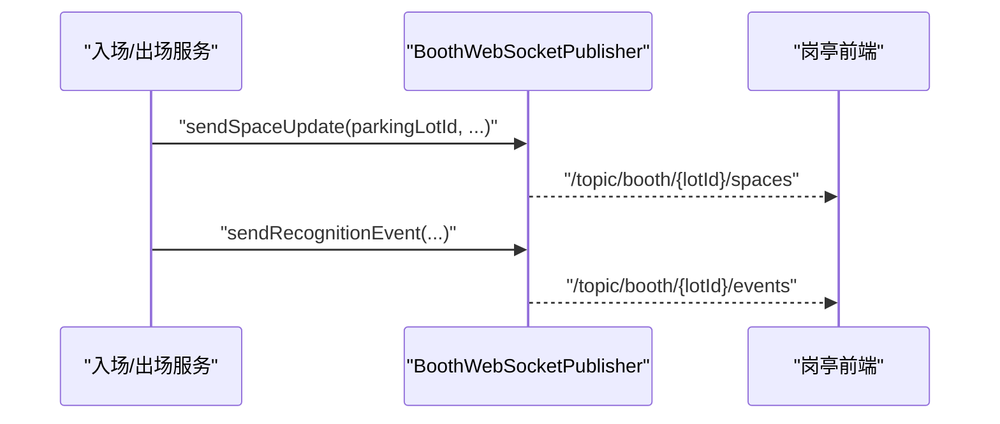
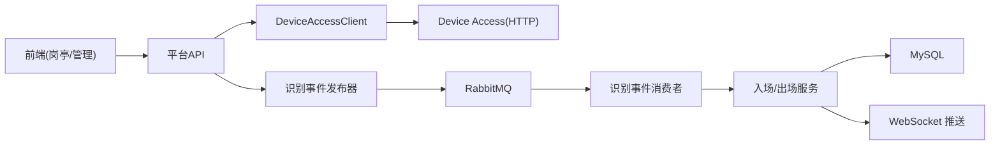

# 数据流设计

<cite>
**本文引用的文件**   
- [README.md](file://README.md)
- [CLAUDE.md](file://CLAUDE.md)
- [DeviceAccessClient.java](file://parking-system/src/main/java/com/jushan/system/client/DeviceAccessClient.java)
- [DeviceAccessProperties.java](file://parking-framework/src/main/java/com/jushan/framework/config/DeviceAccessProperties.java)
- [RecognitionEventPublisher.java](file://parking-system/src/main/java/com/jushan/system/event/RecognitionEventPublisher.java)
- [RabbitMqConfig.java](file://parking-framework/src/main/java/com/jushan/framework/mq/RabbitMqConfig.java)
- [MessageIdempotency.java](file://parking-framework/src/main/java/com/jushan/framework/mq/MessageIdempotency.java)
- [RecognitionEventConsumer.java](file://parking-system/src/main/java/com/jushan/system/event/RecognitionEventConsumer.java)
- [EntryService.java](file://parking-system/src/main/java/com/jushan/system/service/EntryService.java)
- [ExitService.java](file://parking-system/src/main/java/com/jushan/system/service/ExitService.java)
- [BillingEngine.java](file://parking-system/src/main/java/com/jushan/system/service/BillingEngine.java)
- [BoothWebSocketPublisher.java](file://parking-system/src/main/java/com/jushan/system/ws/BoothWebSocketPublisher.java)
- [RedisConfig.java](file://parking-framework/src/main/java/com/jushan/framework/redis/RedisConfig.java)
- [V20260714001__exit_flow_skeleton.sql](file://parking-boot/src/main/resources/db/migration/V20260714001__exit_flow_skeleton.sql)
- [section_03_ddl.md](file://docs/开发计划/section_03_ddl.md)
- [section_04_api.md](file://docs/开发计划/section_04_api.md)
</cite>

## 目录
1. [引言](#引言)
2. [项目结构](#项目结构)
3. [核心组件](#核心组件)
4. [架构总览](#架构总览)
5. [详细组件分析](#详细组件分析)
6. [依赖分析](#依赖分析)
7. [性能考虑](#性能考虑)
8. [故障排查指南](#故障排查指南)
9. [结论](#结论)
10. [附录](#附录)

## 引言
本文件聚焦于平台侧的数据流设计，覆盖以下关键路径与机制：
- HTTP 请求处理流程（设备管理、状态查询、校时等）
- 事件驱动的消息流转（识别事件发布与消费、死信与幂等）
- 数据库读写流程（入场、出场计费、订单与记录）
- 同步调用链与异步消息处理的结合（HTTP + MQ + WebSocket）
- 设备接入数据流向：设备 → Device Access → 平台 → 前端展示
- 缓存一致性策略（Redis 降级与键空间治理）
- 关键业务流程数据流图（车辆入场、出场计费、实时监控推送）
- 数据版本控制与并发控制策略（乐观锁、分布式锁、唯一索引）

当前阶段说明：Device Access v0.2 仅提供有限 HTTP 能力，尚未实现开闸、车牌识别事件上报与 RabbitMQ 桥接；平台侧已预留事件通道与消费者骨架，具备可插拔的 MQ 与 WebSocket 能力。

**章节来源**
- [README.md:1-75](file://README.md#L1-L75)

## 项目结构
系统采用多模块 Maven 工程，核心后端位于 parking-system 与 parking-framework，启动入口在 parking-boot。前端包含管理后台 admin-web、岗亭端 booth-web 与小程序 miniapp。

**图表来源**
- [RabbitMqConfig.java:63-101](file://parking-framework/src/main/java/com/jushan/framework/mq/RabbitMqConfig.java#L63-L101)
- [RedisConfig.java:45-63](file://parking-framework/src/main/java/com/jushan/framework/redis/RedisConfig.java#L45-L63)

**章节来源**
- [README.md:1-75](file://README.md#L1-L75)

## 核心组件
- 设备访问客户端：统一封装对 Device Access 的 HTTP 调用（状态查询、校时），开闸接口预留待 v1.0。
- 识别事件发布器：将标准识别事件持久化到审计日志表，并异步投递至内部 MQ；失败不阻塞主流程。
- 识别事件消费者：从 MQ 消费识别事件，完成消息级幂等、业务校验、车牌标准化、入场/出场处理与结果回写。
- 入场服务：重复入场策略（拒绝/更新/异常）、容量更新、WebSocket 推送车位变化。
- 出场服务：匹配在场记录、计费引擎计算费用、生成订单、决定放行策略、条件更新停车记录与容量。
- 计费引擎：支持免费、固定金额、按小时分段计费（含分时段、日封顶、最大封顶）。
- WebSocket 推送器：向岗亭端实时推送识别事件、车位变化、设备状态与告警。
- 基础设施：RabbitMQ 配置（Exchange/Queue/DLX/JSON 序列化）、Redis 模板（全局前缀、JSON 序列化）、设备访问超时配置。

**章节来源**
- [DeviceAccessClient.java:1-65](file://parking-system/src/main/java/com/jushan/system/client/DeviceAccessClient.java#L1-L65)
- [RecognitionEventPublisher.java:1-127](file://parking-system/src/main/java/com/jushan/system/event/RecognitionEventPublisher.java#L1-L127)
- [RecognitionEventConsumer.java:1-344](file://parking-system/src/main/java/com/jushan/system/event/RecognitionEventConsumer.java#L1-L344)
- [EntryService.java:1-216](file://parking-system/src/main/java/com/jushan/system/service/EntryService.java#L1-L216)
- [ExitService.java:1-309](file://parking-system/src/main/java/com/jushan/system/service/ExitService.java#L1-L309)
- [BillingEngine.java:1-386](file://parking-system/src/main/java/com/jushan/system/service/BillingEngine.java#L1-L386)
- [BoothWebSocketPublisher.java:1-177](file://parking-system/src/main/java/com/jushan/system/ws/BoothWebSocketPublisher.java#L1-L177)
- [RabbitMqConfig.java:1-176](file://parking-framework/src/main/java/com/jushan/framework/mq/RabbitMqConfig.java#L1-L176)
- [RedisConfig.java:1-70](file://parking-framework/src/main/java/com/jushan/framework/redis/RedisConfig.java#L1-L70)
- [DeviceAccessProperties.java:1-43](file://parking-framework/src/main/java/com/jushan/framework/config/DeviceAccessProperties.java#L1-L43)

## 架构总览
整体数据流由“设备 → Device Access → 平台”组成，平台通过 HTTP 同步调用设备能力，通过 MQ 异步处理识别事件，并通过 WebSocket 将实时信息推送到岗亭前端。

**图表来源**
- [RecognitionEventPublisher.java:64-102](file://parking-system/src/main/java/com/jushan/system/event/RecognitionEventPublisher.java#L64-L102)
- [RabbitMqConfig.java:87-101](file://parking-framework/src/main/java/com/jushan/framework/mq/RabbitMqConfig.java#L87-L101)
- [BoothWebSocketPublisher.java:61-87](file://parking-system/src/main/java/com/jushan/system/ws/BoothWebSocketPublisher.java#L61-L87)

## 详细组件分析

### 设备接入数据流（设备 → Device Access → 平台 → 前端）
- 设备侧通过厂商协议与 Device Access 交互；平台仅通过受控 HTTP 调用 Device Access（状态查询、校时），禁止直连设备或解析厂商协议。
- 平台侧通过 DeviceAccessClient 统一封装调用，严格使用可信 device_sn，禁止前端传入 SN。
- 前端（岗亭/管理后台）通过 WebSocket 获取实时状态与事件，避免轮询。

**图表来源**
- [DeviceAccessClient.java:26-64](file://parking-system/src/main/java/com/jushan/system/client/DeviceAccessClient.java#L26-L64)
- [DeviceAccessProperties.java:21-43](file://parking-framework/src/main/java/com/jushan/framework/config/DeviceAccessProperties.java#L21-L43)
- [RecognitionEventConsumer.java:97-176](file://parking-system/src/main/java/com/jushan/system/event/RecognitionEventConsumer.java#L97-L176)
- [BoothWebSocketPublisher.java:97-115](file://parking-system/src/main/java/com/jushan/system/ws/BoothWebSocketPublisher.java#L97-L115)

**章节来源**
- [CLAUDE.md:249-285](file://CLAUDE.md#L249-L285)
- [DeviceAccessClient.java:1-65](file://parking-system/src/main/java/com/jushan/system/client/DeviceAccessClient.java#L1-L65)
- [DeviceAccessProperties.java:1-43](file://parking-framework/src/main/java/com/jushan/framework/config/DeviceAccessProperties.java#L1-L43)

### 识别事件发布与消费（T28/T29）
- 发布器先持久化识别事件日志，再尝试投递 MQ；MQ 不可用或发送失败不影响已持久化的日志。
- 消费者执行消息级幂等（基于 messageId）、业务校验（设备/停车场/车道方向）、车牌标准化、委托入场/出场服务处理，最终更新事件日志状态并标记处理完成。
- 死信队列用于捕获未处理消息，保留原始 messageId 便于人工重放。

**图表来源**
- [RecognitionEventPublisher.java:64-102](file://parking-system/src/main/java/com/jushan/system/event/RecognitionEventPublisher.java#L64-L102)
- [RabbitMqConfig.java:87-101](file://parking-framework/src/main/java/com/jushan/framework/mq/RabbitMqConfig.java#L87-L101)
- [RecognitionEventConsumer.java:97-176](file://parking-system/src/main/java/com/jushan/system/event/RecognitionEventConsumer.java#L97-L176)
- [MessageIdempotency.java:21-38](file://parking-framework/src/main/java/com/jushan/framework/mq/MessageIdempotency.java#L21-L38)

**章节来源**
- [RecognitionEventPublisher.java:1-127](file://parking-system/src/main/java/com/jushan/system/event/RecognitionEventPublisher.java#L1-L127)
- [RecognitionEventConsumer.java:1-344](file://parking-system/src/main/java/com/jushan/system/event/RecognitionEventConsumer.java#L1-L344)
- [RabbitMqConfig.java:1-176](file://parking-framework/src/main/java/com/jushan/framework/mq/RabbitMqConfig.java#L1-L176)
- [MessageIdempotency.java:1-39](file://parking-framework/src/main/java/com/jushan/framework/mq/MessageIdempotency.java#L1-L39)

### 车辆入场流程（T30 + P003）
- 校验通过后进入 EntryService：检查停车场启用状态与重复入场策略（REJECT/UPDATE/EXCEPTION）。
- 正常创建停车记录后，原子更新停车场容量（current_vehicles+1、remaining_spaces-1），并推送车位变化到岗亭。
- 并发保护：uk_active_parking 唯一索引保证同车同场仅一条 PARKING 记录。

**图表来源**
- [EntryService.java:75-134](file://parking-system/src/main/java/com/jushan/system/service/EntryService.java#L75-L134)
- [EntryService.java:163-192](file://parking-system/src/main/java/com/jushan/system/service/EntryService.java#L163-L192)
- [EntryService.java:139-156](file://parking-system/src/main/java/com/jushan/system/service/EntryService.java#L139-L156)

**章节来源**
- [EntryService.java:1-216](file://parking-system/src/main/java/com/jushan/system/service/EntryService.java#L1-L216)
- [section_04_api.md:2252-2273](file://docs/开发计划/section_04_api.md#L2252-L2273)

### 出场计费流程（P004）
- 匹配同停车场未结（PARKING）记录；若未匹配，创建 NO_RECORD 出场记录供运营排查。
- 调用 BillingEngine 计算费用；生成订单（骨架）；根据费用与支付状态决定放行策略（零元/已支付/待支付）。
- 允许放行时，条件更新停车记录为 COMPLETED，减少在场车辆计数，并推送车位变化；同时完成订单状态。

**图表来源**
- [ExitService.java:83-134](file://parking-system/src/main/java/com/jushan/system/service/ExitService.java#L83-L134)
- [ExitService.java:153-180](file://parking-system/src/main/java/com/jushan/system/service/ExitService.java#L153-L180)
- [ExitService.java:201-228](file://parking-system/src/main/java/com/jushan/system/service/ExitService.java#L201-L228)
- [BillingEngine.java:75-128](file://parking-system/src/main/java/com/jushan/system/service/BillingEngine.java#L75-L128)

**章节来源**
- [ExitService.java:1-309](file://parking-system/src/main/java/com/jushan/system/service/ExitService.java#L1-L309)
- [BillingEngine.java:1-386](file://parking-system/src/main/java/com/jushan/system/service/BillingEngine.java#L1-L386)
- [V20260714001__exit_flow_skeleton.sql:33-50](file://parking-boot/src/main/resources/db/migration/V20260714001__exit_flow_skeleton.sql#L33-L50)

### 实时监控推送（P005）
- 识别事件、车位变化、设备状态、异常提醒均通过 BoothWebSocketPublisher 推送至 /topic/booth/{parkingLotId}/...。
- 推送失败不影响主业务事务，确保高可用。

**图表来源**
- [BoothWebSocketPublisher.java:61-87](file://parking-system/src/main/java/com/jushan/system/ws/BoothWebSocketPublisher.java#L61-L87)
- [BoothWebSocketPublisher.java:97-115](file://parking-system/src/main/java/com/jushan/system/ws/BoothWebSocketPublisher.java#L97-L115)

**章节来源**
- [BoothWebSocketPublisher.java:1-177](file://parking-system/src/main/java/com/jushan/system/ws/BoothWebSocketPublisher.java#L1-L177)

## 依赖分析
- 平台与 Device Access 解耦：通过 DeviceAccessClient 统一调用，禁止前端直连与跨域访问。
- MQ 与业务解耦：识别事件发布与消费独立，消费者具备消息级幂等与业务级幂等双重保障。
- 前端与后端解耦：WebSocket 推送实时数据，降低轮询压力。
- 基础设施降级：RabbitMQ 与 Redis 不可用时，应用仍可启动与运行（MQ 静默跳过、Redis 按需注入）。

**图表来源**
- [DeviceAccessClient.java:26-64](file://parking-system/src/main/java/com/jushan/system/client/DeviceAccessClient.java#L26-L64)
- [RecognitionEventPublisher.java:64-102](file://parking-system/src/main/java/com/jushan/system/event/RecognitionEventPublisher.java#L64-L102)
- [RabbitMqConfig.java:87-101](file://parking-framework/src/main/java/com/jushan/framework/mq/RabbitMqConfig.java#L87-L101)
- [RecognitionEventConsumer.java:97-176](file://parking-system/src/main/java/com/jushan/system/event/RecognitionEventConsumer.java#L97-L176)
- [EntryService.java:75-134](file://parking-system/src/main/java/com/jushan/system/service/EntryService.java#L75-L134)
- [ExitService.java:83-134](file://parking-system/src/main/java/com/jushan/system/service/ExitService.java#L83-L134)

**章节来源**
- [CLAUDE.md:249-285](file://CLAUDE.md#L249-L285)
- [RabbitMqConfig.java:1-176](file://parking-framework/src/main/java/com/jushan/framework/mq/RabbitMqConfig.java#L1-L176)
- [RedisConfig.java:1-70](file://parking-framework/src/main/java/com/jushan/framework/redis/RedisConfig.java#L1-L70)

## 性能考虑
- MQ 消费者预取与并发：默认 prefetch=10，并发消费者 1~5，可根据吞吐调整。
- 超时与重试：Device Access 读取超时需覆盖内部 MQTT 等待时间；禁止自动重试，避免重复命令。
- 容量更新原子性：使用 SQL 原子自增/自减，避免热点竞争导致不一致。
- 计费引擎复杂度：按小时分段计费涉及时间区间切分与日封顶聚合，注意分时段规则冲突检测与边界处理。

[本节提供通用指导，无需特定文件引用]

## 故障排查指南
- 识别事件处理失败：查看消费者日志中的失败原因与事件日志状态（FAILED），必要时从死信队列重放。
- 重复入场冲突：关注 uk_active_parking 唯一索引命中日志，确认重复入场策略是否符合预期。
- 出场无记录：核查 NO_RECORD 出场记录与关联事件，定位入场链路缺失环节。
- WebSocket 推送失败：观察推送器警告日志，确认连接与权限，但不影响主业务。
- MQ 不可用：确认 ConnectionFactory 是否可用，发布器会降级为仅持久化日志。

**章节来源**
- [RecognitionEventConsumer.java:162-176](file://parking-system/src/main/java/com/jushan/system/event/RecognitionEventConsumer.java#L162-L176)
- [EntryService.java:177-192](file://parking-system/src/main/java/com/jushan/system/service/EntryService.java#L177-L192)
- [ExitService.java:287-307](file://parking-system/src/main/java/com/jushan/system/service/ExitService.java#L287-L307)
- [BoothWebSocketPublisher.java:83-87](file://parking-system/src/main/java/com/jushan/system/ws/BoothWebSocketPublisher.java#L83-L87)
- [RabbitMqConfig.java:117-139](file://parking-framework/src/main/java/com/jushan/framework/mq/RabbitMqConfig.java#L117-L139)

## 结论
平台侧数据流以“HTTP 同步 + MQ 异步 + WebSocket 实时”为核心模式，结合严格的设备访问约束、消息幂等与业务幂等、数据库唯一索引与条件更新，形成高可靠、可扩展的停车业务数据通路。当前阶段虽受限于 Device Access v0.2 的能力，但已通过预留接口与骨架代码为后续 v1.0 契约落地奠定基础。

[本节为总结性内容，无需特定文件引用]

## 附录

### 缓存数据一致性保证机制
- Redis 模板全局 Key 前缀 jushan:，避免命名冲突；Value 使用 JSON 序列化，便于调试与迁移。
- 当 Redis 不可用时，相关功能可按需降级（如非关键统计），不影响核心业务。
- 车位余量等热点数据建议优先使用数据库原子更新，必要时结合 Redis 做读放大优化，并通过事件驱动进行一致性补偿。

**章节来源**
- [RedisConfig.java:35-63](file://parking-framework/src/main/java/com/jushan/framework/redis/RedisConfig.java#L35-L63)

### 数据版本控制与并发控制策略
- 数据版本控制：优惠券核销等场景使用 version 字段进行乐观锁，防止重复核销。
- 并发控制：余额/库存/积分扣减使用 Redis 分布式锁 + 乐观锁；入场记录通过 uk_active_parking 唯一索引保证强一致。
- 消息幂等：messageId 幂等（防重复投递）与 eventId 业务幂等（防重复记录）双保险。

**章节来源**
- [section_03_ddl.md:701-809](file://docs/开发计划/section_03_ddl.md#L701-L809)
- [MessageIdempotency.java:1-39](file://parking-framework/src/main/java/com/jushan/framework/mq/MessageIdempotency.java#L1-L39)
- [EntryService.java:163-192](file://parking-system/src/main/java/com/jushan/system/service/EntryService.java#L163-L192)