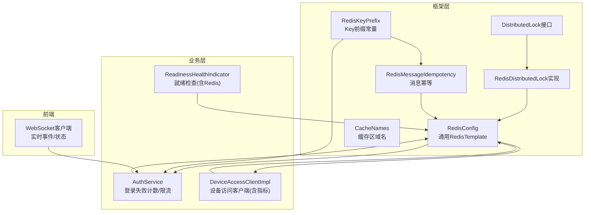
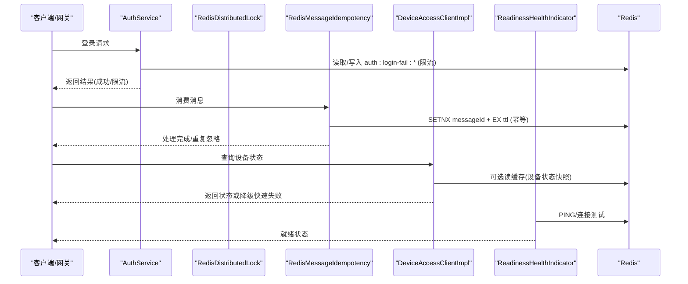
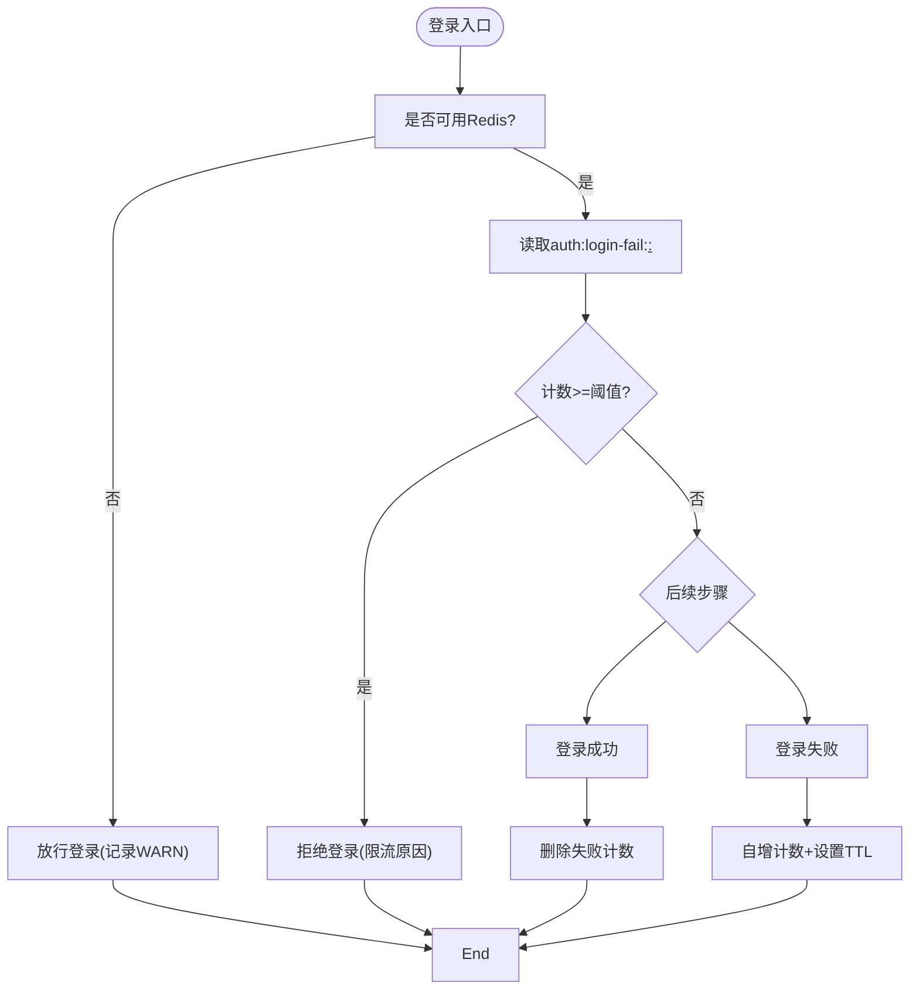
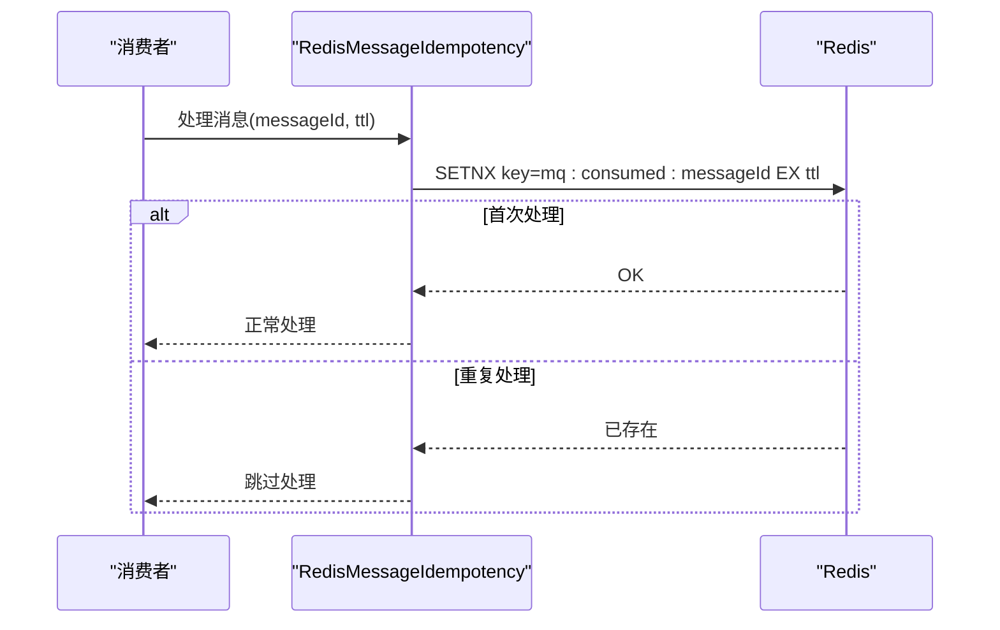
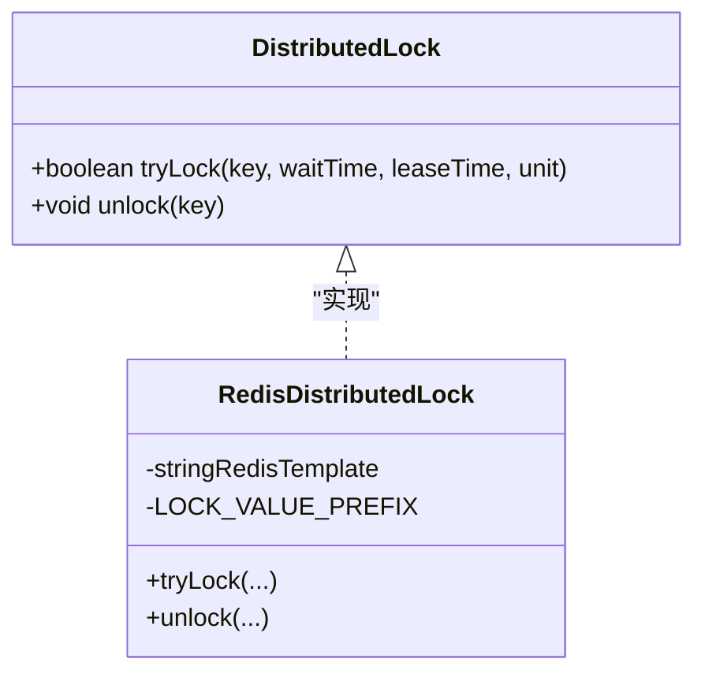
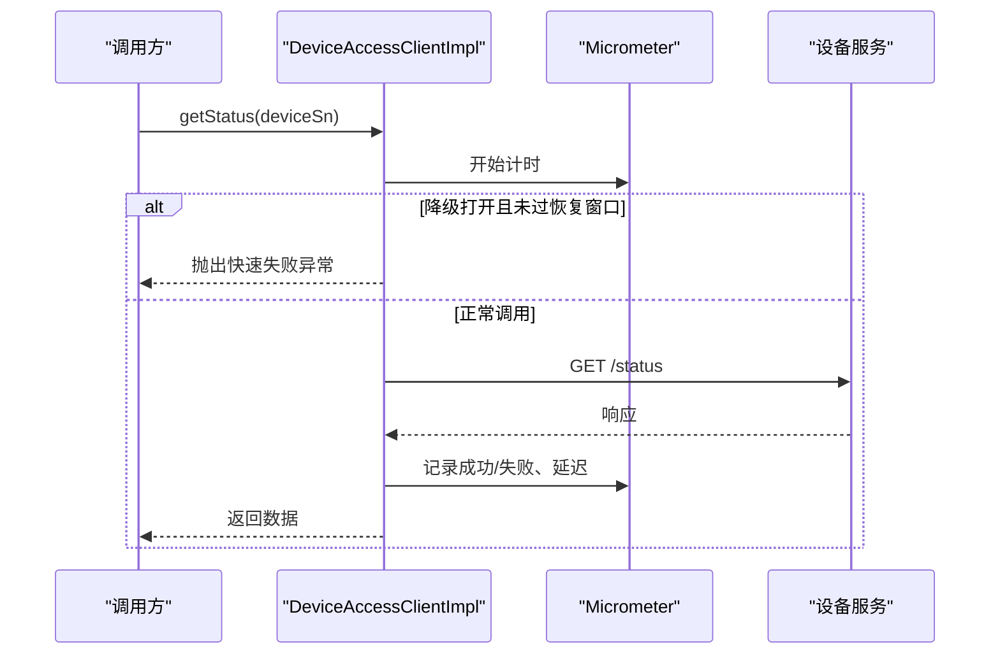
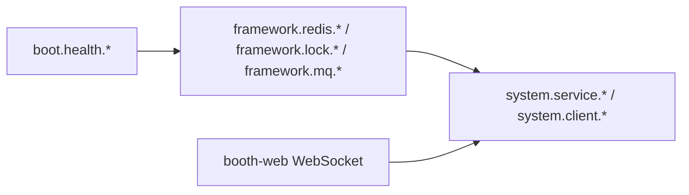

# 缓存数据流

<cite>
**本文引用的文件**   
- [RedisConfig.java](file://parking-framework/src/main/java/com/jushan/framework/redis/RedisConfig.java)
- [CacheNames.java](file://parking-framework/src/main/java/com/jushan/framework/redis/CacheNames.java)
- [RedisKeyPrefix.java](file://parking-framework/src/main/java/com/jushan/framework/redis/RedisKeyPrefix.java)
- [DistributedLock.java](file://parking-framework/src/main/java/com/jushan/framework/lock/DistributedLock.java)
- [RedisDistributedLock.java](file://parking-framework/src/main/java/com/jushan/framework/lock/RedisDistributedLock.java)
- [AuthService.java](file://parking-system/src/main/java/com/jushan/system/service/AuthService.java)
- [RedisMessageIdempotency.java](file://parking-framework/src/main/java/com/jushan/framework/mq/RedisMessageIdempotency.java)
- [DeviceAccessClientImpl.java](file://parking-system/src/main/java/com/jushan/system/client/DeviceAccessClientImpl.java)
- [ReadinessHealthIndicator.java](file://parking-boot/src/main/java/com/jushan/boot/health/ReadinessHealthIndicator.java)
</cite>

## 目录
1. [引言](#引言)
2. [项目结构](#项目结构)
3. [核心组件](#核心组件)
4. [架构总览](#架构总览)
5. [详细组件分析](#详细组件分析)
6. [依赖分析](#依赖分析)
7. [性能考虑](#性能考虑)
8. [故障排查指南](#故障排查指南)
9. [结论](#结论)
10. [附录](#附录)

## 引言
本文件聚焦于系统中的缓存数据流，覆盖用户会话、权限与登录限流、设备状态快照、停车场容量等关键场景；阐述缓存键命名规范与一致性策略；说明分布式环境下的同步与冲突处理；给出穿透、雪崩、热点问题的防护方案；并提供监控指标与优化建议。

## 项目结构
系统在后端框架层提供统一的 Redis 配置、缓存名称常量与 Key 前缀定义，并在业务模块中结合认证、消息幂等、外部客户端降级等能力使用缓存。前端（岗亭端）通过 WebSocket 实时接收设备状态与事件推送，形成“后端缓存 + 前端展示”的闭环。

图表来源
- [RedisConfig.java:27-69](file://parking-framework/src/main/java/com/jushan/framework/redis/RedisConfig.java#L27-L69)
- [CacheNames.java:18-39](file://parking-framework/src/main/java/com/jushan/framework/redis/CacheNames.java#L18-L39)
- [RedisKeyPrefix.java:20-66](file://parking-framework/src/main/java/com/jushan/framework/redis/RedisKeyPrefix.java#L20-L66)
- [DistributedLock.java:33-52](file://parking-framework/src/main/java/com/jushan/framework/lock/DistributedLock.java#L33-L52)
- [RedisDistributedLock.java:30-129](file://parking-framework/src/main/java/com/jushan/framework/lock/RedisDistributedLock.java#L30-L129)
- [RedisMessageIdempotency.java:77-90](file://parking-framework/src/main/java/com/jushan/framework/mq/RedisMessageIdempotency.java#L77-L90)
- [AuthService.java:260-361](file://parking-system/src/main/java/com/jushan/system/service/AuthService.java#L260-L361)
- [DeviceAccessClientImpl.java:92-230](file://parking-system/src/main/java/com/jushan/system/client/DeviceAccessClientImpl.java#L92-L230)
- [ReadinessHealthIndicator.java:39-70](file://parking-boot/src/main/java/com/jushan/boot/health/ReadinessHealthIndicator.java#L39-L70)

章节来源
- [RedisConfig.java:27-69](file://parking-framework/src/main/java/com/jushan/framework/redis/RedisConfig.java#L27-L69)
- [CacheNames.java:18-39](file://parking-framework/src/main/java/com/jushan/framework/redis/CacheNames.java#L18-L39)
- [RedisKeyPrefix.java:20-66](file://parking-framework/src/main/java/com/jushan/framework/redis/RedisKeyPrefix.java#L20-L66)

## 核心组件
- 通用 Redis 配置：统一序列化策略（Key 为 String，Value 为 JSON），并声明全局 Key 前缀常量，便于按环境隔离。
- 缓存名称常量：按业务域划分独立缓存空间，避免不同领域数据混用。
- Key 前缀常量：集中管理所有 Redis Key 的前缀，采用层级化命名，确保可检索、可治理。
- 分布式锁：基于 Redis SET NX PX 的轻量实现，支持超时自动释放与 Lua 原子校验释放。
- 消息幂等：利用 Redis SETNX + TTL 保证消息仅被处理一次。
- 认证与限流：登录失败次数统计与限流，基于 Redis 计数器与过期时间。
- 设备访问客户端：对外部设备服务的调用封装，内置熔断/降级与 Micrometer 指标。
- 健康检查：就绪探针包含数据库与 Redis 连通性检测。

章节来源
- [RedisConfig.java:27-69](file://parking-framework/src/main/java/com/jushan/framework/redis/RedisConfig.java#L27-L69)
- [CacheNames.java:18-39](file://parking-framework/src/main/java/com/jushan/framework/redis/CacheNames.java#L18-L39)
- [RedisKeyPrefix.java:20-66](file://parking-framework/src/main/java/com/jushan/framework/redis/RedisKeyPrefix.java#L20-L66)
- [DistributedLock.java:33-52](file://parking-framework/src/main/java/com/jushan/framework/lock/DistributedLock.java#L33-L52)
- [RedisDistributedLock.java:30-129](file://parking-framework/src/main/java/com/jushan/framework/lock/RedisDistributedLock.java#L30-L129)
- [RedisMessageIdempotency.java:77-90](file://parking-framework/src/main/java/com/jushan/framework/mq/RedisMessageIdempotency.java#L77-L90)
- [AuthService.java:260-361](file://parking-system/src/main/java/com/jushan/system/service/AuthService.java#L260-L361)
- [DeviceAccessClientImpl.java:92-230](file://parking-system/src/main/java/com/jushan/system/client/DeviceAccessClientImpl.java#L92-L230)
- [ReadinessHealthIndicator.java:39-70](file://parking-boot/src/main/java/com/jushan/boot/health/ReadinessHealthIndicator.java#L39-L70)

## 架构总览
下图展示了缓存在各业务链路中的位置与交互关系，包括认证限流、消息幂等、设备状态获取与健康检查。

图表来源
- [AuthService.java:260-361](file://parking-system/src/main/java/com/jushan/system/service/AuthService.java#L260-L361)
- [RedisMessageIdempotency.java:77-90](file://parking-framework/src/main/java/com/jushan/framework/mq/RedisMessageIdempotency.java#L77-L90)
- [DeviceAccessClientImpl.java:92-230](file://parking-system/src/main/java/com/jushan/system/client/DeviceAccessClientImpl.java#L92-L230)
- [ReadinessHealthIndicator.java:39-70](file://parking-boot/src/main/java/com/jushan/boot/health/ReadinessHealthIndicator.java#L39-L70)

## 详细组件分析

### 认证与会话缓存（登录失败计数与限流）
- 使用 Key 前缀 auth:login-fail:<username>:<ip> 记录登录失败次数，设置窗口过期时间，达到阈值直接拒绝登录。
- 当 Redis 不可用时，限流逻辑降级放行并记录告警日志，保障可用性。
- 成功后清除失败计数，避免长期累积。

图表来源
- [AuthService.java:260-361](file://parking-system/src/main/java/com/jushan/system/service/AuthService.java#L260-L361)
- [RedisKeyPrefix.java:20-66](file://parking-framework/src/main/java/com/jushan/framework/redis/RedisKeyPrefix.java#L20-L66)

章节来源
- [AuthService.java:260-361](file://parking-system/src/main/java/com/jushan/system/service/AuthService.java#L260-L361)
- [RedisKeyPrefix.java:20-66](file://parking-framework/src/main/java/com/jushan/framework/redis/RedisKeyPrefix.java#L20-L66)

### 消息幂等（去重与防抖）
- 使用 messageId 作为 Key，SETNX + EX 保证同一消息仅被处理一次。
- 若标记已存在，视为重复消费，直接忽略。

图表来源
- [RedisMessageIdempotency.java:77-90](file://parking-framework/src/main/java/com/jushan/framework/mq/RedisMessageIdempotency.java#L77-L90)
- [RedisKeyPrefix.java:20-66](file://parking-framework/src/main/java/com/jushan/framework/redis/RedisKeyPrefix.java#L20-L66)

章节来源
- [RedisMessageIdempotency.java:77-90](file://parking-framework/src/main/java/com/jushan/framework/mq/RedisMessageIdempotency.java#L77-L90)
- [RedisKeyPrefix.java:20-66](file://parking-framework/src/main/java/com/jushan/framework/redis/RedisKeyPrefix.java#L20-L66)

### 分布式锁（并发控制与互斥）
- 基于 SET key value NX PX ttl 原子命令获取锁，值带唯一标识防止误删。
- 释放时使用 Lua 脚本校验持有者再删除，确保只释放自己持有的锁。
- 当 Redis 不可用时，tryLock 返回 false，调用方可做降级处理。

图表来源
- [DistributedLock.java:33-52](file://parking-framework/src/main/java/com/jushan/framework/lock/DistributedLock.java#L33-L52)
- [RedisDistributedLock.java:30-129](file://parking-framework/src/main/java/com/jushan/framework/lock/RedisDistributedLock.java#L30-L129)

章节来源
- [DistributedLock.java:33-52](file://parking-framework/src/main/java/com/jushan/framework/lock/DistributedLock.java#L33-L52)
- [RedisDistributedLock.java:30-129](file://parking-framework/src/main/java/com/jushan/framework/lock/RedisDistributedLock.java#L30-L129)

### 设备状态缓存与外部服务降级
- DeviceAccessClientImpl 在调用外部设备服务时，注册 Micrometer 指标（调用总数、错误数、延迟、降级状态）。
- 连续失败超过阈值后进入降级（快速失败），超过恢复窗口后尝试恢复。
- 可在上层对设备状态进行缓存（例如设备状态快照），以减少外部依赖压力。

图表来源
- [DeviceAccessClientImpl.java:92-230](file://parking-system/src/main/java/com/jushan/system/client/DeviceAccessClientImpl.java#L92-L230)

章节来源
- [DeviceAccessClientImpl.java:92-230](file://parking-system/src/main/java/com/jushan/system/client/DeviceAccessClientImpl.java#L92-L230)

### 健康检查（Redis 连通性）
- 就绪探针中包含 Redis 连通性检查，用于容器编排与负载均衡的健康判定。
- 当 Redis 缺失或不可用时，健康状态会反映相应细节。

章节来源
- [ReadinessHealthIndicator.java:39-70](file://parking-boot/src/main/java/com/jushan/boot/health/ReadinessHealthIndicator.java#L39-L70)

## 依赖分析
- 框架层提供 Redis 基础能力（序列化、全局前缀、缓存区域名、Key 前缀、分布式锁、消息幂等）。
- 业务层依赖框架层能力实现认证限流、设备访问、健康检查等。
- 前端通过 WebSocket 与后端交互，间接依赖后端缓存提供的实时数据源。

图表来源
- [RedisConfig.java:27-69](file://parking-framework/src/main/java/com/jushan/framework/redis/RedisConfig.java#L27-L69)
- [RedisKeyPrefix.java:20-66](file://parking-framework/src/main/java/com/jushan/framework/redis/RedisKeyPrefix.java#L20-L66)
- [DistributedLock.java:33-52](file://parking-framework/src/main/java/com/jushan/framework/lock/DistributedLock.java#L33-L52)
- [RedisDistributedLock.java:30-129](file://parking-framework/src/main/java/com/jushan/framework/lock/RedisDistributedLock.java#L30-L129)
- [RedisMessageIdempotency.java:77-90](file://parking-framework/src/main/java/com/jushan/framework/mq/RedisMessageIdempotency.java#L77-L90)
- [AuthService.java:260-361](file://parking-system/src/main/java/com/jushan/system/service/AuthService.java#L260-L361)
- [DeviceAccessClientImpl.java:92-230](file://parking-system/src/main/java/com/jushan/system/client/DeviceAccessClientImpl.java#L92-L230)
- [ReadinessHealthIndicator.java:39-70](file://parking-boot/src/main/java/com/jushan/boot/health/ReadinessHealthIndicator.java#L39-L70)

章节来源
- [RedisConfig.java:27-69](file://parking-framework/src/main/java/com/jushan/framework/redis/RedisConfig.java#L27-L69)
- [RedisKeyPrefix.java:20-66](file://parking-framework/src/main/java/com/jushan/framework/redis/RedisKeyPrefix.java#L20-L66)
- [DistributedLock.java:33-52](file://parking-framework/src/main/java/com/jushan/framework/lock/DistributedLock.java#L33-L52)
- [RedisDistributedLock.java:30-129](file://parking-framework/src/main/java/com/jushan/framework/lock/RedisDistributedLock.java#L30-L129)
- [RedisMessageIdempotency.java:77-90](file://parking-framework/src/main/java/com/jushan/framework/mq/RedisMessageIdempotency.java#L77-L90)
- [AuthService.java:260-361](file://parking-system/src/main/java/com/jushan/system/service/AuthService.java#L260-L361)
- [DeviceAccessClientImpl.java:92-230](file://parking-system/src/main/java/com/jushan/system/client/DeviceAccessClientImpl.java#L92-L230)
- [ReadinessHealthIndicator.java:39-70](file://parking-boot/src/main/java/com/jushan/boot/health/ReadinessHealthIndicator.java#L39-L70)

## 性能考虑
- 序列化与内存占用：统一使用 JSON 序列化，注意对象大小与字段裁剪，避免大对象导致内存抖动。
- 过期策略：合理设置 TTL，避免长尾热点键长期驻留；对计数器类 Key 使用短窗口。
- 锁粒度与持有时间：尽量缩小临界区，缩短 leaseTime，降低竞争与死锁风险。
- 降级与快速失败：对外部依赖（如设备服务）启用熔断与快速失败，减少级联放大。
- 健康检查：将 Redis 连通性纳入就绪探针，及时剔除不健康实例。

[本节为通用指导，无需特定文件引用]

## 故障排查指南
- 登录失败计数异常：检查 auth:login-fail:* 键是否存在、TTL 是否正确、是否因 Redis 不可用导致降级放行。
- 消息重复处理：确认 mq:consumed:* 幂等键是否被正确写入与过期；观察消费者重试策略。
- 分布式锁问题：核对锁 Key 命名、持有者值是否一致；查看 Lua 释放脚本执行结果；关注 Redis 不可用时的降级行为。
- 设备服务不可用：查看 DeviceAccessClientImpl 的指标（calls.errors、latency、circuit_breaker.state），判断是否触发降级与恢复。
- 健康检查失败：检查 Redis 连接配置与网络连通性，确认就绪探针输出详情。

章节来源
- [AuthService.java:260-361](file://parking-system/src/main/java/com/jushan/system/service/AuthService.java#L260-L361)
- [RedisMessageIdempotency.java:77-90](file://parking-framework/src/main/java/com/jushan/framework/mq/RedisMessageIdempotency.java#L77-L90)
- [RedisDistributedLock.java:30-129](file://parking-framework/src/main/java/com/jushan/framework/lock/RedisDistributedLock.java#L30-L129)
- [DeviceAccessClientImpl.java:92-230](file://parking-system/src/main/java/com/jushan/system/client/DeviceAccessClientImpl.java#L92-L230)
- [ReadinessHealthIndicator.java:39-70](file://parking-boot/src/main/java/com/jushan/boot/health/ReadinessHealthIndicator.java#L39-L70)

## 结论
本项目在框架层提供了统一的缓存基础设施与规范，在业务层围绕认证限流、消息幂等、设备访问与健康检查等场景落地了缓存使用。通过合理的 Key 命名、过期策略、分布式锁与降级机制，系统在分布式环境下具备较好的稳定性与可观测性。后续可按需引入更完善的缓存注解与多级缓存策略，进一步提升性能与一致性。

[本节为总结，无需特定文件引用]

## 附录

### 缓存键设计规范与命名约定
- 全局前缀：由 RedisConfig 统一附加，示例为 jushan:。
- 层级结构：jushan:模块:子模块:具体标识。
- 命名风格：全小写，单词间用短横线分隔，按领域聚合。
- 常用前缀：
  - 认证与会话：auth:、auth:user-session:、auth:login-fail:
  - 分布式锁：lock:
  - 业务缓存：biz:parking-lot:、biz:device-status:、biz:charge-rule:
  - 通用：cache:、rate-limit:
  - 消息与异步：mq:consumed:、ws:session:

章节来源
- [RedisConfig.java:27-69](file://parking-framework/src/main/java/com/jushan/framework/redis/RedisConfig.java#L27-L69)
- [RedisKeyPrefix.java:20-66](file://parking-framework/src/main/java/com/jushan/framework/redis/RedisKeyPrefix.java#L20-L66)

### 缓存一致性保证机制
- 更新策略：先更新数据库，再删除或更新缓存；对热点数据可采用延迟双删或订阅变更事件。
- 失效处理：为计数器与临时数据设置合理 TTL；对持久数据采用主动失效与被动过期相结合。
- 分布式同步：通过分布式锁保护热点键的并发更新；消息幂等保证下游处理的唯一性。
- 冲突解决：以数据库为权威源，缓存为加速层；出现不一致时优先回源数据库并重建缓存。

章节来源
- [RedisDistributedLock.java:30-129](file://parking-framework/src/main/java/com/jushan/framework/lock/RedisDistributedLock.java#L30-L129)
- [RedisMessageIdempotency.java:77-90](file://parking-framework/src/main/java/com/jushan/framework/mq/RedisMessageIdempotency.java#L77-L90)

### 缓存穿透、雪崩、热点问题防护
- 穿透防护：对空结果也进行短 TTL 缓存；对不存在的数据进行布隆过滤器预检（可选）。
- 雪崩防护：为热点键设置随机过期偏移；对批量失效进行错峰刷新；配合熔断与限流。
- 热点防护：本地缓存 + 分布式缓存两级；读写分离与分片；热点键单独保护与预热。

[本节为通用指导，无需特定文件引用]

### 监控指标与性能优化建议
- 指标采集：
  - 设备访问：调用总数、错误数、延迟、降级状态（Micrometer）。
  - 健康检查：Redis 连通性与就绪状态。
- 优化建议：
  - 合理设置 TTL 与过期策略，避免长尾热点键。
  - 缩小锁粒度与持有时间，降低竞争。
  - 对高频读路径增加本地缓存与缓存预热。
  - 完善告警与追踪，结合 TraceId 定位问题。

章节来源
- [DeviceAccessClientImpl.java:92-230](file://parking-system/src/main/java/com/jushan/system/client/DeviceAccessClientImpl.java#L92-L230)
- [ReadinessHealthIndicator.java:39-70](file://parking-boot/src/main/java/com/jushan/boot/health/ReadinessHealthIndicator.java#L39-L70)