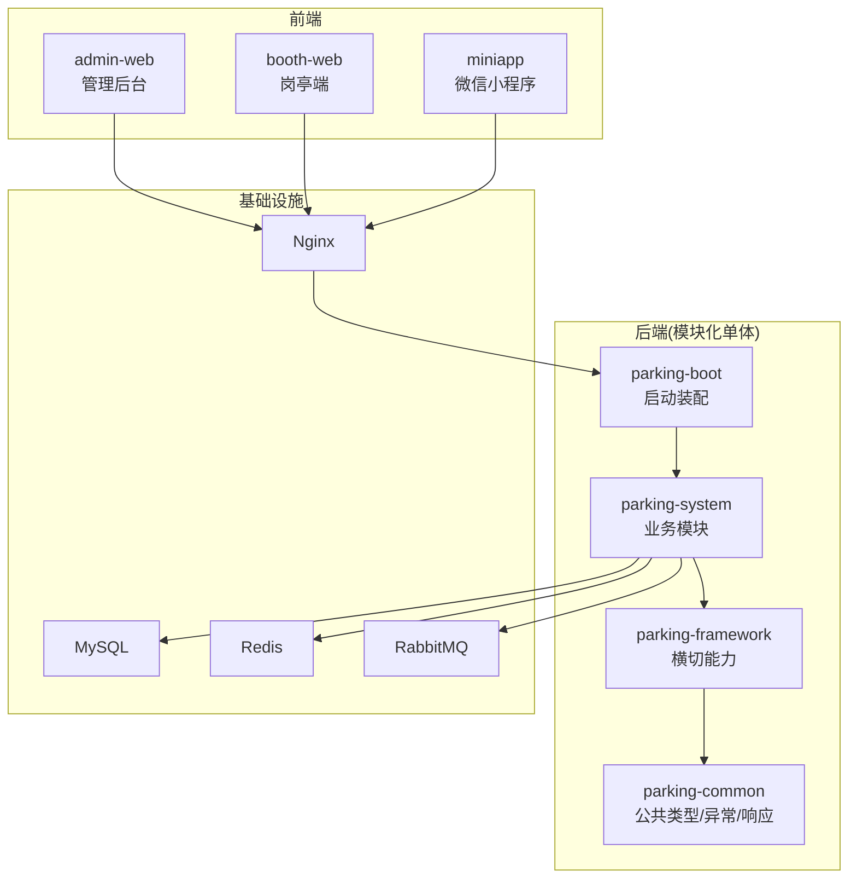
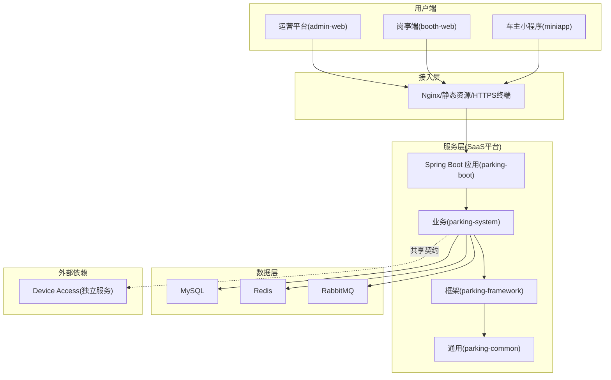
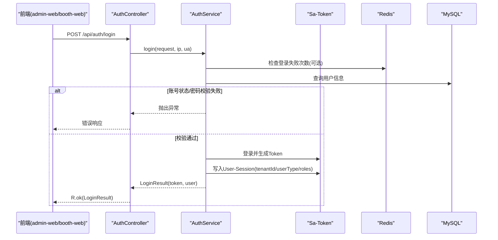
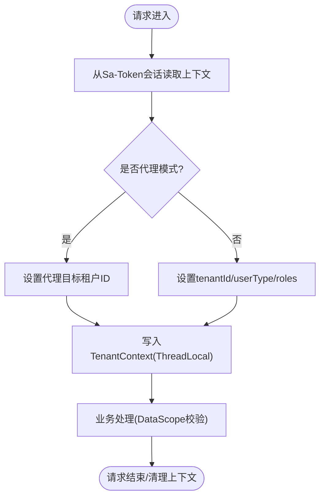
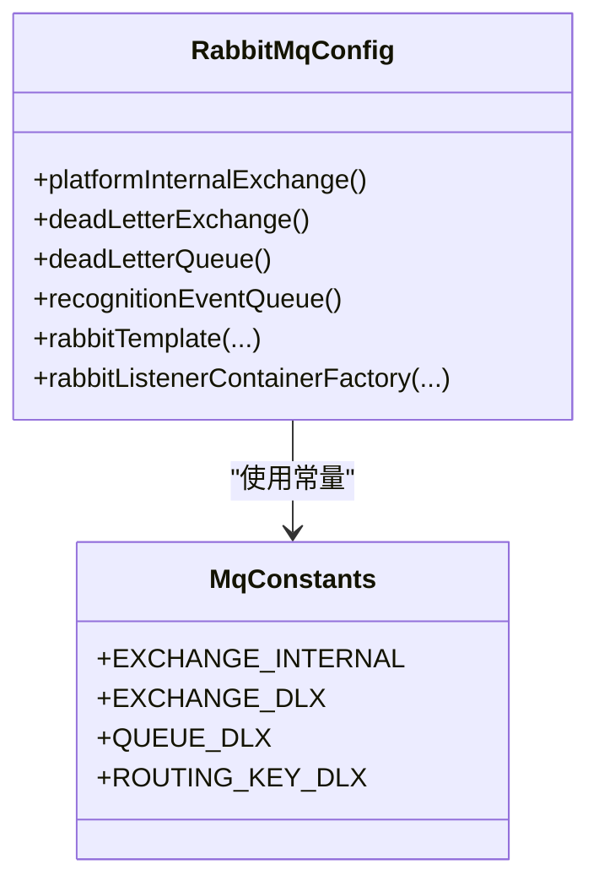
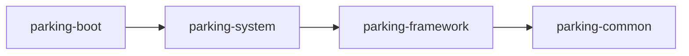

# 整体架构概览

<cite>
**本文引用的文件**   
- [README.md](file://README.md)
- [pom.xml](file://pom.xml)
- [技术架构.md](file://docs/项目概述/技术架构.md)
- [ParkingApplication.java](file://parking-boot/src/main/java/com/jushan/boot/ParkingApplication.java)
- [TenantContext.java](file://parking-framework/src/main/java/com/jushan/framework/auth/TenantContext.java)
- [TenantContextFilter.java](file://parking-framework/src/main/java/com/jushan/framework/auth/TenantContextFilter.java)
- [AuthController.java](file://parking-system/src/main/java/com/jushan/system/controller/AuthController.java)
- [AuthService.java](file://parking-system/src/main/java/com/jushan/system/service/AuthService.java)
- [RabbitMqConfig.java](file://parking-framework/src/main/java/com/jushan/framework/mq/RabbitMqConfig.java)
- [MqConstants.java](file://parking-framework/src/main/java/com/jushan/framework/mq/MqConstants.java)
- [RedisConfig.java](file://parking-framework/src/main/java/com/jushan/framework/redis/RedisConfig.java)
- [配置说明.md](file://docs/部署运维/配置说明.md)
- [V20260711004__tenant_and_registration.sql](file://parking-boot/src/main/resources/db/migration/V20260711004__tenant_and_registration.sql)
- [停车SaaS系统完整需求文档_PRD_V1.0_最终定稿.md](file://docs/需求文档/停车SaaS系统完整需求文档_PRD_V1.0_最终定稿.md)
</cite>

## 目录
1. [引言](#引言)
2. [项目结构](#项目结构)
3. [核心组件](#核心组件)
4. [架构总览](#架构总览)
5. [详细组件分析](#详细组件分析)
6. [依赖关系分析](#依赖关系分析)
7. [性能与可扩展性](#性能与可扩展性)
8. [故障排查指南](#故障排查指南)
9. [结论](#结论)
10. [附录](#附录)

## 引言
本文件面向“智慧停车 SaaS 平台”的整体架构概览，聚焦模块化单体架构的设计思想、四层分层（表现层、业务层、框架层、通用层）的职责边界与依赖关系，并解释多租户 SaaS 模式的数据隔离策略。同时梳理 Spring Boot 3、Vue 3、MySQL、Redis、RabbitMQ 等核心技术选型与落地方式，提供系统上下文图与组件关系图，帮助读者快速建立全局认知。

## 项目结构
仓库采用 Maven 多模块聚合的模块化单体：后端包含 parking-common、parking-framework、parking-system、parking-boot 四个子模块；前端包含 admin-web、booth-web、miniapp 三个工程；基础设施通过 Docker Compose 编排 MySQL、Redis、Nginx 等。

图表来源
- [技术架构.md:54-78](file://docs/项目概述/技术架构.md#L54-L78)
- [pom.xml:46-52](file://pom.xml#L46-L52)

章节来源
- [README.md:1-30](file://README.md#L1-L30)
- [技术架构.md:12-51](file://docs/项目概述/技术架构.md#L12-L51)
- [pom.xml:46-52](file://pom.xml#L46-L52)

## 核心组件
- 应用入口与装配
  - ParkingApplication 统一扫描 com.jushan 包，覆盖 framework/common 及后续业务模块。
- 认证与会话
  - AuthController 暴露登录/退出/会话接口；AuthService 完成限流、密码校验、Sa-Token 登录与会话写入（含租户上下文）。
- 多租户上下文
  - TenantContext 提供线程级可信上下文（tenantId/userId/userType/roles），配合拦截器在请求链路中填充与清理。
- 消息与缓存
  - RabbitMqConfig 声明内部 Exchange/DLX/队列与消费者工厂，支持降级；RedisConfig 定义全局 Key 前缀与序列化策略。
- 数据库迁移
  - Flyway 脚本集中管理，包含租户表、用户表扩展等基线。

章节来源
- [ParkingApplication.java:1-30](file://parking-boot/src/main/java/com/jushan/boot/ParkingApplication.java#L1-L30)
- [AuthController.java:1-100](file://parking-system/src/main/java/com/jushan/system/controller/AuthController.java#L1-L100)
- [AuthService.java:1-362](file://parking-system/src/main/java/com/jushan/system/service/AuthService.java#L1-L362)
- [TenantContext.java:1-257](file://parking-framework/src/main/java/com/jushan/framework/auth/TenantContext.java#L1-L257)
- [RabbitMqConfig.java:23-141](file://parking-framework/src/main/java/com/jushan/framework/mq/RabbitMqConfig.java#L23-L141)
- [RedisConfig.java:1-69](file://parking-framework/src/main/java/com/jushan/framework/redis/RedisConfig.java#L1-L69)
- [V20260711004__tenant_and_registration.sql:9-54](file://parking-boot/src/main/resources/db/migration/V20260711004__tenant_and_registration.sql#L9-L54)

## 架构总览
下图展示三端接入、网关/反向代理、服务层与数据层的交互关系，以及外部设备接入服务（Device Access）的契约协作边界。

图表来源
- [技术架构.md:54-78](file://docs/项目概述/技术架构.md#L54-L78)
- [配置说明.md:22-92](file://docs/部署运维/配置说明.md#L22-L92)

## 详细组件分析

### 认证与会话流程（登录）
该序列图展示了从前端到后端的登录主链路，包括限流、鉴权、会话写入与返回结果。

图表来源
- [AuthController.java:1-100](file://parking-system/src/main/java/com/jushan/system/controller/AuthController.java#L1-L100)
- [AuthService.java:90-177](file://parking-system/src/main/java/com/jushan/system/service/AuthService.java#L90-L177)
- [配置说明.md:70-92](file://docs/部署运维/配置说明.md#L70-L92)

章节来源
- [AuthController.java:1-100](file://parking-system/src/main/java/com/jushan/system/controller/AuthController.java#L1-L100)
- [AuthService.java:1-362](file://parking-system/src/main/java/com/jushan/system/service/AuthService.java#L1-L362)

### 多租户上下文与数据范围
- 上下文来源：登录成功后将 tenantId/userType/roles 写入 Sa-Token User-Session；请求进入时由拦截器读取并填充至 TenantContext（ThreadLocal）。
- 安全原则：前端传入的 tenantId 不可信，所有业务必须通过 TenantContext 获取；平台用户与租户用户严格区分，代理模式限定目标租户范围。
- 数据范围校验：DataScope 强制要求显式确认平台身份后才允许跨租户访问，否则按当前租户过滤。

图表来源
- [TenantContext.java:1-257](file://parking-framework/src/main/java/com/jushan/framework/auth/TenantContext.java#L1-L257)
- [TenantContextFilter.java:1-138](file://parking-framework/src/main/java/com/jushan/framework/auth/TenantContextFilter.java#L1-L138)

章节来源
- [TenantContext.java:1-257](file://parking-framework/src/main/java/com/jushan/framework/auth/TenantContext.java#L1-L257)
- [TenantContextFilter.java:1-138](file://parking-framework/src/main/java/com/jushan/framework/auth/TenantContextFilter.java#L1-L138)

### 消息基础设施（RabbitMQ）
- 平台内部 Exchange/Queue/DLX 由框架层集中声明，业务模块按需订阅/发布。
- 当 RabbitMQ 不可用时，RabbitTemplate 与监听容器工厂优雅降级，不影响非 MQ 场景启动。
- 命名规范与常量集中在 MqConstants，避免与 Device Access 混淆。

图表来源
- [RabbitMqConfig.java:23-141](file://parking-framework/src/main/java/com/jushan/framework/mq/RabbitMqConfig.java#L23-L141)
- [MqConstants.java:1-44](file://parking-framework/src/main/java/com/jushan/framework/mq/MqConstants.java#L1-L44)

章节来源
- [RabbitMqConfig.java:23-141](file://parking-framework/src/main/java/com/jushan/framework/mq/RabbitMqConfig.java#L23-L141)
- [MqConstants.java:1-44](file://parking-framework/src/main/java/com/jushan/framework/mq/MqConstants.java#L1-L44)

### 缓存与键空间（Redis）
- Redis 用于会话存储、限流、分布式锁与热点缓存。
- 自定义 RedisTemplate 统一 Key 前缀与 JSON 序列化，避免键冲突与乱码。
- 关键缓存名称通过 CacheNames 统一管理。

章节来源
- [RedisConfig.java:1-69](file://parking-framework/src/main/java/com/jushan/framework/redis/RedisConfig.java#L1-L69)
- [配置说明.md:42-68](file://docs/部署运维/配置说明.md#L42-L68)

### 多租户 SaaS 数据隔离策略
- 模型层面：业务表普遍包含 tenant_id；平台级表可允许 NULL 或固定值，具体见迁移脚本。
- 访问控制：所有查询需附加 tenant_id 过滤；平台用户仅在显式确认后具备跨租户访问权限。
- 审计与生命周期：租户注册/审核/启停均有审计日志，确保可追溯。

章节来源
- [V20260711004__tenant_and_registration.sql:9-54](file://parking-boot/src/main/resources/db/migration/V20260711004__tenant_and_registration.sql#L9-L54)
- [TenantContext.java:1-257](file://parking-framework/src/main/java/com/jushan/framework/auth/TenantContext.java#L1-L257)

## 依赖关系分析
- 模块依赖方向：parking-boot → parking-system → parking-framework → parking-common，禁止循环依赖与跨层直连 Mapper/实体。
- 前端工程：admin-web、booth-web、miniapp 分别对应运营、岗亭、车主角色，统一通过 Nginx 反向代理访问后端。

图表来源
- [技术架构.md:54-78](file://docs/项目概述/技术架构.md#L54-L78)
- [pom.xml:46-52](file://pom.xml#L46-L52)

章节来源
- [技术架构.md:54-78](file://docs/项目概述/技术架构.md#L54-L78)
- [pom.xml:46-52](file://pom.xml#L46-L52)

## 性能与可扩展性
- 异步化：基于 RabbitMQ 的内部事件通道，解耦识别事件等耗时流程，提升吞吐与弹性。
- 缓存与限流：Redis 承担会话、限流与热点数据缓存，降低数据库压力。
- 连接池与序列化：HikariCP 连接池、Jackson JSON 序列化与统一 Key 前缀，减少 GC 与序列化开销。
- 降级策略：RabbitMQ/Redis 不可用时自动降级，保障核心链路可用性与稳定性。

[本节为通用指导，不直接分析具体文件]

## 故障排查指南
- 登录失败/限流
  - 现象：频繁失败触发限流提示。
  - 排查：检查 Redis 可用性、失败计数 Key 与过期时间；查看登录审计日志。
- 租户上下文缺失
  - 现象：业务报“未登录或会话已过期”。
  - 排查：确认 Token 是否正确传递、Sa-Token 配置与拦截器是否生效、User-Session 是否写入 tenantId/userType。
- 消息未消费
  - 现象：消费者未收到消息或重复消费。
  - 排查：检查 Exchange/Queue/Binding 是否创建成功、DLQ 是否有积压、幂等键是否命中。
- 缓存不一致
  - 现象：读到的数据陈旧。
  - 排查：核对缓存名称与 Key 前缀、更新路径是否失效缓存、TTL 是否合理。

章节来源
- [AuthService.java:263-334](file://parking-system/src/main/java/com/jushan/system/service/AuthService.java#L263-L334)
- [RabbitMqConfig.java:110-141](file://parking-framework/src/main/java/com/jushan/framework/mq/RabbitMqConfig.java#L110-L141)
- [RedisConfig.java:31-63](file://parking-framework/src/main/java/com/jushan/framework/redis/RedisConfig.java#L31-L63)

## 结论
本项目以模块化单体为核心形态，通过清晰的分层与横切能力封装，实现了多租户 SaaS 的安全隔离与稳定运行。前后端分离、统一网关、可靠的消息与缓存基础设施，为后续功能扩展与高可用演进提供了坚实基础。

[本节为总结性内容，不直接分析具体文件]

## 附录
- 技术栈速览
  - 后端：Java 21、Spring Boot 3.5.16、MyBatis-Plus 3.5.9、Sa-Token 1.42.0、Flyway 10.22.0、RabbitMQ 4.x、Redis 7.x、MySQL 8.4。
  - 前端：Vue 3 + TypeScript + Vite + Pinia + Ant Design Vue 4；原生微信小程序。
  - 基础设施：Nginx、Docker Compose。
- 版本与升级原则
  - 后端以根 pom.xml 为准；前端以各工程 package.json 为准；数据库迁移以 Flyway 脚本为准；共享契约以 contracts 目录为准。

章节来源
- [技术架构.md:12-51](file://docs/项目概述/技术架构.md#L12-L51)
- [pom.xml:15-44](file://pom.xml#L15-L44)
- [配置说明.md:22-92](file://docs/部署运维/配置说明.md#L22-L92)