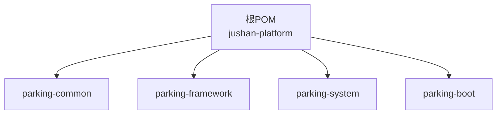
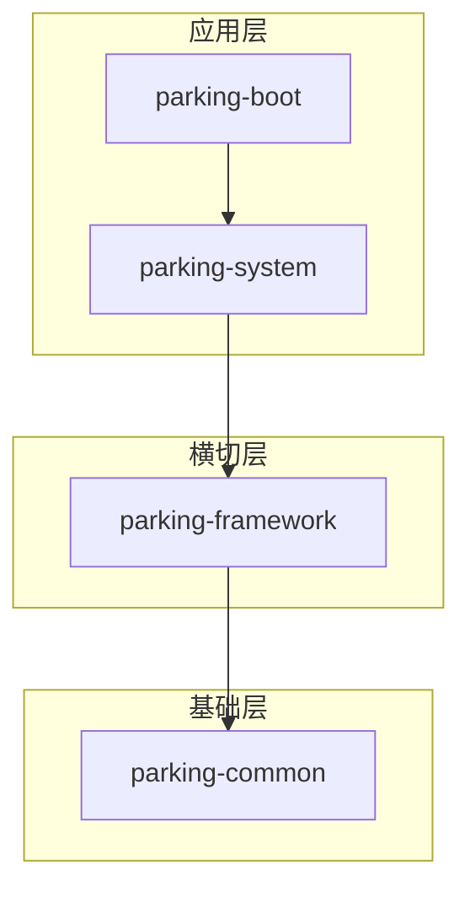
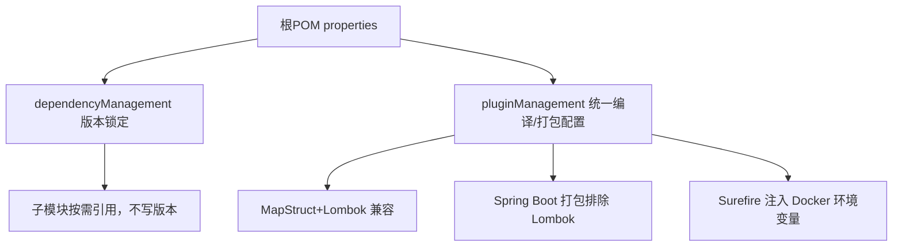
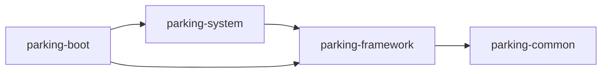

# Maven多模块结构

<cite>
**本文引用的文件**   
- [pom.xml](file://pom.xml)
- [parking-common/pom.xml](file://parking-common/pom.xml)
- [parking-framework/pom.xml](file://parking-framework/pom.xml)
- [parking-system/pom.xml](file://parking-system/pom.xml)
- [parking-boot/pom.xml](file://parking-boot/pom.xml)
- [技术架构.md](file://docs/项目概述/技术架构.md)
- [T02-架构模块与前端工程方案冻结.md](file://docs/归档/平台侧/T02-架构模块与前端工程方案冻结.md)
</cite>

## 目录
1. [简介](#简介)
2. [项目结构](#项目结构)
3. [核心组件](#核心组件)
4. [架构总览](#架构总览)
5. [详细组件分析](#详细组件分析)
6. [依赖关系分析](#依赖关系分析)
7. [性能与构建特性](#性能与构建特性)
8. [故障排查指南](#故障排查指南)
9. [结论](#结论)
10. [附录](#附录)

## 简介
本仓库采用 Maven 多模块单体架构，根 POM 统一管理版本、插件与依赖，四个核心模块按“通用能力 → 横切框架 → 业务系统 → 启动装配”的分层组织。该分层设计明确了职责边界、约束了依赖方向，避免循环依赖，并通过集中式依赖管理确保全仓版本一致性与可维护性。

## 项目结构
根 POM 声明了四个子模块：parking-common、parking-framework、parking-system、parking-boot。各模块通过继承父 POM 获得统一的 Java 版本、编码、插件与依赖版本策略。

图表来源
- [pom.xml:47-52](file://pom.xml#L47-L52)

章节来源
- [pom.xml:1-52](file://pom.xml#L1-L52)

## 核心组件
- parking-common：纯 Java 基础类型与错误码、统一响应体等，不依赖 Spring 容器，作为所有上层模块的公共基础。
- parking-framework：横切能力（认证鉴权、租户上下文、全局异常处理、TraceId、Redis、RabbitMQ、WebSocket 等），依赖 Spring Boot 生态。
- parking-system：业务系统与领域模型、控制器、服务、数据访问等，依赖 framework 提供的横切能力。
- parking-boot：应用启动入口、自动装配、健康检查、跨模块扫描与运行期依赖（如 Actuator、Flyway、MySQL 驱动）。

章节来源
- [parking-common/pom.xml:13-23](file://parking-common/pom.xml#L13-L23)
- [parking-framework/pom.xml:13-83](file://parking-framework/pom.xml#L13-L83)
- [parking-system/pom.xml:13-60](file://parking-system/pom.xml#L13-L60)
- [parking-boot/pom.xml:13-115](file://parking-boot/pom.xml#L13-L115)

## 架构总览
整体依赖方向自顶向下：boot → system → framework → common。common 无内部依赖；framework 仅依赖 common；system 依赖 framework；boot 聚合 framework 与 system，并引入运行期基础设施。

图表来源
- [pom.xml:47-52](file://pom.xml#L47-L52)
- [parking-framework/pom.xml:17-22](file://parking-framework/pom.xml#L17-L22)
- [parking-system/pom.xml:17-22](file://parking-system/pom.xml#L17-L22)
- [parking-boot/pom.xml:18-27](file://parking-boot/pom.xml#L18-L27)

章节来源
- [技术架构.md:54-78](file://docs/项目概述/技术架构.md#L54-L78)
- [T02-架构模块与前端工程方案冻结.md:173-215](file://docs/归档/平台侧/T02-架构模块与前端工程方案冻结.md#L173-L215)

## 详细组件分析

### 根 POM 与依赖管理策略
- 继承 Spring Boot Parent，统一 Java 21、UTF-8 编码与构建环境。
- 使用 properties 集中声明内部模块版本与第三方库版本（MyBatis-Plus、Sa-Token、Flyway、Hutool、MapStruct、Testcontainers 等）。
- dependencyManagement 中声明内部模块与关键第三方依赖的版本，子模块引用时不写版本号，保证一致性。
- build.pluginManagement 统一 MapStruct + Lombok 注解处理器顺序与 Spring Boot 打包排除 Lombok。
- Surefire 传递 Testcontainers 所需 Docker 环境变量，保障测试环境一致性。

图表来源
- [pom.xml:24-44](file://pom.xml#L24-L44)
- [pom.xml:55-140](file://pom.xml#L55-L140)
- [pom.xml:160-214](file://pom.xml#L160-L214)

章节来源
- [pom.xml:1-217](file://pom.xml#L1-L217)

### parking-common：通用基础模块
- 定位：纯工具与基础类型，不依赖 Spring 容器，降低耦合度。
- 依赖：仅引入 Jackson 注解用于序列化标注，保持最小化依赖面。
- 产出：统一响应体、错误码、业务异常等，供上层复用。

章节来源
- [parking-common/pom.xml:13-23](file://parking-common/pom.xml#L13-L23)

### parking-framework：横切能力模块
- 定位：提供认证鉴权（Sa-Token）、租户上下文、全局异常处理、TraceId、Redis、RabbitMQ、WebSocket 等横切能力。
- 依赖：
  - 内部：parking-common
  - 外部：Web、Validation、AOP、Data Redis、Sa-Token、AMQP、WebSocket、Commons Pool2 等
- 设计原则：面向接口暴露能力，业务模块通过依赖注入或注解方式使用，避免侵入业务代码。

章节来源
- [parking-framework/pom.xml:13-83](file://parking-framework/pom.xml#L13-L83)

### parking-system：业务系统模块
- 定位：实现停车平台的核心业务域（用户、权限、设备、计费、监控等）的数据访问与服务编排。
- 依赖：
  - 内部：parking-framework
  - 外部：MyBatis-Plus、Hutool、Micrometer、MySQL 驱动（runtime）
- 设计原则：以 Service 为边界，Controller 仅做请求适配；禁止跨模块直接操作 Mapper/实体，避免破坏分层。

章节来源
- [parking-system/pom.xml:13-60](file://parking-system/pom.xml#L13-L60)
- [技术架构.md:54-78](file://docs/项目概述/技术架构.md#L54-L78)

### parking-boot：启动装配与应用入口
- 定位：应用启动类、自动装配、健康检查、跨模块组件扫描、运行期依赖（Actuator、Flyway、JDBC、Prometheus 等）。
- 依赖：
  - 内部：parking-framework、parking-system
  - 外部：MyBatis-Plus、Actuator、JDBC、Flyway、MySQL 驱动（runtime）、Micrometer Prometheus Registry、测试相关（WireMock、Testcontainers）
- 设计原则：只负责装配与运行期支撑，不包含业务逻辑。

章节来源
- [parking-boot/pom.xml:13-115](file://parking-boot/pom.xml#L13-L115)

## 依赖关系分析

### 模块依赖图

图表来源
- [parking-framework/pom.xml:17-22](file://parking-framework/pom.xml#L17-L22)
- [parking-system/pom.xml:17-22](file://parking-system/pom.xml#L17-L22)
- [parking-boot/pom.xml:18-27](file://parking-boot/pom.xml#L18-L27)

### 依赖方向约束与循环依赖避免
- 明确单向依赖：boot → system → framework → common。
- 禁止跨层直连底层（例如 boot 不应直接依赖 common 以外的更深层细节），禁止反向依赖。
- 文档层面冻结规则：禁止跨模块直接操作 Mapper/实体，禁止循环依赖。

章节来源
- [技术架构.md:54-78](file://docs/项目概述/技术架构.md#L54-L78)
- [T02-架构模块与前端工程方案冻结.md:173-215](file://docs/归档/平台侧/T02-架构模块与前端工程方案冻结.md#L173-L215)

### 构建顺序说明
Maven 根据模块间依赖关系自动确定构建顺序，遵循“被依赖先构建”的原则：
- 先构建 parking-common
- 再构建 parking-framework
- 然后构建 parking-system
- 最后构建 parking-boot

章节来源
- [pom.xml:47-52](file://pom.xml#L47-L52)

### 版本管理与统一策略
- 内部模块版本：通过根 POM 的 jushan.version 属性统一，并在 dependencyManagement 中声明，子模块引用时无需指定版本。
- 第三方依赖版本：在根 POM 的 properties 中集中定义，在 dependencyManagement 中锁定版本，子模块仅声明 groupId/artifactId。
- 插件与编译器：通过 pluginManagement 统一 MapStruct + Lombok 注解处理器顺序，避免编译期冲突。

章节来源
- [pom.xml:24-44](file://pom.xml#L24-L44)
- [pom.xml:55-140](file://pom.xml#L55-L140)
- [pom.xml:160-214](file://pom.xml#L160-L214)

## 性能与构建特性
- 构建并行：Maven 支持 -T 参数并行构建，结合合理的模块拆分可显著缩短构建时间。
- 增量编译：合理划分模块可减少重复编译范围，提升增量构建效率。
- 测试隔离：Testcontainers 通过 Surefire 环境变量注入，保证测试环境与生产环境一致性，减少因环境差异导致的回归问题。

[本节为通用指导，无需源码引用]

## 故障排查指南
- 构建失败（版本冲突）：检查是否在某子模块显式引入了未受 dependencyManagement 管理的版本，优先改为从根 POM 继承。
- 运行时找不到 Bean：确认启动类所在包能覆盖到需要扫描的模块包路径，或在启动类上配置 @ComponentScan 包含对应包。
- 数据库迁移失败：核对 Flyway 脚本命名与执行顺序，以及 MySQL 驱动是否在运行期可用。
- 测试无法连接外部资源：确认 Docker 环境可达，且 Surefire 已正确注入 DOCKER_HOST 等环境变量。

章节来源
- [pom.xml:201-214](file://pom.xml#L201-L214)
- [parking-boot/pom.xml:66-75](file://parking-boot/pom.xml#L66-L75)

## 结论
本项目的 Maven 多模块结构通过清晰的层次划分与严格的依赖方向约束，实现了高内聚、低耦合的可维护单体架构。根 POM 的集中式版本与插件管理确保了全仓一致性与可演进性。未来新增业务模块应遵循“仅依赖 framework/common，由 boot 聚合”的规则，持续避免循环依赖与跨层耦合。

[本节为总结性内容，无需源码引用]

## 附录

### 为什么采用这种分层架构及好处
- 清晰职责：common 提供纯工具，framework 提供横切能力，system 承载业务，boot 负责装配与运行期支撑。
- 稳定依赖：单向依赖与集中版本管理降低升级风险与冲突概率。
- 可测试性：测试依赖集中在 boot，便于集成测试与 Mock 外部依赖。
- 可扩展性：新增业务模块只需依赖 framework/system，无需改动底层能力。

章节来源
- [T02-架构模块与前端工程方案冻结.md:106-215](file://docs/归档/平台侧/T02-架构模块与前端工程方案冻结.md#L106-L215)