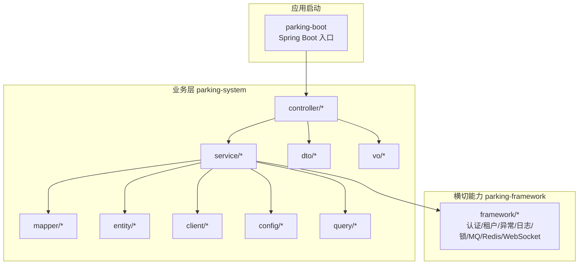
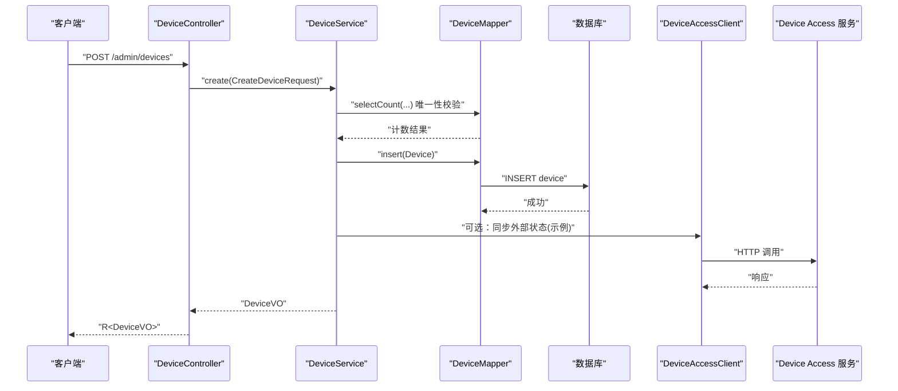
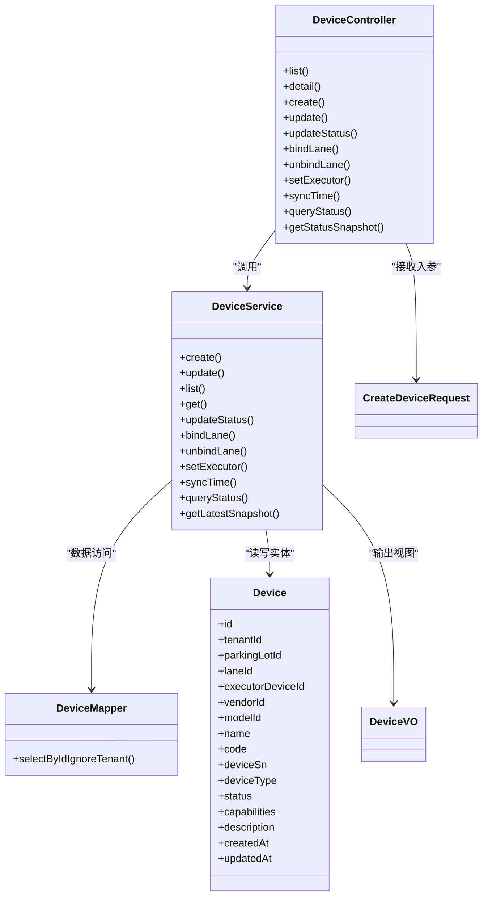

# 包组织结构

<cite>
**本文引用的文件**   
- [README.md](file://README.md)
- [DeviceController.java](file://parking-system/src/main/java/com/jushan/system/controller/DeviceController.java)
- [DeviceService.java](file://parking-system/src/main/java/com/jushan/system/service/DeviceService.java)
- [DeviceMapper.java](file://parking-system/src/main/java/com/jushan/system/mapper/DeviceMapper.java)
- [Device.java](file://parking-system/src/main/java/com/jushan/system/entity/Device.java)
- [CreateDeviceRequest.java](file://parking-system/src/main/java/com/jushan/system/dto/CreateDeviceRequest.java)
- [DeviceVO.java](file://parking-system/src/main/java/com/jushan/system/vo/DeviceVO.java)
- [package-info.java](file://parking-framework/src/main/java/com/jushan/framework/package-info.java)
</cite>

## 目录
1. [简介](#简介)
2. [项目结构](#项目结构)
3. [核心组件](#核心组件)
4. [架构总览](#架构总览)
5. [详细组件分析](#详细组件分析)
6. [依赖关系分析](#依赖关系分析)
7. [性能与可扩展性考虑](#性能与可扩展性考虑)
8. [故障排查指南](#故障排查指南)
9. [结论](#结论)
10. [附录：新功能开发规范](#附录新功能开发规范)

## 简介
本文件聚焦 parking-system 模块的包组织与分层架构，解释 controller、service、entity、mapper、dto、vo、query、client、config 等包的职责边界与协作方式，并给出 Controller → Service → Mapper → Entity 的数据流向说明。同时总结命名规范与代码组织约定，阐述横切能力在 framework 模块中的组织方式，并提供包结构图与示例路径，帮助在新功能开发时遵循统一规范。

## 项目结构
parking-system 采用按“层次 + 领域”混合的组织方式：
- 层次维度：controller、service、mapper、entity、dto、vo、query、client、config 等包体现分层职责
- 领域维度：以业务域（如设备、计费、租户、权限）为线索组织类名与包内文件

图示来源
- [DeviceController.java:1-315](file://parking-system/src/main/java/com/jushan/system/controller/DeviceController.java#L1-L315)
- [DeviceService.java:1-800](file://parking-system/src/main/java/com/jushan/system/service/DeviceService.java#L1-L800)
- [DeviceMapper.java:1-28](file://parking-system/src/main/java/com/jushan/system/mapper/DeviceMapper.java#L1-L28)
- [Device.java:1-134](file://parking-system/src/main/java/com/jushan/system/entity/Device.java#L1-L134)
- [CreateDeviceRequest.java:1-83](file://parking-system/src/main/java/com/jushan/system/dto/CreateDeviceRequest.java#L1-L83)
- [DeviceVO.java:1-86](file://parking-system/src/main/java/com/jushan/system/vo/DeviceVO.java#L1-L86)
- [package-info.java:1-19](file://parking-framework/src/main/java/com/jushan/framework/package-info.java#L1-L19)

章节来源
- [README.md:1-75](file://README.md#L1-L75)

## 核心组件
- controller：HTTP 接口入口，负责参数校验、权限注解、调用 service、封装响应体
- service：业务编排与事务边界，组合多个 mapper/client 完成领域逻辑，输出 VO
- entity：数据库表映射对象，承载持久化字段
- mapper：数据访问接口，基于 MyBatis-Plus BaseMapper 扩展自定义 SQL
- dto：请求入参对象，承载校验约束
- vo：响应视图对象，面向前端展示
- query：查询条件对象（建议用于复杂查询场景）
- client：对外部系统（如 Device Access）的 HTTP 客户端封装
- config：业务级配置类（框架级配置在 framework 模块）

章节来源
- [DeviceController.java:1-315](file://parking-system/src/main/java/com/jushan/system/controller/DeviceController.java#L1-L315)
- [DeviceService.java:1-800](file://parking-system/src/main/java/com/jushan/system/service/DeviceService.java#L1-L800)
- [DeviceMapper.java:1-28](file://parking-system/src/main/java/com/jushan/system/mapper/DeviceMapper.java#L1-L28)
- [Device.java:1-134](file://parking-system/src/main/java/com/jushan/system/entity/Device.java#L1-L134)
- [CreateDeviceRequest.java:1-83](file://parking-system/src/main/java/com/jushan/system/dto/CreateDeviceRequest.java#L1-L83)
- [DeviceVO.java:1-86](file://parking-system/src/main/java/com/jushan/system/vo/DeviceVO.java#L1-L86)
- [package-info.java:1-19](file://parking-framework/src/main/java/com/jushan/framework/package-info.java#L1-L19)

## 架构总览
分层数据流与控制流如下：
- 请求进入 controller，进行参数校验与权限检查
- controller 委托 service 执行业务逻辑
- service 通过 mapper 读写 entity，必要时调用 client 访问外部系统
- service 将 entity 转换为 vo 返回给 controller
- 全局异常处理与 TraceId 由 framework 提供

图示来源
- [DeviceController.java:1-315](file://parking-system/src/main/java/com/jushan/system/controller/DeviceController.java#L1-L315)
- [DeviceService.java:1-800](file://parking-system/src/main/java/com/jushan/system/service/DeviceService.java#L1-L800)
- [DeviceMapper.java:1-28](file://parking-system/src/main/java/com/jushan/system/mapper/DeviceMapper.java#L1-L28)
- [Device.java:1-134](file://parking-system/src/main/java/com/jushan/system/entity/Device.java#L1-L134)
- [CreateDeviceRequest.java:1-83](file://parking-system/src/main/java/com/jushan/system/dto/CreateDeviceRequest.java#L1-L83)
- [DeviceVO.java:1-86](file://parking-system/src/main/java/com/jushan/system/vo/DeviceVO.java#L1-L86)

## 详细组件分析

### 控制器层（controller）
- 职责：暴露 REST API；使用权限注解进行鉴权；接收 DTO；调用 Service；包装为统一响应 R<T>；记录关键操作日志
- 典型实现要点：
  - 使用 @SaCheckPermission 控制权限
  - 使用 @Valid 触发 DTO 校验
  - 对关键操作记录结构化日志
- 参考路径
  - [DeviceController.java:1-315](file://parking-system/src/main/java/com/jushan/system/controller/DeviceController.java#L1-L315)

章节来源
- [DeviceController.java:1-315](file://parking-system/src/main/java/com/jushan/system/controller/DeviceController.java#L1-L315)

### 服务层（service）
- 职责：业务编排与事务边界；组合多个 Mapper/Client 完成领域逻辑；进行安全与一致性校验；转换 VO
- 典型实现要点：
  - 使用 @Transactional 管理事务
  - 从上下文推导租户范围并进行数据隔离校验
  - 对外部调用进行异常捕获与审计记录
- 参考路径
  - [DeviceService.java:1-800](file://parking-system/src/main/java/com/jushan/system/service/DeviceService.java#L1-L800)

章节来源
- [DeviceService.java:1-800](file://parking-system/src/main/java/com/jushan/system/service/DeviceService.java#L1-L800)

### 数据访问层（mapper）
- 职责：定义数据访问接口；继承 BaseMapper 获得基础 CRUD；按需扩展自定义 SQL
- 典型实现要点：
  - 使用 @InterceptorIgnore 绕过租户拦截器进行跨域查询
  - 使用 @Select/@Param 编写简单 SQL
- 参考路径
  - [DeviceMapper.java:1-28](file://parking-system/src/main/java/com/jushan/system/mapper/DeviceMapper.java#L1-L28)

章节来源
- [DeviceMapper.java:1-28](file://parking-system/src/main/java/com/jushan/system/mapper/DeviceMapper.java#L1-L28)

### 实体层（entity）
- 职责：与数据库表一一对应；承载持久化字段与时间戳
- 典型实现要点：
  - 使用 @TableName 指定表名
  - 使用 @TableId 指定主键策略
- 参考路径
  - [Device.java:1-134](file://parking-system/src/main/java/com/jushan/system/entity/Device.java#L1-L134)

章节来源
- [Device.java:1-134](file://parking-system/src/main/java/com/jushan/system/entity/Device.java#L1-L134)

### 请求/响应模型（dto/vo）
- dto：入参对象，承载校验注解与输入约束
- vo：出参对象，面向前端展示，可聚合关联信息
- 参考路径
  - [CreateDeviceRequest.java:1-83](file://parking-system/src/main/java/com/jushan/system/dto/CreateDeviceRequest.java#L1-L83)
  - [DeviceVO.java:1-86](file://parking-system/src/main/java/com/jushan/system/vo/DeviceVO.java#L1-L86)

章节来源
- [CreateDeviceRequest.java:1-83](file://parking-system/src/main/java/com/jushan/system/dto/CreateDeviceRequest.java#L1-L83)
- [DeviceVO.java:1-86](file://parking-system/src/main/java/com/jushan/system/vo/DeviceVO.java#L1-L86)

### 外部客户端（client）
- 职责：封装对 Device Access 等外部系统的 HTTP 调用，屏蔽网络细节与错误码
- 参考路径
  - [DeviceService.java:1-800](file://parking-system/src/main/java/com/jushan/system/service/DeviceService.java#L1-L800)

章节来源
- [DeviceService.java:1-800](file://parking-system/src/main/java/com/jushan/system/service/DeviceService.java#L1-L800)

### 配置（config）
- 职责：业务级配置类，集中管理业务相关常量与开关
- 参考路径
  - [DeviceService.java:1-800](file://parking-system/src/main/java/com/jushan/system/service/DeviceService.java#L1-L800)

章节来源
- [DeviceService.java:1-800](file://parking-system/src/main/java/com/jushan/system/service/DeviceService.java#L1-L800)

### 横切关注点（framework）
- 职责：提供全局异常处理、TraceId、可信租户上下文、权限集成、日志脱敏、分布式锁、消息队列、缓存、WebSocket 鉴权等通用能力
- 参考路径
  - [package-info.java:1-19](file://parking-framework/src/main/java/com/jushan/framework/package-info.java#L1-L19)

章节来源
- [package-info.java:1-19](file://parking-framework/src/main/java/com/jushan/framework/package-info.java#L1-L19)

## 依赖关系分析
- 单向依赖：controller → service → (mapper, client, config)
- 数据模型：service 将 entity 转换为 vo 返回
- 横切能力：service 依赖 framework 提供的租户上下文、权限、异常处理等

图示来源
- [DeviceController.java:1-315](file://parking-system/src/main/java/com/jushan/system/controller/DeviceController.java#L1-L315)
- [DeviceService.java:1-800](file://parking-system/src/main/java/com/jushan/system/service/DeviceService.java#L1-L800)
- [DeviceMapper.java:1-28](file://parking-system/src/main/java/com/jushan/system/mapper/DeviceMapper.java#L1-L28)
- [Device.java:1-134](file://parking-system/src/main/java/com/jushan/system/entity/Device.java#L1-L134)
- [CreateDeviceRequest.java:1-83](file://parking-system/src/main/java/com/jushan/system/dto/CreateDeviceRequest.java#L1-L83)
- [DeviceVO.java:1-86](file://parking-system/src/main/java/com/jushan/system/vo/DeviceVO.java#L1-L86)

## 性能与可扩展性考虑
- 分页查询：列表接口使用分页插件，避免全表扫描
- 快照机制：设备状态查询支持“最新快照”，减少频繁外部调用
- 限流与并发：批量查询使用信号量限制并发度，单个失败不影响其他设备
- 幂等与审计：对外部命令（如校时、开闸占位）进行审计记录，便于追踪与人工确认
- 扩展点：新增业务可通过新增 controller/service/mapper/entity 快速接入，保持分层清晰

[本节为通用指导，不直接分析具体文件]

## 故障排查指南
- 权限问题：检查 controller 方法上的权限注解是否匹配当前用户角色
- 租户隔离：确认 service 中是否正确从上下文推导租户范围并进行归属校验
- 外部调用失败：查看 service 中对 client 调用的异常捕获与审计记录
- 数据不一致：检查事务边界与乐观锁更新条件，确保并发安全
- 日志定位：结合 TraceId 过滤器与结构化日志快速定位链路

章节来源
- [DeviceController.java:1-315](file://parking-system/src/main/java/com/jushan/system/controller/DeviceController.java#L1-L315)
- [DeviceService.java:1-800](file://parking-system/src/main/java/com/jushan/system/service/DeviceService.java#L1-L800)
- [package-info.java:1-19](file://parking-framework/src/main/java/com/jushan/framework/package-info.java#L1-L19)

## 结论
parking-system 采用清晰的层次化包结构，配合 framework 的横切能力，实现了高内聚、低耦合的可维护架构。通过统一的命名规范与组织约定，新功能开发可以快速落地并保持风格一致。

[本节为总结性内容，不直接分析具体文件]

## 附录：新功能开发规范
- 包组织
  - 新增控制器：在 controller 下按领域创建 XxxController
  - 新增服务：在 service 下创建 XxxService，标注事务边界
  - 新增数据访问：在 mapper 下创建 XxxMapper，继承 BaseMapper
  - 新增实体：在 entity 下创建 XxxEntity，对应数据库表
  - 新增请求/响应：在 dto/vo 下分别创建 XxxRequest/XxxVO
  - 新增查询条件：在 query 下创建 XxxQuery（复杂查询时使用）
  - 新增外部调用：在 client 下创建 XxxClient 封装 HTTP 调用
  - 新增配置：在 config 下创建 XxxConfig 或 XxxProperties
- 命名规范
  - 包名小写，类名大驼峰，方法名小驼峰
  - 常量全大写加下划线
  - 请求/响应对象后缀 Request/VO
- 数据流向
  - Controller → Service → Mapper → Entity
  - Service 将 Entity 转换为 VO 返回
- 横切能力
  - 使用 framework 提供的租户上下文、权限、异常处理、TraceId 等
- 示例路径
  - 控制器：[DeviceController.java:1-315](file://parking-system/src/main/java/com/jushan/system/controller/DeviceController.java#L1-L315)
  - 服务：[DeviceService.java:1-800](file://parking-system/src/main/java/com/jushan/system/service/DeviceService.java#L1-L800)
  - 数据访问：[DeviceMapper.java:1-28](file://parking-system/src/main/java/com/jushan/system/mapper/DeviceMapper.java#L1-L28)
  - 实体：[Device.java:1-134](file://parking-system/src/main/java/com/jushan/system/entity/Device.java#L1-L134)
  - 请求：[CreateDeviceRequest.java:1-83](file://parking-system/src/main/java/com/jushan/system/dto/CreateDeviceRequest.java#L1-L83)
  - 响应：[DeviceVO.java:1-86](file://parking-system/src/main/java/com/jushan/system/vo/DeviceVO.java#L1-L86)
  - 横切能力：[package-info.java:1-19](file://parking-framework/src/main/java/com/jushan/framework/package-info.java#L1-L19)